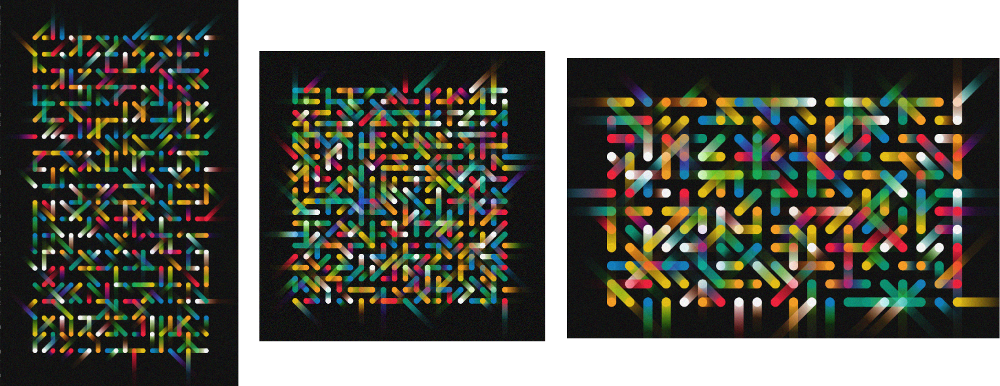

In this assignment you will create an abstract interactive artwork focussed on sound.

The goal of this assignment is to create an interactive sound artwork with an
abstract visual component. Your work should be **engaging**, **coherent**, and
use interaction to **enhance experience**. The sound and visuals should work
together coherently and invite a viewer to engage in the work. The interaction
in your work engage the viewer in exploration, and set up a _feedback loop_
between viewer and artwork. You should represent a deepening of the experience
by allowing viewers to open new scenes or significant transformations of the
work through interaction.

This assignment is a significant departure from the first two which were about
_representational_ art, and did not include sound. You'll have to think
carefully about the lectures and work you have completed in labs which have
helped prepare you for this point. Creating an abstract work can seem
difficult, but it can also be _freeing_ compared to creating detailed and realistic
drawings of characters or objects.

## Outline

- **Due:** {{ page.deadline }}
- **Assignment template:** [available on GitLab (link)]({{ page.template_repo }})
- **Specification:** keep reading 🙂
- **Weighting:** {{ page.weighting }}
- **Marked out of:** _ / {{ page.available_marks }}
- **Submission:** submit your assignment through
  [Gitlab]() ([full instructions
  below](#submission-process))
- **Policies:** no late submissions accepted; this is an individual assessment
- **Rubric:** Please see the relevant assessment task on the class summary for your course:
   - [COMP1720](https://programsandcourses.anu.edu.au/2024/course/COMP1720/Second20Semester/9174#assessmenttask-3)
   - [COMP6720](https://programsandcourses.anu.edu.au/2024/course/COMP6720/Second20Semester/9213#assessmenttask-3)

## Requirements

Your submission **must**:

- **be abstract**: it should use forms, colours, lines, and sounds that are not intended to reference or represent the real world, it should not use characters or representations or real objects
- **be a sound artwork**: your artwork should have a significant sonic component including **both** synthesised and sampled sounds using `p5.sound`
- **be interactive:** the viewer should be able to interact with the artwork using the keyboard and mouse 
- **be engaging and coherent:** use what you know about drawing and interaction in p5 to make your submission an _artwork_ that grabs the viewer's attention and demands exploration
- **use interaction to enhance experience:** this means that interacting with your work reveals aspects that are not available without interaction, and that deeper interaction leads to more engaging experiences
- **be** a p5.js sketch that [takes the whole browser window](#canvas-size)
   - i.e.: `createCanvas(windowWidth, windowHeight)`
- **use** fractions of `width` and `height` for drawing and interaction
- **include** a `thumbnail.png` file (a static image of your submission)
- **include** the code in the usual `sketch.js` file
- **include** an artist statement (max 200 words) describing your artwork (see below)
- **include** a `references.md` file with **at least two** external references and any self references (see box below)
   - these can be from classmates, artworks, books, online sources, any reference is fine as long as there are two (or more) of them.

:::warning
Because this assignment is allowing you include [external assets](#using-images)
which you may have made yourself, we need you to be clear about this 
and **include** entries in your `references.md` file for **all** assets 
that you use, _including ones that you have made yourself_ (make sure you state that you are the source for assets created by you). This is so 
that there is no confusion when it comes time to mark on whether the
asset was sourced externally, or if you have created it yourself.
:::

And a few "must nots":

- **must not include image files** _unless_ you have created them yourself (e.g., with a camera or digital art software), or they come from [unsplash.com](https://unsplash.com)
- **must not include sound files** _unless_ you have created them yourself (e.g., with the record function on your phone), or they come from [freesound.org](https://freesound.org)
- **must not be a game**: the specification is for an interactive artwork, not an "art-themed game". If your artwork involves a "score" or a concept of winning or losing, you may actually be [making a game](/resources/07-games/).
- **must include references** for any image or sound files that you include (even if you created them yourself).

### The artist statement

Your submission **must** include a short (max 200 words) artist statement. This is a
short document, written in the first person, which explains:

- What your interactive artwork is.
- How interaction enhances the viewer's experience.

The artist statement is your chance to explain how interaction enhances the viewer's experience in your submission---don't assume that we can guess. 

You won't receive a separate mark for the artist statement. It is considered as part of your whole submission. The artist statement is used to help evaluate your ability to design and construct an interactive artwork in line with the assignment specification. 

## Getting started

Here's the process for working on the assignment:

1. fork & clone the [assignment repo]()

2. add whatever code you like to make a cool/interesting submission

3. when you run the sketch, hitting `spacebar` will save a still image of the
   sketch (as a `thumbnail.png` file in your Downloads folder)

4. when you're happy with your `thumbnail.png`, copy it into your assignment 
   folder (this will overwrite the previous version) and commit the new version
   to the repo (and push it up to the [GitLab server]({{ site.gitlab_url }}))

:::info
If you're new to Git and you'd like a helping hand, there are some [git help
videos](/resources/04-screencasts/) (from 2018, but still pretty
spot-on) on the resources page.
:::

## Submission process {#submission-process}

1. fork the assignment template repository from the [Gitlab server]()

2. clone[^own-fork] & work on *your* fork of the assignment 1 repo, regularly
   committing & pushing your changes to the GitLab server

3. at the submission deadline, the latest commit[^branch] [pushed to the GitLab
   server](/resources/01-faq/#is-it-pushed) (not on
   your local machine!) will count as your submission

[^own-fork]:
    make sure you clone **your own fork** (i.e. the one with your uni ID in the
    url) to your local machine, not the template (because obviously you aren't
    able to change the template for everyone---GitLab won't let you)

[^branch]:
    it's the **main** branch which counts as your submission---which is the
    default anyway (if you've just followed all the instructions then you've
    been working on the master branch all along)

:::warning
One thing to note is that there are some "checks" which the GitLab server runs
to help you out. So if you get a **pipeline failed** email, then [have a look at
the FAQ](/resources/01-faq/#gitlab-ci).
:::

### Submission checklist

1. my project satisfies the [requirements](#requirements)

2. my completed assignment has been [pushed to the GitLab
   server](/resources/01-faq/#is-it-pushed), and
   **all** the required files (*your* versions of `artist-statement.md`,
   `references.md`, `thumbnail.png` and `sketch.js`) have made it to
   the server

3. my `references.md` file includes at least two external references, as well as references for external files that I have created, and *everything* not mentioned in there is my own work

4. i have viewed and tested my submission on the [test URL](/resources/01-faq/#test-url) and it displays / works correctly

## FAQ

### Canvas Size and Reactive Design {#canvas-size}

As we are getting later in the course, we are expecting a higher level 
of sophistication with your submissions. As such this assignment uses 
`createCanvas(windowWidth, windowHeight)` instead of a fixed width and 
height value.

This means that you will _need_ to be using `width` and `height` to 
calculate positions and make sure your submission looks great 
regardless of where it is being viewed, whether that is a phone, an 
old CRT monitor or a laptop.

This means that your submission should still look great even if 
the aspect ratio changes, eg: (vertical, square, widescreen)

### Can I use images or sounds from the internet? {#using-images}

You may only use images or sounds that you create yourself (preferred) or if they come from [unsplash.com](https://unsplash.com) or [freesound.org](https://freesound.org).

All image and sound files must be cited in your `references.md` regardless of whether you created them or not.

### Can I use *insert advanced p5 feature here*?

Yes, as long as it doesn't involve using images (see above). We may not be able to help with some advanced p5 and JavaScript that isn't included in the course so far.

### How do I submit my references & artist statement?

The template repo contains "starter" files for both of these. You should
change these files to put your own content in there, and commit & push the
files up with the rest of your submission.

Basically, *everything* you need to submit is in that Git repository---as
long as you make the changes in there, commit them and push them up to the
GitLab server then you're all good.

