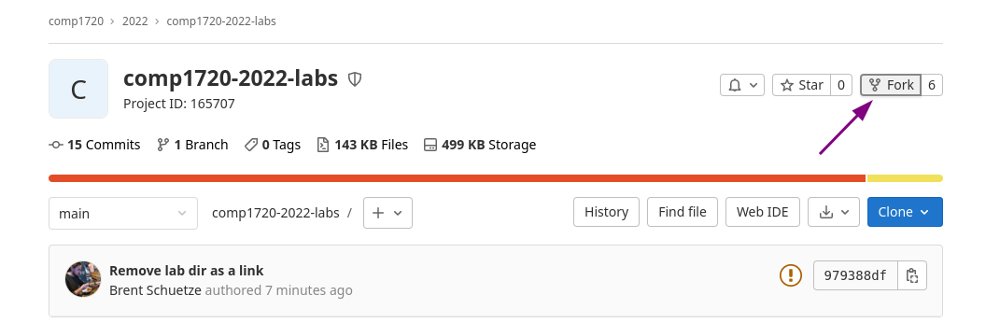
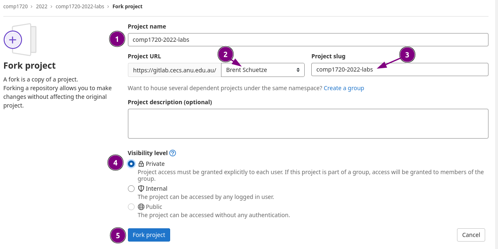
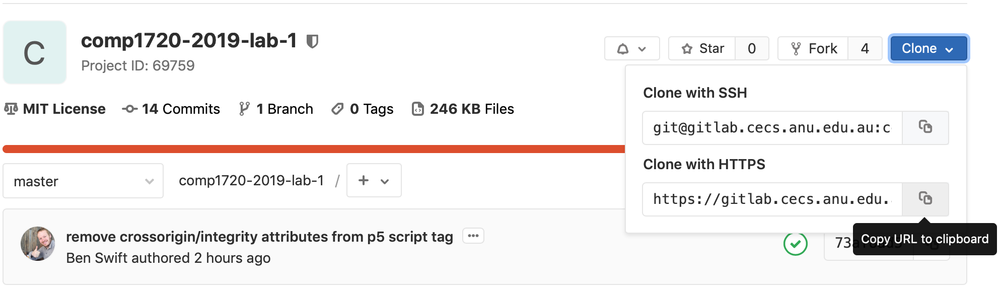
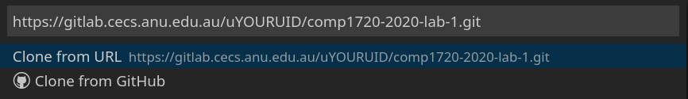
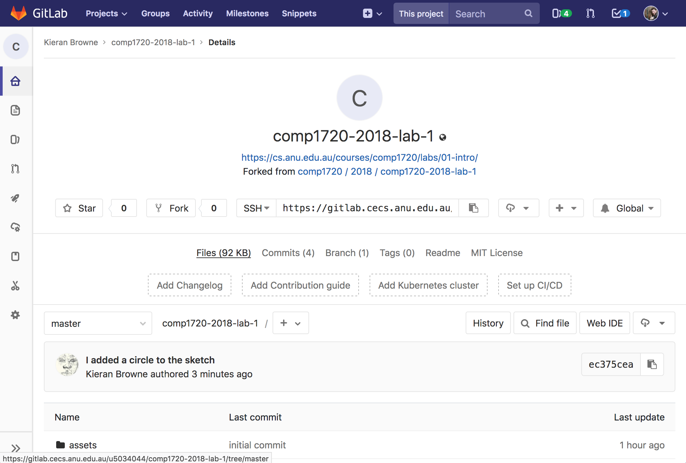
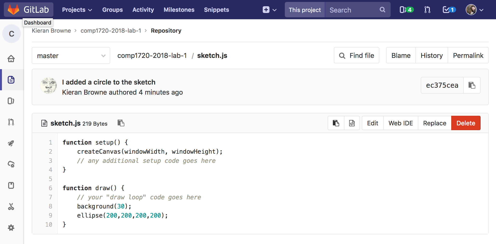

## Lab Tasks

:::info
If this is all very new and scary for you---that's ok! There's lots of
support in this course to help you get your system organised and get
started with coding. The main thing is to put in the effort to get
started and then ask for help if you need it. Either in-person with your
tutors, or on the [forum]({{site.forum.url}}).
:::

**This lab is a self-paced exercise. If you need help, attend a drop-in session in week 1 to ask a tutor** (see [ANU MyTimetable](https://mytimetable.anu.edu.au/even/timetable/#subjects?subject_code=COMP1720_S2_1_9174)).

In this week's lab you will:

1. meet the tools you'll need in this course, including
   [VSCode](https://code.visualstudio.com/) and the [GitLab code
   server]({{site.gitlab_url}}).

2. go through the steps you'll need to submit assignments in this course

3. **put a circle on the internet**

### Task 1: software setup {#software-setup}

In this course you'll write code using the [VSCode text editor](/resources/02-software-setup/#vscode), run the code in the
[Chrome / Chromium](/resources/02-software-setup/) web
browser, and download/view/submit your lab & assignment code with
[git](/resources/02-software-setup/#git).

There's a separate page dedicated to software setup, so if you're on
your own laptop you should head to the [software setup page](/resources/02-software-setup/) and follow the instructions.

You can install the software on your own machine **and** we also
advise you to setup the software on the provided lab computers.

The lab machines have the software you'll need pre-installed with one
exception: you'll need[^extension-install] to install the COMP1720 VSCode
extension (step 3 in the [VSCode setup instructions](/resources/02-software-setup/#vscode)).

[^extension-install]:
    If you're on your own machine or on a lab machine, you'll only have to do
    this once---after that they'll be saved to your home directory and will be
    automatically detected when you log back in.

### Task 2: forking the [lab template]() {#forking}

:::info
From here, we'll use a few git-specific terms, and in general we'll explain
everything along the way. If you're confused, though, there's a [section on git
help](/resources/01-faq/#git) in the course FAQ or
some extra installation help available in the [software setup
FAQ](/resources/02-software-setup/#faq). In addition we also have some
(old but still relevant) [git screencasts](/resources/04-screencasts/)
which walk you through these steps.
:::

Once you've got the software you need, you have to log in to the GitLab server
at using your normal ANU credentials (uni ID and password) and bring up the [lab
repository](). A **repository** (often abbreviated to
"repo") is basically just a box which stores a bunch of files and their history
(the changes they've been through over time). Whenever you hear the word
repo/repository, think "a directory of files which Git is keeping track of".

:::info
You can read more about [repos](https://comp.anu.edu.au/docs/gitlab/git-and-gitlab/#repository)
and [forking](https://comp.anu.edu.au/docs/gitlab/forking-and-cloning/#fork)
on the dedicated SoCo Gitlab site.
:::

This template is a starting point for everyone who wants to complete the labs,
so before _you_ can start working on it you need to create your own "copy". This
is called **forking**, and creates a new repo (your "fork").

To fork the [lab template](), click the fork button on
the GitLab page in your web browser (I've pointed to it below).



After clicking Fork, you will be presented with another page:



There are a few things to note here, and these will also be important when it comes
to forking your assignment so make sure you follow / understand them.

1. This is the project name, by default it will be the same as the repo that you're
   forking from. **Leave this as is (don't change it!)**.
2. This is the namespace that you'll be forking the template to, make sure your name
   or uid is displayed here (you may only have that option anyway).
3. This is the path for the fork, by default it will be the same as the repo that you're
   forking from. **Leave this as is (don't change it!)**.
4. This is the visibility level of your fork, it is important that you ensure that private
   is selected here. Once the fork is completed you can check that its private by looking at the
   icon next to the title, if its a little lock then you're all good!
5. This is the final step, click the Fork project button once you've checked and confirmed the above.

Once you've done that, you should see a page like the one below---you now have
your **own** fork (copy) of these files on the server, as indicated that it
shows your name in the top-left-hand corner (circled in green). The files are
exactly the same, but the repo is now attached to _your_ GitLab account, rather
than the `comp1720/` GitLab account, so you can change the files and push
things up to the GitLab server without messing up anyone else's starting point.

:::info
This part of the process is covered in the [_forking_ screencast
video](/resources/04-screencasts/#fork).
:::

### Task 3: cloning the lab template {#cloning}

Your fork of the template repo is still on the GitLab server, though. To
actually work on these files, you need to **clone** (download) this repo to the
computer you're working on.

:::info
Below are our steps, however general steps exist on the SoCo Gitlab website.
[Check them out if you want something more in-depth](https://comp.anu.edu.au/docs/gitlab/forking-and-cloning/#clone).
:::

1. In VSCode, open the _command palette_ (_View > Command Palette_, or
   `Ctrl`+`Shift`+`P`/`Cmd`+`Shift`+`P` on macOS) and a prompt will appear in
   the top.

2. Type `git clone` and hit enter. A box will appear asking for the repo url.

3. Back on gitlab, open your fork of the lab code. Directly under the page title
   there's a box that looks like this (if it **doesn't** say `HTTPS` on the left
   hand side, click that box and select it. Now click on the right hand side box
   to copy the URL to your clipboard.)

   

4. Back in VSCode, paste the url into the prompt box and hit enter --- making sure that the "Clone from URL" option is highlighted.

   

5. A window will open asking you where to save the files. If this is your own
   computer it might be a good idea to create a `comp1720` folder and clone all
   your repositories there. If this is a lab computer, make sure you save this
   to your university homedrive (it'll be called `u1234567`). When you've found
   a good spot for you files hit _Enter_ or click "Select Repository Location".

6. Now you'll be asked to enter your username and password. This will be the
   same uid and password you used to log into GitLab (your anu login).

7. If you entered your uid and password correctly, a popup will appear in the
   bottom right of VSCode asking you to `Open Repository` or `Add to Workspace`.
   Today we're going to choose `Open Repository`, but they have a similar
   effect.

Great job! Now lets make that circle.

:::info
This part of the process is covered in the [_cloning_ screencast
video](/resources/04-screencasts/#clone).
:::

### Task 4: making a circle {#running}

Now you've got the template files in VSCode you can get to work.

In the sidebar on the left you can see all the files in the template folder, including
a folder for each of the weeks / labs, for this one you'll want to expand the `lab-01` folder.

:::info
If you don't like seeing all of the lab folders at once, you can also open the lab folder
for that lab directly in VSCode. In general it shouldn't matter, but if you have all of
the labs open, make sure you're working in the right lab!
:::

Throughout the course we'll explain what each of these files is for but for now
the one we care about is `sketch.js` (located in the `lab-01` folder). Click on
that one and VSCode will open it up.

You're getting close to creating the circle you've been thinking about all
along. In the `draw` function (immediately below `// your "draw loop" code goes
here`) add the following lines:

```javascript
background(30);
ellipse(200, 200, 200, 200);
```

Now save the file.

The final piece of the puzzle is to run/view the sketch. To do this, you need to
start the live server:

1. Open the command palette (`View > Command Palette`)
2. Type "Open with live server"
3. Hit _Enter_

Your default browser will open up and should show a white circle on a charcoal
background.

:::info
As stated on the [software setup page](/resources/02-software-setup/#chrome) you should use Chrome / Chromium
as your web browser for the course, and (for convenience) you could set it to be
your default browser (since that's what the live server extension will open the
sketch in).
:::

It might not look like much, but you've made your first p5 sketch, and you
should take a moment to enjoy your success.


### Task 5: committing & pushing the changes {#committing}

Now that you've successfully completed today's task of putting a circle on the
internet it's important that you save your work and push it up to GitLab. This
process is important to learn because it's the way you'll submit all your
assignments for this course!

The first thing to do is save your `sketch.js` the usual way (i.e. _File > Save_
or _Ctrl-S_/_Cmd-S_ depending on your OS).

Now you want to upload your changes to the `sketch.js` file back to gitlab so
it's safe and sound. This involves some more VSCode commands so open up the
command palette using _View > Command Palette_.

Type in `git commit all` and press enter. You'll get a popup which says "There
are no staged changes to commit. Would you like to automatically stage all your
changes and commit them directly?". Click `yes`.

Now you'll see a popup asking for a "Commit Message". Write a note about the
changes you made (e.g. "I added a circle to the sketch"). This message is just
so you can remember what this change was so write whatever makes sense to you.

In Git's terminology, a **commit** is a snapshot of your code at a particular
time that you can always return to. This means that if you break your code
somehow you can always feel safe knowing you can just return to your last commit
where everything was working. When working on assignments you'll want to commit
your code regularly just to be safe.

:::info
You can read more about committing [here](https://comp.anu.edu.au/docs/gitlab/git-and-gitlab/#commit)
on the dedicated SoCo Gitlab site.
:::

Now all you have to do is push (upload) these committed changes to GitLab with
the **push** command. Open up the command palette using `View > Command Palette`,
type `git push` and hit _Enter_. You might need to put your UID &
password in again at the push step. If you get an unauthorised message, try once
more and if it still doesn't work seek help from a tutor or friend.

:::info
You can read more about pushing [here](https://comp.anu.edu.au/docs/gitlab/git-and-gitlab/#push)
on the dedicated SoCo Gitlab site.
:::

If everything worked successfully, then when you refresh the GitLab project page
for your fork (i.e. `https://gitlab.cecs.anu.edu.au/uXXXXXXX/comp1720--labs`)
you should see the first line of that commit message as shown:



And if you click on the `sketch.js` filename further down you should see the new
version with your `ellipse` line in there. Hooray!



:::info
This part of the process is covered in the [_committing_](/resources/04-screencasts/#commit) and [_pushing_](/resources/04-screencasts/#push) screencast videos.
:::

### Task 6: putting your circle on the internet {#pushing}

It might have felt like your sketch was already on the internet when you were
building it before because it was in your browser, but really it was only
visible to you. By pushing your code to gitlab, your page was automatically
published online.

You can check this worked by copying and pasting this link into your
browser and replace `uXXXXXXX` with your university ID.

`https://comp1720.cecs.anu.edu.au/uXXXXXXX/comp1720--labs/lab-01`

If you can see your circle, great job, you're done!

It's good to get in the habit of checking the published version of
your sketches because this is what your tutor will see when they mark
your assignments.

If you can see your circle, great job, you're done!

## Extra Tasks

In every lab you will have some extra tasks available
if you have finished your main lab tasks.

If you feel like you're completely exhausted after completing the
tasks above---that's ok! We only expect you to complete the main tasks
each week. Remember that this is just week 1, and we will explain
**everything** in great detail over the next 12 weeks, it's most
important just to make a start early.

### Setting up Git to work without a password

If you like, there are some [extra steps you can take](/resources/01-faq/#setting-up-ssh-keys) so that you don't have to type in
your uni ID and password every time, but it's not essential and you can also add
that stuff later.

(If you're new to all this git stuff, probably just stick with
the ID & password for now.)

### Error and consoles

Now if you replace the code for drawing the circle in Task 4 to this:

```javascript
ellipse(200,200,200 200);
```

What happens? The circle and your entire sketch are gone! Does this mean there is an error in you code? How can you find out?

Usually, we go to the [chrome developer console](/resources/02-software-setup/#chrome-developer-console) for troubleshooting. It provides a detailed description of error in your code.

### Changing the canvas size

What was the canvas size you used in Task 4? Is it a default one? How does it measure the width and height of a given P5 canvas? Give a try!

(Hint: Check out the reference of the [`createCanvas`](https://p5js.org/reference/#/p5/createCanvas).)

### Change the circle's colour

Can you add some colour on your circle? You can start by using the `fill` (& `color`) function

```javascript
fill(color(255, 204, 0)); //make my circle yellow
ellipse(200, 200, 200, 200);
```

Don't know what the three parameters in the function mean? It's always good to check the [reference](https://p5js.org/reference/#/p5/color)!

Here are a few of other functions related to colour you can experiment: `lerpColor()`, `colorMode()`, `alpha()`, etc.
