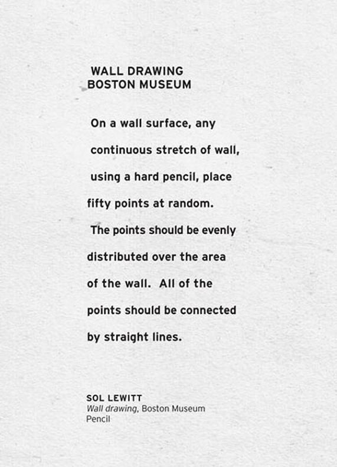
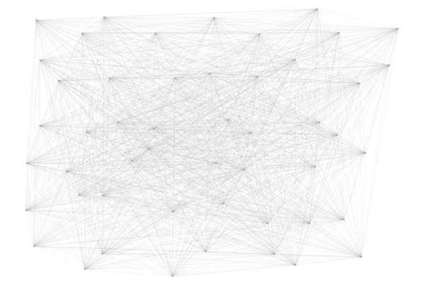
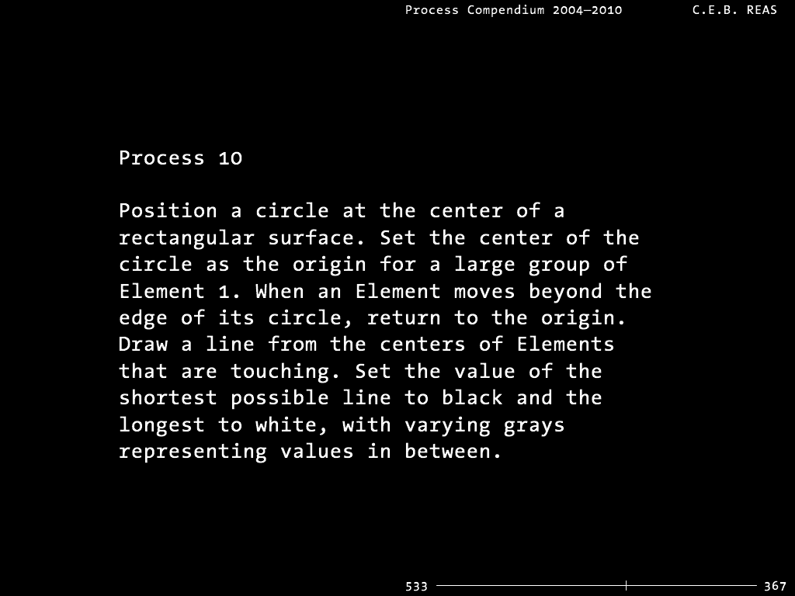
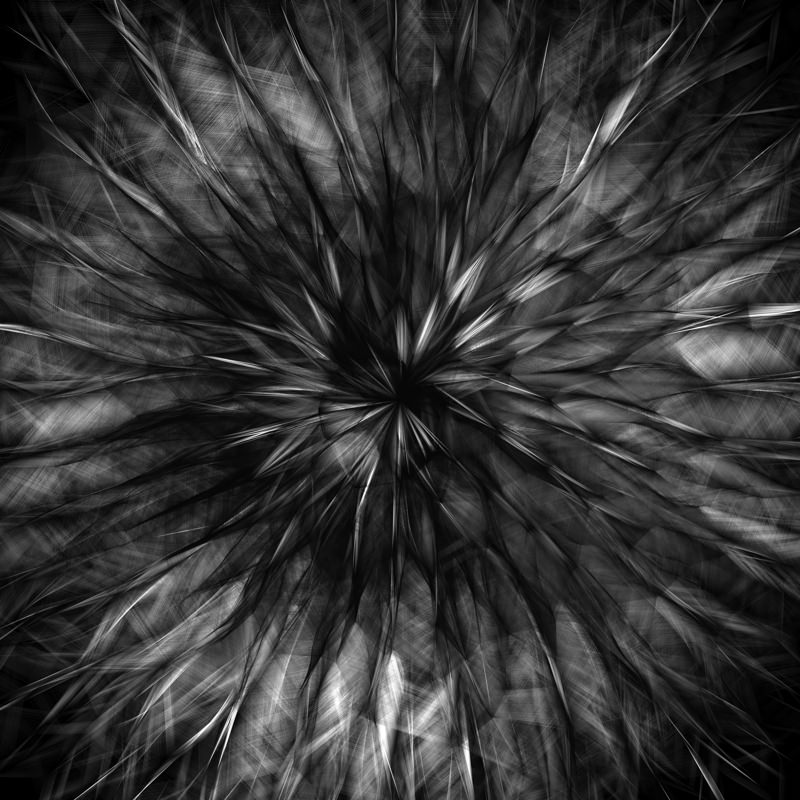

import P5Sketch from "astro-theme-anu/components/P5Sketch.svelte";
import { lab3Sketch } from "../../sketches/lab-3";

## Lab Tasks

In this lab we're going to talk about some big ideas. We'll be covering:

- a brief history of generative art,
- how to evaluate art works; and
- how you can compose our own visually interesting generative artworks

We're still early in the course, and you probably feel like you haven't yet
learned all the basic skills you need (or would like to have) to make the
artworks you can see or imagine. That's ok---the purpose of this lab is to get
you started thinking about _interpretation_. You might think that in an artistic
context, that word is talking about the way that different people will have
different responses to and preferences for the things that they see. Adele might
like portraits, while CaiHeng prefers landscapes... that sort of thing.

Actually, this lab also explores a different meaning for the word interpretation,
which is equally important in a code art course. This lab is about the way that
a work of art can be represented as an instruction (or a series of instructions)
which must be _interpreted_ (or executed, or realised, or performed) to make a
complete artwork.

In this week's lab you will:

1. use p5's drawing functions to produce generative art

2. learn how to critique artworks

3. meet some great conceptual and code artists (well, you'll meet their work, anyway)

4. push (submit) your lab work to GitLab

## Task 0: Randomness

> Think about the concepts of **randomness** and **variation** discussed in the week 2 lectures. Find an image of something which is _not_ usually considered art (could be a photo you take) and discuss how it includes aspects of **randomness** and **variation**.

### Task 1: drawing by code---what kind of art is generative art?

Generative art is much older than computers. In the mid-20th century, the artist
Sol LeWitt created a series of works where he would describe an artwork in
words, and sometimes using a diagram. These instructions, which he called "wall
drawings" would then be carried out by someone else. Here are the instructions
for his [_Wall Drawing
#118_](http://observer.com/2012/10/here-are-the-instructions-for-sol-lewitts-1971-wall-drawing-for-the-school-of-the-mfa-boston/):



And here's a result of following the instructions:



This is analogous to the kind of art we are doing when we make art with code. We
create the instructions to describe an artwork, but the actual drawing is taken
care of by the computer.

Another artist whose work follows a similar form is Casey Reas (one of the
creators of Processing, which is the precursor to p5.js). Reas has created a
large series of works which he called _Processes_. These works, like LeWitt's
wall drawings, were first composed in English. Here's one of Reas's Processes:



And here's a result of following the instructions:



**So here's your task:** What is the work of art here? Is it the instructions or the realisation? And who's the artist --- the person who wrote the instructions, the person who followed them, or both/neither? Think about these questions for a minute, then **share your thoughts with others in your lab** and **respond to one other's views**.

### Task 2: following the instructions

Ok, now it's your turn. Here's a new wall drawing instruction (let's call it
_The COMP1720 Collective's wall drawing #1_)

> on a blue background, three not-quite-horizontal white lines of various
> thickness next to a "breathing" circle

Clone your fork of [the lab repository]() repo if you haven't
already. In VSCode, open the repo and navigate to the `week-03` folder, open `sketch.js`.
Write a p5 sketch which realises the above wall drawing.

:::tip
As you do this, avoid looking at what other people have done in your lab (_spoiler: we're gonna share our work in a minute!_). Instead, think (or sketch on a piece of paper if you like) how you're planning to interpret the instruction.
:::

When you're done, commit your wall drawing code to the repo. When you commit,
you'll give the commit a message to remind you what the code looked like at that
point, something like "completed part 3 wall drawing". Don't move on to the next
step until you've done this: you'll be submitting your assignments in the same way. Ask one of your tutors if you get stuck.

Now that you've saved your interpretation, have a look around the room at what others have
done, do they differ to yours? what other interpretations of a breathing circle might there be?

### Task 3: composing your _own_ instructions

In the final part of this lab, you get to make your own wall drawing
instruction. You can borrow ideas from the things you've seen already, but if
you have new ideas then that's fine too---this course is a place to experiment.

Separately, **each write a pair of drawing instructions** for the other to realise
in p5.js. The rules are: (1) don't make it too complicated, and (2) try to
imagine what your instructions will look like as you write them---the aim is to
write instructions that will be interesting when drawn.

Create a new file called `task-3.js` in your `week-03` folder. Then open the
`index.html` file and change the line that says:

```html
<script src="sketch.js"></script>
```

```html
<script src="task-3.js"></script>
```

This will now make it so your live server is displaying the `task-3.js` file instead
of the `sketch.js` one.

:::info
This process above is how you can generally switch whatever file is being displayed.
Please note that this should only be applied to labs, in assignments we want you all
to be using sketch.js so we know where to mark.
:::

Copy the below template code into the blank `task-3.js` file and save it.
Your live server should now be displaying a black background.

```js
function setup() {
  createCanvas(windowWidth, windowHeight);
}

function draw() {
  background(0);
  // put drawing code here
}
```

Exchange your drawing instructions with your lab partner, you should now attempt to realise your interpretation of the instructions.
Once you and your partner have both finished, reveal your interpretations to each other. Discuss how you both had originally envisioned the
artwork to turn out and comment on what you like about them.

Once you've finished, save the code from your instruction-co-coding session to `week-03/task-3.js` in your lab repo and push it
to your fork on the GitLab server. Check the CI jobs for a tick to see that your repo is working.

### Task 4: break it down!

As in every lab, we've provided some code for you to mess with and make your own.
This code is based on Casey Reas' _Process 10_ from above? **With your partner from
the previous exercise**, play around with parameters to see how it works, add colour
or change the drawing style. Break it down and make it your own.

<P5Sketch client:only="svelte" sketch={lab3Sketch} />

### Summary

There's still lots we haven't really talked about in this lab. One of the main
omissions is the fact that LeWitt's wall drawings are static, but when working
in a digital medium like p5 you can make things move! Still, be patient---we'll
cover all that as the course progresses. As a bonus, hopefully this lab was
helpful for thinking through assignment 1.

If you got somewhere today, though, congratulations! Even if you didn't get all
the way to the end, you can still mess around with this stuff at home and ask
questions (and show your work!) on the COMP1720 forum.

## Extra Tasks

### Implementing Wall Drawings

Search the web for more LeWitt wall drawings. Can you implement any of them in p5? If you really want a challenge, can you add a dynamic (time-varying) component to any of the things you've done today?

### Gauss and other Randoms

Not all random numbers are created equally. Well, if you use `random()`, then they actually are---this function returns a _uniform_ random number. That means if you sample lots of random numbers from a range (e.g., `random(5,12)`) you are likely to get a more-or-less even distribution of numbers from that range.

This isn't always what we want! Sometimes we'd rather have our random numbers mostly closer to a centre point. This is where a _Gaussian_ (or normal) distribution can be handy. Have a look at the p5 documentation for the `randomGaussian` function [(link)](https://p5js.org/reference/#/p5/randomGaussian)

Time to make some art: use `randomGaussian` to create an art work where random numbers are used in _three different_ ways. Your tutor will have the final say about whether these three random aspects of your artwork are different enough!

### p5 Pollock

Think about Jackson Pollock's process for creating _Blue Poles_ that we discussed in lectures: loading up a brush with thin paint and dripping it purposely, but with a lot of variation, across a canvas.

For this task you are going to **create a Jackson Pollock-like painting artwork in p5**. We've already worked on making smooth accurate paintings in p5 with `mouseX` and `mouseY`. Now it's time to add some randomness and variation to that process.

Think about what you might have to add to get good paint-splatter effects in p5. You'll have to add variation to the thinkness of lines but also add some extra drips either side of your mouse position. You might also want to add extra dimensions of control, e.g., you could use the `mousePressed` Boolean variable to "activate" applying paint. How can you give the user control to change paint colour?

### From Lines to Curves

[String Art](https://en.wikipedia.org/wiki/String_art) is a decorative craft where lines of string or thread run between pins in a board. Your task is to make some string art in p5:

1. Design a sketch where two lines are placed randomly on the canvas but share one point.
2. Divide each line into 10 segments.
3. Draw 10 connecting strings between the two lines at the division of each segment. (the strings should connect from one line's furthest point from the common end to the other line's nearest point and so on..)

Now that you can see the basic pattern, try adding some more lines and joining strings.

By the way, the curves formed by these strings are [quadratic Bézier curves](https://en.wikipedia.org/wiki/Bézier_curve), an interesting concept from computer graphics and generative design. You can make cubic Bézier curves in p5 (have a look at [this example](https://p5js.org/examples/repetition-bezier/)) - try some out and make a new artwork with smoothly curved shapes.
