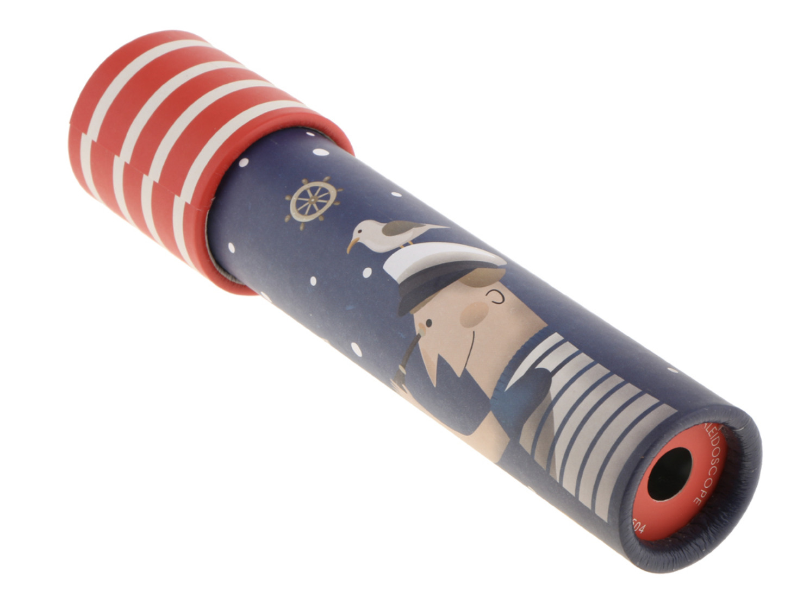
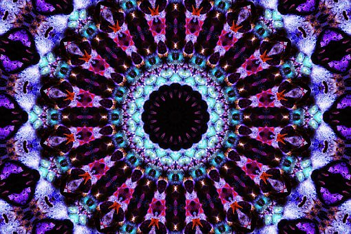

import P5Sketch from "astro-theme-anu/components/P5Sketch.svelte";
import { kaleidoscopeSketch } from "../../sketches/kaleidoscope";

Before you attend your lab session, make sure:

- you can fork, pull & push to GitLab
- you've watched the week 3 lecture on iteration

## Task 0:

Now that you've completed the first assignment, it's a good time to think about how your understanding of art and code has developed in the first part of this course.

> Think about your submission for assignment 1. Show your neighbour (if you're comfortable doing that). Explain which parts you were happy with. Are there any aspects do you think you could improve? Was there anything about your assignment where you could apply the `array` and `function` structures that we discussed in the week 4 lectures?

<h2 id="introduction">Introduction</h2>

When you were a kid you might have had a
[kaleidoscope](https://en.wikipedia.org/wiki/Kaleidoscope) toy which looked
something like this:



and when you looked through the tube you saw something like this:



Kaleidoscopes work by using mirrors to create multiple reflections of a simple
pattern, which can produce beautiful geometric patterns like the picture above.

By the [end of today's lab](#break-it-down) you'll be able to use p5's built-in
transformation functions to do the same sort of thing. But first, you'll do a
couple of exercises to help you get your head around exactly what it means to
_transform_ the grid in p5.

In this week's lab you will:

- learn about transforms: translate, rotate & scale
- write your own functions to package up "drawing" units
- build a kaleidoscope

:::tip
If you're proud of your [monster](/assessments/02-monster/), you should go and share it on the course forum assignment 1 thread and check out what everybody else did!
:::

## Task 1: scale, rotate and translate

Before we can start work on our kaleidoscope, we need to learn about three new
p5.js functions: `scale()`, `rotate()`, and `translate()`. In the business, we
call these "transform" functions---cause they transform the grid you draw on
(maybe you can see how this could be helpful for a kaleidoscope?).

Below you'll find a widget containing some p5.js code that is half finished. Your job is to drag the lines of code from the left-hand-side to the right-hand-side to try and achieve the following goals:

1. Can you move the square to the left? Or the right? (**requires 1 line of code**)
2. Can you move the square to the center of the canvas? (**requires 1 line of code**)
3. Can you rotate the square in the center of the screen? (**requires 2 lines of code**, one of which you just wrote!)
4. Can you make the square bigger, or smaller? (**requires 1 line of code**)
5. Can you flip the square, so it is mirrored? (a few different options here)

If you get stuck, ask your tutor for help---or give the reference a read
(otherwise, maybe you can figure it out by just trying random options!). Here's
links to the references for:

- [the translation section in general](https://p5js.org/reference/#group-Transform)
- [`scale()`](https://p5js.org/reference/#/p5/scale)
- [`rotate()`](https://p5js.org/reference/#/p5/rotate)
- [`translate()`](https://p5js.org/reference/#/p5/translate)

:::info
Beware, for the `rotate()` function p5 talks about angles in
[radians](https://en.wikipedia.org/wiki/Radian) (where 360 degrees equals two
pi radians). Also, it's important to remember that rotation happens around the
`x=0`, `y=0` point (the _origin_), not the centre of the canvas.
:::

Play around with the different code blocks and arguments to try and build an intuition about what they do to the canvas.

:::tip
Did you discover anything cool? Show your discovery to your neighbour, and how to re-create it.
:::

<h2 id="part-3-draw-function">Task 2: a draw functions</h2>

Now we're going back to VSCode. Clone your fork of [the lab
repository]() repo if you haven't already, open it in VSCode,
navigate to the `week-05` folder and start the live server as usual.

Write some code in your `draw()` loop that draws a simple shape using the
primitive p5.js functions you've learnt so far (`rect`, `ellipse`, `line`,
etc.). Examples might be a house, a flower, a cross --- be creative, but don't
spend too much time on it (simple is good!).

Now we're going to write a function to draw this shape. Package up the "shape
drawing" code you just wrote into a function which takes `x` and `y`
parameters, and then draws the thing at that location. It'll look something
like this:

```javascript
function drawShape(x, y) {
  // draw all the things using the x and y parameters
}
```

Call your new function multiple times in your draw loop, with different
co-ordinates. Once you've got the hang of drawing the exact same shape in
different places, can you add an additional parameter to the function so that
you can draw the shape with a different size each time? How about passing in
some sort of colour parameter?

At the end of this part, your sketch should draw a bunch of similar shapes to
the canvas. You want your sketch to have good coverage of the canvas, but also
to leave some blank space (i.e. you don't want to paint the whole canvas with
your shapes). The reasons for this will become clear in the next section.

Exchange the code for your shape function with your neighbour. This is **very**
important (read on to find out why)!

:::tip
Why would you want to package your drawing code into a function. What's the
main benefit? What are the downsides? If you're struggling to think of anything, ask your tutor---maybe they can point you in the right direction.
:::

## Task 3: kaleidoscope

Now, the moment you've been waiting for---you finally get to make a
kaleidoscope, and we'll be using you and your partners shape functions from the
previous exercise to do it! Don't be scared, this is actually kind of
straightforward if you've got the hang of the previous parts of this lab.

The main difference between a kaleidoscope and Part 2, is that you want to
iterate the process many times (to simulate the multiple reflections which
happen inside the kaleidoscope). To that end, we need to modify our draw loop
so it looks like the following:

```javascript
// put this in your draw loop
translate(windowWidth / 2, windowHeight / 2);
var numRotations = 10;
for (var i = 0; i < numRotations; i++) {
  rotate(TWO_PI / numRotations);
  // put your cool shape drawing code in here
}
```

If you haven't already, you should copy your own and your partners shape
functions from the previous exercise into your `sketch.js` file and call both
of them inside the for loop, after the `rotate` function.

:::tip
This code uses the "translate by `width/2`, `height/2` then rotate" trick to
make the canvas rotate around the centre point. Why does this work?
:::

Now, do one of the following things:

1. Add some sort of dynamic behaviour to your shape drawing code (i.e. use
   `mouseX` or `frameCount` somewhere)
2. Add another persons shape to your code
3. Add in another loop, but this time rotating in the opposite direction
4. Do something entirely different --- be creative!

When you get a kaleidoscope sketch that you're happy with save your code into `week-05/sketch.js` in your lab repo and push it
to your fork on the GitLab server. Check the CI jobs for a tick to see that your repo is working.

Have a think (and play around!) to find out what shapes work best as a building
block for this kaleidoscope process? What makes them work so well?

<h2 id="break-it-down">Extra Task: break it down!</h2>

Here's some kaleidoscope code which looks much more like the traditional kids
toy tube thing we talked about in the [introduction](#introduction).

Copy and paste the code below into a file in VSCode (either `sketch.js` or a new file) --- try and make it your own, be creative!

<P5Sketch client:only="svelte" sketch={kaleidoscopeSketch} />

:::warning
This sketch uses the p5 [push()](https://p5js.org/reference/#/p5/push) and
[pop()](https://p5js.org/reference/#/p5/pop) functions (which "save" and
"restore" the current transformation) but these are different from the **Array**
[`push()`](https://developer.mozilla.org/en-US/docs/Web/JavaScript/Reference/Global_Objects/Array/push)
and
[`pop()`](https://developer.mozilla.org/en-US/docs/Web/JavaScript/Reference/Global_Objects/Array/pop)
that we talked about in the [week 4 lecture](/_lectures/week-04/#putting-elements-into-an-array). It's a bit annoying but names like **push** and **pop** are sometimes re-used in different ways across programming languages.
:::

Even though it looks complicated, this is a _relatively_ simple extension to the
stuff you did in this lab, the only addition is that it uses an image
[mask](https://p5js.org/reference/#/p5.Image/mask) to draw only one "pizza
slice" shaped part of the canvas, but to re-draw it many times in a radial
pattern (just like a real kaleidoscope). There's a bit of stuff in there that we
haven't covered in lectures yet (mostly the image masking stuff) so don't worry
if you don't understand all of it just yet. Still, it's quite pretty---so
definitely have a play with it and break it down if you get the chance.
