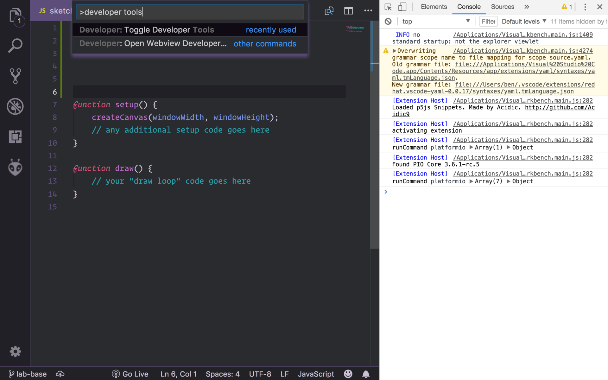

## Visual Studio Code (VSCode) {#vscode}

The Integrated Development Environment (IDE) we use in COMP1720 is [Visual
Studio Code](https://code.visualstudio.com/) (we'll usually call it **VSCode**
for short). VSCode is a "text editor" program, which means that it's really good
at editing text, but doesn't care too much what that text is or what it means.
It's equally happy if you're writing the great Australian novel, or a shopping
list, or a bunch of computer code.

:::warning
Actually, in the CSIT & HN computer labs that's not completely true---the text
editor is called [**VSCodium**](https://vscodium.com), which is functionally
identical to VSCode but has some of the telemetry & spying bits removed. For the
sake of clarity in this lab material we'll call it VSCode (since that's the main
name for the software, that's what you should install on your own
machine, and that's the best term to Google to get help) but just remember that when you log
into a lab machine you'll need to start **VSCodium**, _not_ VSCode.
:::

However, VSCode also allows people to write "extensions" to help VSCode write &
run code for different programming languages---including p5.js. That's why
VSCode is the program you'll be using in COMP1720 to write all the code for your
p5 sketches. Don't worry if you've never used it before, the lab material will
walk you through how to create interactive artworks in javascript.

### VSCode setup

:::info
If you're on one of the ANU lab machines (either in the CSIT or HN) then most 
of this is already done, although you *may* have to install
the **comp1720** VSCode extension---jump to step 2.
:::

To set this all up on a new machine (e.g. your own laptop) here are the steps:

1. [download & install VSCode](https://code.visualstudio.com/) (works on macOS,
   Linux & Windows)

2. open VSCode, [open the **Extensions**
   view](https://code.visualstudio.com/docs/editor/extension-gallery) (*View >
   Extensions* in the menu)

3. search for and install the **COMP1720** extension "{{site.extension.name}}"
   (`{{site.extension.id}}`), if you have trouble finding it, you should be able 
   to see it at [the VSCode Marketplace]({{site.extension.vscode_url}}) or the 
   [VSCodium Marketplace]({{site.extension.vscodium_url}}).

4. reload the VSCode window (using the [command
   palette](https://code.visualstudio.com/docs/getstarted/userinterface#_command-palette))
   > Developer: Reload Window

VSCode has [pretty good documentation](https://code.visualstudio.com/docs) (the
cool kids sometimes call documentation "docs" or "doco" for short) and the lab
material will link to specific parts of it where appropriate.

Once you've got VSCode & the necessary extension installed you're able to create
your first p5.js sketch. That's what the first lab is all about---so head [to
that page](/labs/01-intro/) and give it a try.

## Chrome (Chromium) {#chrome}

I'm guessing you know what a web browser is, right? And that you can download
and install Chrome from the [download
page](https://www.google.com/intl/en_au/chrome/)? Great
:)

What you might not be aware of is that Chrome (in fact, all modern web browsers)
also contain a programming language---javascript---which is the language you'll
use to build your interactive art sketches in this course. As well as just
running javascript programs, they also have tools for inspecting and debugging
them (in Chrome, they're called the [Chrome DevTools](https://developer.chrome.com/docs/devtools/)).

You can access the Chrome developer tools through:
- `View > Developer > Developer Tools`
- `Ctrl+Alt+I` (on windows and linux)
- `CMD+Opt+I` (on a mac)
- right click on the page to open context menu -> Inspect -> Click Console

In this course we'll use the `Console`and `Sources` tabs in particular. Don't worry 
if this all seems confusing at the moment, we'll step you through it in the labs.

## git {#git}

[Git](https://git-scm.com/) is an amazing bit of software for storing and
tracking changes to your code; you can think of it as Dropbox (or Google Drive
or iCloud etc.) on steroids. It's also the way you'll submit your assignments in
this course, but don't worry if you haven't used it before. You'll have plenty
of time to practice before the first assignment is due. There's also a whole
section in the course FAQ about about [using Git in COMP1720](/resources/01-faq/#git). So why not give that a read now?

### Git setup {#git-setup}

Luckily, the people who make Git provide a couple of convenient ways to get everything installed on your computer:

- If you're on Windows, you can install Git by going to the [Windows download section](https://git-scm.com/download/win) then downloading and running the `.exe` file.
- If you're on macOS or linux you *might* already have it. Open up Terminal and type

    git --version

and press enter, if it prints something like... (the exact version number doesn't matter)

    git version 2.20.1

then you're good to go.

If you don't have git installed (or your terminal can't find the `git` program)
then instead you'll see something like

    -bash: git: command not found

Never fear, the internet is full of instructions on how to install git on your
machine: [here's
one](https://git-scm.com/book/en/v2/Getting-Started-Installing-Git) which you
might find useful (but other ways are ok as well).

:::info
If you don't have git installed on an Apple computer, macOS will try to install "XCode Command Line Tools" when you try to run `git`. It's a bit of a download (~1GB), but not a bad idea if you are a computing student. If this is your only computing course or you are impatient then the easiest way to download Git for a mac is to use the ["Binary Installer"](https://sourceforge.net/projects/git-osx-installer/) linked on the [macOS download page](https://git-scm.com/download/mac).
:::

:::warning
After installing Git, you'll need to close and re-open VSCode!
:::

If you are struggling to install Git you should [check out the relevant FAQ entries](#faq).

## Troubleshooting

If you're having problems on your own laptop then there are lots of different
things which might be causing it, and it's too hard to list them all.

Here's a list of issues you *might* come across, depending on the specific
details of your machine. As always, try to *understand* the problem first before
you try randomly copy-pasting the various solutions listed.

### VSCode {#troubleshooting-vscode-plugins}

:::tip
If VSCode isn't working as you'd expect (e.g. you can't install the COMP1720
extension pack, or you think you've installed it but you can't see the **Go
Live** button down the bottom, or some other issue) then the most helpful place
to check is the VSCode Developer Tools.
:::

These aren't super-easy to find, the best way to bring them up is to use the
command pallette and search for the *Toggle Developer Tools* command (as shown
in the screenshot below). Once you do this, you'll see a console window show up
in your VSCode window (shown here on the right, but it might be on the left, or
on the bottom depending on your settings---it doesn't matter).



In the screenshot (taken on my machine) there's a bunch of log messages from
VSCode which you don't need to understand, and that's normal. What might be a
worry, however, is if there are a bunch of angry-looking red error messages.
They still might not make any sense, but that's the best place to see exactly
what VSCode is complaining about, and at least it gives you something to paste
into Google or post on the [forum]({{ site.forum.url }}) so that we can figure
out exactly what's going wrong and help you out.

If you're curious as to why the VSCode console looks quite a lot like the
[Chrome developer console](#chrome-developer-console) it's because VSCode is
actually based on [Electron](https://github.com/electron/electron), a tool for
building cross platform desktop apps with JavaScript, HTML, and CSS.

### Chrome developer console {#chrome-developer-console}

As your sketch is running in the browser (Chrome), you will often need to open
the developer console to view any error messages or the output of `console.log`
statements:

1. open (and close) the developer tools with
   - `View > Developer > Developer Tools`
   - `Ctrl+Alt+I` (on windows and linux)
   - `CMD+Opt+I` (on a mac)
   - right click on the page to open context menu -> Inspect -> Click Console

2. Make sure Console is the selected tab in the opened drawer[^drawer]

[^drawer]: "drawer" is a word sometimes used to describe a window which "slides out" from the side

You should now be able to see any errors or `log` statements in this drawer.

You can also change the location of the drawer by clicking the three dots (in
the drawer window) and selecting the corresponding 'Dock side', and if you're
like me and prefer white text on a black background you can also open the
'settings' from the same menu and select the 'Dark' theme.

## FAQ

### How can I check that it's all working?

If you can [put a circle on the internet](/labs/01-intro/), you're golden :)

### Can I get help setting things up?

Yep, we'll be running labs in week 1, so come along to your registered lab 
and get some help :)

### What web browser should I use for viewing my sketches?

[You should use Chrome in this course](#chrome).

### I'm not a computing student---why do I have to use all these programs?

There are a few reasons:

1. even if you don't end up being a computer programmer, you'll probably still
   use a computer a lot in your life, and you'll probably edit text a lot in
   your life as well, so learning new skills for doing that is always a good
   thing

2. if you're an artist, this is another potential tool in your tool-belt (just
   like your brushes, or your guitar, or your video camera) and another medium
   to express yourself in---make the most of this opportunity (it'll probably
   influence your artistic practice in other areas as well; learning new tools
   usually does)

3. because it's really not that tricky---you cut with `Ctrl+X` (or `Cmd+X` on
   macOS) and paste with `Ctrl+V` (`Cmd+V`) just like in Microsoft Word---and I
   think that if you approach things with the mindset of "I can do this" rather
   than "this is all just weird geek stuff and I'll never get the hang of it"
   then you might even *enjoy* it

### Do I _have_ to install VSCode on my own machine?

Technically, *no*. But it will be extremely helpful to you to be able to work on 
the labs and assignments in your own time. If you believe that using the lab machines 
only will be sufficient, then it isn't a requirement.

### VSCode is telling me it can't find git---what do I do?

If you haven't installed git already, [follow the instructions above to do that](#git-setup).

Then you should be able to **close and re-open** VSCode and be on your way!

If you're on Windows and it still isn't working then you either need to:

1. try follow along with the [instructions
   here](https://stackoverflow.com/questions/26620312/installing-git-in-path-with-github-client-for-windows#26620861)
2. ask the forum or your tutor in your next lab

### Git is saying it "doesn't know who I am"---what do I do?

In order to use git you need to provide it with your name and email so it can
identify your changes to yourself and others.

This is a quick fix you'll only have to do once:

1. click on the "Terminal" item in the top menubar, then "New Terminal" (don't
   be intimidated! this is going to be nice and easy)
3. write `git config --global user.name "Your Name"` (replacing Your Name with
   your actual name), then press enter. If nothing shows up, you did it
   correctly
4. write `git config --global user.email "u1234567@anu.edu.au"` (replacing
   `u1234567` with your own university ID), and then press enter

### I'm getting an error when I try and push or clone---what do I do?

If that error is:

1. a 500 error
2. a "HTTP Basic: Invalid Token" error

There is not much you can do, this is because the GitLab server at ANU is under 
maintenence or having problems due to high usage (this happens sometimes, but 
is much less common in ).

However, if:

1. your error says "HTTP Basic: Access Denied", you have probably entered your
   password wrong. Make sure you are using the password you use to log into the
   lab computers (or Streams, or Wattle). If you are on Windows you may need to
   find the entry for git in the Credential Manager and edit that to the correct
   value. [Instructions to do that are here](#credential-errors).
2. your error says "You are not allowed to push code to this project", you have
   cloned the wrong repository. Go back to the lab-1 GitLab repository ([or
   click
   here](https://gitlab.cecs.anu.edu.au/comp1720/2024/comp1720-2024-labs),
   click fork (and follow the prompts that come up, if they come up), then click
   the "clone" button and copy the "Clone With HTTPS" URL. Try cloning again
   with this URL (it should look like
   https://gitlab.cecs.anu.edu.au/u1234567/comp1720-2024-labs, where `u1234567`
   is your university ID).

You don't _need_ to do this for this course (although [you can if you
want](/resources/01-faq/#setting-up-ssh-keys)). So
you can click the "Don't ask me again" option in the dialog if you don't want to
be hassled about it every time.

### I'm on Windows and I keep on getting a "HTTP Basic: Invalid Token" error when I try to clone---what do I do? {#credential-errors}

1. Find the file at `C:\Program Files\Git\etc\gitconfig`, right click it and open with "Visual Studio Code"
2. Find the section that looks like

   ```
   [credential]
     helper = wincred
   ```

   or

   ```
   [credential]
     helper = manager
   ```

3. Delete the everything after the "=" on the line that starts with "helper". So it looks like:

   ```
   [credential]
      helper =
   ```

Now, you'll need to restart VSCode and try cloning again. If that doesn't work, contact your tutor :)
