<!-- _class: banner -->

# COMP1720


---

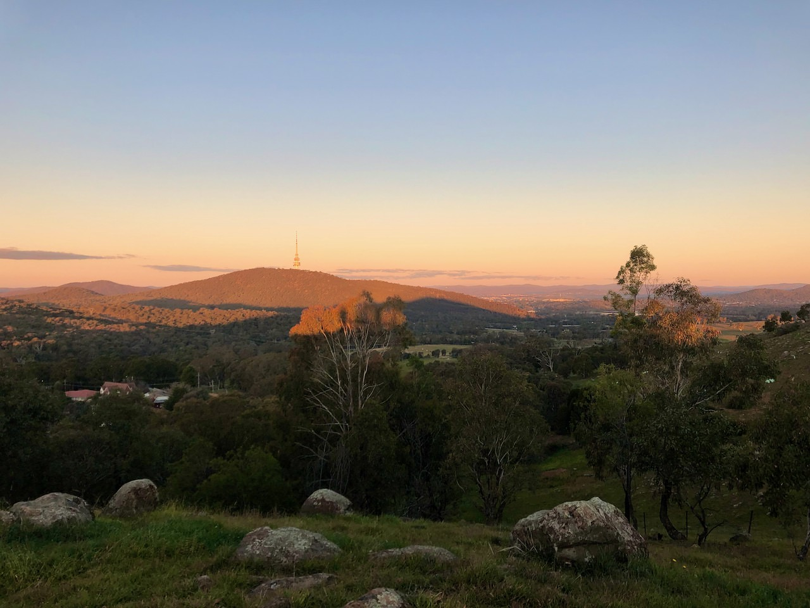

This course builds on >60,000 of culture on this country.

We acknowledge and celebrate the first nations people on whose country we
meet, and pay our respect to elders past and present.

---


## your comp1720/6720 team

Course convenor and lecturer: [Dr Michael McCullough](https://comp.anu.edu.au/people/michael-mccullough/)

<!--

---

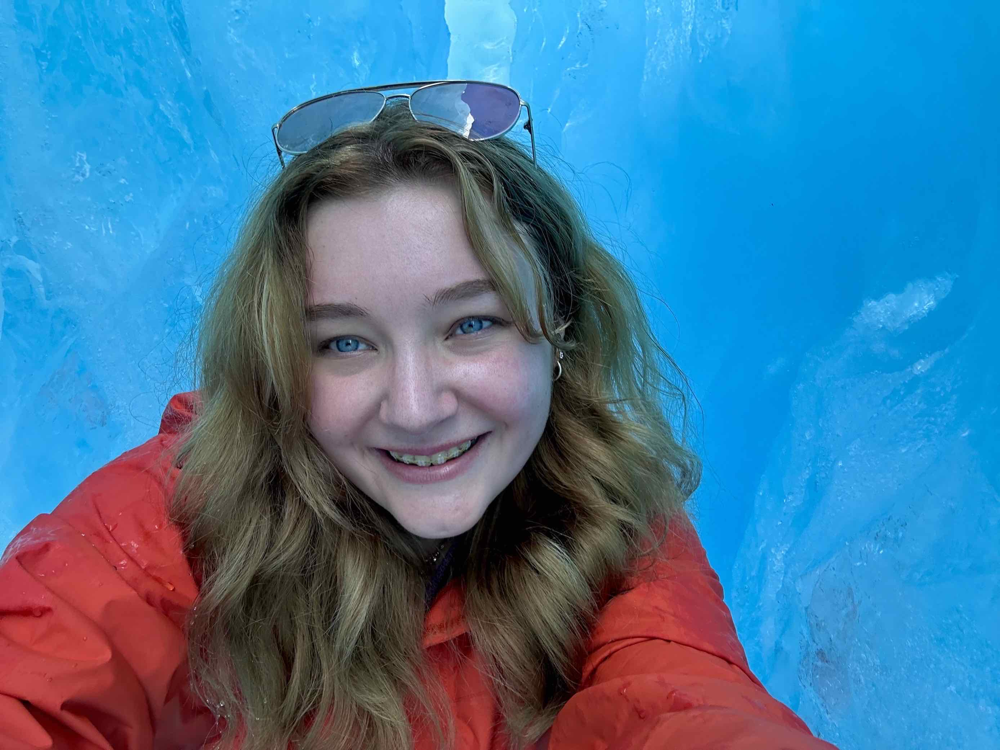

Maddi McRae -->

---

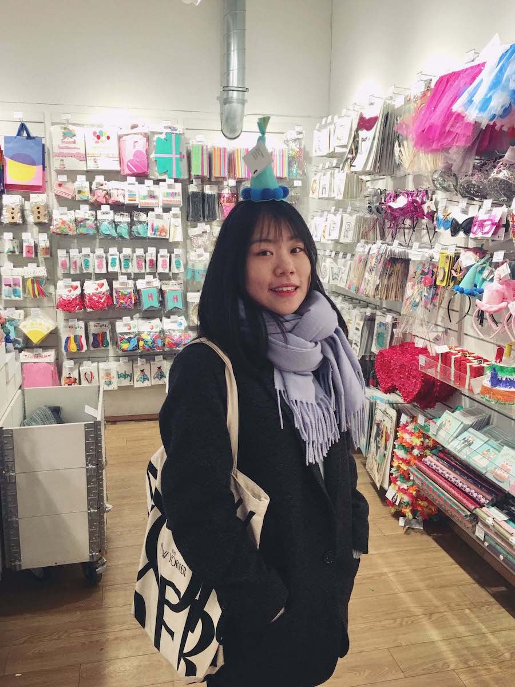

Tutor: Yichen Wang

---

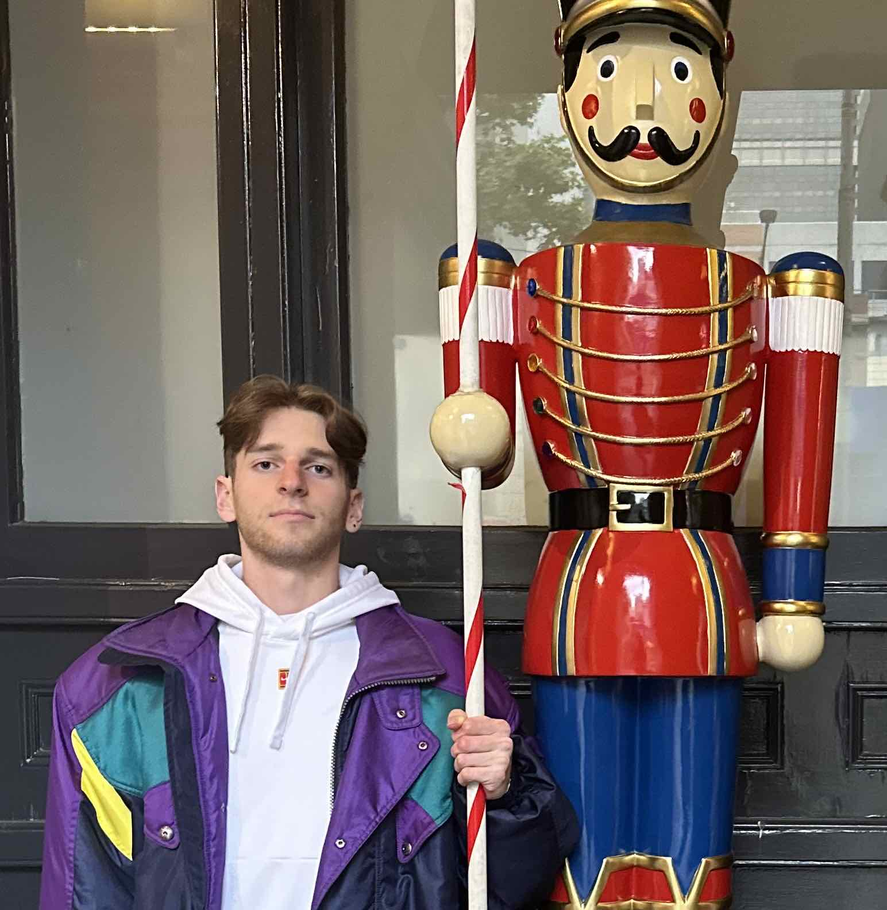

Tutor: Joe Castor

---

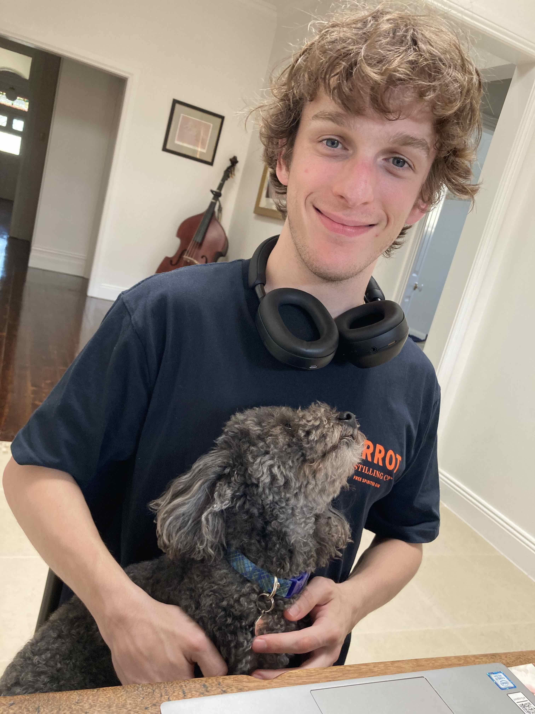

Tutor: Ethan Teber-Rossi

---

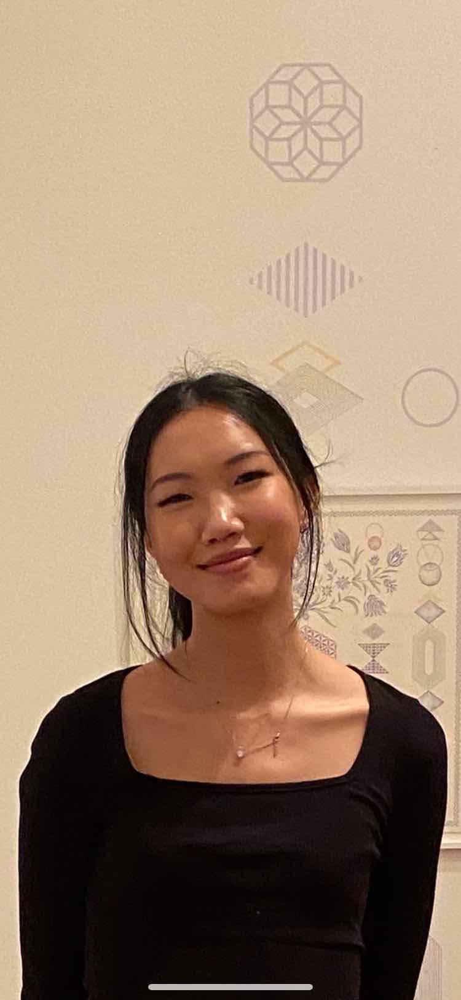

Tutor: Simone Thai

<!--

---

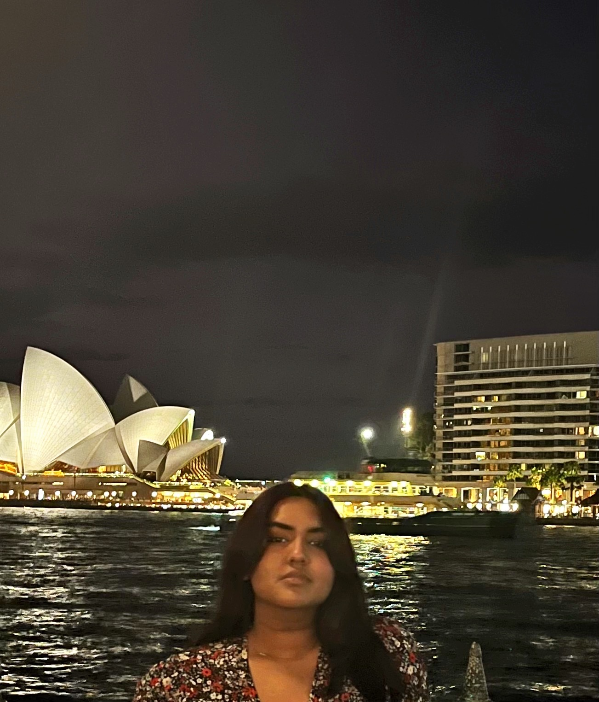

Trisha Chandrasekar -->

---

<!-- _class: talk-box -->

## talk

In-class discussion: Introduce yourself to your neighbour!

- Tell one boring fact about yourself.

- Tell us about a food that everybody likes but you hate.

- Tell us your favourite under-rated video game / movie / show / book / ... character.

For those watching/reading online post a reply on [the forum (Ed)]() and introduce yourself!
make a reply to the "Introduce Yourself" thread.

_Note:_ If you can't access the forum please let me know and I'll fix it

---


## this is a course about making interactive art with computers


_making:_ in this course, we learn through _making_, every week you will make new computer artworks. The only rule is _make_.


_interactive:_ interaction between humans and computer system, this is exciting and powerful, but it is _hard!_ this could be start of your journey studying interaction.


_art:_ we will learn some theory about artistic and musical computing so that you can have lots of ideas and develop them well


_computers:_ we need to learn about programming to do the making! We will cover the basics of coding in a language called JavaScript.

---


## admin

## lectures

on campus **lectures** are **8-10am Tuesday** and **10-11am Thursday** at [Dunbar Lecture Theatre] (see MyTimetable).

if you're reading this while I'm live talking then congrats you made it! everyone else we'd love to see you in person if you're able to make it

<!-- 50% slides, 50% live coding! -->

slides & recordings will be on the echo360 (in Wattle) (also see the [FAQ](/resources/01-faq/#lecture))

## labs

**labs** are in-person in this course!

<!-- you are *expected* to attend your weekly lab session!  -->
Sign up on [MyTimetable](https://mytimetable.anu.edu.au/even/student).

each week you'll get a new set of art + code challenges to work through, these
labs will give you the skills you need to do the assignments and major project

**_Labs* start from week 1_**! Hope we are going to see you soon (or have seen you already)!


## *drop-ins

Labs in **week 1** and **week 12** will run as **drop-in sessions** (same times and venues as regular labs).

The [week 1 lab content](/labs/01-intro/) is about setting up your tools (Visual Studio Code and Git) and putting a circle on the internet.
This is a self-paced exercise. If you need help, attend a drop-in session this week to ask a tutor.

**Very important to get on top of GitLab and lab-submission now. This is how you submit all work in COMP1720/6720!**

## assessments

Look at the [assessments page](/assessments/index/)

**Assignments:** each assignment is about creating a small interactive work of art---a p5.js code
sketch -- Assignment 1 is out in week 1!

**Major Project:** Produce a bigger piece of interactive art (in p5.js) for our **online exhibition**

Note: No late submissions accepted without an extension.

## lab tasks

lab tasks are small technical exercises designed to:

- connect thinking (from lectures) with expression (in labs)
- **practice** creativity and coding

you are welcomed to discuss and work together with your lab peers (students from past years did find this to be extremely helpful for their learning!)


---

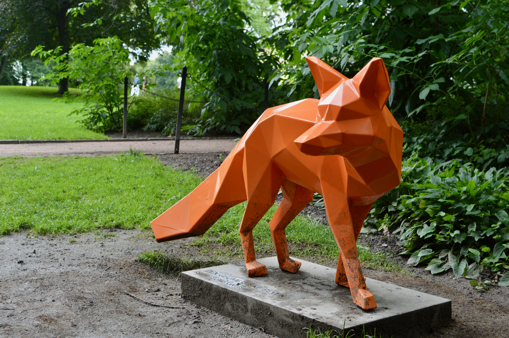

## Getting Information and Help

COMP1720 Forum: <>

this is the best (and quickest) place to get help, anonymous as well as private posting

Course website: <https://comp.anu.edu.au/courses/comp1720/>

lectures, labs, assessments, and policies

Extensions: use the Extension App (see [extensions](/01-policies.md#extensions))

## referencing and academic integrity

> All ideas, code and content that is not created by you **must be referenced** in your references file.

- This course is a collaborative place. 
- You are expected to work together in labs and to take inspiration from online/other sources.
- **But**, you need to be aware of how to reference appropriately and acknowledge sources.

In every assignment you **must** acknowledge **at least two** references in your **`references.md`**.

Read the [course policy](/01-policies.md#academic-integrity) on academic integrity and the ANU's [academic integrity best practices for
learners](https://services.anu.edu.au/learning-teaching/academic-integrity/academic-integrity-best-practice-principles-for-learners).

## Expectations:

Us: help and support ahead of time ([communication policy](/01-policies.md#communication))

You: **engage early**, participate in your labs, and **MAKE!**

**Warning**: Lectures and labs are where we communicate our expectations for your assessments. If you don't show up, you're unlikely to know what to do. 

You are expected to **participate** in the learning activities!

---


## course reps

official liaison between your peers and convener!

gathers feedback from classmate creatively and proactively!

attend meeting with other course reps and influence your education!

want to be a course rep? Read [this post](https://edstem.org/au/courses/17682/discussion/2083942) and follow the instructions within. 

<!--

---


## questions?

-->

<!-- code theory -->

---


## code theory

Ok, how are we going to make some art with computers?

(we'll leave the "interactive" bit for a while...)

## quick glossary

- **p5.js** - a javascript library for making interactive code art
- **javascript (or js)** - a programming language (runs in the browser)
- **sketch** - a p5.js drawing/widget which you can view/interact with
- **browser** - your web browser (e.g. Chrome)
- **editor** - a program for writing code (we'll use [VSCode](code.visualstudio.com) in this
  course)
- [**p5.js online editor**](https://editor.p5js.org/) - an _online_ editor for writing code (often used in lectures)

---


## p5.js vs js

a **library** is just bunch of code (perhaps written by someone else)

p5.js is a javascript library

sometimes I'll say *p5*, *p5js*, *p5-dot-js*---they're all the same thing

## the p5.js reference

the p5 reference: <https://p5js.org/reference/> is your **most important resource**!

whenever I refer to "the reference", that's what I'm talking about

## painting

a p5 sketch is a *digital canvas*

you draw lines, shapes & other things

fill/stroke colours (the "paint" on the paintbrush)

---

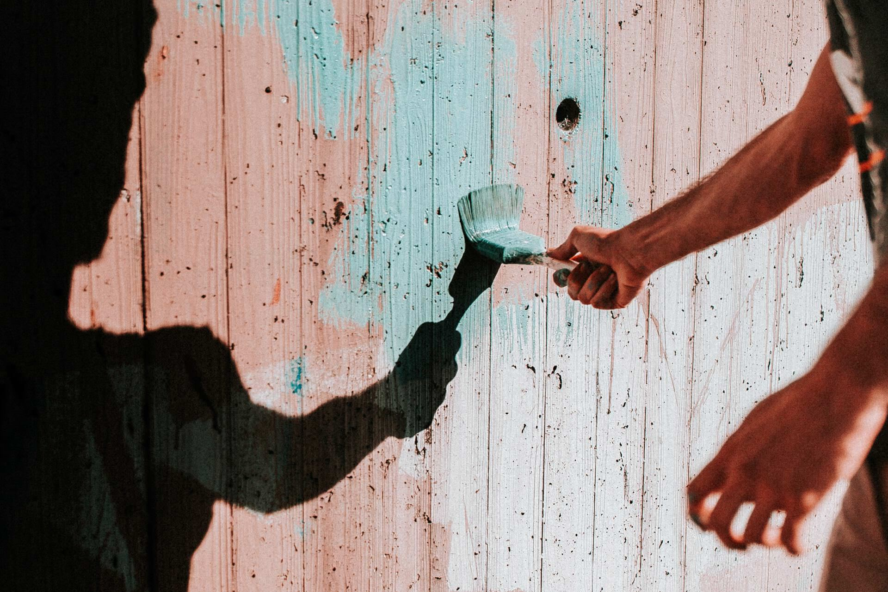

## the order matters!

---

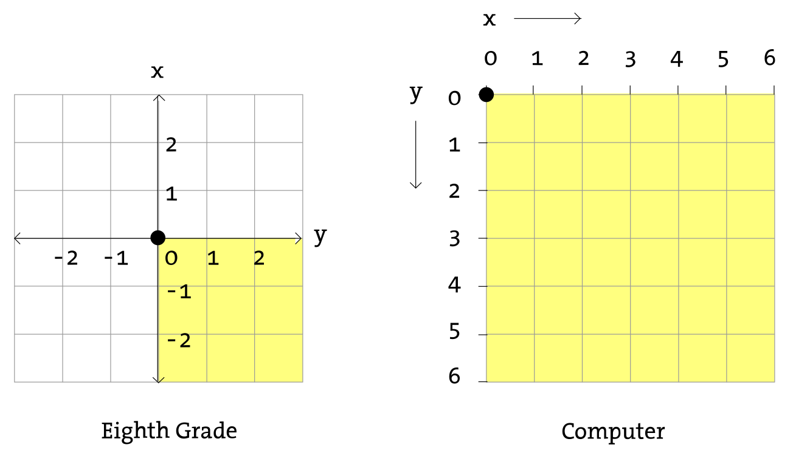

## the grid

---

<div class="image-credit">[source](https://p5js.org/learn/coordinate-system-and-shapes.html)</div>

## the grid

we represent 2D positions as numbers (this is a theme)

it's like a big sheet of paper with individual squares

the units are called *pixels* (px for short)

---

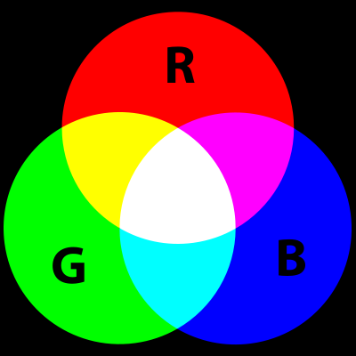

## colours

## colours

in p5.js we specify the different RGB (red green blue) components with numbers (0-255)

red + green = yellow, red + blue = purple, etc.

there's also alpha (transparency), different colour modes (RGB, HSL, etc.)

N.B.: `p5` uses _US English_ spelling colour here is `color`

## vocabulary

p5.js only understands certain instructions

how do you know what you can say?


...the [reference](https://p5js.org/reference/)

## functions

```javascript
ellipse(0, 0, 100, 100);
fill(255, 0, 0);
```

"ellipse" and "fill" are **functions**

functions tell p5.js **what** to do (what function to perform)

in p5.js, many of the functions are about drawing things on the canvas

let's see how this looks with a quick demo

## syntax 

In language this means: the structure of words and phrases in sentences.

In computing this means: the structure of statements in a programming language

## parameters example

```javascript
fill(250, 0, 0);
```

we say "the `fill` function takes 3 parameters" (in this case `250` for red, and
`0` for green & blue)

parameters make functions re-usable (to draw two different sized circles, you
use the same `ellipse` function, but with different `width`/`height`
parameters)

---

<!-- _class: impact -->

functions: **what** to do

parameters: **how** to do it

## debugging

- Things go wrong _all the time_ in programming. 
- We need **feedback** from the computer to figure out what is happening.

In your web-browser, you can use the "javascript console" to get error messages from your p5 program.


In Chrome: **developer tools* are available
through 
- `View > Developer > Developer Tools`
- `Ctrl+Alt+I` (on windows and linux)
- `CMD+Opt+I` (on a mac)
- right click on the page to open context menu -> Inspect -> Click Console

## the COMP1720 workflow

1. edit your code file (`sketch.js`) in your editor (VSCode)
2. run the "live webserver" (_Go Live_)
3. you point Chrome at the webserver (and point Chrome at
   <http://localhost:5500/>) to view the page
4. every time you save your `sketch.js` file the webserver tells Chrome to
   refresh

the [lab 1 content](/labs/01-intro/) is your training in our workflow! Get on it.

---


## what is art?

...and how can we make it in `p5`?

---

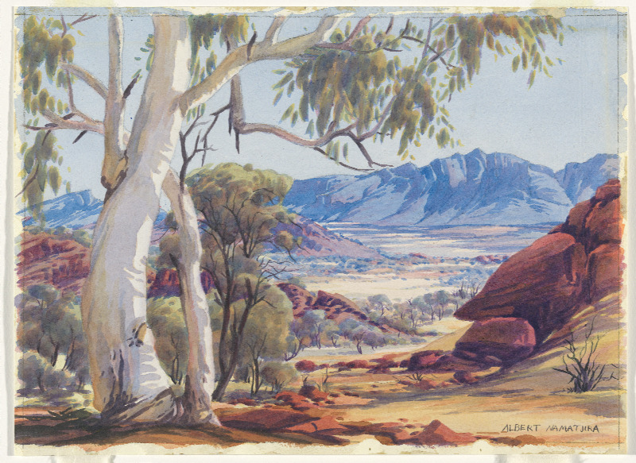

<!-- Sometimes art is a lovely picture, like this one by Albert Namatjira, a famous Indigenous artist -->

<!-- he was very well able to capture the Australian landscape, which was popular at the time -->

---

<div class="image-credit">Albert Namatjira (1902--1959) --- *not titled landscape ([link](https://searchthecollection.nga.gov.au/object?uniqueId=128188))*</div>

<!--

---


-->

<!-- **This is great**

... but it's probably not the kind of art you're going to make in p5.

this was made with paints and a brush. In p5, we're working with colours and shapes, it can be quite difficult to be true to "painting" in terms 
of brush strokes and colour mixing, etc.

sometimes you need to think about the tools that you're working with when creating your artwork

_What is the best kind of artwork I can make **in p5?**_ -->

<!--

---

<div class="image-credit">Albert Namatjira (1902--1959) --- *not titled landscape ([link](https://searchthecollection.nga.gov.au/object?uniqueId=128188))*</div>

-->

## What is art?

Plato (375BC)

> art is imitation

- about copying something out of the real world
- the goodness of the imitation influences the goodness of the art

Kant (1790)

> a kind of representation that is purposive in itself

- representation as in something in the world
- not just descriptive, has it's own role in and of itself

## What is art?

Michel Duchamp (1910s)

> art is anything (??)

- anything you call art
- not just about representation, being a pretty picture, etc.

(see more at the [Stanford Encyclopedia of Philosophy](https://plato.stanford.edu/entries/art-definition/))

## What is art?

Dr Tony Curran (2020) (friend of comp1720)


> when something is done so well that it exceeds the function of the thing that
> it is for


> it has a surplus or excess _je ne sais quoi_

- something that exceeds its function, kind of like what Kant said, has its own purpose
- _je ne sais quoi_ meaning _I don't know what_

## which of these is _"art"_?


<!-- this is an open question

to me the one on the right is still going to be a very good cup of coffee

the one on the left is less about being a good cup of coffee, instead the foam is exiting the cups and its starting to have more of a purpose than just being a cup of coffee -->

---

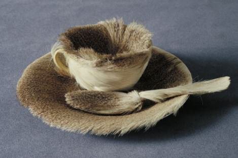

---

<div class="image-credit">Meret Oppenheim (1913–1985) --- *Object*</div>

<!--

---


---

<div class="image-credit">Meret Oppenheim (1913–1985) --- *Object*</div>

here, the _je ne sais quoi_ quotient is skyrocketing. it's a cup, saucer and spoon covered in fur

it's a very strange object, certainly not fit for its original purpose, and it raises more questions than it answers

also interesting to note is that the artist has called it 'Object', so not even a cup. We can see that obviously it is a cup with fur on it, however the artist may not see it this way. -->

---


## art and material

Sometimes it is good to consider the materials we have and make art that suits them!

What materials do we have for making art in `p5` **right now**?


We know how to make a circle.

---

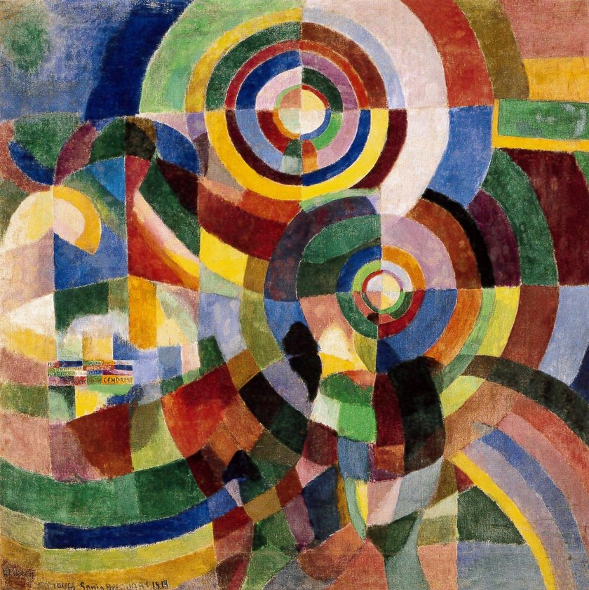

---

<div class="image-credit">Sonia Delaunay --- *Prismes electriques*</div>

---

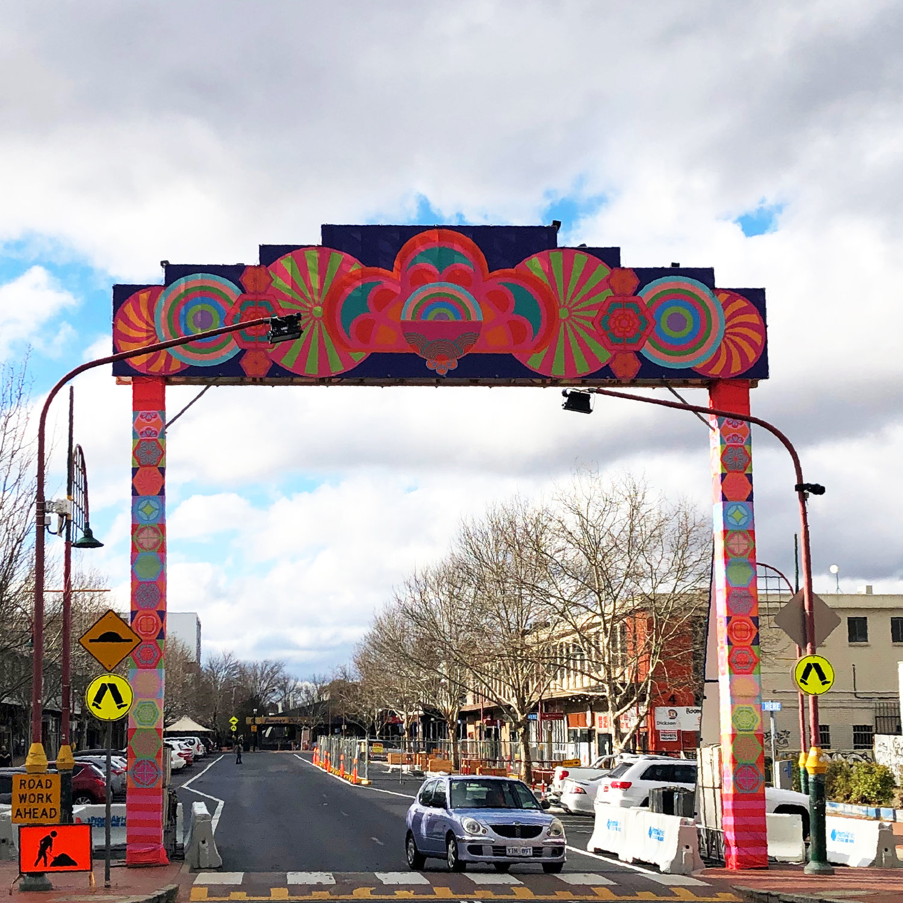

---

<div class="image-credit">Jodie Cunningham --- *Canberra Journeys ‘Design for Gateway Arch Crown for Woolley St Project*</div>

<!--

---


this is a play on the Chinese tradition of having an arch to represent a district

many circles incorporated into the design

---

<div class="image-credit">Jodie Cunningham --- *Canberra Journeys ‘Design for Gateway Arch Crown for Woolley St Project*</div>

-->

---

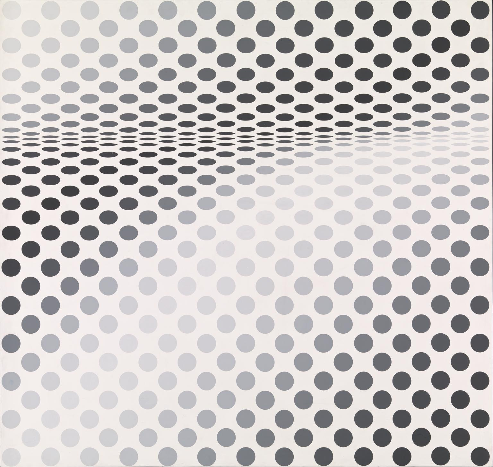

---

<div class="image-credit">Bridget Riley (b. 1931) --- *Hesitate*</div>

<!--

---


this one is great because it is using circles of differing height to create the effect ofa shifting surface, even though it is just a 2d screen

this is something that we could do in p5! we know how to create circles of differing height

---

<div class="image-credit">Bridget Riley (b. 1931) --- *Hesitate*</div>

-->

---


---

<div class="image-credit">Ensemble Metatone (Charles Martin et al.)</div>

<!--

---


one of Charles, the previous lecturer's sound artwork

this is a musical interface that is also based on circles

---

<div class="image-credit">Ensemble Metatone (Charles Martin et al.)</div>

-->

<!-- constraint -->

---


## art and constraint

---


## art and constraint

but first, another shape...

---

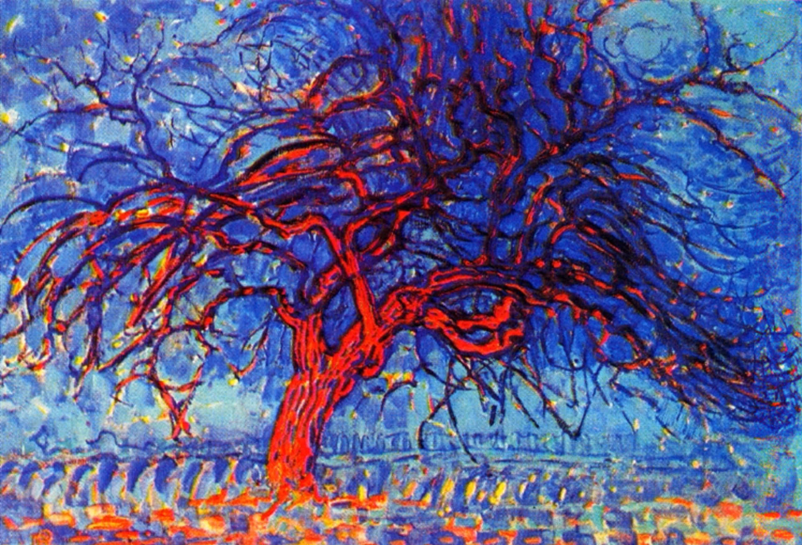

---

<div class="image-credit">Piet Mondrian (1872 - 1944) --- *Evening: Red Tree*</div>

<!--

---


Piet Mondrian embraced constraint in their work

it's very detailed, but has simplicity in the colour system (red, yellow and blue)

it works with the primary colour system of red, blue and yellow

turns out the primary colour system works differently depending on your medium

paints and dyes tend to absorb light

screens and filters tend to be additive

for paints you add colours together to remove colours, for filters to add colours together to create colours

more on this in future weeks

---

<div class="image-credit">Piet Mondrian (1872 - 1944) --- *Evening: Red Tree*</div>

-->

---

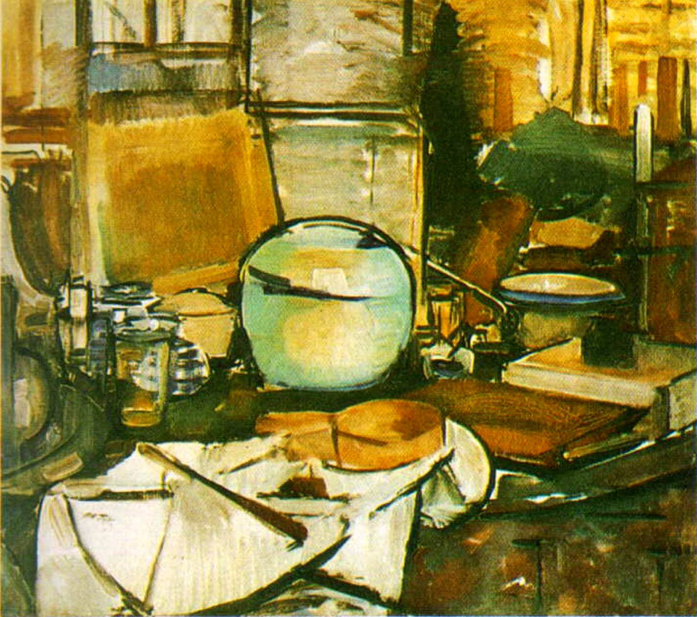

---

<div class="image-credit">Piet Mondrian (1872 - 1944) --- *Still Life with Gingerpot I*</div>

<!--

---


a little bit later, Still life with gingerpot

it's getting simpler, but it's still hard to see what is going on

messy, artists life can be messy

---

<div class="image-credit">Piet Mondrian (1872 - 1944) --- *Still Life with Gingerpot I*</div>

-->

---

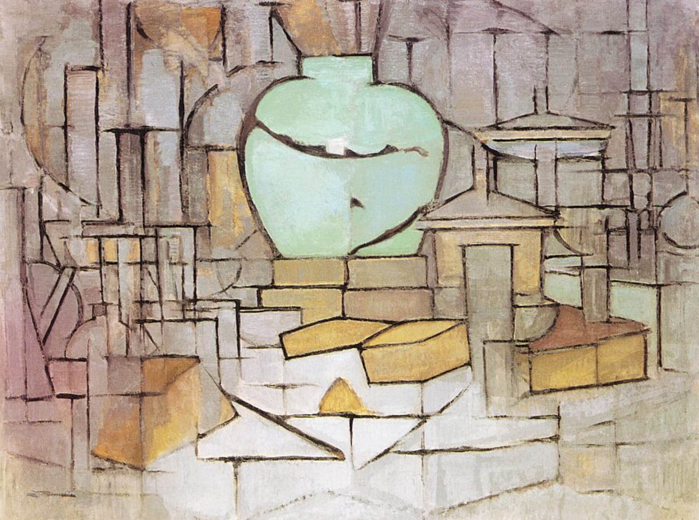

---

<div class="image-credit">Piet Mondrian (1872 - 1944) --- *Still Life with Gingerpot II*</div>

<!--

---


then more drastic changes, 'Still Life with Gingerpot II'

they're removing elements of detail, and starting to focus on specific shapes and lines in space

---

<div class="image-credit">Piet Mondrian (1872 - 1944) --- *Still Life with Gingerpot II*</div>

-->

---

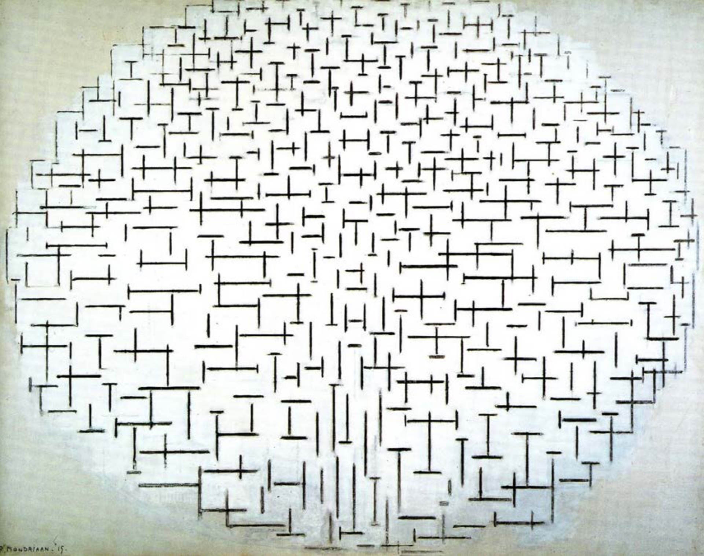

---

<div class="image-credit">Piet Mondrian (1872 - 1944) --- *Composition 10 in black and white*</div>

<!--

---


now even more drastic, only 2 colours, black and white

not even using shapes, only vertical and horizontal lines

---

<div class="image-credit">Piet Mondrian (1872 - 1944) --- *Composition 10 in black and white*</div>

-->

---

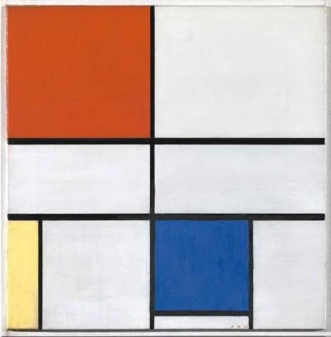

---

<div class="image-credit">Piet Mondrian (1872 - 1944) --- *Composition C (No.III) with Red, Yellow and Blue*</div>

<!-- NOTE: the original Composition with Red, Yellow and Blue was created in 1930 -->

<!--

---


towards the end of his life, Mondrian created these works called the 'Compositions' in different colours

this one being Composition with Yellow, Blue and Red

these were a huge hit, even having dresses etc. with the works printed on them

it became very symbolic of modern art

if you remember, this has elements that Mondrian was working with throughout their career: primary colours, basic shapes / vertical and horizontal lines

---

<div class="image-credit">Piet Mondrian (1872 - 1944) --- *Composition with Yellow, Blue and Red*</div>

-->

<!--

---


Mondrian went from painting pictures that represented things, to pictures that were constrained in their representation

then eventually breaking free from representation as a primary goal and just working with the constraints and materials to create wonderful artworks

---

<div class="image-credit">Piet Mondrian (1872 - 1944) --- *Composition with Yellow, Blue and Red*</div>

-->

---


## praxis

Make a Mondrian-style "composition".

Use basic shapes: e.g., `rect`

Use basic colours: e.g., `fill(255,0,0)`

---


## dangers

"the code stuff is too easy---see you in week 10"

"the code stuff is too hard---I'm out!"

"the art stuff doesn't matter, I'll just submit some working code and *bam*---HD!"

---


## further reading/watching

Dan Shiffman's videos (start
[here](https://youtu.be/yPWkPOfnGsw))

[do lab 1](/labs/01-intro/)

p5.js [reference](https://p5js.org/reference/) & [examples](https://p5js.org/examples/)

[MDN js docs](https://developer.mozilla.org/en-US/docs/Web/javascript) (more
advanced, general js not specific to p5.js)

[assignment 1](/assessments/02-monster/) is due 12 August 2024, 9:00 pm (Monday Week 4)
