<!-- _class: banner -->

# COMP1720


---


## admin

[assignment 1](/assessments/index/) released

make sure you've checked you can access the [course forum]()

[labs started this week](/labs/index/)

nominate to be a class rep!

<!--

---

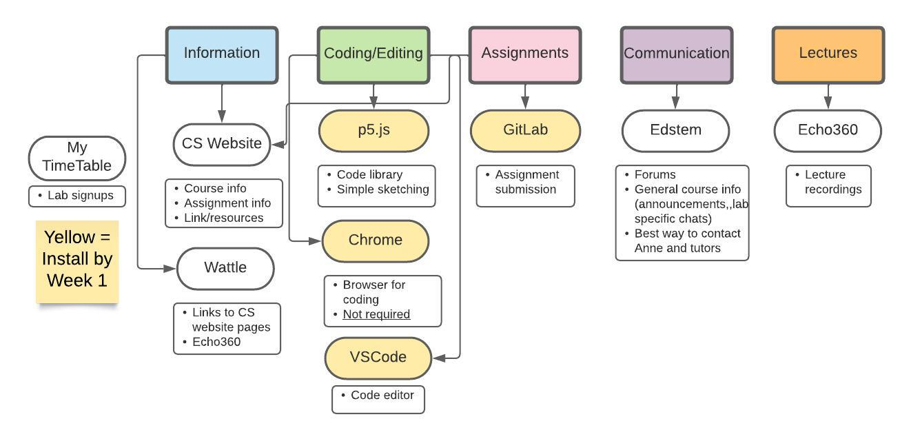

## tools

---

<div class="image-credit">Avery Rowe & Yichen Wang</div>

-->

## recap

<!-- code theory -->

---


## code theory

**today's concepts:**

flow

types and variables 

## what's the flow through this code?

```javascript
rect(300, 200, 200, 200);
ellipse(400, 300, 100, 100);
line(200, 200, 400, 400);
```

## how about this one?

```javascript
line(200, 200, 400, 400);
ellipse(400, 300, 100, 100);
rect(300, 200, 200, 200);
```

---

<!-- _class: impact -->

does it **matter**?

---

<!-- _class: impact -->

let's take a look

## remember: the "painting" metaphor

each shape in p5 is "painted" **on top** of what was already on the canvas (so
the order matters!)

to "clear" the canvas (to paint it all with one colour) use the `background`
function ([link to reference](https://p5js.org/reference/#/p5/background))

the `background` function has several different syntax options depending on how
you want to set the colour

## the setup-draw loop

``` javascript
function setup() &#123;
    createCanvas(windowWidth, windowHeight);
    // any additional setup code goes here
&#125;

function draw() &#123;
    // your "draw loop" code goes here
&#125;
```

_note_: if a line starts with `//` it's called a "comment"; it's ignored by p5,
it's just there for humans

---

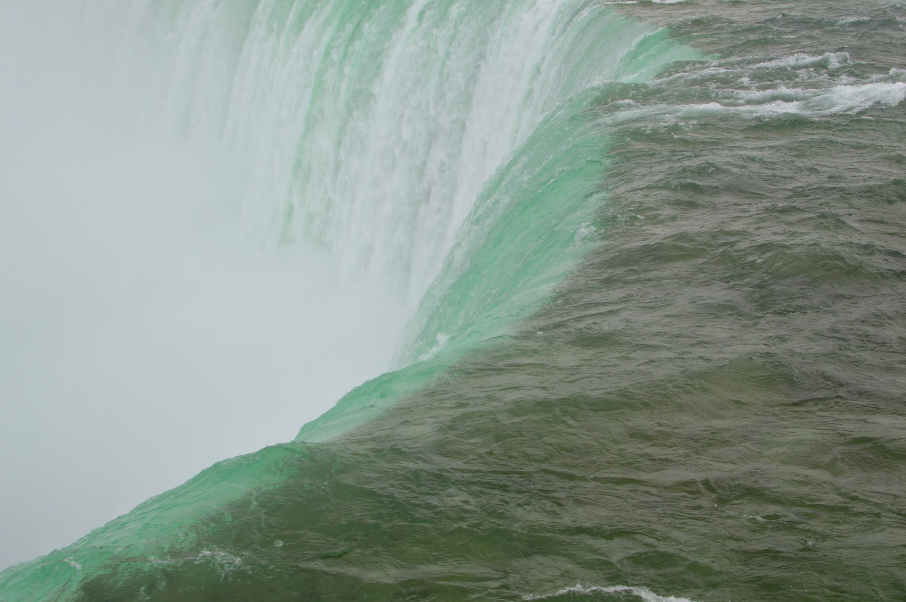

## flow

## more loops

later in the course we'll learn to create our **own** loops, so we can do more
than just setup, draw, draw, draw...

for now, see the **flow**---it'll keep going forever...

if it does the same thing each time (e.g. draws a static rectangle) then we'll get
a still image

<!-- but if starts to do different things... -->

## functions and flow

p5 uses **braces** `&#123;` and `&#125;` (*aka* sqiggly brackets) to show where flow
starts and stops

remember: a function is a *re-usable* chunk of code which takes parameters

the `draw()` function takes zero parameters (hence the `()`) and then executes
the code between the braces (called the *body*) of the function

---


## look for the matching pairs

when you see a `&#123;`, there will be a matching `&#125;` further on

same for `(`, `)`, `[`, `]`

## more flow

as our programs get more complex, the flow will get more complex

but at the top level it's still the same `setup`, `draw`, `draw`, `draw`, `draw`, ...

as a programmer, you are the *master* of the flow

and if you're ever wondering why your program isn't doing things in the order
you expect...

---


## remember the flow

if your operations aren't in the right order...

... then you might not be seeing what you expect, even if there aren't any "errors"

---


## like a series of photos (frames)

## data types and variables

Some numbers...

<ul style="font-size: 1.2em;">
<li class="fragment">7</li>
<li class="fragment">654</li>
<li class="fragment">5.77</li>
<li class="fragment">number of planets in the solar system</li>
<li class="fragment">your age</li>
<li class="fragment">🥔</li>
</ul>

<p class="fragment">are these the same kind of number?</p>

## first steps towards animation

``` javascript
function setup()&#123;
  createCanvas(800, 600);
&#125;

function draw()&#123;
  background(255);
  rect(100, 100, frameCount, 100);
&#125;
```

what's this `frameCount` thing?


let's have a look...


the *name* (`frameCount`) stays the same, but the *value* is different each time
through the draw loop

## variables

some numbers are always the same (e.g. **100**)

some numbers are always the same, but have "names" (e.g. **pi**)

some numbers change (or _vary_) over time (e.g. **your age**)

## variables: definition

in programming, a **variable** is how we give a *name* to a *value* (e.g. a
number) which (can) change

this is really handy, because in lots of cases you're dealing with things which
will change

---

<!-- _class: impact -->

the **name** stays the same

but the **value** can change

<!-- ## a word of caution

this is great, but it can get you into trouble!

sometimes the value of the number may make sense, and sometimes it may not

this can result in strange or unintended effects that aren't an "error" but because the value has gone out of what you expect

remember the flow, and it is up to you to control these values -->

---


## time and change in p5

time represented with **numbers** (just like position & colour were)

there are a few different ways to represent time, but the main one we'll use is
the `frameCount` variable (although it's just a number)

it's *relative* (e.g. it can't tell you if it's 4pm, but it can tell you the
time since your sketch started running)

using this variable in your sketch allows for **change**

## more variables

``` javascript
function setup()&#123;
  createCanvas(windowWidth, windowHeight);
&#125;

function draw()&#123;
  background(255);
  rect(mouseX, mouseY, 100, 100);
&#125;
```

p5 has a bunch of useful variables built-in (as usual, the
[reference](https://p5js.org/reference/) has the full list)


can you guess what this is going to look like?


let's have a look

---


## types


you may start to think of the *type* of something:


a pokemon  
spoons 🥄  
...  


## types

as well as a name, every variable has a *type* (sometimes called a data type)

in p5, values can have the following types:

- **Number** (e.g. `100`, `4.5`)
- **String** (e.g. `"Hot Potato"`---note the double quotes)
- **Boolean** (`true` or `false`)
- **Undefined** (p5 doesn't know what it is)
- **Object** (wait until week 4)
<!-- - **Null** (don't worry about this too much for the moment) -->

the **Parameters** section of the reference for a function tells you what types
the parameters should be

---

<!-- _class: impact -->

_mostly_ **numbers** so far

but not always

## declaring your own variables

we can **make our own** variables---we're not stuck with the built-in ones

there are three steps to this process:
1. **declare**: `let age;` means *there's a variable called "age"*
2. **initialise**: `age = 34` means *set the age variable to the number 34*
3. **use**: *when you do refer to the variable in your code*, e.g. `2*age`

## declaring your own variables

you can combine the **declaration** and **initialisation** steps in one line
(this can appear anywhere in your code)

``` javascript
//  name  value
let max = 100;
let min = 10;
```

let's have a look

## declaring your own variables

a variable can be initialised using the value of another variable, or with
the result of a calculation, or even the return value of a function

``` javascript
//  name    value
let range = max - min;
let randomValue = random(13);
```

## modifying variables

the names doesn't change

but we *can* change the value

``` javascript
// name    value
   range = range + 1;
```

note: there's no `let` declaration the second time (it's already declared)

also note: sometimes you will see `var` instead of `let` (older way of doing more-or-less the same thing)

in general, we'll learn about these things by _using_ them

## a note about maths

most of the mathematical operators we'll use in this course you learned in
primary school maths (`+`, `-`, `*`, `/` etc.)

so we won't dwell on them here, but we'll cover them extensively in the labs

you can also check out the [arithmetic operators docs on
MDN](https://developer.mozilla.org/en-US/docs/Web/JavaScript/Reference/Operators/Arithmetic_Operators)

<!-- art part -->

---

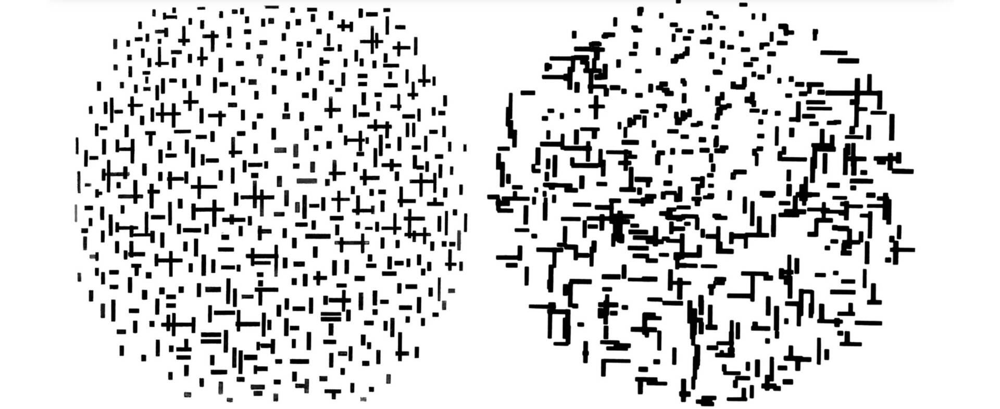

one of these is a [Mondrian](https://krollermuller.nl/en/piet-mondriaan-composition-in-line-second-state-1), the other is a [program written by A. Michael Noll simulating a Mondrian on an
IBM 7094](https://collections.vam.ac.uk/item/O1193787/computer-composition-with-lines-photograph-a-michael-noll/), but which?

<!-- 

this is linking in to what we were talking about last week, with Piet Mondrian. this time one of the images is created using a very old IBM mainframe computer


the left one has a more uniform, but still random, layout and composition. which is more aesthetically pleasing

 
how do you think the size and location of these particular squares were chosen? -->

---


## random chance

What do we value in "art" anyway?

Can art be random?

How can we use _randomness_ in `p5`?

---

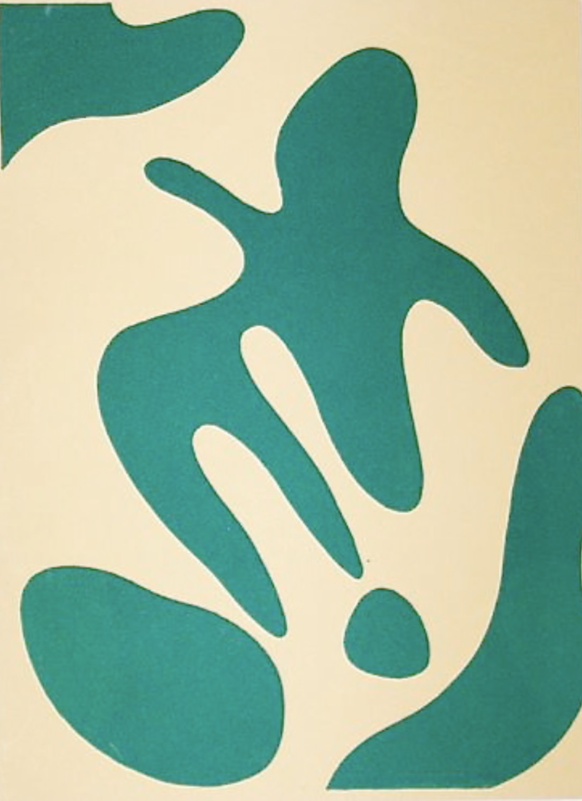

## Dada

---

<div class="image-credit">Jean Arp (1886-1966) --- *Constellations*</div>

<!-- 

Formed by _randomly_ dropping paper shapes!


part of a movement called dada-ism, a post ww1 movement of artist that, to oversimplify it, thought that all previous art was associated with the world order that lead to ww1


the war was so shocking to people that they wanted to create new art with all new methods

---


## Dada

---

<div class="image-credit">Jean Arp (1886-1966) --- *Constellations*</div>

one of the things they investigated was taking the artist out of the work, so for this one they simply dropped the shapes and let "chance" take over -->

---

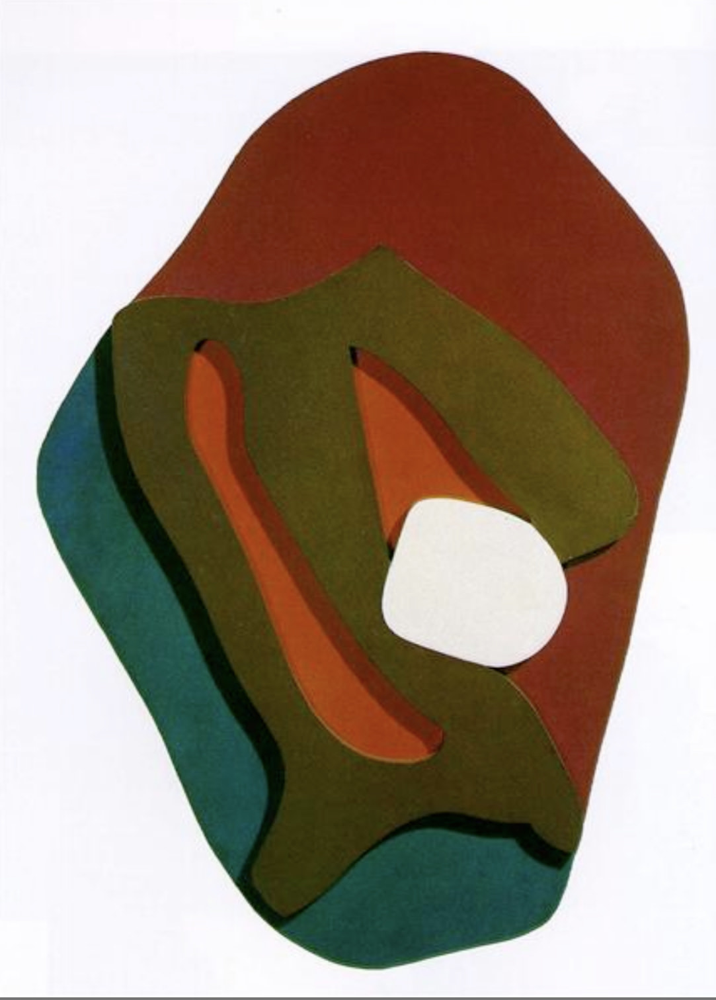

---

<div class="image-credit">Jean Arp (1886-1966) --- *Enak's Tears (Terrestrial Forms)* --- private collection</div>

---

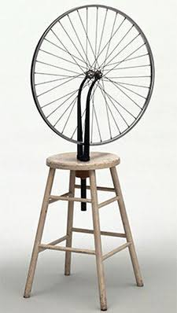

---

<div class="image-credit">Marcel Duchamp (1887-1968) --- *Bicycle Wheel* --- MOMA NY</div>

<!-- 
another famous dada artist for using random materials! rather than taking the traditional tools (paint etc.), they would use things they found around the house


is it really a bicycle wheel at all anymore? we're certainly not going to be rolling around on it. the  je ne sais quoi quotient definitely high here. -->

---

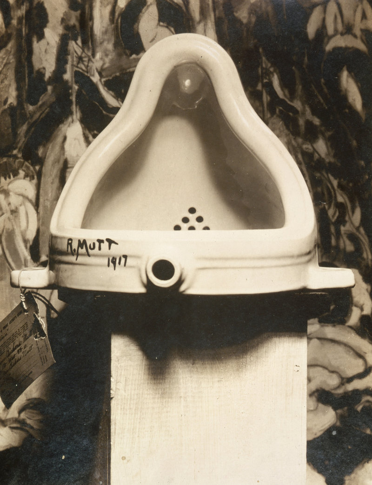

---

<div class="image-credit">Marcel Duchamp (1887-1968) --- *Fountain* --- lost</div>

<!-- 

probably one of their most famous works, fountain, which is a toilet turned on its side and then signed it with a pseudonym and placed it on a pedestal in an art exhibition -->

---

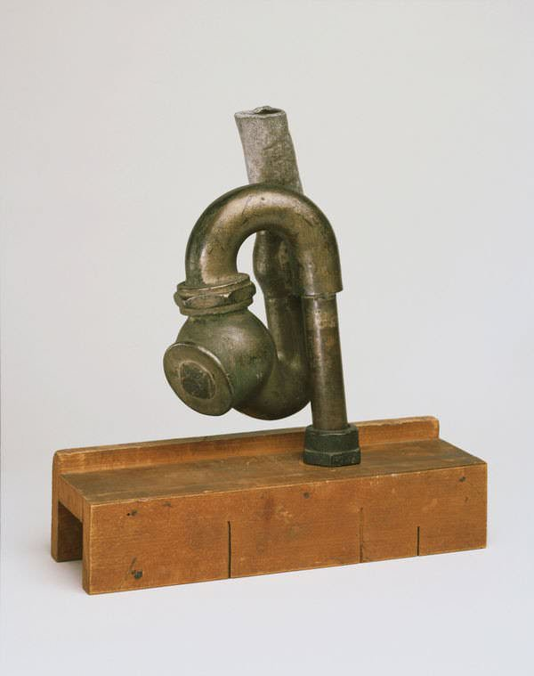

## readymades

---

<div class="image-credit">Elsa von Freytag-Loringhoven --- *God* --- courtesy of the Philadelphia Museum of Art</div>

<!-- 
Duchamp wasn't the only one doing this, this piece is created from a piece of pipe and wood. given the name 'God' which is kind of provocative to do something with religion and tie it in with random items around the house


randomising culture!


that's what dada's were doing, trying to change things to hopefully change the world -->

## let's have a go at dada in p5

<!-- we'll try and follow what Jean Arp was doing with radomising shape placement -->

---

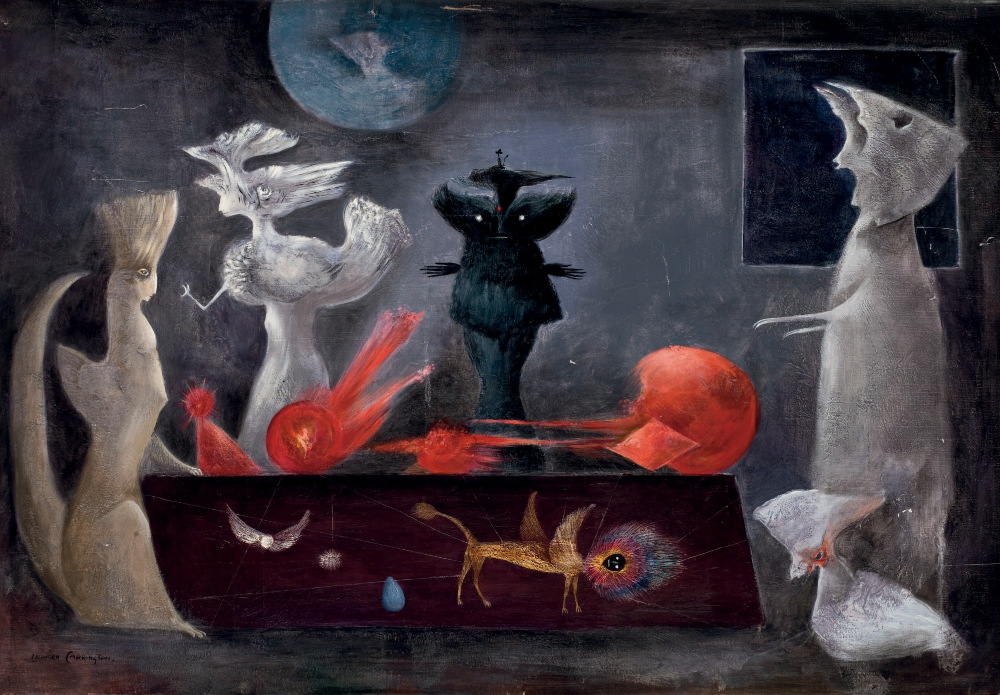

## randomness and the unconscious

---

<div class="image-credit">Leonora Carrington --- *Evening Conference* --- 49.5 x 72.5cm</div>

<!-- 
can randomness less us tap into the subconcious mind?


can rolling a dice help us tap into our subconcious or dream worlds that exist inside our mind but we can't access any other way -->

---

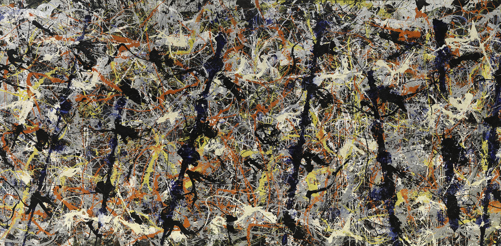

## can art ever be truly random?

---

<div class="image-credit">Jackson Pollock  (1912-1956) --- *Blue poles [Number 11, 1952]* --- Nation Gallery of Australia</div>


read more [here](https://bluepoles.nga.gov.au/artwork/blue-poles/)

<!-- 
a very famous piece of art called blue poles by Jackson Pollock, (its in the national gallery of Australia) -->

<!-- 
when this was purchased it cause a great outcry over the value of art as it was purchased for a lot of money at the time


people saw the price and saw the art and thought what is this, it's just random paint splashed on something -->

---

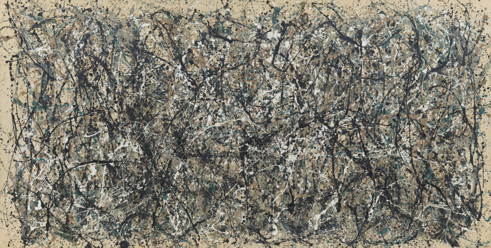

---

<div class="image-credit">Jackson Pollock  (1912-1956) --- *One: Number 31* --- Museum of Modern Art, NY</div>

[video: demo of Pollock's process](https://youtu.be/EncR_T0faKM)

<!-- they had a very specific process for creating things that were random in "just the right way"

even though it is messy, there was a complexity and thought behind how things were done, which is why it is an artwork and not just random splashes -->

---


## are these totally random?

what are the rules of "action painters" like Pollock?

---

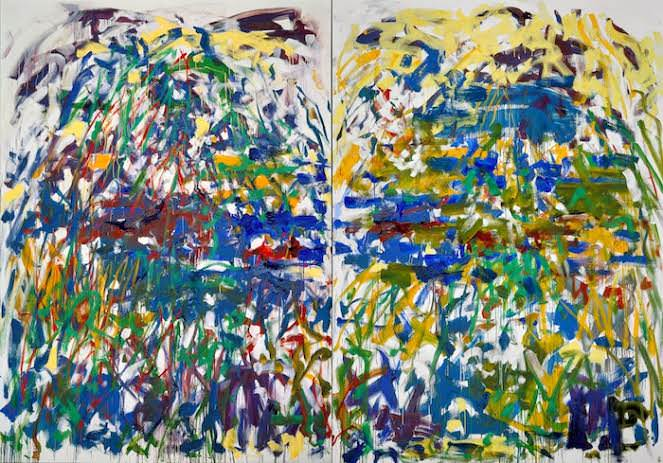

---

<div class="image-credit">Joan Mitchell --- *Rivière*</div>

<!-- 

they would stand in front of the canvas and make brush strokes with different colours


you can kind of see the range of motion for a person, as the top strokes feel more like a reaching horizontal stroke compared to further down


with these random artworks, they have used constraints to give them style, like this one with constraints of the human body affecting the strokes


they're not *completely* random, they have structure and rules -->

---

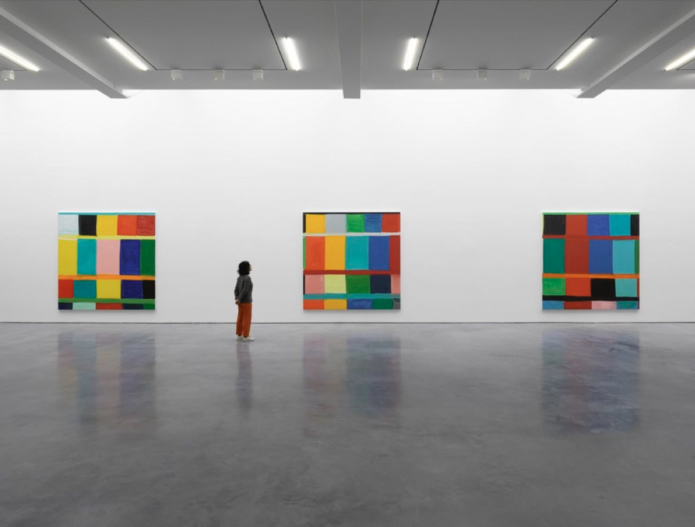

## rules, randomness and variation

---

<div class="image-credit">Lisson Gallery</div>

<!-- 

this is moving from randomness, more towards variation. where this artist has investigated using different colours to create *basically* the same painting -->

---

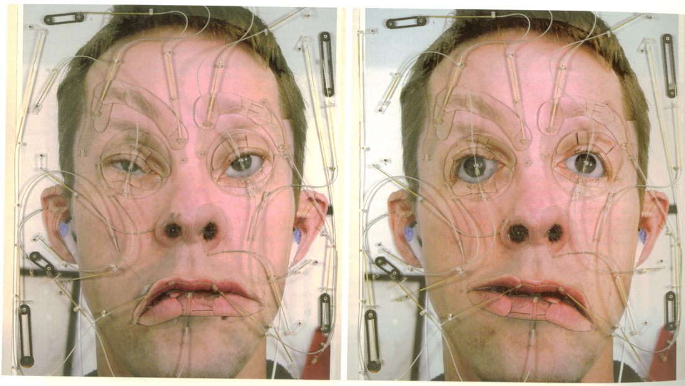

## Tim Hawkinson

---

<div class="image-credit">Tim Hawkinson --- *Emotor, 2000 ([link](https://art21.org/watch/art-in-the-twenty-first-century/s2/tim-hawkinson-in-time-segment/))*</div>

<!-- 

this is a mechanical electric artwork, it's quite related to what we do in p5, and indeed in the first assignment


the artist has cut up bits of their face and attached them to mechanisms so that they can be moved about to give different expressions -->

---

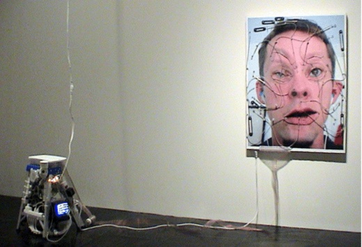

## Where's the randomness?


<!-- 
there is an old tv (crv) which is tuned into basically static, which is when you're effectively listening to noise in the environment. and they have used sensors attached to the screen to pick up what is being displayed


think about how this could work for your monster... different parts of your monster that are controlled by variables which can move in different ways based on changing random numbers -->

<!-- what are the "rules" of p5? -->

---

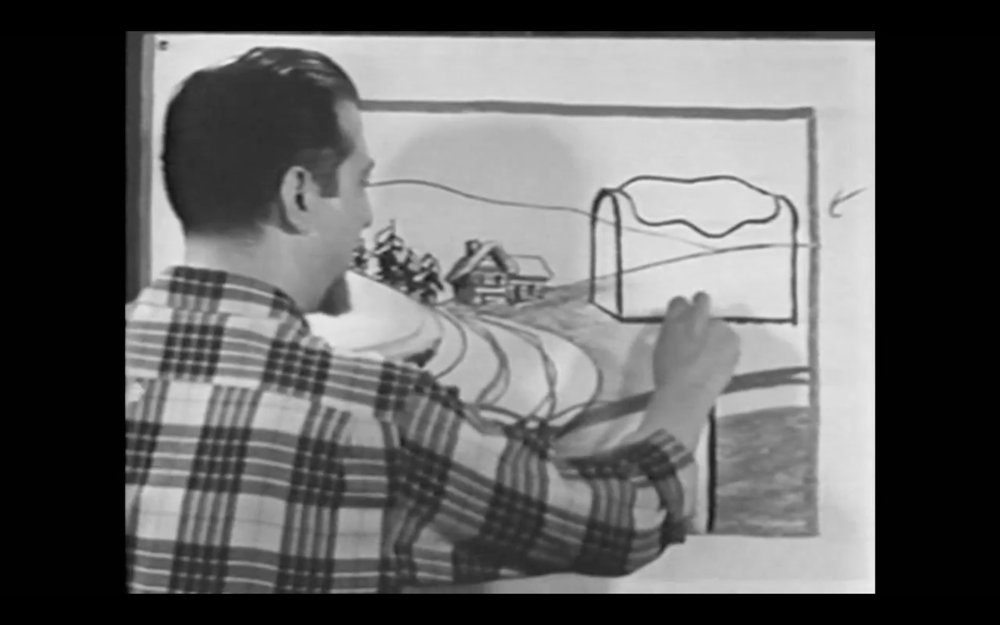

## TV Art: breaking art into steps

<!-- 

broken down into steps, to show how you go from basic shapes, to a more complex image -->

---

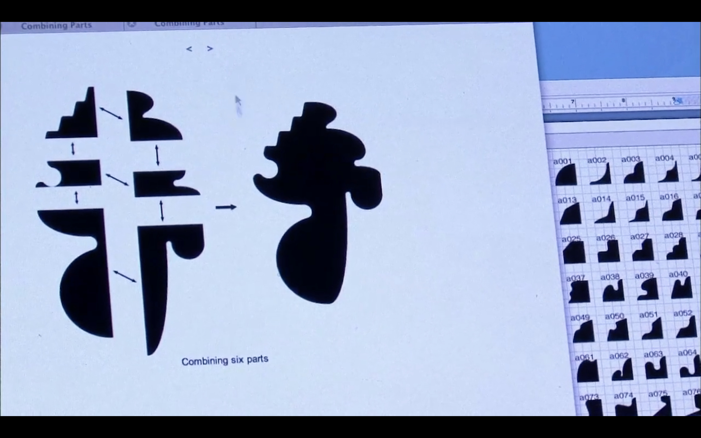

## Allan McCollum on Art21

<!-- 

another step based artwork where there has been a process created for breaking down shapes into sub shapes and then another process for putting them together


the process and sub shapes are predefined, but the selection is random, this gives us variation -->

---

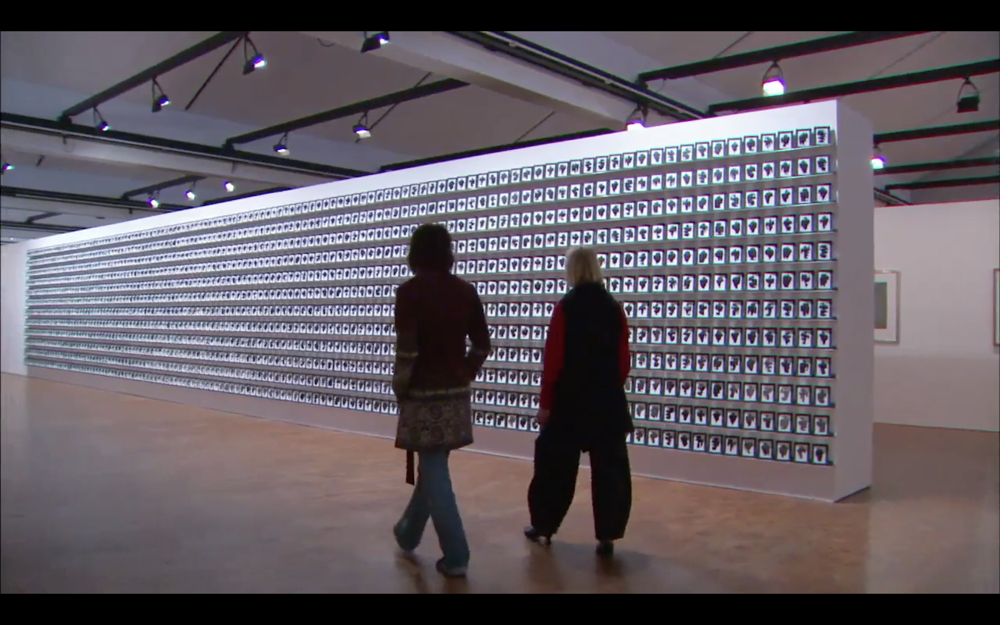

## Allan McCollum on Art21

---

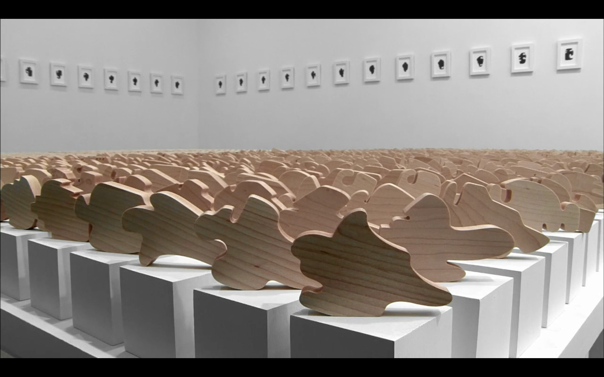

## Allan McCollum on Art21

<!-- A toolkit for randomness in p5 -->

---


## a toolkit for randomness

Think about introducing _variation_ rather than _noise_.

something that is flashing is not very nice to look at

What _random variations_ can you do in `p5` already?


`random()` is your friend...


use `frameCount` in your artworks


input from a person with `mouseX` and `mouseY` (more on this later, banned in Assignment 1!)

## `random()`

- `random()` gives you a number from 0 up to 1.

- `random(10)` gives you a number from 0 up to 10.

- `random(25,50)` gives you a number from 25 up to 50.

Have a look at [the reference](https://p5js.org/reference/#/p5/random) - there's some other details about `random` that we will look at later.

---


## let's make some random art

---


## further reading/watching

[variables on MDN](https://developer.mozilla.org/en-US/docs/Web/JavaScript/Guide/Grammar_and_types#Variables)

[control flow on MDN](https://developer.mozilla.org/en-US/docs/Web/JavaScript/Guide/Control_flow_and_error_handling)

[Shiffman video: variables](https://www.youtube.com/watch?v=RnS0YNuLfQQ&index=6&list=PLRqwX-V7Uu6Zy51Q-x9tMWIv9cueOFTFA)

---


## further reading/watching

[Katharina Grosse in "Fiction"](https://art21.org/watch/art-in-the-twenty-first-century/s7/katharina-grosse-in-fiction-segment/)

[Tim Hawkinson](https://art21.org/watch/art-in-the-twenty-first-century/s2/tim-hawkinson-in-time-segment/)

[The process of Jackson Pollock](https://youtu.be/EncR_T0faKM)

["Random Chords" Example](https://editor.p5js.org/p5/sketches/Math:_Randomchords)

[Ch.8 "Random" - Getting Started with p5.js](https://learning.oreilly.com/library/view/make-getting-started/9781457186769/ch08.html#random)

<!--

---


## questions?

-->
