<!-- _class: banner -->

# COMP1720


---


## admin

[assignment 1](/assessments/02-monster/) due soon! (any questions?)

Remember that the git process you follow for the labs is exactly the same as
the process you'll follow to submit assignment 1!

remember the [Git help videos](/resources/04-screencasts/)

## course reps

Your course reps are now listed on the [Getting Help](/03-getting-help.md) page.

The course reps are here to listen to your concerns or issues confidentially, you can contact them over email or on [**the forum**]().

<!-- ## Example Assignment 1

Yichen's Example Assignment 1: Bluebot

- Git Repo: <https://gitlab.cecs.anu.edu.au/comp1720-2023-assignment-1>
- [Test Server](https://comp1720.cecs.anu.edu.au/comp1720-2023-assignment-1/)
- [Artist Statement](https://gitlab.cecs.anu.edu.au/comp1720-2023-assignment-1/-/blob/main/artist-statement.md)

## ass1 artist statement

Your submission must include a short (max 200 words) artist statement. This is a short document, written in the first person, which explains:

- What your artwork is.
- Why it is an artwork.

Tell us what is interesting and artistic about your submission—don’t assume
that we can guess. Explain how and why your work is interesting, coherent, and
has personality.

- **don't explain your code line-by-line**---instead, think about the overall
goals and effect you're trying to achieve

- use references to support your statement.

---


## References

Having references in your `references.md` is **good!**. (You **must** have at least two!)


If I include an image from the internet---should it be in my references? (YES!)


If I include code from p5js.org---should it be in my references? (YES!)


If I am inspired from a book---should it be in my references? (YES!)


If my friend suggested a nice colour---should it be in my references? (YES!) -->

## recap - variables

variables are a way to give names to _values_ (e.g. numbers, strings, etc.)
which might change

---


## recap - types

mostly numbers so far: numeric literals (e.g. `42`) and number variables (e.g.
`height`, `mouseY`, `frameCount`)

but there are other types (as we'll see)

---


## recap - flow

the "path" the running program takes through the code

jump around, then jump back (but it's **predictable**)

p5 uses a `setup`, `draw`, `draw`, `draw`... "draw loop"

---


## code theory

two new concepts:

**conditionals**

**iteration**

---

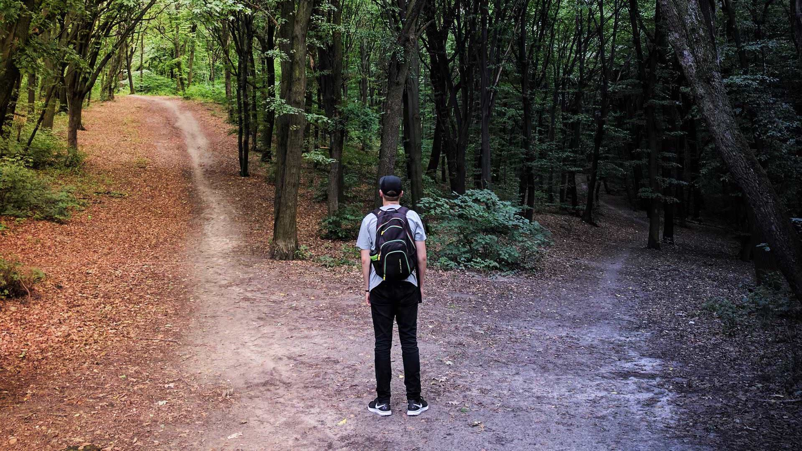

## conditionals


"**if** I run, I can make it to the tram stop in time"


"**if** I have a spare month I'll read _War and Peace_"


"I'll start assignment 1 **when** I've finished watching Netflix"

## Boolean type

there's a special data type for representing truth values called **Boolean**. How is it different?

- **Boolean** variables must be either `true` or `false` (no other possibilities!)

```javascript
// here are some boolean variables
let the_sky_is_blue = true;
let the_sea_is_red = false;
```

## Boolean logic

you can also get a Boolean from the result of a logical expression ([MDN
docs](https://developer.mozilla.org/en-US/docs/Web/JavaScript/Reference/Operators/Comparison_Operators))

- `<` (less than)
- `<=` (less than **or** equal to)
- `>` (greater than) 
- `>=` (greater than **or** equal to)
- `==` (equal to, note the double equals sign)
- `!=` **not** equal to

## Boolean logic

all these variables are also Boolean 

```javascript
let x_is_small = mouseX < 100;
let y_is_big = mouseY >= 500;
let jan_is_happy = !true;
```


**quick tip:** print to the console with `console.log()`  
example: `console.log("Hello world!")`  
this can be useful when **debugging**!

## combining Boolean expressions

we can use logic to check multiple things at once:

- `&&` (and)
- `||` (or)

<div class="fragment" markdown="1">
or inverse them:

-  `!` (not)
</div>

## combining Boolean expressions

this allows us to do things like

```javascript
(the_sky_is_blue && the_sea_is_red)
(the_sky_is_blue || the_sea_is_red)
(!the_sky_is_blue)
```

note: each whole line above evaluates to `true` or `false` depending on whether
the parts are true or false

## using Boolean expressions to make decisions

what if you want your sketch to do one thing some of the time, and another thing
the rest of the time?

javascript has an `if` statement:

```javascript
if (condition) &#123;
  // do something
&#125; else &#123;
  // do something else
&#125;
```

## this also has a human-language intuition

```javascript
if (the_sky_is_blue) &#123;
    ellipse(50,50,100,100);
&#125; else &#123;
    rect(50,50,100,100);
&#125;
```


let's have a look at a basic example.

## what could Boolean variables be used for?

monitoring some aspect of a program which is either `true` or `false`:
- has something been clicked?
- is something finished?
- enhancing **readability** of your code (e.g. if you create variables called
  `isFinished`, `sceneStarted`, etc.)

## JavaScript vs p5: a note about the docs

This is a _bit_ tricky for new coders, the documentation is in two places.

- language features like `if` statements (and `while`/`for` loops later) are part
of the javascript programming language (which is what p5 is written in)

- the best javascript docs are on [the Mozilla Developer Network
(MDN)](https://developer.mozilla.org/en-US/docs/Web/JavaScript/) (p5 reference
is no good here)

- I'll point you to the reference material which is most appropriate

---

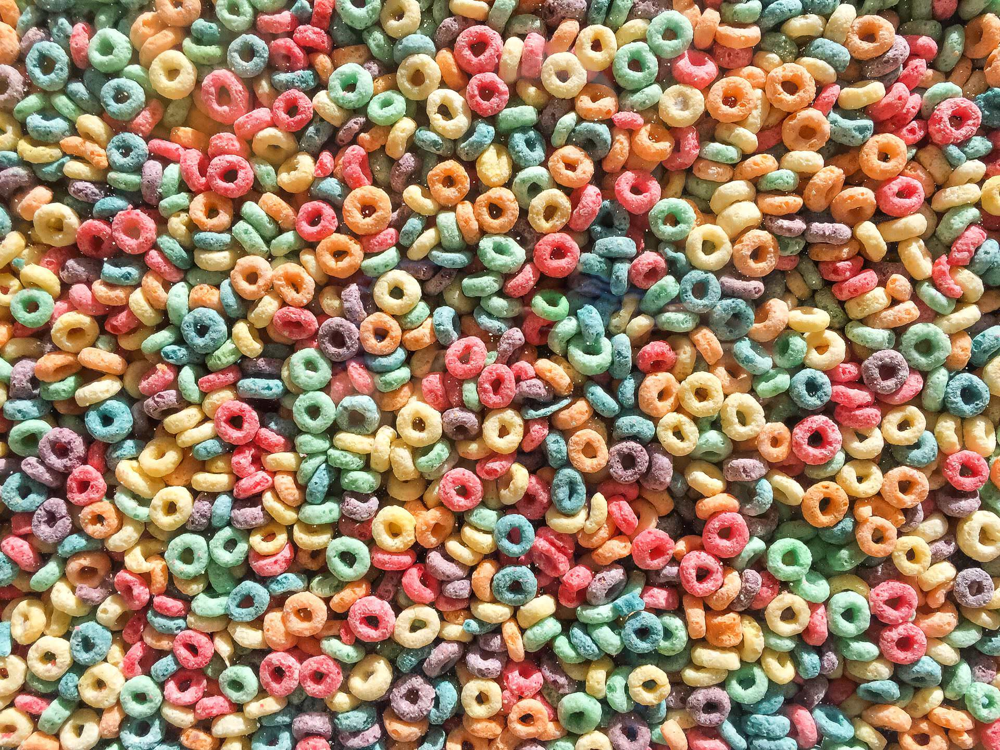

## iteration

i.e. *loops*


you've already seen a loop---the draw loop


but sometimes you want to do multiple things in a loop *within*
a frame (i.e. a single flow through the `draw` function)

## `while` loop

the first type of loop we'll look at is the *while* loop:

```javascript
while(condition)&#123;
  // do some things while "condition" evaluates to true
&#125;
```


does this look familiar?

## `while` loop intuition

a human-language intuition:


```javascript
while(agatha_is_sitting)&#123;
  draw_circles_on_slide();
&#125;
```


```javascript
while(triangles_have_three_sides)&#123;
  draw_circles_on_slide();
&#125;
```


let's have a look at an example

## a working example

```javascript
let count = 0;

// count < 5 is a logical comparison
// (with a true/false answer)
while(count < 5)&#123;
  ellipse(
    random(width), random(height), // x and y
    10*count, 10*count             // width and height
  );
  count = count + 1;
&#125;
```

---

``` javascript
function setup() &#123;
  createCanvas(windowWidth, windowHeight);
  noStroke();
  frameRate(5);
&#125;

function draw() &#123;
  background(30);

  let x = 0;
  while (x < width) &#123;
    fill(x/2, random(255), 255);
    rect(x, 0, random(10), random(height));
    x += random(10);
  &#125;
&#125;
```

## looping tips

make sure the Boolean expression will evaluate to `false` at some
stage---otherwise you'll loop forever!

you probably want to have some variable which you modify in the loop, and then
when the modifications are "done" the expression in the `while` loop should be
`false`


when writing a loop, look at your code: *be* the computer (think about types & flow)


## `for` loop

the other type of loop in javascript is the `for` loop

it's like a `while` loop, but it has the "modify the loop variable" (e.g. `count
= count + 1;`) part built-in

```javascript
for (let i = 0; i < 10; i=i+1) &#123;
  // loop code goes here
&#125;
```

in this example we called the loop variable `i` (although you can give it whatever name you like)

## differences between `for` and `while` loops

```javascript
let i = 0; 
while (i < 10) &#123;
  // loop code goes here 
  i=i+1;
&#125;
```

```javascript
for (let i = 0; i < 10; i=i+1) &#123;
  // loop code goes here
&#125;
```

## code theory recap

Boolean expressions (e.g. `mouseX < 500`) and `if` statements let us control the
_flow_: do this or that

loops (`for`, `while`) allow us to control the flow: do this over and over again

you'll get _lots_ of practice in the labs

<!-- art part: colour -->

---


## how to think about colour

How do we keep track of colours?

How do we find colours?

How do we make art with colours in p5?

---

<!-- _class: talk-box -->

## talk

What is a primary colour?

---

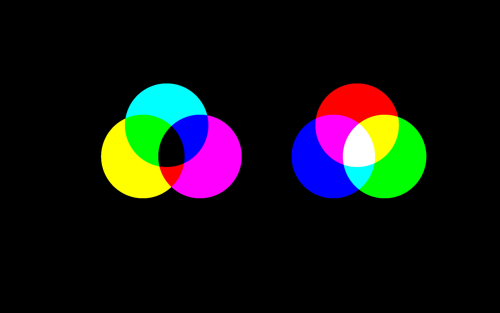

## What is a primary colour?


there are two basic ways to mix colours together


adding (good for shining light out of a screen)


subtracting (good for working with materials that *absorb* light)

## Two bits of `p5` to know about:

- `blendMode` ([ref](https://p5js.org/reference/#/p5/blendMode)) changes how colours _interact_.

- `colorMode` ([ref](https://p5js.org/reference/#/p5/colorMode)) changes how colours are _represented_.

---

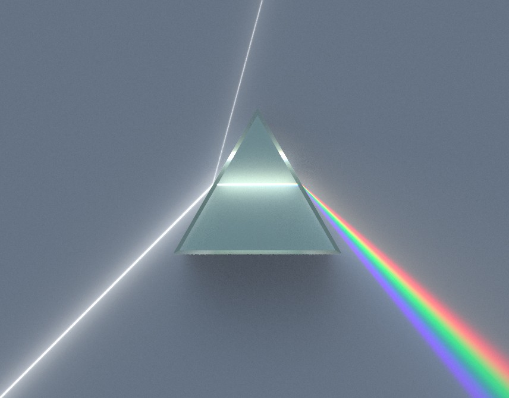

## Newton: White light is made of colours

How do we keep track of these colours?

Newton deduced that white light must be composed of all these colours

[source](https://en.wikipedia.org/wiki/Isaac_Newton#/media/File:Dispersive_Prism_Illustration.jpg)

---

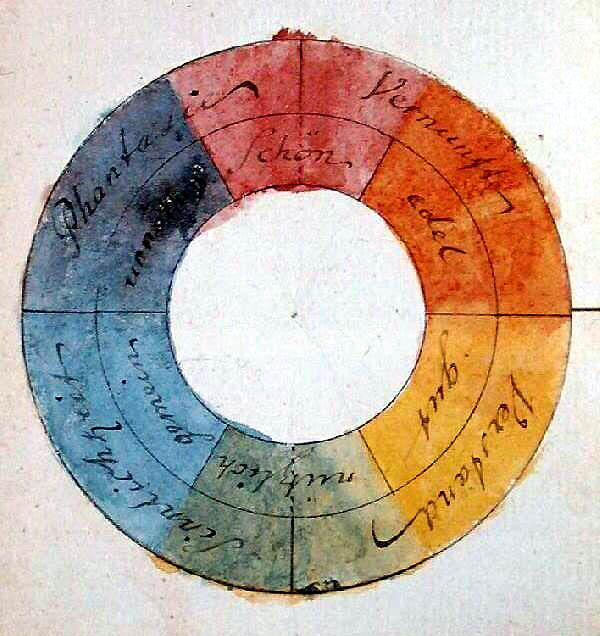

## Goethe's colour wheel

---

<div class="image-credit">Goethe --- *symmetric colour wheel with associated symbolic qualitites* --- Tate Collection, UK</div>

---

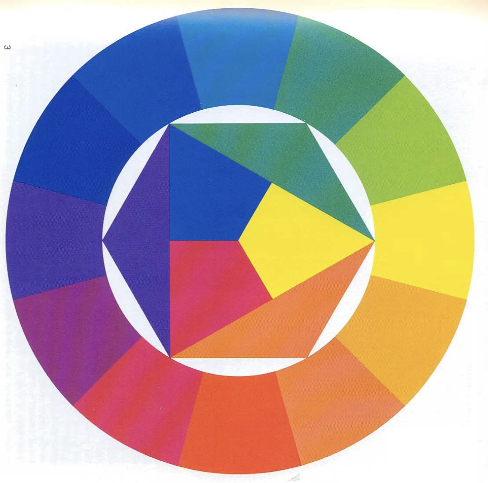

## Johannes Itten's Colour Wheel (1920s)

Primary, secondary and tertiary

good if you're a painter!

---

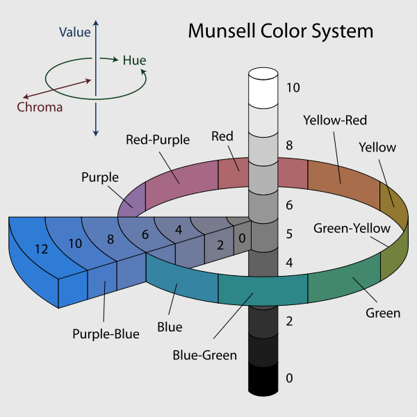

## Munsell System (1910s)

but for scientific notation etc, we need a different approach

---

<div class="image-credit"></div>

---

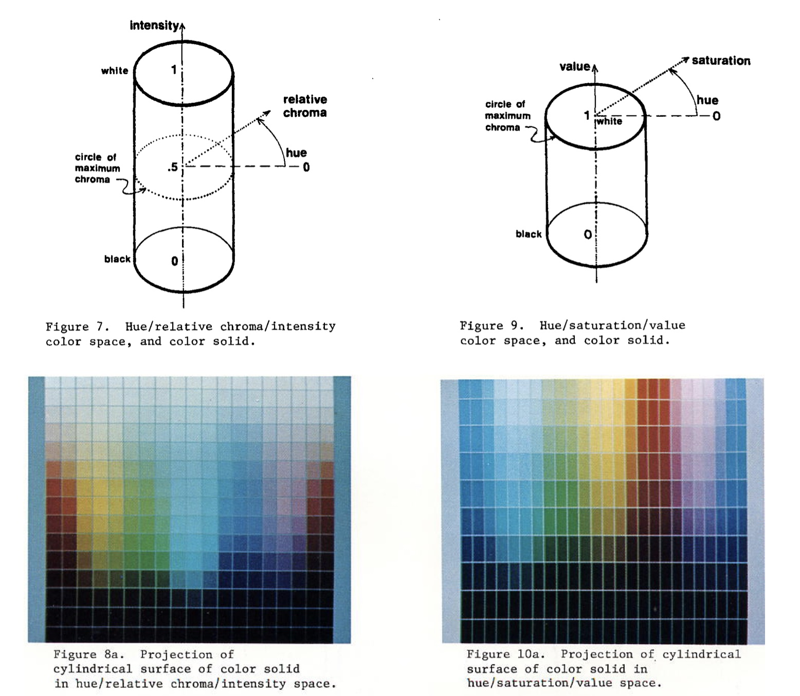

## Color spaces for computer graphics (1978)

---

<div class="image-credit">Joblove, George H. and Greenberg, Donald --- *Color spaces for computer graphics* --- [source]([DOI:10.1145/965139.807362](https://doi.org/10.1145/965139.807362))</div>

## What are the point of these colour systems?

Attempts to define _what colour is made of_.

Newton, Goethe, Itten: Made of combinations of Red, Blue and Yellow (primary colours for subtractive mixing)

Munsell: Made of three independent properties: hue, chroma, and lightness - (perceptually uniform)

Joblove/Greenberg: Defined hue/saturation/brightness as a good standard for computer graphics (see [Wikipedia](https://en.wikipedia.org/wiki/HSL_and_HSV)).

## Why should you care?

Suppose you have a green colour in RGB, but you want to make it more intense or brighter.

What R, G, and B values should you change to achieve this?

---


## Colour as Art

What if we made art where "colour" is the material?

---

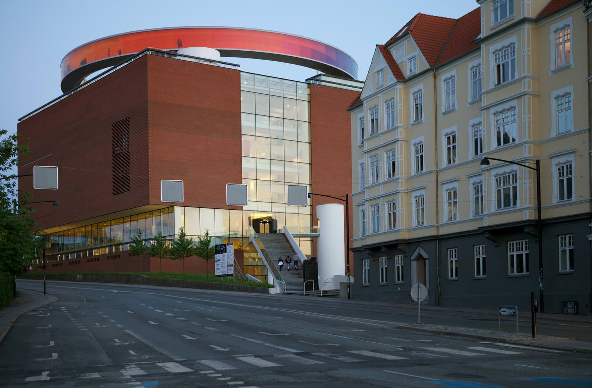

---

<div class="image-credit">Olafur Eliasson (b. 1967) --- *Your rainbow panorama* --- ARoS Aarhus Kunstmuseum, Denmark</div>

---

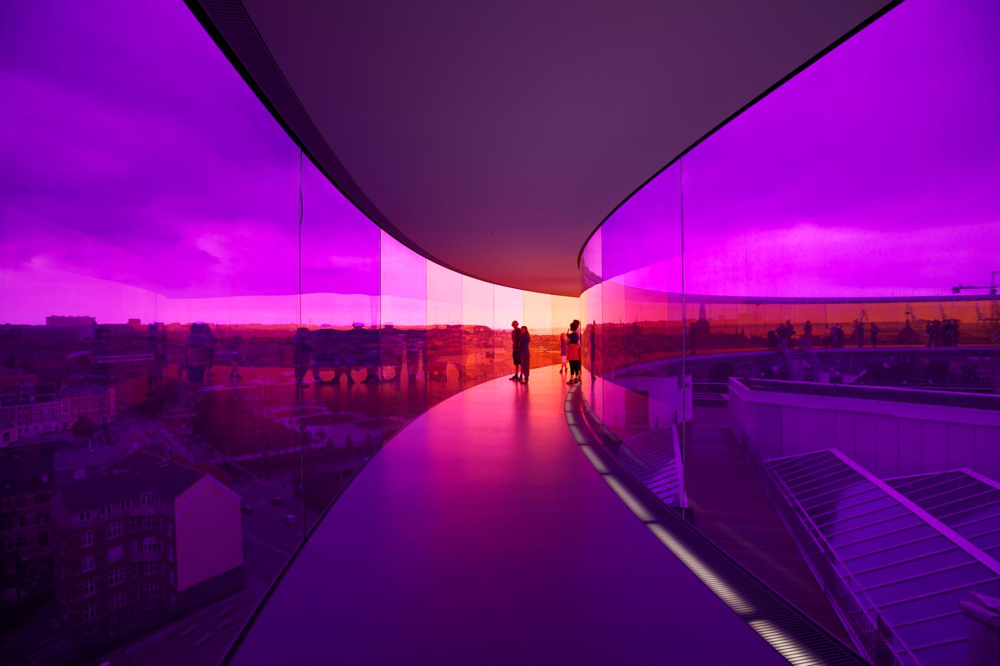

---

<div class="image-credit">Olafur Eliasson (b. 1967) --- *Your rainbow panorama* --- ARoS Aarhus Kunstmuseum, Denmark</div>

---

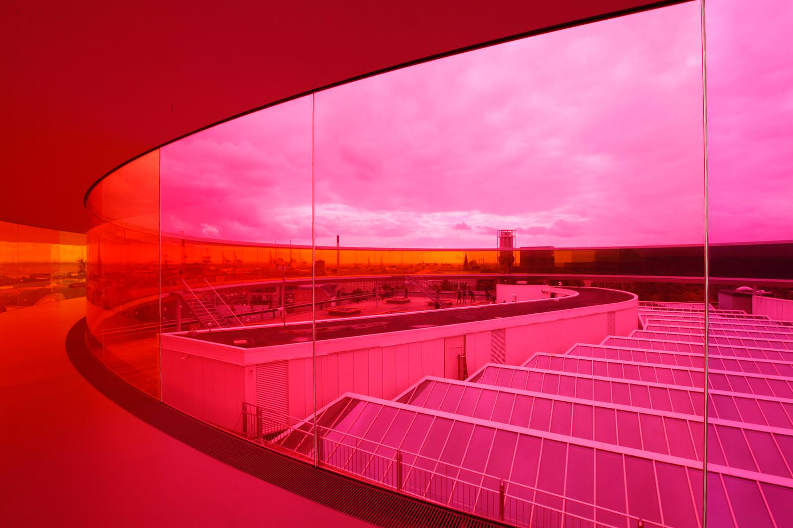

---

<div class="image-credit">Olafur Eliasson (b. 1967) --- *Your rainbow panorama* --- ARoS Aarhus Kunstmuseum, Denmark</div>

---

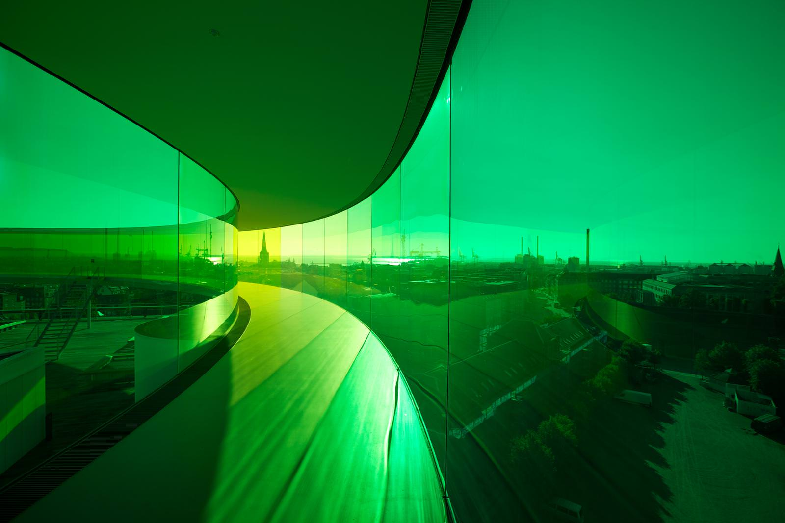

---

<div class="image-credit">Olafur Eliasson (b. 1967) --- *Your rainbow panorama* --- ARoS Aarhus Kunstmuseum, Denmark</div>

---

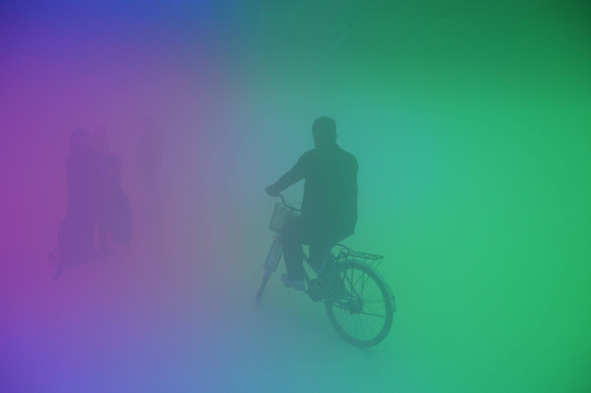

---

<div class="image-credit">Olafur Eliasson (b. 1967) --- *Feelings are Facts* --- Ullens Center for Contemporary Art, Beijing</div>

created using smoke and lights

---

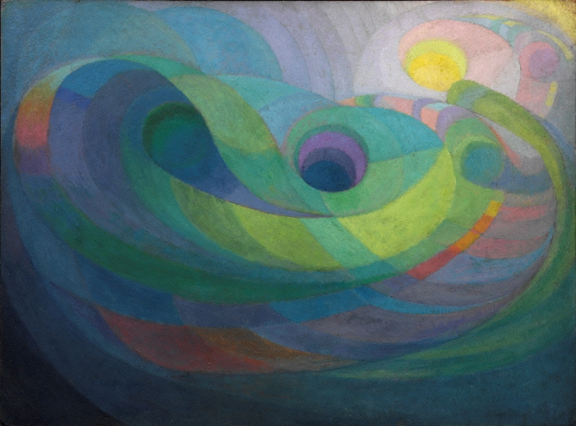

interested in the intersection of colour and sound

---

<div class="image-credit">Roy de Maistre --- *Rhythmic composition in yellow green minor*</div>

## Johannes Ittens's 7 types of contrast

- hue
- value (light and dark)
- temperature
- complement
- simultaneous
- saturation
- extension

contrast is what happens when you put two or more colours together and it gives off a sort of feeling

---

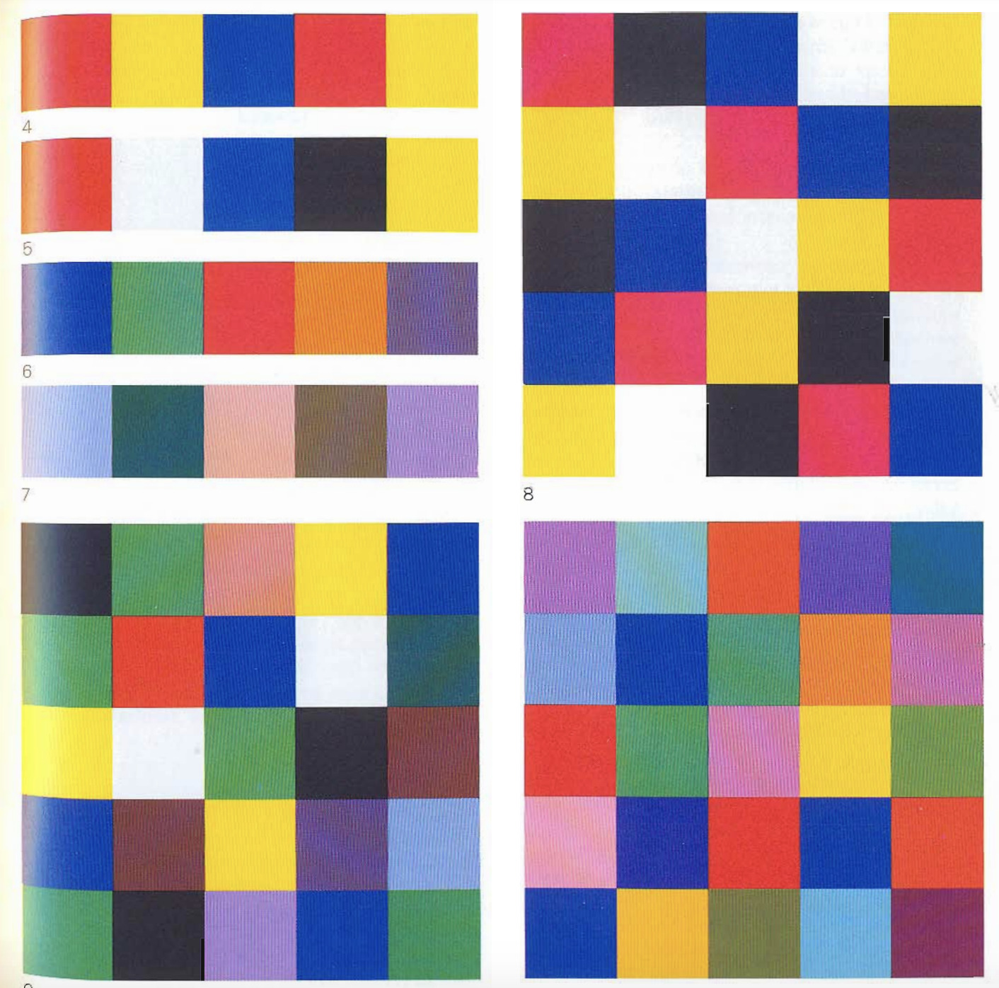

## From Ittens' 'Elements of Colour', (1961)

---

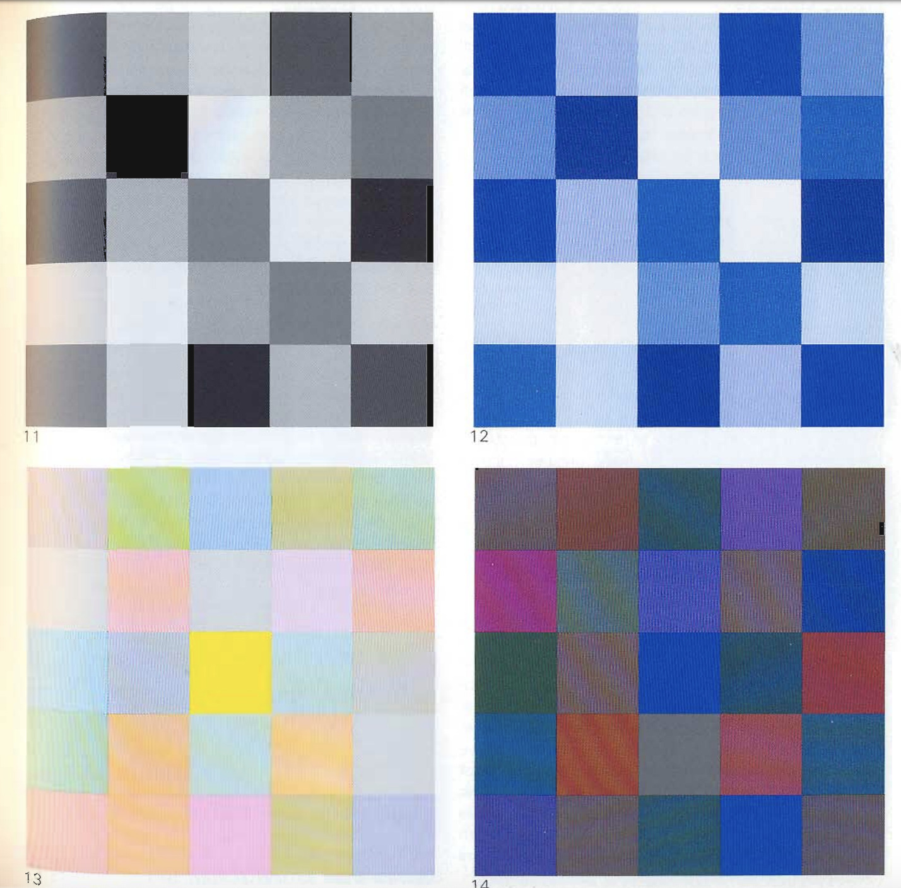

## From Ittens' 'Elements of Colour', (1961)

---


## finding colours

Online colour palette generators:

<http://paletton.com/> (shows complementary colours, triads/tetrads etc)

<https://coolors.co/app> (generate random palettes which look decent)

<http://colormind.io/> (uses AI because... reasons)

---


## let's make some colour art

Let's explore colour spaces in RGB and HSB!

---


## further reading/watching

Shiffman videos:

[conditionals](https://www.youtube.com/watch?v=1Osb_iGDdjk&list=PLRqwX-V7Uu6Zy51Q-x9tMWIv9cueOFTFA&index=11),

[`while` and `for`
loops](https://www.youtube.com/watch?v=cnRD9o6odjk&index=15&list=PLRqwX-V7Uu6Zy51Q-x9tMWIv9cueOFTFA)

[MDN javascript docs](https://developer.mozilla.org/en-US/docs/Web/JavaScript/)
(have a look at the *Tutorials* & *References* menus in the sidebar)

<!--

---


## questions?

-->
