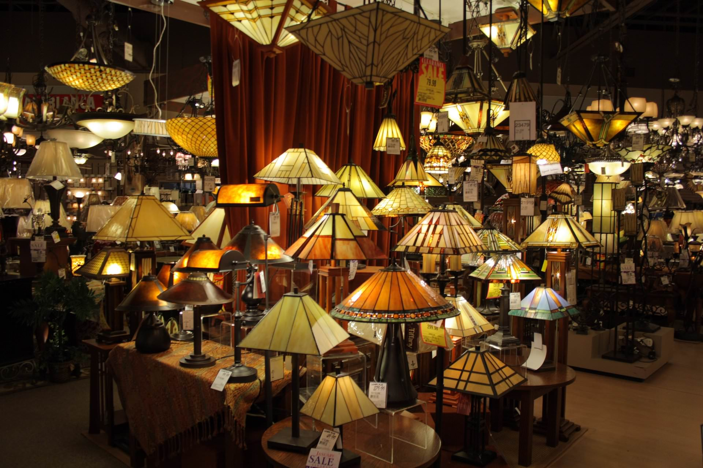
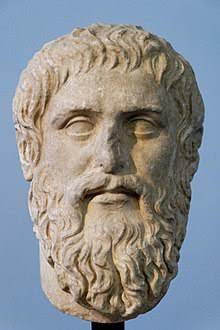
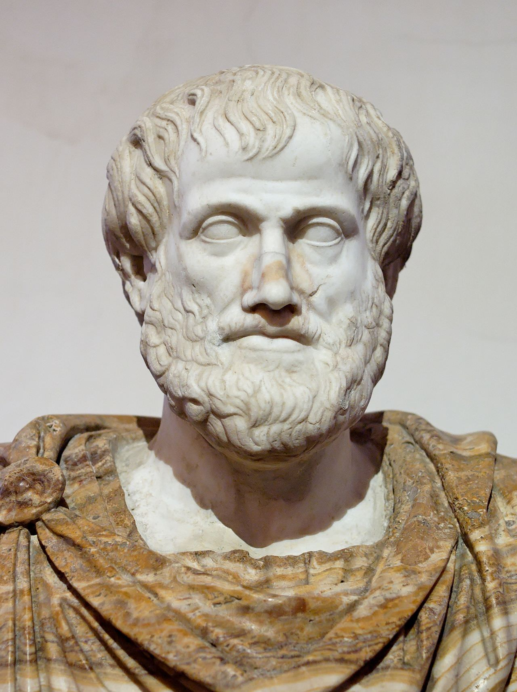
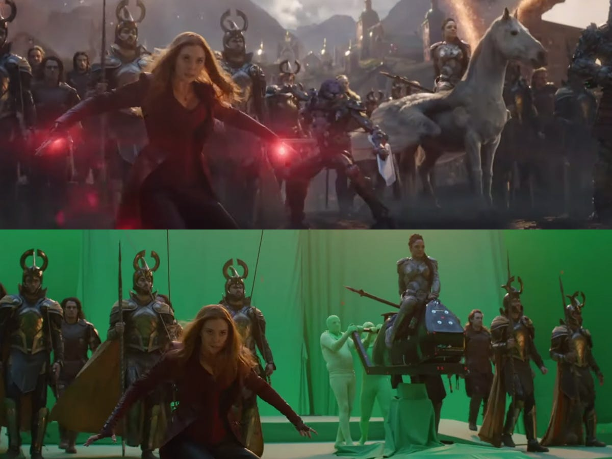

<!-- _class: banner -->

# COMP1720


---


## admin

assignment 1 is done, congratulations everyone!
<!-- We will be busy marking the submissions and aim to get feedback back to you within 2 weeks -->

[assignment 2](/assessments/index/) is available from tomorrow

after that there is one further assignment...

...and then the major project!

## recap

- specifying positions & colours with numbers
- drawing with the p5 library (drawing `rect()`s and `ellipse()`s, setting
  `fill()` and `stroke()` colours)
- using variables (and maybe even declaring your own)
- doing simple maths with `+`, `-`, `*`, `/`
- doing things conditionally with `if` statements and **Boolean** expressions
  like `mouseX < 100`
- looping with `while` and `for`

---


## code theory

variable scope (a new word for something you've seen before)

functions (including making our own functions)

arrays (collections of things)

---


## scope


**scope** is related to **flow**---it's a way of talking about which bits of
code can "see" each other


if you ever get "missing variable" errors, but you can *see* (i.e. with your
eyes) the variable in your code, you might have a scope problem

## global scope

variable declarations "outside" of all the functions (e.g. `setup()` and
`draw()`) are said to be in the **global** scope, and they're visible from
anywhere in the program


```javascript
// x is a "global" variable
let x = 200;

function setup() &#123;
  createCanvas(800, 600);
&#125;

function draw() &#123;
  ellipse(x, x, x, x);
&#125;
```

## but what about this?

``` javascript
function setup() &#123;
  createCanvas(800, 600);
  let x = 200;
&#125;

function draw() &#123;
  ellipse(x, x, x, x);
&#125;
```

---

<!-- _class: impact -->

if something's not working

**check the console**

## how about this?

``` javascript
function setup() &#123;
  createCanvas(800, 600);
&#125;

function draw() &#123;
  let x = 200;
  ellipse(x, x, x, x);
&#125;
```


this works because `x` is in the `draw` function's scope---it's visible inside
`draw`'s curly brackets, but not outside

---


## scoping tips

scoping might cause frustration at first, but it's actually a good
thing---isolation makes our code **clearer** & **more robust**

in general, having lots of **global variables** is bad coding style---variables
should only be visible (in scope) where they'll be used

the brackets matter!

`&#123;` `&#125;` `[` `]` `(` `)`


## concept 2: functions

first, some definitions...

> **function** (*noun*): the act of executing or performing any duty, office, or
> calling; performance <https://www.wordnik.com/words/function>

> **function** (*noun*): a sequence of program instructions that perform a
> specific task, packaged as a unit <https://en.wikipedia.org/wiki/Subroutine>

## anatomy of a function (recap)

`name(parameter1, parameter2, ...);`

`rect(100, 100, 100, 100);`

the **name** (in this case `rect`) specifies _what_ to do

the **parameters** (in the brackets) tell the function _how_ to do it, e.g.
where to draw the rect and how big

together, they allow us to tell the computer do some basic thing, repeatedly,
and with slight differences each time

---


## speak the lingo

we say we "call" a function because we're telling it to do its' job (like the staff at a restaurant)


how many jobs should a function have?


the "**you had one job**" principle is important for functions!

---

<!-- _class: talk-box -->

## talk

`rect(100, 100, 100, 100);`

how do you find out what the parameters mean?


check the [`rect()` reference](https://p5js.org/reference/#/p5/rect)

## writing your own functions

you've been using functions all along: `setup()` and `draw()`, as well as all
the p5 functions like `ellipse()`

You can write your **own** functions where you get to pick the parameters & what they're called. Here's an example `polkadot()` function

```javascript
function polkadot(x, y)&#123;
  fill(255,0,0);
  ellipse(x, y, 20, 20);
&#125;
```


let's try it out

## creating functions that give back values

parameters allow us to send values (parameters) *in* to a function, how do we
get values back _out_?

the answer: we use a `return` statement in the body of the function

```javascript
function double(x) &#123;
  return x * 2;
&#125;
```

now we can use our function like this

```javascript
background(double(50));
```

## p5 has a few other "special" functions

special from a _flow_ perspective, anyway

- [`mousePressed()`](https://p5js.org/reference/#/p5/mousePressed)
- [`keyPressed()`](https://p5js.org/reference/#/p5/keyPressed)

and a few more...

## read the reference!

I really don't mean to harp on about this, but if you can't read the reference
then you'll really have trouble

MDN has some great docs on
[Functions](https://developer.mozilla.org/en-US/docs/Web/JavaScript/Guide/Functions)

we'll use functions **constantly** for the rest of the course, so it's really
worth getting your head around them

---


sometimes when we're referring to a function (in writing) we write "the
`background()` function"

note the lack of parameters in between the brackets, even though the
`background()` function _does_ take parameters

this is because there are [many different ways to call that
function](https://p5js.org/reference/#/p5/background) (e.g. with one number,
with two numbers, etc.) so using a `()` with no arguments is just a general way
to acknowledge that it's a function (but to see exactly what parameters it
requires you'll need to look in the reference)

## example: making a button

from this week's labs: making a simple "button" has two sub-tasks:

1. drawing the button
2. figuring out whether the button is clicked

these sub-tasks require the same info, though: where and how big is the button?

let's combine them into a function which

1. draws a rectangle
2. returns a `Boolean` (either `true` or `false` depending on whether the button
   is being clicked)

---



## concept 3: arrays


we've already met the **Number**, **String** and **Boolean** types in this
course


```javascript
let myNumber = 7;
let myString = "tennis is fun";
let myBoolean = true;
```


Can we collect some of these things together into a group?

## what do you think these are?

```javascript
let arrayOfNumbers = [100, 24, -2, 18, 106, 42, 1, 8];
let arrayOfStrings = ["hello", "darkness",
                      "my", "old", "friend"];
let arrayOfBooleans = [true, false, true, true, false];
```

```javascript
let arrayOfWhatever = [100, 200, false, "Banana"];
let emptyArray = [];
```


they're **arrays**

---


## again, look for the matching pairs

when you see a `[`, there will be a matching `]`

everything inside will be initialised as the elements of the array

## some new vocabulary


the _array_ is the whole collection


each member of the array is called an _element_


the "element position" is called the _index_ (e.g. the first element is at index
`0`, the second at index `1`, etc.)


the number of elements in the array is called the _length_ of the array

## what's going on here?

```javascript
let allTheThings = [0, 120, 500];
```

we're **declaring** a variable called `allTheThings`, and **initialising** it to
be an array with 3 elements: `0`, `120` and `500`

## arrays as variables

```javascript
// < variable part >  < array part >
   let allTheThings = [0, 120, 500];
```

we're combining something we're learning today (arrays) with something we
learned in week 2 ([declaring & initialising variables](/lectures/week-02/#declaring-your-own-variables))

no magic here!

## why use arrays?

arrays are a really useful part of javascript

as well as just declaring & initialising an array, there are a bunch of things
you can do to it by default

- find out how big it is
- add/remove/modify elements
- join it to other arrays
- look for particular elements in the array
- etc.


the [Array reference is on
MDN](https://developer.mozilla.org/en-US/docs/Web/JavaScript/Reference/Global_Objects/Array),
but several p5 functions use arrays as well

## oddNumbers array

for the following slides, assume we've got an array `oddNumbers` with some stuff
in it

```javascript
let oddNumbers = [1, 2, 3, 5, 7];
```

## using the elements in an array

use square brackets to "reference" (i.e. retrieve) an element from an array

```javascript
let firstOddNumber = oddNumbers[0];
let secondOddNumber = oddNumbers[1];

background(oddNumbers[3]);
```

## array referencing gotchas

the array index starts at `0`, so `oddNumbers[0]` is the first element, and
`oddNumbers[n]` is the `n+1`th element for any index `n`

if you try and access an element that isn't there, the result is undefined

```javascript
// this will break because there is no 40th element
background(oddNumbers[40]);
```

---

<!-- _class: impact -->

can we **change** the things in arrays?

## putting elements into an array

to put an element onto the "end", use [`push()`](https://developer.mozilla.org/en-US/docs/Web/JavaScript/Reference/Global_Objects/Array/push)

```javascript
oddNumbers.push(53);
// oddNumbers is now [1, 2, 3, 5, 7, 53]
```


to put an element onto the "front", use
[`unshift()`](https://developer.mozilla.org/en-US/docs/Web/JavaScript/Reference/Global_Objects/Array/unshift)
([weird
name](https://www.quora.com/Why-are-so-many-languages-array-prepend-function-called-unshift-and-not-prepend))

```javascript
oddNumbers.unshift(-7);
// oddNumbers is now [-7, 1, 2, 3, 5, 7, 53]
```

## removing elements from an array


to _remove_ an element from the "end", use
[`pop()`](https://developer.mozilla.org/en-US/docs/Web/JavaScript/Reference/Global_Objects/Array/pop)
(opposite of [`push()`](https://developer.mozilla.org/en-US/docs/Web/JavaScript/Reference/Global_Objects/Array/push))

```javascript
oddNumbers.pop();
// oddNumbers is now [-7, 1, 2, 3, 5, 7]
```


to _remove_ an element from the "front", use
[`shift()`](https://developer.mozilla.org/en-US/docs/Web/JavaScript/Reference/Global_Objects/Array/shift)
(oppposite of [`unshift()`](https://developer.mozilla.org/en-US/docs/Web/JavaScript/Reference/Global_Objects/Array/unshift))

```javascript
oddNumbers.shift();
// oddNumbers is now [1, 2, 3, 5, 7]
```

## here's a table

```javascript
let things = [1, 2, 3];
```

|       | add                                                                                                                       | remove                                                                                                           |
| front | [`things.unshift(value)`](https://developer.mozilla.org/en-US/docs/Web/JavaScript/Reference/Global_Objects/Array/unshift) | [`things.shift()`](https://developer.mozilla.org/en-US/docs/Web/JavaScript/Reference/Global_Objects/Array/shift) |
| back  | [`things.push(value)`](https://developer.mozilla.org/en-US/docs/Web/JavaScript/Reference/Global_Objects/Array/push)       | [`things.pop()`](https://developer.mozilla.org/en-US/docs/Web/JavaScript/Reference/Global_Objects/Array/pop)     |

## modifying the elements in an array

*similar* to using the elements of the array (e.g. `oddNumbers[0]`) but this
time we assign a new value to that element using the equals sign

```javascript
// oddNumbers is [1, 2, 3, 5, 7];
oddNumbers[4] = 12;
// oddNumbers is now [1, 2, 3, 5, 12];
```

---

<!-- _class: talk-box -->

## talk

suppose you see this:

```javascript
let allTheThings = [0, 120, 500];

// some code here you can't see

allTheThings.push(50);
```

what are the elements of `allTheThings` at this point? how do you know?

## how do I see what's in my array at any point?

use [print](https://p5js.org/reference/#/p5/print) and the console!

```javascript
// put this somewhere in your code
print(oddNumbers);
```

then, open up the console and see! (`cmd ⌘`+`alt`+`J` or `ctrl`+`alt`+`J`)


## arrays *in* arrays

remember how we said you could put *any* type into an array? that includes more arrays!

```javascript
let nestedArray = [[1, 3], [2, 4]];

nestedArray[0] // the value at index 0 is the Array [1, 3]

nestedArray[0][1] // what do you think this is?
```

## "looping" over an array

the `for` loop from [last week's lecture](/lectures/week-03/#for-loop) can be used to generate the indexes

```javascript
for(let i = 0; i < oddNumbers.length; i = i+1)&#123;
  doStuff(oddNumbers[i]);
&#125;
```

---


## How do we know if art is good?

How do we _judge_ art?

(Wrong answers only.)


Ok, so is there any better way than just _guessing_? 


E.g., maybe _you_ like something, but how do you know _I_ will like it?

---


## ... but is it art?

---

<div class="image-credit">Jackson Pollock  (1912-1956) --- *Blue poles [Number 11, 1952]* --- Nation Gallery of Australia</div>


Very expensive, one of the most expensive that they bought at the time


People looked at it and were like, what that's not art, it's just splashes! How can it be worth that amount of money


but if you have tools, you can start to appreciate it

---


## three ways to judge a work of art

**ethical**:  is it good for the world?

**poetic**: is it made well?

**aesthetic**:  is it beautiful?

_Rancière, Jacques_. 2004. [The politics of aesthetics: the distribution of the
sensible](https://www.amazon.com/Politics-Aesthetics-Distribution-Sensible/dp/082647067X).
London: Continuum.

---



## ethics

Plato argues that artworks are lies that deceive us from truth

---

<div class="image-credit">*Roman copy of a portrait bust by Silanion for the Academia in Athens*</div>

---


## ethics

Images can deceive

---

<div class="image-credit">Bill Posters --- *Imagine this...* --- [source]([link](https://billposters.ch/projects/spectre/))</div>

<!-- 

Artworks created using ML to create deepfake-esque images and videos


faked by the artist to show Zuck making a comment on the influence and 'evil'ness of facebook to bring about social commentary around the platform. The deceit was part of the artwork and ethical aspect. -->

<!-- Electing to remove the following slide from the 2024 lecture - the explicit nature of the work and the complicated context make this challenging to adequately communicate in one slide of a first year course -->

<!-- ## cw

next slide has an explicit image on it, turn away for now if you don't want to see it

---


## ethics

---

<div class="image-credit">*Portrait of an Aboriginal girl* --- [source]([the politics of Aboriginal kitsch](https://theconversation.com/friday-essay-the-politics-of-aboriginal-kitsch-73683))</div>


artwork on the wall in a pub. In the style of aboriginal kitsch which was a 20th century series of artworks that were basically fake representations of what aboriginal people were like and what they did.


They were fake because they were constructed by western people trying to evoke a child-like representation of what aboriginal people were like and supporting the notion of what the colonials had been doing (they're a childish people and need to be looked after)


This person doesn't exist. They were created to show a native girl who is unashamed about not having her top on (which would be considered shameful in a western society) -->

---



## poetics

Aristotle says that if a lie is made well, it can help heal our stress/anxiety

---

<div class="image-credit">*Roman copy of a Greek bronze bust of Aristotle by Lysippos*</div>

---



## poetics

<!-- 

tv, movies and games are the most consumed kind of art. They certainly have a high poetic value.


this is an example from Endgame. A very interesting set piece, but there is nothing really there, just special effects.


a lot of 'lies' and poetics go into these things to make them great. But a lot of the time these big franchise/blockbuster movies etc. lean very heavily into poetics, but aren't doing anything 'good' for the world, and while potentially fantastical to look at, aren't beautiful either. -->

---

<div class="image-credit">*Avengers Endgame ([link](https://www.reddit.com/r/Moviesinthemaking/comments/hnp3pj/the_climactic_epic_battle_sequence_from_avengers/?utm_source=share&utm_medium=web2x&context=3))* --- Directed by Anthony Russo and Joe Russo</div>

## Aesthetics

Imannuel Kant (1724 - 1804) said **beauty** is the measure

we can feel an artwork's beauty/ugliness, sublimity and humour, balance, harmony and dissonance

the better the work, the more emotional response we can have to it

If something is truly beautiful, we all agree

---


<!-- this is one such artwork where everyone seems to agree that it has a beauty to it.


you can achieve this too in your submissions! everything fits together well and conscious choices were made in its construction -->

---

<div class="image-credit">Caspar David Friedrich (1774-1840) --- *Wanderer above the Sea of Fog*</div>

## critiquing art

most critiques of art address one or a mix of these three concerns

- is it good for the world? (ethical)
- is it made well? (poetics)
- is it beautiful? (aesthetics)

In COMP1720/6720 these criteria apply as well! How does the quality of _code_, and the quality of _interaction_ map into these values?

---


## further reading/watching

Shiffman on Arrays
  [intro](https://www.youtube.com/watch?v=VIQoUghHSxU&list=PLRqwX-V7Uu6Zy51Q-x9tMWIv9cueOFTFA&index=21) 
  [arrays &
  loops](https://www.youtube.com/watch?v=RXWO3mFuW-I&index=22&list=PLRqwX-V7Uu6Zy51Q-x9tMWIv9cueOFTFA)
  (note that Shiffman covers topics in a slightly different order to us)

[MDN Function reference](https://developer.mozilla.org/en-US/docs/Web/JavaScript/Guide/Functions)

[MDN Array reference](https://developer.mozilla.org/en-US/docs/Web/JavaScript/Reference/Global_Objects/Array)

[MDN article on Indexed Collections](https://developer.mozilla.org/en-US/docs/Web/JavaScript/Guide/Indexed_collections)

<!--

---


## questions?

-->
