<!-- _class: banner -->

# COMP1720


---


## admin

[assignment 1](/assessments/index/)
---marking is underway.

[assignment 2](/assessments/index/) is out! Get started!

<!-- [course survey!](https://wattlecourses.anu.edu.au/mod/feedback/view.php?id=2986799) - fill it out!! -->

---


## code theory

last time we covered arrays: a way of bundling up multiple things and getting each one with an index

we also discussed functions: a way of bundling up some code and running it multiple times with predictable changes

time to get into **objects!**

which (kind of) combine these two ideas!

---


## what's an object?


name a thing that *exists*


how you would describe it to someone who has never seen it before?

---

<div class="image-credit">Adriano Pucciarelli --- [Unsplash](https://unsplash.com/photos/ZFR1RlZWyF0)</div>

## motivation

often, you need multiple "attributes" to fully describe a thing

- a **student**: name, age, uni course
- an **address**: street name, street number, perhaps unit number?
- a **pet**: name, species, breed, owner

javascript has **Objects** to keep related bits of data together

## some definitions

> **object** (*noun*): something mental or physical toward which thought,
> feeling, or action is directed
> <https://www.merriam-webster.com/dictionary/object>

> **object** (*noun*): a data structure in object-oriented programming that can
> contain functions as well as data, variables, and other data structures
> <https://www.merriam-webster.com/dictionary/object>

---

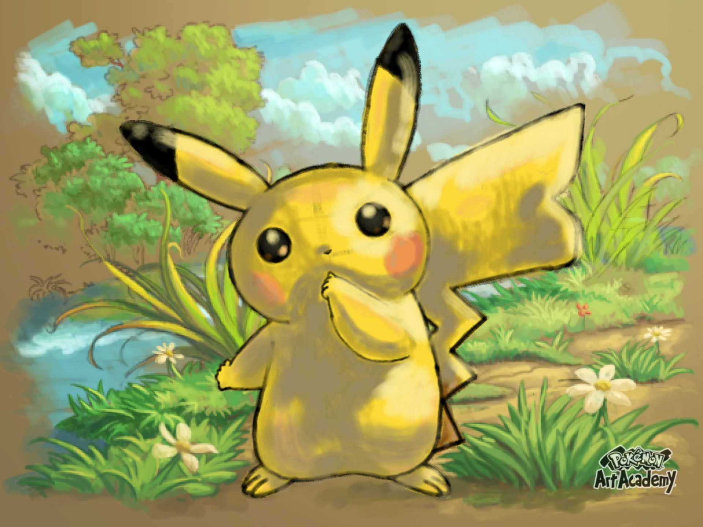

## let's make a Pokemon

what properties does a Pokemon have?


species


level


hit points


owner
  

captured

## as a javascript Object

```javascript
// declare and initialise in one go
let sally = &#123;
  species: "Pikachu",
  level: 1,
  hp: 100,
  owner: "Ash",
  captured: true
&#125;;
```

## object vocabulary

the components of an object are called **properties**, each property has a
_name_ and a _value_

```javascript
let sally = &#123;
// prop name: value
          hp: 42
&#125;;
```

try not to get confused between the name of the _object_ (`sally` in this case) and the
name of its _properties_ (just one property in this case: `hp`)

---


## more jargon

in everyday language, we've got a bunch of "interchangeable" terms: property,
attribute, characteristic, trait, aspect

but in programming they mean different things! 🤷

so, be careful, and remember that **objects** have **properties**

## object syntax

for an object we use the `&#123;` and `&#125;` squiggly braces

the spaces don't matter, only the braces

```javascript
// these are all exactly the same
let sally = &#123;hp: 50&#125;;

let sally = &#123; hp: 50 &#125;;

let sally = &#123;
  hp: 50
&#125;;
```

## what can you do with an object?

just like with arrays, there are a few main things you want to do with your object

- **get** the value of a property (this is often called *accessing* a property)
- **set/update** the value of a property
- add a **new** property & value (sometimes)

## getting the value of a property

there are two main ways to access (get) the value of a property

```javascript
sally.species    // "Pikachu"
sally["species"] // "Pikachu"
```

both the "dot" version and the "square brackets" version are equivalent---they
return the same value

## when to use the dot (`.`) syntax

pros: a _bit_ easier to type

cons: doesn't work if the property name isn't a **String**
  
```javascript
// here, the property name is actually a number
let benObject = &#123;5: "howdy"&#125;;

benObject.5  // Uncaught SyntaxError: Unexpected number
benObject[5] // "howdy"
```

## setting the value of a property

just like with arrays, you can assign a new value to a property with `=`

these two lines of code are exactly equivalent

```javascript
sally.species = "Raichu"
```

```javascript
sally["species"] = "Raichu"
```

## updating the value of a property

there's even a syntax for doing the _get_ and _set_ all in one line

these two lines of code are exactly equivalent
  
```javascript
sally.hp = sally.hp - 10;
```

```javascript
sally.hp -= 10; // a bit quicker to type
```

## adding new properties to an object

if a property with that name doesn't exist, you can create it by just assigning
a new value to that property name

these two lines of code are exactly equivalent

```javascript
sally.hat = true;
```

```javascript
sally["hat"] = true;
```

## using the new property

then, you can use it in your code from that point on

```javascript
if(sally.hat)&#123;
  // draw a hat, or something
&#125;
```

## p5 is making objects (under the bonnet)

for example the [`color()`](https://p5js.org/reference/#/p5/color) function

```javascript
let magenta = color(220,0,220);
print(magenta);
```

or [`createVector()`](https://p5js.org/reference/#/p5/createVector), or...

```javascript
let position = createVector(40, 52);
print(position);
```

## nested object examples

```javascript
// nested objects
let car = &#123;
  make: "toyota",
  paint: &#123;
    colour: "red",
    metallic: true
  &#125;&#125;;

car.paint.colour; // what's the value?
```

## arrays and objects together!

```javascript
// array of objects
let myAnts = [&#123;species: "fire", size: 100&#125;,
              &#123;species: "giant", size: 500&#125;]

// object of arrays
let pokerHand = &#123;hearts: [2, 5, 7],
                 diamonds: [8, "Q", "K"],
                 clubs: [5, 6],
                 spades: []&#125;

pokerHand.clubs[1] // what's the value?
```

## objects vs arrays

how does this relate to the arrays stuff from last week? a lot of this stuff
looks really familiar...


arrays **are** objects, the property names are just the numbers `0`, `1`, ...,
`N-1` (where `N` is the length of the array)

## which should I use?

a rule of thumb:

- use an **object** when you have several related values with *different* types
- use an **array** when you have a bunch of values with the *same* type


don't be afraid to have an array of objects (and vice versa)

---


## navigating the javascript jungle

the way I've presented objects in this lecture (and in this course) is just
*one* way to do it

but it's a jungle out there (on the web)

don't despair---the most important thing is to understand the concepts, and to
**practice**

---

<!-- _class: talk-box -->

## talk

```javascript
// this seems legit
let point = &#123;x: 100, y: 200&#125;;
```

```javascript
// what about this?
let point = &#123;
  x: 100,
  redBackground: function() &#123;
    background(255, 0, 0);
  &#125;
&#125;;
```

## methods: what if the property is a function?

in javascript, a *function* is a value just like a number, so the value of a
property can be a function


in this case, the property is called a **method**

---


## another name? oh my.

methods are really similar to [functions](/lectures/week-04/#functions), but this time the function is "attached" to
a particular object (and can refer to the other properties of the same object)

you call the function it just like any other property (using the `.`), but with the addition of the
parameters in brackets at the end `()` (just like a regular function).

## example: [`p5.Vector`](https://p5js.org/reference/#/p5.Vector) object


```javascript
let position, momentum;
function setup() &#123;
  createCanvas(400, 400);
  // createVector() creates a p5.Vector object
  position = createVector(width/2, height/8);
  momentum = createVector(0, 0);
&#125;

function draw() &#123;
  background(0);
  ellipse(position.x, position.y, 40,40);
  position.add(momentum);
  momentum.add(createVector(0,1));

  if(position.y > height - 20)&#123;
    momentum.y*=-1;
  &#125;
  momentum.mult(.98);
&#125;
```

---


## what is interactive art?


what is art? (already discussed this one!)


what is interaction?


...and how can we design interactions in `p5`?


Important: Art and **Interaction** Computing


So what makes art interactive?

<!-- GRAV -->

---

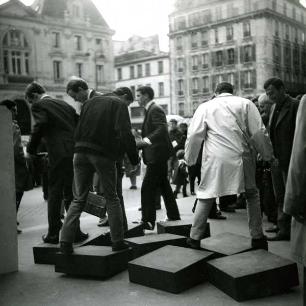

---

<div class="image-credit">Julio Le Parc (b. 1928) --- *A day in the street*</div>

<!-- GRAV Installation -->

---


## Una visión otra: Groupe de Recherche d´Art Visuel (GRAV) 1960-1968

---

<div class="image-credit">*Una visión otra: Groupe de Recherche d´Art Visuel (GRAV) 1960-1968* --- Exhibition at Museo Tamayo, Mexico</div>

<!-- Paik -->

---

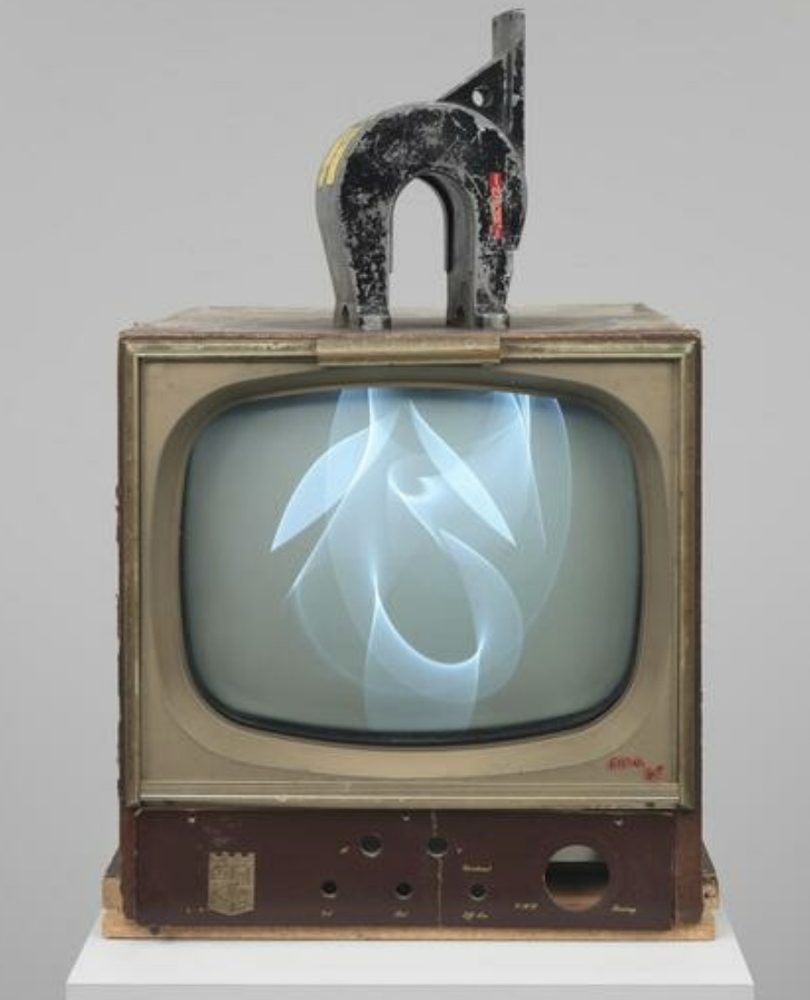

---

<div class="image-credit">Nam June Paik --- *Magnet TV* --- Whitney Museum, New York</div>

<!-- Illumicube  -->

---


## Illumicube

---

<div class="image-credit">Kerry Simpson --- Ainslie Avenue, Canberra</div>

<!-- Iamascope  -->

---

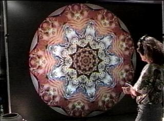

## Iamascope

---

<div class="image-credit">Sid Fels and Kenji Mase</div>

<!-- Strike on Stage -->

---


## Strike on Stage

---

<div class="image-credit">Chi-Hsia Lai and Charles Martin</div>

<!-- Inkspace -->

---


## Inkspace

---

<div class="image-credit">Zach Lieberman</div>

<!-- Mount Rothko -->

---


## MOUNTROTHKO

---

<div class="image-credit">[Yu Zhang](https://yuzhang.nl)</div>

<!-- Stephen Jones Interactivity Picture  -->

---

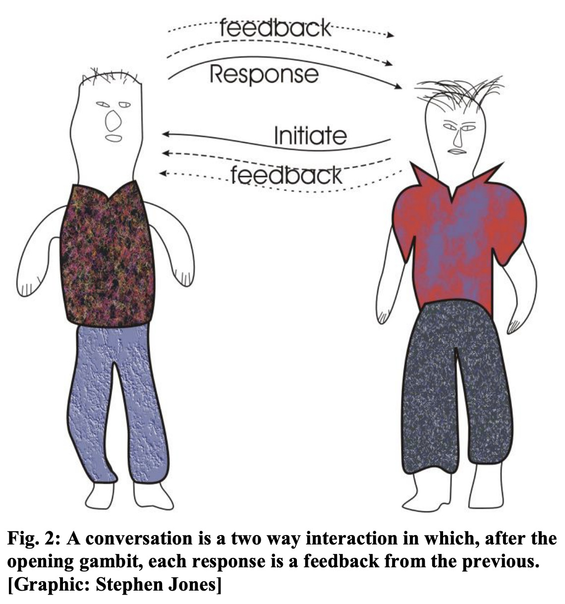

---

<div class="image-credit">Stephen Jones --- *Cybernetics in Society and Art*</div>

## So what is interactive art again?

Art that reacts to the participant.

Art where input from the participant _drives_ the artistic experience.

Art where a _feedback loop_ between participant and artwork _enhances_ the experience.

---

<!-- _class: impact -->

How does the participant **know what to do**?

How do we know that interaction will **enhance** the experience?

## Affordances


An "affordance" is a property of a _thing_ such that it supports an action.

It's an _action possibility_.

(See [Don Norman _Design of Everyday Things_]((https://ebookcentral-proquest-com.virtual.anu.edu.au/lib/anu/detail.action?docID=1167019)))

---


## What are the affordances?


typing on the keyboard?


using the mouse?


being in front of the camera?


being heard by the microphone?


anything else?

---


## What are the affordances?


touching the touchscreen?


clicking the buttons?


taking photos of things?


moving the phone around?


taking calls?

---

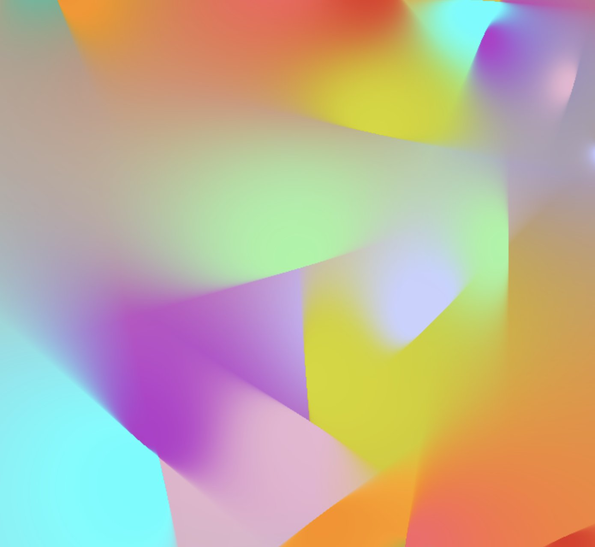

## What are the affordances?


no hardware affordances here... (we think)


could be _software_ affordances


or _hidden_ affordances (these lead to discovery and engagement!)

---

<div class="image-credit">Zach Lieberman --- *Screenshot ([Twitter](https://twitter.com/zachlieberman/status/1430686027744698368))*</div>

<!-- Interfaces -->

---


## interfaces

When you create interface, you are designing affordances.

How are you _communicating_ affordances to the participant?

Are they obvious? Are they hidden? Should they be?

_How does the participant know what to do?_

---

<!-- _class: impact -->

Let's look at how to communicate affordances _badly_!

"The [worst volume control in the world](https://uxdesign.cc/the-worst-volume-control-ui-in-the-world-60713dc86950)"

---

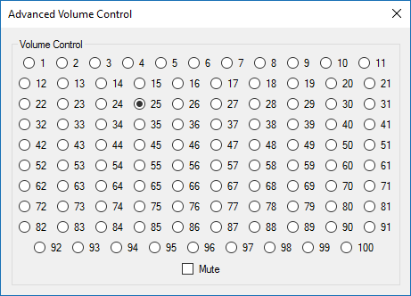

---

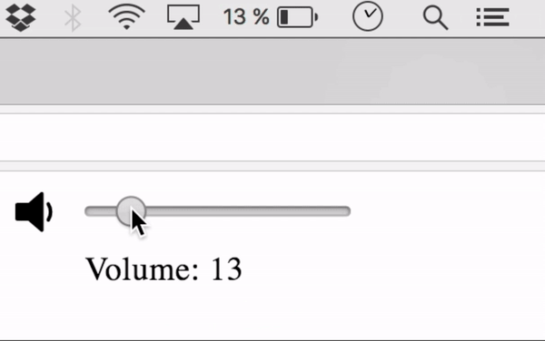

---

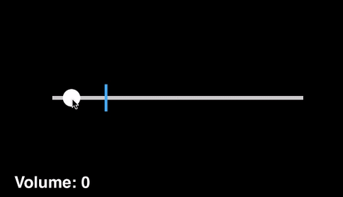

---


---

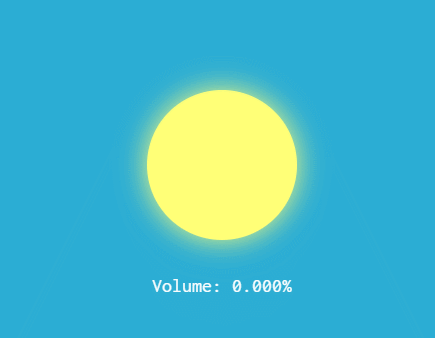

---


---

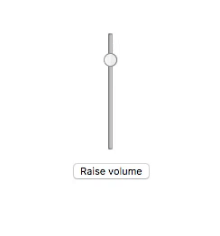

---

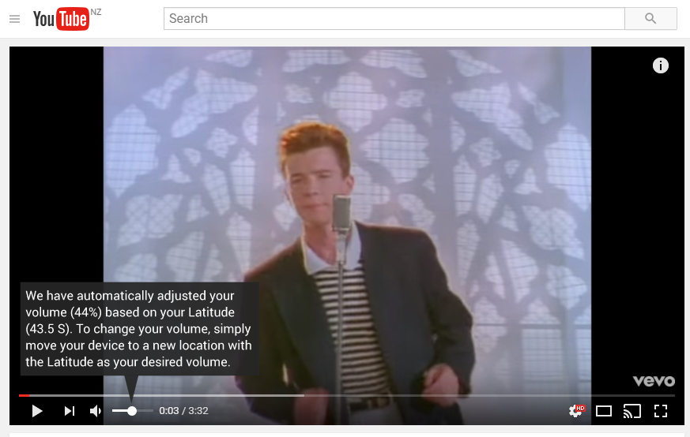

---

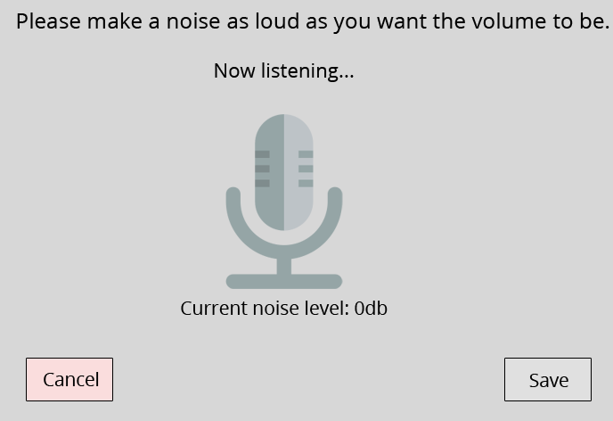

---

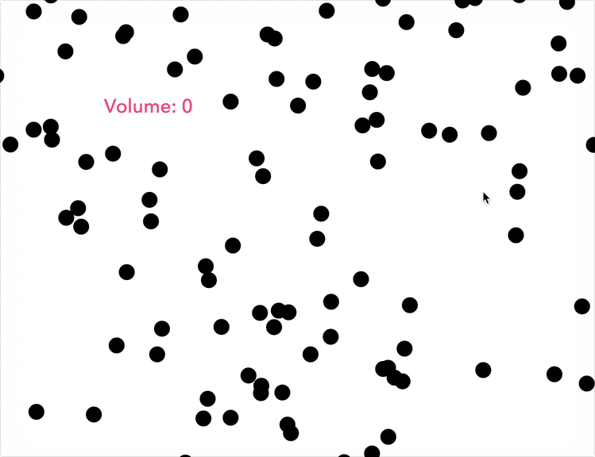

---

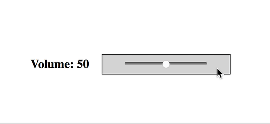

---

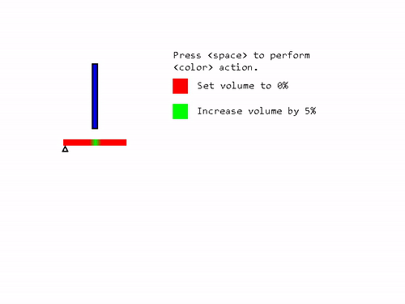

---


---

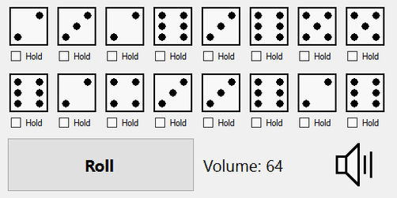

## Why are these so funny?

There is usually an **obvious** affordance for using them.

BUT, the actual effect is controlled by a hidden affordance.

The hidden affordance is completely weird.

<!-- Interactive Art Myths -->

---

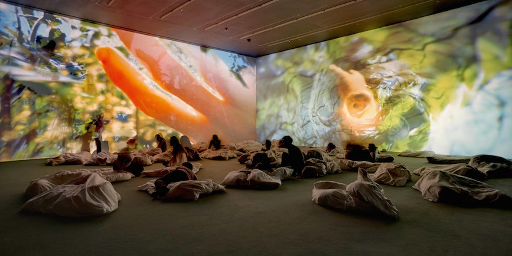

## Myth: All digital art is interactive


Nope: Digital art doesn't have to react to the participant.

---

<div class="image-credit">Pipilotti Rist --- *Worry Will Vanish Horizon, 2014* --- Hauser and Wirth, photo by Alex Delfanne</div>

---

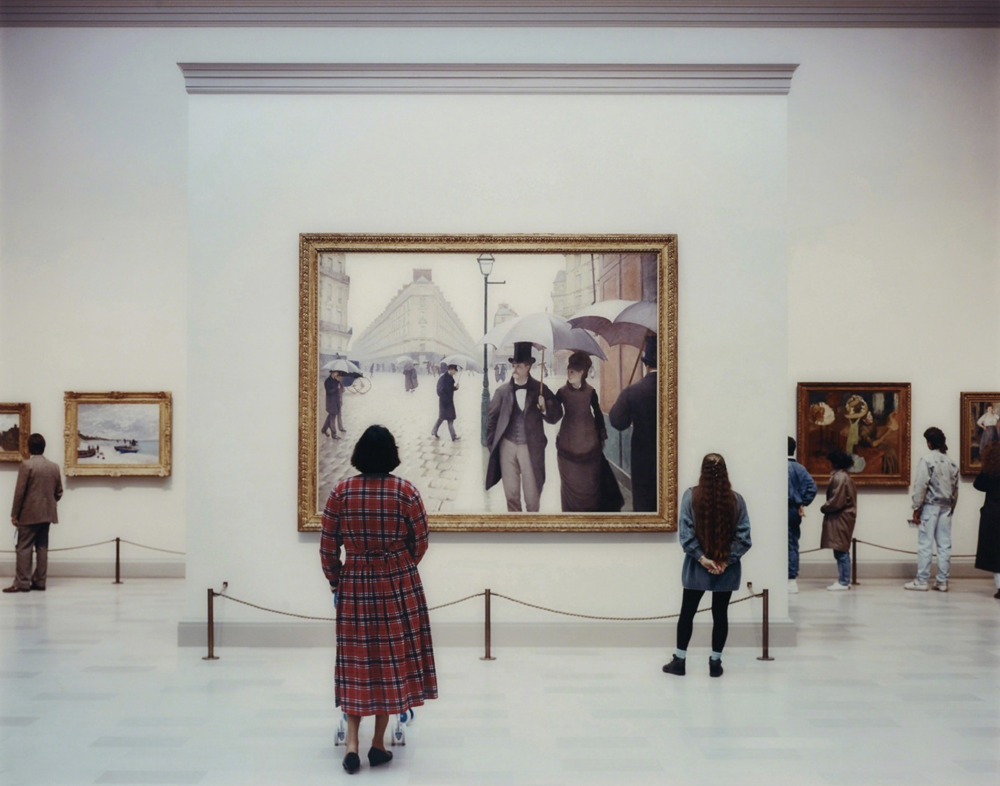

## Myth: All art is interactive art


Nuh-uh: "Normal" art doesn't require the participant to engage for the art to "work".

---

<div class="image-credit">Thomas Struth --- *Art Institute of Chicago II, Chicago* --- Edition of 10</div>

---

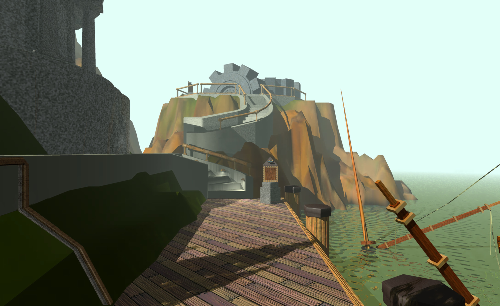

## Myth: Games are interactive art


Noperoo: Games tend to focus on moving through a story, or developing a skill rather than enhancing engagement through interaction.


Some games can be seen as interactive art, and some interacive artworks have game-like elements but they are not the same thing.


Interactive art tends to be much simpler and more explorative.


Class policy: Don't make a game. Take [game dev](https://programsandcourses.anu.edu.au/2023/course/COMP3540) to do that.

---

<div class="image-credit">Rand Miller, Robyn Miller --- *Myst (1993)* --- MOMA ([link](https://www.moma.org/collection/works/164918?classifications=39&include_uncataloged_works=1))</div>


## Summary

- Interactive art **involves** the audience in order to create the complete experience.

- Interactions have to be **designed**.

- Affordances are the action possibilities of your artwork.

- Affordances can relate to **hardware** or **software**

- Hidden affordances can **lead** to engagement (when done well).

- Don't make a game.

Let's just look at some of the interactive artworks again...

<!-- Illumicube  -->

---


## Illumicube

---

<div class="image-credit">Kerry Simpson --- Ainslie Avenue, Canberra</div>

<!-- Mount Rothko -->

---


## MOUNTROTHKO

---

<div class="image-credit">[Yu Zhang](https://yuzhang.nl)</div>

<!-- Strike on Stage -->

---


## Strike on Stage

---

<div class="image-credit">Chi-Hsia Lai and Charles Martin</div>

---


## further reading/watching

[Shiffman on Objects](https://www.youtube.com/watch?v=-e5h4IGKZRY&index=8&list=PLRqwX-V7Uu6Zy51Q-x9tMWIv9cueOFTFA)

[MDN article on Objects](https://developer.mozilla.org/en-US/docs/Web/JavaScript/Reference/Operators/Object_initializer)

[Don Norman- The Design of Everyday Things](https://ebookcentral-proquest-com.virtual.anu.edu.au/lib/anu/detail.action?docID=1167019) (available in ANU Library)

[Worst Volume Controls](https://uxdesign.cc/the-worst-volume-control-ui-in-the-world-60713dc86950)

[Zach Lieberman](http://zach.li/)

<!--

---


## questions?

-->
