<!-- _class: banner -->

# COMP1720


---


## admin (week 6)

assignment 2 due this coming Monday 9pm!

now covered the _coding_ topics.

have some more to learn about _how to use p5_

...and practice skills in art and design!

 
this week: sound and music computing!

---


## admin (week 7)

<!-- assignment 2 marks to be returned later today. -->

next challenge: assignment 3!

<!-- Few admin arrangements:

week 9 Monday lab replacement or sth... -->


---

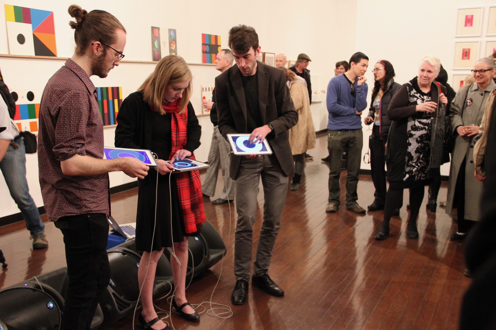

## sound

why should you, the code artist, care about sound?


sound demands attention


sound communicates emotion


enhances realism & immersion


provides feedback during interaction

---


---


---

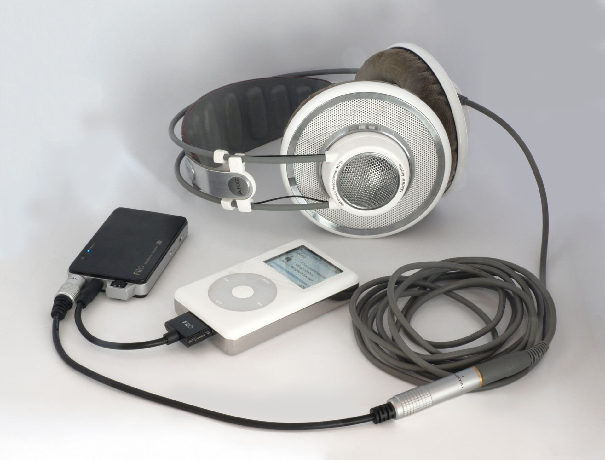

## types of sound

musical

abstract

skeuomorphic/sfx/diegetic

## sonic interaction design: key questions

1. what sound to make?

2. when to start & stop?

3. how high (or low)?

4. how loud?

---


## sound lingo

**pitch**: high or low (measured in Hz) ranging from 40Hz (low bass rumble) to 20kHz (high-pitched buzz)

**amplitude**: AKA volume or loudness, usually ranging from `0.0` (silence) to `1.0` (full volume)

**duration**: long or short, measured in seconds (it's just time!)

**timbre**: often called the "colour" or "quality" of a sound (e.g. piano &
saxophone can play the same pitch, but have different timbre)

---

<!-- _class: impact -->

**what**/**when**/**how high**/**how loud**

---

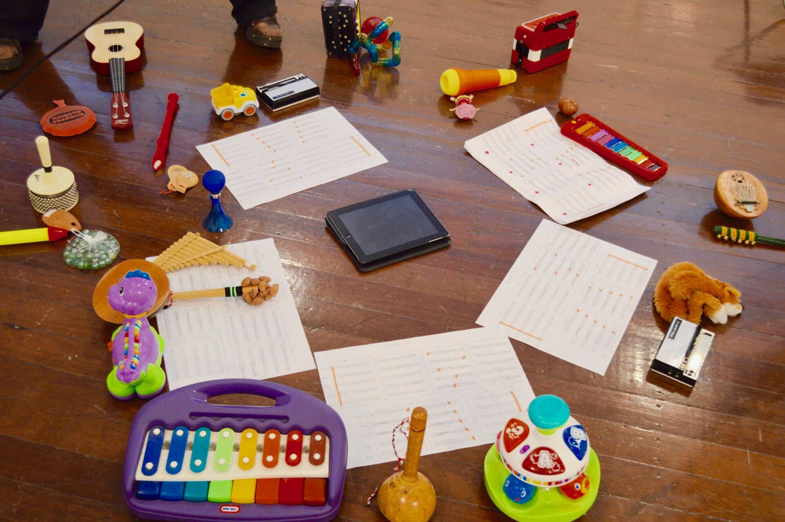

## timbre (i.e. <em>what</em>)

in computer music (and in `p5.sound`), there are two ways to make a sound:

- **synthesis** (mathematically calculating the signal)

- **sampling** (playback of recorded sound)

## Synthesis

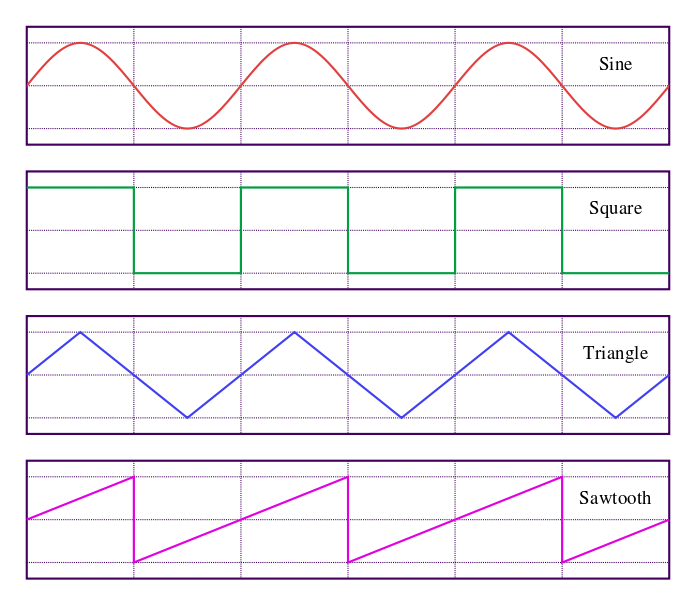

[Image: Wikipedia](https://en.wikipedia.org/wiki/Waveform)

## Sampling

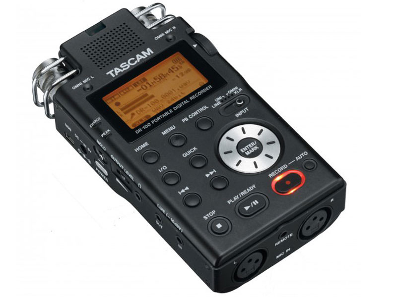

[Image: Tascam](http://fr.tascam-ca.com/product/dr-100/images/)

---

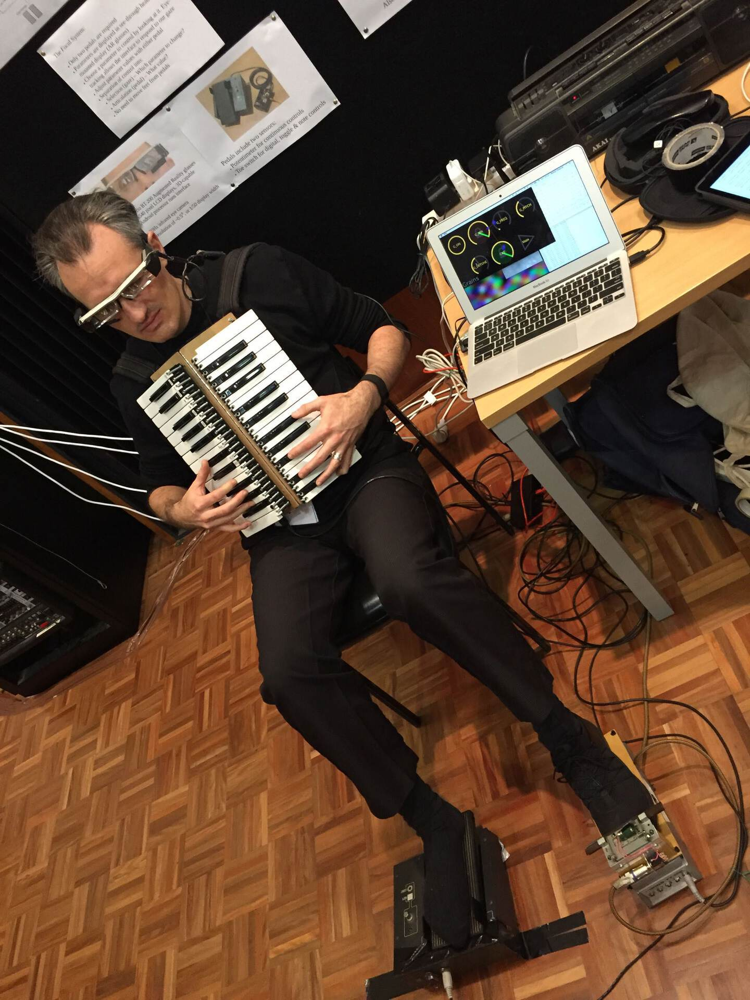

## control (i.e. <em>when</em>)

Lots of options:

direct control through an input device (e.g. keyboard)

time-based

scene-based (e.g. connected to events in the sketch)

random

---

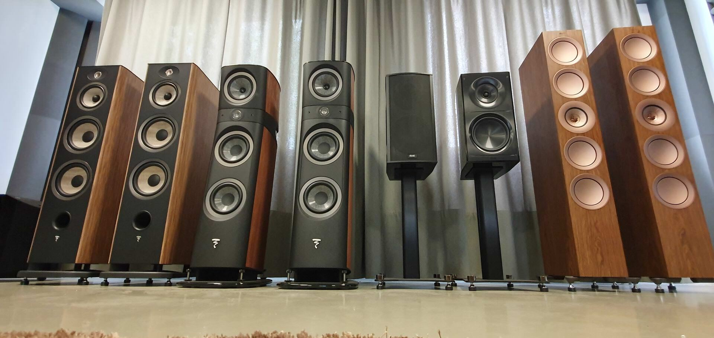

## pitch (i.e. how <em>high/low</em>)

different pitches give us music

pitch can also communicate other things e.g. size, mood

---


## amplitude (i.e. how <em>loud</em>)

slow changes in loudness---build tension, think verse vs chorus

quicker changes in loudness---accents in music

difference between loudest & softest sound is called the _dynamic range_---make
use of it!

## interaction

connect sound input to action on the screen

connect keyboard/mouse to sounds

connect camera/accelerometer to sounds

can we think about this as a new musical instrument?

<!-- https://youtu.be/beLxqGKvI-M NIME 2014 best of-->

---

<iframe width="1120" height="630" src="https://www.youtube.com/embed/beLxqGKvI-M" frameborder="0" allowfullscreen></iframe>

---


## let's make some sounds!

synthesis in `p5`!

sampling in `p5`!

interactive music in `p5`!

## sound is different to graphics

when we say **frame rate**, what are we talking about?

what's the p5 `draw()` loop frame rate? how would we find out?


what's the normal *sound* frame rate?


44100Hz--96000Hz


44100 vs 60: that's a **huge** difference (735x!)

## making sound in p5

p5 has a sound library: it's called
[p5.sound](https://p5js.org/reference/#/libraries/p5.sound)

note: there's no `draw()` loop for sound to directly program frames of sound (it
would be too slow)

instead, p5.sound provides a bunch of sound "building blocks" (which are just
objects!) which you
need to create and modify.

You need to make sure the `p5.sound` library is loaded in your `index.html`

## building blocks

**sources** produce sound: e.g., playing a sound file, "synthesising" a sine wave

**processors** process sounds: e.g., bass boost, reverb


## sources: synthesis

p5.sound provides a
[`p5.Oscillator`](https://p5js.org/reference/#/p5.Oscillator) which creates a
basic sound signal---here's a simple example sketch


```javascript
let osc;

function setup() &#123;
  osc = new p5.Oscillator();
  osc.setType("sine"); // or "triangle", "sawtooth", "square"
  osc.start();
&#125;

function draw() &#123;
  osc.freq(1000*mouseY/height);
  osc.amp(mouseX/width);
&#125;
```

## basic synthesis parameters

```javascript
// assign p5.Oscillator object to variable
osc = new p5.Oscillator();
```

remember the key [sonic interaction design questions](#sonic-interaction-design-key-questions):
1. what sound to make?  use the [`.setType()` method](https://p5js.org/reference/#/p5.Oscillator/setType)
2. when to start & stop? start with [`.start()` method](https://p5js.org/reference/#/p5.Oscillator/start)
3. how high/low? use the [`.freq()` method](https://p5js.org/reference/#/p5.Oscillator/freq)
4. how loud? use the [`.amp()` method](https://p5js.org/reference/#/p5.Oscillator/amp)

look [at the reference](https://p5js.org/reference/#/p5.Oscillator) for the full
list of properties/methods


## sources: sampling

[`loadSound()`](https://p5js.org/reference/#/p5.SoundFile/loadSound) returns a
[p5.SoundFile](https://p5js.org/reference/#/p5.SoundFile) object useful for
playing pre-recorded sounds (e.g. mp3s, wav files, etc.)

```javascript
let unilodgeSound;
function preload() &#123;
  unilodgeSound = loadSound("assets/unilodge.mp3");
&#125;

function setup() &#123;
  unilodge.setVolume(0.5);
  unilodge.play();
&#125;
```

## basic sampling parameters

```javascript
// assign p5.SoundFile object to variable
unilodgeSound = loadSound("assets/unilodge.mp3");
```

1. what sound to make? depends on the sound file
2. when to start & stop? start with the [`.play()`
   method](https://p5js.org/reference/#/p5.SoundFile/play), stop when file ends
   ([maybe](https://p5js.org/reference/#/p5.SoundFile/setLoop))
3. how high/low? use the [`.rate()` method](https://p5js.org/reference/#/p5.SoundFile/rate)
4. how loud? use the [`.setVolume()`
   method](https://p5js.org/reference/#/p5.SoundFile/setVolume)

note the subtle differences: the `p5.SoundFile` object (sampling) has different
methods to the `p5.Oscillator` object (synthesis)

## the `preload()` function

we've talked about `setup()` and `draw()`

but in some of the examples (again, especially the sound/image ones) there's a
[`preload()`](https://p5js.org/reference/#/p5/preload) function...


let's check the [reference](https://p5js.org/reference/#/p5/preload)


necessary because of the way the web browser works

---

<!-- _class: talk-box -->

## talk

where should `unilodgeSound.play()` go?


```javascript
function preload()&#123;
  // here?
&#125;

function setup()&#123;
  // here?
&#125;

function draw()&#123;
  // here?
&#125;

function mousePressed()&#123;
  // here?
&#125;
```

## You have to create **your own** sounds for your work! ⛔️

this course is about making _your own_ interactive art works!

you're not allowed to load and play background music that you didn't create. (it's boring and doesn't help your work stand out).

you may only use sound files in your assignment 3 that you have recorded yourself.


## the rest of the p5.sound library

the [reference](https://p5js.org/reference/#/libraries/p5.sound) has the full
list, but some highlights:

- [filter](https://p5js.org/reference/#/p5.Filter),
  [delay](https://p5js.org/reference/#/p5.Delay),
  [reverb](https://p5js.org/reference/#/p5.Reverb) for processing/changing
  sounds
- [envelope](https://p5js.org/reference/#/p5.Env) for shaping sounds over time
- [p5.FFT](https://p5js.org/reference/#/p5.FFT) for looking at the audio spectrum
- [p5.AudioIn](https://p5js.org/reference/#/p5.AudioIn) - have a guess :)
- [p5.MonoSynth](https://p5js.org/reference/#/p5.MonoSynth) and
  [p5.PolySynth](https://p5js.org/reference/#/p5.PolySynth) for making whole
  "instruments" (advanced)

---


## so now I know all about sound?

nope, sorry! we could have a [whole course on computer music](https://programsandcourses.anu.edu.au/2024/course/COMP4350), but you know how to make some basic sounds in `p5`

let's dig a bit deeper and look at making some _interactive music_.

<!-- more synthesis details -->

---

<!-- _class: impact -->

Let's look at a bit of synth theory...

## Amplitude Envelope

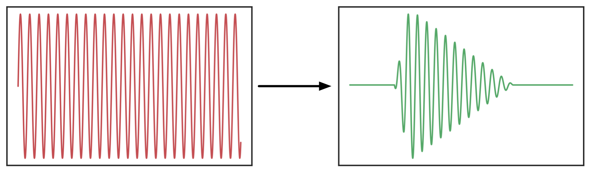

- **Amplitude** is the "volume" of our note.
- **Envelope** is the chunk of time for our note to exist in.
- We can change the amplitude over the envelope to give a note a sonic "shape".
- In synth lingo, an **EG (envelope generator)** makes envelopes.

## ADSR Envelope

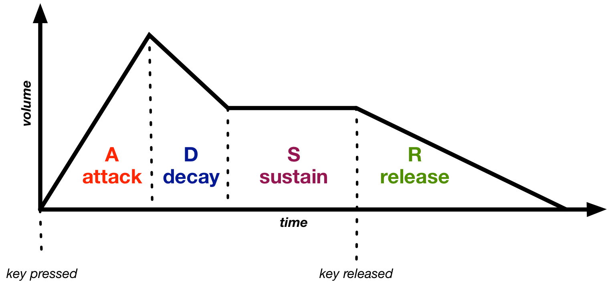

- The **adsr** shape is often used for pitched sounds.
- ADSR: attack, decay, sustain, release

## Additive Synthesis

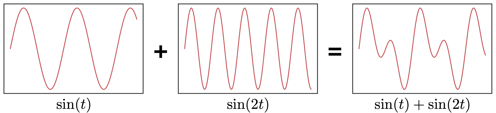

- Take multiple oscillators and add them together!
- Need [lots of oscillators](https://www.youtube.com/watch?v=q45FHZLVz2U
) to make complex sound.


## Subtractive Synthesis

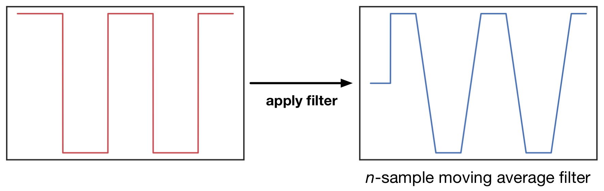

- Use one oscillator and _take sound away_.
- We use a [filter to remove sound](https://ccrma.stanford.edu/~jos/filters/filters.html).
- Subtractive synthesis is typical for analogue synthes (e.g., [Korg MS-20](https://en.wikipedia.org/wiki/Korg_MS-20), [listen here](https://www.youtube.com/watch?v=jQLjKozfjzQ)).

## FM synthesis

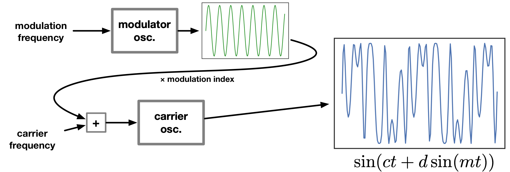

- "frequency modulation"
- Use one oscillator to control the frequency of another.
- [Cool sounds](https://youtu.be/fxSTjiE_5V0) with few oscillators (see [Yamaha DX7](https://en.wikipedia.org/wiki/Yamaha_DX7))

---


## Let's make some interactive music

We need to connect some events in time to an interactive input...

---


## art theory: sound art

can sound be used as a material in art?

wait... isn't that music?

how can we do this in `p5`?

---

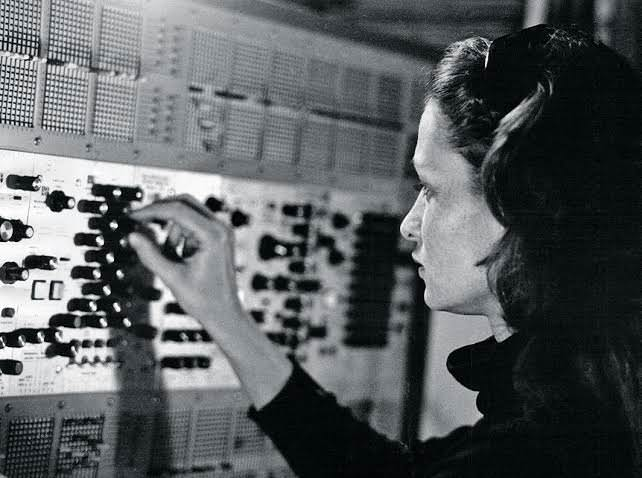

## synthesisers

---

<div class="image-credit">Éliane Radigue (b. 1932) --- *Éliane Radigue in her studio, Paris*</div>

---

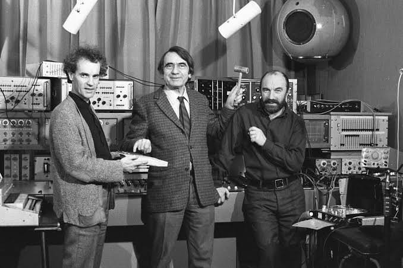

## tape

---

<div class="image-credit">Musique Concrete Research Group (GRM) --- *François Bayle, Pierre Schaeffer and Bernard Parmegiani at GRM*</div>

---

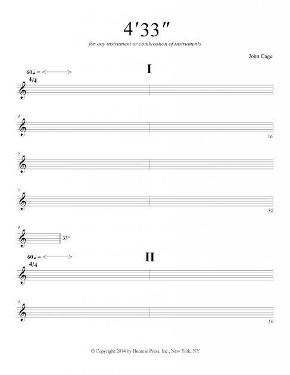

## sounds of silence

---

<div class="image-credit">John Cage (1912-1992) --- *4'33\*</div>

---


---

<div class="image-credit">John Cage (1912-1992) --- *4'33'*</div>

---


## sounds around us

---

<div class="image-credit">John Cage (1912-1992) --- *Water Walk*</div>

---

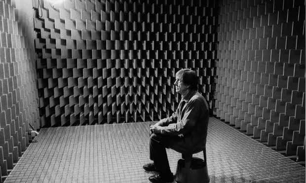

## silent spaces

---

<div class="image-credit">John Cage (1912-1992) --- *John Cage in the anechoic chamber*</div>

---

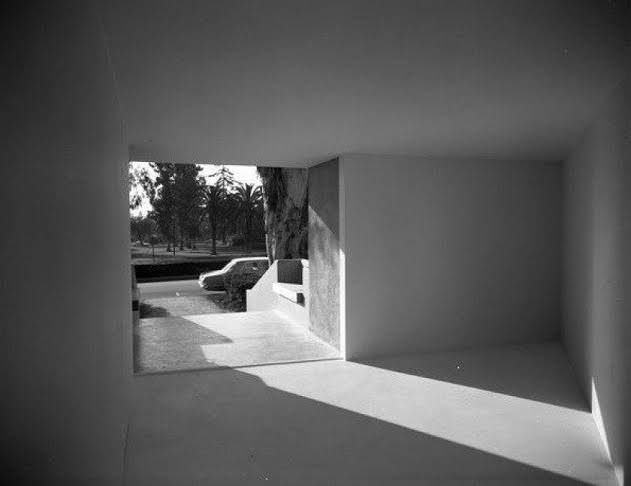

## sound of art

---

<div class="image-credit">Michael Asher (b. 1953) --- *A view of Michael Asher's installation at Pomona College, looking out toward the street*</div>

---

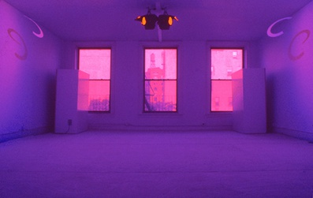

## La Mont Young & Marian Zazeela: _Dream House_ (1969-)

Sound is [spatial...](https://youtu.be/WC6bhnu5Luc)

---


## Working with Sound Files

Let's make some _musique concrète_.

Take sound files as a **raw material**...

and create an _interactive music work_.

## Let's look at `p5.SoundFile`

```javascript
// assign p5.SoundFile object to variable
unilodgeSound = loadSound("assets/unilodge.mp3");
```

Playback control:

- `.pause()` stop playing (and resume later)
- `.resume()` un-pause
- `.stop()` stop playing.

## Composing with SoundFiles

Use the parameters for `play` to create "notes":

```javascript
.play([startTime], [rate], [amp], [cueStart], [duration])
```

Change parameters:
- `.rate()` speed, pitch
- `.jump()` change playback position
- `.setLoop()` start/stop looping

## `userStartAudio()`

Browsers don't like tabs to "autoplay" music. If you're only using sound files, and `.play()`ing them in `setup`, some browsers won't make any sound at all.

`p5.sound` has a built-in trick to help, a function that starts audio that you can use after an interaction (e.g., clicking in the window):

```javascript
function mousePressed() &#123;
  userStartAudio();
&#125;
```

## SoundFiles and Envelopes

We can make "notes" out of soundfiles as well...

```javascript
// in setup...
env = new p5.Envelope();
synthSample.amp(0);
synthSample.setLoop(true);
synthSample.play();
env.setInput(synthSample);
// somewhere else...
env.play();
```

## Recording audio with `p5.AudioIn`

You can use [`p5.AudioIn`](https://p5js.org/reference/#/p5.AudioIn) and [`p5.SoundRecorder`](https://p5js.org/reference/#/p5.SoundRecorder) to access a microphone.

```javascript
\\ setup
mic = new p5.AudioIn();
mic.start();
recorder = new p5.SoundRecorder();
recorder.setInput(mic);
soundFile = new p5.SoundFile();
\\ somewhere else...
recorder.record(soundFile);
recorder.stop();
```

Be **very careful** with this technique: feedback and unpredictable input are very annoying!

---

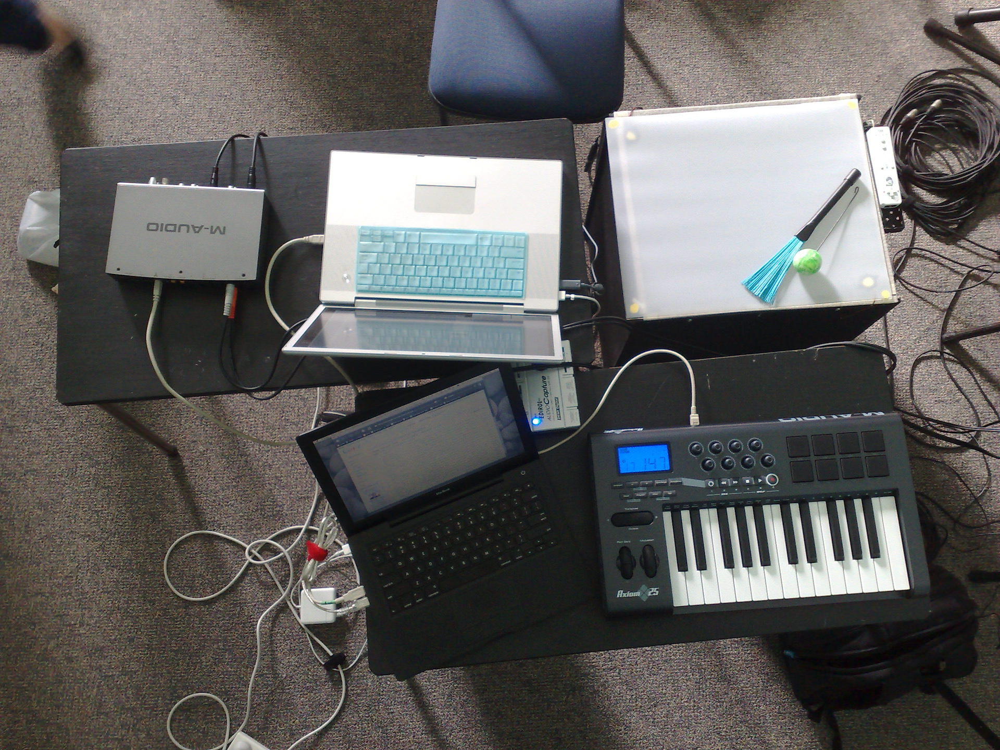

## manage the sonic experience for your user

<!-- mystery slide below??? -->
<!--

---

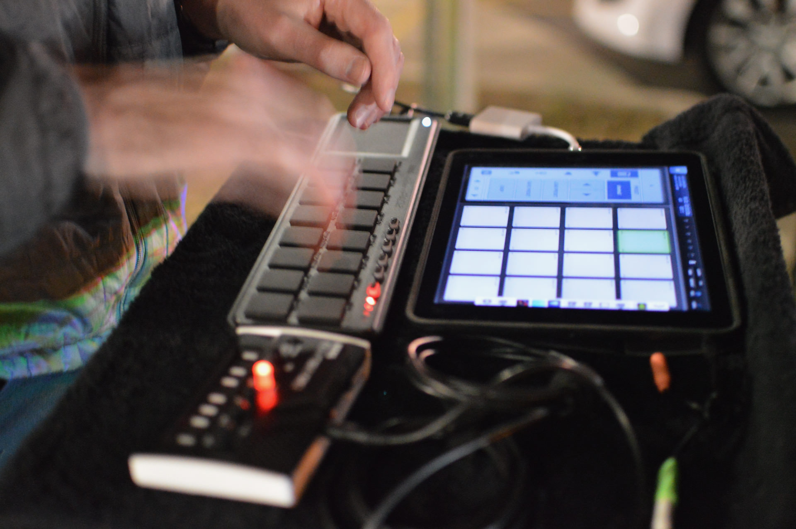

## record, generate, project

-->

---

## Janet Cardiff's Audio Walks

<iframe width="1120" height="630" src="https://www.youtube.com/embed/k20uku4EpXQ" frameborder="0" allowfullscreen></iframe>

---

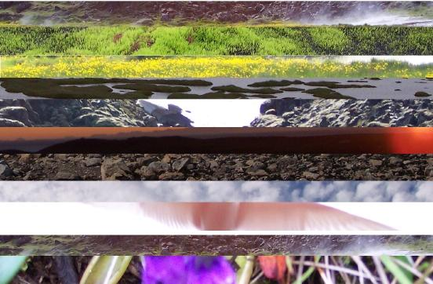

---

<div class="image-credit">Runar Magnusson and Thor Magnusson --- *SameSameButDifferent v0.2*</div>

---

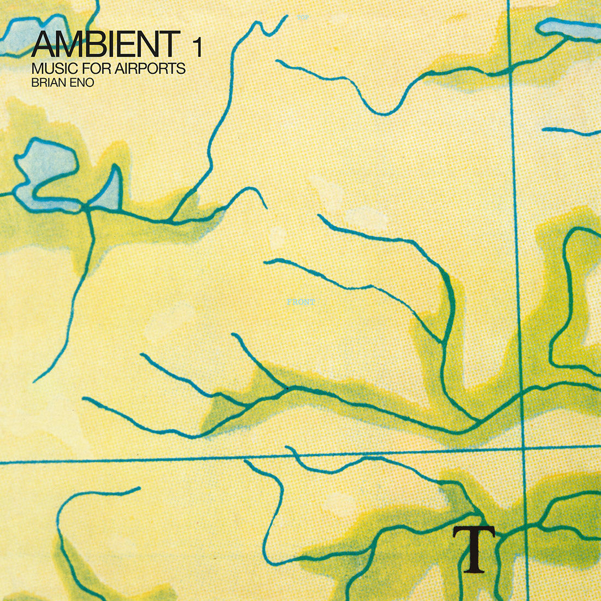

---

<div class="image-credit">Brian Eno --- *Ambient 1:  Music for Airports*</div>

---


## Strike on Stage

---

<div class="image-credit">Chi-Hsia Lai and Charles Martin</div>

<!-- Strike on Stage -->

---

<iframe width="1120" height="630" src="https://www.youtube.com/embed/3Y-FPZx4u94" frameborder="0" allowfullscreen></iframe>

<!-- Neurofeedback 2020 video  -->

---

<iframe width="1120" height="630" src="https://www.youtube.com/embed/WumtMGHAuV8" frameborder="0" allowfullscreen></iframe>

---

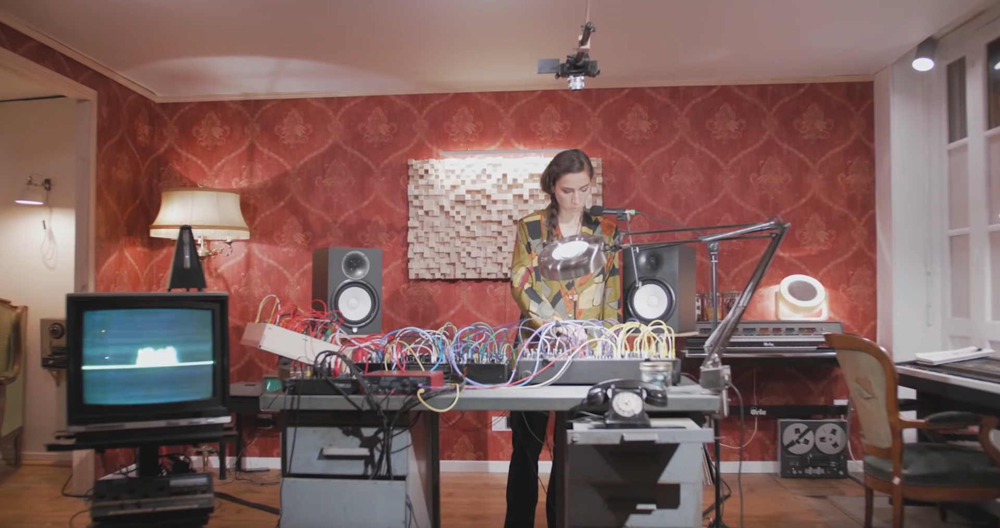

## Hélène Vogelsinger

---

<div class="image-credit">Hélène Vogelsinger</div>

## Remember

- Sound creates _atmosphere_
- Sound is _spatial_
- Sound _drives_ interaction
- Sound _enhances_ experience

`p5.js` can do (almost) everything you could want with sound

To do more look at `tone.js` or `gibber`

## Dos and Don'ts

- **Do** use sound!
- **Don't** _just_ play back mp3 files from the internet.
- **Do** think about enhancing the experience.
- **Don't** annoy the user.

---


## further reading/watching

[_SYNTHESIZE ME_: Sasha Frere-Jones on Éliane
Radigue](https://www.artforum.com/print/201901/sasha-frere-jones-on-eliane-radigue-77996)

[Janet Cardiff and George Bures Miller, _Night Walk for Edinburgh_
(2019)](https://www.youtube.com/watch?v=7hnwStv7cWo)

[Pierre Schaeffer: "etude aux chemins de
fer"](https://www.youtube.com/watch?v=N9pOq8u6-bA)

[Physicist of Sound | Carsten
Nicolai](https://www.youtube.com/watch?v=zCBIKXFrfNA)

[Freesound.org: CC-licensed sound files and field recordings](https://freesound.org/)

<!--

---


## questions?

-->
