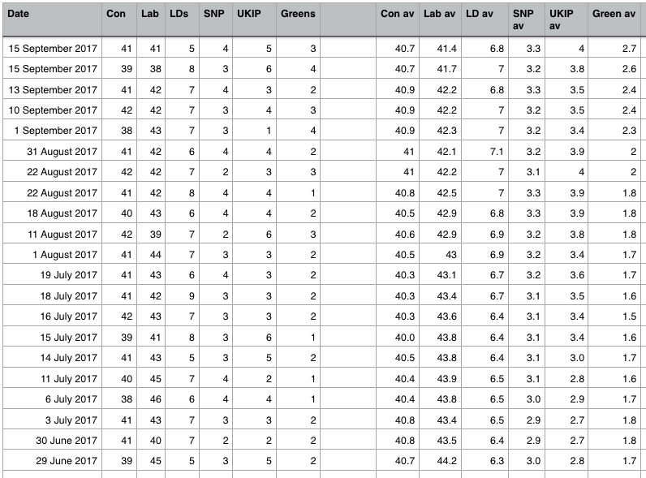
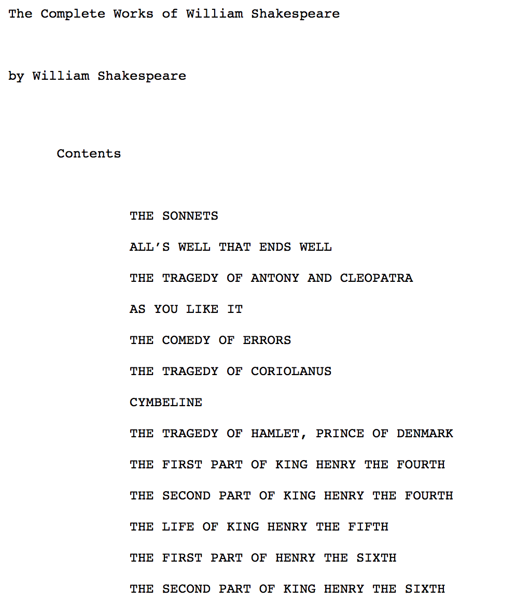
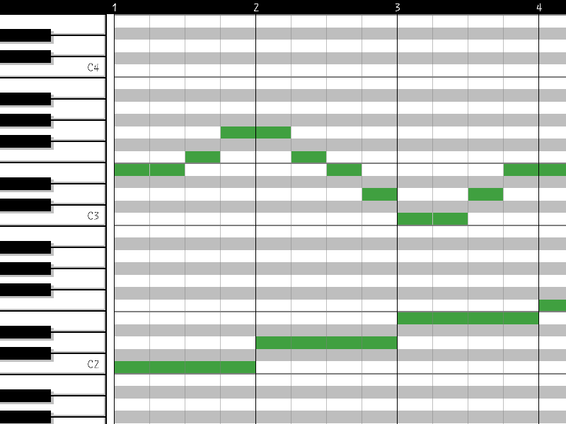
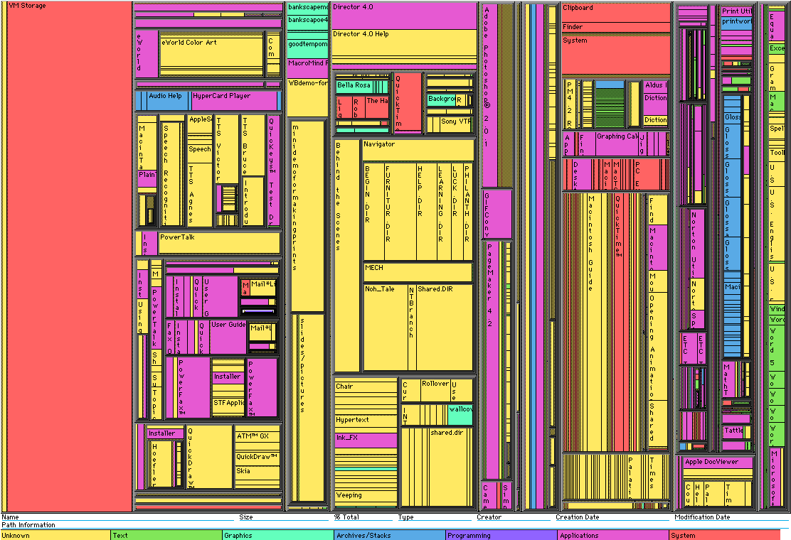
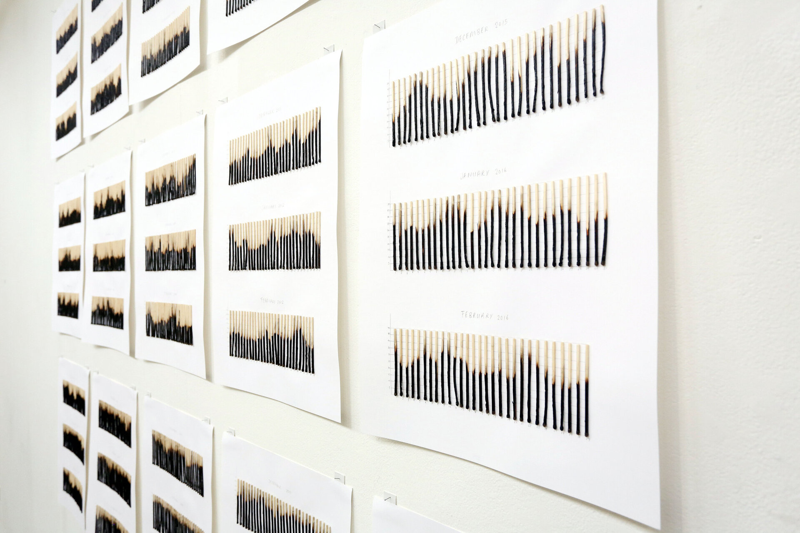
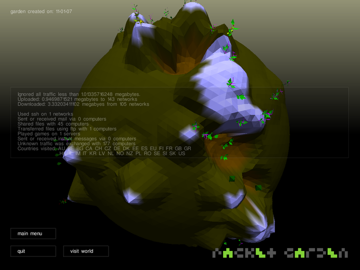
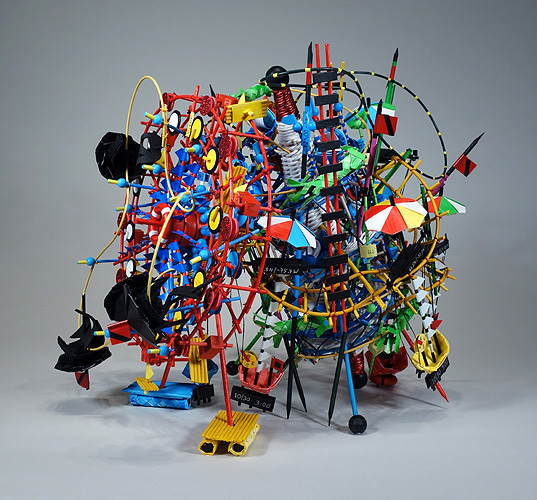
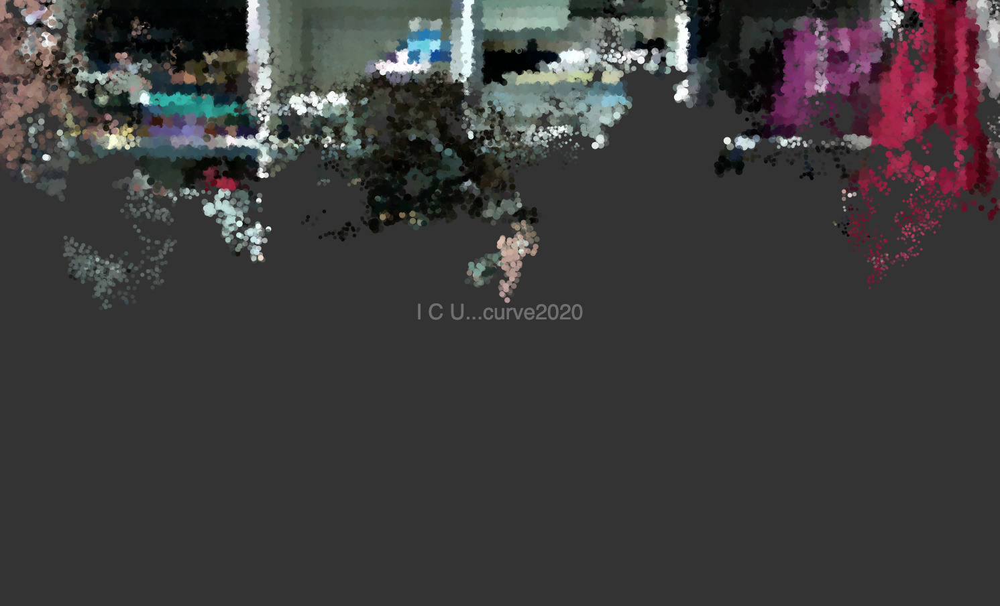

<!-- _class: banner -->

# COMP1720


---


## admin

<!-- Assignment 3: due **1 October 2024**.

If you **need** an extension, **please ask** before the due date.

**next week's** pre-lab entry is a storyboard for your major project (more
details on the [lab page](/labs/09-major-project-storyboard/))

In the week 9 lab you will discuss this storyboard/plan and work on developing your vision for the major project. -->

<!-- [course survey!](https://wattlecourses.anu.edu.au/mod/feedback/view.php?id=2986800) - fill it out!! -->


<!-- start the data part -->

---


## code theory

**working with data**

---


## what's data?

---



---



---



## we've been working with data already!

You know how to add variables, arrays and objects in your `sketch.js` file!

But what if you want to use _a lot_ of data?

Is there are way to load into `p5.js` from a file?

How about loading data directly from the internet?

## three steps for data art

1. getting data **into p5** (usually as arrays or objects)
2. **accessing elements** of the data
3. drawing/moving/sounding stuff on the screen **based on the properties of the data**

## Tables

just like a spreadsheet!

instead of reading `.xlsx` files, `p5` can most easily read CSV files.

CSV stands for **C**omma **S**eparated **V**alues

CSV files are just plain text files with a `.csv` file extension. 

You can easily make your own in VSCode, or export from Excel/Numbers/Sheets.

## Making a table

| kangaroo     | 12  | 2 | 2 | 0 |
| echidna      | 1   | 4 | 0 | 0 |
| sugar glider | 3   | 4 | 0 | 2 |
| noisy miner  | 263 | 2 | 0 | 2 |
| magpie       | 5   | 2 | 0 | 2 |

## Making a table in CSV format

```
"kangaroo",12,2,2,0
"echidna",1,4,0,0
"sugar glider",3,4,0,2
"noisy miner",263,2,0,2
"magpie",5,2,0,2
```

## Adding a header row!

```
"animal","count","legs","arms","wings"
"kangaroo",12,2,2,0
"echidna",1,4,0,0
"sugar glider",3,4,0,2
"noisy miner",263,2,0,2
"magpie",5,2,0,2
```

## Loading Tables

p5 has a [`loadTable()`](https://p5js.org/reference/#/p5/loadTable) function

```javascript
data = loadTable("assets/animals.csv", "csv", "header");
```

This returns a [`Table`](https://p5js.org/reference/#/p5.Table) object (not an array!).

## Using p5 Tables

p5 "Table" objects have functions to access the data by name or by index.

```javascript
data.getRow(2); // get a row
data.getColumn("animal"); // get a column (by name)
data.getRow(1).get("animal"); // get a particular element
```

We can also change it into a 2D array:
```javascript
let dataArray = data.getArray();
dataArray[1][0]; // get a particular element
```

---


## praxis

Let's work with a slightly **bigger** CSV table!

download [`worldcities.csv`](https://simplemaps.com/data/world-cities) (CC-BY 4.0), a database of locations around the world

```
"city","city_ascii","lat","lng","country","iso2","iso3","admin_name","capital","population","id"
"Tokyo","Tokyo","35.6897","139.6922","Japan","JP","JPN","Tōkyō","primary","37977000","1392685764"
"Jakarta","Jakarta","-6.2146","106.8451","Indonesia","ID","IDN","Jakarta","primary","34540000","1360771077"
"Delhi","Delhi","28.6600","77.2300","India","IN","IND","Delhi","admin","29617000","1356872604"
```

## JSON: storing **objects** as text files

JSON: **J**ava**S**cript **O**bject **N**otation

a way of storing javascript objects to a file

JSON files have a `.json` file extension (not `.js` like javascript files)

it's a really common way of sharing data between websites

## what does JSON look like?

``` json
&#123;
  "weight": 61.5,
  "lifespan": 55,
  "colour": "brown",
&#125;
```

this is very similar to writing an object literal in your code!

a couple of differences: quote marks around the property names, and only specific **types** allowed (string, number, array, object, boolean)

## Getting JSON into p5

p5 has a [`loadJSON()`](https://p5js.org/reference/#/p5/loadJSON) function

```javascript
data = loadJSON("mammals.json");
data.weight
// => 61.5
```

Then your JSON data becomes a JavaScript object! (see our [objects lecture](https://cs.anu.edu.au/courses/comp1720/lectures/week-5))

...kind of easier to deal with than a `p5.Table`...

---


## praxis

[Artists in the MoMA](https://github.com/MuseumofModernArt/collection/blob/master/Artists.json)

```json
&#123;
  "ConstituentID": 1,
  "DisplayName": "Robert Arneson",
  "ArtistBio": "American, 1930–1992",
  "Nationality": "American",
  "Gender": "Male",
  "BeginDate": 1930,
  "EndDate": 1992,
&#125;
```

## Tables and Objects

A table of data and an array of objects are very similar

you can think about each rows of your spreadsheet as an object and each column
of your table as property


---

<!-- _class: talk-box -->

## talk

What are the differences between CSV tables and JSON files in `p5`?

Is one more useful than the other for different kinds of tasks?

---


## Extra Admin Corner

---


## API data

**working with data from the internet**

---


## why are we doing this again?

Using **data** to drive an artwork is a great way to connect your art to the real world.

If you store data **outside your program** you can access it just when you need it.

Your p5 sketch could also load data **directly from the internet**...

## web APIs: getting data from the internet

API means "application programming interface" which means.... what exactly?

**Practically,** this means a special web URL which produces **JSON data** instead of a web page

**More fully**, this is an **interface** let your application (an artwork written in p5) to access a web server with some **data** that we want in a **format** that makes sense to p5.

(NB: not all web APIs return JSON data, but many/most do!)

## Why do this?

You don't need to **save the data on your computer**, p5 can grab it from the internet for you. Then it will always be **up to date**! Your artwork could change from minute to minute! (cool!)

We can **program the data we get** with special queries in the URL.

## Example:

<https://data.brisbane.qld.gov.au/api/explore/v2.1/catalog/datasets/swimming-pools/records?limit=5>

Endpoint: `https://data.brisbane.qld.gov.au/api/explore/v2.1/`

Then point to the resource: `catalog/datasets/swimming-pools/records`

and (`?`) `limit=5`

(found at <https://www.data.brisbane.qld.gov.au/>)

## Another example:

<https://earthquake.usgs.gov/fdsnws/event/1/query?format=geojson&starttime=2014-01-01&endtime=2014-01-02>

Endpoint: `https://earthquake.usgs.gov/fdsnws/event/1/`

Then `query?` followed by parameters: `format=geojson&starttime=2014-01-01&endtime=2014-01-02`

(found at <https://earthquake.usgs.gov/fdsnws/event/1/>)

---


## web APIs

it's a "programmatic" way of getting information from a website!

## Hitting a web API with p5

We can use [`httpGet()`](https://p5js.org/reference/#/p5/httpGet) in p5 to access a web API.

```javascript
let data;
let url = "https://www.data.act.gov.au/resource/nkxy-abdj.json"
httpGet(url, 'json', false, function(response) &#123; data = response; &#125;);
```

**Weirdness alert!** One of the _parameters_ of `httpGet` is actually a function that defines what to do with the data when it is downloaded! Weird!

## Ok, so where will we get some data?

**Lots** of websites, particularly government and scientific institutions have a public API.

There are so many that there are websites to help us **find public APIs**, e.g.:

[data.gov.au](https://data.gov.au)

[data.act.gov.au](https://data.act.gov.au)

[GLAM Workbench](https://glam-workbench.github.io/)

---


## praxis

Example: **Public Transport in Canberra**

Let's make an artwork about Canberra's public transport system.

Here's some data about [how many passengers travel on different services each day](https://www.data.act.gov.au/Transport/Daily-Public-Transport-Passenger-Journeys-by-Servi/nkxy-abdj)

And [here's the JSON version](https://www.data.act.gov.au/resource/nkxy-abdj.json)

And here's [just one day (2020-10-05)](https://www.data.act.gov.au/resource/nkxy-abdj.json?date=2020-10-05T00:00:00.000)

## A simple artwork about light rail:

```javascript
var data;
let row = 0;

function preload() &#123;
  let url = "https://www.data.act.gov.au/resource/nkxy-abdj.json"
  httpGet(url, 'json', false, function(response) &#123; data = response; &#125;);
&#125;

function setup() &#123;
  createCanvas(windowWidth, windowHeight);
  background(0);
&#125;

function draw() &#123;
  background(0,0,0,25);
  if (!data) &#123;
    return;
  &#125;
  fill(0);
  stroke(255);
  let day = data[row];
  let lightRailJourneys = day["light_rail"];
  ellipse(width/2,height/2,lightRailJourneys/50, lightRailJourneys/50);
  row = row + 1;
  row = row % data.length;
&#125;
```

---


## data art

Let's look at some examples of data art...

---



---

<div class="image-credit">Ben Shneiderman et al. --- *[TreeViz](https://www.cs.umd.edu/hcil/pubs/treeviz.shtml)*</div>

---



---

<div class="image-credit">Anna Madeleine Raupach --- *Controlled Burn (Canberra, Adelaide, Alice Springs: leap years since 1999) [(link)](https://www.annamadeleine.com/controlled-burn)*</div>

---



---

<div class="image-credit">Julian Oliver --- *Packet Garden [(link)](https://julianoliver.com/projects/packetgarden/)*</div>

---



---

<div class="image-credit">Nathalie Miebach --- *Chutes and Ladders [(Sandy Rides)](https://www.nathaliemiebach.com/work/the-sandy-rides) [(TED talk)](https://www.ted.com/talks/nathalie_miebach_art_made_of_storms?referrer=playlist-art_from_data)*</div>

---



---

<div class="image-credit">Sharyn Brand ([link](http://www.sharynbrand.com/)) --- *I C U... curve2020 [(link)](https://tobeheard.github.io/i-c-u-curve2020/) [(code)](https://github.com/tobeheard/i-c-u-curve2020)*</div>

---


## further reading/watching

Make: Getting Started with p5.js - chapter 12

[r/dataisbeautiful](https://www.reddit.com/r/dataisbeautiful/search?q=title%3AOC&sort=top&restrict_sr=on&t=year)

_Data Art_ category on [Flowing
Data](https://flowingdata.com/category/visualization/artistic-visualization/)

[_The Digital Age of Data Art_](https://techcrunch.com/2016/05/08/the-digital-age-of-data-art/)

[6 Artists who have swept data art into the digital age](https://medium.com/@Infogram/meet-6-artists-who-have-swept-data-art-into-the-digital-age-d5c5ae805bab)

[Art made of data (TED talk playlist](https://www.ted.com/playlists/201/art_from_data)


<!--

---


## questions?

-->
