<!-- _class: banner -->

# COMP1720


---


## admin

Lab 10 requirements:

**fork** the MP repository

**start** some aspect of your MP

**commit**  and **push** it to gitlab

**think about** the following questions

"How does this sketch reflect the major project theme? How does this sketch engage the viewer? What is the address of your sketch on the test server?"

## instructions.md vs artist statement

In your MP you have an `instructions.md` file as well as an artist statement.

This file is for explaining how to set up and operate your work, just in case it isn't intuitive or you have special requirements.

but **don't confuse** the instructions file with the artist statement.

## Referencing

We don't mind if you start with someone elses code or ideas, as long as you **change it significantly** and **put it in your references file.**

If you take ideas from somewhere they **must** go in your `references.md`, even if you've significantly changed the code. 

- A minimum of **two references** are still required

- Include **all** asset files (images, sounds, fonts) in your `references.md` with full author and source information.

---

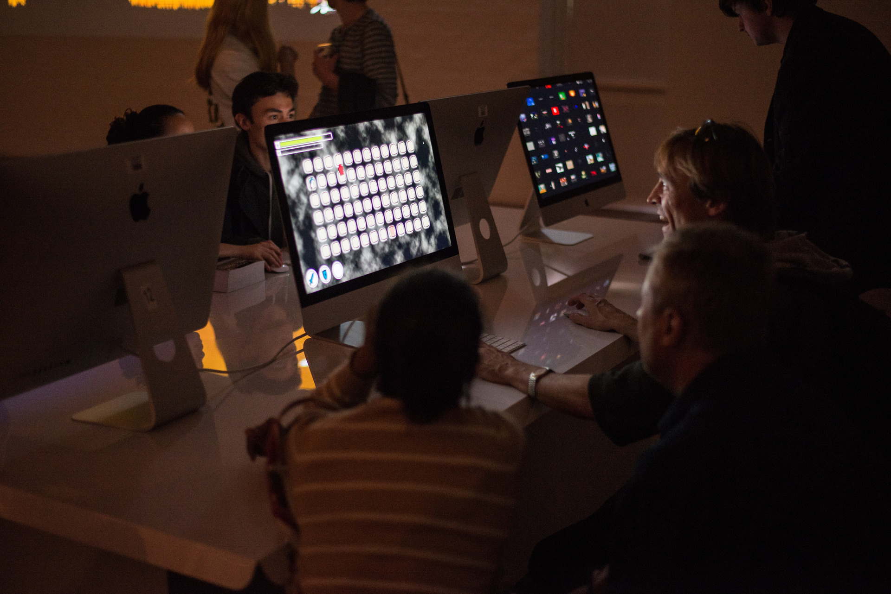

## major project

## the goal

your major project is an interactive p5 artwork for a *hypothetical* new-media art exhibition

gallery attendees are able to walk around and *may* interact with your work

your **goal** is to provide them with an engaging experience of _roughly_ three
minutes exploring the project theme

## [theme](/assessments/05-major-project/)

you can interpret the theme **however you like**

but read the [requirements](/assessments/05-major-project/#requirements) carefully

## Your task: **make a start**

make a start on your project and have _something_ finished for your lab in week 10.


by your week 10 lab...


everyone should have **forked** and made at least one **commit**!

<!-- 
I will **be checking**! -->

## Going beyond and getting up to date

We don't cover all that there is to know about programming or `p5` in this course.

You have enough knowledge to create a _great_ major project!

Now it's time to look beyond the basics and look at **recent developments** in Art and Interaction Computing

## Why do this?

**1720** Students: 

- Get **inspired** and **engaged** with what's happening in the world of interactive art!
- Engage with the **academic discussion**!


**6720** Students: the above, _and_ it's a **course requirement!**


## The Recent Developments File

See the major project  [requirements](/assessments/05-major-project/#requirements)...

> If you are a student enrolled in COMP6720, then as an additional task you must explain how your artwork reflects recent developments in Art and Interaction Computing in your `comp6720-recent-developments.md` file (max 200 words).

## Today

Today we will start and cover some fundamental concepts.

In the last part of this course we look at specific topics that have a good connection with `p5`: 

- _data_, 
- _simulations and artificial life_, and 
- _creative machine learning_

## What is a "recent development"

Something that happened in the last 15 years...

What we're talking about today starts in the late 90s, early 2000s...

Resources to help:

- lectures since week 5
- this [bibliography](https://cpmpercussion.github.io/art-and-interaction-bibliography/)

---


## Human Computer Interaction and Interactive Art

Human-Computer Interaction is the field of study of how people use computer systems (and how to design them).

There has been a move from **"ease-of-use"** to **"experience"** in studying interactions.

## Creative Interactions

Movement towards studying tools to **support creativity**.

"there is a move from routine work and productive concerns to human and creative ones." (Edmonds, 2018).

Refernce: Edmonds, E. (2018). The art of interaction: What HCI can learn from interactive art. Morgan & Claypool Publishers. [ANU Library Link](https://library.anu.edu.au/record=b7017365)

## Creativity Support Tools (Schneiderman et al. 2006)

1. Support exploration.
2. Low threshold, high ceiling, and wide walls.
3. Support many paths and many styles.
4. Support collaboration.
5. Support open interchange.
6. Make it as simple as possible—and maybe even simpler.
7. Choose black boxes carefully.
8. Invent things that you would want to use yourself.
9. Balance user suggestions with observation and participatory processes. 
10. Iterate, iterate—then iterate again.
11. Design for designers.
12. Evaluate your tools.

---

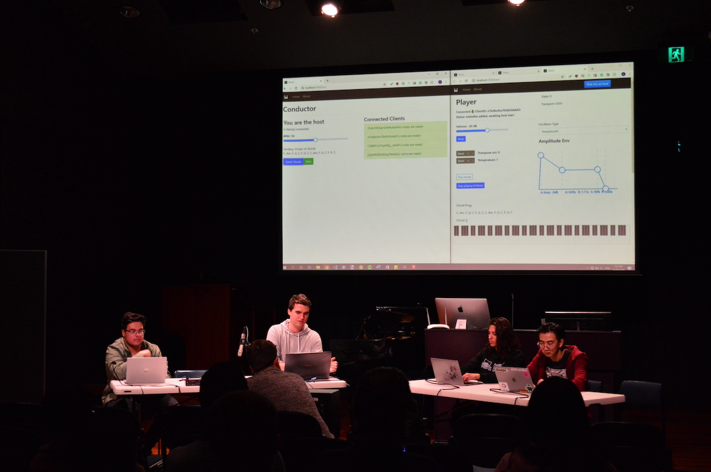

## Artists as Power Users

Artists are "creative power users" (Candy, 2007).

Artists show us the **boundaries** of human-computer interaction (excess of _je ne sais quoi_)

Studying interactive art gives us insight into the **potential** of creativity support tools in the hands of **experts**.

This translates into findings about "everyday creativity" (Edmonds, 2018)

## Why am I telling you this?


interactive art and human-computer interaction have important connections.


research about interactive art is often wrapped up in HCI research.


now lets look at some big concepts and examples

---


## Data

<https://www.cs.umd.edu/hcil/pubs/treeviz.shtml>

<!-- Sensors and Hardware -->

---

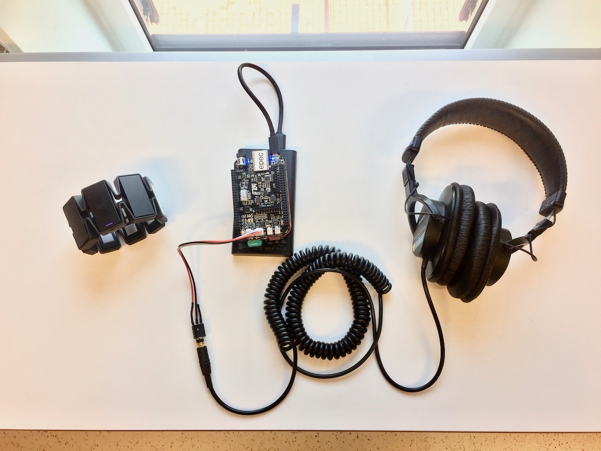

## Sensors and Hardware

---

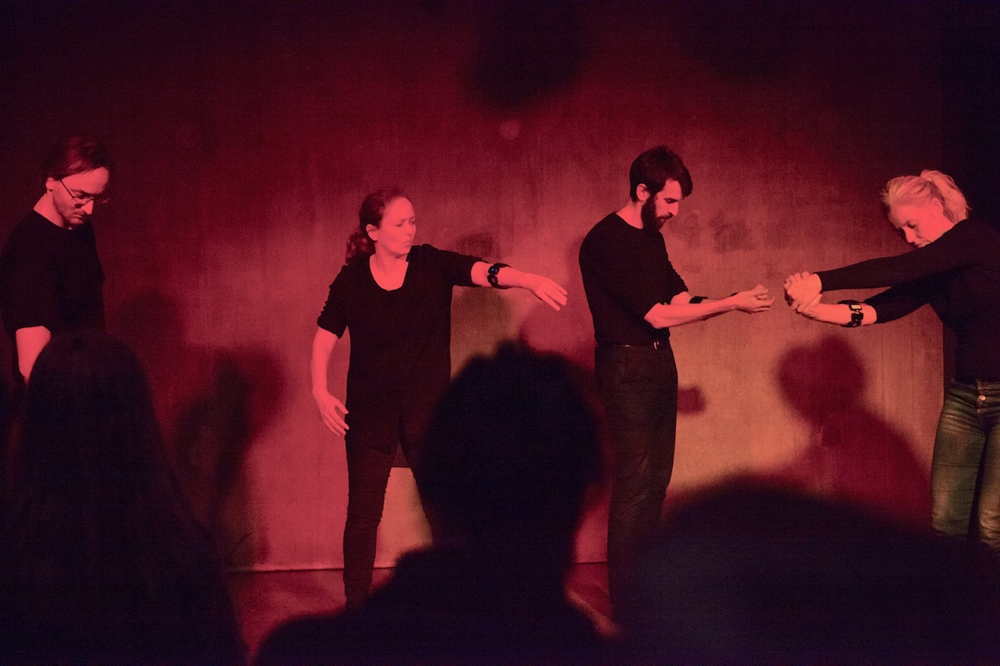

## Stillness Under Tension (2017)

Charles Martin *et al.*

---

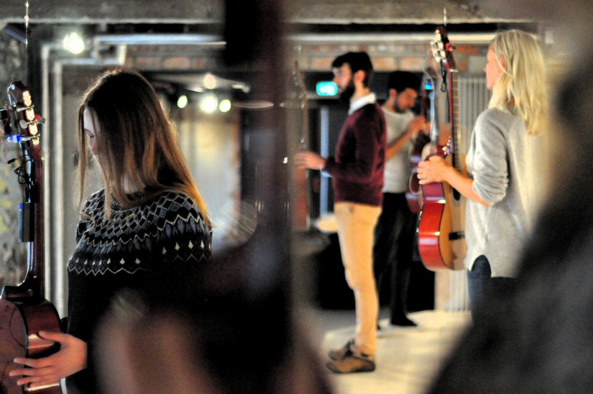

## Sverm Resonans

---

<div class="image-credit">*Sverm Resonans*</div>

<!-- computational creativity -->

---

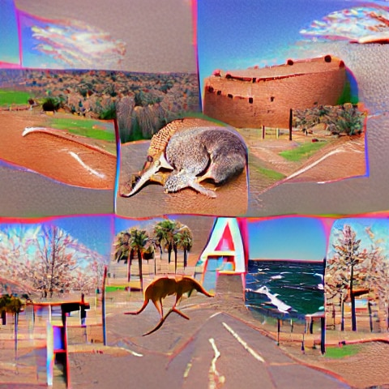

## Computational Creativity

---

<div class="image-credit">**CLIP & VQ-GAN** --- *Australia*</div>

---

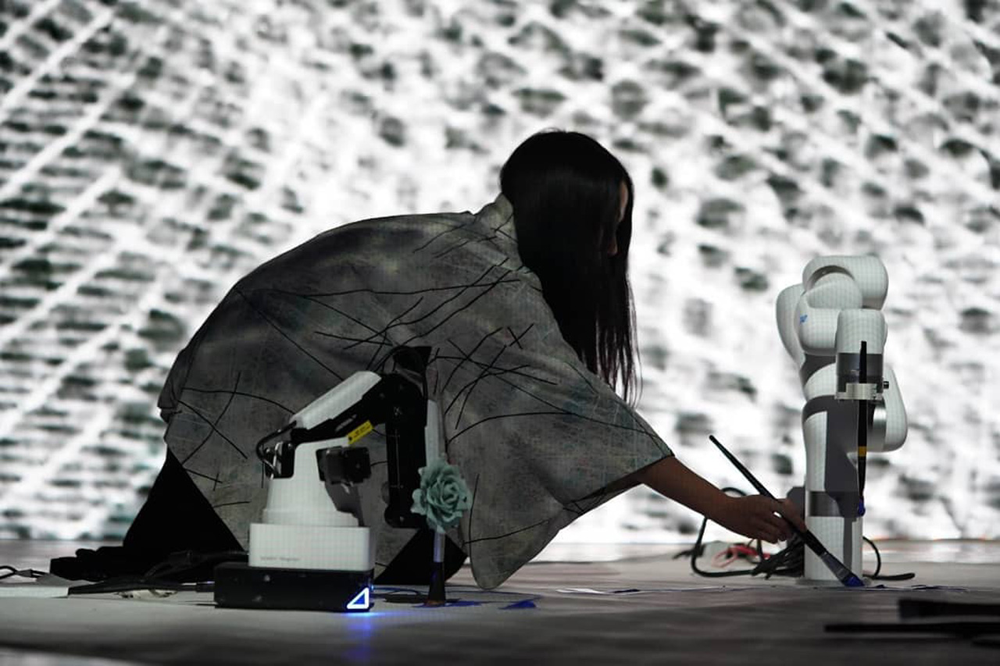

## Co-creative systems...

---

<div class="image-credit">Sougwen Chung --- *Exquisite Corpus*</div>

<!-- Virtual Reality -->

---


## Immersive Technology: VR and AR

---

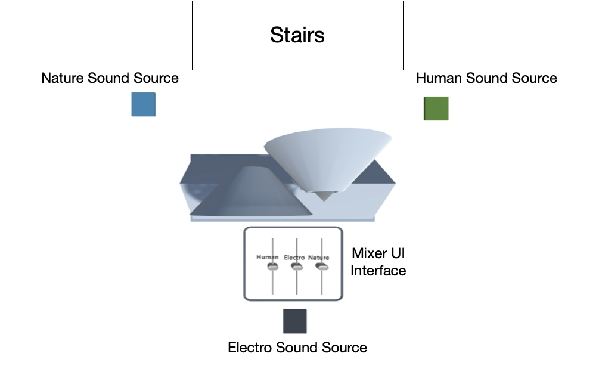

## Sonic Sculpture: Listening to Listening

---

<div class="image-credit">Charles Martin and Zeruo Liu --- *Listening to Listening*</div>

---

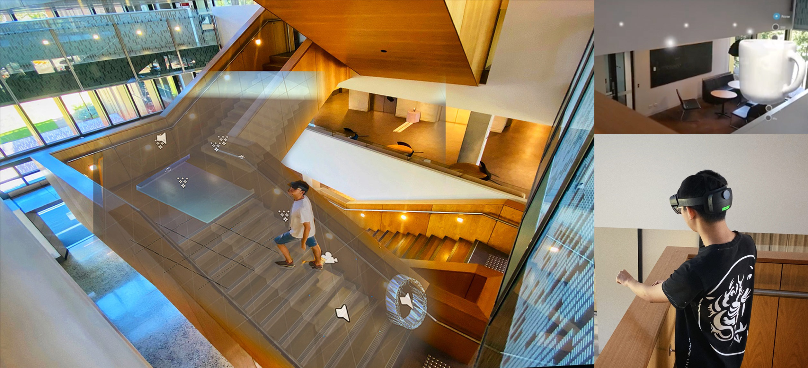

## Sonic Sculptural Staircase

---

<div class="image-credit">**Yichen Wang** --- *Sonic Sculptural Staircase*</div>

<!-- Mobile -->

---

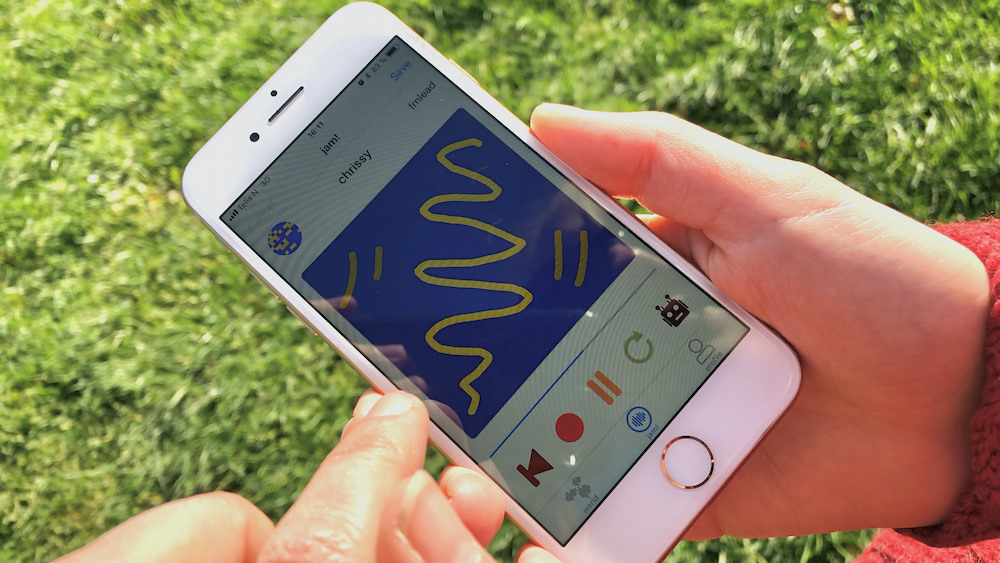

## Mobile Interactive Art

---

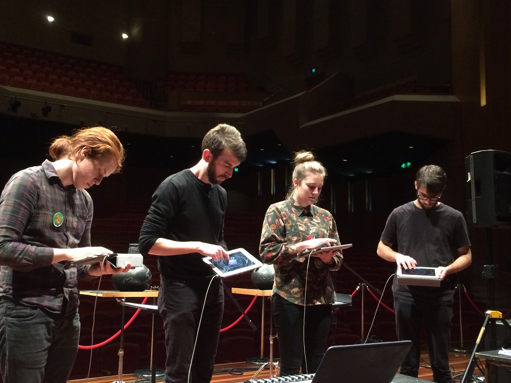

## Mobile Ensembles

<!-- Robotic Art -->

---

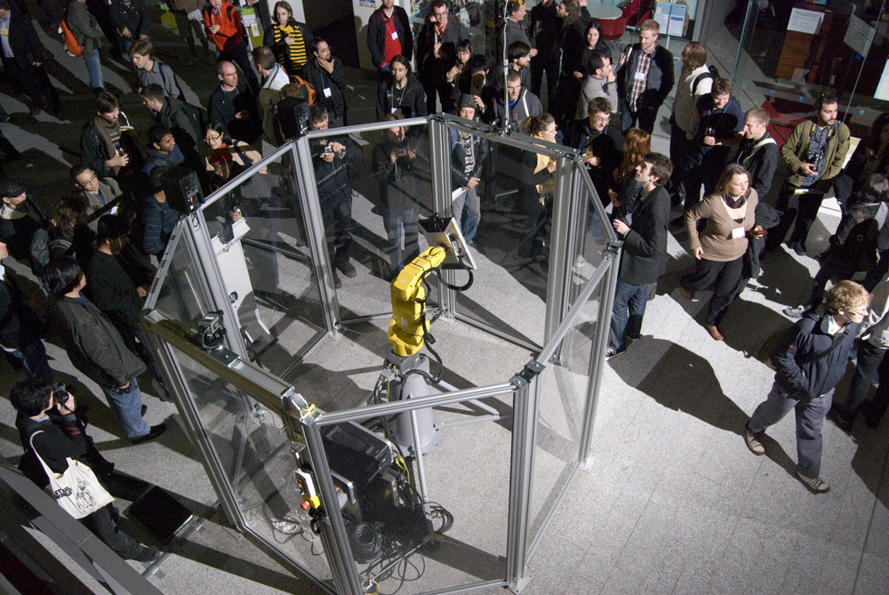

## Robotic Art

---

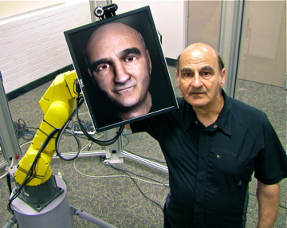

## Articulated Head (Stelarc)

[link to version 2.0 of this artwork](https://roboticart.org/project/articulated-head-2-0/#:~:text=The%20Articulated%20Head%202.0%20is%20an%20art%20installation,of%20a%20head%20that%20replicates%20the%20artist%20Stelarc.)

---

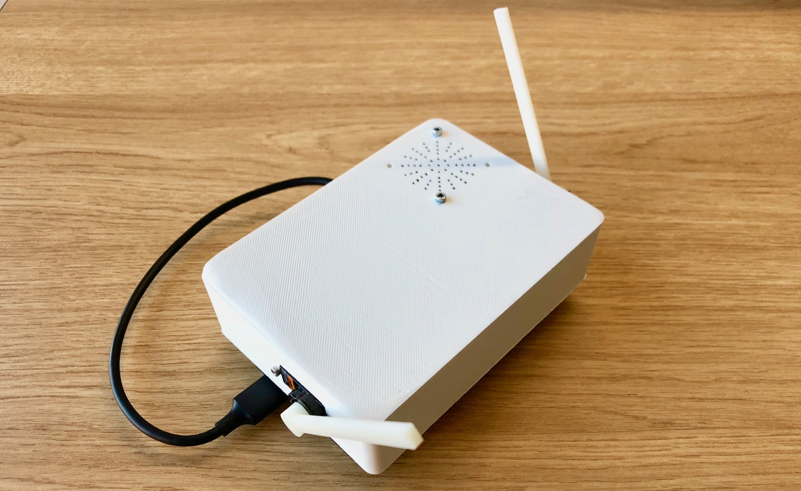

## Embodied Predictive Instrument

---


## Objects and Constructors

Wait a minute... haven't we looked at **objects** already?

Yes, but there are other ways to _create_ objects that are useful if you want to make **lots** of them.

You can look at more info here in the [MDN docs](https://developer.mozilla.org/en-US/docs/Web/JavaScript/Guide/Working_with_Objects).

## Object Creation

recall this way of creating a "sally" object:

```javascript
let sally = &#123;
  species: "Pikachu",
  level: 1,
  hp: 100,
&#125;;
```

## Object Constructors

Object _constructors_ are special functions that generate objects, you mark them by using a capital letter at the start of the function name:

```javascript
function Pokemon(species, level, hp) &#123;
    this.species = species
    this.level = level
    this.hp = hp
&#125;
```
You can use this as follows:
```javascript
sally = new Pokemon("Pikachu", 1, 100)
```

## What's going on with `new`

```javascript
sally = new Pokemon("Pikachu", 1, 100)
```
`new` is a special word that tells JS to create an object from a constructor.


## What's going on with `this`

```javascript
function Pokemon(species, level, hp) &#123;
    this.species = species
    this.level = level
    this.hp = hp
&#125;
```
`this` is a special variable name in JS that refers to _the current object_.

We can use the `Pokemon()` constructor to make lots of different objects, so `this` is a way of saying "not THAT pokemon, THIS pokemon!".

## Methods in Constructors?

You can put methods in constructors too:
```javascript
function Pokemon(species, level, hp) &#123;
    this.species = species
    this.level = level
    this.hp = hp
    this.hello = function() &#123;
        console.log("Hi, I'm", this.species)
    &#125;
&#125;
```
`this` is _especially handy_ for methods.

## One more trick...

Suppose you _forgot_ to make a constructor, or just didn't want to.

```javascript
let sally = &#123;
  species: "Pikachu",
  level: 1,
  hp: 100,
&#125;;
```
You can still make more pokemon!
```javascript
let jeffrey = Object.create(sally);
```
(Question: Why would we need to do this?)

---

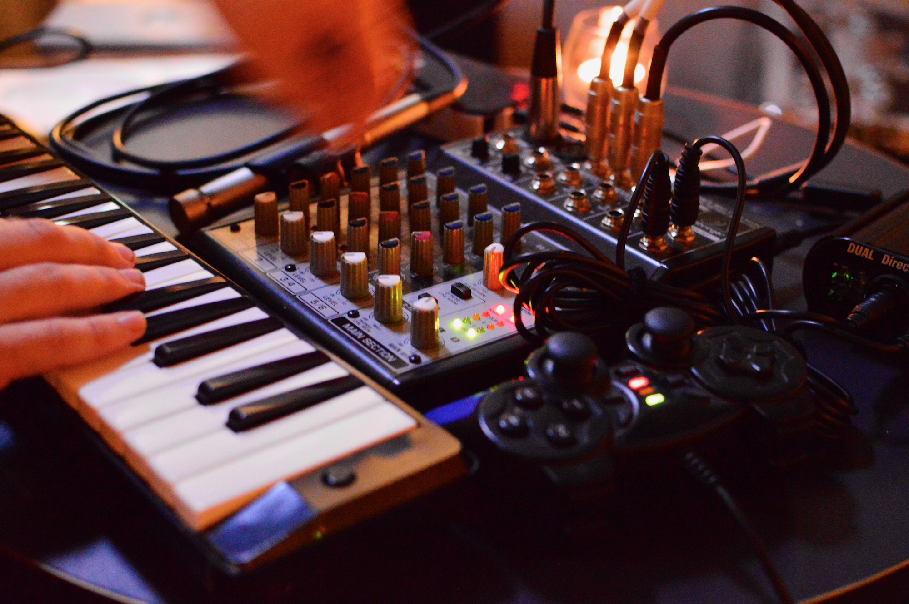

## Objects by request...

---


## further reading/watching

Edmonds, E. (2018). The art of interaction: What HCI can learn from interactive art. Morgan & Claypool Publishers. [ANU Link](https://anu.primo.exlibrisgroup.com/permalink/61ANU_INST/1csbe8o/cdi_igpublishing_primary_MCPB0006384)

Shneiderman, B. (2007). Creativity support tools: Accelerating discovery and innovation. Communications of the ACM, 50(12), 20–32. <https://doi.org/10.1145/1323688.1323689>

[Computational Creativity: 14 AI Artists](https://medium.com/aixdesign/computational-creativity-14-ai-artists-whose-work-to-explore-251c32cdd787)

Full bibliography for this lecture: <https://cpmpercussion.github.io/art-and-interaction-bibliography/index.html>

[MDN Working with Objects](https://developer.mozilla.org/en-US/docs/Web/JavaScript/Guide/Working_with_Objects)

<!--

---


## questions?

-->
