<!-- _class: banner -->

# COMP1720


<!--

---


## A3 marks are out!

[Overall stats](https://edstem.org/au/courses/12293/discussion/1642295) -->

---


## positive affirmations

"I have started my major project."

"I have committed my latest work to gitlab"

"I have been adding to my references as I go"

"I have looked at my MP at the test URL"

"When I need help, I ask on the forum"


## MP: getting help

you still have a chance to get help in your week 12 lab.

feel free to share your major project problems / solutions / ideas on the course forum. We love to see your questions and discussions. 

there's nothing wrong with showing off your MP if you're comfortable.

---


## major project tips

---


## sketch!

it's not too late to try lots of different _angles_ on the theme

---


## 'user' testing

watch a friend use it (without telling them anything first)

what do they do? where do they get stuck?

---


## what's the wow factor?

what is the thing which makes your major project stand out amongst all the
others?

how will you make sure that your sketch presents itself as the _best_ version of
that "wow"?

---


## write your artist statement and references as you go

you don't want to end up in an [academic misconduct](/resources/01-faq/#academic-integrity) situation

---


## push to GitLab <em>all the time</em>

---

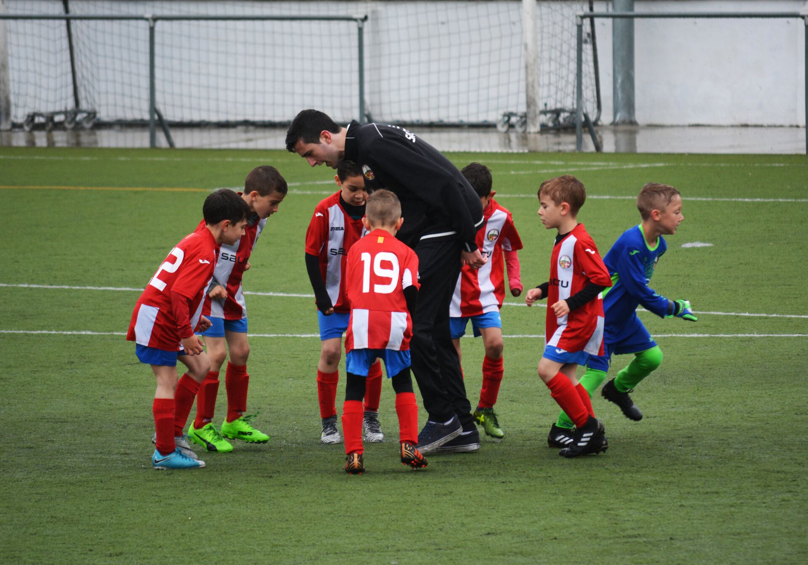

## rookie mistakes

---


## not reading the spec

this is worth 50%---you should read (and re-read) the [major project
page](/assessments/05-major-project/)

---


## making a game

where's the _artwork_ in that? what are you trying to _communicate_?

would it make sense on the wall in a gallery?

---

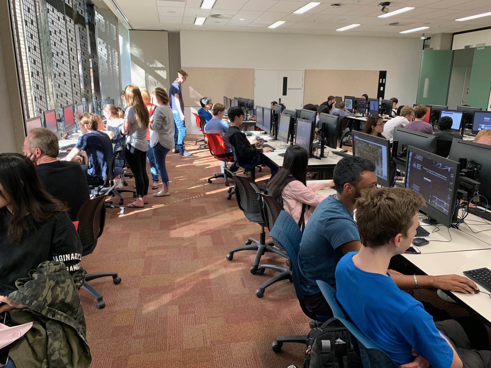

## not testing at the test url

see point #4 on the [submission checklist](/assessments/05-major-project/#submission-checklist)

---


## putting an example in the microwave

you might have gotten away with it for an assignment

**not acceptable** for your major project

---

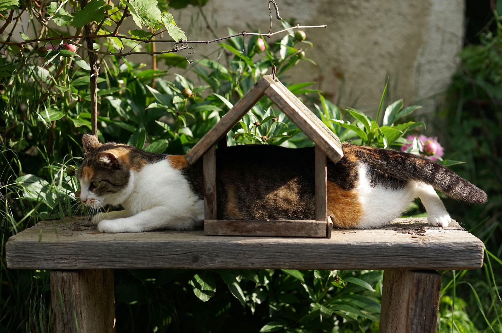

## conceiving of the theme too narrowly

think big, think broad, think outside the box

use your [artist statement](/assessments/05-major-project/#artist-statement) to tell me how you interpreted the theme

---


don't make a **powerpoint**

---


## code theory

---

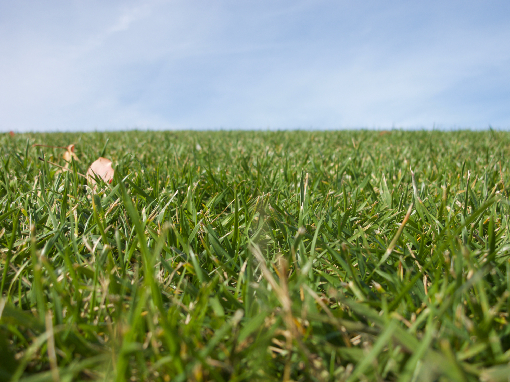

## inspiration from nature...


Movement, Friction, Force, Fields...


Growth, Reproduction, Decay...


Collaboration, Ecosystems...


These are all things that _change_. We want to _simulate_ these systems, and explore **dynamic** and **emergent** behaviours.

---

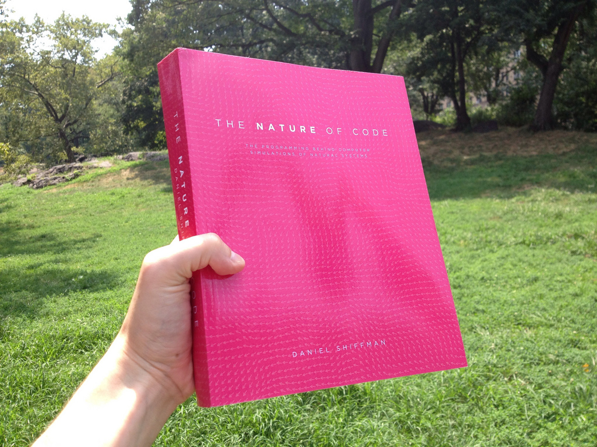

---

<div class="image-credit">Daniel Shiffman --- *The Nature of Code*</div>

## The Nature of Code

Textbook for a _second course_ in creative coding.

Available for [free online](https://natureofcode.com/book/).

And in ["pay what you like" for a PDF.](https://natureofcode.com/)

p5.js ["simulate" examples](https://p5js.org/examples/) generally come from the book.

(N.B.: uses _Processing_ not _p5.js_)

---

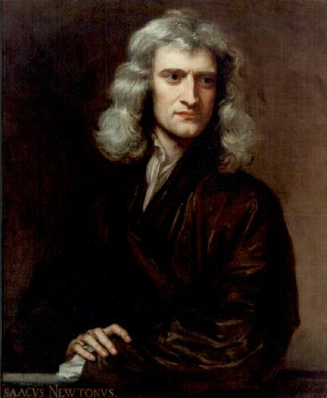

## Vectors and Physics

---

<div class="image-credit">Godfrey Kneller --- *Portrait of Isaac Newton (1642-1727)*</div>

## Simulating Motion

Simulating "realistic" motions by using simple rules of motion.

Easiest to do this in 2D!

We're going to use `p5.Vector`, an object to wrap up an `x,y` value. ([see ref](https://p5js.org/reference/#/p5.Vector))

```javascript
let vec = createVector(10,25);
let x = vec.x;
let y = vec.y;
```

## Ball Model Skeleton


```javascript
let ball;

function setup() &#123;
  createCanvas(400, 400);
  ball = &#123;
    pos: createVector(78,231),
    vel: createVector(2,-10),
    
    drawBall: function() &#123;
      fill(255,0,0);
      stroke(0);
      ellipse(this.pos.x, this.pos.y, 50, 50);
    &#125;,
    
    updateBallPos: function() &#123;
    &#125;
  &#125;
&#125;
```

## Draw Loop

The draw loop is going to draw the ball. And then "update" the ball.

```javascript
function draw() &#123;
  background(220);
  ball.drawBall();
  ball.updateBallPos();
&#125;
```

## Moving Ball

Add the velocity to position at each frame.

This goes in `updateBallPos()`:

```javascript
this.pos.x += this.vel.x;
this.pos.y += this.vel.y;
```

I guess this means that the velocity is measured in "pixels per frame".

## Bouncing Ball

```javascript
// check boundaries
if (this.pos.x > width || this.pos.x < 0) &#123;
    this.vel.x *= -1;
&#125;
if (this.pos.y > height || this.pos.y < 0) &#123;
    this.vel.y *= -1;
&#125;
```

## Bouncing Ball with Gravity

Gravity is a constant acceleration towards the ground.

We can model gravity by constantly increasing the velocity in the `y` direction.

```javascript
this.vel.y += 0.5;
```

---


## Completed Bouncing Ball Object


```javascript
  ball = &#123;
    pos: createVector(78,231),
    vel: createVector(2,-10),
    drawBall: function() &#123;
      fill(255,0,0);
      stroke(0);
      ellipse(this.pos.x,this.pos.y,50,50);
    &#125;,
    updateBallPos: function() &#123;
      this.pos.x += this.vel.x;
      this.pos.y += this.vel.y;
      // check boundaries
      if (this.pos.x > width || this.pos.x < 0) &#123;
        this.vel.x *= -1;
      &#125;
      if (this.pos.y > height || this.pos.y < 0) &#123;
        this.vel.y *= -1;
      &#125;
      // apply gravity
      this.vel.y += 0.5;
    &#125;
  &#125;
```

---


## Game of Life

We've simulated a ball.


Now how about simulating an ecosystem?


What's the simplest way to do that?

---

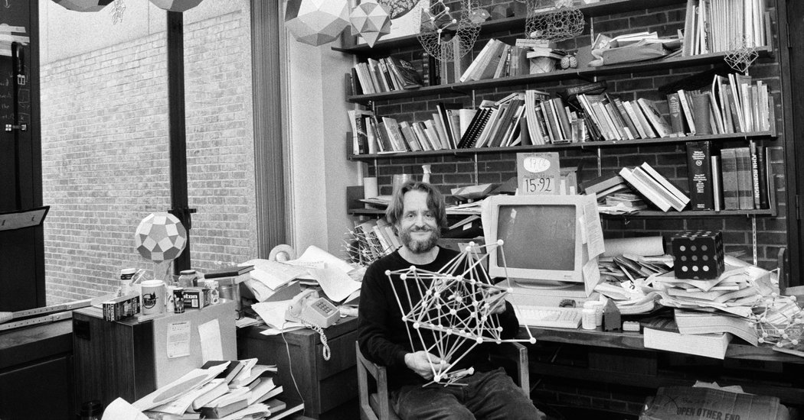

---

<div class="image-credit">Dith Pran/The New York Times --- *John Conway at Princeton University*</div>

## Conway's Game of Life

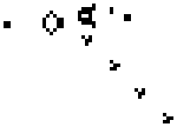

John Conway was a mathematician with many contributions including to "recreational mathematics".

[Game of Life](https://en.wikipedia.org/wiki/Conway%27s_Game_of_Life) is an example.

[Wiki](https://conwaylife.com/wiki/)

(Died of COVID-19, January 2020)

## Cellular Automaton

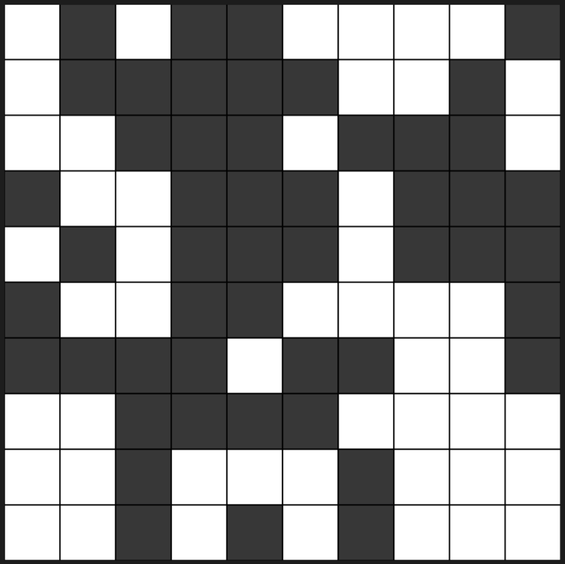

- Cells live on a grid

- Each cell has a state (`true` or `false`)

- Each cell has a neighbourhood (of adjacent cells)

- Cells change *state* according to their neighbourhood

## Rules of life


Each cell is updated in each frame.

If it's **alive** and has more than three neighbours, it dies (overpopulation).

If it's **alive** and it has less than two neighbours, it dies (loneliness).

If it's **dead** but has exactly three neighbours, it comes to life! (birth).

## In p5.js

- We will need a 2D array of Boolean values.

- need to draw the array on the screen at each frame

- need to find out **how many neighbours** a cell has

- need to **update** the array each frame according to the **rules**

Here's [an example](https://editor.p5js.org/charlesmatarles/sketches/zDrjNcPlk).

---


## Boids and Flocking

Let's look at another classic artificial life concept..

---

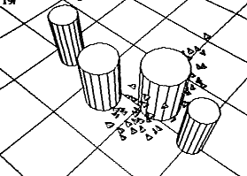

---

<div class="image-credit">Craig Reynolds --- *simulated boid flock avoiding obstacles*</div>

## Boids

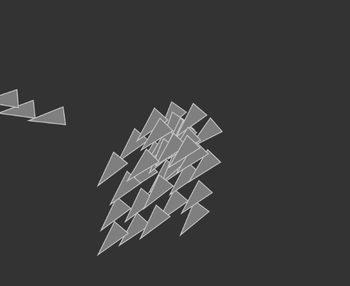

A simulation of coordinated animal motions (e.g., birds, fish) by [Craig Reynolds in 1986](https://www.red3d.com/cwr/boids/). [(original paper)](https://dl.acm.org/doi/10.1145/37402.37406)

Generic creatures are named _boids_, represented by little triangles.

Widely discussed as an example of artificial life that shows **emergence** of complex behaviour from simple rules.

Three simple steering behaviours: **separation**, **alignment**, and **cohesion**.

## A Boid


Has a **direction** and a **velocity**.

Can **steer** left and right by angle.

**Reacts** to other boids in a small _neighbourhood_

## Separation


**Don't crowd**.

Adjust heading to **avoid** nearby boids.

[image credit: Reynolds, C. W. 1987. Flocks, Herds, and Schools: A Distributed Behavioral Model.](https://www.red3d.com/cwr/boids/)

## Alignment


**Move in the same direction**

Calculate the average velocity vector of nearby boids and adjust our velocity to approach that.

[image credit: Reynolds, C. W. 1987. Flocks, Herds, and Schools: A Distributed Behavioral Model.](https://www.red3d.com/cwr/boids/)

## Cohesion


**Move to the center of the group**

Calculate the average position of nearby boids and aim towards that.

[image credit: Reynolds, C. W. 1987. Flocks, Herds, and Schools: A Distributed Behavioral Model.](https://www.red3d.com/cwr/boids/)

## Boids Demo

[dan shiffman's boids](https://p5js.org/examples/simulate-flocking.html)

<!-- [charles' boids](https://editor.p5js.org/charlesmatarles/sketches/xGHDmlorJ) -->

---


## why simulate?

This is where coding **multiplies** your creativity.

Once you set up a system, you get the **emergent behaviours** for free.

Try doing that in Photoshop, Final Cut Pro, Premiere, or Ableton Live...


## Creativity in Artificial Life

Creativity theorist Margaret Boden writes about three _types_ of creativity.

- novelty (newness)

- utility (value)

- surprise

Artificial life art is full of _surprise_. These systems shouldn't be so compelling, but they **just are**.

Ref: Margaret A. Boden; Creativity and ALife. Artif Life 2015; 21 (3): 354–365. doi:[10.1162/ARTL_a_00176](https://doi.org/10.1162/ARTL_a_00176)

---


## Artificial Life Art

These systems are interesting.

But are they creative?

What have other artists done with them?

---

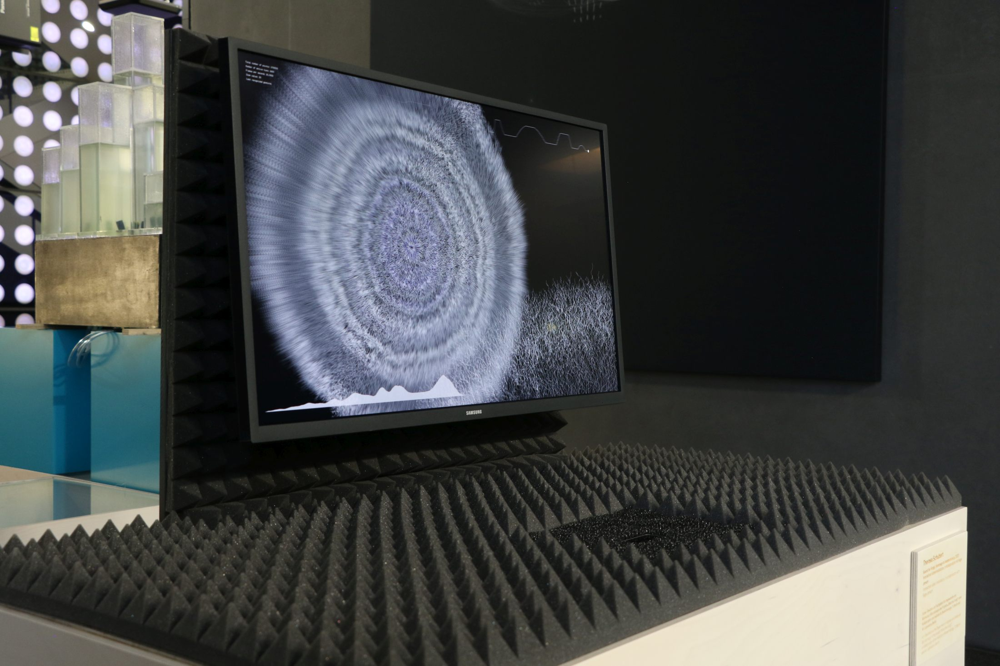

---

<div class="image-credit">Therese Schubert --- *Sound for Fungi. Homage to Indeterminacy ([link](https://www.theresaschubert.com/works/sound-for-fungi/))*</div>

---

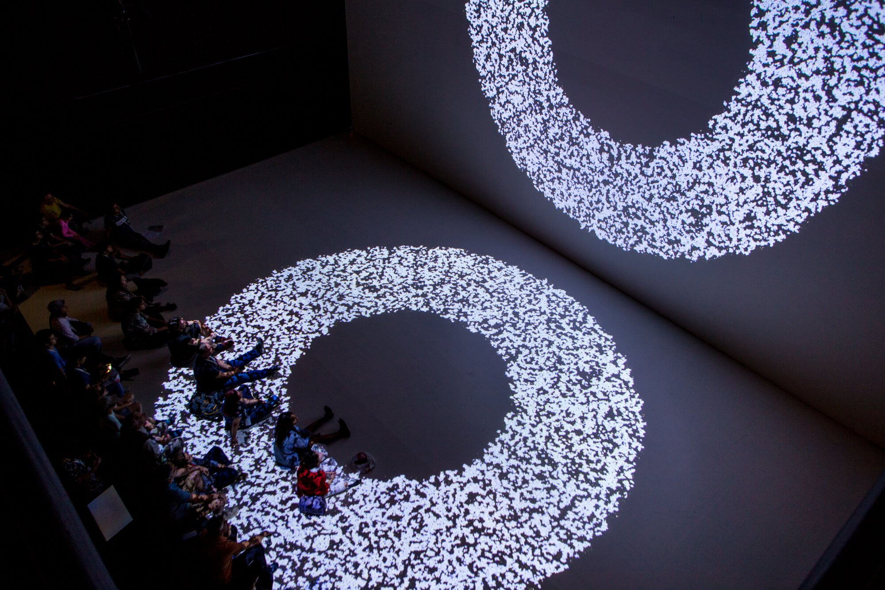

---

<div class="image-credit">Therese Schubert --- *Always Dead and Alive ([link](https://www.theresaschubert.com/works/always-dead-and-alive/))*</div>

---

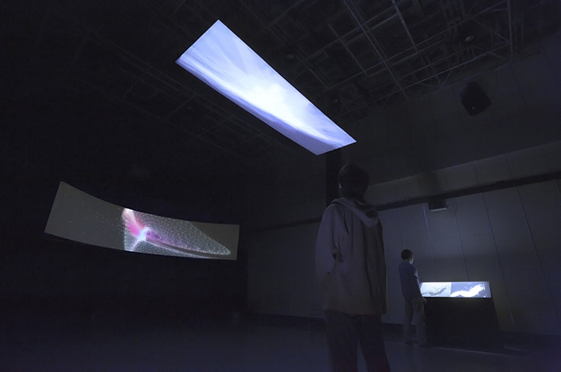

---

<div class="image-credit">Juan Manuel Castro --- *Heliotropika ([link](https://doi.org/10.1504/IJART.2014.066455))*</div>

---

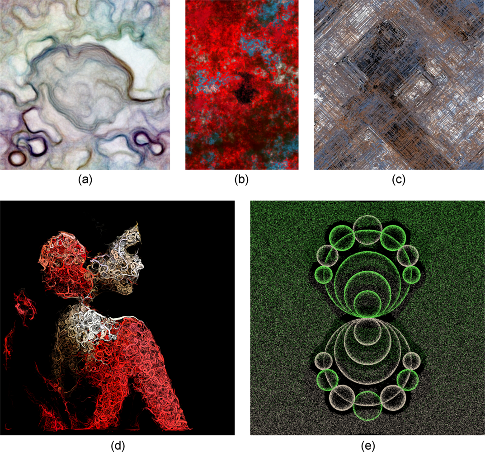

---

<div class="image-credit">author: Gary Greenfield and Penousal Machado (various artists) --- *Ant- and Ant-Colony-Inspired ALife Visual Art. Artif Life 2015; 21 (3): 293–306. [doi:10.1162/ARTL_a_00170](https://doi.org/10.1162/ARTL_a_00170)*</div>

---


## further reading/watching

[Creativity and ALife](https://direct.mit.edu/artl/article/21/3/354/2804/Creativity-and-ALife)

[Artificial Life: Art and Creativity](https://direct.mit.edu/artl/issue/21/3) (Journal Issue)

[Beyond the Creative Species: Making machines that make art and music (MIT Press, 2021)](https://x.com/olliebown/status/1685869164718936064?s=20)

[Art and Interaction Computing Bibliography](https://cpmpercussion.github.io/art-and-interaction-bibliography/)
