<!-- _class: banner -->

# COMP1720


---


## time for the finishing touches...

Major Project is **due at 28 October 2024**.

Still looking forward to seeing your discussions on the forum!

---


## creative machine learning with ml5.js

What is machine learning?

How can I use ML in p5?

How can we make art with this?

## What is Machine Learning Anyway?


Creating computer programs without explicitly programming them.


Algorithms that learn by example.


Algorithms that learn through experience.


Kind of a big deal ($$$)


Kind of problematic (!!!)


## Let's Solve a Problem

Suppose the boss wants a program where the screen colour **changes to red** when the mouse moves to certain locations.

| mouseX | red background |
|--------|-----|
| 15     | no  |
| 75     | no  |
| 173    | no  |
| 250    | yes |
| 312    | yes |
| 375    | yes |

(N.B.: the screen is 400 pixels wide)


## How would you do it?

Let's write a [**configurable algorithm!**](https://editor.p5js.org/charlesmatarles/sketches/r7ZTvg7_g)

```
if (mouseX > ??) &#123;
    background(255,0,0);
&#125; else &#123;
    background(0,0,0);
&#125;
```


one **decision** (red or black background)


one **input** (`mouseX`)


## What if we had more inputs?


Maybe we could make **more complicated** decisions?


Likely to get **more complicated** to **configure** the algorithm.

---


## Pictures as Inputs


Pictures are 2D arrays of colours! (represented as numbers)


So we had **enough** `if`s and `else`s then maybe we could make a _doggo classifier_!

---

<div class="image-credit">Ashleigh Robertson --- *pug with pink suit on grass ([Unsplash link](https://unsplash.com/photos/pug-with-pink-suit-on-grass-yqL-06P89Hg))*</div>

## Simplifying inputs

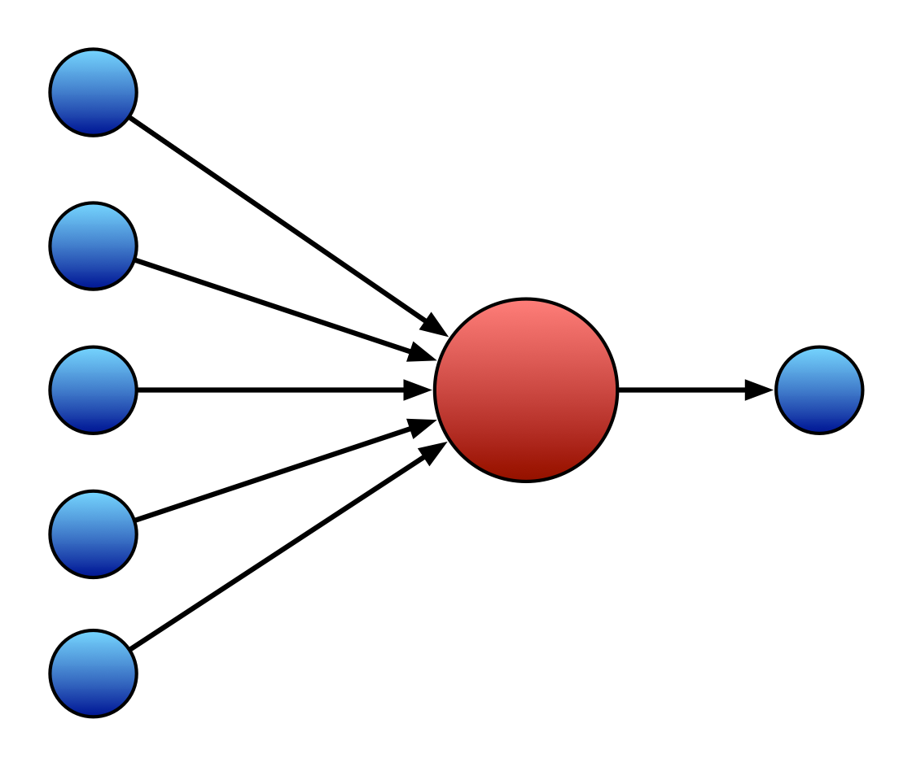

One trick we often use is to design a **configurable algorithm** which can:

- take **lots of numbers** as inputs 
- boil this all down to **just one number** as output.


The "configuration" would be "choosing how much of each input to listen to"


One example is a ["perceptron" (1958)](https://en.wikipedia.org/wiki/Perceptron)

## Fast forward 50 years.

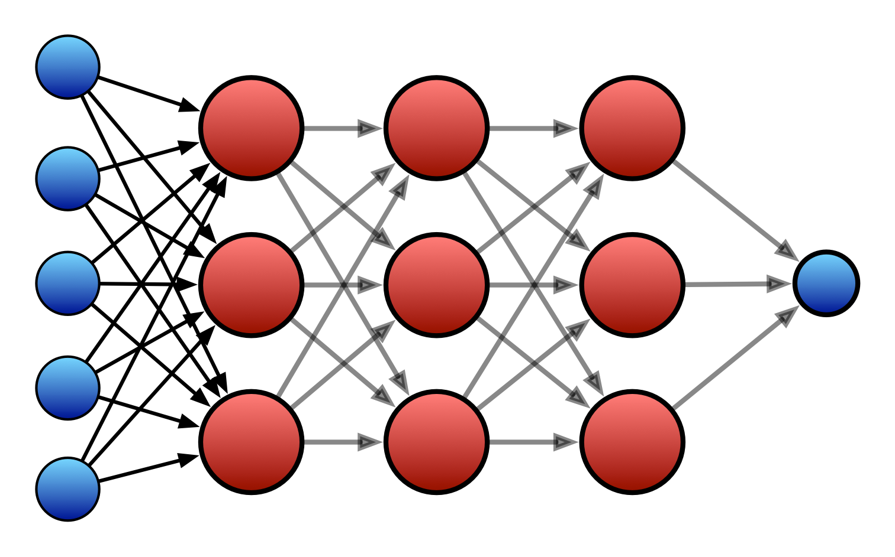

Trick 1: feed the outputs of perceptrons into **more** perceptrons in a kind of _network_

Trick 2: tricky algorithms to choose the **configuration**

Trick 3: big fast computers with **lots of data** to learn from


By the way, another name for a perceptron is an _artificial neuron_. So the above is a... _neural network_...

---


## Some terminology

**Model**: an instance of a trainable algorithm

**Pre-Trained Model**: a trainable algorithm which has... already been trained.

**Training/Optimising**: using training data to make a trained model.

**Prediction/Inference**: using a trained model to generate an output using  _unseen_ data 

**Classification**: an ML task for choosing a "class" (or description) for a  piece of data


<!-- where's the maths... -->

---

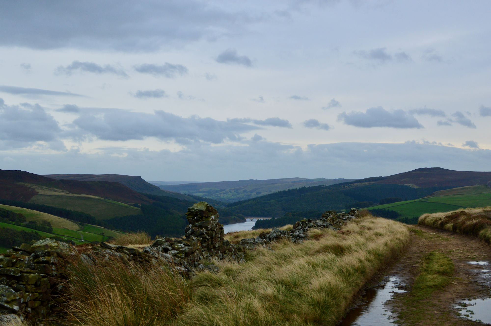

## Wait, where's all the maths?

Want to make the learning process work faster? **Great idea** to have a maths/CS major.

Want to make interesting art with the most relevant new technology of today? **Ok, you're ready to go!**


## ml5.js: Friendly Machine Learning

[ml5.js](https://ml5js.org/) is a JavaScript library that provides access to machine learning **models** in a web browser.

You can load up **pre-trained models** and start doing **prediction** right away!

Related to and inspired by `p5.js`.


## Get started

Just need to load it in our `index.html`:


```html
&lt;script src="https://unpkg.com/ml5@0.5.0/dist/ml5.min.js" type="text/javascript">&lt;/script&gt;
```

Open up a [p5 web editor sketch](https://editor.p5js.org/charlesmatarles/sketches/W9eLM5cPB) with ml5 already loaded.


## Classifying Images

[Let's classify some doggos](https://editor.p5js.org/charlesmatarles/sketches/qVr2_p4mi). We'll use a pretrained model called `MobileNet`


```
// load the classifier
classifier = ml5.imageClassifier('MobileNet');
// classify an image
classifier.classify(img, gotResult)
```
Where does the result go? Need to define a _callback_ function `gotResult(results)`.


## Classifying Video

We can access a webcam in our [sketch](https://editor.p5js.org/charlesmatarles/sketches/kWvnx9M5c):

```
video = createCapture(VIDEO);
video.size(320, 240);
video.hide();
```

And we can just ask the classifier to only make predictions from this video stream:

```
classifier = ml5.imageClassifier('MobileNet');
classifier.classifyStart(video,gotResult); // classify video stream
```

---


## What is problematic about doggos?

---


## What is MobileNet?


<span>Photo by <a href="https://unsplash.com/@alinnnaaaa?utm_source=unsplash&utm_medium=referral&utm_content=creditCopyText">Alina Grubnyak</a> on <a href="https://unsplash.com/s/photos/network?utm_source=unsplash&utm_medium=referral&utm_content=creditCopyText">Unsplash</a></span>

[What was the training data?](https://image-net.org/challenges/LSVRC/2012/browse-synsets.php)

---

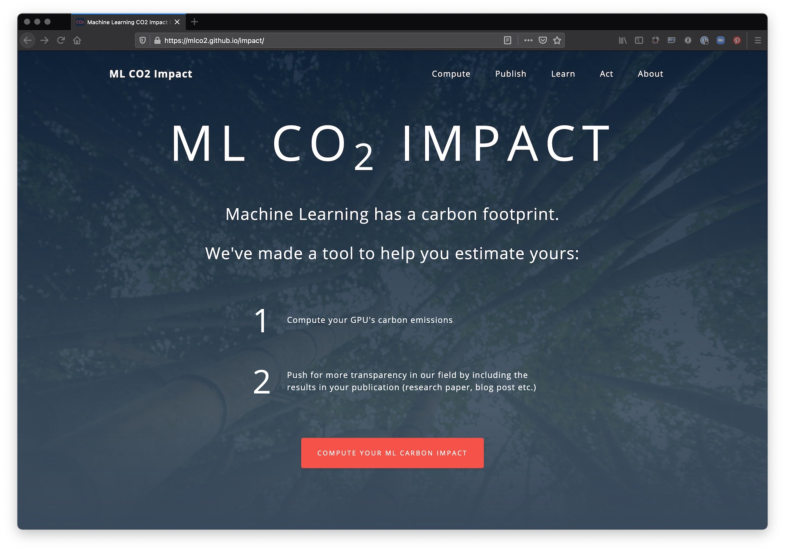

## Are there hidden costs?


[Stanford Artificial Intelligence Index Report 2023](https://arxiv.org/pdf/2310.03715)


## Artistinal Bespoke Machine Learning

Let's make _our own_ custom image classifier with [Teachable Machine](https://teachablemachine.withgoogle.com/)

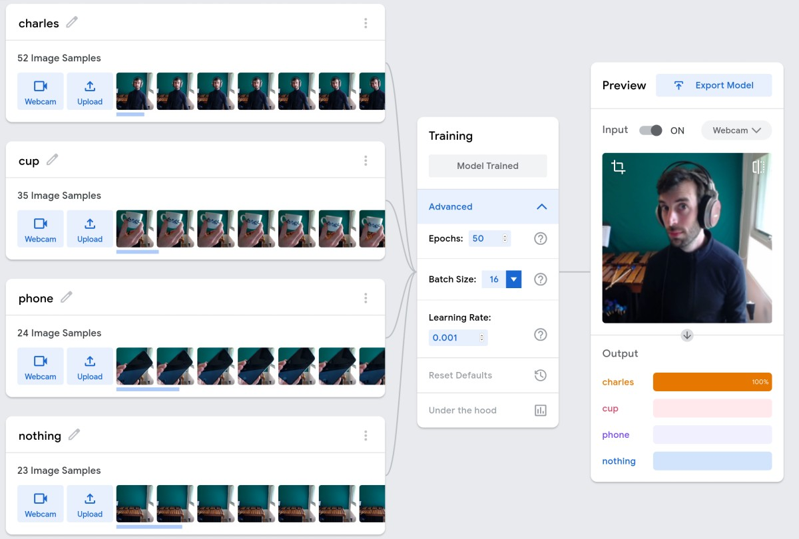

---

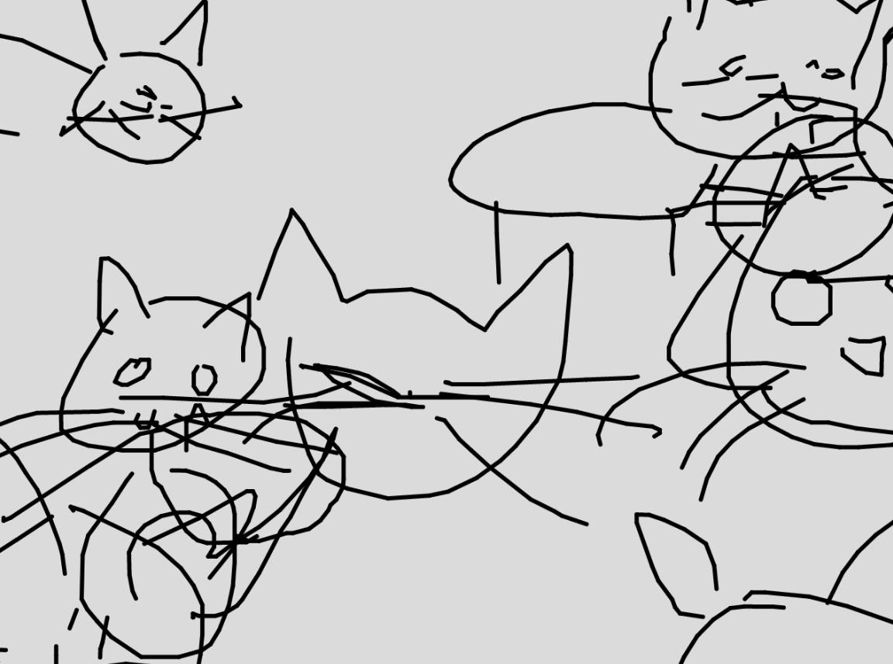

## SketchRNN

Sketch RNN is a model that generates a drawing by moving an imaginary pen around the screen.

Each "prediction" is a pen movement in `x` and `y` coordinates.

(This is a really fun model to try out).

## Using SketchRNN


```javascript
model = ml5.sketchRNN('cat'); // load the model with a "class" to draw.
```

The prediction is an object with `x`, `y`, and `pen` states (the pen can move up and down to make spaces in the drawing.

Here's an [example](https://editor.p5js.org/charlesmatarles/sketches/0J6q4leZj)

## More ml5.js models

There are _lots_ of models available! (check the [reference](https://docs.ml5js.org/#/reference/overview))

Many (e.g., posenet) are related to image classification and processing.

There are also sound recognition models.

And text generation models.

---


## Machine Learning Art

---

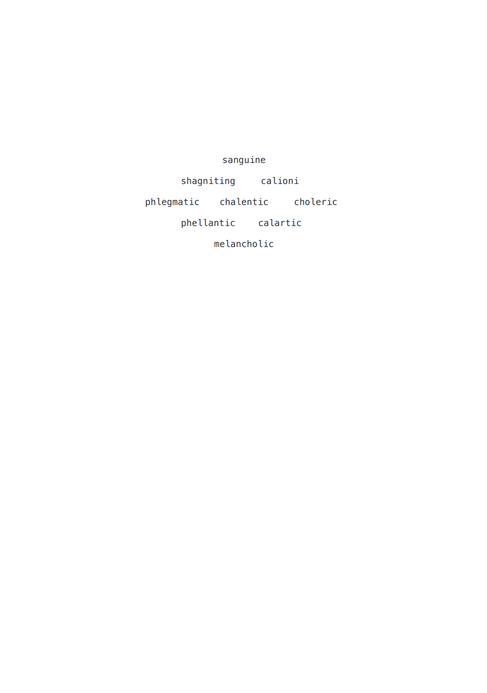

---

<div class="image-credit">Allison Parrish --- *Compasses ([link 1](https://portfolio.decontextualize.com/)) ([link 2](https://bombmagazine.org/articles/compass-poems/))*</div>

---

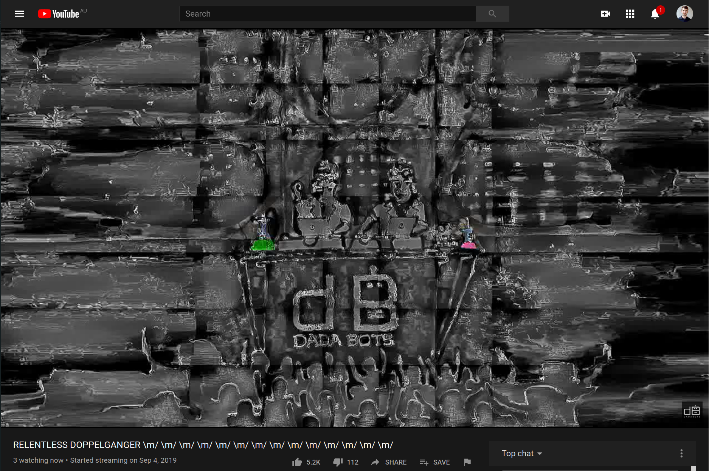

---

<div class="image-credit">Dadabots --- *Relentless Doppelganger ([paper](https://arxiv.org/abs/1811.06633)) ([youtube](https://www.youtube.com/watch?v=JF2p0Hlg_5U)*</div>

---

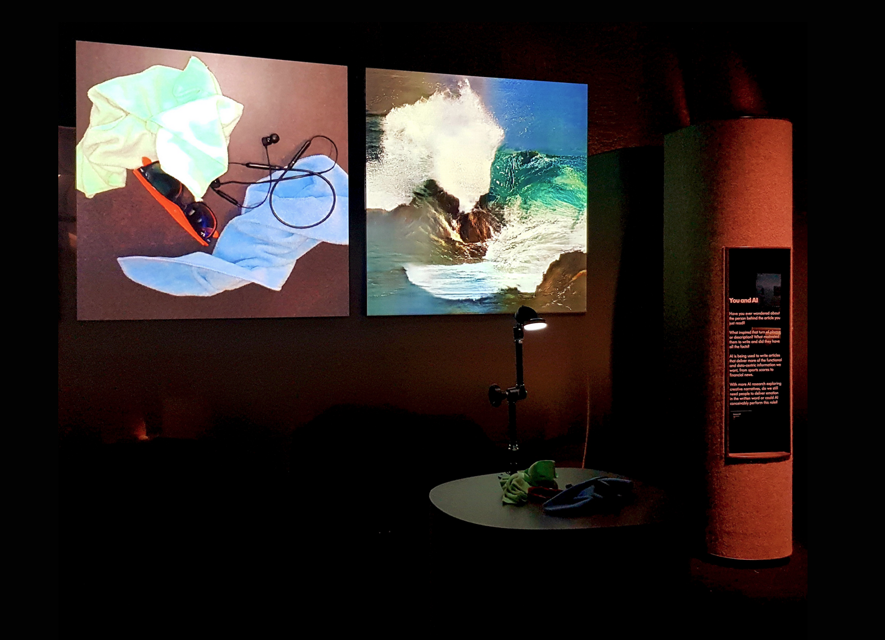

---

<div class="image-credit">Memo Atken --- *Learning to See ([link](http://www.memo.tv/works/learning-to-see/))*</div>

---

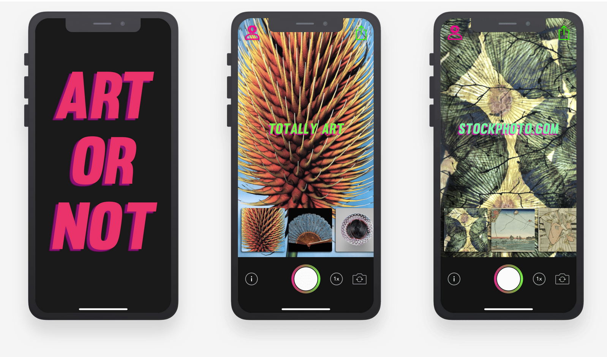

---

<div class="image-credit">Dilpreet Singh --- *Art or Not App ([link](https://dilpreet.co/projects/art-or-not))*</div>

---

<div class="image-credit">Benedikte Wallace --- *Dance Generation Neural Network ([paper](https://dl.acm.org/doi/10.1145/3450741.3465245))  ([video](https://youtu.be/jZNDd6jsPx0))*</div>

---


## further reading/watching

[Artificial Intelligence Art](https://en.wikipedia.org/wiki/Artificial_intelligence_art)

[AI Art Tools](https://aiartists.org/ai-generated-art-tools)

[AI Art Paintings of Australia](https://www.abc.net.au/news/science/2021-07-15/ai-art-tool-makes-paintings-of-australia/100288386)

[Art and Interaction Bibliography](https://cpmpercussion.github.io/art-and-interaction-bibliography/)

---

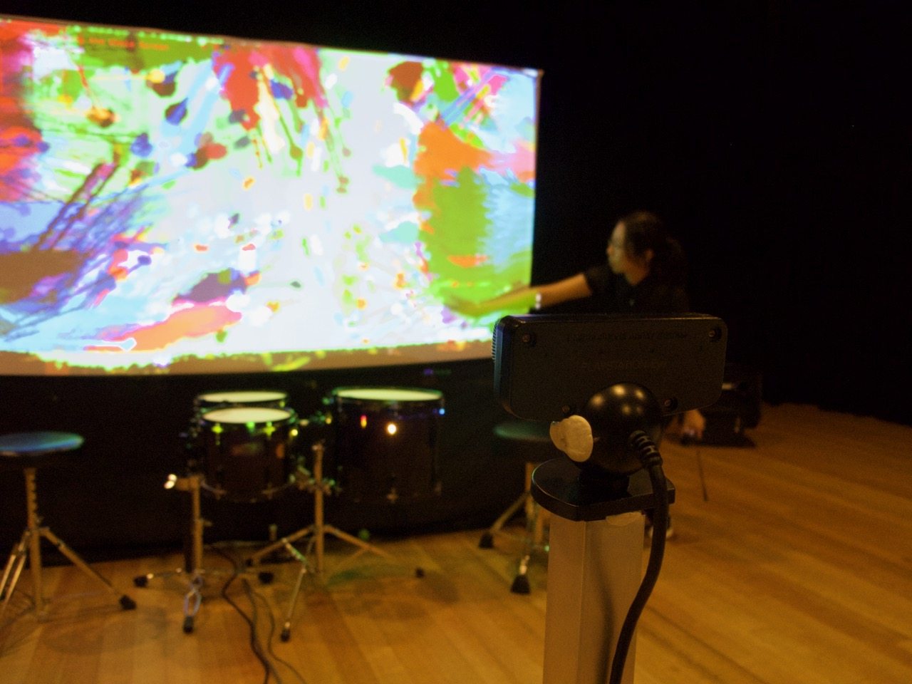

## We made it!


Thanks for coming on this journey with me!


For more creative coding, see [Sound and Music Computing](https://programsandcourses.anu.edu.au/2024/course/COMP4350)


If you're a CS student, think about a project with [Charles Martin](https://charlesmartin.au/lab/)
