:::info
If you're on a CSIT lab machine and you haven't done it already, the first thing
you should do is to run the script which [sets up the COMP2300 software
environment](/resources/02-software-setup/#installing-on-the-csit-lab-machines) on your ANU user account. It'll take
several minutes, so you might as well start it now.
:::

## Outline

In this week's lab you will:

1. get your discoboard and connect it to the computer
2. create your first program using the VSCode IDE
3. compile, run and debug your first program
4. pledge to be a person of integrity in this course

## Introduction

Welcome to the COMP2300 labs. These labs are the heart of the course, and
they're your opportunity to practice the core concepts you'll need for the
assignments. They are also your chance to explore and ask questions. If you
don't understand all of what's going on in this lab, that's ok---for two
reasons:

1. this is just the first lab (and it's in week 1, not week 2 which is the case
   for some other courses), so we'll cover all this stuff in detail in both
   lectures and future labs
2. there are **no dumb questions** in this course, so the lab sessions are the
   time to speak up

The labs for this course have a few different recurring parts, and they will be
presented using different coloured boxes:

:::info
General notes & information will be highlighted in a blue box.
:::

:::tip
Sometimes you need to **think** about stuff before you go ahead. If you see
something in a pink box (because your brain is
pink---[sortof](http://brainathlete.com/color-brain/)), that's your clue to
pause and *think*---how do you expect the next part will work? Take a moment to
think before you blaze away and start coding, because then you can check whether
you really understand what's going on or whether you're just copy-pasting stuff
without really understanding it. If you *don't* understand it perfectly, that's
ok---ask your lab neighbour (or your tutor) to help you understand.
:::

:::tip
One of the great things about uni is that you don't learn in isolation. The lab
sessions will have plenty of chances to **discuss** things with other people in your
lab group. If you see a green box, read it and then discuss the question with
your lab neighbour (someone sitting near you). In this course, as in most (all?)
others, your fellow students are your best resource. If you have a problem with
your work, or if there's something you don't understand, the first thing you
should do (after thinking about it for at least ten seconds) should be to ask
another student. They might not know the answer straight away, but even if they
don't, you might find that between the two of you you can work it out. If you
can't, then of course you can ask your tutor---but your tutor might not be able
to help you immediately. This also means that if you're helping one of your
fellow students understand something, put yourself in their shoes. It takes
courage to ask a question, especially if you feel like everyone else in the lab
knows what's going on (although that certainly isn't true). Be gentle and
helpful in your answers, and remember that you can be honest about stuff that
you don't know---you're all on this journey together.
:::

:::info
All assignment & lab submissions in this course happen through
[GitLab](). None of your lab work contributes to your final
grade, however you are expected to push your lab work up to the server at
various stages during your lab so that the tutors can see your progress and give
you feedback. When it's time to **push** something, it'll be clearly marked in
an orange-coloured box. Don't just read past this box to the next section, where
the "answer" might be discussed---make sure you attempt to complete the exercise
yourself.
:::

:::tip
Computer organisation and program execution (hey, that's the name of this
course!) are *huge* topics, and mastering them takes a lifetime. So the material
in these lab sessions will only cover the fundamentals. However, sometimes there
are interesting **extension** exercises you might try if you want to go deeper,
and these will be in a purple box. If you don't know how to approach the
problems in the purple boxes, that's ok too---you'll do just fine in the course
if you can do all the rest of the stuff in the labs. Still, it's a chance to ask
your lab mates and tutors and stretch yourself if you have time.
:::

These coloured boxes will be used consistently through the lab material, so take
a moment to familiarise yourself with what the different colours *mean*, or at
least remember that you can come back here and check at any time.

## Exercise 0: setting up the COMP2300 software environment

Setting things up deserves [it's own page](/resources/02-software-setup/). Go have a look, see you back here when
you're done :)

## Exercise 1: getting your discoboard {#getting-your-discoboard}

During this lab, the tutors will come around and give you a discoboard and USB
cable of your very own---this is **yours to keep forever**. How exciting! The
only caveat is that if you unenroll from the course **before** the census date
(March 31) you have to give it back.

When you get your board, the tutor will also take note of the serial number
(down the bottom on the "back" side of the board).

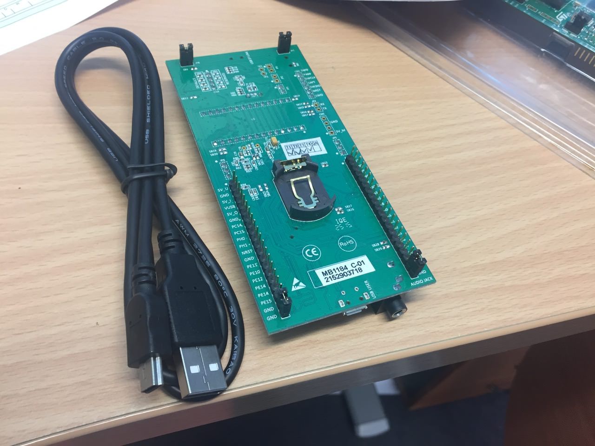

:::tip
Handing all the boards out might take a bit of time, though, so thanks for your
patience. While you're waiting, push your chair away from the desk, turn, and
say hello to the person next to you. Introduce yourself. Find out what degree
they're taking, and why they're taking this course---is it a prerequisite or an
elective? If you're feeling extra-personable, ask what they like to do in their
spare time. (If they're already your friend, find someone else who you don't
know and talk to them instead.)
:::

## Exercise 2: connecting the board to the computer {#connecting-the-board}

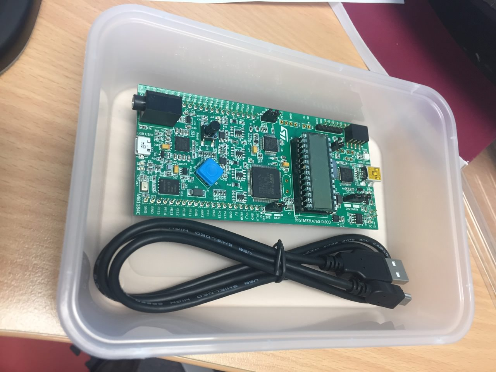

The discoboard connects to the lab computer (or your personal laptop) via
a [mini-USB](https://en.wikipedia.org/wiki/USB#Mini_and_micro_connectors) cable.

As far as electronics go, this board isn't *super* fragile, but you'll still
need to be careful with it when you're handling it and carting it around. That's
why you got it in a plastic container---keep it and your cable together in
there. If you're not used to handling electronics, here are a few tips:

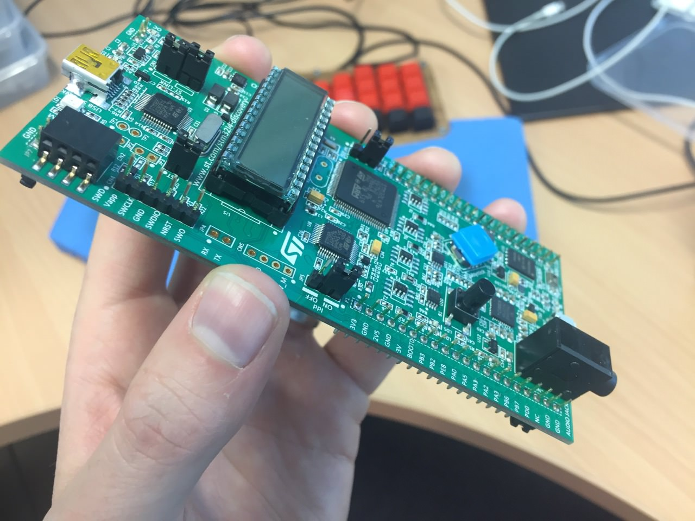

- handle it by the edges (as in the photo)
- don't touch any of the pins or little microchips on the board
- keep the plastic case to carry the board around
- be careful of static electricity---if you're the sort of person who regularly
  shocks themselves, then you need to ground yourself before touching the board
- the USB cable you received will only fit in **one** end of the board (even
  though there's a different USB connector on the other end) so if it's not
  going in, try the other end---don't try to force it!

Once you've received your new discoboard, plug it in to the lab computer---the
full-size USB end goes into the lab computer, and the mini end of the USB cable
goes into the connector on the discoboard (up the "top" end, closer to the LCD
screen).

## Exercise 3: your first discoboard program

:::tip
With your lab neighbour, open up the main [VSCode documentation
website](https://code.visualstudio.com/docs/editor/extension-gallery). Discuss
with them: what makes a good documentation website?
:::

Now that you've connected your board to the computer it's time to turn
everything on and see if it works. This exercise is a bit longer, so it's broken
down into stages: clone, edit, build & run.

### Fork & clone

In this course, you'll be using git a lot, and you'll have a lot of git
repositories (*repos* for short). Don't fear: [you've done this
before](/resources/01-faq/#am-i-expected-to-know-how-to-use-git) (in COMP1100, one of the pre-requisites
for this course) and it's the same process here. Since we're at the start of the
course, here's a tip: it's probably a good idea to make a `comp2300` (or
`comp6300`) directory somewhere on your computer where you can keep *all* of
your stuff for this course.

Ok, now here goes:

1. fork the [lab 1 template]() to your user account (i.e. `uXXXXXXX`)
2. clone it to your local machine

You can do the "git clone" step in the terminal, or your favourite git client,
it doesn't matter. If you like, you can use VSCode's built-in git support:
here's a link to the [general docs on this
view](https://code.visualstudio.com/docs/editor/versioncontrol#_cloning-a-repository),
and here's the [specific instructions on how to clone a
repo](https://code.visualstudio.com/docs/editor/versioncontrol#_cloning-a-repository).

:::info
Remember, this is all stuff you learned in COMP1100. We'll make sure we help you
out if you're a bit rusty, but make sure you can fork, clone and (at the end)
push to GitLab---[you won't be able to submit the assessment items any other
way](/resources/01-faq/#can-i-submit-my-assignments-some-other-way).
:::

After you've cloned, open the top-level folder in VSCode. If you used the
integrated VSCode git clone command, this will happen automatically. If you
cloned the repo some other way, you'll need to open the folder yourself with
`File: Open...` in the command palette. Once you've done that you should see
something like this:

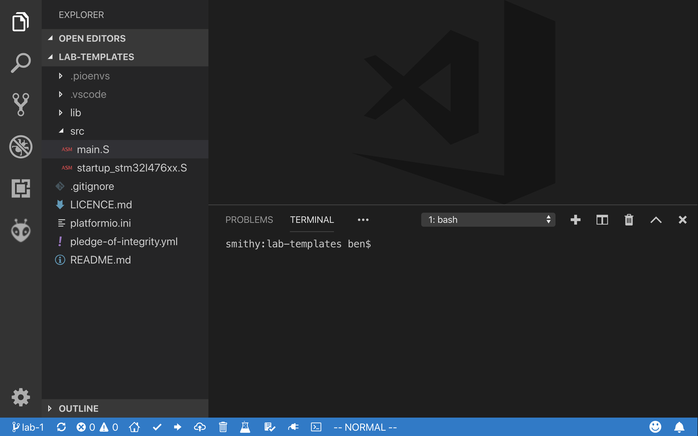

Again, the VSCode docs have a [good explanation of the user
interface](https://code.visualstudio.com/docs/getstarted/userinterface#_command-palette).

<div class="warn-box" markdown="1" style="margin-bottom: 20px;">

We're using a special COMP2300 version of the PlatformIO IDE VSCode extension.
You don't have to download it separately, it's downloaded automatically when you
download the COMP2300 Extension Pack (as per the [software setup
instructions](/resources/02-software-setup/)).

You **do not** want to install the official one (extension ID:
`platformio.platformio-ide`). This will confuse VSCode a bit---it will give you
a popup saying "This workspace has extension recommendations", but you should
ignore it (and tell VSCode to not show it again) as per this screenshot:

{% asset labs/lab-1/vscode-recommended-extensions-popup.png alt="VSCode recommended extensions popup" style="width:100%;" %}

If you do ever accidentally download the real PlatformIO IDE extension, then you
should just uninstall it.

</div>

Now, in the **Explorer** view, open the `src/main.S` file, you should see
something like this:

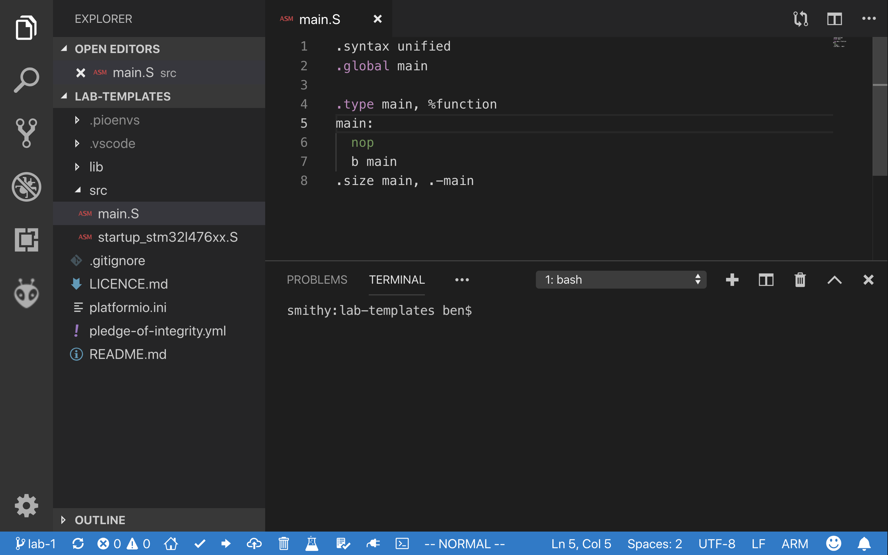

:::tip
Even if you've never seen any assembly language before, what do you think this
program does?
:::

### Edit

Add some code so that `main.S` looks like this:

```ARM
.syntax unified
.global main
.type main, %function

main:
  mov r1, 0

loop:
  add r1, 1
  b loop
```

Save the file when you're done. Don't worry if you don't understand all the
details at this stage---the goal for this week's lab is just to plug things in,
turn them on, and make sure that everything's working. If you have any problems,
let your tutor know now.

### Build

You can build (or compile---they mean the same thing in this context) your
program using the **Build** command (`PlatformIO: Build` in the [command
palette](https://code.visualstudio.com/docs/getstarted/userinterface#_command-palette)).
You'll see some stuff printed to the
[terminal](https://code.visualstudio.com/docs/editor/integrated-terminal) (near
the bottom of your VSCode window), and when it's done it should look *something*
like this:

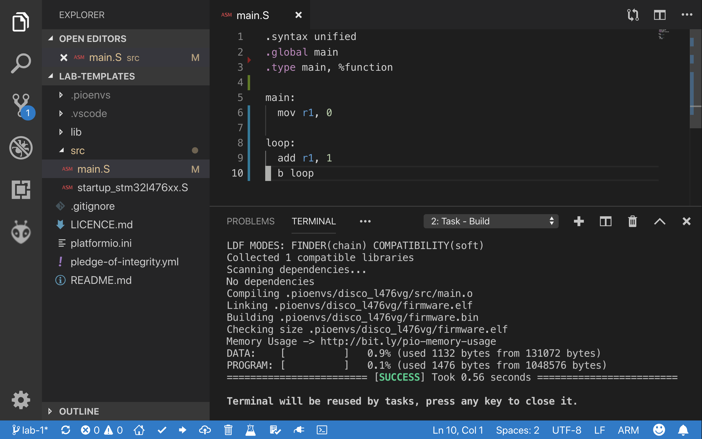

:::tip
The compilation process takes all the code (text files), **translates** them
into binary instructions for the target *Instruction Set Architecture* (ISA)---
ARMv7 in this case---and **links** them together into a binary file (*image*).
You can learn more about it
[here](https://www.programcreek.com/2011/02/how-compiler-works/) if you want to
read ahead, but you'll also get familiar with it throughout this course.
:::

### Upload

You've built the program **on your laptop/desktop**. To run it **on your
discoboard** you need to upload it with the **Upload** (`PlatformIO: Upload`)
command. Again, afterward it should look something like this:

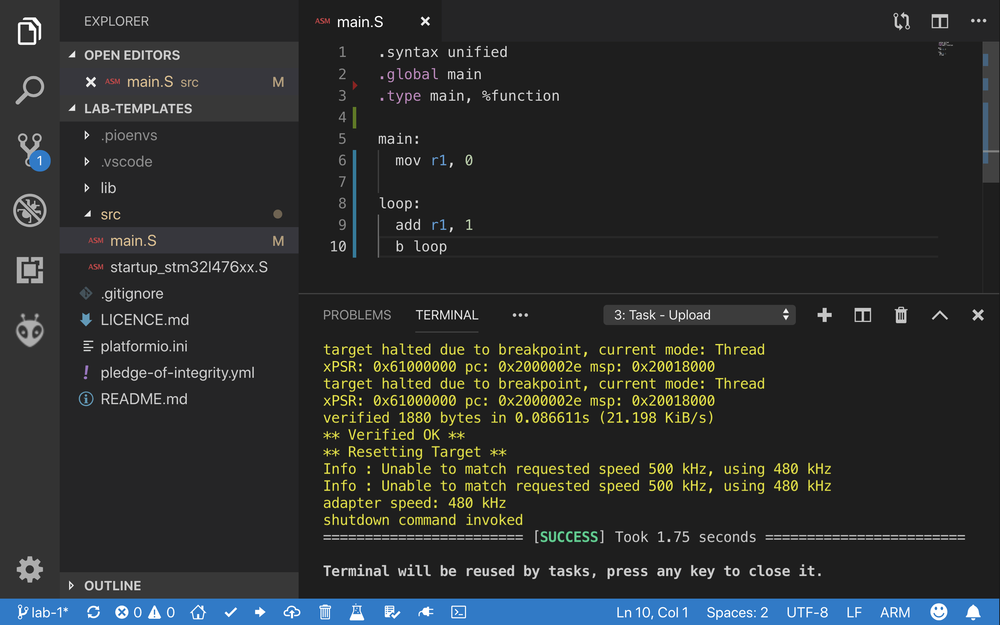

If you get errors at this point, then they'll be printed (probably in red) in
the terminal. Try and figure out what's going wrong yourself, also checkout the
[troubleshoot section in software setup](/resources/02-software-setup/#troubleshooting)

### Run & Debug

After uploading your program to the discoboard, it should already start running it.

To **debug** the program (stepping it through, inspecting the CPU & memory
states), we'll use VSCode's built-in **debugger**---an invaluable tool for
making things work right when we're writing programs for the discoboard. You may
have used a debugger like this before, or you may not have---that's ok! We'll
lead you through the basics in the labs over the next couple of weeks.

Open up the [**Debug** view](https://code.visualstudio.com/docs/editor/debugging)
and make sure the
*ARM On-Chip Debug* configuration is selected in the drop-down menu (if you
select a different config, e.g. the PlatformIO config, then it won't work):

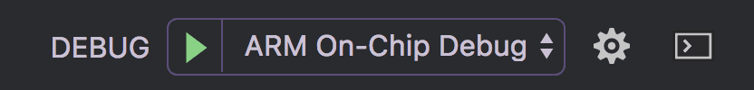

Click the green play button to run your program, pausing ("breaking") on entry.

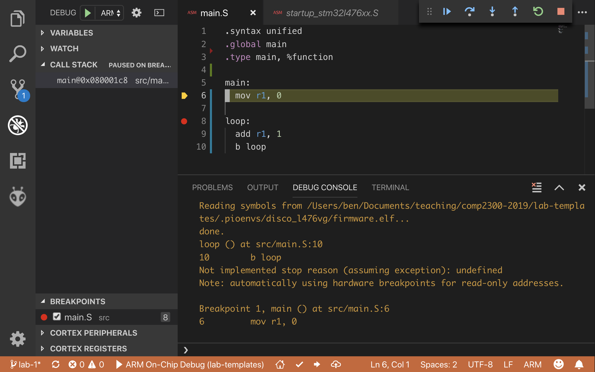

The highlighted yellow line of assembly code (shown in the above screenshot)
represents where the program is "up" to (next instruction to execute).
When you first start it running, the
IDE creates a [**breakpoint**](https://en.wikipedia.org/wiki/Breakpoint) at the
`main:` label in your program, so when your program reaches that line of code it
stops and waits for further instructions (from you!).

At this point, you can **step** through the code one instruction at a time using the
debug controls:

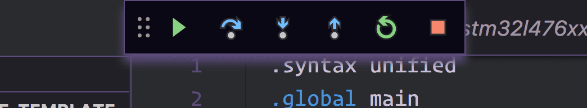

:::tip
Discuss with your lab neighbour---what do all these debug control buttons do?
Play around with them together---can you see what effect they're having on the
program executing on your discoboard? Are you *pumped*?
:::

If you want your program to keep running (i.e. to "unpause" the program) just
hit the green play button (although it's called *continue* rather than *play*
when you're debugging, because it continues after you last paused the
execution). Once it's running, you can pause it again by hitting the pause
button, and even stop it with the red stop button.

Once it's stopped, you can restart the whole process again in a new debugging
session by going back to the start of these instructions.

:::info
Sometimes the debuggers are a bit flaky, and get into some problems.
You'll get the hang of recognising when things have gone wrong & how to fix them,
so don't be too frustrated if things don't work right.
Remember that it's ok to use the stop or restart
buttons to try and get things back on track, or (worst-comes-to-worst) unplug
and re-plug your discoboard.
:::

You can also examine the values of your registers in the **CORTEX REGISTERS**
viewlet under the Debug View (see the bottom left corner in the below
screenshot):

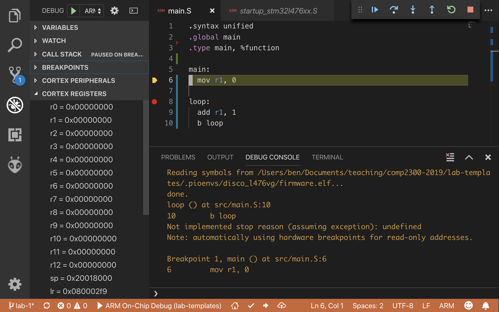

If you want to control exactly *where* the system pauses for debugging, you can
set a new breakpoint by clicking in the left-hand "gutter" (or margin) of
the code view in the IDE. You should see a little red dot appear:

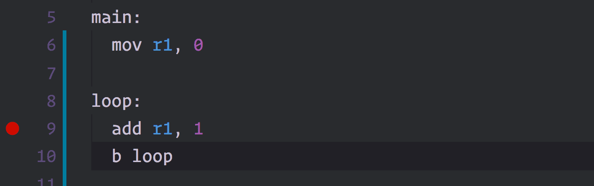

:::tip
The program isn't running on the lab computer on the desktop---it's running on
your discoboard. What does that *mean*? What are the implications for the way
you run & debug your program?
:::

:::info
Make sure you understand what's going on!
Of course this is the goal of this course, and you will get to learn more as you go.
But just a warning before you embark on this journey:
make sure you don't get tripped up at the final over some of these fundamental concepts,
like *many* journey men before you did.
Remember that your tutor is there for you to grill them with questions. ;)
:::

## Exercise 4: sign the pledge, submit your work {#submit-your-program}

Today's lab submission isn't an assembly program, it's a pledge of integrity.
This is a short yaml document (what's [yaml](/resources/01-faq/#yaml)?) stating that you understand and **are committed
to** conducting yourself with integrity in this course.

Find the `pledge-of-integrity.yml` file in the top-level of your workspace
folder. Read it, understand it, "sign" it by adding your uni ID & name in the
appropriate places. If you need some help with the YAML syntax, have a look in
the FAQ, especially at the common ["gotchas"](/resources/01-faq/#what-are-some-common-yaml-gotchas)

Why is this necessary? Well, marking assignments & labs & providing good
feedback is really time consuming. We (the course convenor & the tutors) are absolutely
committed to doing it in this course, because we're here to help you learn.
However, it wastes your time & ours (and [much worse](/resources/01-faq/#academic-integrity)) if we have to deal with academic
misconduct issues. By "signing" & committing this pledge, you're promising that
you won't engage in that conduct. So you won't receive any marks or feedback in
this course until you've done it.

As mentioned at the top of this lab content, in this course you will submit
stuff (including work-in-progress versions) during your weekly lab session. This
is a chance for you to keep track of your progress, and also (sometimes) for the
tutors to give you feedback about how you're going. This is all a good
thing---if you've got questions you want to get help *now*, not after you've
bombed on the mid-semester exam.

The submission process is also the same as the one you'll use to submit your
assignments in this course.

:::info
Commit your (updated) versions of `main.S` & `pledge-of-integrity.yml` to your
repo and push them up to your fork on the GitLab server. Give it a helpful
commit message like "finished lab 1 exercise 3" or something so that when you're
looking through the git log view later you know where you were up to.
:::

### CI

In GitLab, there is a feature called Continuous Integration (CI).
It's basically a set of jobs (builds & tests) to run everytime you push something to your repo,
to make sure that your commit doesn't break the build or cause regression.

In COMP2300 we use CI to do some basic testing to help you make sure that your code
builds fine, and you have satisfied some basic requirement for the lab/assignment.

You can see the CI pipelines and build jobs at the "CI / CD" sidebar in your GitLab repo.
After clicking on it, you will see a page like this:

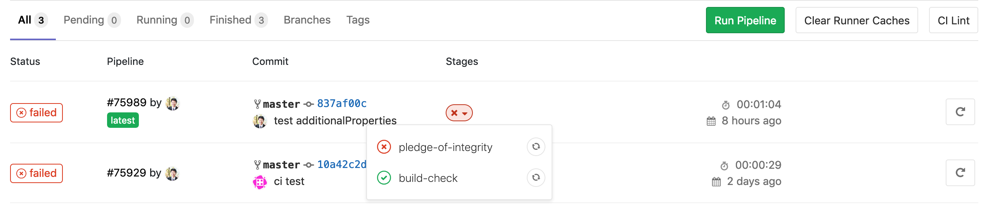

You can see the jobs run by clicking on the *Stages* dropdown button, and whether they are successful of not.
You can click on the job to see the details and captured output, which will help to figure out what might have gone wrong.

In lab 1, apart from checking whether your code **builds** fine, it also checks whether your `pledge-of-integrity.yml` is acceptable.
You need to make sure that everything is passed before you finish this lab.

:::info
CI will also be used to make some basic checks for the assignment.
For more information on how we use CI for assignment,
see [FAQ](/resources/01-faq/#gitlab-ci).
:::

## Summary

Congratulations! In this lab you

1. plugged in your board
2. opened up the IDE
3. built, uploaded, ran & debugged a basic program on your board
4. pledged to be a person of integrity in this course

Next week, you'll start thinking about what the assembly code you wrote does,
and what it actually *looks like* in the memory of your discoboard.

:::info
Make sure you logout to terminate your session, and pack up your board and USB
cable carefully.
:::

:::tip
There's no specific extension content this week. Having said that, the board is
now yours, so you can program it however you like---especially since you can
[install the IDE on your own laptop/desktop](/resources/02-software-setup/).
:::
