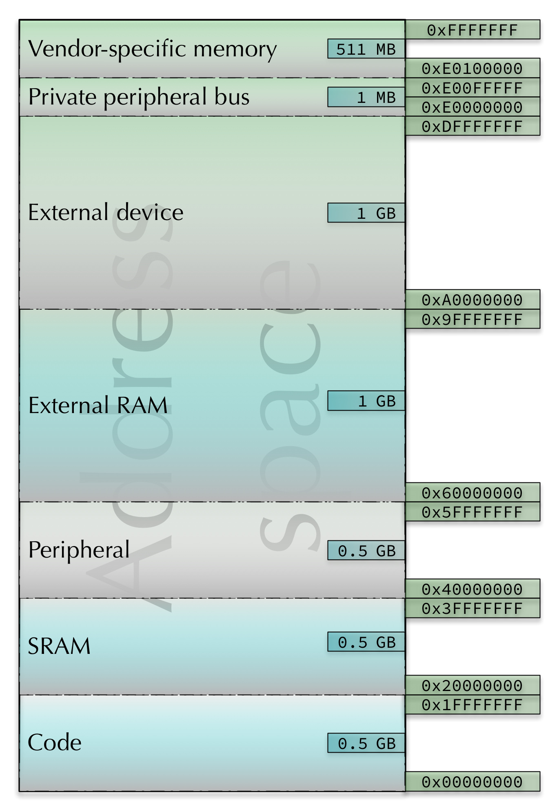
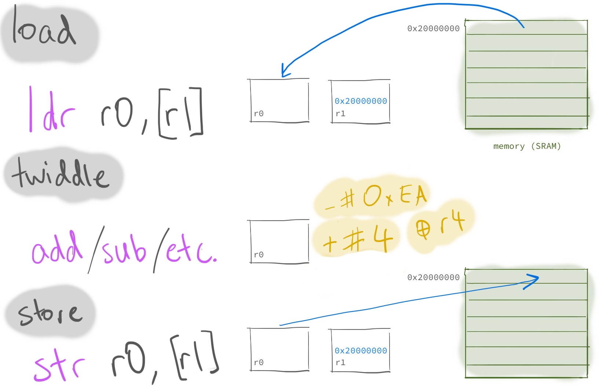
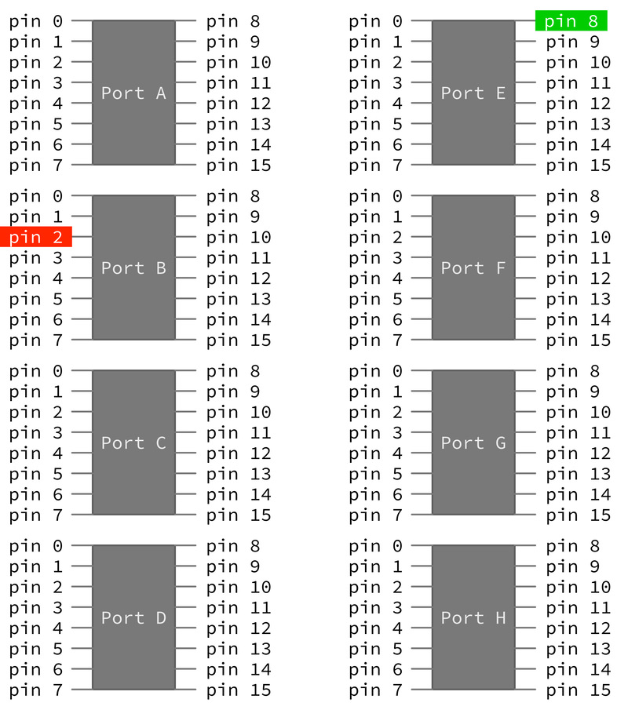
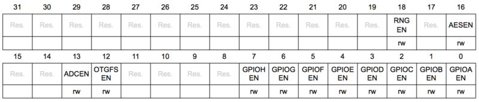
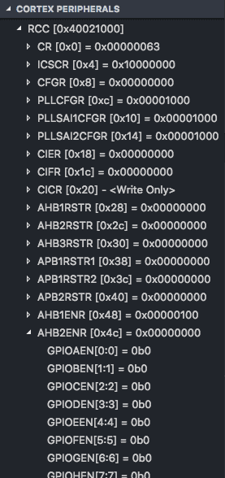
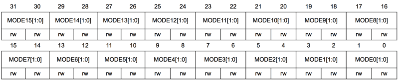
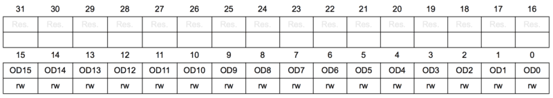

:::info
This lab looks long, and it is _fairly_ long. The reason there's so much detail
here is to explain what's going on when you complete these exercises and _why_.
You also get to start putting together the skills you've learned so
far---arithmetic, loads & stores, and setting/clearing individual bits in
registers. Because of this, you'll get to work on this stuff in both **week 5
and week 6** (i.e. it's a "2 week" lab). If you still don't get time in your lab
sessions to make it to the end of the lab content, make sure you finish it
later---this stuff is all really important.
:::

## Outline

Before you attend this week's lab, make sure:

1. you can read and write basic assembly code: programs with registers,
   instructions, labels and branching

2. you have read the laboratory text below

In this week's lab you will:

1. learn how to load and store with `ldr` and `str`

2. blink the LEDs by reading & writing special hardware registers

3. use **functions** to structure your code and remove duplication

Here's a table of contents for this week's lab, just in case you need to jump
around.

## Introduction

In this week's lab you'll read and write some of the special hardware registers
on your discoboard to see
[LED](https://en.wikipedia.org/wiki/Light-emitting_diode) "output" from your
program. Seeing stuff happen in the real world is a big part of the fun of
microcontrollers, so this is going to be fun.

You'll also start to see more clearly the connections between what we've been
covering in this course and the higher-level programming languages you're used
to, with their `if` statements, `for` loops, and other niceties. This process of
"demystifying" programming is a big part of what this course is about, so take
the time to reflect on what you're doing and how it fits in with what you know
and do in other programming situations.

## Exercise 0: warm-up

Plug in your discoboard, fork & clone the [lab 5
template]() to your machine, and open the `src/main.S`
file as usual. As discussed in the extension box at the end of the [previous
lab](/labs/03-maths-to-machine-code/#new-template-info-box) this template contains a bit of extra startup code (in
`src/startup_stm32l476xx.S`) for initialising any data which you've put in the
`.data` section.

:::info
The stuff in Exercise 0 is all stuff we've covered already (in some cases as far
back as week 2) but it's sometimes good to have a warm-up/refresher. Feel free
to jump straight to [Exercise 1](#load-twiddle-store) if you're feeling
adventurous, but there's no shame in taking your time and working through the
warm-up stuff---practice makes perfect!
:::

### Bit-shifting & logic ops

You will need to use some logic operations in this lab, in particular, setting
(set `1`) and clearing (set `0`) bits. This warm up exercise gives you a chance
to practice bit shifting and using logic operations to set and clear bits.

Edit your `main.S` file so that it looks like this:

```ARM
main:
  ldr r0, =0xcafe0000
  ldr r1, =0xffff

  @ your code goes here

@ when it's all done, spin in an infinite loop
loop:
  nop
  b loop
```

<div class="push-box" markdown="1">

Using _only_ the instructions in the **Logic** and **Shift/Rotate** subsections
of the cheat sheet (but as many registers as you need) write a program which
puts _all_ of the following values into the listed registers. Use the cheat
sheet and the converter widget to help you out---draw "bit pattern" pictures on
a piece of paper if it helps.

1. `0xcafeffff` into `r3`
2. `0xcafe` into `r4`
3. `0xcaff0000` into `r5`
4. `0xc0fe0000` into `r6`

</div>

These shouldn't require heaps of code---just a couple of instructions for each.
Remember the [stuff you've](/labs/02-first-machine-code/) [done in](/labs/03-maths-to-machine-code/) previous labs.

:::tip
Did you need _both_ of the "starting" values (e.g. `0xcafe0000` and `0xffff`) or
could you have got the job done with only some of them? Which ones are
essential?
:::

### Labels and loading arbitrary numbers into registers

[Labels](/_lectures/03-memory-operations/#labels-and-branching) are the symbols in your source code followed by a colon
(`:`), e.g. `main:`. You've probably already got an intuitive feel for how they
work: you put them in your code wherever you like, and when you want to branch
to that part of the program you put the label in as the "destination" part of
the branch instruction. Here's an example:

```ARM
loop:
  @ do stuff

  b loop @ branch back to the "loop" label
```

In the [week 3 lab](/labs/03-maths-to-machine-code/) you even used conditional branches to only branch under certain conditions
(i.e. if certain flags were set). And we covered this in the [week 4
lectures](/_lectures/04-control-flow/#conditionals)
as well---including how to turn "mathematical" conditional expressions
(e.g. `x >= -45`) into sequences of assembly instructions.

But what are labels, really? Add this code to your program (under the `main`
label):

```ARM
ldr r0, =main
```

After you step through this line, what's in `r0`? You might be wondering what
the `=` sign is doing in your program. Remember from your week 2 lab that
instructions are stored in memory with various encodings (some are 16-bit, some
are 32-bit) and that when you use an _immediate value_ constant (e.g. `42`) in
an instruction which supports it then the twos-compliment bit pattern for `42`
(which is `0b101010`) is stored _inside_ that instruction.

This means that if you need to include a constant which is 32 bits long (e.g.
`0xFFFFFFFF`) then you can't fit it in the instruction. You may have run into
this problem already---the error message will be something like

```text
Error: invalid constant (0xFFFFFFFF) after fixup
```

and what it means is that the constant value you're using is too big (too many
bits) for the instruction you're trying to fit it inside.

:::tip
If you're interested in exactly the ARM instruction set deals with this problem,
and which constants _can_ be stored inside a 32-bit instruction, then
[here's](https://alisdair.mcdiarmid.org/arm-immediate-value-encoding/) an
interesting blog post.
:::

Because this is a bit of a pain, the assembler provides a special syntax for
storing larger values in registers. It's based around the `ldr` (load register)
instruction, and if you prefix the constant with an `=` sign then the assembler
will generate the code to load the full value into the register, as
we discussed in the [week 4 lectures](/_lectures/04-control-flow/#ldr-pseudo-instruction).

<div class="extension-box" markdown="1">

Have a look at these two lines of assembly code:

```ARM
mov r0, 0xFFF
ldr r0, =0xFFF
```

will they result in the same assembly instructions when uploaded & running on
your discoboard? How might you check? _Hint:_ the disassembler is your friend
😊, and remember when we talked about [pseudo-instructions](/_lectures/04-control-flow/#ldr-pseudo-instruction) in lectures.

Can you think of any _other_ lines of assembly code (apart from the two above)
which will be assembled into the same machine instruction(s)?

</div>

So how does this relate to the `ldr r0, =main` instruction above? Well, the
answer is that the labels in your program are just values---they're the
addresses (in your board's memory space) of the instruction which occurs after
them in the program. After the linker figures out exactly which address each
label points to, it "replaces" them in the program, so that

```ARM
ldr r0, =main
```

becomes _something like_

```ARM
ldr r0, =0x80001c8
```

or whatever address the `main` label ends up pointing to (which will change
every time your program changes).

And since `0x80001c4` (or whatever it is) is just a bit pattern in a register,
you can do the usual arithmetic/logic stuff you can do with any values in
registers:

:::info
Write a small program which calculates the size (in memory) of the `movs r3, 1`
instruction and stores the result in `r0`.
:::

### Sections

[Sections](/_lectures/04-control-flow/#sections-in-an-assembly-code-file) your program are _directives_ (so they
start with a `.`) to the assembler that the different parts of our program
should go in different parts of the discoboard's memory space. Some parts of
this address space are for instructions which the discoboard will execute, but
other parts contain _data_ that your program can use.

Your program can have as many sections as you like (with whatever names you
like) but there are a couple of sections which the IDE & toolchain will do
useful things with by default:

- if you use a `.text` section in your program, then anything after that (until
  the next section) will appear as program code for your discoboard to execute

- if you use a `.data` section, then anything after that (until the next
  section) will be put in RAM as memory that your program can use to read/write
  data your program needs to do useful things

When you create a new `main.s` file, any instructions you put are put in the
`.text` section until the the assembler sees a new section directive.

Here's an example:

```ARM
main:
  ldr r0, =main
  ldr r1, =storage

.data
storage:
  .word 2, 3, 0, 0
  .asciz "Computer Organisation & Program Execution"
```

:::tip
Looking at the discoboard's address space map and running the program above,
where do you think the `main` and `storage` parts of your program are ending up?
Can you find the string "Computer Organisation & Program Execution" in memory?
Try and find it in the [memory view](/labs/02-first-machine-code/#reverse-engineering).
:::



You can interleave the sections in your program if it makes sense:

```ARM
.text
program:
  @ ...

.data
storage:
  @ ...

.text
more_program:
  @ ...

.data
more_storage:
  @ ...
```

When you hit build (or debug, which triggers a build) the toolchain will figure
out how to put all the various bits in the right places, and you can use the
labels as values in your program to make sure you're reading and writing to the
right locations.

:::tip
If you're interested in seeing how it's done, you can look at your project's
linker script, located at
:::

```text
lib/bare_stm32l476/ldscripts/STM32L476VG_FLASH.ld
```

## Exercise 1: the load-twiddle-store pattern {#load-twiddle-store}

The **load-twiddle-store** pattern is a fundamental pattern in making your
discoboard do useful work. The basic idea is this:

1. load some data from memory into a register
2. operate on ("twiddle") the value in the register (e.g. with an `add` or `and`
   instruction)
3. store this new value from the register back into memory



```ARM
main:
  ldr r1, =storage
  @ your code starts here

.data
storage:
  .word 2, 3, 0, 0 @ don't change this line
```

:::info
Starting with the code above, use the **load-twiddle-store** pattern to change
the first four data words to `2` `3` `0` `1` instead of `2` `3` `0` `0`. Hint:
first load the `storage` label using the `=` instruction, then remember that you
can [load and store with an offset](/_lectures/04-control-flow/#load-and-store-with-offset) from this base
address (check the cheat sheet). You'll probably also want to use the memory
browser view (like you did [in week 2](/labs/02-first-machine-code/#reverse-engineering)) to watch the values
change in memory.
:::

## Exercise 2: hello, LED! {#exercise-2}

So what does all that stuff have to do with blinking the LEDs? Well, the answer
is that there's a section of the discoboard's [address space](/_lectures/03-memory-operations/#memory-address-space) (`0x40000000` to
`0x5FFFFFFF`) which is mapped to peripherals (as shown in the picture above). To
interact with the LEDs, LCD, microphone etc. on the board you need to talk to
the hardware by reading and writing to special memory locations in this memory
range. To figure out exactly which addresses are mapped to which peripherals,
you need to look at the discoboard [reference
manual](/assets/manuals/stm32-L476G-discovery-reference-manual.pdf).

One type of peripheral is a [General Purpose
Input/Output](https://en.wikipedia.org/wiki/General-purpose_input/output) pin.
You can see them on your discoboard as little gold-coloured spikes sticking up
out of the top and bottom of the board. Your discoboard has lots of them, and
you can wire them up to other devices to make more sophisticated devices.

This exercise is pretty long, so here are the steps you'll go through to turn on
the LED:

1. enable the clock for correct LED GPIO pin
2. set the pin to output mode
3. set a bit in the pin's data register to turn the LED on

Don't worry if you don't understand some of those terms---the rest of this
exercise will explain all the details.

Some of the ports on the discoboard are already connected to certain bits of
hardware on the board. In the [discoboard **user**
manual](/assets/manuals/stm32-L476G-discovery-user-manual.pdf)
Section 7.5 _User interface: LCD, joystick, LEDs_ it says:

> - LD4 user: the red LED is a user LED connected to the I/O PB2 of the STM32L476VGT6
> - LD5 user: the green LED is a user LED connected to the I/O PE8 of the STM32L476VGT6

The first bullet point says that the red LED is connected to GPIO pin **PB2**.
This means that it's connected to **pin 2** of **port B**. Just a note that the
_user_ manual (short) is different from the _reference_ manual (long &
detailed).

:::tip
What port+pin do you think the green LED is connected to?
:::

The GPIO pins are grouped into 8 ports (port A to port E) and each port has 16
pins (pin). It's worth pointing out that the pin numbering starts at 0, so the
first pin in port A is PA0.



From the
[reference manual](/assets/manuals/stm32-L476G-discovery-reference-manual.pdf):

> Each general-purpose I/O port has four 32-bit configuration registers
> (GPIOx_MODER, GPIOx_OTYPER, GPIOx_OSPEEDR and GPIOx_PUPDR), two 32-bit data
> registers (GPIOx_IDR and GPIOx_ODR) and a 32-bit set/reset register
> (GPIOx_BSRR).

Don't worry if this seems overwhelming, the main point is that each of these
ports has a few dedicated configuration registers---some are used to turn it on,
some are used to set it up, and some are used to receive data (read the voltage
on the pin as 0 or 1) or send data out (set the voltage to high or low). When it
says `GPIOx`, that means that there exists a version for all the ports, so the
port A version would be called `GPIOA`, etc.

These are not like the CPU registers you've been using so far (e.g. `r0` or
`r5`). Instead, they're mapped to certain parts of the address space (so they're
sometimes called memory-mapped registers). Read/write access to this register
happens through load/store instructions to a specific memory address (as with
pretty much everything in a [load/store architecture](/_lectures/03-memory-operations/#load-store-instructions)).

The register for turning on the clock (step 1) is in the _Reset and Clock
Control (RCC)_ section of the address space, which on your discoboard starts at
memory address `0x40021000`. The specific register which controls the clock for
GPIO ports is the `RCC_AHB2ENR` 32-bit register, which lives at an offset of
`0x4C` from the RCC base address and looks like this:



As you can see, the clock for GPIO port B (where your red LED is) is controlled
through bit 1 (i.e. the _second_ bit from the right, because the rightmost bit
is bit 0). You can have a look at Section 6.4.17 of the reference manual for all
the gory details.

Note that in debug view you can conveniently see this information in the
**Cortex Peripherals** pane:


This is your chance to see the **load-twiddle-store** pattern from Exercise 1 in
action. To turn on GPIO port B, you must:

1. **load**: load the RCC base address into a register, then do an "offset"
   `ldr` with the `RCC_AHB2ENR` offset to read the current state of the
   `RCC_AHB2ENR` register into a CPU register

2. **twiddle**: use bitwise operations to set the second-from-the-right
   `GPIOBEN` bit to 1 while leaving the other bits unchanged

3. **store**: write the new `RCC_AHB2ENR` value back to the memory address you
   read it from earlier

:::info
When we talk about **setting** a bit, that means that it should be equal to `1`,
and **clearing** a bit means it should be equal to `0`.
:::

So what does the code to perform these load-twiddle-store steps look like?

```ARM
@ load r1 with the base address of RCC
ldr r1, =0x40021000

@ load r2 with the value of RCC_AHB2ENR
@ (note the 0x4C offset from the RCC base address)
ldr r2, [r1, 0x4C]

@ set bit 1 of this register by doing a logical or with 2
@ think: why does this work?
orr r2, 2

@ store the modified result back in RCC_AHB2ENR
str r2, [r1, 0x4C]
```

:::tip
Discuss with your lab neighbour: why is the **load** part of this process
necessary? Why can't you just store a `2` into the `RCC_AHB2ENR` register and
be done with it?
:::

You can paste the above code straight into your program. There are a couple more
steps before you can actually turn the LED on, but they're basically the same
load-twiddle-store pattern, except with different addresses and "twiddles".

Now it's your turn: copy-paste a second copy of the code above as a starting
point, but you'll need different load/store addresses and different twiddles. To
set pin 2 of GPIO port B to output mode, you need to set the `MODE2` bits (4 and 5) of the GPIO mode register `GPIOB_MODER`, which lives at an offset of `0x0`
from the GPIO base address of `0x48000400` (see Section 7.4.1 of the manual for
more info). Here's what the `GPIOB_MODER` looks like:



To configure pin 2 for output mode to power the LED, you need to ensure the mode
bits for pin 2 (`MODE2` in the diagram) are `01` for output mode (i.e. clear bit
5, set bit 4).

:::tip
This output mode configuration for the mode register bits is sufficient for
turning the LEDs on and off, but there are many more ways to configure the GPIO
pins. If you're interested, have a look in Section 7.4 of the manual.
:::

Your PB2 pin is now configured and ready to roll. The only thing left to do is
to actually send an "on" signal to it by setting a `1` into bit 2 (for pin 2) of
the port B Output Data Register `GPIOB_ODR`, which lives at offset `0x14` from
the GPIOB base address and looks like this:



:::info
Following the steps above, write a program which turns on the red LED on your
discoboard, and push it up to your fork on GitLab.
:::

:::tip
There are a few fiddly things which can go wrong here. If your LED isn't coming
on, talk with your neighbour about your program. Have you accidentally set the
wrong bit (remember that the ports and bits are 0-indexed, so the rightmost bit
is bit 0, not bit 1). Are you reading the existing register value correctly? Are
you turning the bit on correctly? Are you writing it back to the right memory
address? Step through the program with your partner to see what might be going
wrong.
:::

Once you can turn the red LED on, add code to turn the green one (PE8) as well.
Commit & push your red+green program up to GitLab.

## Exercise 3: first taste of functions

You should now feel a warm glow of satisfaction---let there be light! But you'll
also notice that a few of the steps you had to go through were pretty
repetitive. For every step you just did, you were really doing one of two things

- **setting** a specific bit at an offset from a base address, _or_
- **clearing** a specifc bit at an offset from a base address

Wouldn't it be good if we could "factor out" the common parts of those two
tasks, so that the code is simpler and clearer? We can do that with
**functions**.

### Functions

Functions are (usually resuable) blocks of code that have been designed to
perform a specific task. Using functions allows us to break a big task (e.g.
turning on red LED) into smaller ones (e.g. enable the peripheral clock,
configure the GPIO mode, write the output data to the correct GPIO address),
which in turn can be broken down into even smaller ones (e.g. setting and
clearing a bit). How fine-grained you should break things down is a design
choice that you get to make when you design your program.

In this exercise you'll write some functions to help out with turning on the
LEDs. The general pattern for functions look like this:

```ARM
main:
  @ put arguments in registers
  @ mov r0, ...
  bl foo  @ call function foo
  @ continue here after function returns
  @ ...

.type foo, %function  @ optional, telling compiler foo is a function
@ args:
@   r0: ...
@ result: ...
foo:
  @ does something
  bx lr   @ return to "caller"
.size foo, .-foo      @ optional, telling compiler the size of foo
```

You will notice that this looks very much like the label stuff we did
earlier---and you'd be right. Since functions are just blocks of instructions,
labels are used to mark the start of functions.

The only difference between a function and the "branch to label" code you've
written already in this course (with `b` or perhaps a [conditional
branch](/_lectures/03-memory-operations/#conditional-branch)) is that with a function we want to return _back_ to the
**caller** (e.g. the `main` function) code; we branch with `bl` but we want to
"come back" when we're done with the function instructions.

That's why `bl foo` and `bx lr` are used in the code template above instead of
just `b foo`.

The `bl foo` instruction:

1. records the address of the next instruction (i.e. the next value of `pc`) in
   the **link register**, and
2. branches to the label (`foo`)

The `bx lr` instruction

- branches to the memory address stored in the `lr` register

So, together these two instructions enable branching _to_ a function (`bl foo`)
and branching _back_ (`bx lr`) afterwards.

:::info
The `.type` and `.size` directive are optional---together they tell the compiler
that the label is a function, and what the size of the function is (`.-foo`
means current position minus the position of the label `foo`). They are
essential for the disassembly view to work correctly for the function.
:::

```ARM
set_bit_0x48000400_0x14_2:
  @ code to set bit 2 of word at offset 0x14 of 0x48000400
  bx lr

main:
  @ ...
  bl set_bit_0x48000400_0x14_2
  b main
```

:::info
Update your [red+green](#red-green-push) program by writing a few functions
using the name pattern `set_bit_<base>_<offset>_<index>` and
`clear_bit_<base>_<offset>_<index>` following the example above, so that your
`main` function is just a series of `bl` instructions (and "spins" in an
infinite loop at the end).
:::

### Arguments/parameters

You've now modularised your code (broken it up into smaller, re-usable parts),
but it's still pretty repetitive. There's a lot of repeated code between the
`set_bit_xxxx` functions.

The only difference between these repeated versions is the difference in inputs.
Therefore we can pass **arguments** to functions to parameterise those
functions, so that we just have one `set_bit` function that we call with
different "inputs".

One way of getting these input values "into" the functions is to leave the
values in registers before making the `bl` branch. Consider the following
`sum_x_y` function:

```ARM
main:
  mov r0, 3   @ first argument, x
  mov r1, 2   @ second argument, y
  bl sum_x_y  @ call sum_x_y(3, 2)
  @ get result back in r0

.type sum_x_y, %function
@ args:
@   r0: x
@   r1: y
@ result: r0
sum_x_y:
  add r0, r1
  bx lr
.size sum_x_y, .-sum_x_y
```

The function adds the values in `r0` and `r1` and puts the result in `r0`. So
the values in `r0` and `r1` are **arguments** (or **parameters**---same concept,
different name). We can just leave the numbers we want to add in `r0` and `r1`,
call the function `sum_x_y`, and expect the result to be in `r0` after it
finishes.

Did you notice something "underhanded" going on between the caller (`main`) and
the callee (`sum_x_y`)? There is an implicit contract/agreement as to

- which registers hold the input arguments, and
- which registers hold the result

This is called **calling convention**, a set of rules that all function calls are expected
to adhere to. It is generally CPU architecture and programming language defined.
There is more to calling convention, and it will be covered in lecture and in the next lab.

Note that there are some comments before the function about where the arguments
are placed. It's a good idea to document what these registers are expected to
hold for readability and clarity's sake.

:::info
Parameterise your `set_bit` and `clear_bit` functions so that they each take
three arguments: _base address_, _offset_ and _bit index_. Modify your `main`
function so that turning the LED on and off is as easy as calling your `set_bit`
or `clear_bit` functions with the right arguments. Commit & push your
newly-functional program to GitLab.
:::

:::tip
You may have noticed that you can't call another function while you are inside a
function, otherwise you lose the "where do I jump back to" information in `lr`.
So you can only make functions calls one level deep, and this can be frustrating
when you're trying to add further structure to your code. In the week 5 lectures
we'll learn some techniques for dealing with this problem.
:::

## Exercise 4: blinky

In this exercise you'll add a simple loop into your program to blink one of the
LEDs on and off. You can write a `delay` function to do this---do it now, and
call it in-between your on and off instructions. Let the function take in an
argument so that you can specify the number of steps to "delay" for.

There are a bunch of ways to do this, but one way is to

1. subtract 1 from an input register,
2. **if** the value isn't zero **then** goto step 1, **else** return back to the caller.

:::info
Modify your program so that after the initial setup code, there is a loop which
turns the LED on, delays a little while, turns it back off, delays a little
again, then branches back to the top of the loop.
:::

Once you've done that, you should be able to blink the LEDs on your board to
your heart's content.

## Exercise 5: FizzBlink {#fizzblink}

For the final exercise, you'll make LED blinking more interesting by writing an
ARM assembly version of the classic
[FizzBuzz](https://en.wikipedia.org/wiki/Fizz_buzz) childrens game (and a common
[programming interview
question](https://blog.codinghorror.com/why-cant-programmers-program/)). The
only difference is that instead of printing `"fizz"` or `"buzz"` to the screen
(which you can't do anyway, since we're not running on the computer, you're
running on the discoboard) you'll blink the LEDS on the board. So this new
version is called **FizzBlink**, I guess.

Modify your program to:

1. count up from `0` to `100` in increments of `1`
2. if the number is divisible by `3`, blink the **red** light for some period of
   time (use your delay function)
3. if the number is divisible by `5`, blink the **green** light for some period of
   time
4. if the number is divisible by both `3` _and_ `5`, blink **both** lights

:::info
Submit your final fizzblink program.
:::

## Summary

Congratulations! In this week's lab you learned how to

1. load and store with `ldr` and `str`

2. blink the LEDs by reading & writing special hardware registers

3. use **functions** to structure your code and remove duplication

:::info
Make sure you logout to terminate your session, and pack up your board and USB
cable carefully.
:::

:::tip
Turning things on and of with a fixed delay is cool, but you can achieve more
subtle effects with the LED using [pulse-width modulation
(PWM)](https://en.wikipedia.org/wiki/Pulse-width_modulation). The basic idea is
this: if you want the LED to glow brightly, then (in a loop) leave it on for a
long time, and turn it off for a short time. If you want it to glow dimly, do
the opposite. Using this technique, can you make the LED look like it's
_breathing_? Alternately, can you store some data in your program somewhere to
blink a more complex pattern---can you program your discoboard to blink in
[Morse Code](https://en.wikipedia.org/wiki/Morse_code)?
:::
