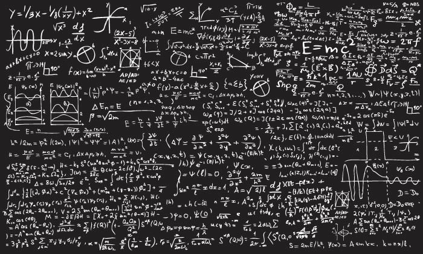
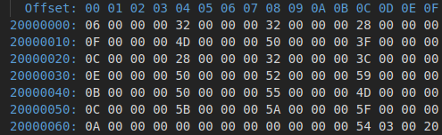

## Outline

Before you attend this week's lab, make sure:

1. you can read and write basic assembly code: programs with registers,
   instructions, labels and branching

2. you've completed the [week 5/6 "blinky" lab](/labs/05-blinky/)

3. you're familiar with the basics of functions (i.e. [there and back
   again](/_lectures/05-functions/#why-functions)
   plus [calling conventions](/_lectures/05-functions/#calling-conventions))

In this week's lab you will:

1. write **functions** (subroutines) to break your program into reusable
   components

2. pass data in (parameters) and out (return values) of these functions

3. keep the different parts of your code from interfering with each other
   (especially the registers) using the stack

## Introduction

Imagine you have a friend who's a teacher (or a university lecturer!) and is
stressed out at the end of semester. They've finished marking all of their
student's assignments and exams, but the marks for these individual pieces of
assessment are just scribbled around your friend's apartment on whatever piece
of paper (or wall) was closest at the time.



There's only so much you can do to help your friend out, but one thing you can
do is to help them add up the marks for each student's assignments and exam to
calculate their final mark for the semester.

## Exercise 1: a basic calculator

The assessment for your friend's class had 3 items:

1. 2 assignments, marked out of 100 but worth 25% of the total mark each
2. 1 final exam, marked out of 100 but worth 50% of the total mark

As an example, here's the marks for one student which your friend found written
on a banana on the floor of his lounge room:

| student id | assignment 1 | assignment 2 | final exam |
|------------|--------------|--------------|------------|
| s1         |           66 |           73 |         71 |

Your job in this exercise is to write a `calculate_total_mark` function which
takes **three parameters** (assignment 1 score, assignment 2 score and exam
score) and calculates the total mark. Be careful to take account of the "number
of marks vs percentage of total mark" for each item (the maths here really isn't
tricky, but you still have to take it into account)

In this lab we'll talk a lot about "calling functions" because that's something
you're familiar with from higher-level programming languages. However, it's
important to remember that functions aren't some new magical thing, they're just
a matter of using the instructions you already know in a clever way.

Plug in your discoboard, fork & clone the [lab 7
template]() to your machine, and open the `src/main.S`
file as usual. Your first job is to write a function to calculate the total mark
for the student s1 provided above.

To complete this exercise, your program should:

1. store the individual marks somewhere
2. calculate the total mark
3. put the result somewhere
4. continue executing from where it left off before the `calculate_total_mark`
   function was called

As we discussed in [the week 5 lecture](/_lectures/05-functions/), the key to packaging up a bunch of assembly
instructions into a callable function is using the link register (`lr`) to
remember where you branched **from**, and the `bx lr` instruction to jump
**back** (or return) when you're done.

Here's a partial template (although you'll have to replace the `??`s with actual
assembly code for it to run:

``` ARM
main:
  @ set up the arguments
  mov r0, ?? @ ass1 mark
  mov r1, ?? @ ass2 mark
  mov r2, ?? @ final exam mark

  @ call the function
  bl calculate_total_mark

  @ go to the end loop
  b end

end:
  b end

calculate_total_mark:
  @ do stuff with the arguments
  @ ...

  @ put the result in r0
  mov r0, ??

  @ go back to where the function was called from
  bx ??
```

:::info
Starting with the code above, commit your a program which calculates the mark
for student `s1` (see their marks in the [table above](#student-1-marks-table)),
then moves into an infinite loop.
:::

## Exercise 2: turning marks into grades

Your teacher friend is stoked with your solution but needs more help. They need
to give a letter (**A** to **F**) grade to each student based on the following
formula:

| 90--100 | 80--89 | 70--79 | 60--69 | 50--59 | 0--49 |
|---------|--------|--------|--------|--------|-------|
|       A |      B |      C |      D |      E |     F |

You tell your friend to relax---you can write another function which can do
this.

In this exercise you need to write a second function called `grade_from_mark`
which

- *takes* a numerical mark (0--100) as input parameter
- *returns* a value represending a letter grade (you can encode the "grade"
  however you like, but the hex values `0xA` to `0xF` might be a nice choice)

:::tip
There are a few ways to do this---you could generate results by doing a series
of comparison tests against the different score cut-offs, but also remember that
our input is a number and our output is really just a number as well. Discuss
with your partner: is there a numerical transformation (a simple formula) that
turns an overall mark into a grade? What are the edge cases of this formula? Are
there downsides to using a "closed form solution" rather than a series of
checks?
:::

:::info
Add a `grade_from_mark` function to your program as described above. In your
program, demonstrate that it returns the correct grade for the following inputs:
(`15`, `99`, `70`, `3`). Commit and push your new program.
:::

:::tip
Are there any other input values which are important to check? How does your
function handle "invalid" input?
:::

:::tip
If you're feeling adventurous, modify your program to call `grade_from_mark`,
then store the result to memory in the `.data` section using the ASCII encoding.
:::

## Exercise 3: putting it together {#exercise-3}

In this exercise, you need to write a function called `calculate_grade` which
combines these two steps: it takes the raw marks on the individual assessment
items and returns a grade.

Write a `calculate_grade` function which calls (i.e. `bl`s) the
`calculate_total_mark` function and use it to calculate the grades of the
following students:

| student id | assignment 1 | assignment 2 | final exam |
|------------|--------------|--------------|------------|
| s2         | 58           | 51           | 41         |
| s3         | 68           | 81           | 71         |
| s4         | 88           | 91           | 91         |

Combining these two functions is not too complicated, but remember to save your 
link register!

:::info
Submit a program which uses `calculate_grade` to calculate the mark of student
`s4`.
:::

## Exercise 4: recursive functions

Another way to implement the `grade_from_mark` function is using
recursion---where a function calls *itself* over and over. Each time the
function calls itself it (usually) passes itself different arguments to the time
before. Still confused? [Let this jolly englishman walk you through
it](https://www.youtube.com/watch?v=Mv9NEXX1VHc").

The basic logic for a `grade_from_mark_recursive` function is this:

1. if the total mark is less than 50, the grade is a fail so the function should
   return (i.e. place in `r0`) the failing grade value

2. otherwise, decrement the mark and recursively call the function passing in
   the new mark.

This recursive pattern will ultimately round the mark down until it hits the 
base case (1). After this it will then move up through the grades as the function
works its way back out of the recursive calls.

Again, you need to use the stack pointer to not only keep track of your link
register but also the parameters you are passing into functions so the registers
don't interfere with each other.

Your code should be something like this:

```ARM
grade_from_mark_recursive:
@ ...
  bl grade_from_mark_recursive  @ recursive call
@ ...
  bx lr
```

:::info
Re-write your program from [Exercise 3](#exercise-3) so that it calculates the
grade using a recursive function.
:::

:::tip
Discuss with your lab neighbor---what are the pros and cons between this and the
original `grade_from_mark` function?
:::

## Exercise 5: time to cheat

In a new initiative, the students get to self-assess their work in the course
(give themselves a final mark for the course). The only catch here is that the
student's mark is compared with the teacher's mark. If the student mark is no 
more than 10 marks better than the teacher's mark, they get the average of the 
two marks (i.e. theirs, and the teacher's). If the discrepancy is more than
that, they get the teacher's mark **minus** the difference. This should stop any
cheating---if the student's mark is too high, they'll actually be *worse* off 
than before.

Write a `self_assessment` function and incorporate it into the overall
`calculate_grade_sa` function.  
The `self_assessment` function should return the students self-assessed grade in `r0`.

Try it with a few different versions of `self_assessment`---some which pass 
the "no more than 10 marks better than the teacher's mark" criteria, and some that 
don't. Does your program handle all the cases properly?

Now imagine that *you're* the student---so you provide your own
`self_assessment` function. Can you think of a way to cheat? Can you craft the
assembly instructions inside the `self_assessment` function in such a way that
you can get a better mark than you deserve (without touching the rest of the
program)?

Use the following rough structure (still need to fill it out yourself!) of the
`calculate_grade_sa` function to write the "cheating" version of `self_assessment`.

```ARM
calculate_grade_sa:
  @ TODO: prep for call
  bl calculate_total_mark

  @ store teacher's mark on top of stack
  str r0, [sp, -4]!
  @ delete the teacher's mark from r0
  mov r0, 0

  @ TODO: prep for call
  bl self_assessment  @ cheat in here
  ldr r1, [sp], 4

  @ TODO: calculate final grade from: 
  @ - student grade (r0) 
  @ - teacher grade (r1)
  @ ...
  bx lr

self_assessment:
  @ TODO: return self assessed grade in r0
  @ ...
  bx lr
```

:::tip
Think about the values on the stack---can you break "outside" and mess with
things outside of the `self_assessment` function? How could this allow you to
cheat? *hint*: when we are using the stack pointer `sp` to store things in
memory, can you figure out an offset for reading/writing values "outside" that
function's part of the stack?  
:::

There are a couple ways you can do this, can you you give yourself any arbitrary mark?
How about the maximum possible mark based on the teachers final mark?

:::info
Commit & push your "cheating" version of the marking program.
:::

:::tip
This stuff is all really important for gaining a deep understanding of
cybersecurity. If you are interested, you can see how the very techniques you
have just learned are being applied to reverse engineering things like the
[Nintendo Wii U](https://www.youtube.com/watch?v=QMiubC6LdTA)!
:::

## Exercise 6: arrays as arguments

One of the tutors has heard about the good work you've been doing for your teacher friend 
and they have asked you to help them. Fortunately, they are more organized than the teacher
and have provided you with a collection of the students results in an array.

```ARM
main:
  ldr r0, =results
  bl calculate_lab_grades
  nop
  b main

@ ...

@ input:
@ r0: address of start of mark array with format,
@ .word size of array
@ .word a1, a2, final, 0
@ output:
@ .word a1, a2, final, grade
@ ...
calculate_lab_grades:
  @ ...
  bx lr
  
@ ...

.data
results:
  @ Length of array: 6
  .word 6
  @S1
  .word 50, 50, 40, 0
  @S2
  .word 77, 80, 63, 0
  @S3
  .word 40, 50, 60, 0
  @S4
  .word 80, 82, 89, 0
  @S5
  .word 80, 85, 77, 0
  @S6
  .word 91, 90, 95, 0
```

Write the `calculate_lab_grades` function to iterate over the students `results` array
1. load the students results in to the registers
2. calculate their final grade using your `calculate_grade` function (the original one, 
not the self assessment version)
3. store the final grade in the empty word at the end of each entry, eg.  
```ARM
@SX
.word 20, 40, 58, 0 @ <--- here
```
4. repeat for the length of the array
5. return using `bx lr`

If you've implemented it correctly, your memory at the results array should 
look like this afterwards:  



*note: the final grades are stored in the 00 offset 
column, starting from 20000010*

:::info
Commit & push your program to add the grades to the array.
:::

:::tip
The values in this code are stored in memory using `.word`s which are 32 bits 
*(4 bytes)* in size, yet no entry needs more than a byte, can you rework your code and 
the array to reduce its size in memory?
:::

## Summary

Congratulations! In this week's lab you learned how to

1. write **functions** (subroutines) to break your program into reusable
   components

2. pass data in (parameters) and out (return values) of these functions

3. keep the different parts of your code from interfering with each other
   (especially the registers) using a stack

:::info
Make sure you logout to terminate your session, and pack up your board and USB
cable carefully.
:::

Looking back on the code you wrote in the [blinky
lab](/labs/05-blinky/) to configure and operate the
LEDs, how might you package it all up into a collection of re-usable
functions---a library---for working with the LED? Try and write your own LED
utility library.
