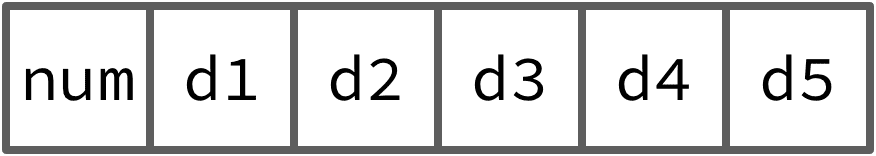
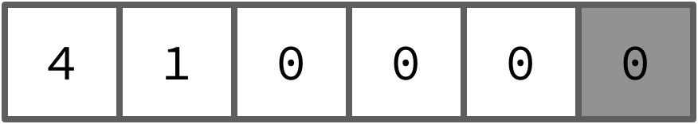
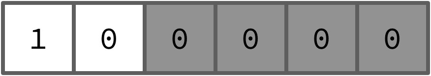

:::info
In your week 9 lab session you'll be given the jumper wires you'll
need to do assignment 3 (you'll need them for next weeks lab as well). So make sure
you turn up and ask your tutors and lab-mates for help when you get stuck.
:::

:::info
Now that we're in the second half of the course, the labs will have a few more
"gaps" where you have to figure out things for yourself (although there will
always be hints about any tricky bits). Don't worry, though, you can (and
should!) still ask your tutor or classmates for help when you get stuck.
:::

## Outline

Before you attend this week's lab, make sure:

1. you can load & store data to/from memory using `ldr` & `str` with different
   [addressing modes](/_lectures/05-functions/#offset-load-and-store-with-write-back)

2. you've completed
   the [Week 5 blinky lab](/labs/05-blinky/)

3. you've watched the Thursday week 6 video on [assembler
   macros](/_lectures/06-assembler-macros/)

In this week's lab you will:

1. use a simple data structure for storing dot-dash "morse code" codepoints

2. store multiple morse codepoints in an array-like structure in memory

3. write a program to read an [ASCII](https://en.wikipedia.org/wiki/ASCII)
   string and "output" it as morse code blinks

## Introduction {#introduction}

[Morse code](https://en.wikipedia.org/wiki/Morse_code) is a simple communication
protocol which uses "dots" and "dashes" to represent the letters of the
alphabet.

<YouTubeEmbed id="wL2ED9-pACs" />

The dots and dashes can be represented in different ways---as dots or lines on a
page, as short or long beeps coming out of a speaker, or [hidden in a song on
the radio to reach kidnap
victims](https://hackaday.com/2018/04/13/another-reason-to-learn-morse-code-kidnapping/),
or as short or long "blinks" of the LED light on your discoboard. In this lab
content the morse code will be represented visually using a sequence of `.`
(dot) and `_` (dash) characters, but by the end of the lab you'll be sending
morse code signals by blinking the red LED on your discoboard in short (dot) and
long (dash) bursts. Here's the full morse alphabet (courtesy of
[Wikipedia](https://en.wikipedia.org/wiki/Morse_code))


:::tip
Discuss with your neighbour---have you ever seen (or even used!) morse code
before? Where/when?
:::

## Exercise 1: a LED utility library

Remember the setup code you wrote in the [blinky lab](/labs/05-blinky/)? Now that you've got some more skills with
[functions](/labs/07-functions/) under your belt,
you can probably imagine how you might package up a lot of that
[load-twiddle-store](/labs/05-blinky/#load-twiddle-store) stuff into functions to make the code a bit more readable
(this was actually proposed as an extension exercise at the end of the [last
lab](/labs/07-functions/#led-library-extension)).

In fact, I (Ben) have already written this library for you (because I'm such a
nice guy 😊). You can find it in the `src/led.S` file after you fork & clone the
[lab 9 template]() from GitLab.

Have a read through the code in `led.S`---you should now be at the stage where
you can look at assembly code like this and at least get a *general* sense of
what it does and how it works. Here are a couple of things to pay particular
attention to as you look over it.

- The code uses `push` (to store the value in a register onto the stack, and
  *decrement* the stack pointer `sp`) and `pop` (to load the top value on the
  stack into a register and *increment* the stack pointer `sp`). You can do this
  in other ways (e.g. `stmdb pc!, {lr}`) but `push` and `pop` are convenient
  when you want to want to use `sp` to keep track of the stack. You can see the
  `push`/`pop` instructions in *Section A7.7* of your
  your
  [ARMv7 reference manual](/assets/manuals/ARMv7-M-architecture-reference-manual.pdf)

- Some (but not all) of the functions take arguments (described in the
  comments), so before you call these functions make sure you've got the right
  values in these registers to pass arguments to the functions.

- The `.global delay, red_led_init, red_led_on, red_led_off` line is necessary
  because you're putting the code above into a separate file to the one where
  the rest of your program will be (`src/main.S`). By default, when you hit
  build/run the assembler will only look for labels in the current file, so if
  you try and branch `bl` to one of these functions from `main.S` it'll complain
  that the label doesn't exist. By marking these functions as `.global`, it
  means that the assembler will look everywhere for them, even if they're in a
  different source file to the one they're being called from. Finally, the
  `.global` labels in a file are good clue about which functions are useful to
  call from your own code.
- You may notice things like `ldr r0, =ADR_RCC` and wonder why it's not a number after `=`.
  `ADR_RCC` is a symbol declared in `src/util.S` using `.set` directive.
  This is a somewhat convenient way of abstracting over numeric values.

:::tip
Discuss with your neighbour---what are the advantages of using the functions in
the LED library? Are there any disadvantages?
:::

Your task in exercise 1 is to use the functions from the `led.s` library to
write three new **functions** in your `main.S` file:

1. `blink_dot`, which blinks the led for a short period of time (say `0x20000`
   cycles---we'll call this the "dot length") and then pauses (delays) for one
   dot length before returning

2. `blink_dash`, which blinks the led for *three* times the dot and then pauses
   (delays) for one dot length before returning

3. `blink_space`, which doesn't blink the LED, but pauses (delays) for *seven*
   dot lengths before returning

Each of these function calls will contain nested function calls (i.e. calls to
`delay` or other functions) so make sure you use the stack to preserve the link
and argument registers (e.g. with `push` and `pop`) when necessary.

:::info
Once you've written those functions, write a `main` loop which blinks out the
sequence `... _ _ _ ` on an endless repeat. Commit & push your program to
GitLab.
:::

## Exercise 2: a morse data structure

Now it's time for the actual morse code part. In morse code, each letter (also
called a **codepoint**) is encoded using *up to* five dots/dashes. For example,
the codepoint for the letter B has 4 dots/dashes: `_...` while the codepoint for
the letter E is just a single dot `.`. You could store this in memory in several
different ways, but one way to do it is to use a data structure which looks like
this:



Each "slot" in the data structure is one full word (32 bits/4 bytes), so the
total size of the codepoint data structure is 4*6=24 bytes. The first word is an
integer which gives the total number of dots/dashes in the codepoint, while the
remaining 5 boxes contain either a 0 (for a dot) or a 1 (for a dash).

:::tip
What will the address offsets for the different slots be? Remember that each box
is one 32-bit word in size, but that memory addresses go up in **bytes** (8 bits
= 1 byte).
:::

Here are a couple of examples... codepoint B (`_...`):



and codepoint E (`.`)



In each case, the "end" slots in the data structure might be unused, e.g. if the
codepoint only has 2 dots/dashes then the final 3 slots will be unused, and it
doesn't matter if they're 0 or 1. These slots are coloured a darker grey in the
diagrams. (If this inefficiency bums you out, you'll get a chance to fix it in
[Exercise 4](#exercise-4)).

Your job Exercise 1 is to write a function which is passed (as a parameter) the
base address (i.e. the address of the first slot) of one of these morse data
structures and "blinks out" the codepoint using the LED.

As a hint, here are the steps to follow:

1. pick any character from the morse code table at the [start of this lab
   content](#introduction)

2. store that character in memory (i.e. use the `.data` section) using the morse
   codepoint data structure shown in the pictures above

3. write a `blink_codepoint` function which:
   - takes the base address of the data structure as an argument in `r0`
   - reads the "size" of the codepoint from the first slot
   - using that size information, loops over the other slots to blink out the
     dots/dashes for that codepoint (use the `blink_dot` and `blink_dash`
     functions you wrote earlier)
   - when it's finished all the dots/dashes for the codepoint, delays for 3x dot
     length (the gap between characters)

Since the `blink_codepoint` function will call a bunch of other functions, make
sure you use the stack to keep track of values you care about. If your program's
not working properly, make sure you're not relying in something staying in `r0`
between function calls!

:::tip
When you start to use functions, the usefulness of the **step over** vs **step
in** buttons in the debugger toolbar starts to become clear. When the debugger
is paused at a function call (i.e. a `bl` instruction) then step **over** will
branch, do the things without pausing, and then pause when the function
*returns*, while step **in** will follow the branch, allowing you to step
through the called function as well. Sometimes you want to do one, sometimes you
want to do the other, so it's useful to have both and to choose the right one
for the job.
:::

:::info
Write a program which uses the morse data structure and your `blink_codepoint`
function to blink out the first character of your name on infinite repeat.
Commit & push your program to GitLab.
:::

## Exercise 3: [ASCII](https://en.wikipedia.org/wiki/ASCII) to morse conversion

The final part of today's lab is to bring it all together to write a program
which takes an input string (i.e. a sequence of
[ASCII](https://en.wikipedia.org/wiki/ASCII) characters) and blinks out the
morse code for that string.

To save you the trouble of writing out the full morse code alphabet, you can
copy-paste the following code into your editor. It includes a simple `morse`
macro, and also a place to put the input string (using the `.asciz` directive).

``` ARM
@ morse code data structure
.macro morse num d1 d2 d3 d4 d5
  .word \num, \d1, \d2, \d3, \d4, \d5
.endm

.data
input_string:
.asciz "INPUT STRING"

@ to make sure our table starts on a word boundary
.align 2

morse_table:
  morse 2 0 1 0 0 0 @ A
  morse 4 1 0 0 0 0 @ B
  morse 4 1 0 1 0 0 @ C
  morse 3 1 0 0 0 0 @ D
  morse 1 0 0 0 0 0 @ E
  morse 4 0 0 1 0 0 @ F
  morse 3 1 1 0 0 0 @ G
  morse 4 0 0 0 0 0 @ H
  morse 2 0 0 0 0 0 @ I
  morse 4 0 1 1 1 0 @ J
  morse 3 1 0 1 0 0 @ K
  morse 4 0 1 0 0 0 @ L
  morse 2 1 1 0 0 0 @ M
  morse 2 1 0 0 0 0 @ N
  morse 3 1 1 1 0 0 @ O
  morse 4 0 1 1 0 0 @ P
  morse 4 1 1 0 1 0 @ Q
  morse 3 0 1 0 0 0 @ R
  morse 3 0 0 0 0 0 @ S
  morse 1 1 0 0 0 0 @ T
  morse 3 0 0 1 0 0 @ U
  morse 4 0 0 0 1 0 @ V
  morse 3 0 1 1 0 0 @ W
  morse 4 1 0 0 1 0 @ X
  morse 4 1 0 1 1 0 @ Y
  morse 4 1 1 0 0 0 @ Z

```

:::tip
The `morse` macro isn't very sophisticated, and isn't *necessary*; you could
just use `.word` instead. The main reasons for using it are a) to make that
section of the code a bit more readable (it's clear that it's *morse* data, not
just any old data) and also it will now give you an error if you give the wrong
number of arguments. It's worth thinking through this as you learn to balance
the pros and cons of macros (as discussed in the [week 6
lecture](/_lectures/06-assembler-macros/)).
:::

The main addition you'll need to make to your program to complete this exercise
is a `morse_table_index` function which takes a single
[ASCII](https://en.wikipedia.org/wiki/ASCII) character as input, and returns the
base address of the corresponding codepoint data structure for that character
(which you can then pass to your `blink_codepoint` function). For example, the
letter P is [ASCII](https://en.wikipedia.org/wiki/ASCII) code `80`, and the
offset of the P codepoint data structure in the table above is 15 (P is the 16th
letter) times 24 (size of each codepoint data structure) equals 360 bytes.

So, your main program must:

1. loop over the characters in the input string (`ldrb` will be useful here)
2. if the character is `0`, you're done
3. if the character is not `0`:
   - calculate the address of the morse data structure for that character
   - call the `blink_codepoint` function with that base address to blink out the
     character
   - jump back to the top of the loop and repeat for the next character

If you like, you can modify your program so that any non-capital letter (i.e.
[ASCII](https://en.wikipedia.org/wiki/ASCII) value not between 65 and 90
inclusive) will get treated as a space (`blink_space`).

:::info
Write a program which blinks out **your name** in morse code. Commit & push this
program to GitLab.
:::

## Exercise 4: choose-your-own-adventure {#exercise-4}

:::tip
<div class="extension-box" markdown="1" style="margin-bottom: 20px;">
There are many ways you can extend this program. Here are a few things to try (pick which
ones interest you---you don't have to do them in order):
:::

1. can you modify your program to accept both lowercase and uppercase
   [ASCII](https://en.wikipedia.org/wiki/ASCII) input?
2. the current `morse_table` doesn't include the numbers 0 to 9; can you modify
   your program to handle these as well?
3. can you use [optional arguments and/or other macro
   features](https://community.arm.com/processors/b/blog/posts/useful-assembler-directives-and-macros-for-the-gnu-assembler)
   to remove the need for the extra "zeros" for any characters which don't have
   as many dots/dashes?
4. can you remove the need for the leading `\num` argument to `morse`
   altogether?
5. this is **far** from the most space-efficient way to store the morse
   codepoints, can you implement a better scheme?
6. can you modify the `led.S` library to set up and blink the [green
   LED](/labs/05-blinky/#exercise-2) as well---how
   can you use this in your morse blinking?
</div>

### Summary

Congratulations! In this week's lab you learned how to

1. implement a simple data structure for storing morse codepoints

2. store multiple morse codepoints in an array-like structure in memory

3. read an [ASCII](https://en.wikipedia.org/wiki/ASCII) string and "output" it
   as morse code blinks

:::info
Make sure you logout to terminate your session, and pack up your board and USB
cable carefully.
:::
