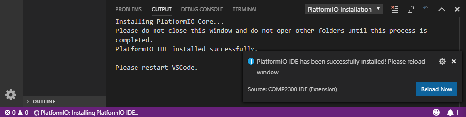
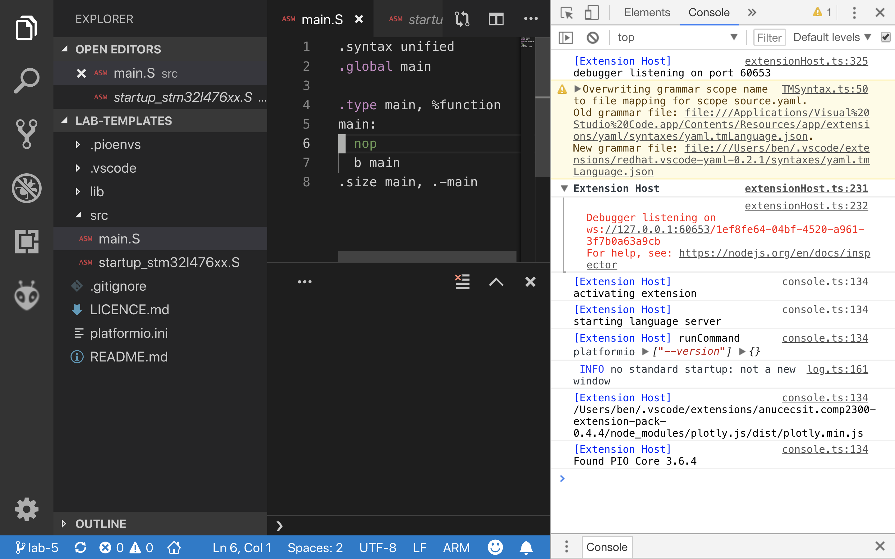
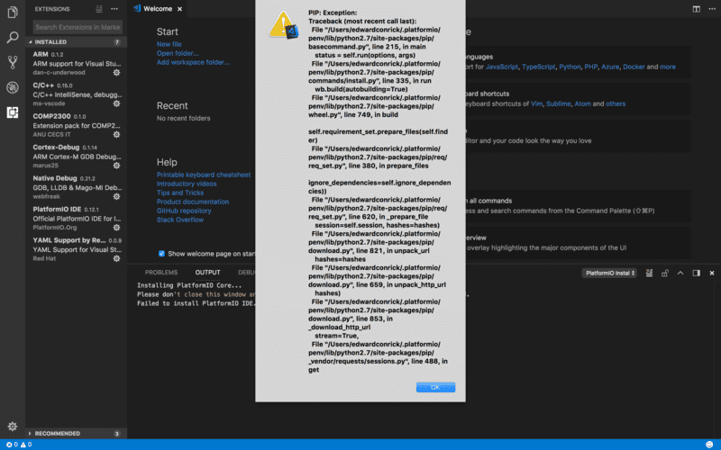

The Integrated Development Environment (IDE) we use in COMP2300/6300 is [Visual
Studio Code](https://code.visualstudio.com/) (we'll usually call it **VSCode**
for short). VSCode is a generic text editor, which means that it's really good
at editing text, but doesn't care too much what that text is/represents.
However, VSCode also allows people to write "extensions" to help VSCode write &
run code for different programming languages.

One such extension is called [PlatformIO](http://platformio.org/), which is an
"an open source ecosystem[^ecosystem] for IoT (Internet of Things) development".
Sometimes we abbreviate PlatformIO to just "PIO".

[^ecosystem]:
    The *ecosystem* thing means that PlatformIO isn't just for writing a
    specific program on a specific board with a specific "framework". You can
    read more about it in the
    [documentaion](http://docs.platformio.org/en/latest/ide/vscode.html#ide-vscode)
    if you're interested.

We'll only be using one specific "board" (your STM32 L476G discoboard) in this
course, so we won't use all of the PlatformIO functionality. PlatformIO provides
the compiler, assembler and other important components for writing & running
code on your discoboard. You don't have to master everything straight away,
we'll step you through it in the labs (so make sure you attend all the labs!).

## Installation

### On the CSIT lab machines {#installing-on-the-csit-lab-machines}

If you're on one of the CSIT Ubuntu lab machines and you haven't yet set up the
COMP2300 software environment, we've put all the steps into a script. You should
[open up a terminal](/resources/01-faq/#opening-a-terminal) and run:

```bash
$ comp2300-student-setup.sh
```

You'll see a bunch of stuff printed to the terminal, scrolling by real
fast---this is normal. However, the setup script does take several minutes to
finish (maybe 10+?) so maybe go make a cup of tea or something[^food-drink].

When it's done, you're ready to go.

:::info
Make sure however that the "COMP2300" extension is always up to date.
Its version will go up as we fix problems and add features,
so you should keep it up-to-date.
The pre-packaged one `0.4.4` is already out of date (latest is `>=0.4.5`).
You can click on "Extensions" in the side-bar of VSCode to manage the extensions.
:::

[^food-drink]:
    Ha! Just kidding, no food & drink in the labs. Sorry.

### On your own machine

To set this all up on a new machine (e.g. your own laptop) here are the steps:

1. read the COMP2300/6300 [own machine policy](/policies/#own-machine-policy)

2. [download & install VSCode](https://code.visualstudio.com/) (works on macOS,
   Linux & Windows)

3. open VSCode, [open the **Extensions**
   view](https://code.visualstudio.com/docs/editor/extension-gallery)

4. search for and install the **COMP2300** extension
   (`anucecsit.comp2300-extension-pack`)

5. reload the VSCode window (using the [command
   palette](https://code.visualstudio.com/docs/getstarted/userinterface#_command-palette)),
   then **wait until PlatformIO Core installation finishes**, follow the prompt and reload window
   

6. *Windows users only*: download & install the
    [ST-Link Windows Driver](/assets/resources/setup/stlink-windows-driver.zip/).
    - Extract the archive and run either `dpinst_amd64.exe` or `dpinst_x86.exe` depending on whether you are on a 64-bit machine or 32-bit machine.
        Follow the displayed instructions.

7. now clone a [lab repo](/labs/) and open it in a VSCode window
8. [connect your board to the computer](/labs/01-intro/#connecting-the-board) and then run `Platform IO: Upload`, it will then download some additional tools

If things go wrong, check the [Troubleshooting](#Troubleshooting) section
further down this page.

:::info
If things ever go seriously wrong with trying to install this stuff on your
own machine, you can always "start again" by deleting the `~/.vscode` and
`~/.platformio` folders in your home directory, e.g. with this terminal
command:
```bash
$ rm -rf ~/.vscode ~/.platformio
```
:::

## Using VSCode & PlatformIO

VSCode has [pretty good documentation](https://code.visualstudio.com/docs), and
the lab material will link to specific parts of it where appropriate. However,
understanding your tools is really important, so take the time to read through
the documentation and get to know the features of VSCode. It'll make your life
easier in the end, even if there's a learning curve at the start.

Once you've got VSCode & the necessary plugins installed (and you've got your
discoboard) you're able to write and run your first program. That's what lab 1
is all about---so head [to that page](/labs/01-intro/#connecting-the-board) and give it a try.

:::info
The rest of this page is information to [help you if you get
stuck](#troubleshooting), or if you want to know the details of [how all the
parts of this software environment work together](#environ-explanation). You
don't have to read it in detail now, in fact it's probably more important that
you head to the lab 1 content and make sure that you can actually get this stuff
working for yourself. However, it's good to know that this information is here,
so that if you have problems you know where to look (and it's helpful for asking
good questions on [the forum]({{ site.forum_url }}) as well).
:::

## Troubleshooting {#troubleshooting}

Here's a list of issues you *might* come across, depending on the specific
details of your machine. As always, be careful with copy-pasting random code you
found on the internet (even in a university course!), and try to *understand*
the problem first before you try the solutions listed.

If there are new problems which come up often enough on [the COMP2300 forum]({{
site.forum_url }}) I'll add them here.

### Un-plug & re-plug --- "Have you tried turning it off & on again?"

<YouTubeEmbed id="nn2FB1P_Mn8" />

Sometimes the board can get into a bad state causing the uploading to fail
(especially when the debug LED becomes yellow).
Stop any active debug session,
and try unplug & re-plug to reset the board.

### VSCode developer tools console

Before you look at the specific problems, here's a tip for getting the most
useful error messages out of VSCode when things are going wrong. In command
pallete, run the **Developer: Toggle Developer Tools** command and you'll see a
new pane pop up in VSCode. Switch to the **Console** tab (top-right of the
screenshot) and you'll see something like this:



Now, the messages in this Console view aren't really meant for VSCode users, so
there will be a lot of stuff here, and a lot of it probably isn't relevant.
However, if you keep this view open while you do the PlatformIO command which
isn't working for you, then it might output some error messages here (watch for
*red* lines of text) which give you more detailed information about what's going
wrong.

<!-- ********************************************************************* -->
### Breakpoint problems
#### can't set a breakpoint by clicking in the left-hand "gutter" {#breakpoints-broken}

If you suddenly lose the ability to set a breakpoint by clicking in the "gutter"
to the left of the line numbers next to your code, then check that VSCode is
still treating your file as an **ARM** file rather than just an **Assembly**
file.

To see if this is the case, check the bottom-right hand corner of the VSCode
window (just to the right of the smiley face ☻). If it says "Assembly", then
click there and switch it to ARM (you should probably use the "Configure file
association for .S" drop-down option to set this to ARM for *all* `.S` files
while you're there).

### OpenOCD Upload Problems
#### connection problems
```text
Error: open failed OR Error: failed to read version
```
This means that OpenOCD fails to connect the board.
First check whether you have connect your board to the computer.
Then try unplug and re-plug the board.

If you are on Windows, make sure you have [installed the driver](#win-driver).
If you are on Linux, it **could** also be a [permission
issue](#linux-device-permission).

#### flash failure
```text
Error: init mode failed (unable to connect to target)
```
Sometimes a fresh new board need to be flashed first before upload using OpenOCD can work
(don't ask me why, it just seem to work this way...).
This manual flash only need to be done once:

First, build a program image by running the `PlatformIO: Build` command in VSCode,
then use the following commands in the VSCode integrated terminal:
```bash
$ ~/.platformio/packages/toolchain-gccarmnoneeabi/bin/arm-none-eabi-objcopy -O binary .pioenvs/disco_l476vg/firmware.elf .pioenvs/disco_l476vg/firmware.bin
$ ~/.platformio/packages/tool-stlink/bin/st-flash write .pioenvs/disco_l476vg/firmware.bin 0x08000000
```

If flash is successful, the subsequent `PlatformIO: Upload` should work fine.

#### libusb_open()
```text
Error: libusb_open() failed with LIBUSB_ERROR_NOT_SUPPORTED
```
This doesn't seem to be a problem *as long as* there are no other errors that causes the upload program to fail.
The cause of this problem is still unknown,
but the uploading still seems to succeed in the cases seen so far.

<!-- ********************************************************************* -->
### ST-Util & GDB Problems
#### ENOENT
```text
Failed to launch ST-Util GDB Server: Error: spawn C:\xxxxxx\xxxx\.platformio\packages\tool-stlink\st-util.exe ENOENT
```
`ENOENT` is file not found error.
If you got some sort of this error when trying to run the debugger,
first make sure that the following are in place (re-install PlatformIO Core if necessary):
- COMP2300 extension is of the latest version;
- if it's the program image, make sure you have compiled/build the program source (`PlatformIO: Build`);
- `~/.platformio/packages/bin/tool-stlink/bin/st-util` exists;
- `~/.platformio/packages/bin/toolchain-gccarmnoneeabi/bin/arm-none-eabi-gdb` exists.

If problem still persists, look closely at what file is missing, and ask your tutor for help.

NOTE:
On Windows, we have discovered that if your user name is of another language,
sometimes the path resolution will fail. In this case the easiest would be to
create another user with an English user name, and do all the development there.

#### device not found
```text
Couldn't find any ST-Link/V2 device
```
Check board connection; replug if necessary.

If you are on Windows, check if you have [installed the driver](#win-driver). If
you are on Linux, it **could** also be a [permission
issue](#linux-device-permission).

#### failed to read core id
```text
src/common.c: Failed to read core id
```
Connection issue. Replug the board.

#### time out
```text
Failed to launch ST-Util GDB Server: Timeout.
```
This is likely due to `st-util` failed to start properly.
[Get more info from the Adapter Output](#more-info).

#### this socket is closed
```text
Failed to launch GDB: Error: this socket is closed
```
This is probably because GDB failed to launch, check error output in DEBUG CONSOLE.

One case we found is due to a path error made by an attempt to manually install
packages. Check the paths in the `settings.json`, and also actual paths on your
system.

#### remote communication error
```text
Failed to launch GDB: Remote communication error. Target disconnected.: No error. (from target-select extended-remote localhost:50000）
```
This has been found on Windows, however the same thing MAY happen also on other OS as well.

The real problem is that the default debug port 50000 is being used by some
other software. So when the debugger tries to connect to it, the other software,
rather than the expected server (st-util), responds, and refuses the connection
request from GDB since it doesn't know who GDB is.

So the proper solution is to close the software that's using port 50000, then
everything should work just fine.

To find out the clue on what it is, do the following:
- Open Command Prompt in Administrator mode (search "command prompt" in start
  menu -> right click and select "run with Administrator mode")
- Run the command `netstat -a -b`, and look for the application with Local
  Address `127.0.0.1:50000`.
- Close the application that's using the port (system monitor MAY be needed,
  Ctrl+Shift+Esc).

If you can't find the application, it may also mean that port `50000` wasn't
closed properly. Maybe try restart the computer in this case.

#### remote connection closed
```text
Failed to launch GDB: Remote connection closed (from target-select extended-remote localhost:50000)
```
This seems to be a problem with GDB failing to connect with `st-util`.
[Get more info from the Adapter Output](#more-info).

#### connection refused
```text
Failed to launch GDB: localhost:50000: No connection could be made because the target machine actively refused it.
```
This could be caused by your anti-virus software. Please check and turn it off if necessary.
It could be interfering and refusing connection to certain ports.

#### get more debug information {#more-info}
You can also view the output from `st-util` in the **Adapter Output** tab (check
`OUTPUT` panel during debug -> select `Adapter Output` from the drop down list).

<!-- ********************************************************************* -->
### Debug Config Problems
#### Can't find ARM On-Chip Debug
As explained in the [above section](#environ-explanation), COMP2300 should
automatically initialise the debug config.

If only "PlatformIO Debug" exists, it means that PIO IDE has forcefully replaced
`launch.json` before COMP2300 extension could stop it.

It could be a race condition happened between PIO IDE and COMP2300 extension,
and it could happen at the first opening of a cloned directory when
`.vscode/settings.json` doesn't exist. If this is the case, a window reload
should fix the problem.

Otherwise it could be a trickier problem to figure out why COMP2300 extension
didn't start properly. Go to Help -> Developer tools -> Console, and see if
there are any errors. It may fail because one of its dependency fails to
activate.

There was a problem with Cortex Debug failing to install its `0.1.15` update
properly, causing `xml2js` package not found. If that's the case, you might need
to uninstall the COMP2300 extension, and delete the
`~/.vscode/extensions/marus25.cortex-debug-0.1.15` folder, and re-install the
extensions. This will reinstall Cortex Debug extension.

<!-- ********************************************************************* -->
### OS Specific Problems

#### [macOS] Installation crash --- PIP: Exception
On some macOS machines when installing PlatformIO it might crash like the
following: 

This is because the SSL library is too old. So the solution is to install a
newer version of OpenSSL library, and upgrade Python to make sure it uses this
updated library.

In the terminal, type:
```bash
$ brew install openssl
```
You will need [Homebrew](https://brew.sh/) if you haven't installed it.
Then check the OpenSSL version in Python:
```bash
$ python -c "import ssl; print(ssl.OPENSSL_VERSION)"
```
The version should be the latest (`1.0.2n`).

Otherwise you need to "re-"install Python
```bash
$ brew install python
```
Then open VSCode, press `Ctrl/Cmd + ,` to open up settings,
put the following in *User settings*:
```json
"terminal.integrated.env.osx": {"PATH": "/usr/local/opt/python/libexec/bin"}
```
Then reload window and wait for PlatformIO to finish installing core.

#### [Linux] Device permission issues {#linux-device-permission}
On some Linux machines you might have read/write permission issues in connecting
to your discoboard. As a result, PlatformIO fails to upload (`pio run --target
upload`) with the following error message:

``` shell
Couldn't find any ST-Link/V2 devices
```

This problem can be solved by with the following commands:

``` shell
#!/bin/sh

sudo sh -c 'cat > /etc/udev/rules.d/49-stm32.rules' <<EOF
# 0483:374b - STM32F4 Dsicovery in USB Serial Mode (CN5)
ATTRS{idVendor}=="0483", ATTRS{idProduct}=="374b", ENV{ID_MM_DEVICE_IGNORE}="1"
ATTRS{idVendor}=="0483", ATTRS{idProduct}=="374b", ENV{MTP_NO_PROBE}="1"
SUBSYSTEMS=="usb", ATTRS{idVendor}=="0483", ATTRS{idProduct}=="374b", MODE:="0666"
KERNEL=="ttyACM*", ATTRS{idVendor}=="0483", ATTRS{idProduct}=="374b", MODE:="0666"

# 0483:df11 - STM32F4 Discovery in DFU mode (CN5)
SUBSYSTEMS=="usb", ATTRS{idVendor}=="0483", ATTRS{idProduct}=="3748", MODE:="0666"
EOF

sudo udevadm control --reload-rules

echo "Unplug and replug your device to activate the new rules."
```

For your convenience, [here's a script](/assets/scripts/permission-fix.sh/) which does it all for you.

Note: the product ID is found by doing:

``` shell
$ dmesg | grep 'New USB device found, idVendor=0483'
[195436.094414] usb 1-1.3: New USB device found, idVendor=0483, idProduct=374b
```

This should be the STM32L476 Discovery board product number.

Further reading:

- <https://github.com/texane/stlink/issues/486>
- <https://github.com/platformio/platform-ststm32/issues/74>

#### [Windows] ST-Link Driver {#win-driver}
On Windows you will need install ST-Link Debug Driver before Windows will
connect to the discoboard. If you don't, you'll get an error like this:

```
WARN src\usb.c: Couldn't find any ST-Link/V2 devices *** [upload] Error -1
```

You need to get the latest ST-Link driver. [Follow the instructions at this
page](https://os.mbed.com/teams/ST/wiki/ST-Link-Driver).

#### [Windows] package manager problems
You might see the following error:

```
PackageManager: Installing tool-stm32duino @ ~1.0.0
Downloading [###---------------------------------] 10%
Error: Please read http://bit.ly/package-manager-ioerror
Warning! Package Mirror: [Errno 0] Error
Looking for another mirror...
Downloading [------------------------------------] 1%
Error: Please read http://bit.ly/package-manager-ioerror
Warning! Package Mirror: [Errno 0] Error
Looking for another mirror...
Error: Could not install 'tool-stm32duino' with version requirements '~1.0.0' for your system 'windows_amd64'.

Please try this solution -> http://bit.ly/faq-package-manager
```

You should probably [try the linked
solution](http://docs.platformio.org/en/latest/ide/vscode.html#packagemanager-is-unable-to-install-tool).

Basically, run the following in system terminal (Start Menu -> `cmd`):
```bash
"C:/Users/<your user name>/platformio/penv/Scripts/platformio.exe" run -d "<pio project dir>" --target upload
```
replace `<your user name>` with your user name,
and `<pio project dir>` with your cloned repository (probably `C:/Users/<your user name>/comp2300-2019-xxx`),
leave the quotation marks in.

#### [Windows] integrated terminal freezes
On some Windows machine VSCode terminal tab freezes at start up. This happens
irrespective of the shell selected. Because of this the debugger will not run.

This is a VSCode problem, unrelated to PlatformIO. The cause of the problem is
still unclear. There is no fix at the moment.

#### [Windows] Disappearing st-util.exe
We have encountered some issue where the `st-util.exe` file is being removed. It
*looks* like this is some strange interaction with
[Avast](https://en.wikipedia.org/wiki/Avast_Antivirus) but it's hard to tell for
sure. If you're on Windows and you have errors mentioning `st-util.exe`, it is
probably a good idea to check that the file is still there:

1. navigate to `C:\Users\<your name>\.platformio\packages\tool-stlink`
2. check if the `st-util.exe` file is present---if it is, your problem is
   elsewhere
3. if it *is* missing, go back up one folder to `packages` and delete the
   `tool-stlink` folder
4. run the PlatformIO upload command again to re-download the file (this may
   need to be done from command line---you'll need [platformio on your
   path](#adding-platformio-to-windows-path))

If you still have issues after this, consider disabling your antivirus or
changing to a different provider.

#### [Windows] Adding platformio to windows path {#adding-platformio-to-windows-path}
1. Open a file explorer
2. right click *This PC* and select properties
3. in the new window select *Advanced system settings* on the left
4. select *Environment Variables*
5. under System variable select Path and click edit
6. click New
7. enter the location of your platformio Scripts file, it should look something
   like this: `C:\Users\<your name>\.platformio\penv\Scripts`
8. Keep clicking Ok until you get back to the System window.

PlatformIO commands should now work in your command prompt.

## How does the software environment work? {#environ-explanation}

Having an understanding of how the software environment work will help you make
sense of some error messages, as well as how you might resolve them.

The COMP2300 extension depends on Cortex Debug, PlatformIO IDE and a few other
extensions. So when COMP2300 extension is installed, those extensions will be
installed as well. This also means that if one of those extension fails to
activate at start up/window reload, the COMP2300 extension will also fail to
activate. All these extensions will be installed under the
`~/.vscode/extensions` directory.

The [PlatformIO IDE](https://docs.platformio.org/en/stable/ide/pioide.html)
extension is a lightweight interface between VSCode and the actual [PlatformIO
Core](https://docs.platformio.org/en/stable/core.html). PIO Core (`platformio`
program) does all the heavy lifting of toolchain and library management,
compiling and uploading code etc.

When the PIO IDE extension starts, it first verifies the integrity of PIO Core
installation, and downloads anything which is missing to your `~/.platformio`
directory.

In this course we are using the ST STM32 "platform". You can tell this by the `platform=ststm32@version`
in the `platformio.ini` in all the lab/assignment repos. There are a couple of
things to know if you want to see where this stuff all ends up:

- all platform files are installed into `~/.platformio/platforms`
- toolchains (compilers, linkers, etc.) will end up in `~/.platformio/packages`
- for this course, the most important three are
  - ARM GCC (`toolchain-gccarmnoneeabi`), used to compile, and debug code
  - OpenOCD (`tool-openocd`) and ST-Link (`tool-stlink`), used to upload
    compiled binary to the disco board and provide an interface between the
    board and the debugger (GDB)

There are some settings (in `.vscode/settings.json`; this includes paths,
suppressing PIO IDE's forceful replacement of `.vscode/launch.json`) and debug
configurations (in `.vscode/launch.json`) needed to get Cortex Debug running
properly. These should be handled automatically by the COMP2300 extension when
it activates. Both COMP2300 extension and PIO IDE look for `platformio.ini` file
in the workspace root directory to determine whether this workspace is a
PlatformIO project. They only activates when a PlatformIO project is activated.

When you execute `PlatformIO: Build` (e.g. `pio run`), it uses ARM GCC to
compile the source files into an ELF image
(`.pioenvs/disco_l476vg/firmware.elf`). And `PlatformIO: Upload` (e.g. `pio run
--target update`) will upload this ELF image to the disco board using OpenOCD
(used to be using `st-flash` with the old `3.8.0` version of STM32 platform,
somehow in the `4.0.1` version it "forcefully" use OpenOCD). When launching the
debugger, the Cortex Debug extension will launch `st-util` as an interface
between the board and GDB (`disco board <--> st-util <--> arm-none-eabi-gdb <-->
VSCode`). `st-util` opens a port (`50000` by default) through which GDB connects
and talks to it; and VSCode interacts with GDB through [MI
commands](https://sourceware.org/gdb/onlinedocs/gdb/GDB_002fMI.html). You can
manually issue these commands through the DEBUG CONSOLE.

You can view a bunch of different things through the `OUTPUT` panel by selecting
the source (e.g. Tasks, Extensions, Log etc.). This is very helpful in
troubleshooting.
