<!-- _class: banner -->

# COMP2300

# Week 1: Introduction & Digital Logic

---

## Hi, I'm Ben

---

## Outline

- [course overview](#overview)
- [boolean algebra](#boolean-algebra)
- [combinational logic](#combinational-logic)
- [sequential logic](#sequential-logic)

# Overview

## Who is this course for?

Anyone who wants to know:

- how their computer *really* calculates 1+1
- what happens in your computer when you run a high level program
- how and why computer science connects to the physical world
- why your Grandma had all her bitcoin [stolen](https://meltdownattack.com/)
  over the summer break

---

## Who owns a smartphone?

---

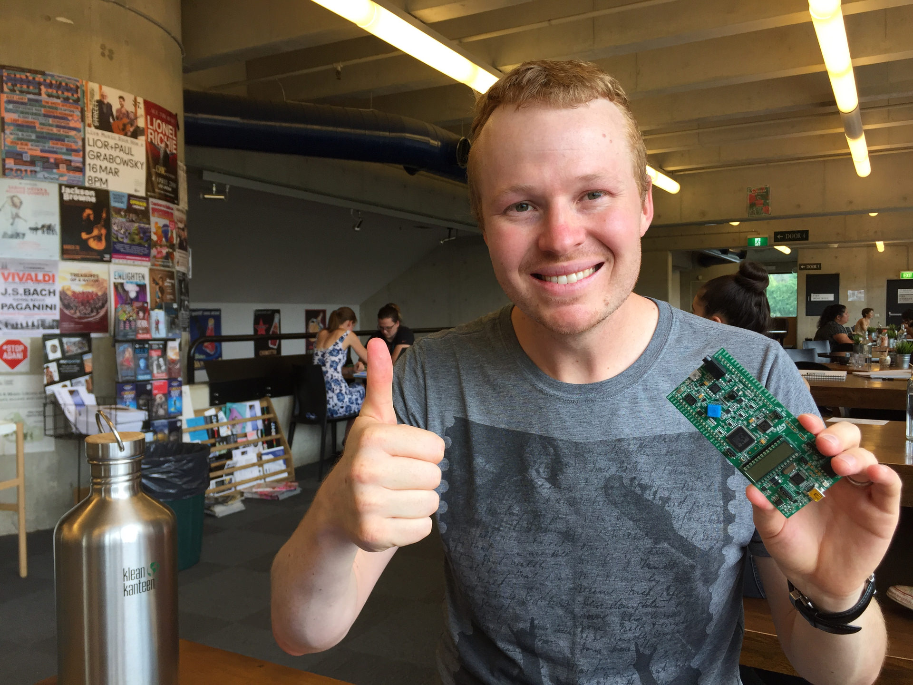

## COMP2300: the discoboard course!

## What background knowledge is expected?

- programming as problem solving (COMP1100)
- basic arithmetic, logic, gates (from MATH1005)
- tooling (from COMP1100/COMP1110), especially [git](/resources/01-faq/#git)

---

<!-- _class: impact -->

**zero** assembly programming experience required

## Lecture schedule

- **4pm-5:30pm Tuesday** in [COP T](http://www.anu.edu.au/maps#search=copland+lecture&show=28973)
- **8am-9:30am Thursday** in [COOMBS T](http://www.anu.edu.au/maps#search=coombs&show=29373)

## What should you expect in lectures?

We'll have:
- slides (of course)
- dancing, singing, live coding & other fun things
- questions (from you!)

You should take your own notes!

You should also read the [Lectures](/resources/01-faq/#lectures) section on the FAQ page.

---

## Uwe

rhymes with Hoover! (not ooh-wee)

many of the nice graphics in these slides are his

---

## Big picture

---

## Feeling lost?

---

## Live demo

---

## Quiz

---

## Questions

---

## Quirks of history

---

## Further reading

## What's with the slides?

These slides are a website: why?
- interactive widgets
- deep links
- cat videos

To navigate, use `right`/`left` to go forward/back, `o` to toggle "overview"
mode and `f` for fullscreen.

There will be pdf versions if that's your thing (but they won't be interactive)

## Labs

The labs are the heart of the course---and I think they're pretty fun as well.

We have bigger labs this year, so I've put two tutors in each lab (so you'll get
*more* time with your tutor than ever before).

[I **strongly recommend** that you attend all the lab sessions](/01-policies.md#lab-attendance)

See the [lab page](/labs/index/) and [Labs
FAQ](/resources/01-faq/#labs) for more details.

## Breaking news: drop-in lab this Friday

Since not everyone has been able to attend their lab group in week 1, I've
organised an extra "drop-in" lab:

- Friday Feb 23 (week 1 only)
- 3pm--6pm
- CSIT N113

If you missed your lab session this week, make sure you get there to pick up
your discoboard and get started.

---

<!-- _class: impact -->

now, let's meet the **tutors**

---

## (another) Ben

---

## Javad

---

## Tim

---

## Brenda

---

## Brent

---

## Calum

---

## David

---

## John

---

## Migara

---

## Mitchell

---

## Tiggy

## Communication

How do we communicate with each other in this course?
  - email
  - [the COMP2300 forum]() (the quickest and best place to get
    help)

Make sure you check **both** regularly

the COMP2300 forum code of conduct: [*"be excellent to each
other"*](https://mygeekwisdom.com/2011/09/12/be-excellent-to-each-other/)

It's all in the [communication policy](/01-policies.md#communication)

---

<!-- _class: impact -->

there's **nothing** on Wattle

## Assessment

1. a **hurdle** [lab assessment](/labs/04-hurdle-lab/) task in week 4 (1 mark)
2. 3 [assignments](/01-policies.md#assignments) due in weeks 6, 8, 12 (12 marks each)
3. a [mid-semester exam](/01-policies.md#mid-semester-exam) in week 6 (13 marks)
4. a [final exam](/01-policies.md#final-exam) (50 marks)

for more details, see the [assessment policy](/01-policies.md#assessment) (you're expected to read that stuff!)

## Resources

There's no set text for this course, all the material will be provided on or
linked to from the course website.

You should look at the [books & links page](/resources/04-books-links/)

## Academic integrity

- read the [course policy](/01-policies.md#academic-integrity)
- there's lots of great text & code out there on the web (which is great!)
- if you find some code you want to use, **you must clearly indicate which bits
  of code aren't yours, where you got them, and what licence you're using them
  under**
- read the [FAQ](/resources/01-faq/#academic-misconduct)

## Pledge of integrity

> I am committed to being a person of integrity. I pledge, as a member of the
> Australian National University community, to abide by and uphold the standards
> of academic integrity outlined in the [course policy](/01-policies.md#academic-integrity), the [ANU statement on honesty and  plagiarism](http://www.anu.edu.au/students/program-administration/assessments-exams/academic-honesty-plagiarism),
> and I am aware of the [relevant
> legislation](https://www.legislation.gov.au/Details/F2015L02025). I understand
> these rules and the consequences of breaching them.

You'll "sign" this in lab 1

## Course reps

Course reps are a way for you to provide (anonymous) feedback for this
course---your chance to have a say and make things better.

The responsibilities of a course rep are to:
- gather feedback from your fellow students
- attend 4--5 meetings with me over the semester

We'll elect the course reps at the end of this lecture

## What I expect from you

I expect that you:
- regularly read the course website & check the COMP2300 forum/email
- engage with the course material *early*
- attend your lab session & get to know your tutor (there's too many of you for
  me to always answer your questions straight away, but the tutors *are* there
  for you)
- act with [integrity](/labs/01-intro/#submit-your-program)

## What you can expect from me

If you do this, I promise to:
- give you help when you ask *ahead of time*
- provide a clear, well organised course website with all the information you
  need (so make sure you read it!)
- **care about you** & support you in your learning journey *wherever you're at*

But if you don't engage, then I can't support you. You've been warned!

---

## Quiz: where do I find the...

assessment timeline?

lecture slides?

lab content?

late submission/extension/academic misconduct policies?

## Programming languages

This course is about ARMv7 assembly programming. You won't have to write any
code in a higher-level language. 

Still, it's sometimes useful to illustrate how this assembly code relates to
other languages, and we'll use lots of different examples in the slides.

---

<!-- _class: talk-box -->

## talk

Turn around and chat to someone near you who you've never met before. You're now
classmates---you should get to know one another :)

Here are a couple of questions you can ask one another:

- what are you most looking forward to about COMP2300/6300?
- what are you most anxious about?
- what's your plan for making the most of this course?

---

## Questions

# Boolean algebra

---

## George Boole

## It starts with a thought

*An Investigation of the Laws of Thought on Which are Founded the Mathematical
Theories of Logic and Probabilities* by **George Boole**, 1854

You can still buy it from
[Amazon](https://www.amazon.com/Investigation-Thought-Mathematical-Theories-Probabilities/dp/0265266262)

Boole's big idea: **true & false are all you need**

## What is boolean algebra?

**Algebra** is the study of mathematical symbols and the rules for manipulating
these symbols; it's about **variables** like *a* and *b* and **operators** like
*∧* (binary *and*), *∨* (binary *or*), *¬* (unary *not*, sometimes represented
with an overline e.g. $\overline{String.fromCharCode(123)}q{String.fromCharCode(125)}$).

**Boolean** means that all variables & expressions can take one of two values.
We can call them **true** and **false**, **1** and **0**, or **Mary** and
**Mengyuan**; it doesn't matter.

Boolean algebra builds expressions with these basic building blocks, e.g.

*¬(a ∧ b) ∨ c*

---

<!-- _class: impact -->

this is all revision from **MATH1005**, so we're gonna speed through

## Truth tables

Truth tables are just a convenient way of enumerating all the of the possible
values our variables can take. If you've got $n$ variables, you need $2^n$ rows
in your truth table (why?)

Here's an example with 2 variables:

| a | b | a∧b |
|---|---|-----|
| T | T | T   |
| T | F | F   |
| F | T | F   |
| F | F | F   |

## Other handy boolean operators

| a → b = (¬a ∨ b)              | a **implies** b              |
| (a = b) = (a ∧ b) ∨ (¬a ∧ ¬b) | a **equals** b               |
| (a ⊕ b) = (a ∧ ¬b) ∨ (¬a ∧ b) | a **exclusive or**/**xor** b |
| ¬(a ∧ b) = (¬a ∨ ¬b)          | a **not and**/**nand** b     |
| ¬(a ∨ b) = (¬a ∧ ¬b)          | a **not or**/**nor** b       |

You can reduce any boolean expression to only NAND or only NOR operators
(because tricky maths).

## Logic functions

You know about functions from maths, e.g. here's a two-argument function of $x,
y \in \mathbf{String.fromCharCode(123)}R{String.fromCharCode(125)}$

$f(x, y) = x^2sin(y)$

We can have functions of boolean variables $a$ and $b$ as well:

$g(a, b) = \ldots$

---

<!-- _class: talk-box -->

## talk

$f(x, y) = \ldots$

$g(a, b) = \ldots$

Can you think of anything we can do with the boolean function $g(a,b)$ that we
can't do with the real-valued function $f(x,y)$?

## Full binary operator truth table

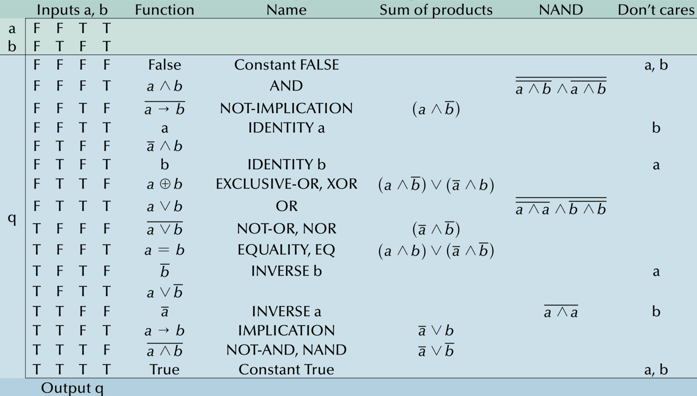

---

## What does this have to do with my discoboard?

## Logic gates

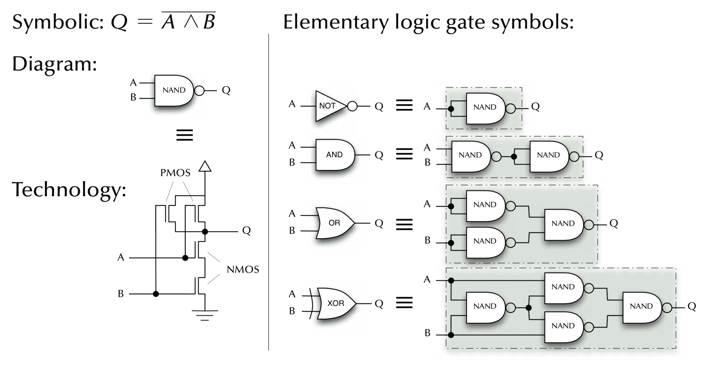

---

## How does your computer add 1+1?

---

## How would a 5yo do it? 

## Number representations

Remember that an integer can be represented in a different "base" (or "radix"),
e.g. binary (base-2), octal (base-8), hexadecimal (base-16) or the familiar
decimal (base-10).

*Note: hex & binary padded to 32-bit, negative numbers represented with 32-bit
two's complement*

# Combinational logic

## Let's start simple: 1+1

Consider the boolean function $s(a, b) = a + b$ (the s is short for *sum*). How
would we put this in a (pseudo) truth table?

| a | b | s |
|---|---|---|
| 0 | 0 | 0 |
| 0 | 1 | 1 |
| 1 | 0 | 1 |
| 1 | 1 | 2 |

## Not quite...

This doesn't really work because we can't have *three* distinct values (0, 1 and
2) in boolean algebra. But what if we just consider one "column" of the
addition?

| a | b | s |               |
|---|---|---|---------------|
| 0 | 0 | 0 |               |
| 0 | 1 | 1 |               |
| 1 | 0 | 1 |               |
| 1 | 1 | 0 | (carry the 1) |

## Add a c (carry) column

| a | b | s | c |
|---|---|---|---|
| 0 | 0 | 0 | 0 |
| 0 | 1 | 1 | 0 |
| 1 | 0 | 1 | 0 |
| 1 | 1 | 0 | 1 |

---

<!-- _class: impact -->

**bit** == **b**inary dig**it**

## But what is $s(a,b)$?

The truth table *is* a complete spec for the function $s(a, b)$ that we're
interested in, but it doesn't tell us how to express $s$ using the rules we
looked at earlier.

| a | b | s | c | s minterms | c minterms |
|---|---|---|---|------------|------------|
| 0 | 0 | 0 | 0 |            |            |
| 0 | 1 | 1 | 0 | ¬a ∧ b     |            |
| 1 | 0 | 1 | 0 | a ∧ ¬b     |            |
| 1 | 1 | 0 | 1 |            | a ∧ b      |

s = (a ∧ ¬b) ∨ (¬a ∧ b) = a ⊕ b

c = a ∧ b

## Half-adder

s = a ⊕ b

c = a ∧ b

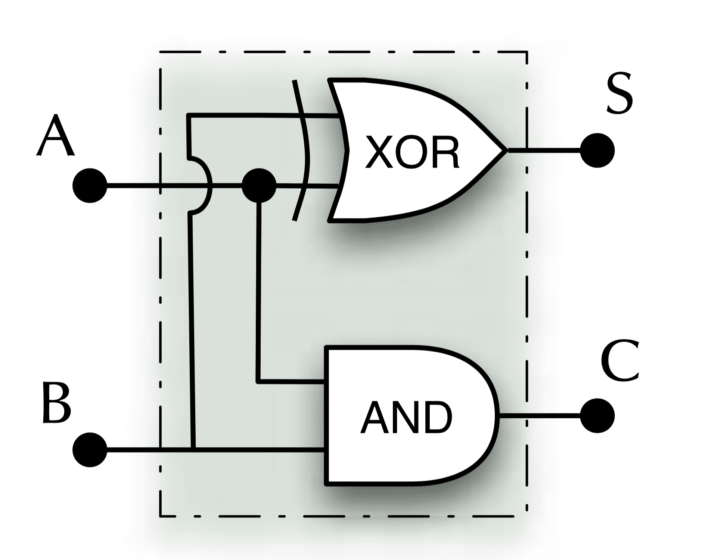

## DLS: Digital Logic Simulator

[DLS](https://makingartstudios.itch.io/dls) is a time-driven event-based
multi-delay 3-value digital logic simulator.

There's both [desktop](https://makingartstudios.itch.io/dls) (cheap) &
[web](http://dls.makingartstudios.com/sandbox/) (free) versions (although the
web version [chugs](http://dls.makingartstudios.com/sandbox/))

DLS isn't compulsory for the course, but it's a nice way for me to demo things.

---

## Half-adder

## What about carry *out*?

What's missing with the half-adder? Carry *in* (ci) as well as carry out (co).

| a | b | ci | s | co |
|---|---|----|---|----|
| 0 | 0 |  0 | 0 |  0 |
| 0 | 1 |  0 | 1 |  0 |
| 1 | 0 |  0 | 1 |  0 |
| 1 | 1 |  0 | 0 |  1 |
| 0 | 0 |  1 | 1 |  0 |
| 0 | 1 |  1 | 0 |  1 |
| 1 | 0 |  1 | 0 |  1 |
| 1 | 1 |  1 | 1 |  1 |

s = (a ∧ ¬b ∧ ¬ci) ∨ (¬a ∧ b ∧ ¬ci) ∨ (¬a ∧ ¬b ∧ ci) ∨ (a ∧ b ∧ ci)

&nbsp;&nbsp;&nbsp;= (((a ∧ ¬b) ∨ (¬a ∧ b)) ∧ ¬ci) ∨ (((¬a ∧ ¬b) ∨ (a ∧ b)) ∧ ci)

&nbsp;&nbsp;&nbsp;= ((a ⊕ b) ∧ ¬ci) ∨ ((a = b) ∧ ci)

&nbsp;&nbsp;&nbsp;= ((a ⊕ b) ∧ ¬ci) ∨ (¬(a ⊕ b) ∧ ci)

&nbsp;&nbsp;&nbsp;= (a ⊕ b) ⊕ ci

## Full-adder

cout = (a ∧ b) ∨ ((a ⊕ b) ∧ cin)
*(trust me!)*

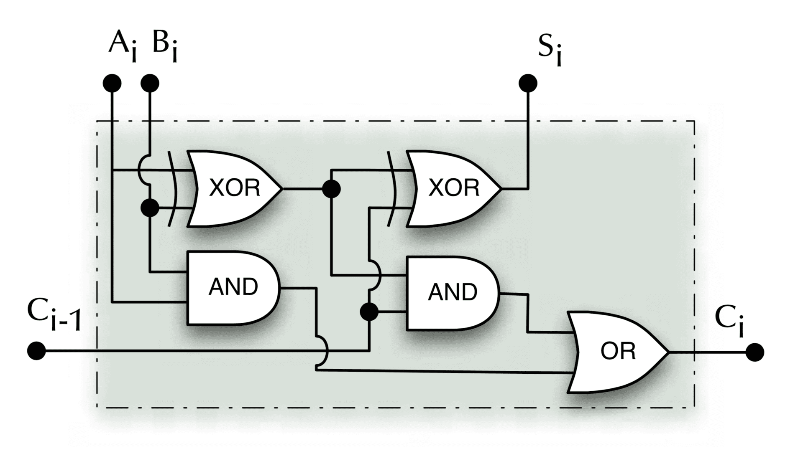

---

## Full-adder

## Ripple-carry adder

We can join them together like so:

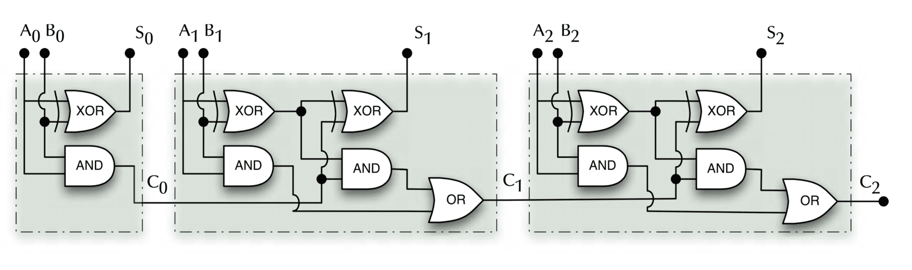

---

<!-- _class: talk-box -->

## talk

1. how many bits can be added together?
2. how long does it take?
3. where does the final carry bit go?

## What about subtraction?

We've got two options:

1. do some more minterms stuff (boo!)
2. trick the full *adder* into subtracting things instead

**show of hands?**

## Twos complement representation

The basic idea: can we define (binary) negative numbers such that our adder still works?

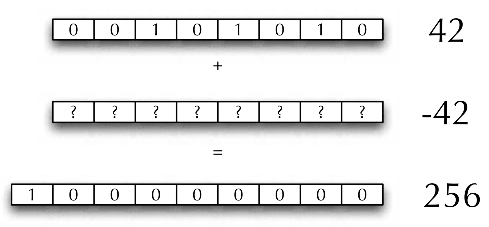

## Twos complement representation

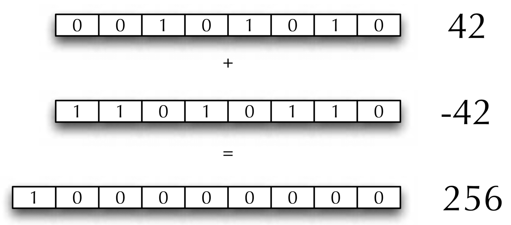

also remember the [number conversion widget](#converter-slide) from earlier

## [The twos complement "circle"](https://www.allaboutcircuits.com/technical-articles/twos-complement-representation-theory-and-examples/)

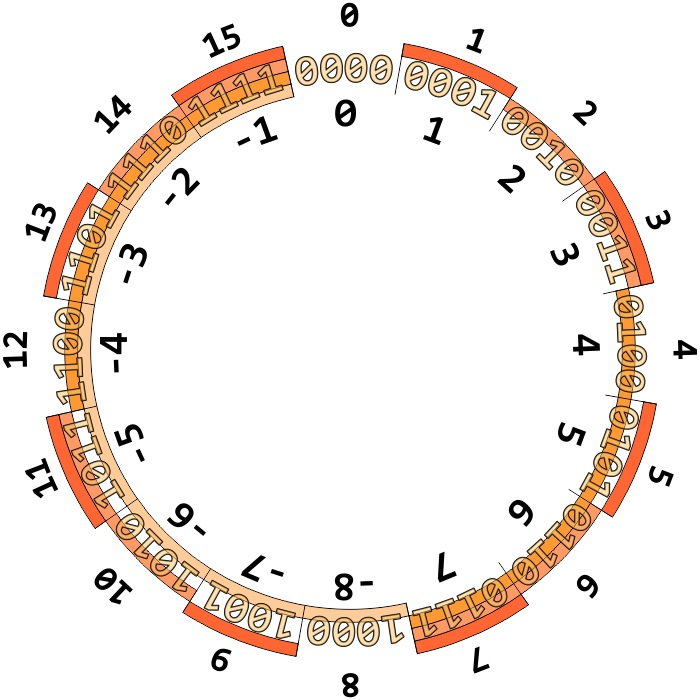

---

## Quiz: negative or positive?

`0b10`

`0b011011`

`0b011011101110101010010`

`0b1011000000000011101111111111101010010000000001010101`

---

<!-- _class: impact -->

it's all in your **mind**

## Simple ALU

A simple ALU (Arithmetic & Logic Unit) which can ADD, XOR, AND, OR two
arguments.

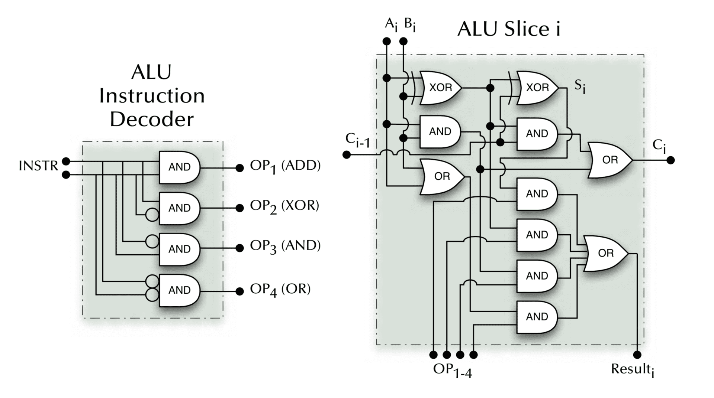

# Sequential logic

---

<!-- _class: talk-box -->

## talk

What does it mean for a computer to have **memory**? Can the combinational logic
functions we've looked at so far *remember* things?

---

<!-- _class: impact -->

no! we need **feedback**

## Sequential == state-oriented

This makes intuitive sense---the feedback loop allows the current output to be
fed back in (as input).

Sequential logic circuits can no longer be treated as "pure" input-output black
boxes---they carry "state" (i.e. the **sequence** of inputs matters).

## SR latch

S (set), R (reset)

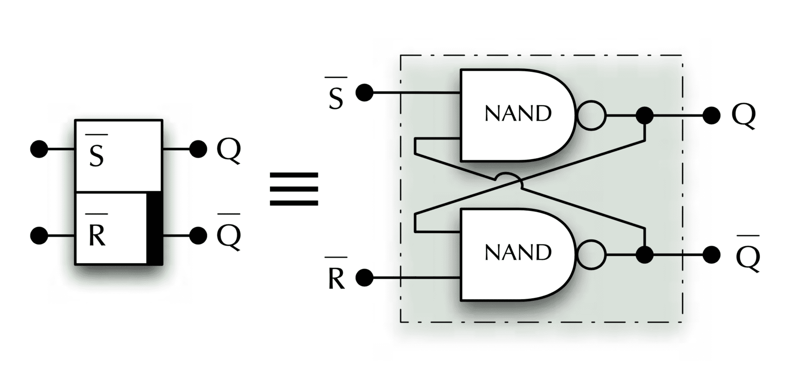

[stackexchange](https://electronics.stackexchange.com/questions/51625/why-is-the-output-of-stateful-elements-often-named-q)
asks: "Why is the output of stateful elements often named Q?"

## SR input

There are four possible input combinations:

| ¬s | ¬r | *effect*                               |
|----|----|----------------------------------------|
|  1 |  1 | keep current state q                   |
|  0 |  1 | set q (to 1)                           |
|  1 |  0 | reset q (to 0)                         |
|  0 |  0 | **forbidden** (q and ¬q both set to 1) |

---

## SR latch

## Problems with the SR latch

1. the forbidden thing (this is obviously bad)
2. there are some tricky timing issues (because physics: remember, there are
   *real* electrons flying around)

## Gated D latch

The gated D latch uses a *clock* input, and gets rid of the forbidden input
problem.

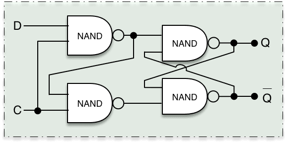

## JK master-slave flip-flop

Better again: no timing problems, no forbidden inputs, toggle operation
(although it's a more complex circuit)

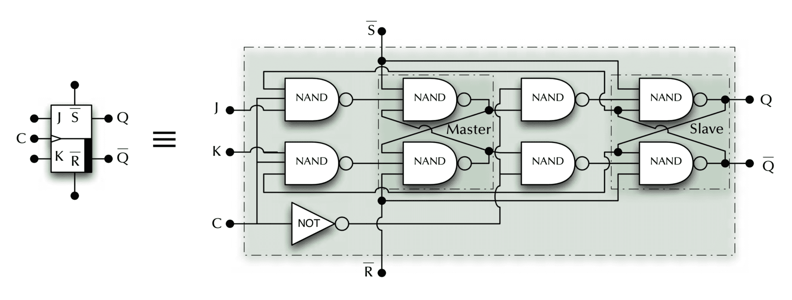

---

<iframe width="1120" height="630" src="https://www.youtube.com/embed/EYl2NwDr1aM" frameborder="0" allowfullscreen></iframe>

## Register

Store multiple bits, can serve as general-purpose *fast* on-CPU
storage, or hold state for peripherals, etc. Note the shared clock line

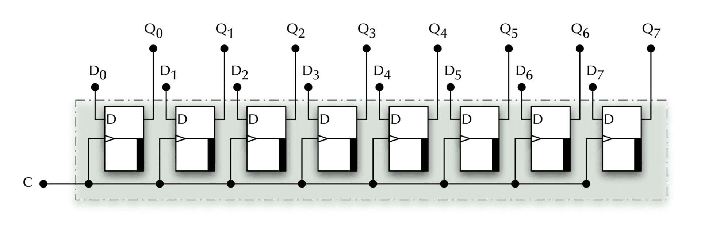

## Counter

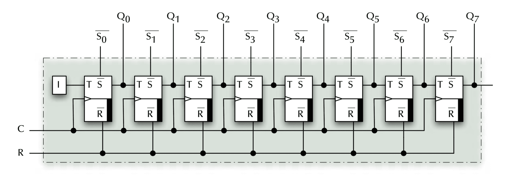

Your discoboard has several of these!

<!-- ## Simple CPU architecture -->

---

## Further reading

[Introduction to Computer Organization](/resources/04-books-links/#plantz) by Robert G. Plantz is
freely available online, and it's really helpful with this stuff (see chapters
5-7).

Also see *Appendix A “The Basics of Logic Design”* in [Patterson &
Hennessy](/resources/04-books-links/#patterson-hennessy)

---

## Feeling lost?

---

## Big picture

These are all physical components in your computer---there's no magic, just
physics.

But there are **billions** of them.

## Next week

In **lectures**, we'll explore the arithmetic & logic operations the discoboard's
ARM CPU can perform.

In **labs**, you'll be writing your first assembly code instructions, then
picking them apart to see how they work.

---

---

## Questions

---

<!-- _class: impact -->

[next lecture](/lectures/02-alu-operations/)
