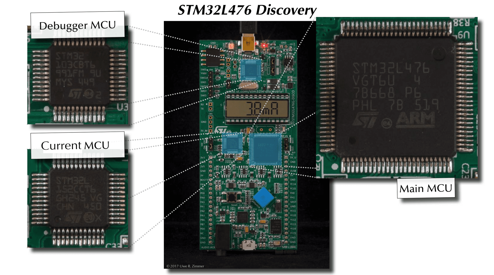
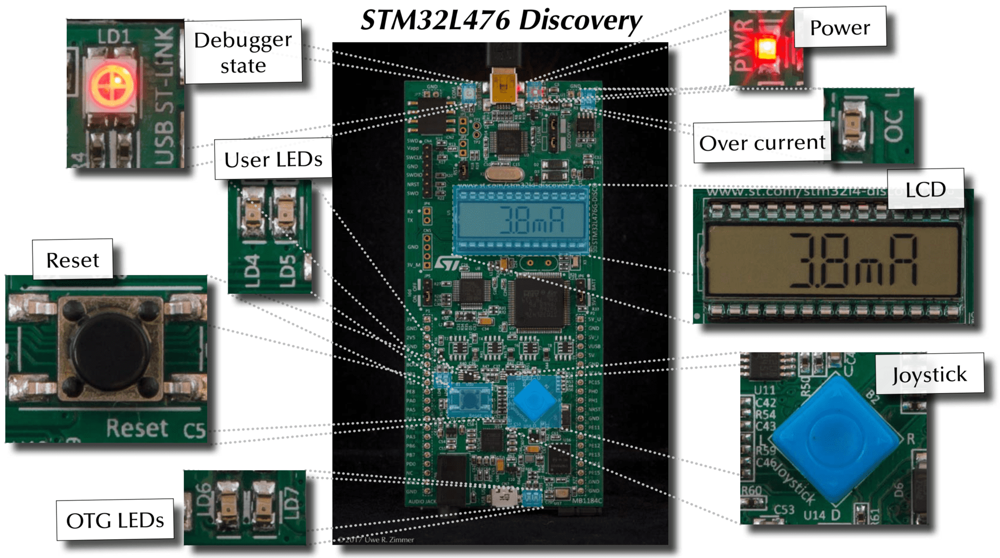
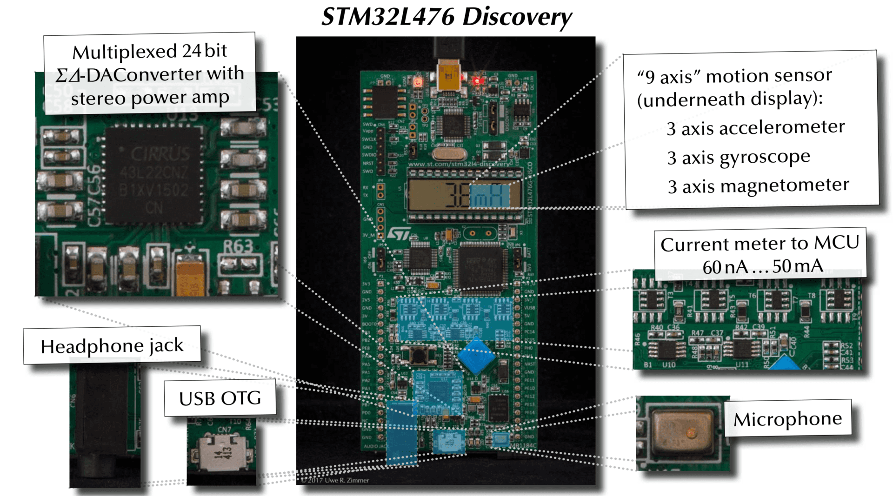
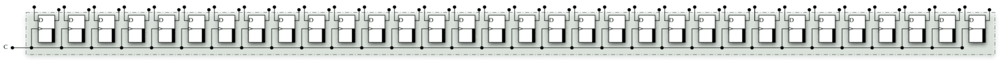
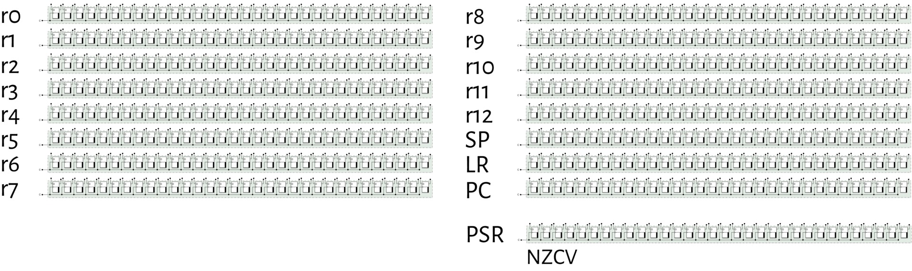
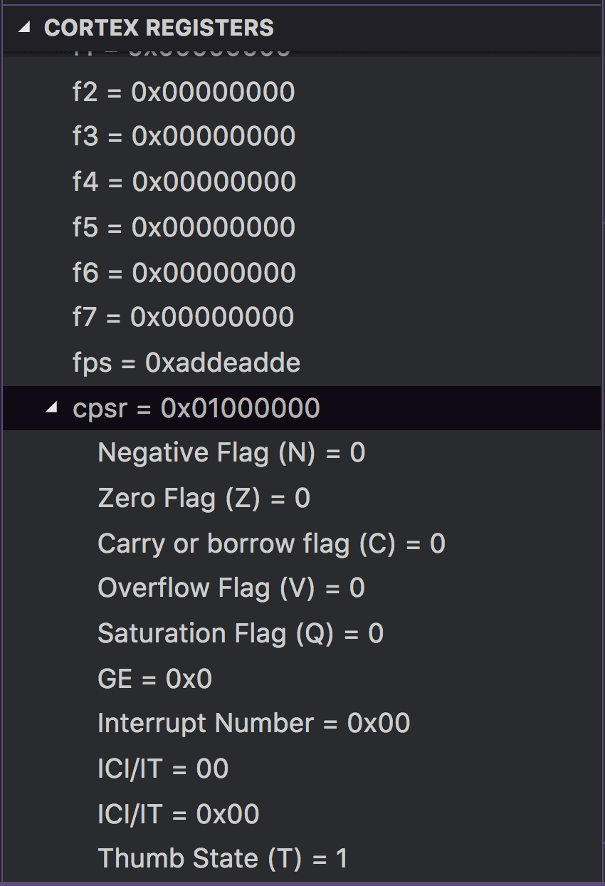
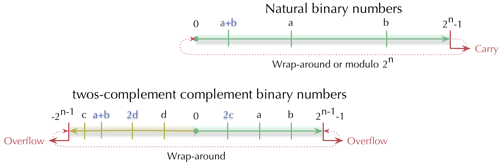

<!-- _class: banner -->

# COMP2300


# Week 2: ALU operations

---

<!-- _class: info-box -->

## info

There are some software issues in the labs at the moment (really slow network &
install process)

Sorry about this, and thanks for your patience

Work with a friend, **meet someone new**

Finally, I've updated the VSCode extension.

---

<!-- _class: info-box -->

## info

Make-up lab for all Monday lab students:

- Friday March 2 **1800--2100** in N115/116

I know it's late (again, it's really hard to squeeze things in) but I encourage
you to attend if you can

## Outline

- [a tour of your discoboard](#a-tour-of-your-discoboard)
- [Instructions](#instructions)
- [Control flow](#control-flow)
- [Condition flags](#condition-flags)


# A tour of your discoboard

---



---



---



---


## There's lots of stuff on your discoboard

Way more than you can master in a one-semester course...


... but you'll understand a lot more about it by the end of the course than you do now


# Instructions

## Recap: a 32-bit register

It's just a bunch of sequential (stateful) circuits hooked up to a common clock
line (like we discussed last week)




## Moar registers!

Registers are usually grouped in **banks** (groups). Here are the 16
general-purpose registers in your discoboard's CPU




---

<!-- _class: talk-box -->

## talk

Back to 1 + 2, but this time, in C

``` c
int x = 1 + 2;
```

How do you think this might work in silicon?

How does this relate to the gates and things that we looked at last week?

## Breaking it down

``` c
int x = 1 + 2;
```

So, there are three steps:

1. get a `1` into a register
2. get a `2` into another register
3. tell the ALU to add them and put the result into *another* register

## First assembly code

``` ARM
@ move a 1 into r0
movs r0, 1
@ move a 2 into r1
movs r1, 2
@ add them together, put result in r2
adds r2, r0, r1
```

---


## Let's do it for reals

## Addition in machine code

``` ARM
adds <Rd>, <Rn>, <Rm>
```

The add instruction is **encoded** into this 16-bit value


| 15 | 14 | 13 | 12 | 11 | 10 | 9 | 8 | 7 | 6 | 5 | 4 | 3 | 2 | 1 | 0 |
|----|----|----|----|----|----|---|---|---|---|---|---|---|---|---|---|
|  0 |  0 |  0 |  1 |  1 |  0 | 0 | m | m | m | n | n | n | d | d | d |

- the `0001100` part is the **op**eration **code** (opcode)
- the other parts (`m`, `n`, `d`) are the arguments

## Example: addition in machine code

``` ARM
adds r2, r0, r1
```

Here, `Rd` is `r2`, `Rn` is `r0` and `Rm` is `r1`


| 15 | 14 | 13 | 12 | 11 | 10 | 9 | 8 | 7 | 6 | 5 | 4 | 3 | 2 | 1 | 0 |
|----|----|----|----|----|----|---|---|---|---|---|---|---|---|---|---|
|  0 |  0 |  0 |  1 |  1 |  0 | 0 | m | m | m | n | n | n | d | d | d |


So what does the instruction look like?


| 15 | 14 | 13 | 12 | 11 | 10 | 9 | 8 | 7 | 6 | 5 | 4 | 3 | 2 | 1 | 0 |
|----|----|----|----|----|----|---|---|---|---|---|---|---|---|---|---|
|  0 |  0 |  0 |  1 |  1 |  0 | 0 | 0 | 0 | 1 | 0 | 0 | 0 | 0 | 1 | 0 |

## Assembly code vs machine code

There's a *direct* mapping between the two, although the discoboard only
understands the machine code (of course!)

We use assembly code because:
- it's easier for humans to read/write
- it gives a *little* bit of flexibility (as we'll see shortly)

## The assembler

The word **assembly**/**assembler** is *way* overloaded in computer
architecture. It might mean

- the human-readable assembly code, e.g.
``` ARM
adds r2, r0, r1
```
- the [program](/resources/04-books-links/#gas) for
  encoding that human-readable statement into the binary machine code (the `1`s
  and `0`s)
- the *process* of doing that conversion

## GNU Assembler

The [PlatformIO](http://docs.platformio.org/en/latest/) toolchain we use in this
course uses **gas**: the [**G**NU **As**sembler](/resources/04-books-links/#gas) (part of
[binutils](https://www.gnu.org/software/binutils/))

The assembler determines the acceptable syntax for your assembly `.S` files
(there are multiple syntaxes---there's no one "assembly language", even for a
specific board)

---

<!-- _class: talk-box -->

## talk

So, registers are just like variables... right? Discuss with your neighbour

## The move instruction

Ok, let's get back to our `1` + `2` program. `adds` lets us add the numbers in
the registers, but how do we get the numbers (i.e. `1` and `2`) into the
program?

``` ARM
movs <Rd>, #<imm8>
```


| 15 | 14 | 13 | 12 | 11 | 10 | 9 | 8 | 7 | 6 | 5 | 4 | 3 | 2 | 1 | 0 |
|----|----|----|----|----|----|---|---|---|---|---|---|---|---|---|---|
|  0 |  0 |  1 |  0 |  0 |  d | d | d | i | i | i | i | i | i | i | i |

The clever idea: store the **immediate** value *inside* the instruction!

---

<!-- _class: talk-box -->

## talk

if this is the move instruction:


| 15 | 14 | 13 | 12 | 11 | 10 | 9 | 8 | 7 | 6 | 5 | 4 | 3 | 2 | 1 | 0 |
|----|----|----|----|----|----|---|---|---|---|---|---|---|---|---|---|
|  0 |  0 |  1 |  0 |  0 |  d | d | d | i | i | i | i | i | i | i | i |

what does the following instruction do?


| 15 | 14 | 13 | 12 | 11 | 10 | 9 | 8 | 7 | 6 | 5 | 4 | 3 | 2 | 1 | 0 |
|----|----|----|----|----|----|---|---|---|---|---|---|---|---|---|---|
|  0 |  0 |  1 |  0 |  0 |  1 | 0 | 0 | 0 | 0 | 0 | 0 | 1 | 1 | 0 | 1 |

## So what instructions are possible?

That's determined by the Instruction Set Architecture (ISA)

Also specifies the number & size of the registers, memory and a few other things

*Many* CPUs share the same instruction set (that's kindof the point)

## ARM Cortex-M series CPU

From the [ARM website](https://www.arm.com/products/processors/cortex-m):

> The Arm Cortex-M processor family is a range of scalable, energy efficient and
> easy-to-use processors that meet the needs of tomorrow’s smart and connected
> embedded applications

The discoboard has a [Cortex-M4 CPU](https://en.wikipedia.org/wiki/ARM_Cortex-M#Cortex-M4)

## ARMv7 reference manual

The discoboard (like all Cortex-M series processors) uses the
[ARMv7-M](/resources/04-books-links/#armv7-reference) ISA

You'll be looking at this a *lot* in the course---whenever you need more info
than the cheat sheet provides

## The COMP2300 cheat sheet

It's available from the [resources page](/resources/04-books-links/#cheat-sheet)

## Understanding the instruction syntax

```
add&#123;s&#125;<c><q> &#123;<Rd>,&#125; <Rn>, <Rm> &#123;,<shift>&#125;
```

- anything inside curly brackets `&#123;&#125;` is optional
- anything inside angle brackets `<>` is a placeholder for different argument
  values
- register arguments `Rn`/`Rm`/`Rd` you've seen already (e.g. `r3`)

## Understanding the instruction syntax

```
add&#123;s&#125;<c><q> &#123;<Rd>,&#125; <Rn>, <Rm> &#123;,<shift>&#125;
```

- the optional `<c>` suffix makes the command *conditional*
- the optional `<q>` specifies an instruction width (`n`/`w`)
- `&#123;,<shift>&#125;` means that the value in the register is bit-shifted first

## Assembler syntax: optional arguments

Sometimes the syntax specifies that a register argument is optional

This doesn't mean that those bits are missing from the encoding!

Instead, it means that the registers are re-used (overwriting what was there
before)

---


## You'll learn the syntax by using it

Especially in [labs!](/labs/index/)

## RISC

Reduced Instruction Set Computing (RISC) is an approach to ISA design where
there are only a few instructions, and to do more complex things you just "chain
them together"

The R in A**R**M stands for RISC

There are other options: CISC (Complex Instruction Set Computing)

## Multi-width instructions

Your discoboard actually supports a few *different* encodings for some
instructions

All Cortex-M processors run in Thumb-2 mode, which includes both 16-bit and
32-bit instructions (you'll examine this in [lab 2](/labs/02-first-machine-code/))

The registers are always 32-bit, though

---


## So many names!

ARM, Cortex, M, Thumb-2, oh my!

Some of this stuff was designed (well) from the start, some was added later...

There are 100+ billion of these things out there---some diversity is to be
expected

<!-- ## Wide instructions -->

<!--  -->

<!-- | 31 | 30 | 29 | 28 | 27 | 26 | 25 | 24 | 23 | 22 | 21 | 20 | 19 | 18 | 17 | 16 | 15 | 14 | 13 | 12 | 11 | 10 | 9 | 8 | 7 | 6 | 5 | 4 | 3 | 2 | 1 | 0 | -->
<!-- |----|----|----|----|----|----|----|----|----|----|----|----|----|----|----|----|----|----|----|----|----|----|---|---|---|---|---|---|---|---|---|---| -->
<!-- |  0 |  0 |  0 |  0 |  0 |  0 |  0 |  0 |  0 |  0 |  0 |  0 |  0 |  0 |  0 |  0 |  0 |  0 |  0 |  0 |  0 |  0 | 0 | 0 | 0 | 0 | 0 | 0 | 0 | 0 | 0 | 0 | -->

## The reference manual

There's a full list of all instructions & encodings in the [ARM®v7-M
Architecture Reference
Manual](/assets/manuals/ARMv7-M-architecture-reference-manual.pdf),
section 7.7 (starting on p184)

It's got *all* the gory details

Let's find the `mov` instruction...

---


## Questions

## Immediate vs register instructions

Some instructions require *register* "arguments": places where the bits in the
encoded instruction specify which registers to read from/write to.

``` arm
adds r2, r0, r1
```

Other instructions have immediate values (`#<const>`) on the cheat sheet where
the *actual value* is encoded in the instruction.

``` arm
movs r0, 1
```

Some folks have been looking through the reference manual, and noticed that some
instructions have both an **immediate** version and a **register** version

## Example: add

Here's `add` (immediate) (encoding T2, A7.7.3 in the [reference manual](/resources/04-books-links/#armv7-reference))


| 15 | 14 | 13 | 12 | 11 | 10 | 9 | 8 | 7 | 6 | 5 | 4 | 3 | 2 | 1 | 0 |
|----|----|----|----|----|----|---|---|---|---|---|---|---|---|---|---|
|  0 |  0 |  1 |  1 |  0 |  d | d | d | i | i | i | i | i | i | i | i |

Here's `add` (register) (encoding T1, A7.7.4 in the [reference
manual](/resources/04-books-links/#armv7-reference))


| 15 | 14 | 13 | 12 | 11 | 10 | 9 | 8 | 7 | 6 | 5 | 4 | 3 | 2 | 1 | 0 |
|----|----|----|----|----|----|---|---|---|---|---|---|---|---|---|---|
|  0 |  0 |  0 |  1 |  1 |  0 | 0 | m | m | m | n | n | n | d | d | d |

---

<!-- _class: talk-box -->

## talk

why do we need both immediate and register versions of these instructions?

---


## Instructions == the <em>language</em> of the CPU

the `1`s and `0`s **encode** the instruction

the CPU understands them (if they're part of the language it speaks, i.e. the ISA)

the CPU does exactly what it's told *at that moment*

but what about the next moment? And the one after that?


# Fetch-decode-execute cycle

---

<iframe width="1120" height="630" src="https://www.youtube.com/embed/P-Nc4gKwKo8" frameborder="0" allowfullscreen></iframe>

---


## Recap: ARMv7-M registers


## the `pc` register

Register 15 (`r15`) is a bit special in this ISA---it's the **p**rogram
**c**ounter

Imagine all the instructions in your program are lined up, one after the
other...

the program counter is like a bookmark keeping track of where the CPU is up to


(for *where* the instructions are lined up, wait till next week)

## Fetch-decode-execute

During execution, your discoboard:

1. *fetches* the next instruction based on `pc`
2. *decodes* which operation (`add`, `sub`, etc.) to perform (and on which registers)
3. *executes* the instruction

then it goes back to step 1 and repeats the process


the **fetch-decode-execute** cycle

---

<!-- _class: impact -->

just like **karaoke**

---


# Condition flags

---

<!-- _class: impact -->

what's with the **s** in **adds**

## Where does the final "carry out" go?

Remember last week we wondered where the last "carry" bit goes in our ripple
carry adder?

Answer: the carry flag/bit (in the **status register**)

## Program status register

The ARMv7-M ISA specifies a program status register (PSR) for keeping track of
various important bits of state associated with the current computation

The 4 highest bits (`31`:`28`) are the NZCV flags:

- **N**egative
- **Z**ero
- **C**arry
- O**v**erflow

## In VSCode (the c stands for "current")




---

<!-- _class: impact -->

**much** nicer than last year

😊

## "Set flags" instructions

If there's an `s` on the end of the instruction, it means that the instruction
will set the flags (if appropriate) based on the **result** of the instruction

This is specified by a certain bit in the encoding (in some of the encodings,
anyway)

You don't have to set flags---the `s` is *optional*

## Recap: natural (unsigned) & twos-complement (signed) binary numbers



---


## Think of the velodrome

## Negative

This status flag is set when the result of an ALU operation is negative *if
interpreted as a twos complement signed integer*

``` ARM
movs r0, 5
movs r1, 6
subs r2, r0, r1
```

don't forget the `s` suffix

---

<!-- _class: talk-box -->

## talk

``` ARM
movs r0, 5
movs r1, 6
subs r2, r0, r1
```

What flags will be set after the `subs` instruction is executed?

---


## We'll demo all of these, just to be sure!

## Zero

This status flag is set when the result of an ALU operation is zero

``` ARM
movs r5, 5
movs r6, -5
adds r4, r5, r6
```

## Carry

This status flag is set when the result of an ALU operation requires a "carry
out" *if interpreted as an unsigned 32-bit integer* (i.e. it requires 33 or more
bits to represent)

``` ARM
movs r2, 0xFF000000
movs r3, 0xFF000000
adds r5, r2, r3
```

## Overflow

This status flag is set when the result of an ALU operation would overflow the
min/max value *if interpreted as a twos complement signed integer*

``` ARM
movs r0, 0x7FFFFFFF @ largest signed integer
adds r0, 1
```

``` ARM
movs r0, 0x80000000 @ smallest signed integer
subs r0, 1
```

## `adc` vs `add`

The `adc` (add with carry) instruction is really similar to the `add`
instruction, but it also adds the *current* value of the carry flag to the
result

``` arm
mov r1, 5
mov r2, 16
adc r3, r1, r2
```

---

<!-- _class: talk-box -->

## talk

``` arm
mov r1, 5
mov r2, 16
adc r3, r1, r2
```

What value will be in r3 after the above instructions are executed?

## Worked example: 64-bit addition

Can we add numbers bigger than the (32-bit) word size? Yes!

- assume numbers in `r3`:`r2` and `r5`:`r4`
- we want to store the 64-bit result in `r1`:`r0`

``` arm
adds r0, r2, r4 @ add least significant words, set flags
adcs r1, r3, r5 @ add most significant words and carry bit
```

## More flags

The status register is 32-bit, and there are more flags than these 4---but
they're the main ones

You'll use them (a lot!) in the week 3 lab

We'll introduce the other flags as necessary later in the course

---


## On purity...

Remember Haskell? Lovely pure functions---no outside state or side effects

The **real world**? Messy, stateful---yuck! But we can get things done

## Arithmetic instructions


``` ARM
add&#123;s&#125;<c><q> &#123;<Rd>,&#125; <Rn>, <Rm> &#123;,<shift>&#125; @ Rd := Rn + Rm(shifted)
adc&#123;s&#125;<c><q> &#123;<Rd>,&#125; <Rn>, <Rm> &#123;,<shift>&#125; @ Rd := Rn + Rm(shifted) + C
add&#123;s&#125;<c><q> &#123;<Rd>,&#125; <Rn>, #<const>        @ Rd := Rn + #<const>
adc&#123;s&#125;<c><q> &#123;<Rd>,&#125; <Rn>, #<const>        @ Rd := Rn + #<const> + C
qadd<c><q> &#123;<Rd>,&#125; <Rn>, <Rm>              @ Rd := Rn + Rm @ saturated
sub&#123;s&#125;<c><q> &#123;<Rd>,&#125; <Rn>, <Rm> &#123;,<shift>&#125; @ Rd := Rn - Rm(shifted)
sbc&#123;s&#125;<c><q> &#123;<Rd>,&#125; <Rn>, <Rm> &#123;,<shift>&#125; @ Rd := Rn - Rm(shifted) - NOT (C)
rsb&#123;s&#125;<c><q> &#123;<Rd>,&#125; <Rn>, <Rm> &#123;,<shift>&#125; @ Rd := Rm(shifted) - Rn
sub&#123;s&#125;<c><q> &#123;<Rd>,&#125; <Rn>, #<const>        @ Rd := Rn - #<const>
sbc&#123;s&#125;<c><q> &#123;<Rd>,&#125; <Rn>, #<const>        @ Rd := Rn - #<const> - NOT (C)
rsb&#123;s&#125;<c><q> &#123;<Rd>,&#125; <Rn>, #<const>        @ Rd := #<const> - Rn
qsub<c><q> &#123;<Rd>,&#125; Rn, Rm                  @ Rd := Rn - Rm @ saturated
```

## Next week

In **lectures**, we'll be looking storing & accessing data in memory

In **labs**, you'll explore the cheat sheet (and your discoboard's ALU) by
writing your first discoboard game

---

<!-- _class: info-box -->

## info

Make-up lab for all Monday lab students:

- Friday March 2 (tomorrow) **1800--2100** in N115/116

---


## Questions?

---

<!-- _class: impact -->
