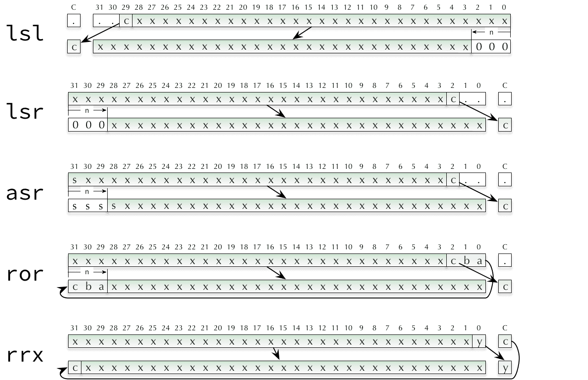
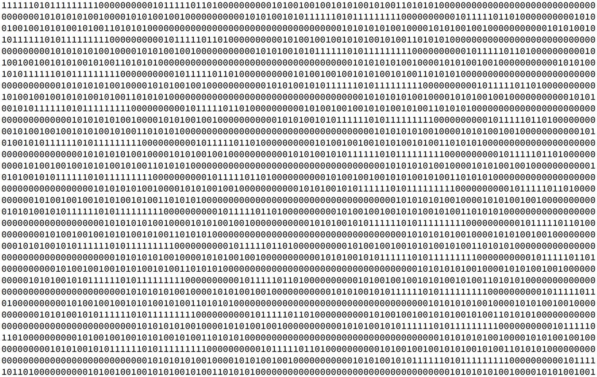
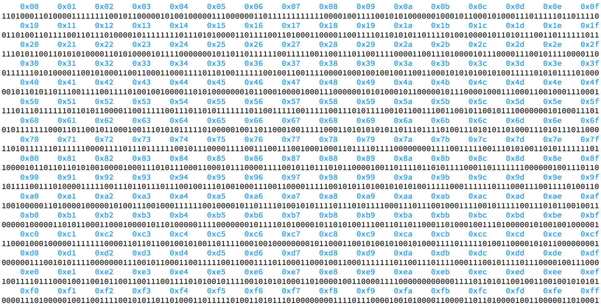

<!-- _class: banner -->

# COMP2300

---

<!-- _class: impact -->

there's a [hurdle lab](/labs/04-hurdle-lab/) next
week


# Week 3: Memory Operations

## Outline

- [addresses](#addresses)
- [load/store instructions](#load-store-instructions)
- [address space](#address-space)
- [labels & branching](#labels-and-branching)

---


## Memory is how your CPU interacts with the outside world

---


---

<!-- _class: impact -->

but first, a few more **instructions**

## Bitwise instructions

Not all instructions treat the bit patterns in the registers as "numbers"

Some treat them like bit vectors (`and`, `orr`, etc.)

There are even some instructions (e.g. `cmp`, `tst`) which don't calculate a
"result" but they **do** set the flags

Look at the **Bit operations** section of your cheat sheet

## Example: bitwise clear

``` arm
mov r1, 0xFF
mov r2, 0b10101010
bic r3, r1, r2
```

`r1`


| 31 | 30 | 29 | 28 | 27 | 26 | 25 | 24 | 23 | 22 | 21 | 20 | 19 | 18 | 17 | 16 | 15 | 14 | 13 | 12 | 11 | 10 | 9 | 8 | 7 | 6 | 5 | 4 | 3 | 2 | 1 | 0 |
|----|----|----|----|----|----|----|----|----|----|----|----|----|----|----|----|----|----|----|----|----|----|---|---|---|---|---|---|---|---|---|---|
|  0 |  0 |  0 |  0 |  0 |  0 |  0 |  0 |  0 |  0 |  0 |  0 |  0 |  0 |  0 |  0 |  0 |  0 |  0 |  0 |  0 |  0 | 0 | 0 | 1 | 1 | 1 | 1 | 1 | 1 | 1 | 1 |

`r2`


|----|----|----|----|----|----|----|----|----|----|----|----|----|----|----|----|----|----|----|----|----|----|---|---|---|---|---|---|---|---|---|---|
|  0 |  0 |  0 |  0 |  0 |  0 |  0 |  0 |  0 |  0 |  0 |  0 |  0 |  0 |  0 |  0 |  0 |  0 |  0 |  0 |  0 |  0 | 0 | 0 | 1 | 0 | 1 | 0 | 1 | 0 | 1 | 0 |

`r3`


|----|----|----|----|----|----|----|----|----|----|----|----|----|----|----|----|----|----|----|----|----|----|---|---|---|---|---|---|---|---|---|---|
|  0 |  0 |  0 |  0 |  0 |  0 |  0 |  0 |  0 |  0 |  0 |  0 |  0 |  0 |  0 |  0 |  0 |  0 |  0 |  0 |  0 |  0 | 0 | 0 | 0 | 1 | 0 | 1 | 0 | 1 | 0 | 1 |

## Bit-shifts and rotations

Other instructions will shift (or rotate) the bits in the register, and there
are lots of different ways to do this!

See the **Shift/Rotate** section of the cheat sheet

Be careful of the difference between **logical** shift and **arithmetic** shift

---



## ARM barrel shifter

Your discoboard's CPU actually has special hardware (called a "barrel shifter")
to perform these shifts as part of another instruction (e.g. an add); that's
what `&#123;, <shift>&#125;` means on e.g. the cheat sheet

There are dedicated bit shift instructions (e.g. `lsl`) and other instructions
which can take an extra shift argument, e.g.

``` ARM
@ some examples
adds r0, r2, r1, lsl 4

mov r3, 4
mov r3, r3, lsr 2
mov r3, r3, lsr 3 @ off the end!
```

---


## Is that everything?

We haven't looked at everything on the cheat sheet


(not even close!)


The cheat sheet doesn't have everything in the reference manual


(not even close!)


But you can do a lot with just the basics, and you can refer to the cheat sheet
whenever you need it

---

<!-- _class: talk-box -->

## talk

- how do you keep track of all the registers you're using in your program?
- what if you "run out"?


# Memory addresses

## ...but registers can store data

Yes, they can! That's what we've been doing with the instructions so far (e.g.
`mov`, `add`, etc.) manipulating values in registers.

Registers are super-convenient for the CPU, because they're inside the CPU
itself.

And we can give them all special names---`r0`, `r9`, `lr`, `pc`, etc.

---


## A pet duck for COMP2300

## Random Access Memory

RAM (Random Access Memory) is for storing lots data

Perhaps 
- character data for a MMORPG
- rgb pixel data from a high-resolution photo
- or the machine code instructions which make up a large program

[Current price](https://pcpartpicker.com/trends/price/memory/): ~$200 for 16GB

## RAM types

Two main types:
1. **s**tatic RAM (SRAM)
2. **d**ynamic RAM (DRAM)

SRAM is faster, more expensive and physically larger---it's used in caches &
situations where performance is crucial

DRAM is slow(er), more power-efficient, cheaper and physically denser---it's
used where you need more capacity (bytes)

Most CPUs have both types, but when you talk about the RAM in your gaming rig,
you're usually referring to DRAM

---


---

<!-- _class: impact -->

now we've got an **addressing** problem

---



## Memory addresses

The solution: refer to each different section of memory with a (numerical)
address

Each of these addressable units is called a *cell*

Think of it like a giant array in your favourite programming language:

``` java
byte[] memory = &#123; 80, 65, 54, /* etc. */ &#125;;
```

---


## Analogy: street addresses

<!-- for generating the "pictures" -->
<!-- (with-current-buffer (get-buffer "test") -->
<!--   (-dotimes -->
<!--       16 -->
<!--     (lambda (r) -->
<!--       (-dotimes 16 (lambda (c) -->
<!--                      (insert (format "    0x%02x" (+ c (* r 16)))))) -->
<!--       (insert "\n") -->
<!--       (-dotimes (* 16 8) (lambda (c) -->
<!--                            (insert (format "%d" (random 2))))) -->
<!--       (insert "\n")))) -->

---



## Byte addressing (addresses in blue)

---


## The byte: the smallest addressable unit

One interesting question: what should the smallest addressable unit be? In other
words, how many bits are in each bucket? 1, 8, 16, 32, 167?

The ARMv7-M ISA uses 8-bit **bytes** (so do *most* of the systems you'll come
across these days)

Usually, we use a lowercase b to mean bits, and an uppercase B to mean bytes,
e.g. 1M**b**ps == 1 million **bits** per second, 3.9 G**B** means 3.9 billion
**bytes**

---

<!-- _class: impact -->

8 bits == 1 **byte**

---


## Why 8 bits to a byte?

Again, there's no fundamental reason it had to be that way

But there's a trade-off between the number of bits you can store and the address
granularity (why?)

8 bits provides 256 ($2^8$) different values, which is enough to store an
[ASCII](https://en.wikipedia.org/wiki/ASCII) character

---


## A memory address is just a number

## A note about "drawing" memory

It's a one-dimensional array (i.e. there's just a single numerical address for
each memory cell)

When "drawing a picture" of memory (like in the earlier slides) sometimes we
draw left-to-right (with line wrapping!), sometimes top-to-bottom, sometimes
bottom-to-top

It doesn't matter! The **address is all that matters**

---

<!-- _class: talk-box -->

## talk

Can you get data in and out of memory with the instructions we've covered
already in the course?


**nope.**


# Load/store instructions

## Load instructions

We need a new instruction (well, a bunch of them actually)

`ldr` is the the `l`oa`d` `r`egister instruction

It's on the cheat sheet under **Load & Store**

## Loading from memory *into* a register

Any load instruction loads (reads) some bits from memory and puts them in a
register of your choosing

The data in memory is unaffected (it doesn't take the bits "out" of memory,
they're still there after the instruction)

``` arm
@ load some data into r0
ldr r0, [r1]
```

## What's with the `[r1]`?

Here's some new syntax for your `.S` files: using a register name inside square
brackets (e.g. `[r1]`)

This means interpret the value in `r1` as a **memory address**, and read the
32-bit word at that memory address into `r0`

---

<!-- _class: impact -->

remember, memory addresses are **just a number**

## Addresses in immediate values?

Can we specify the memory address in an immediate value?


Yes, but the number of addresses would be limited to what could fit in the
instruction encoding (remember, that's what immediates are!)


But more often you'll read the address from a register (so you get the full
$2^{String.fromCharCode(123)}32{String.fromCharCode(125)}$ possible addresses, but you have to get the address into a register
before the `ldr` instruction)

## `ldr` example

``` arm
mov r1, 0x20000000 @ put the address in r1
ldr r0, [r1]       @ load the data into r0
```


What value will be in `r0`?

---


## Let's find out

---


## Now, with buckets!

---


## The converter slide


---


## Are these valid memory addresses?

`0x55`

`0x5444666`

`-9`

`0x467ab787e`


**Answers:** yes, yes, yes, no (too big!)

---


## ARM immediate value encoding

ARM instructions have at most 12 bits of room for immediate values (depending on
encoding), but it can't represent all the values 0 to 4096 ($2^{String.fromCharCode(123)}12{String.fromCharCode(125)}$)

Instead, it uses an 8-bit immediate with a 4-bit rotation---Alistair McDiarmid
has a [really nice blog
post](https://alisdair.mcdiarmid.org/arm-immediate-value-encoding/) which
explains how it works

## Storing to memory

Ok, so we *probably* want to put some data in memory first

The ARMv7-M has a paired `st`ore `r`egister instruction for `ldr`, which takes a
value in a register and stores (writes) it to a memory location

``` arm
str r0, [r1]
```

Again, the `[r1]` syntax means "use the value in `r1` as the memory
address"---this time the address to store the data to

## `str` example

``` arm
mov r0, 42
mov r1, 0x20000000
str r0, [r1]
```

What will the memory at `0x20000000` look like after this?

---


## Moar livecoding

## Endianness

The fundamental issue here: memory is **byte** addressable, but a register can
fit 4 bytes

So we can load up to 4 bytes into a register---which order do we "combine" them in?

---


---


## Why do I need to care?

Because the memory at those addressees might have been:
- the result of a `str` operation from your discoboard
- read from a file created on some other machine
- received over the network

Little-endian is now more common, but it's important to know that other options
exist

---

<!-- _class: impact -->

you looked at this in the **week 2 lab**

---


## Further reading on endianness

- [https://betterexplained.com](https://betterexplained.com/articles/understanding-big-and-little-endian-byte-order/)
- [https://www.embedded.com](https://www.embedded.com/design/mcus-processors-and-socs/4440613/Endianness)

## Load/store halfwords & bytes

Sometimes, you just want to read a byte or a halfword (2 bytes), even though
you've got a 4 byte register

The instruction set provides additional load/store instructions for this:

``` arm
ldrb @ load byte from register
ldrh @ load halfword from register
strb @ store byte to register
strh @ store halfword to register
```

They work just the same, but they read fewer bytes from memory (and pad the
value in the register with zeroes)

---

<!-- _class: talk-box -->

## talk

Are these byte/halfword versions of the instructions necessary? Or could you
live without them?

---


## the <em>address</em> & the <em>value at that address</em> are different (but they're both just numbers)

remember the buckets!

## More load/store options

There are more ways to use these load/store instructions than what we've covered
here, but we'll get to them later in the course

---


## Questions


# Memory address space

---


## Address space?

## Address space

The address space is the set of all valid addresses

So on a machine with 32-bit addresses (like your discoboard) that's $2^{String.fromCharCode(123)}32{String.fromCharCode(125)} = 4
294 967 296$ different addresses

So you can address about 4GB of memory (is that a lot?)

---


---


## A memory address is just a number

## Not all memory is the same

You can see from the diagram on the previous slide: the address space is divided
into "chunks"

Some parts look like "memory" as we've been talking about so far (e.g. SRAM,
External RAM) but some parts don't (e.g. Peripherals)

## The load/store architecture

What if everything the CPU did in interacting with the outside
world was treated like a load or a store to a memory address?

- loading & storing data to RAM
- configuring the various peripherals on the board
- blinking the LED
- firing the missiles!

This is the idea behind the load/store architecture, and it's the model your
discoboard CPU uses

## Recap: reading memory diagrams

You'll see "Memory diagrams" (picture representations of data in memory, or at
least in the Cortex address space)

Look for the addresses---which direction are they ascending/descending?

Remember that the spatial layout can be misleading!

---


## Not all memory is "data"

Some of it is:
- **r**eadable
- **w**ritable
- e**x**ecutable
- connected to external peripherals (which could still be **r**, **w**, **x** or
  some combination)

This is a consequence of the load/store model: we *treat* everything like
memory, because it makes the CPU simpler

## STM32L476VG memory map

The discoboard conforms to that Cortex M memory map (since it's a Cortex M CPU)

But even within those memory ranges the addresses of specific peripherals (e.g.
timers, GPIO, LCD, audio codec) are **unique** to this particular model of
discoboard

To find out more, you need the [discoboard reference manual](/resources/04-books-links/#discoboard-reference)


This is one of the main differences between different microcontrollers---the
memory maps they use for peripherals

## Code in memory

You probably noticed the **Code** section at the bottom (i.e. the lower memory
addresses) of the address space/memory map diagram

That's where the encoded [instructions](/lectures/02-alu-operations/#instructions) are: this is sometimes called
the *instruction stream*

Each instruction has a memory address

That's where the [fetch-decode-execute](/lectures/02-alu-operations/#fetch-decode-execute) cycle *fetches* from
(based on the **address** in the `pc` register)


# Labels and branching

## Labels: addresses for humans

All these 32-bit numbers are fine for the discoboard, but not so good for humans

[Labels](https://sourceware.org/binutils/docs/as/Labels.html#Labels) provide a
way to (temporarily) give a name to a memory address

You've seen labels already---`main` is one! Any word followed by a colon (`:`)
in your assembly code is a label

## Label gotchas

- [only certain characters are allowed in label
  names](https://sourceware.org/binutils/docs/as/Symbol-Names.html#Symbol-Names)
- a label is not an instruction, it doesn't get encoded, it's not in memory
- by default, labels aren't "visible" outside the source file
- the label points to the address of the *next* instruction (whether it's on the
  same line or a newline)

``` arm
@ these two are the same
label1: mov r0, 5

label1:
  mov r0, 5
```

---


## Branch: select the next instruction to execute

Remember the "Adele problem"? How do we go back to the chorus after the second
verse?

The answer: change the value in the program counter (`pc`) to "jump back" to an
earlier instruction

To do this, use a `b` (branch) instruction, e.g.

``` arm
b 0x80001c8
```

---


## Branch? Why not jump?

---

<!-- _class: impact -->

but where to branch **to**?

## Labels in the instruction stream

You don't want to have to figure out the address of the instruction "by hand"
and move it into the `pc`

So we use labels in the assembly code to keep track of the addresses of specific
instructions

And there's a `b` (branch) instruction to tell your discoboard to make the jump
to that instruction

## Branch & labels example

``` arm
main:
  mov r0, 0

@ infinite loop - r0 will overflow eventually
loop:
  add r0, 1
  b loop
```

---


## Branches & labels are best friends :)

## Conditional branch

``` arm
b<c> <label>
```

The `<c>` suffix tells us that the branch instruction knows about the [condition
flags](/lectures/02-alu-operations/#condition-flags), i.e. NZCV


This is **huge**.

## Conditional branch examples

``` arm
beq <label> @ branch if Z = 1
bne <label> @ branch if Z = 0
bcs <label> @ branch if C = 0
bcc <label> @ branch if C = 1
bmi <label> @ branch if N = 1
bpl <label> @ branch if N = 0
bvs <label> @ branch if V = 1
bvc <label> @ branch if V = 0
```

See the back of the [cheat sheet](/resources/04-books-links/#cheat-sheet) for the full list

---

<!-- _class: talk-box -->

## talk

Does your discoboard need to know about the labels? Where is that information
stored?

## Labels: just for humans

When you build your program, the
[linker](https://sourceware.org/binutils/docs/ld/) program:
1. figures out what exact memory addresses the labels refer to, and
2. swaps all the label names for the 32-bit address values the discoboard
   understands


``` text
Compiling .pioenvs/disco_l476vg/src/main.S.o
Linking .pioenvs/disco_l476vg/firmware.elf
Calculating size .pioenvs/disco_l476vg/firmware.elf
text       data     bss     dec     hex filename
792        1080    1600    3472     d90 .pioenvs/disco_l476vg/firmware.elf
Building .pioenvs/disco_l476vg/firmware.bin
```

---


## Your CPU never knows about the labels

The linker replaces them all with addresses before you create the binary file
(e.g. `firmware.bin`) which is uploaded to your discoboard

## Memory segmentation

The other thing that the linker does is to make sure that the various parts of
your program get put in the right part of the address space

- make sure secret data isn't readable
- make sure code/instructions isn't writable
- make sure "storage" memory isn't executable

This is a good thing™

It's all controlled by the linker file<br>
(`lib/bare_stm32l476/ldscripts/STM32L476VG_FLASH.ld`)

---


## Questions?

---

<!-- _class: info-box -->

## info

Remember---there's a [hurdle lab](/labs/04-hurdle-lab/) next week

If you're in a Monday lab, you can either attend the make-up lab, or attend any
other lab (please be patient!)

---

<!-- _class: impact -->
