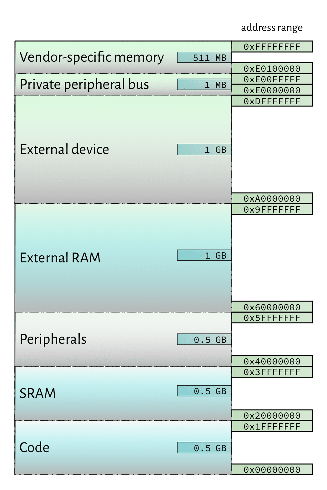

<!-- _class: banner -->

# COMP2300

---

<!-- _class: info-box -->

## info

[assignment 1](/deliverables/01-synth/) template
repo is now available

read the page carefully (including the [FAQ](/deliverables/01-synth/#faq)) and ask questions **early**

---


## Questions about the assignment?


# Week 4: Control Flow

## Outline

- squiggle recap
- [where in memory does it go?](#where-in-memory)
- [conditionals](#conditionals)
- [loops](#loops)


---

<!-- _class: impact -->

squiggle recap


# But *where* in memory does it go?

---



## Recap: cortex memory map

As we saw [last week](/lectures/03-memory-operations/#memory-address-space) the lowest (in terms of memory addresses) part of the
address space is for instructions/code

The SRAM is the next lowest---how do we put stuff in there?

## "Value" directives in assembler code

As well as instructions (e.g. `mov`, `mul`), there are certain
assembler
[directives](https://sourceware.org/binutils/docs/as/Pseudo-Ops.html#Pseudo-Ops)
where the assembler doesn't do any "encoding"---it just plonks the value in to
the instruction stream as-is

- [`.byte`](https://sourceware.org/binutils/docs/as/Byte.html#Byte) inserts a byte
- [`.hword`](https://sourceware.org/binutils/docs/as/hword.html#hword) inserts a
  halfword (2 bytes/16-bits)
- [`.word`](https://sourceware.org/binutils/docs/as/Word.html#Word) inserts a
  word (4 bytes/32-bits)
- [`.ascii`](https://sourceware.org/binutils/docs/as/Ascii.html#Ascii) inserts an
  ASCII encoded sequence of bytes
- [`.asciz`](https://sourceware.org/binutils/docs/as/Asciz.html#Asciz) inserts an
  ASCII encoded sequence of bytes followed by a `0`

## Multiple value syntax

Each of these directives allows you to insert multiple values, one-after-the-other:

``` arm
.byte 1, 5, 0xf2, 0b110100 @ 4 bytes total
.hword 0, 0, 0x1234        @ 3x2=6 bytes
.word 0xdeadbeef, 0x5      @ 2x4=8 bytes
```

## `.hword` example

``` ARM
adds r2, r0, r1
```


| 15 | 14 | 13 | 12 | 11 | 10 | 9 | 8 | 7 | 6 | 5 | 4 | 3 | 2 | 1 | 0 |
|----|----|----|----|----|----|---|---|---|---|---|---|---|---|---|---|
|  0 |  0 |  0 |  1 |  1 |  0 | 0 | 0 | 0 | 1 | 0 | 0 | 0 | 0 | 1 | 0 |

``` ARM
.hword 0xffa3
```


| 15 | 14 | 13 | 12 | 11 | 10 | 9 | 8 | 7 | 6 | 5 | 4 | 3 | 2 | 1 | 0 |
|----|----|----|----|----|----|---|---|---|---|---|---|---|---|---|---|
|  ? |  ? |  ? |  ? |  ? |  ? | ? | ? | ? | ? | ? | ? | ? | ? | ? | ? |

## Load and store with offset

Recall that `ldr`/`str` require a memory address to load/store to

``` arm
ldr r0, [r1] @ r1 holds the memory address
```

There are also "offset" versions of these instructions:

``` arm
@ address in r1, load value at address+4
ldr r0, [r1, 4]

@ address in r1, store value to address-4
str r0, [r1, -4]
```

it's all on the [cheat sheet](/resources/04-books-links/#cheat-sheet)

---

<!-- _class: impact -->

the memory address is still in the square brackets

---

<!-- _class: talk-box -->

## talk

When might these "load/store with offset" versions of the `ldr`/`str`
instructions be useful? Think of as many scenarios as you can!

---


## Bucket time!

## Putting values in the instruction stream

What will this program do? Hint: which address does the `pc` register "point
to"?

``` arm
main:
  ldr r0, [pc, 4]
  b main

  .align 2
beefword:
  .word 0xdeadbeef
```

## The `ldr=` pseudo-instruction

This is such a useful trick (because it allows for ) that the assembler provides
a special syntax for it (note the `=` sign before the value):

``` arm
ldr r2, =0xdeadbeef
```

It's called a
[*pseudo*-instruction](http://infocenter.arm.com/help/index.jsp?topic=/com.arm.doc.dui0489i/Babbfdih.html)
because the assembler might actually produce a different instruction (e.g. a
`mov` instead of an `ldr`)

---


## What instruction is actually used?

---


## Why <code>0xDEADBEEF</code>?

There are a bunch of numeric literal values which are often used in systems
programming, e.g. `0xDEADBEEF`, `0x8BADF00D` (used on iOS)

Wikipedia has [a list of
them](https://en.wikipedia.org/wiki/Magic_number_(programming)#Magic_debug_values)
if you're interested

But there's nothing special about them (from the discoboard's perspective)

## Loading a label address into a register

This is used all the time to load the value of a [label](/lectures/03-memory-operations/#labels-and-branching) (which is just a
memory address) into a register (so you can load or store to that address)

This instruction loads it's *own address* into `r0` (how meta!)

``` arm
loop:
  ldr r0, =loop
```

## What's code and what's data?

We need to be careful about these words (code and data), because there's no
difference between them from the discoboard's point of view

- you can [put instructions in your program using `.hword`](/labs/02-first-machine-code/#reverse-engineering)
- you can put data in your program with an assembly instruction (how?)

---

<!-- _class: impact -->

but it's all just **0**s and **1**s in memory

---


## When you look at <em>any</em> assembly code, think:

what will it get encoded to (0s and 1s)

where in memory (i.e. at which *addresses*) will those 0s and 1s live when the
program is running?

## The `.data` section

All of this stuff still only affects what goes in the code section---how do we
put stuff in SRAM?

We use the `.data` assembler directive (and a [label](/lectures/03-memory-operations/#labels-and-branching) for keeping track of
the memory address)

``` arm
  ldr r0, =stuff @ load address of stuff into r0
  ldr r1, [r0]
  @ more code here...

  .data @ from here on, everything goes in the data section
stuff:
  .word 0xdeadbeef
```

---

<!-- _class: talk-box -->

## talk

What will be in `r0` after the second line of the program has been executed?

``` arm
  ldr r0, =stuff @ load address of stuff into r0
  ldr r1, [r0]
  @ more code here...

  .data
stuff:
  .word 0xdeadbeef
```

---


## Deadbeef? Not vegan-friendly!

let's change it up

---

<!-- _class: info-box -->

## info

[Mid-semester exam](/01-policies.md#mid-sem-exam)

- **date**: Wednesday 28/03/2018
- **time**: 3:30pm
- **duration**: 15 minutes reading, 90 minutes writing
- **weight**: 13 marks
- **venue**:
  - *Addison, C -- Naylor-Pratt, J*: Croatian Club Downstairs Hall
  - *Nepal, B -- Zou, F*: QT Hotel Exhibition Room
- **permitted materials**: one A4 page with notes on both sides
- **more information**: <http://quicklink.anu.edu.au/buao>

## What did we just do?

1. put some data in SRAM (near `0x20000000`) using a `.data` section
2. read, modified and wrote back a new value


the extra stuff in the startup file (e.g. `LoopCopyDataInit`) *is* important
here (try deleting it and re-running the program)

This is necessary because the discoboard doesn't let you **write** to any
addresses in the code section

---


## So is there a <code>.code</code> assembler directive as well as <code>.data</code>?

Well, yep---but it's actually called
[`.text`](https://sourceware.org/binutils/docs/as/Text.html#Text) (this is also
the "default" section)

## Sections in an assembly code file

You can organise the sections in your source `.S` file however you like, e.g.

``` arm
  .text
  @ anything here is code
  @ ...
  .data
  @ anything here will go in SRAM
  @ ...
  .text
  @ back to code
  @ ...
```

the [linker file](/lectures/03-memory-operations/#memory-segmentation) makes sure everything gets put into the right place in
the memory space

---

<!-- _class: impact -->

`.text` and `.data` are **not** [labels](/lectures/03-memory-operations/#labels-and-branching)

---


## Further reading

[*Patterson & Hennessy*](/resources/04-books-links/#patterson-hennessy)

Chapter 2: "Instructions: Language of the Computer"


# Conditionals

---

<!-- _class: talk-box -->

## talk

When you hear the term **Structured Programming**, what do you think of---apart
from COMP1110 :)

How does all that stuff translate to writing assembly code?

---


## How do we organise/structure our programs?


because copy-pasting **sucks**

---

<!-- _class: impact -->

control flow is about conditional execution

## "condition" expressions

1. `x < 13`
2. `x == 4`
3. `x != -3 && y > x`
4. `length(list) < 128`

These all evaluate to a [boolean](/lectures/01-intro-and-digital-logic/#boolean-algebra) **True** or
**False** (depending on the value of the variables)

---


## Quiz

How might you express:

`>` (greater than)

`==` (equals)

`!=` (not equals)

`<=` (less than *or* equal to)

## CPSR table


| `<c>` | meaning                 | flags     |
|-------|-------------------------|-----------|
| eq    | equal                   | Z=1       |
| ne    | not equal               | Z=0       |
| cs    | carry set               | C=1       |
| cc    | carry clear             | C=0       |
| mi    | minus/negative          | N=1       |
| pl    | plus/positive           | N=0       |
| vs    | overflow set            | V=1       |
| vc    | overflow clear          | V=0       |
| hi    | unsigned higher         | C=1 ∧ Z=0 |
| ls    | unsigned lower or same  | C=0 ∨ Z=1 |
| ge    | signed greater or equal | N=V       |
| lt    | signed less             | N≠V       |
| gt    | signed greater          | Z=0 ∧ N=V |
| le    | signed less or equal    | Z=1 ∨ N≠V |

## Example: `if (x == -24)`

``` arm
@ assume x is in r0
adds r1, r0, 24
beq then
```

In words:
- **if** x + 24 is zero (i.e. if it sets the [Z flag](/lectures/02-alu-operations/#condition-flags))
- **then** branch to the `then` label

## Example: `if (x > 10)`

``` arm
@ assume x is in r0
subs r1, r0, 10
bgt then
```

In words: 
- **if** x - 10 is (signed) greater than 0
- **then** branch to `then`

## Alternatives?

assume *x* is in `r0`

``` arm
cmp r0, 10
bgt then
```


``` arm
mov r1, 10
cmp r1, r0
bmi then
```


``` arm
mov r1, 11
cmp r0, r1 @ note the opposite order of r0, r1
bge then
```

---

<!-- _class: impact -->

are there others? 

which is the **best**?

## Conditional expressions in assembly

You need to get to know the different condition codes:

- what flags they pay attention to
- what they mean
- how to translate "variable" expressions into the right assembly instruction(s)

It's hard at first, but you get the hang of it. Practice, practice, practice!

## if-else statement gallery


## if-else statement components


## In assembly

1. check the condition (i.e. set some flags)
2. a [conditional branch](/lectures/03-memory-operations/#conditional-branch) to the "if"
   instruction(s)
3. the "else" instruction(s), which get executed if the conditional branch *isn't* taken

## if-else with labels, but no code (yet)

``` arm
if:
  @ set flags here
  b<c> then

then:
  @ instruction(s) here
  
else:
  @ instruction(s) here

rest_of_program:
  @ continue on...
```

---

<!-- _class: talk-box -->

## talk

What are the problems with this? (there are a few!)

``` arm
if:
  @ set flags here
  b<c> then

then:
  @ instruction(s) here
  
else:
  @ instruction(s) here

rest_of_program:
  @ continue on...
```

## A better if statement

``` arm
if:
  @ set flags here
  b<c> then
  b else @ this wasn't here before

then:
  @ instruction(s) here
  b rest_of_program
  
else:
  @ instruction(s) here

rest_of_program:
  @ continue on...
```

## The *best* if statement

``` arm
if:
  @ set flags here
  b<c> then

@ else label isn't necessary
else:
  @ instruction(s) here
  b rest_of_program

then:
  @ instruction(s) here
  
rest_of_program:
  @ continue on...
```

## Example: [absolute value function](https://en.wikipedia.org/wiki/Absolute_value)


``` arm
if:
  @ x is in r0
  cmp r0, 0
  blt then

else:
  @ don't need to do anything!
  b rest_of_program

then:
  mov r1, -1
  mul r0, r0, r1
  
rest_of_program:
  @ "result" is in r0
  @ continue on...
```

## Label name gotchas

Labels must be unique, so you can't have more than one `then` label in your file

So if you want more than one if statement in your program, you need

- `if_1`
- `then_1`
- `else_1`
- etc...

---

<!-- _class: info-box -->

## info

- [hurdle lab results are up](/labs/04-hurdle-lab/#seeing-your-marks)
- [more FAQ entries for assignment 1](/deliverables/01-synth/#faq)
- [mid-semester exam next week](/deliverables/04-mid-semester-exam/)


# Loops

## while loop gallery


## while loop components


## In assembly

1. check the condition (i.e. set some flags)
2. a [conditional branch](/lectures/03-memory-operations/#conditional-branch) to test whether or
   not to "break out" of the loop
3. if branch not taken, execute "loop body" code
4. branch back to step 1

## while loop with labels, but no code (yet)

``` arm
begin_while:
  @ set flags here
  b<c> while_loop
  b rest_of_program

while_loop:
  @ loop body
  b begin_while

rest_of_program:
  @ continue on...
```

## Example: `while (x != 5)`

``` c
while(x != 5)&#123;
  x = x / 2;
&#125;
```

``` arm
begin_while:
  cmp r0, 5
  bne while_loop
  b rest_of_program

while_loop:
  asr r0, r0, 1
  b begin_while

rest_of_program:
  @ continue on...
```

## A better while statement?

``` arm
begin_while:
  cmp r0, 5

  @ "invert" the conditional check
  beq rest_of_program

  asr r0, r0, 1
  b begin_while

rest_of_program:
  @ continue on...
```

## Things to note

- we needed to "reverse" the condition: the while loop had a **not** equal
  (`!=`) test, but the assembly used a branch if equal (`beq`) instruction
- we (again) use a `cmp` instruction to set flags without changing the values in
  registers
- loop body may contain several assembly instructions
- if *x* is not a multiple of 5, what will happen?

## for loop gallery


## for loop components


## In assembly

1. check some condition on the "index" variable (i.e. set some flags)
2. a [conditional branch](/lectures/03-memory-operations/#conditional-branch) to test whether or
   not to "break out" of the loop
3. if branch not taken, execute "loop body" code (which can use the index variable)
4. increment (or decrement, or whatever) the index variable
5. branch back to step 1

## for loop with labels, but no code (yet)

``` arm
begin_for:
  @ init "index" register (e.g. i)
loop:
  @ set flags here
  b<c> rest_of_program

  @ loop body

  @ update "index" register (e.g. i++)
  b loop

rest_of_program:
  @ continue on...
```

---

<!-- _class: impact -->

it's the same idea as **while**

## Example: oddsum

``` c
// sum all the odd numbers < 10
int oddsum = 0;
for (i = 0; i < 10; ++i) &#123;
  if(i % 2 == 1)&#123;
    oddsum = oddsum + i;
  &#125;
&#125;
```

## Oddsum in [Scheme](https://en.wikipedia.org/wiki/Scheme_%28programming_language%29)

``` scheme
(let ((oddsum 0))
  (dotimes (i 10)
    (if (= (% i 2) 1)
        (set! oddsum (+ oddsum i)))))
```

## Oddsum in asm

``` arm
begin_for:
  @ init "index" register (e.g. i)
loop:
  @ set flags here
  b<c> rest_of_program

  @ loop body

  @ update "index" register (e.g. i++)
  b loop

rest_of_program:
  @ continue on...
```

## There are other "looping" structures

- `do while` instead of just `while`
- iterate over collections (e.g. [C++ STL](https://en.wikipedia.org/wiki/Standard_Template_Library))
- loops with "early exit" (e.g. `break`, `continue`)
- Wikipedia has a [list](https://en.wikipedia.org/wiki/Control_flow#Loops)


But in assembly language they all share the basic features we've looked at here

---

<!-- _class: impact -->

write your own in [lab 5, Exercise 5](/labs/05-blinky/#fizzblink)

---


## Livecode: Shouty McShoutface

## Shouty McShoutface requirements

Goal: write a program to SHOUT any string

1. [ASCII](https://en.wikipedia.org/wiki/ASCII)-encode the string
2. store it in memory
3. loop over the characters:
   - if it's lowercase, overwrite that memory address with the uppercase version
   - if it's uppercase, leave it alone
4. stop when it reaches the end of the string

---

<!-- _class: impact -->

I'll push the code to [GitLab](https://gitlab.cecs.anu.edu.au/comp2300/2018/comp2300-2018-week-4-livecode)

---

<!-- _class: talk-box -->

## talk

Could we have used `ldr`/`str` instead of `ldrh`/`strh`? Is this a good idea?

## This is all pretty repetitive

We'll learn about assembler macros in week 6/7 to deal with this issue :)

---


## Questions?

---


---

<!-- _class: impact -->
