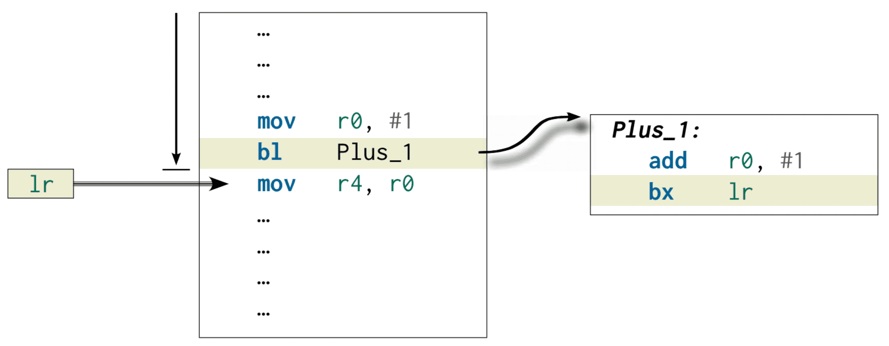
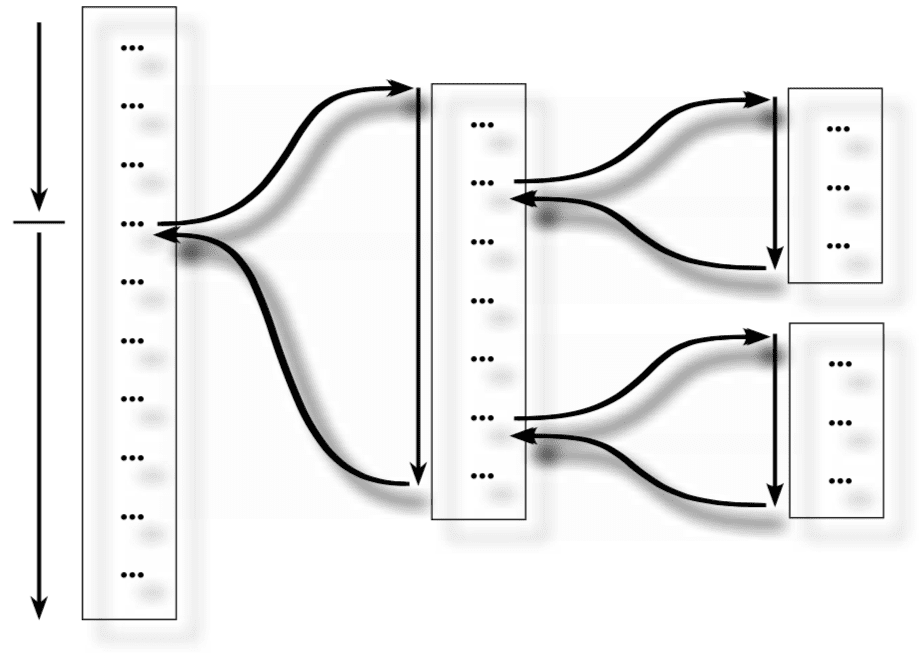
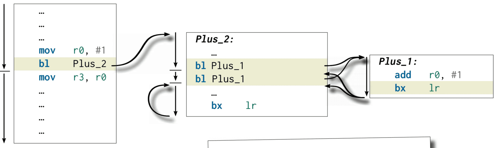
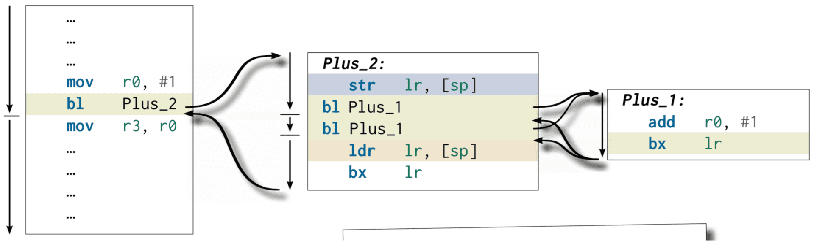
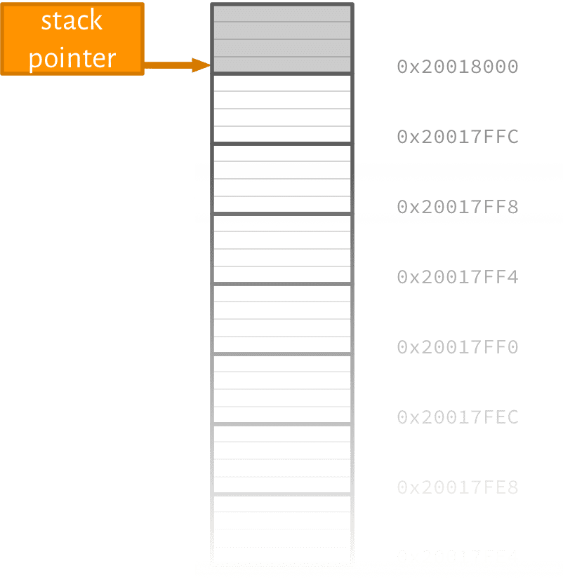
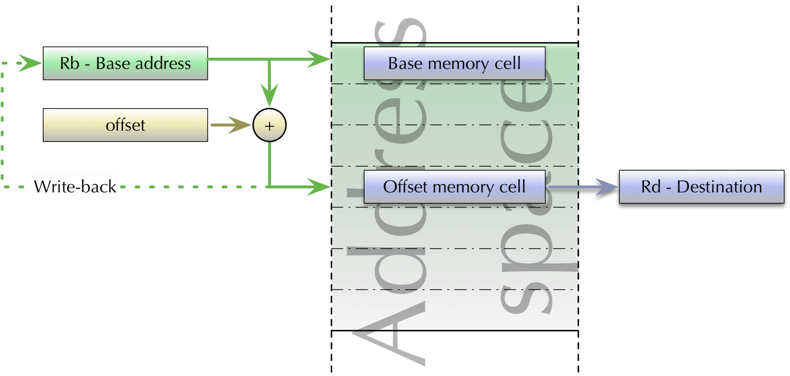
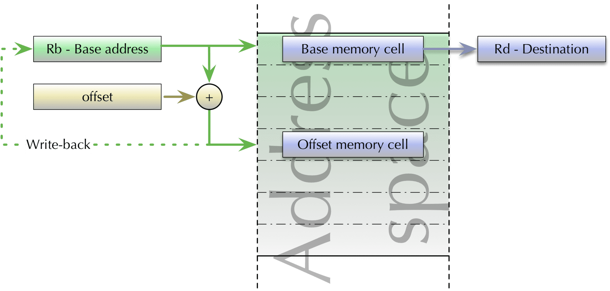
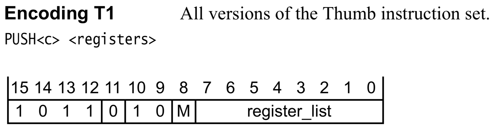

<!-- _class: banner -->

# COMP2300


# Week 5: Functions

---

<iframe width="1120" height="630" src="https://www.youtube.com/embed/IUZEtVbJT5c?t=11s" frameborder="0" allowfullscreen></iframe>

## Outline

- [why functions?](#why-functions)
- [calling conventions](#calling-conventions)
- [the stack](#stack)

---


because copy-pasting **sucks**

## Function gallery

``` python
def plus_1(x)
  return x + 1
```
``` java
public String plusOne(int x) &#123;
  return x + 1;
&#125;
```
```scheme
(define plus-1
  (lambda (x)
    (+ x 1)))
```

---

<!-- _class: impact -->

first, some **analogies**

---


## Good: pipe (input & output)

or "black box"

---


## Better: there, and back again

---

<!-- _class: impact -->

$f(a, b) = \int_a^b g(x) \mathrm{String.fromCharCode(123)}d{String.fromCharCode(125)}x$

## A function call


---

<!-- _class: talk-box -->

## talk

Can we do this with branch (`b`)?

## Open questions

- how does the program know where to come back to?
- how do we pass information (i.e. parameters) in?
- how do we get information (i.e. return values) back?
- can we have some "scribble paper"?


*note*: parameters/arguments - different words for the same thing

---


## Remember <a href=\


They *try* and leave a trail of breadcrumbs behind them so they can find their
way back.

## `bl`: branch with link

When the branch **with link** instruction (`bl`) is executed, the address of the
next instruction (i.e. the one *after* the `bl` instruction) is placed in a
special register

You've seen this already in [assignment 1](/deliverables/01-synth/)

## `lr`: the "link register"

Just like `r15` (`pc`), `r14` also has a special meaning---it's the *link
register*

## `bx`: branch and exchange

The `lr` might contain the address of the instruction we want to go back to, but
how do we actually **return** there?

The branch and exchange (`bx`) instruction branches not to a static label, but
to an address in a register

---


## Don't worry too much about the \

## Putting it all together



## What about conditional branches?

Both of these new branch instructions (`bl`) and (`bx`) can't be used
conditionally (e.g. with an `eq` suffix) in the ARMv7-M ISA your discoboard uses

There are ways around it, but they're beyond the scope of this course


but you don't need it anyway, you can use regular conditional branch (e.g.
`bgt`)

## Function template

``` arm
@ use the type directive to tell the assembler
@ that fn_name is a function (optional)
  .type fn_name, %function

fn_name: @ just a normal label
  @
  @ the body of the function
  @
  bx lr  @ to go back
```

---


## Functions are simple


use a `bl <label>` to branch **with link**


use a `bx lr` instruction to come back

---


## Live example: TV binging

## Nested functions



---


## So hot right now

---

<!-- _class: impact -->

did the breadcrumbs thing **work** for [Hansel &
Gretel](https://en.wikipedia.org/wiki/Hansel_and_Gretel)?

## Nested `Plus_1` (broken!)



---

<!-- _class: talk-box -->

## talk

How can we stop the "first" return address getting clobbered?


Sure, store it to memory, but *where*?

## Nested `Plus_1` (fixed!)



*this will work in this case, but there's still a slight problem with the use of
`sp` here---can you spot it?*

## The stack (sneak peek)

One final new register: the stack pointer (`sp`, but it's actually `r13`)

By convention: the value of the `sp` is an address in the SRAM region of the
address space (like with the `.data section`)

basically, it's memory you can use **to get things done**


We'll return to the stack [later](#stack)...

---


## Lots of new terms here

You'll write a *lot* of functions, so you'll get lots of time to practice.

---


## Questions

---

<!-- _class: info-box -->

## info

[assignment 1](/deliverables/01-synth/) due this Thursday

[mid-semester exam **tomorrow**](/deliverables/04-mid-semester-exam/)

I'm away for Easter & the first week of the break (so I won't be on the COMP2300 forum,
etc.)


# Calling conventions

## Open questions

- ~~how does the program know where to come back to?~~
- how do we pass information (i.e. parameters) in?
- how do we get information (i.e. return values) back?
- can we have some "scribble paper"?

---

<!-- _class: impact -->

assume *x* is in `r0`...

---


## We need a convention

an agreed-upon plan for where to find the input(s) and where to leave the result

## Calling convention definition

This is called a **calling convention** (CC)

It's a contract between the caller (the code which makes the function call with
`bl <label>`) and the callee (the code between `<label>` and the `bx lr`
instruction)

## What does the CC specify?

- where to look for the parameter values (the *inputs*)
- where to leave the *outputs*
- which registers to touch, which to leave alone

---

<!-- _class: talk-box -->

## talk

Which calling convention does this function use?

``` c
int do_all_the_things(int how_many_things)&#123;
  // lies! does *none* of the things
  return 0;
&#125;
```


**trick** question!

---


## There are many possible CCs

It doesn't matter which calling convention you use (as we'll see), as long as
the caller and the callee use the same convention

## CC example

Do these two two `Plus_1` functions both give the right answer (i.e. `x+1`)?
What's the difference?

``` arm
Plus_1:
  add r0, r0, 1
  bx lr
```
``` arm
Plus_1:
  add r5, r2, 1
  bx lr
```

## AAPCS

The [ARMv7 Architecture Procedure Call Standard](/assets/manuals/ARMv7-procedure-call-standard.pdf) is the convention we'll
(try to) adhere to in programming our discoboards

The full standard is quite detailed, but the general summary is:

- `r0`-`r3` are the parameter and scratch registers
- `r0`-`r1` are also the result registers
- `r4`-`r11` are callee-save registers
- `r12`-`r15` are special registers (`ip`, `sp`, `lr`, `pc`)

## What are scratch registers?

`r0`-`r3` are "scratch" registers, which means that the caller can freely use
them (and not worry about messing anything up)

These are also called "caller-save" registers, because if the caller wants to
preserve the values in them they need to save them somewhere

## Different ways to get data in/out

Do *these* two two `Plus_1` functions both give the right answer (i.e. `x+1`)?
What's the difference?

``` arm
@ pass by value
Plus_1:
  add r0, 1
bx lr
```
``` arm
@ pass by reference
Plus_1:
  ldr r3, [sp]
  add r3, 1
  str r3, [sp]
bx lr
```

## Pass-by-value vs pass-by-reference

Two different approaches to passing parameters and return values in and out of a
function.

- **pass by value** makes a "copy" (*can* mess with it without affecting the caller)
- **pass by reference** gives the callee access to the same bits as the caller


pros and cons to both, depends on the nature of the things being passed in and out

---

<!-- _class: impact -->

data needs to **live** in memory (registers are not for long-term storage)

---


## Simple functions fit on slides...


make sure you're practicing!


# The stack

## Open questions

- ~~how does the program know where to come back to?~~
- ~~how do we pass information (i.e. parameters) in?~~
- ~~how do we get information (i.e. return values) back?~~
- can we have some "scribble paper"?

## What about local variables?

``` javascript
function doStuff(a, b)&#123;
  let c = a+b;
  let d = a-b;
  let e = a*b;

  // function body here

&#125;
```


maybe put `c`, `d` and `e` in more registers?

## What about local variables?

``` javascript
function doArrayStuff(a, b)&#123;

  let person = &#123;
                 name: "Esmerelda",
                 age: 54,
                 pets: ["rex", "daisy"]
               &#125;;
  let junk = new Array(1000);

  // function body here

&#125;
```


there aren't enough registers this time

## The stack pointer (revisited)

The stack pointer (`sp`) contains a *memory address*, and this can be used by
functions for various purposes:
- "saving" values in registers which would otherwise be overwritten (e.g. `lr`)
- passing parameters/returning values
- temporary variables, e.g. "scribble paper"

It's called the stack because (in general) it's used like a first-in-last-out
(FILO) [stack "data
structure"](https://en.wikipedia.org/wiki/Stack_(abstract_data_type)) with two
main *operations*: *push* a value on to the stack, and *pop* a value off the
stack

---

<!-- _class: impact -->

but only if **you** follow the rules

## Setting up the stack

Look at the first instruction executed in the startup file:

```arm
ldr   sp, =_estack
```

Loads a value (`_estack`) into `sp` using the [ldr
pseudo-instruction](/lectures/04-control-flow/#ldr-pseudo-instruction)

The exact value of `_estack` comes from the [linker file](/lectures/03-memory-operations/#memory-segmentation) (line 34):

```c
/* Highest address of the user mode stack */
_estack = 0x20018000;    /* end of RAM */
```

## Stack pointer in memory




## More about the stack pointer

- the value (remember, it's a memory address) in `sp` changes as your program
  runs
- `sp` can either point to the last "used" address used (full stack) or the
  first "unused" one (empty stack)
- you (usually) don't care about the absolute `sp` address, because you use it
  primarily for offset (or relative) addressing
- stack can "grow" up (ascending stack) or down (descending stack)
- in ARM Cortex-M (e.g. your discoboard) the convention is to use a **full
  descending** stack starting at the highest address in the [address
  space](/lectures/03-memory-operations/#memory-address-space) which points to actual RAM

## Using the stack

Just use `sp` like any other register containing a memory address:

``` arm
mov r2, 0xfe

@ push the value in r3 onto the stack
str r2, [sp, -4]
sub sp, sp, 4

@ do some stuff here

@ pop the value from the "top" of the stack into r3
ldr r3, [sp]
add sp, sp, 4
```

## Push, illustrated


## Pop, illustrated


---

<!-- _class: impact -->

the "missing" values in the diagrams aren't empty, just **unknown**

## Offset load and store with write-back

`ldr`/`str` with offset can write the new address (base + offset) back to the
address register (in this case `r1`) in two different ways

- pre-offset: update the index register *before* doing the store (or load)
``` arm
@ r1 := r1 + 4
str r0, [r1, 4]! @ note the "!"
```

- post-offset: update the index register *after* doing the load (or store)
``` arm
@ r1 := r1 - 8
ldr r0, [r1], -8 @ no "!" for post-offset
```

## Pre-offset addressing




## Post-offset addressing




## Stack pointer example (again)

Pre/post offset addressing means fewer instructions

``` arm
mov r2, 0xbc

@ push
str r2, [sp, -4]!

@ do stuff...

@pop
ldr r3, [sp], 4
```

## `push` and `pop` instructions

Doing this with the stack pointer (`sp`) as the base address is so common that
the ISA even has specific `push` and `pop` instructions

``` arm
mov r2, 0xfe

@ gives same result as `str r2, [sp, -4]!`
push &#123;r2&#125;

@ do stuff...

@ gives same result as `ldr r3, [sp], 4`
pop &#123;r3&#125;
```


note that the `sp` base address is implicit

## Register list syntax

There was one other difference in the `push` and `pop` syntax: the brace (`&#123;`
`&#125;`) syntax around the register name

Certain instructions take **register lists**---they can apply to multiple
registers at once, e.g.

``` arm
@ push r0, r1, r2, r9 to stack, decrement sp by 4*4=16
push &#123;r0-r2,r9&#125;

@ pop 4 words from the stack into r0, r1, r2, r9
pop &#123;r0-r2,r9&#125;
```

## `push` instruction encoding

from A7.7.99 of the [reference manual](/resources/04-books-links/#armv7-reference)




## Load/store multiple

There are also instructions for loading/storing multiple words using *any*
register as the base register

- `ldmdb` **l**oad **m**ultiple, **d**ecrement **b**efore
- `ldmia` **l**oad **m**ultiple, **i**ncrement **a**fter
- `stmdb` **s**tore **m**ultiple, **d**ecrement **b**efore
- `stmia` **s**tore **m**ultiple, **i**ncrement **a**fter

But if `sp` is the base address, then `push` and `pop` are probably easier to
read


be careful about the order!

---


## Further reading

<http://www.davespace.co.uk/arm/introduction-to-arm/stack.html>

## Function prologue & epilogue

The beginning (or **prologue**) of a function should:
- store (to the stack) `lr` and any other values (e.g. parameters) in registers
  which will clobbered during the execution of the function (remember the
  [AAPCS](#aapcs))
- make room for any temporary variables by decreasing the stack pointer

The end (or **epilogue**) of a function should:
- re-increment the stack pointer to free up the room for temporary variables
- restore all the stored values back to the registers (e.g. `lr`)
- make sure the return value is left in the right place
- restore the stack state (e.g. put the `sp` back where it was)

---


## Share house kitchen

## Function prologue & epilogue example


``` arm
  .type my_func, %function

@ assume three parameters in r0-r2

my_func:
  @ prologue
  push &#123;r0-r2&#125; @ sp decreases by 12
  push &#123;lr&#125;    @ sp decreases by 4
  
  @ body: do stuff, leave "return value" in r3

  @ epilogue
  mov r0, r3 @ leave return value in the right place
  pop &#123;lr&#125; @ sp increases by 4
  add sp, sp, 12  @ balance out the initial "push"
  bx lr
```

## Function stack frame


## Nested function calls

``` arm
outer_fn:
  push &#123;r0,lr&#125;
  bl middle_fn
  pop &#123;r0,lr&#125;
  bx lr

middle_fn:
  push &#123;r0,lr&#125;
  bl inner_fn
  pop &#123;r0,lr&#125;
  bx lr

inner_fn:
  @ do inner function stuff
  bx lr
```

## Nested stack frames


---

<!-- _class: impact -->

the `sp` "zippers" up and down as the program executes

## There's lots more to say...

- there's more you *can* put in your stack frame (e.g. frame pointer `fp`)
- ARMv7/AAPCS is pretty register-heavy (other ISA/CCs use the stack more, e.g.
  for parameter passing and return addresses)
- an optimizing compiler will almost certainly not generate the code you expect
- recursion is an interesting case (wait till lab 7)

---


## These are all <em>conventions</em>

It's the programmer's job to adhere to them: the operating systems programmer,
the compiler programmer, the library programmer, the application programmer, ...

For bare-metal assembly programming, you're **all** of those

---


## Questions?
