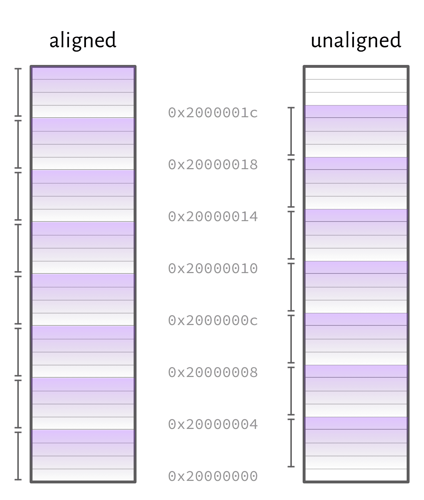
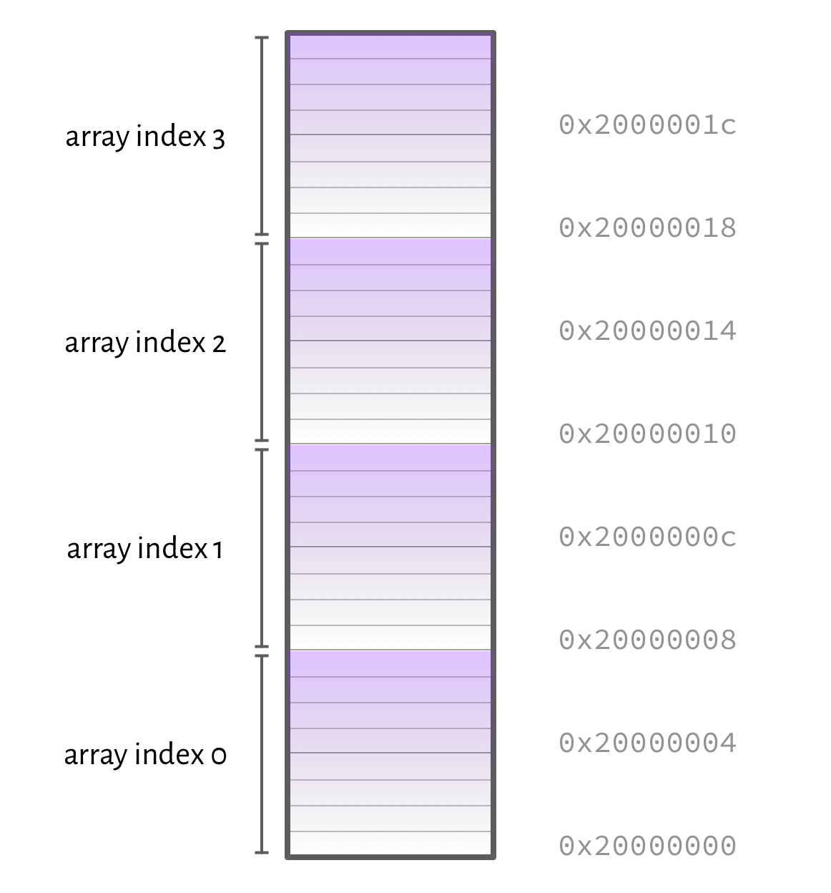
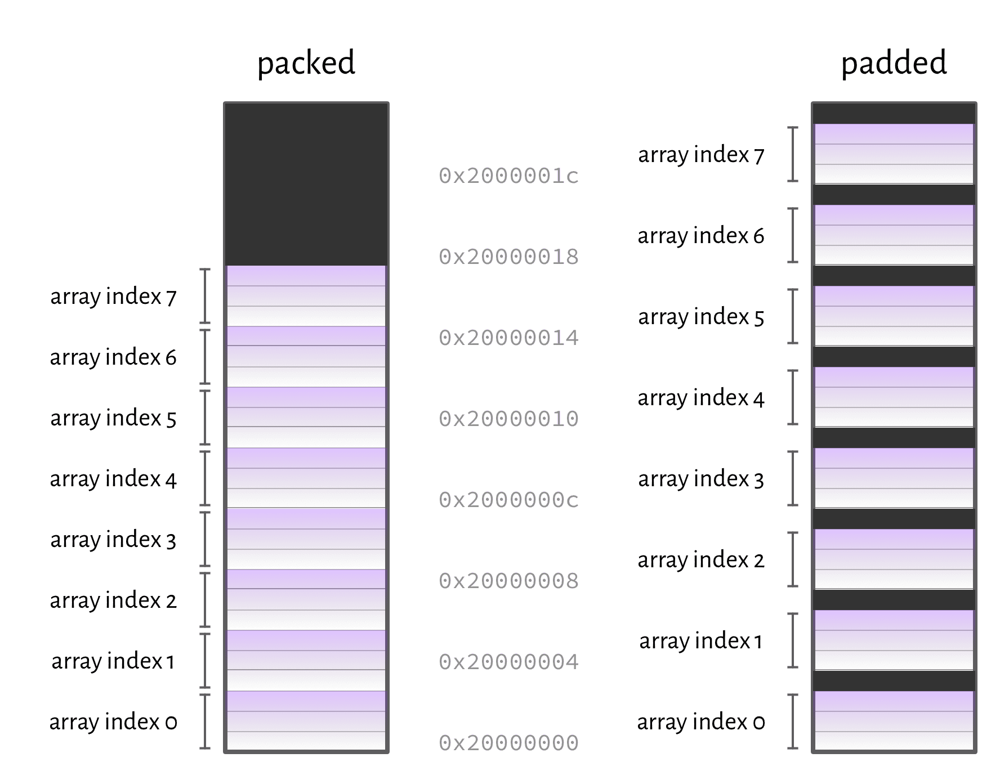
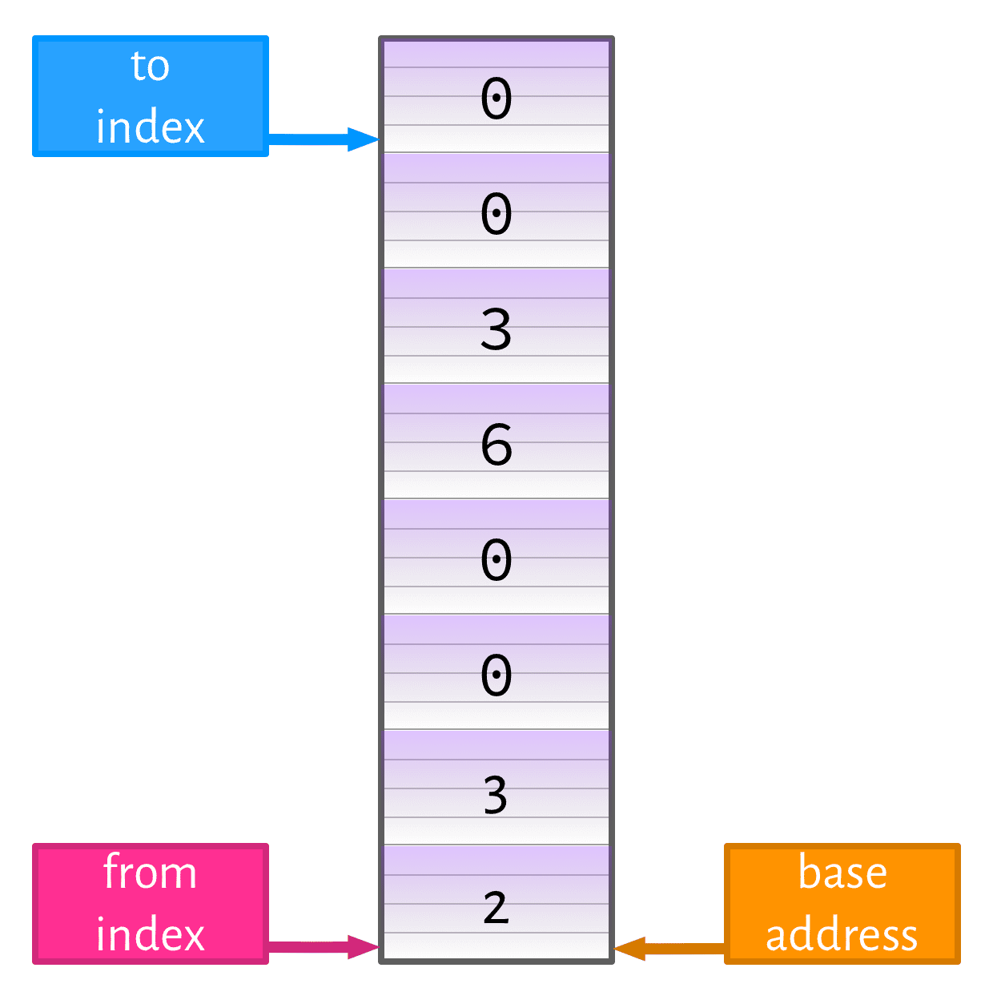
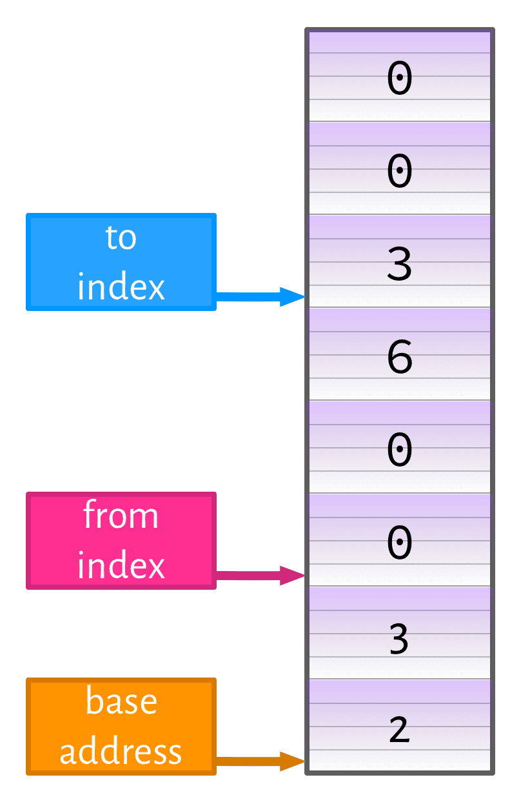
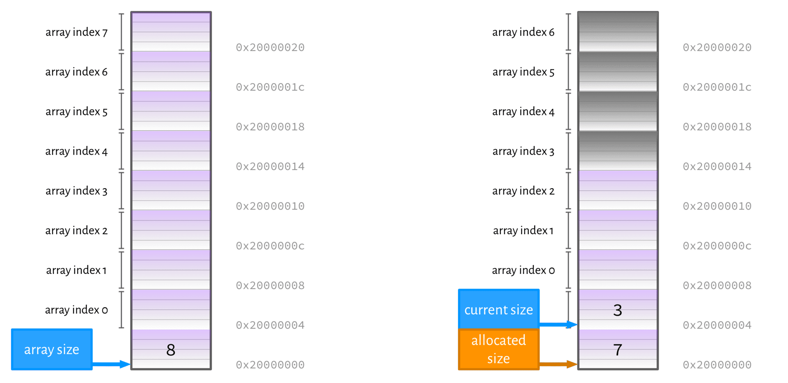
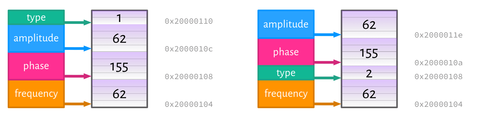

<!-- _class: banner -->

# COMP2300


# Week 7: Data Structures

## Outline

- [why do we need data structures?](#motivation)
- [arrays](#arrays)
- [records](#records)

---

<!-- _class: talk-box -->

## talk

Why do we need data structures?

---


## Why do you carry a bag?

## Why do we need data structures?

- to structure our **data** (um, ok...)
- to minimise bookkeeping
- to make our lives easier
- to play nicely with others


# Arrays

---


## Arrays are for collections of homogeneous data

[Wikipedia](https://en.wikipedia.org/wiki/Array_data_structure) has more (as usual)

## You might need an array if you've got

- a string of ASCII characters (remember [Shouty McShoutface](/lectures/04-control-flow/#livecode-shouty-mcshoutface)?)
- an audio file (e.g. an array of 16-bit signed values to "send" to
  `BSP_AUDIO_OUT_Play_Sample`)
- a collection of red-green-blue (3 x 8-bit unsigned) values which represent a
  bitmap image

## Essential information for an array

An array is just a bunch of things, but here are the key things to figure out:
- what are the things?
- where are the things?
- how big are the things?
- how many things are there?

---


## Can you fit an array into a register?


probably not


need to store it in memory


---


## Addressing

Array addressing is about reading and writing specific elements of the array

also called *indexing* (from the latin indicō "point out, show")

``` c
//             the index
//                 ↓
int x = the_things[0]; // the 1st element
int y = the_things[4]; // the 5th element
```

<!-- TODO 5th element picture -->

## In assembly code

it's just [loads and stores](/lectures/03-memory-operations/) (like you've been doing all along)

``` arm
  .data
the_things:
  .word 2, 3, 0, 0, 6, 3, 0, 0

  .text
get_elements:
  ldr r0, =the_things
  ldr r1, [r0]     @ the 1st element
  ldr r2, [r0, 16] @ the 5th element
```

---



## Alignment

---

<!-- _class: talk-box -->

## talk

what's the big deal? why are unaligned loads/stores a problem?

---

<!-- _class: impact -->

you can put *anything* in an array, not just **words**

---



---



---

<!-- _class: impact -->

abstract data type

**vs**

data structure

## Working with arrays

they don't fit in registers, so we have to operate on them one element at a time


we need **loops**!

## Array sum example

given an array of (word-size) integers, find the sum of the elements from
`from_index` to `to_index`

```c
int sum(int array[], int from_index, int to_index)&#123;
  int acc = 0; // the "accumulator" variable
  for(int i = from_index; i <= to_index; i++)&#123;
    acc += array[i];
  &#125;
  return acc;
&#125;
```

<!-- ## And again... -->

<!-- ```ada -->
<!-- type Naturals is array (Integer range <>) of Natural; -->
<!-- function Sum (Numbers : Naturals) return Natural is -->
<!--   Acc : Natural := 0; -->
<!-- begin -->
<!--   for n of Numbers loop -->
<!--     Acc := Acc + n; -->
<!--   end loop; -->
<!--   return Acc; -->
<!-- end Sum; -->
<!-- ``` -->

## The array in memory

```arm
  .data
array:
  .word 2, 3, 0, 0, 6, 3, 0, 0
```

back-of-the-envelope maths: the sum is 14 (0xE)

## Array sum setup

For the following examples, assume:
- the base address of the array is in `r0`
- the from (start) index is in `r1` (0 in the setup code below)
- the to (end) index is in `r2` (7 in the setup code below)

```arm
  ldr r0, =array @ base address
  mov r1, 0      @ from_index
  mov r2, 7      @ to_index
```

---



---



## Array sum #1


```arm
@ setup
  mov r3, 0 @ "accumulator" register
  mov r4, 4 @ element size

array_sum:
  mul r5, r1, r4   @ calculate offset
  ldr r6, [r0, r5] @ load from offset
  add r3, r6       @ update accumulator
  add r1, 1        @ increment index
  cmp r1, r2       @ keep looping?
  ble array_sum
  
@ cleanup
  mov r0, r3
```

2 instructions in setup, 6 in loop

## Array sum #2


```arm
@ setup
  mov r3, 0 @ acc

array_sum:
  @ load with shifted index register
  ldr r6, [r0, r1, lsl 2]
  add r3, r6     @ update running total
  add r1, 1      @ increment index
  cmp r1, r2     @ keep looping?
  ble array_sum

@ cleanup  
end_array_sum:
mov r0, r3
```

1 instruction in setup, 5 in loop, no need to explicitly calculate the offset
(but size must be power of 2)

## Array sum #3


```arm
@ setup
  mov r3, 0     @ acc
  lsl r1, r1, 2 @ change index -> offset
  lsl r2, r2, 2 @ change index -> offset

array_sum:
  ldr r6, [r0, r1]
  add r3, r6    @ update running total
  add r1, 4     @ increment index
  cmp r1, r2
  ble array_sum

@ cleanup  
mov r0, r3
```

3 instruction in setup, 5 in loop

uses byte offset instead of element index

---

<!-- _class: talk-box -->

## talk

any more ideas for how we could speed this up?

## Array sum #4


```arm
@ setup
  mov r3, 0      @ acc
  lsl r1, r1, 2  @ change index -> offset
  add r1, r0, r1 @ address of from element
  lsl r2, r2, 2  @ change index -> offset
  add r2, r0, r2 @ address of to element

array_sum:
  ldr r6, [r1], 4 @ load & post-index r1
  add r3, r6      @ update running total
  cmp r1, r2
  ble array_sum

@ cleanup  
  mov r0, r3
```

5 instructions in setup, **only 4 in loop**, note the [load with
post-index](/lectures/04-control-flow/#load-and-store-with-offset)

## On optimisation...

loops are often the "hot" part of a program, therefore worth optimising

optimising compilers will do some *weird* things to get the most optimised code

in general, write simple code first, and optimise later (if necessary)

---


## Knuth says:


"***premature** optimization is a bretty bad idea, yo*"

## Gotchas

- don't forget about [endianness](/lectures/03-memory-operations/#endianness)!
- remember, `ldr`/`str` still just loads **words**, not elements (it's
  convenient if your elements are word-sized, but watch out if they're not)
- no bounds checking so far!
- we weren't careful about the [AAPCS](/lectures/05-functions/#calling-conventions) in our array sum examples
  earlier

## Memory allocation for arrays

static: memory is set aside at compile-time (e.g. in the `.data` section)
- *pro*: allocation is already done when the program starts
- *con*: need to know the size of the array in advance

dynamic: memory is made available (e.g. on the stack) at run-time
- *pro*: can pick the best size at runtime, can re-size
- *con*: takes time (while program is running)

*we'll return to this later...*

## Better(?) array data structures

The arrays we've looked at so far are pretty bare-bones; containing just the raw
data (at runtime, anyway)

there are several improvements
- null-termination
- store array size alongside the data
- can we make a resizeable array?

---



---


## Where are the array(s)?


# Records

---


## Records are for collections of heterogeneous data

[Wikipedia](https://en.wikipedia.org/wiki/Record_%28computer_science%29) says:

A **record** is a collection of **fields**, possibly of different data types,
typically in fixed number and sequence. The fields of a record may also be
called members, ... or elements, though these risk confusion with the elements
of a collection.

---


## Overloaded names!

records might also be referred to as structs, tuples, objects

(although those terms can also mean different things)

**context** matters

---


## Array

---


## Record


*don't take the analogy too far*

## Simple examples

character data from [hearthpebble](/labs/03-maths-to-machine-code/)?
- HP (word)
- mana (word)
- name (16-byte, null-terminated ASCII array)

a basic synthesizer
- frequency (word)
- phase (word)
- amplitude (word)
- type (halfword)

---


## Field ordering

what's the difference here?




---

<!-- _class: impact -->

the **address** of the first element is all you need

---


## Records by request

## Composite data structures

Things really get interesting when we combine things
- records inside records (nested records)
- records of arrays
- arrays of records

all acceptable, and all useful

## Are these things *objects* in the OO sense?

**no.**

they have variables (the fields), but not methods

proper "virtual method table" lookup beyond the scope of this lecture, but here's some further reading...
- [Java](https://www.quora.com/How-is-the-virtual-method-table-implemented-in-Java)
- [C/C++](https://www.embedded.com/electronics-blogs/programming-pointers/4391967/Virtual-functions-in-C)

---

<!-- _class: talk-box -->

## talk

what does it mean to allocate memory for an array?

---


## <code>dmalloc</code> (<em>d</em>umb <em>m</em>emory <em>alloc</em>ate)

Let's make a dumb memory allocator

## Describing the `dmalloc` function

At a *minimum*, our memory allocator function must
- take (as an input parameter) the number of bytes to allocate
- return a memory address which points to that many bytes of **free** memory

there are many other things it could do, but this will do for now

## Real `malloc`

real operating systems provide a `malloc` function for dynamically allocating
memory which sortof works like this, but is much better:
- allows you to "release" memory after you're done with it
- keeps track of the memory allocations using metadata
- (tries to) gracefully fail when it can't give you enough memory


*although it's implementation dependent*

---


## Further reading

[Inside memory management: The choices, tradeoffs, and implementations of
dynamic allocation](https://www.ibm.com/developerworks/linux/library/l-memory/)


# Data structures and argument passing

---

<!-- _class: talk-box -->

## talk

how would you pass an array or a record as an argument to a function? how about
as a return value?

---


## it's alive

## Records as function parameters

imagine an `is_alive` function which
- takes one parameter: a *hearthpebble character* data structure
- returns a (word-sized) `0` if the character is dead, and `1` if the character
  is alive

```arm
  .data
zoltan_the_magnificent:
@ initialise hp and mana
  .word 100, 200 @ more mana because wizard
```

## It's alive #1: pass character in registers


```arm
is_alive:
  movs r0, r0 @ cheeky trick!
  mov r0, 0
  ble end_is_alive
  mov r0, 1
end_is_alive:
  bx lr
  
@ call
  ldr r2, =zoltan_the_magnificent
  ldr r0, [r2]    @ hp
  ldr r1, [r2, 4] @ mana
  bl is_alive
```

## It's alive #2: pass character on stack


```arm
is_alive:
  pops &#123;r0,r1&#125; @ read args off stack
  mov r0, 0
  ble end_is_alive
  mov r0, 1
end_is_alive:
  bx lr
  
@ call (including copy record onto the stack)
@ for larger records this might require a loop
  ldr r2, =zoltan_the_magnificent
  ldr r0, [r2]
  ldr r1, [r2, 4]
  push &#123;r0,r1&#125;
  bl is_alive
```

## It's alive #3: pass character by reference


```arm
is_alive:
@ load hp using the address argument
@ no need to load mana
  ldr r1, [r0]
  movs r1, r1
  mov r0, 0
  ble end_is_alive
  mov r0, 1
end_is_alive:
  bx lr

@ call (pass only address of "zoltan" record)
  ldr r0, =zardok
  bl is_alive
  cmp r0, 1
  beq whee
  b no
```

## Gotchas

the records in these examples are all still small enough that they *could* be
passed in registers, but large ones can't be

be aware of [stack discipline](/lectures/05-functions/#stack)

pass by reference: no copying, but the caller can mess with the "source" data

---


## How to decide?

some programming languages give you the choice, others don't

this is where most of the complexity in [calling conventions](/lectures/05-functions/#calling-conventions) comes from

---


## Questions?
