<!-- _class: banner -->

# COMP2300

---


## Dr Charles P Martin

- That's me!
- Just started at ANU in mid-semester break.
- PhD (computer science) at ANU in 2016
- PostDoc at University of Oslo, Norway 2016-2019.
- Previous/Parallel lives as computer musician and percussionist.


# Week 7: Interrupts; Digital Synthesis

---

<!-- _class: info-box -->

## info

- Assignment 1 marks are out on [streams]().
- Mid-semester exam marks are out. [(see stats)](https://cs.anu.edu.au/courses/comp2300/resources/exam_stats/)
- Assignment 2 is out, please get started! **Push Early, Push Often!**
- No lecture this Thursday (25 April, ANZAC day public holiday)
- No tutorials this Thursday, go to another session this week.

---

<!-- _class: talk-box -->

## talk

What's an interrupt? Explain like I'm 5.


- What could interrupts be used for?
- Can you prevent an interrupt?

---

<!-- _class: impact -->

You've probably experienced an interrupt (exception) already!


What about "Usage Fault"?

## Connecting to the world!


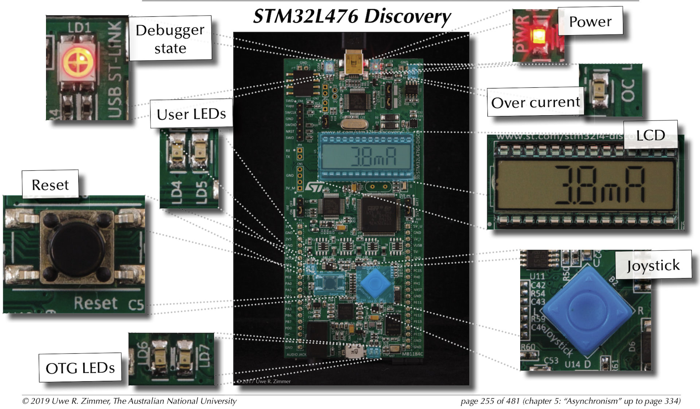

## How do we configure an interrupt?

1. Need to enable the interrupt.
2. Need to define the handler function.
3. Need to configure hardware (if using MCU features).

## Where are interrupt vectors defined?

Have a look in `startup_stm32l476xx.S`:

```arm
g_pfnVectors:
  .word _estack
  .word Reset_Handler
  .word NMI_Handler
  .word HardFault_Handler
  .word MemManage_Handler
  ...
```

All the interrupt vectors are named here, and linked to a default handler.

## How do we take over an interrupt handler?

Need to redefine one of the handler functions. E.g. for `EXTI0_IRQHandler`:

```arm
.global EXTI0_IRQHandler
.type EXTI0_IRQHandler, %function
EXTI0_IRQHandler:
  @ do something!
  bx lr
.size EXTI0_IRQHandler, .-EXTI0_IRQHandler
```

---

<!-- _class: impact -->

So I want to use the **joystick**...


Isn't that similar to activating the LEDs?

## A map to the joystick...

The joystick centre button is connected to pin `PA0` on your disco board.


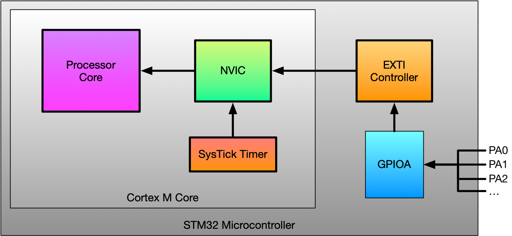

## Connecting it all up

We need to configure `GPIOA0` as an input, configure the external interrupt controller (EXTI), _and_ configure the NVIC to make this happen. This is a bit fussy!

- Enable `GPIOA` and `SYSCFG` clocks.
- Set `PA0` to input, and activate pull-down resistor
- Set `PA0` as source for `EXTI0` interrupt.
- Enable `EXTI0` interrupts and set `EXTI0` to rising edge trigger.
- Enable `EXTI0` interrupts in the `NVIC`.

Let's do it.

---


## Interrupt archaeology

What about the interrupt handler function and the [AAPCS](/lectures/05-functions/#aapcs)?

- [link register](/lectures/05-functions/#link-register) `lr`?
- [status register](/lectures/02-alu-operations/#condition-flags) `cpsr`?
- *caller-save registers* (`r0`-`r3`)?


let's look at an interrupt handler and do some digging...

---

<!-- _class: talk-box -->

## talk

What's the relationship between the concepts of **interrupts** and
**concurrency**?

---


## Using Synchronisation Primitives

What's the deal with **ldrex** and **strex**?

## LDREX


```arm
  ldr r0, =label_in_data_section
  ldrex r1, [r0]
```

`ldrex` loads `r1` with the memory that `r0` is pointing to, and sets that memory address in the "local exclusive monitor". 

It doesn't do any checking of the exclusive monitor before doing so!


Multi-processor systems also have a "global exclusive monitor"... not covered here!

## STREX

```arm
  ldr r0, =label_in_data_section
  mov r1, 5
  strex r2, r1, [r0]
  cmp r2, 0
  bne do_something_to_recover
```

`strex` tries to store `r1` in the memory that `r0` is pointing to, but checks the exclusive monitor first. 

If the store is allowed, `r2` is set to 0, if it fails then `r2` is set to 1.


Then what should we do?

## When can a `strex` actually fail?

Need to look in the ARMv7-M reference manual (Section A3.4 "Synchronisation and Semaphores")

1. If address of `strex` is tagged exclusive in the local monitor; then store takes place (woo hoo!)
2. If address of `strex` is NOT tagged exclusive; then it is "implementation defined" whether the store takes place (????).

## Local Exclusive Monitor

"Any `ldrex` operation updates the tagged address to the most significant bits of the address... used for the operation." (ARMv7-M reference manual)


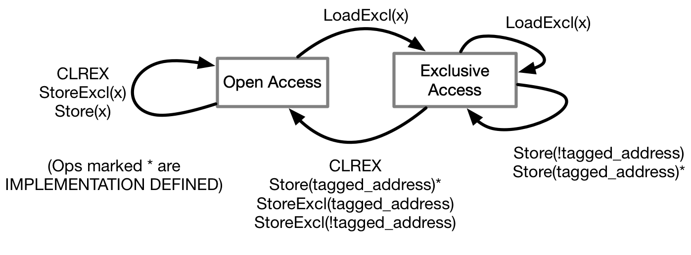

Note that `clrex` **always** clears the monitor, and that interrupt handlers run `clrex`!

<!--

---

<iframe width="1120" height="630" src="https://www.youtube.com/embed/vE4VlA_9OrI" frameborder="0" allowfullscreen></iframe>

-->

---


## Let's experiment to see how this works.

<!-- begin synth lecture -->

---

<!-- _class: impact -->

Pt. 2: What do all these **synth** words mean?

---

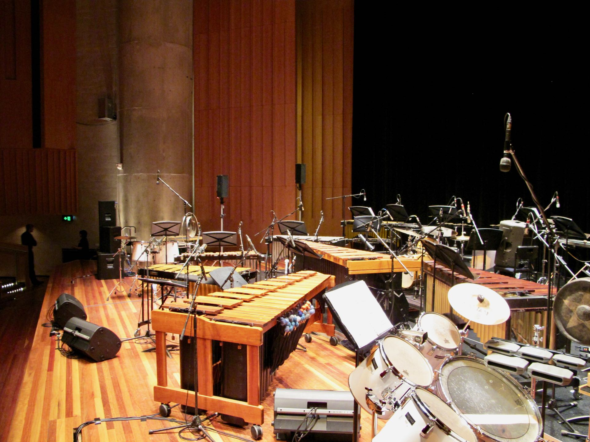

## Sounds?

How do we make interesting sounds with the disco boards?

---

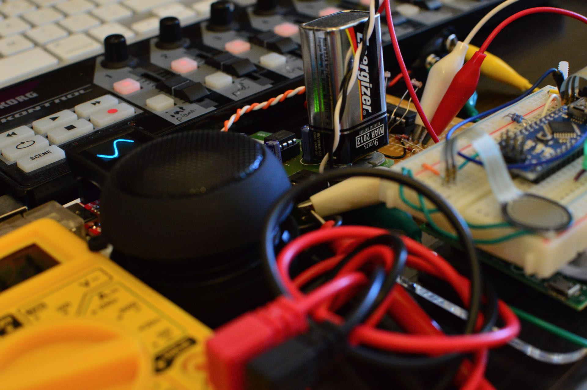

## Digital Synthesis Approaches

- Additive synthesis
- Subtractive synthesis
- FM (frequency modulation) synthesis
- Envelopes and ADSR
- Drums: noise and non-pitched sounds
- Wavetable synthesis

## What's an Oscillator?

- A **module** (physical or code) that outputs a **waveform**.
- In synth lingo, sometimes a VCO (voltage controlled oscillator).

<!--

---


## Additive Synthesis

-->

## Additive Synthesis

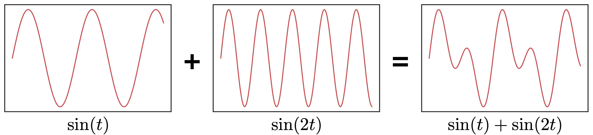


- Take multiple oscillators and add them together!
- Some people are trying this in Assignments 1 & 2
- Need [lots of oscillators](https://www.youtube.com/watch?v=q45FHZLVz2U
) to make complex sound.

<!--  -->


## Subtractive Synthesis

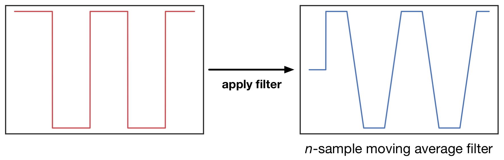

- Use one oscillator and _take sound away_.
- We use a [filter to remove sound](https://ccrma.stanford.edu/~jos/filters/filters.html).
- One example of a digital filter is the [_n-sample moving average filter_](http://www.gaussianwaves.com/2010/11/moving-average-filter-ma-filter-2/).
- Subtractive synthesis is typical for analogue synthes (e.g., [Korg MS-20](https://en.wikipedia.org/wiki/Korg_MS-20)).

<!--  -->


## FM synthesis

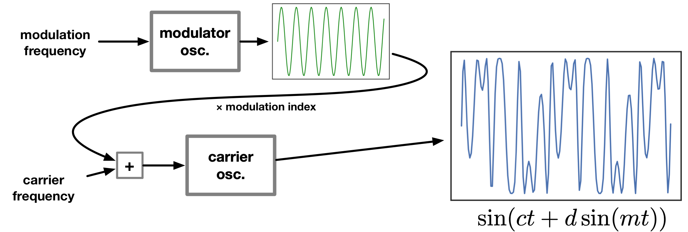

- "frequency modulation"
- Use one oscillator to control the frequency of another.
- [Cool sounds](https://youtu.be/fxSTjiE_5V0) with few oscillators (see [Yamaha DX7](https://en.wikipedia.org/wiki/Yamaha_DX7))

<!--  -->

---

<!-- _class: talk-box -->

## talk

So far we've made "sounds", but we want to make "notes". 

How can we do that?

## Amplitude Envelope

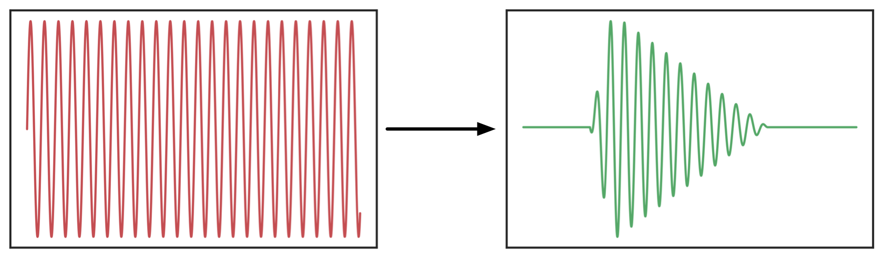

- **Amplitude** is the "volume" of our note.
- **Envelope** is the chunk of time for our note to exist in.
- We can change the amplitude over the envelope to give a note a sonic "shape".
- In synth lingo, an **EG (envelope generator)** makes envelopes.

<!--  -->


## ADSR Envelope

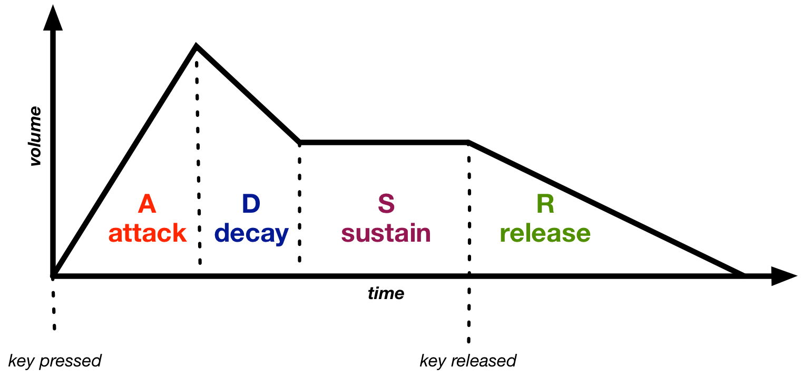

- The **adsr** shape is often used for pitched sounds.
- ADSR: attack, decay, sustain, release

<!--  -->


## Drums and Percussion

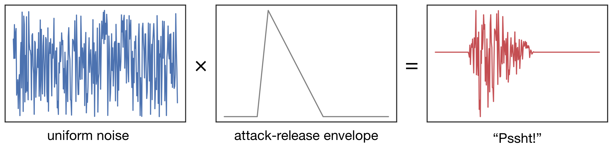

- Are drums all "non-pitched" sounds?
- Start with noise, or combine inharmonic frequencies.
- Percussion envelope? Short attack, no sustain, moderate to long release.

<!--  -->


## Wavetable Synthesis

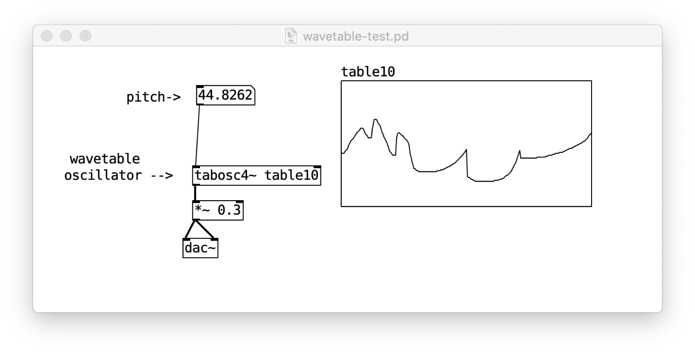

- Save the samples for a [single cycle of a waveform in an array](http://msp.ucsd.edu/techniques/v0.11/book-html/node33.html).
- Step through this array to over and over to play back the sound.
- How do you [change pitch](http://www.earlevel.com/main/category/digital-audio/oscillators/wavetable-oscillators/)?

<!--  -->

---


## More

- Fun "analogue" synth simulation: [VCV Rack](https://vcvrack.com)
- Powerful "digital" synthesis: [Pure Data](https://puredata.info)
- Too many oscillators: [Look Mum No Computer](https://www.youtube.com/watch?v=q45FHZLVz2U)

---

<!-- _class: impact -->

questions?
