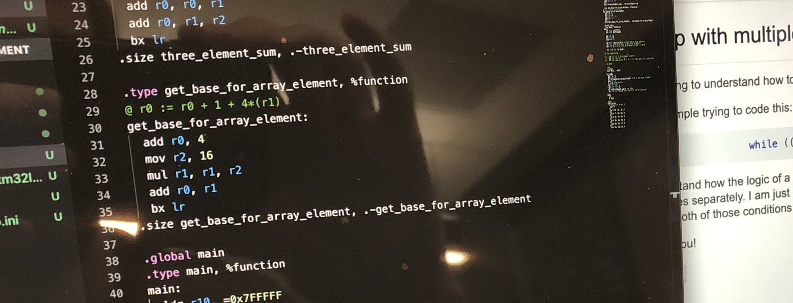
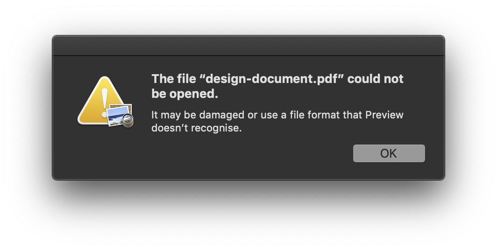
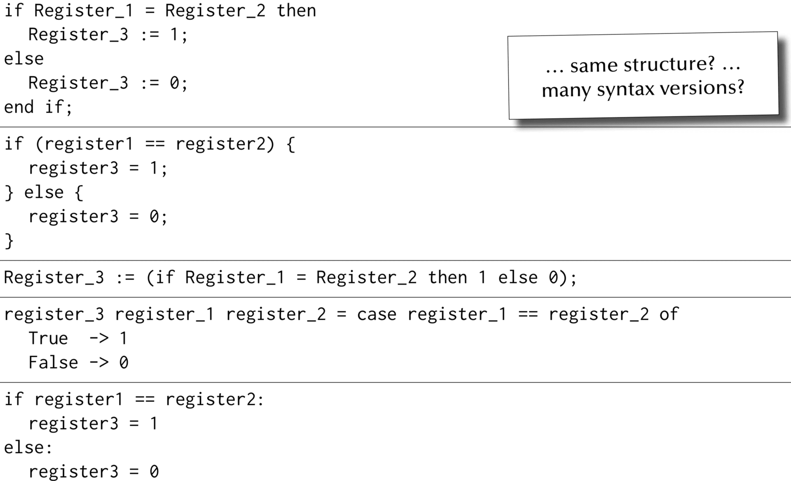
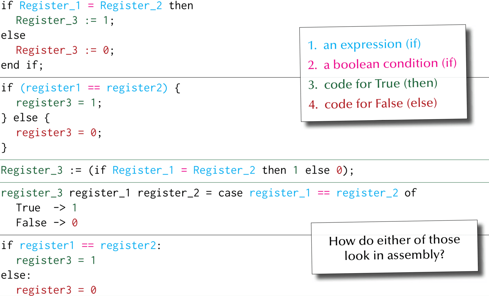
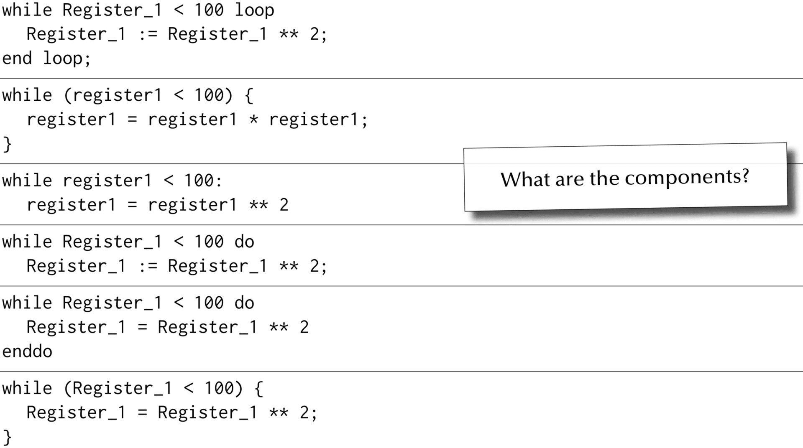
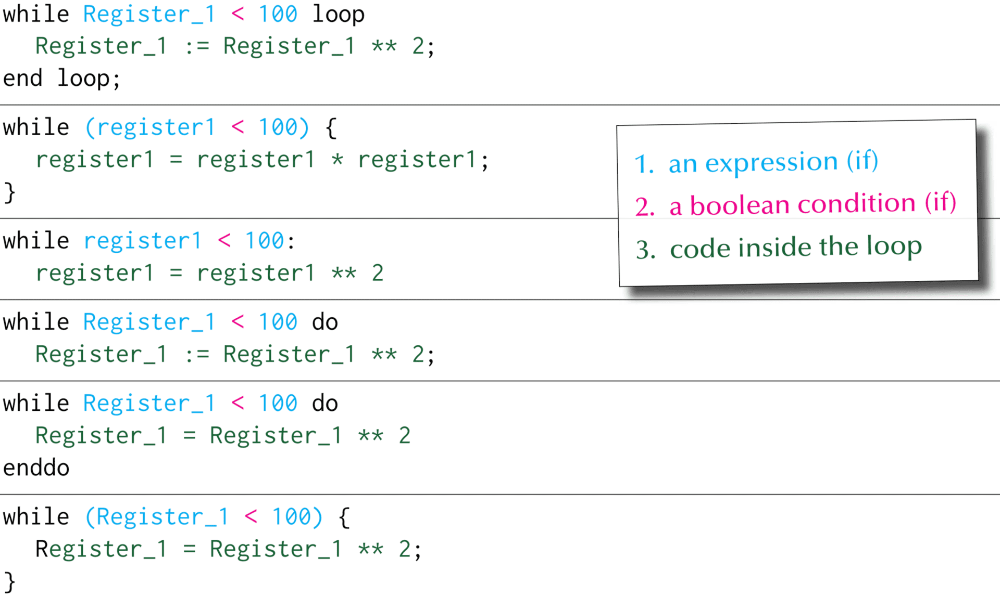
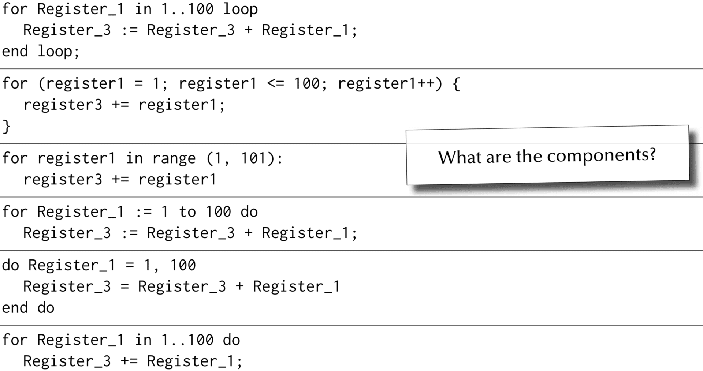
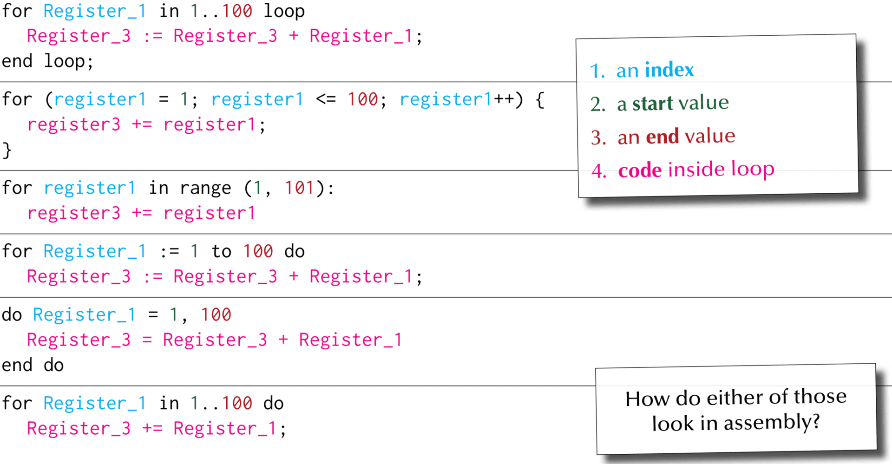
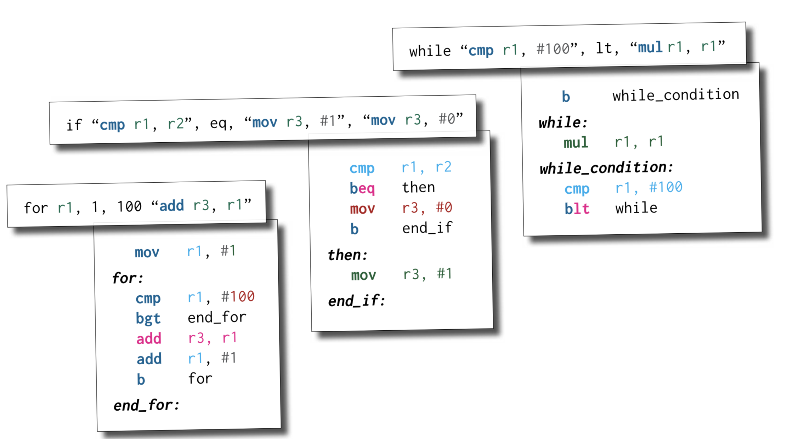
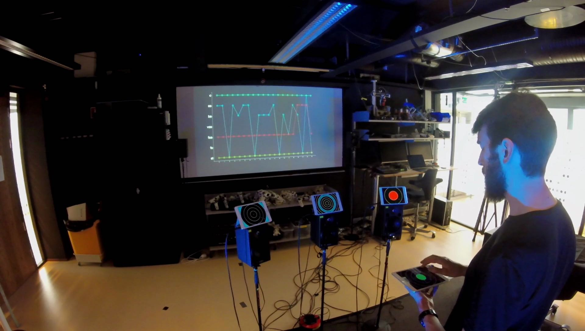

<!-- _class: banner -->

# COMP2300

---

<!-- _class: info-box -->

## info

**assignment 2** is due on Friday... 

remember to push early and push often...

and don't leave your design document to the last minute!

## Five ways to fail your design document

So you **really** want to fail your design document? Here's how!

## Use images for code.

Screenshot or, better yet, phone camera. 
Show us your screen fingerprints and blurry code.



## Don't explain _why_. 

Just go through code line by line!

Tutors know **what** `mov` and `add` do. Tell them anyway!

## Don't use headings or structure!

It's harder to read a long block of text.

Make your tutor regret trying!

## Don't read the design document FAQ

There's a long page of [advice for writing a design document.](https://cs.anu.edu.au/courses/comp2300/resources/design-document/)

If you don't read it, you won't know how to get a good mark!

## Rename text file as pdf

This is a failure power move for professionals only! 
The tutors just see an error when they open your DD. What better way to convince them that you deserve zero marks?



## If you DON'T want to fail...

- DON'T use screenshots of code
- DO read the [design document advice](https://cs.anu.edu.au/courses/comp2300/resources/design-document/)
- DO write about "why" you chose your unique solution, and the problems you've solved
- DO have headings and structure
- DO provide **a real pdf file**


# Week 8: Control Flow

## Outline

- conditionals
- loops
- macros
- godbolt compiler explorer

<!-- Start Conditional Execution -->


# Conditional Execution

---


## How do we organise our programs?

What are elements of **Structured Programming**?

How does that stuff translate into assembly code?

---

<!-- _class: impact -->

control flow is about conditional execution

---


## condition expressions

1. `x < 13`
2. `x == 4`
3. `x != -3 && y > x`
4. `length(list) < 128`

These all evaluate to a [boolean](/lectures/01-intro-and-digital-logic/#boolean-algebra) **True** or
**False** (depending on the value of the variables)

## CPSR table


| `<c>` | meaning                 | flags     |
|-------|-------------------------|-----------|
| eq    | equal                   | Z=1       |
| ne    | not equal               | Z=0       |
| cs    | carry set               | C=1       |
| cc    | carry clear             | C=0       |
| mi    | minus/negative          | N=1       |
| pl    | plus/positive           | N=0       |
| vs    | overflow set            | V=1       |
| vc    | overflow clear          | V=0       |
| hi    | unsigned higher         | C=1 ∧ Z=0 |
| ls    | unsigned lower or same  | C=0 ∨ Z=1 |
| ge    | signed greater or equal | N=V       |
| lt    | signed less             | N≠V       |
| gt    | signed greater          | Z=0 ∧ N=V |
| le    | signed less or equal    | Z=1 ∨ N≠V |

## Example: `if (x == -24)`

``` arm
@ assume x is in r0
adds r1, r0, 24
beq then
```

In words:
- **if** x + 24 is zero (i.e. if it sets the [Z flag](/lectures/02-alu-operations/#condition-flags))
- **then** branch to the `then` label

## Example: `if (x > 10)`

``` arm
@ assume x is in r0
subs r1, r0, 10
bgt then
```

In words: 
- **if** x - 10 is (signed) greater than 0
- **then** branch to `then`

## Alternatives?

assume *x* is in `r0`

``` arm
cmp r0, 10
bgt then
```


``` arm
mov r1, 10
cmp r1, r0
bmi then
```


``` arm
mov r1, 11
cmp r0, r1 @ note the opposite order of r0, r1
bge then
```

---

<!-- _class: impact -->

are there others? 

which is the **best**?

## Conditional expressions in assembly

You need to get to know the different condition codes:

- what flags they pay attention to
- what they mean
- how to translate "variable" expressions into the right assembly instruction(s)

It's hard at first, but you get the hang of it. Practice, practice, practice!

## if-else statement gallery




## if-else statement components




## In assembly

1. check the condition (i.e., set some flags)
2. a [conditional branch](/lectures/03-memory-operations/#conditional-branch) to the "if"
   instruction(s)
3. the "else" instruction(s), which get executed if the conditional branch *isn't* taken

## if-else with labels, but no code (yet)

``` arm
if:
  @ set flags here
  b<c> then

then:
  @ instruction(s) here
  
else:
  @ instruction(s) here

rest_of_program:
  @ continue on...
```

---

<!-- _class: talk-box -->

## talk

What are the problems with this? (there are a few!)

``` arm
if:
  @ set flags here
  b<c> then

then:
  @ instruction(s) here
  
else:
  @ instruction(s) here

rest_of_program:
  @ continue on...
```

## A better if statement

``` arm
if:
  @ set flags here
  b<c> then
  b else @ this wasn't here before

then:
  @ instruction(s) here
  b rest_of_program
  
else:
  @ instruction(s) here

rest_of_program:
  @ continue on...
```

## The *best* if statement

``` arm
if:
  @ set flags here
  b<c> then

@ else label isn't necessary
else:
  @ instruction(s) here
  b rest_of_program

then:
  @ instruction(s) here
  
rest_of_program:
  @ continue on...
```

## Example: [absolute value function](https://en.wikipedia.org/wiki/Absolute_value)


``` arm
if:
  @ x is in r0
  cmp r0, 0
  blt then

else:
  @ don't need to do anything!
  b rest_of_program

then:
  mov r1, -1
  mul r0, r0, r1
  
rest_of_program:
  @ "result" is in r0
  @ continue on...
```

## Label name gotchas

Labels must be unique, so you can't have more than one `then` label in your file

So if you want more than one if statement in your program, you need

- `if_1`
- `then_1`
- `else_1`
- etc...


# Loops

## while loop gallery




## while loop components




## In assembly

1. check the condition (i.e. set some flags)
2. a [conditional branch](/lectures/03-memory-operations/#conditional-branch) to test whether or
   not to "break out" of the loop
3. if branch not taken, execute "loop body" code
4. branch back to step 1

## while loop with labels, but no code (yet)

``` arm
begin_while:
  @ set flags here
  b<c> while_loop
  b rest_of_program

while_loop:
  @ loop body
  b begin_while

rest_of_program:
  @ continue on...
```

## Example: `while (x != 5)`

``` c
while(x != 5)&#123;
  x = x / 2;
&#125;
```

``` arm
begin_while:
  cmp r0, 5
  bne while_loop
  b rest_of_program

while_loop:
  asr r0, r0, 1
  b begin_while

rest_of_program:
  @ continue on...
```

## A better while statement?

``` arm
begin_while:
  cmp r0, 5

  @ "invert" the conditional check
  beq rest_of_program

  asr r0, r0, 1
  b begin_while

rest_of_program:
  @ continue on...
```

## Things to note

- we needed to "reverse" the condition: the while loop had a **not** equal
  (`!=`) test, but the assembly used a branch if equal (`beq`) instruction
- we (again) use a `cmp` instruction to set flags without changing the values in
  registers
- loop body may contain several assembly instructions
- if *x* is not a multiple of 5, what will happen?

## for loop gallery




## for loop components




## In assembly

1. check some condition on the "index" variable (i.e. set some flags)
2. a [conditional branch](/lectures/03-memory-operations/#conditional-branch) to test whether or
   not to "break out" of the loop
3. if branch not taken, execute "loop body" code (which can use the index variable)
4. increment (or decrement, or whatever) the index variable
5. branch back to step 1

## for loop with labels, but no code (yet)

``` arm
begin_for:
  @ init "index" register (e.g. i)
loop:
  @ set flags here
  b<c> rest_of_program

  @ loop body

  @ update "index" register (e.g. i++)
  b loop

rest_of_program:
  @ continue on...
```

---

<!-- _class: impact -->

it's the same idea as **while**

## Example: oddsum

``` c
// sum all the odd numbers < 10
int oddsum = 0;
for (int i = 0; i < 10; ++i) &#123;
  if(i % 2 == 1)&#123;
    oddsum = oddsum + i;
  &#125;
&#125;
```

<!-- ## Oddsum in [Scheme](https://en.wikipedia.org/wiki/Scheme_%28programming_language%29) -->

<!-- ``` scheme -->
<!-- (let ((oddsum 0)) -->
<!--   (dotimes (i 10) -->
<!--     (if (= (% i 2) 1) -->
<!--         (set! oddsum (+ oddsum i))))) -->
<!-- ``` -->

## Oddsum in asm

``` arm
begin_for:
  @ init "index" register (e.g. i)
loop:
  @ set flags here
  b<c> rest_of_program

  @ loop body

  @ update "index" register (e.g. i++)
  b loop

rest_of_program:
  @ continue on...
```

## There are other "looping" structures

- `do while` instead of just `while`
- iterate over collections (e.g. [C++ STL](https://en.wikipedia.org/wiki/Standard_Template_Library))
- loops with "early exit" (e.g. `break`, `continue`)
- Wikipedia has a [list](https://en.wikipedia.org/wiki/Control_flow#Loops)


But in assembly language they all share the basic features we've
looked at here

## control structures gallery - practice these!





## Demo: Looping through an array

Goal: write a program to SHOUT any string

1. [ASCII](https://en.wikipedia.org/wiki/ASCII)-encode the string ([see table](https://upload.wikimedia.org/wikipedia/commons/d/dd/ASCII-Table.svg))
2. store it in memory
3. loop over the characters:
   - if it's lowercase, overwrite that memory address with the uppercase version
   - if it's uppercase, leave it alone
4. stop when it reaches the end of the string

## This is all pretty repetitive

We'll learn about assembler macros next to help with this issue!

---


## Questions?

---

<!-- _class: impact -->

From Macros to Compilers...

## Outline

- [Godbolt compiler explorer](#godbolt-compiler-explorer)
- [assembly macros](#what-are-macros-for)

## Godbolt compiler explorer

<https://godbolt.org/>: a super-cool interactive resource for exploring stack
frames (and code generation in general)

A few tips:
- in the compiler select dropdown, select one of the `ARM gcc` options
- in the *Compiler options...* box, try `-O0` (unoptimised) vs `-O3` (optimised)
- try modifying the C code on the left; see how the asm output on the right changes
- remember the [stack frames](/lectures/05-functions/#function-prologue-epilogue)!
  
  
<!-- Start Macro Section -->

---


## Macros are for automatically copy-pasting code

---


## Like this...

## `as` macro language

The macro language is defined by the [assembler](/lectures/02-alu-operations/#assembler) (`as`)

Two steps:
- define a macro (with `.macro`/`.endm`)
- call/use a macro (using the name of the macro)

The assembler copy-pastes the macro code (replacing parameters where present)
into your program *before generating the machine code*

## General macro syntax

```ARM
.macro macro_name arg_a arg_b ...
  @ to use the argument, prefix with "\"
  @ e.g. adds r0, \arg_a, \arg_b
  @ ...
.endm
```

## Example: `swap`

```arm
@ swap the values in two registers
@ assumes r12 is free to use as a "scratch" register
.macro swap reg_a reg_b
  mov r12, \reg_a
  mov \reg_a, \reg_b
  mov \reg_b, r12
.endm
```

## Calling the `swap` macro

If you use `swap` in your assembly code

```arm
swap r0, r3
```

the assembler sees it an "expands" it to

```arm
mov r12, r0
mov r0, r3
mov r3, r12
```

it's **exactly** like you had used this code in your `main.S` file in the first place

---

<!-- _class: impact -->

the CPU doesn't know **anything** about your macros

## Recap: if statement

Remember the [best if statement](/lectures/04-control-flow/#the-best-if-statement)

``` arm
if:
  @ set flags here
  b<c> then

  @ else
  b rest_of_program

then:
  @ instruction(s) here
  
rest_of_program:
  @ continue on...
```

## An `if` macro

```arm
.macro if condition_code condition then_code else_code
  \condition_code
  b\condition then

  \else_code
  b end_if

then:
  \then_code

end_if:
.endm

@ usage
if "cmp r1, r2", eq, "mov r3, 1", "mov r3, 0"
```

## Things to note

Macros can "splice" parameters into the middle of instructions, e.g.
`b\condition` becomes e.g. `beq` or `blt`

Whole instructions can be treated as a single macro parameter (e.g. `"cmp r1,
r2"` as the `condition_code` parameter) as long as they're surrounded by double
quotes (`"`)

This is a blessing and a curse!

## The `\@` macro "counter" variable

The `\@` variable contains a counter of how many macros executed so far which
you can use in your macro output

```arm
.macro if condition_code condition then_code else_code
  \condition_code
  b\condition then\@

  \else_code
  b end_if\@

then\@:
  \then_code

end_if\@:
.endm
```

## A basic `for` macro

```arm
.macro for register from to body
  mov \register, \from
for\@:
  cmp \register, \to
  bgt end_for\@
  \body
  add \register, 1
  b for\@
end_for\@:
.endm

@ usage
for r1, 1, 100 "add r3, r1"
```

## Advanced macro syntax

- optional parameters (`arg1=500`)
- variable length parameters (`varargs`)
- check if parameters are present (`.ifb`)
- conditionals (`.if`) and loops (`.loops`)
- macros can be recursive

Read the [docs](https://sourceware.org/binutils/docs-2.24/as/Macro.html)

## Macro gotchas

- hard to debug (can't step through)
- need to be careful with names (e.g. clashing labels)
- for [labels](/lectures/03-memory-operations/#labels-and-branching) as parameters, use `\()` as a separator, e.g.
  `\labelname\():` (it gets removed, but stops the assembler thinking the `:` is
  part of `labelname`)
- they might generate a lot of instructions
- the documentation kindof sucks

---


## Debugging with the disassembler

If you really need to see what instructions your macro is generating, **use the
disassembler**

Don't forget the `.type <func_name>, %function` and `.size <func_name>,
.-<func_name>` directives

---

<!-- _class: impact -->

they look like functions in a higher-level language---**don't be
fooled**

excessive macro use is dangerous territory... are you programming your
MCU or `as`?

---

<!-- _class: talk-box -->

## talk

How would you explain the difference between functions and macros to your
Grandmother? (assuming she is not a computer scientist)

## Demo Time

- multiply a list of numbers together
- recursive factorial function with macros

---


## Further reading

[`.macro` **as** directive docs](https://sourceware.org/binutils/docs-2.24/as/Macro.html)

[Useful assembler directives and macros for the GNU
assembler](https://community.arm.com/processors/b/blog/posts/useful-assembler-directives-and-macros-for-the-gnu-assembler)
on community.arm.com

---



## Macros by request

---


## Questions?
