<!-- _class: banner -->

# COMP2300

---

<!-- _class: info-box -->

## info

[Assignment 3](https://cs.anu.edu.au/courses/comp2300/deliverables/03-networked-instrument/) is out!

- this involves interrupts, synths, and WIRES!
- make sure you pick up your jumper wires in this week's lab
- you get lots more setup code for Assignment 3, so be bold and get started!

# Week 9: Networks

## Outline

- [basic concepts](#basic-concepts)
- [MIDI and serial](#midi-serial)
- [7-layer OSI model](#osi-layer-model)
- [Examples: standard protocols](#standard-protocols)

# Basic concepts

---

## We want to communicate with others

## What's so hard about this?

*communication* is easy if both ends of the communication can share
memory/registers

e.g. function calls, shared global variables (in the `.data` section)

but most of the time that's not the case

<!--  -->

<!-- --- -->

---

---

## Information theory

information theory is a whole sub-field of maths/CS---you can [take a course on
it here at the ANU](https://programsandcourses.anu.edu.au/course/COMP2610)

**data requires difference!**

---

<!-- _class: talk-box -->

## talk

on a wire carrying electrical signals, what might difference look like? how many
different ways could you achieve it?

## Aspects of network communication

there are a few fundamental "dimensions" to a given communications network

- transmission medium
- communications protocol(s)
- topology

these are all (at least partially) orthogonal

## What's a node?

the term **node** is used a lot when talking about networks

a node is anything which *communicates* on the network
- computers
- mobile phones
- IoT devices
- nanobots

## Transmission medium

lots of options here:

- electrical voltages on a wire (or *several* wires)
- co-axial cable
- twisted-pair cable
- EM waves in the air
- light in an optic-fiber cable

---

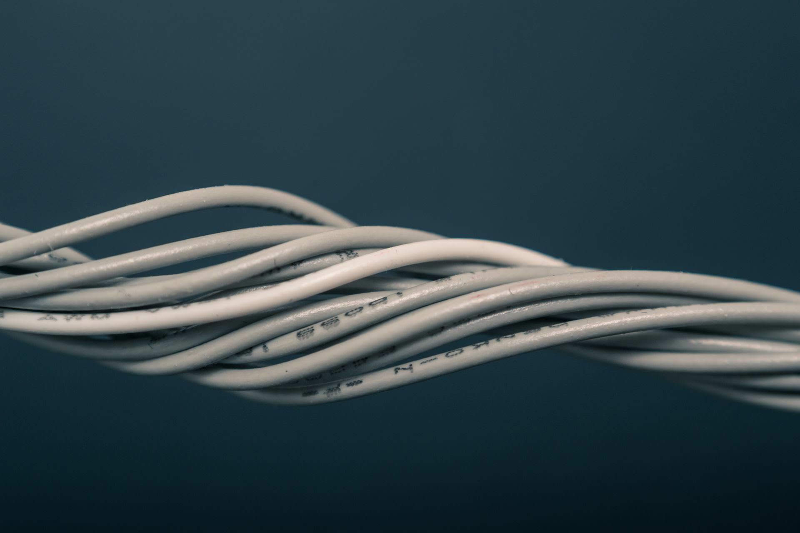

## Copper wires

---

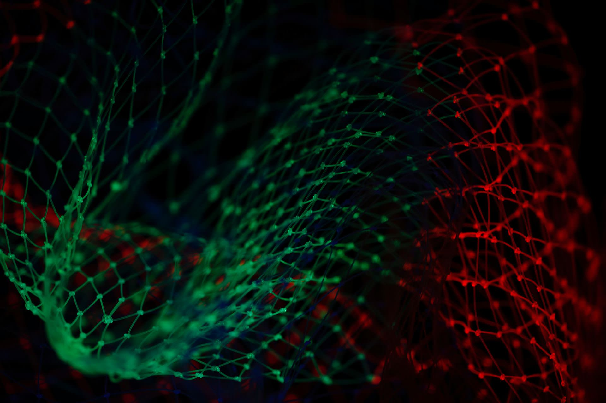

## Fibre-optic cables

---

## Waves in some other medium...

## Physics refresher

In case you haven't studied physics...

- a voltage is a *relative* measurement, it's a voltage difference between two
  endpoints
- the *ground* pins are the reference point on your discoboard
- sometimes the *values* matter (low or high, `0` or `1`) and sometimes the
  *transitions* are most important (rising/falling edge triggers)

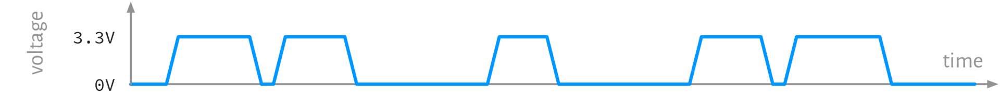

---

<!-- _class: impact -->

remember, we're still talking about digital information (`0` and `1`)

---

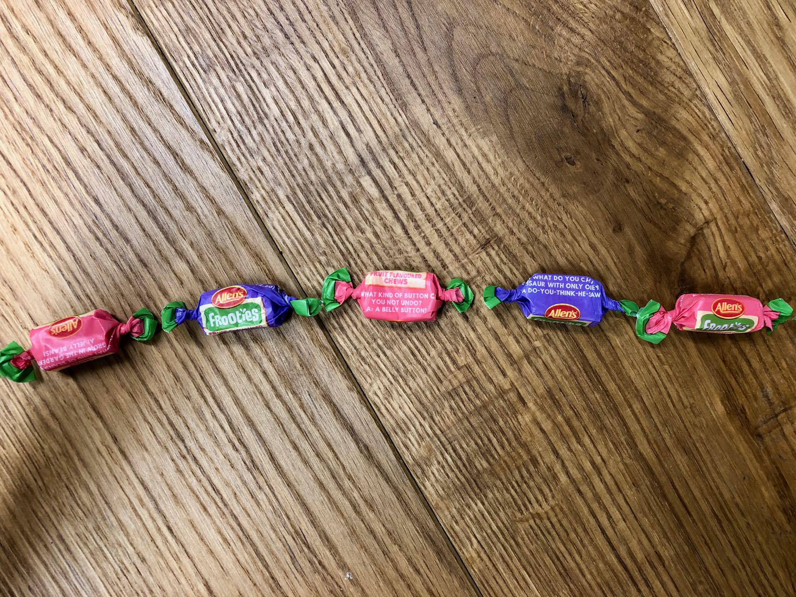

## NibbleNet v1

can we communicate with lollies?

---

<!-- _class: impact -->

knock, knock!

who's there?

## Communication protocol

an agreed-upon set of rules about what to "say" and how to understand the
responses

this is where **heaps** of the differences between different communication
networks are (and the creativity/innovation, too)
- how many wires?
- how big are the messages?
- lsb first, or msb?

both sides must agree!

(somewhat) independent of the transmission medium

---

<!-- _class: talk-box -->

## talk

have you ever had an embarrassing social protocol fail?

alternatively...

what's your favourite knock knock joke?

## Circuit-switched networks

*circuit-switched* means nodes set up & use a dedicated connection (physical or
logical)

example: phone lines in ye olden dayse---to **route** the phone call to the
right place, the switchboard operator would literally make a physical connection
between the caller & the receiver

[multi-player QuickClick](/labs/10-connecting-discoboards/#exercise-4) uses circuit-switched
communication

---

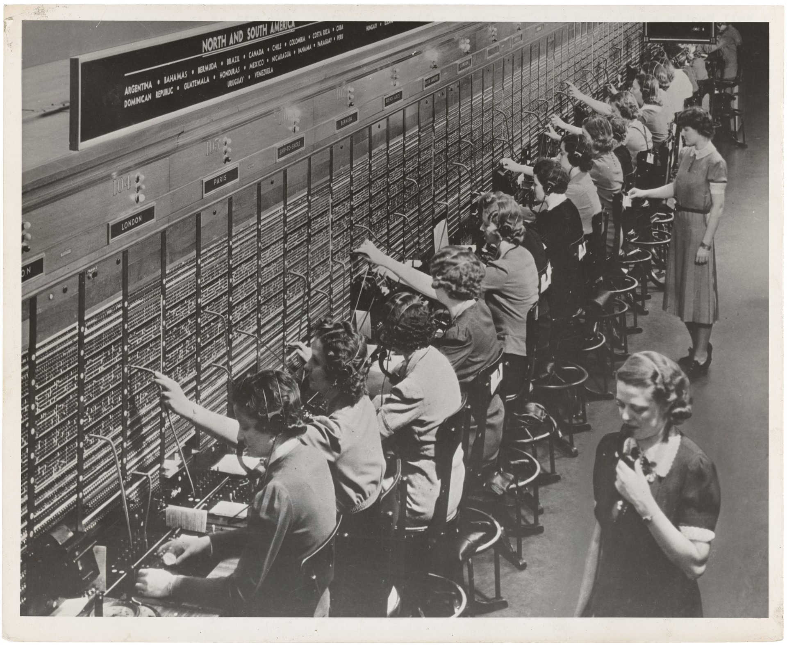

## Bell System international switchboard in 1943

## Packet-switched networks

*packet-switched* means data transmitted over the network is segmented into
packets (or frames)

these packets contain both:
- a payload (*what* you want to send)
- an address (*who* you want to send it to)

these days, most network protocols are packet-switched

this allows different nodes to share the same physical connections
(multiplexing)

---

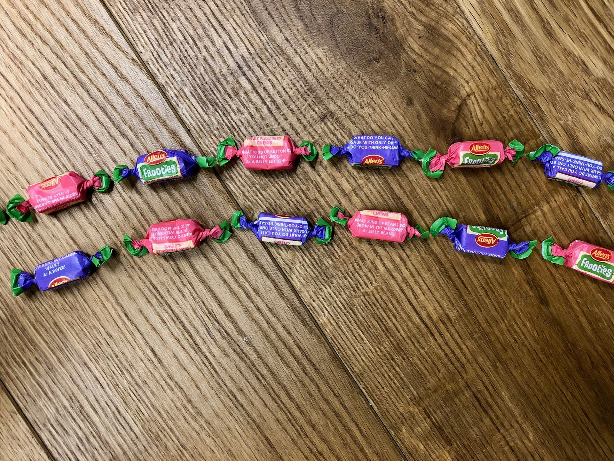

## NibbleNet v2

can we send a message in packets?

## Directions of information flow

- **simplex** means information only flows one way: from sender to receiver
- **half-duplex** means information can flow both ways, but not at the same time
- **full-duplex** means information can flow both ways simultaneously

the P2300 protocol in assignment 3 is simplex (as we'll see [later](#p2300))

## Topology

topology is the way that the nodes are connected to one another (both physically
and logically)

there are several different ways to connect the nodes together, each with pros
and cons

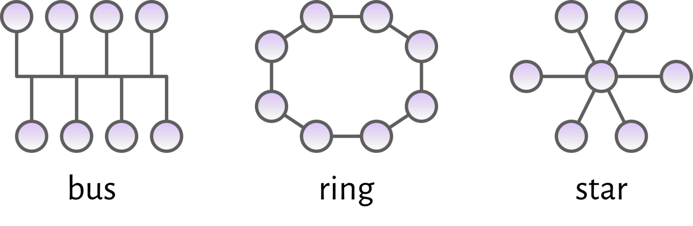

---

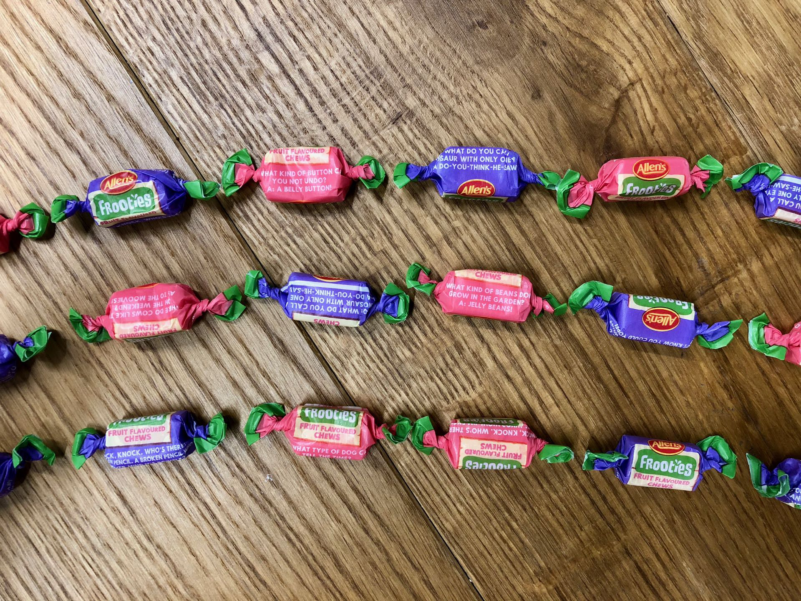

## NibbleNet v3

how about sending a message to a specific node?

circuit-switched vs packet-switched?

---

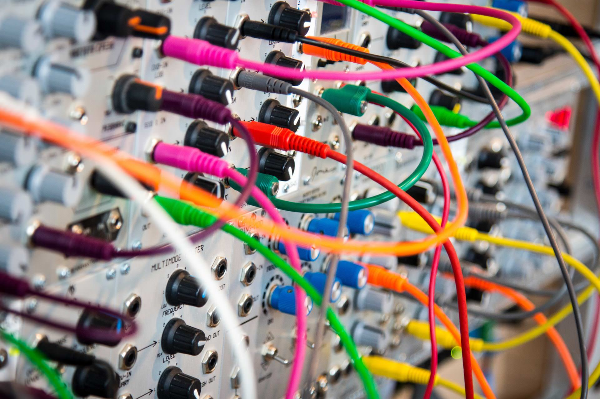

## Musical Networks

- Are there any network protocols dedicated to musical instruments?

## MIDI

- "Musical Instrument Digital Interface" (1981)
- A way to send musical "instructions" to a synthesiser.
- E.g., (CC BY 2.0, Blurred Ren)

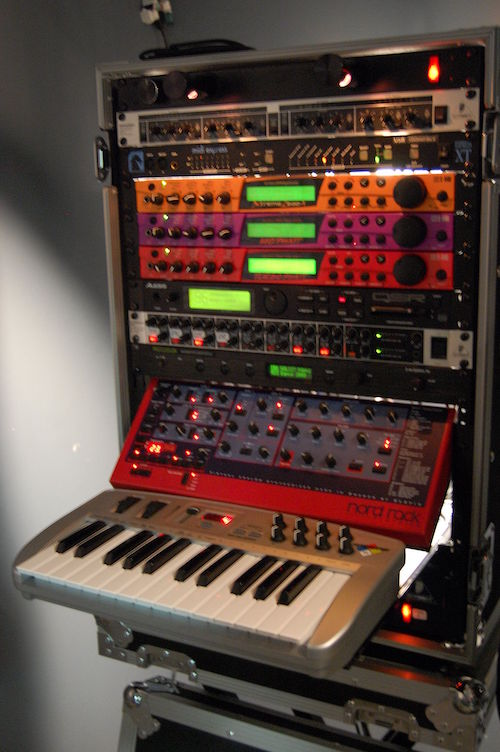

## MIDI medium and frames

- [MIDI 1.0](https://en.m.wikipedia.org/wiki/MIDI_1.0):
- Sent over [UART (basic serial)](https://learn.sparkfun.com/tutorials/serial-communication) connection
- 31250 bits per second
- each frame has one start bit (0), 8 data bits, one stop bit
- [MIDI tutorial on Sparkfun](https://learn.sparkfun.com/tutorials/midi-tutorial/hardware--electronic-implementation)

## MIDI messages

- One status byte, one or more data bytes
- Status byte has a "status" (4 bits) and (usually) a channel or address (4 bits)
- Data byte is a `0` followed by a 7 bit number.

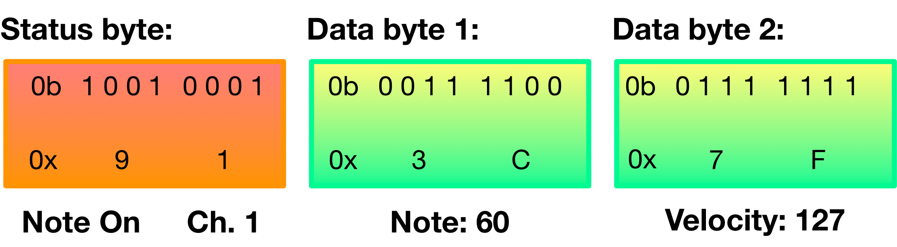

---

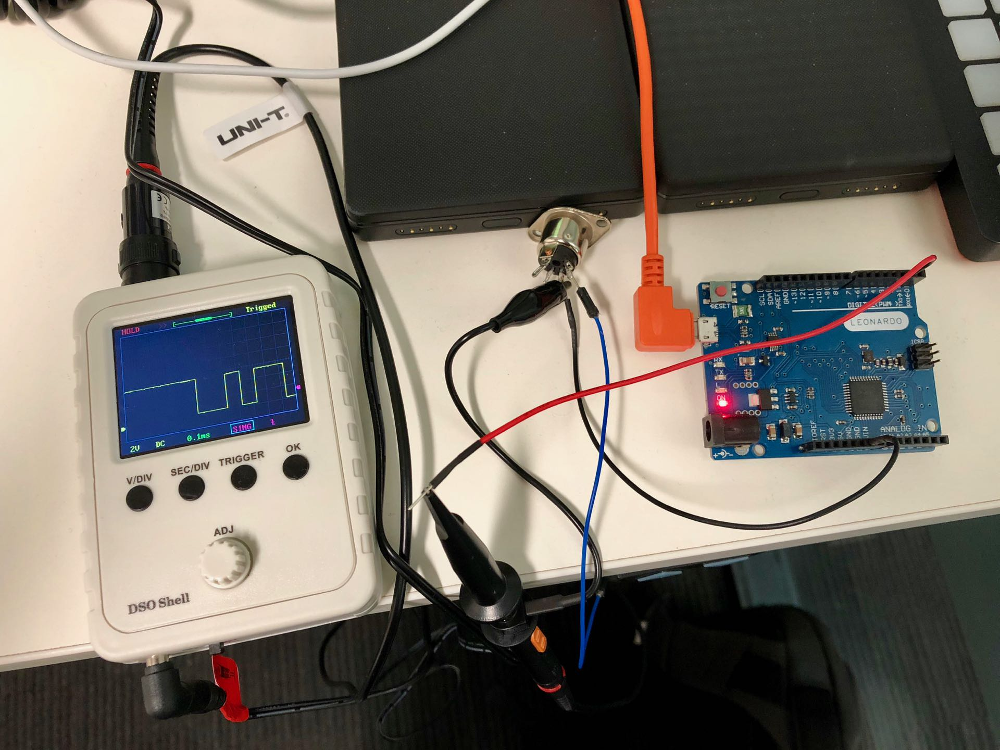

## Let's have a look at some bytes...

---

## Questions?

---

<iframe width="1120" height="630" src="https://www.youtube.com/embed/i6LGJ7evrAg" frameborder="0" allowfullscreen></iframe>

---

<!-- _class: talk-box -->

## talk

for the "lighting of the beacons" protocol:

- what's the transmission medium?
- what's the topology?
- is it simplex/half-duplex/full-duplex?
- is it circuit switched/packet switched?

## Serial vs parallel

| serial                                    | parallel                                                  |
| :---------------------------------------- | :-------------------------------------------------------- |
| data is sent one-bit-at-a-time            | multiple bits sent simultaneously (e.g. multiple wires)   |
| fewer bits sent per signal, but simpler   | need to keep all the connections in sync                  |

## Timing & synchronisation

There are two main approaches: synchronous and asynchronous. (See
[Sparkfun Serial Turorial](https://learn.sparkfun.com/tutorials/serial-peripheral-interface-spi))

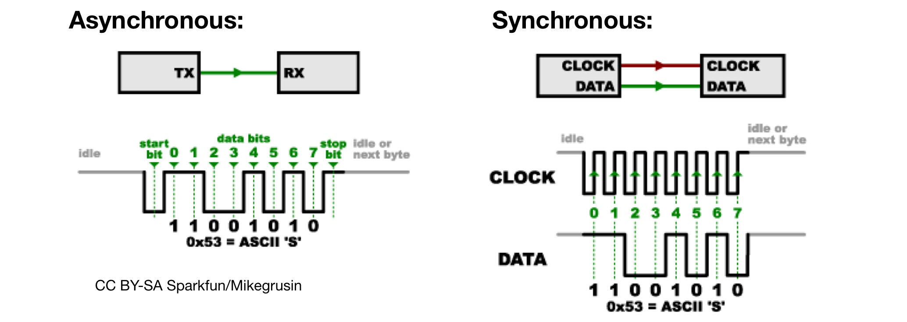

## Synchronous vs Asynchronous

| synchronous                                                                       | asynchronous                                                                                               |
| :-------------------------------------------------------------------------------- | :--------------------------------------------------------------------------------------------------------- |
| transitions on a *clock line* allow both ends to co-ordinate (e.g. [SPI](#spi))   | (independent) timers at each end are used to determine when to do things (e.g. RS232, Manchester coding)   |
| no clock skew issues, but requires an extra connection                            | no extra connections required, but more vulnerable to synchronisation issues                               |

---

<!-- _class: talk-box -->

## talk

where might the LollyNet example lead us astray compared to implementing a
protocol on the discoboard?

---

<!-- _class: impact -->

so far we've been building our vocabulary

now, let's get a bit more formal

# 7 layer OSI model

## What's the OSI model?

> The Open Systems Interconnection model (OSI model) is a conceptual model that
> characterizes and standardizes the communication functions of a
> telecommunication or computing system without regard to its underlying
> internal structure and technology (from
> [Wikipedia](https://en.wikipedia.org/wiki/OSI_model))

standardised in 1977: 7 layer architecture, connection oriented

hardy implemented anywhere in full...

...but its concepts and terminology are widely used, when describing existing
and designing new protocols

---

<!-- _class: impact -->

it's an abstract model

the **layers** are the key point

---

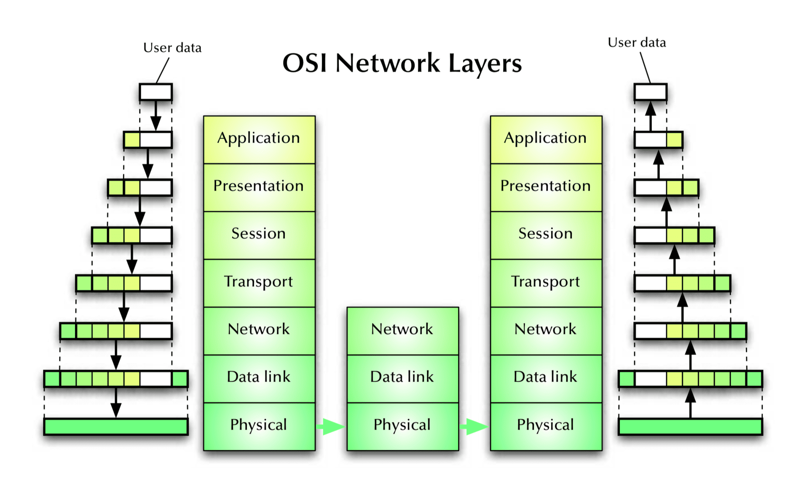

## Layer 1: physical layer

- Service: Transmission of a raw bit stream over a communication channel
- Functions: Conversion of bits into electrical or optical signals
- Examples: X.21, Ethernet (cable, detectors & amplifiers)

## Layer 2: data link layer

- Service: Reliable transfer of frames over a link
- Functions: Synchronization, error correction, flow control
- Examples: HDLC, LAP-B, LAP-D, LLC
  
## Layer 3: network layer

- Service: Transfer of packets inside the network
- Functions: Routing, addressing, switching, congestion control 
- Examples: IP, X.25

## Layer 4: transport layer

- Service: Transfer of data between hosts
- Functions: Connection establishment, management, termination, flow-control,
  multiplexing, error detection
- Examples: TCP, UDP, ISO TP0-TP4

## Layer 5: session layer

- Service: Coordination of the dialogue between application programs 
- Functions: Session establishment, management, termination
- Examples: RPC

## Layer 6: presentation layer

- Service: Provision of platform independent coding and encryption
- Functions: Code conversion, encryption, virtual devices
- Examples: ISO code conversion, PGP encryption

## Layer 7: application layer

- Service: Network access for application programs
- Functions: Application/OS specific
- Examples: APIs for mail, ftp, ssh, scp, discovery protocols

---

<!-- _class: talk-box -->

## talk

where does the most interesting stuff happen? which layer?

# Examples: standard protocols

## TCP/IP

## AppleTalk

## AppleTalk over IP

## SPI: Serial Peripheral Interface

- used by gazillions of devices... and it’s not even a formal standard!
- speed only limited by what both sides can survive
- usually push-pull drivers, i.e. fast and reliable, yet not friendly to wrong
  wiring/programming

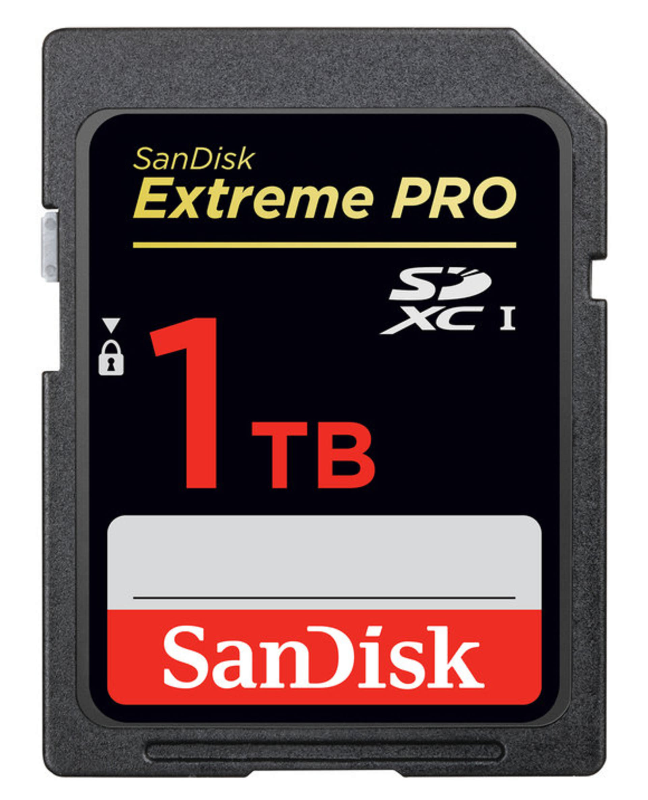

## SPI connections

full duplex, 4-wire, flexible clock rate

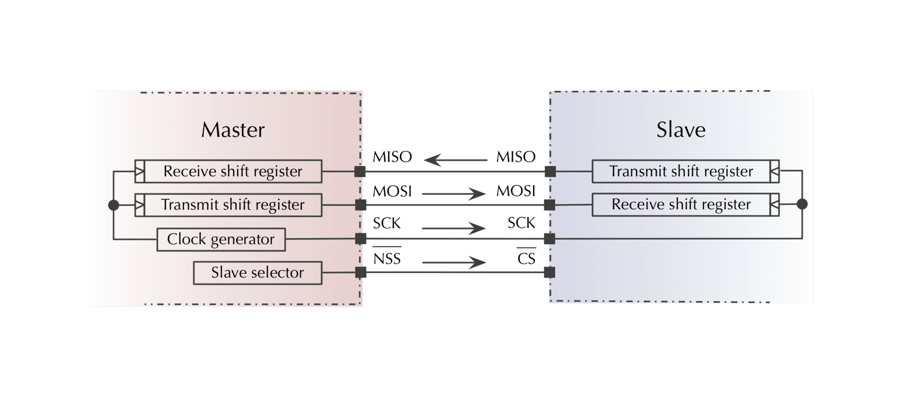

## SPI timing & data representation

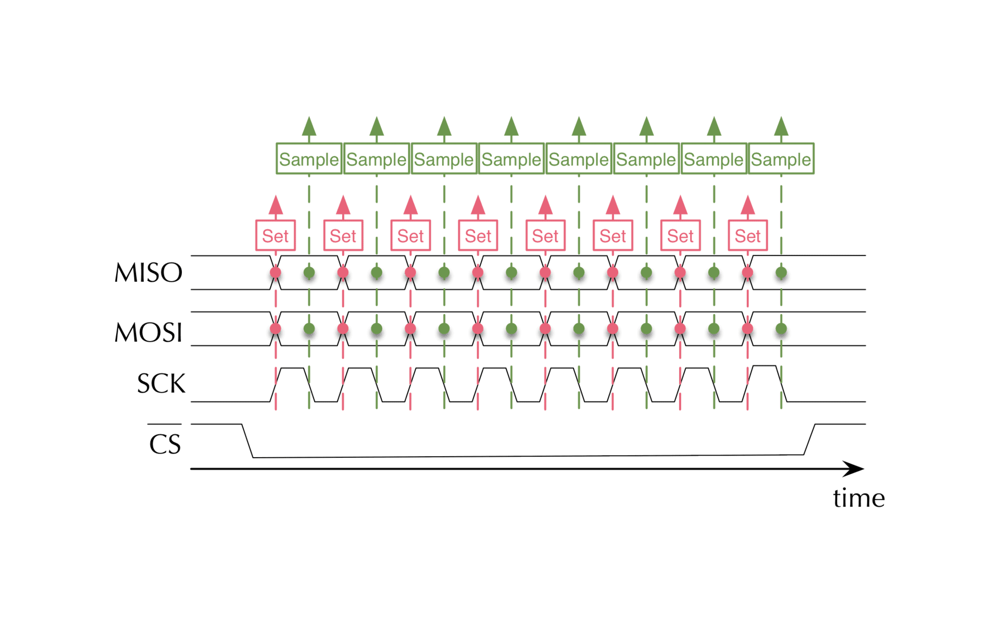

## SPI full-duplex with one slave

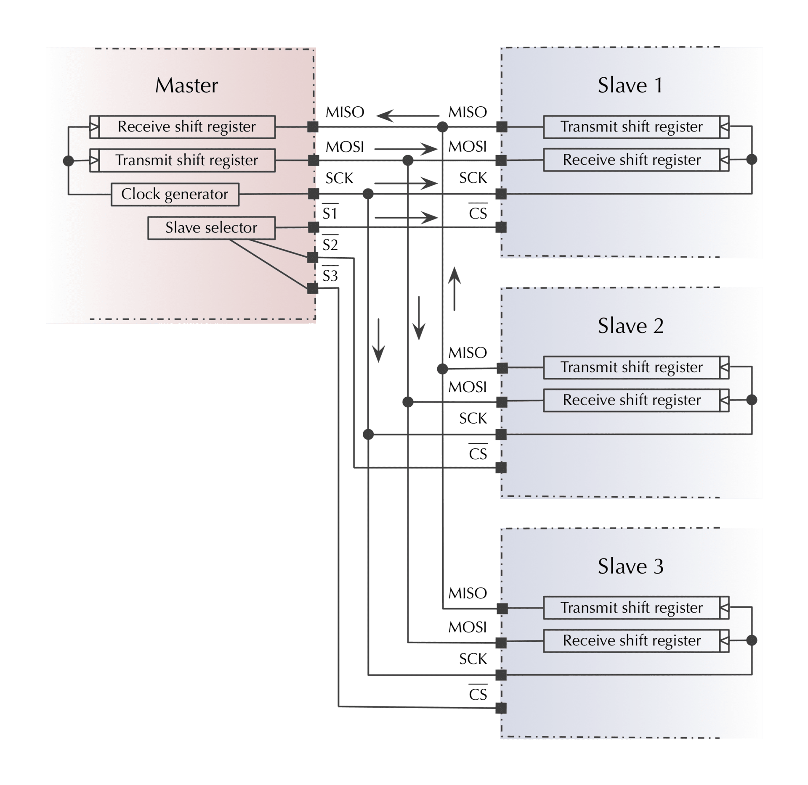

## SPI concurrent simplex with multi-slave

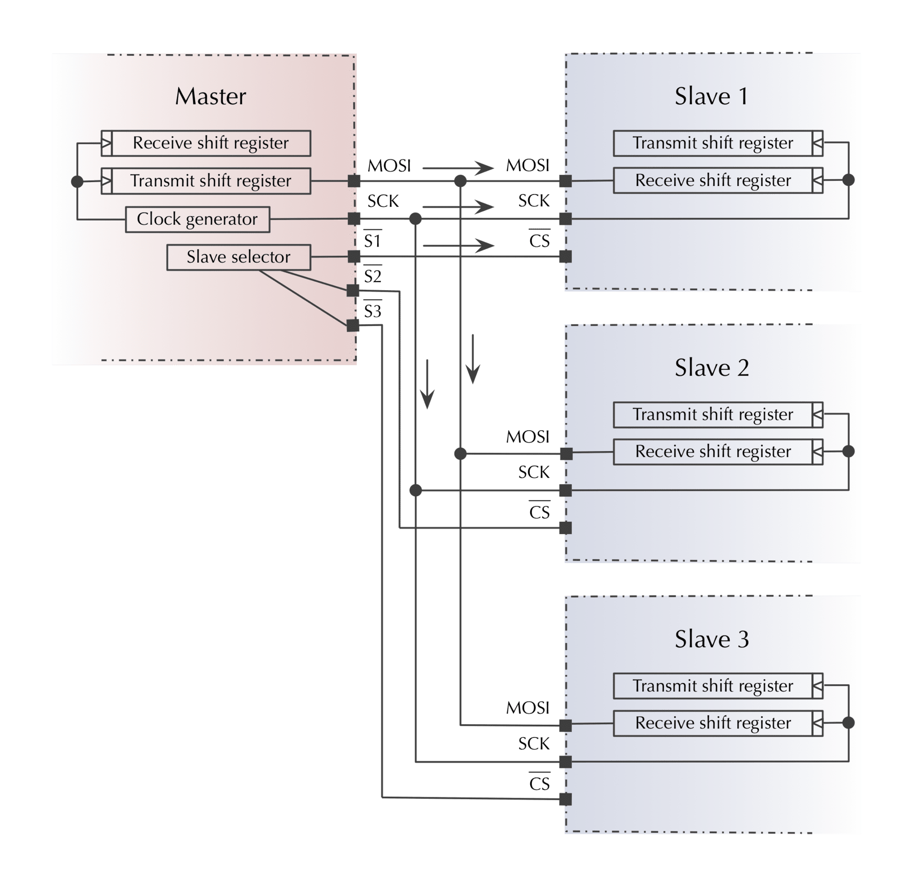

## SPI daisy-chaining (all slaves)

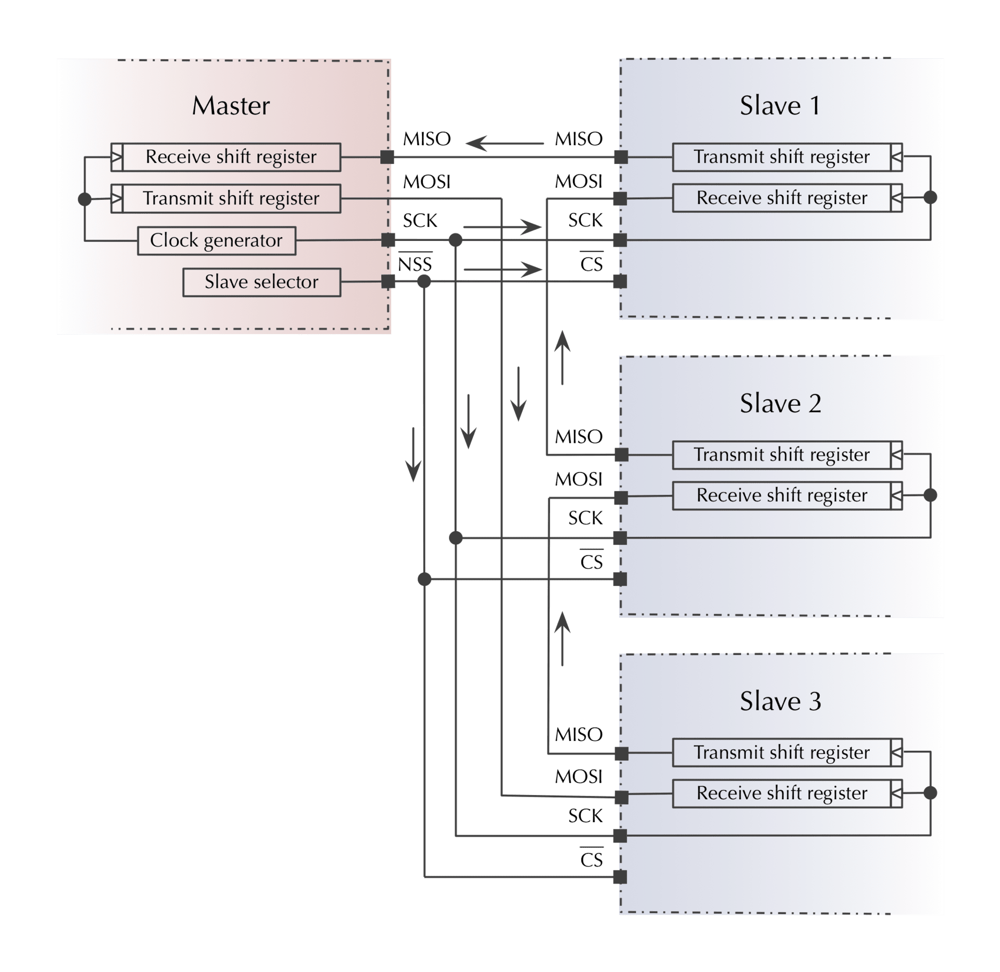

## Ethernet / IEEE 802.3

Local area network (LAN) developed by Xerox in the 70’s
- 10 Mbps specification 1.0 by DEC, Intel, & Xerox in 1980
- First standardised as IEEE 802.3 in 1983 (10 Mbps over thick co-ax cables)
- currently 1 Gbps (802.3ab) copper cable ports used in most desktops and
  laptops
- currently standards up to 100 Gbps (IEEE 802.3ba 2010)
- more than 85% of current LAN lines worldwide (according to the International
  Data Corporation)

---

<iframe width="1120" height="630" src="https://www.youtube.com/embed/i8CmibhvZ0c" frameborder="0" allowfullscreen></iframe>

in fact, all of **Ben Eater's** [youtube
videos](https://www.youtube.com/channel/UCS0N5baNlQWJCUrhCEo8WlA) are great

## Wifi / IEEE 802.11

Wireless local area network (WLAN) developed in the 90’s
- First standard as IEEE 802.11 in 1997 (1-2 Mbps over 2.4 GHz)
- Typical usage at 54 Mbps over 2.4 GHz carrier at 20 MHz bandwidth
- Current standards up to 780 Mbps (802.11ac) over 5 GHz carrier at 160 MHz
  bandwidth
- Future standards are designed for up to 100 Gbps over 60 GHz carrier
- Direct relation to IEEE 802.3 and similar OSI layer association

---

## remember the <a href=\

## P2300 - A discoboard sound control protocol

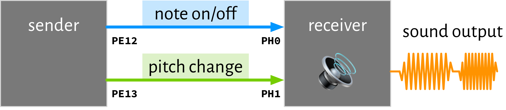

not widely used in industry...

but you'll implement it in [assignment 3](/deliverables/03-networked-instrument/)

## P2300 example

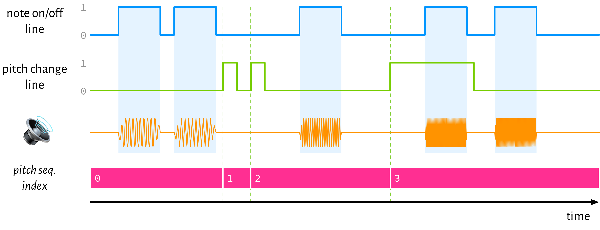

---

## Further study

this was a *really* high-level overview; a whirlwind tour

to go deeper, you could take
[COMP3310](https://programsandcourses.anu.edu.au/course/COMP3310)

---

## Questions
