<!-- _class: banner -->

# COMP2300

---

<!-- _class: info-box -->

## info

Make sure you pick up your jumper wires in your lab---you can't do [assignment
3](/deliverables/03-networked-instrument/) without
them.

Marks for Assignment 2 coming soon.


# Week 11: Operating Systems

## Outline

- [what is an OS?](#what-is-an-os)
- [privilege levels](#privilege-levels)
- [processes & scheduling](#processes-scheduling)


# What is an OS?

---

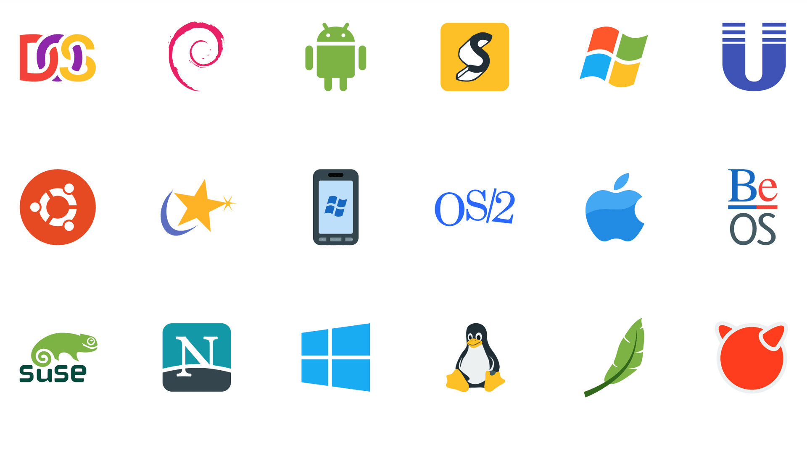

<!-- [source: iconscout](https://iconscout.com/icon-pack/operating-system-2) -->

---

<!-- _class: talk-box -->

## talk

what *is* an **operating system** (OS)?

## ...it's a virtual machine

offering a more familiar, comfortable and safer environment for your programs to
run in

- memory management
- hardware abstraction
- process management
- inter-process communication (IPC)

## ...it's a resource manager

co-ordinating access to hardware resources

- processors
- memory
- mass storage
- communication channels
- devices (timers, GPUs, DSPs, other peripherals...)


multiple tasks/processes/programs may be applying for access to these resources!

## A brief history of operating systems (1)

in the beginning: single user, single program, single task, serial processing---no OS

- 50s: system monitors/batch processing
  - the monitor ordered the sequence of jobs and triggered their sequential execution
- 50s-60s: advanced system monitors/batch processing:
  - the monitor handles interrupts and timers
  - first support for memory protection
  - first implementations of privileged instructions (accessible by the monitor only)
- early 60s: multi-programming systems:
  -  use the long device I/O delays for switches to other runnable programs
- early 60s: multi-programming, time-sharing systems:
  - assign time-slices to each program and switch regularly

## A brief history of operating systems (2)

- early 70s: multi-tasking systems
  – multiple developments resulting in UNIX (and others)
- early 80s: single user, single tasking systems, with emphasis on user interface or APIs. MS-DOS, CP/M, MacOS and others first employed 'small scale' CPUs (personal computers).
- mid-80s: Distributed/multiprocessor operating systems - modern UNIX systems (SYSV, BSD)
- late 70s: Workstations starting by porting UNIX or VMS to 'smaller' computers.
- 80s: PCs starting with almost none of the classical OS-features and services, but with an user-interface (MacOS) and simple device drivers (MS-DOS)

## A brief history of operating systems (3)

- last 20 years: evolving and expanding into current general purpose OSes, like for instance:
  - Solaris (based on SVR4, BSD, and SunOS, and pretty much dead now)
  - Linux (open source UNIX re-implementation for x86 processors and others)
  - current Windows (used to be partly based on Windows NT, which is 'related' to VMS)
  - MacOS (Mach kernel with BSD Unix and a proprietary user-interface)
- multi-processing is supported by all these OSes to some extent
  - but not (really) suitable for embedded, or real-time systems

## Distributed operating systems

- all CPUs carry a small kernel operating system for communication services
- all other OS services are distributed over available CPUs
- services may migrate
- services can be multiplied in order to guarantee availability (hot stand-by),
  or to increase throughput (heavy duty servers)

---


## Real-time operating systems?

---

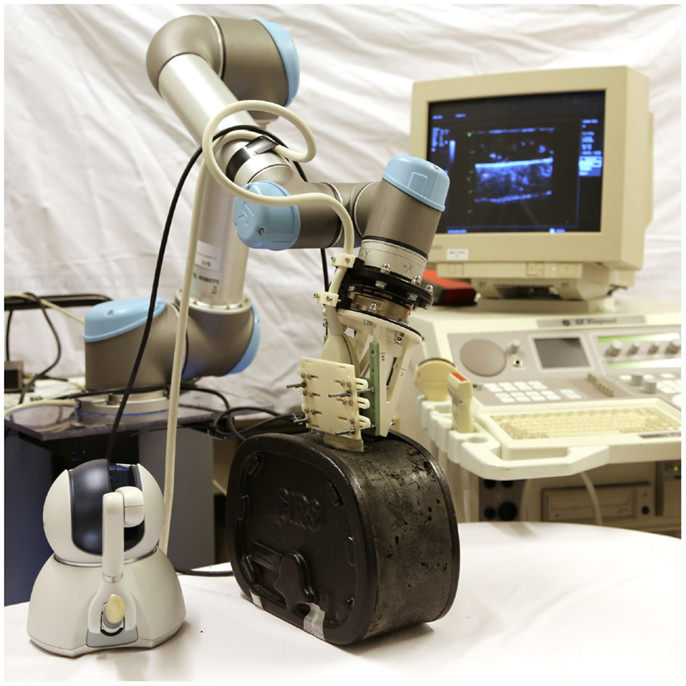

## Real-time operating systems?

---

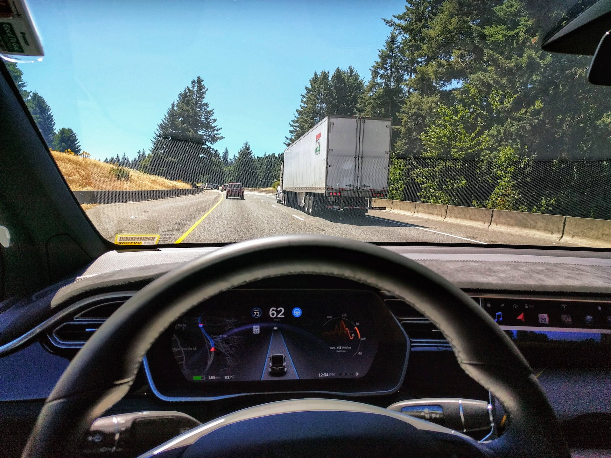

## Real-time operating systems?

## Real-time operating systems

<ul>
<li>
<span>fast context switches?</span>
<span class="fragment" style="float:right;">should be fast anyway</span>
</li>
<li>
<span>small size?</span>
<span class="fragment" style="float:right;">should be small anyway</span>
</li>
<li>
<span>quick response to external interrupts?</span>
<span class="fragment" style="float:right;">not <em>quick</em>, but predictable</span>
</li>
<li>
<span>multitasking?</span>
<span class="fragment" style="float:right;">often, not always</span>
</li>
<li>
<span>'low level' programming interfaces?</span>
<span class="fragment" style="float:right;">needed in many operating systems</span>
</li>
<li>
<span>interprocess communication tools?</span>
<span class="fragment" style="float:right;">needed in almost all operating systems</span>
</li>
<li>
<span>high processor utilisation?</span>
<span class="fragment" style="float:right;">fault tolerance builds on redundancy</span>
</li>
</ul>

## Real-time operating systems need to provide...

the logical correctness of the results as well as the correctness of the time:
*what* and *when* are both important

all results are to be delivered just-in-time – not too early, not too late.

timing constraints are specified in many different ways... often as a
response to 'external' events (reactive systems)

---

<!-- _class: impact -->

**predictability**, not performance!

## Embedded operating systems

- usually real-time systems, often hard real-time systems
- very small footprint (often a few kBytes)
- none or limited user-interaction


**90-95%** of all the processors in the world are in embedded systems

---


## How many OSes?

## Standard features?

is there a standard set of features for operating systems?


**no.**


the term *operating system* covers everything from 4 kB microkernels, to > 1 GB
installations of desktop general purpose operating systems

## Minimal set of features?

is there a *minimal* set of features?


almost: memory management, process management and inter-process communication/synchronisation would be considered essential in most systems


is there always an explicit operating system?


no: some languages and development systems operate with standalone runtime environments

## Process management

(we'll talk more about this [in a moment](#processes-scheduling))

basically, this is the task of keeping multiple things going all at once...

...while tricking them all into thinking they're the main game

---

<!-- _class: talk-box -->

## talk

what's a task?

## Memory management

remember memory? the OS is responsible for sharing it around

- allocation / deallocation
- virtual memory: logical vs. physical addresses, segments, paging, swapping, etc.
- memory protection (privilege levels, separate virtual memory segments, ...)
- shared memory (for performance, communication, ...)

## Synchronisation/inter-process communication

remember all the [asynchronism](/lectures/index/#async-interrupts-concurrency) stuff? the OS is responsible for managing that
as well

semaphores, mutexes, condition variables, channels, mailboxes, MPI, etc.

this is tightly coupled to scheduling / task switching!

## Hardware abstraction

remember all the specific load-twiddle-store addresses in the labs? no?

good news everyone! the OS does so you don't have to

- device drivers
- protocols, file systems, networking, everything else...

all through a consistent API

## Kernel: definition

the **kernel** is the program (functions, data structures in memory, etc.) which
performs the *core* role(s) of the OS

access to the CPU, memory, peripherals all happens *through* the kernel through
a [system call](#system-calls-with-svc)

---


---


---


---

<!-- _class: info-box -->

## info

if you want to look at some real system call APIs

on Linux,
- [`syscalls.h` header file](https://github.com/torvalds/linux/blob/master/include/linux/syscalls.h)
- [how to add a new system call](https://www.kernel.org/doc/html/v4.10/process/adding-syscalls.html)

on Windows,
- [Windows API Index](https://msdn.microsoft.com/en-us/library/windows/desktop/ff818516(v=vs.85).aspx)

---

<!-- _class: impact -->

writing an OS seems **complicated**

how is it done in practice?

## Monolithic OS


*(or 'the big mess...')*

- non-portable/hard to maintain
- lacks reliability
- all services are in the kernel (on the same privilege level)
- but: may reach high efficiency

e.g., most early UNIX systems, MS-DOS (80s), Windows (all non-NT based versions)
MacOS (until version 9), and many others...

## Monolithic & Modular OS


- modules can be platform independent
- easier to maintain and to develop
- reliability is increased
- all services are still in the kernel (on the same privilege level)
- may reach high efficiency

e.g., current Linux versions

## μKernels & client-server models


- μkernel implements essential process, memory, and message handling
- all 'higher' services are user level servers
- kernel ensures reliable message passing between clients and servers
- highly modular, flexible & maintainable
- servers can be redundant and easily replaced
- (possibly) reduced efficiency through increased communications

e.g., current research projects, μ, L4, Minix 3, etc.

---

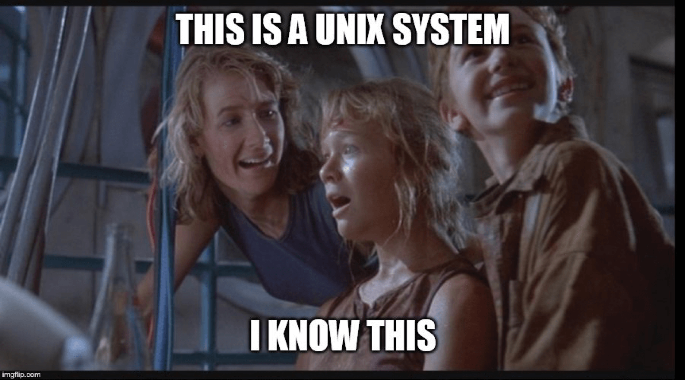

## Example: UNIX

- hierarchical file-system (maintained via `mount` and `unmount`)
- universal file-interface applied to files, devices (I/O), as well as IPC
- dynamic process creation via duplication
- choice of shells
- internal structure as well as all APIs are based on C
- relatively high degree of portability

many versions/flavours: UNICS, UNIX, BSD, XENIX, System V, QNX, IRIX, SunOS,
Ultrix, Sinix, Mach, Plan 9, NeXTSTEP, AIX, HP-UX, Solaris, NetBSD, FreeBSD,
Linux, OPENSTEP, OpenBSD, Darwin, QNX/Neutrino, OS X, QNX ROTS, ...


# Privilege levels

---

<!-- _class: talk-box -->

## talk

what do you think privilege means?

how does it affect your code running on the discoboard?

## Privilege

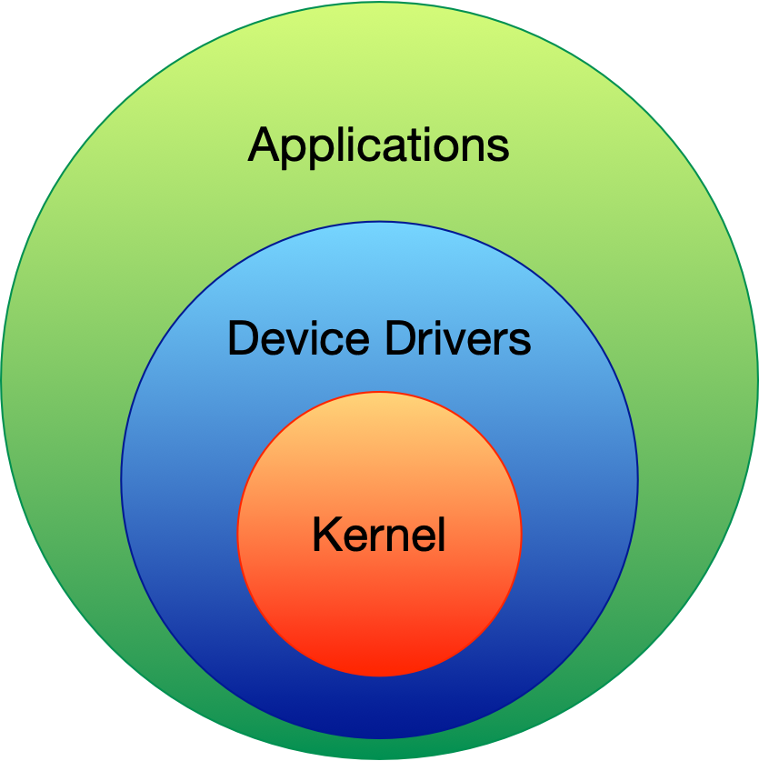


## Privilege levels

<!-- TODO -->

certain instructions can only be executed in "privileged" mode---this is
enforced in **hardware**

different architectures enforce this in different ways

check the manual (e.g. *Section A2.3.4* on p32 or *Table B1-1 Mode* on p568 of the [ARMv7-M reference
manual](/assets/manuals/ARMv7-M-architecture-reference-manual.pdf)

[Fun video for the nostalgic: What is DOS protected mode?](https://youtu.be/XAyQLV5bbb0)

## ARMv7-M execution levels

|                    | **thread** mode   | **handler** mode                        |
| :----------------- | :---------------- | :-------------------------------------- |
| **privileged**     | regular code      | all exceptions (including interrupts)   |
| **unprivileged**   | regular code      | n/a                                     |

priviliges may control:
- code execution
- memory read/write access
- register access (e.g., for peripherals)

## "Supervisor call" instruction

did you notice these entries in the [vector table](/labs/08-input-through-interrupts/#exercise-2)?

```arm
	.word	SVC_Handler
    @ ...
	.word	PendSV_Handler
```

the `svc` instruction (A7.7.175 in the [reference manual](/assets/manuals/ARMv7-M-architecture-reference-manual.pdf)) runs the
`SVC_Handler` immediately


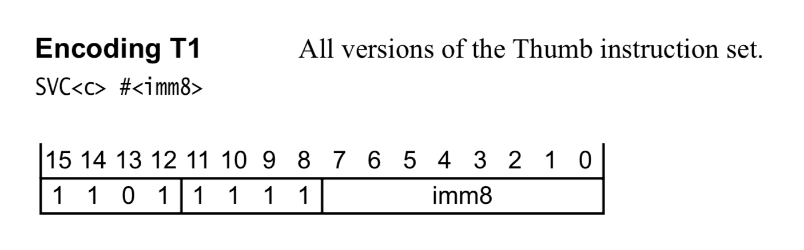

## Deferred supervisor call (PendSV)

there's a **PENDSVSET** bit (bit 28) in the Interrupt Control and State Register
(`ICSR`)

if set, the `PendSV_Handler` will be called according to the usual
interrupt/exception priority rules

both `SVC_Handler` and `PendSV_Handler` run in privileged mode, like *all* interrupts

---


## System calls with <code>svc</code>

How might we implement a system call on a discoboard?

How do [system calls work in linux](https://youtu.be/FkIWDAtVIUM)?


# Processes & scheduling

---

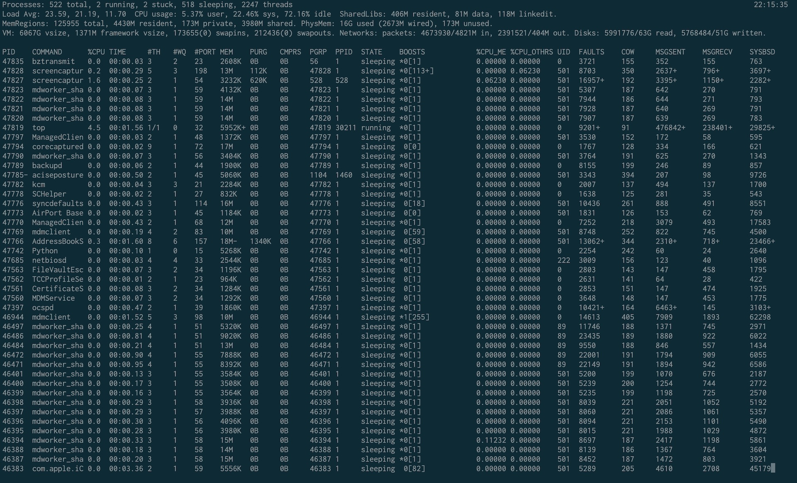

## Trust the Process

---

<!-- _class: talk-box -->

## talk

(if you've got your laptop here) how many processes are running on your machine
right now?

how about on your phone?

## Process: definition

basically: a *running* program

includes the code (instructions) for the program, and the current state/context:
- registers/flags
- memory (stack and heap)
- permissions/privileges
- other resources (e.g. global variables, open files & network connections,
  address space mappings)

---

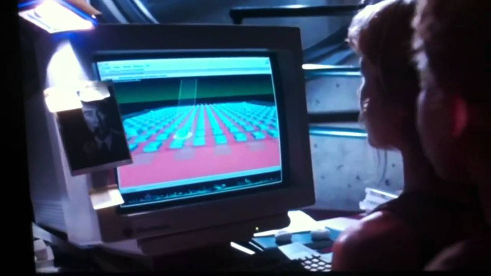

## processes as far as the eye can see

---

<!-- _class: impact -->

exact definition of process

**depends on the OS**

---

<!-- _class: impact -->

so how do we **manage** them?

## 1 CPU per control-flow


specific configurations only, e.g.:
- distributed microcontrollers
- physical process control systems

1 cpu per task, connected via a bus system
- Process management (scheduling) not required
- Shared memory access need to be coordinated

## 1 CPU for all control-flows


the OS may "emulate" one CPU for every control-flow

this is a **multi-tasking operating system**


- support for memory protection essential
- process management (scheduling) required
- shared memory access need to be coordinated

## Symmetric multiprocessing (SMP)


all CPUs share the same physical address space (and have access to the same
resources) so any process can be executed on any available CPU

## Processes vs threads

*processes* (as discussed [earlier](#process-definition)) have their own
registers, stack, resources, etc.

*threads* have their own registers & stack, but share the other process
resources

one process can create/manage many threads

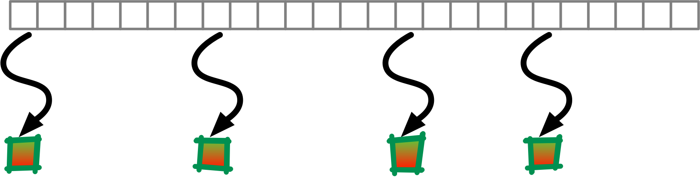

## Torvalds vs Threads

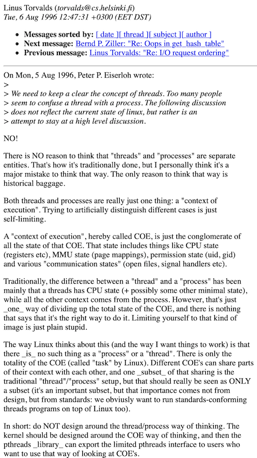

---


## \

## Process Control Blocks (PCBs)


- process ID
- process state: {String.fromCharCode(123)}created, ready, executing, blocked, suspended, bored ...{String.fromCharCode(125)}
- scheduling attributes: priorities, deadlines
- CPU state: (e.g. registers, stack pointer)
- memory attributes/privileges: permissions, limits, shared areas
- allocated resources: open/requested devices and files, etc.

---

<!-- _class: impact -->

a data structure for **processes**

## Process states

- **created**: the task is ready to run, but not yet considered by any dispatcher
- **ready**: ready to run (waiting for a free CPU)
- **running**: holds a CPU and executes
- **blocked**: not ready to run (waiting for a resource)
- **suspended**: swapped out of main memory (e.g. waiting for main memory space)

---

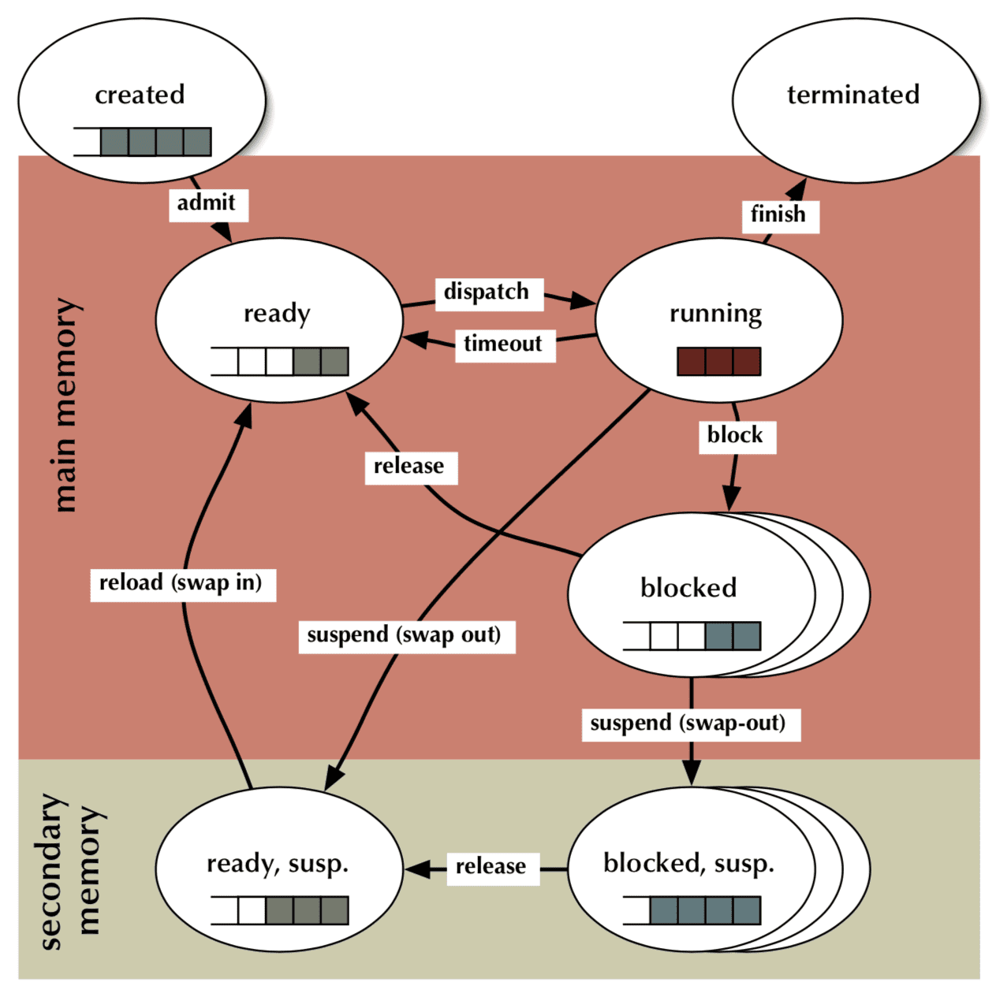

## First come, first served (FCFS) scheduling


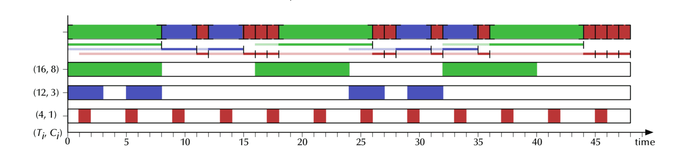

- **Waiting time**: 0..11, average: 5.9
- **Turnaround time**: 3..12, average: 8.4


even a deterministic scheduling schema like FCFS can lead to different outcomes

## FCFS (again)


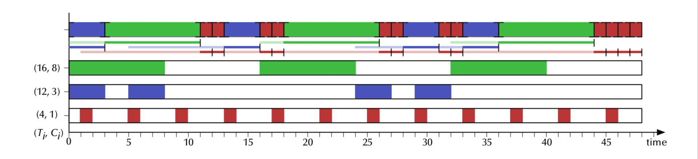

- **Waiting time**: 0..11, average: 5.4 (was 5.9 before)
- **Turnaround time**: 3..12, average: 8.0 (was 8.4 before)

FCFS gives the shortest possible *maximal* turnaround time

## Round-robin (RR) scheduling


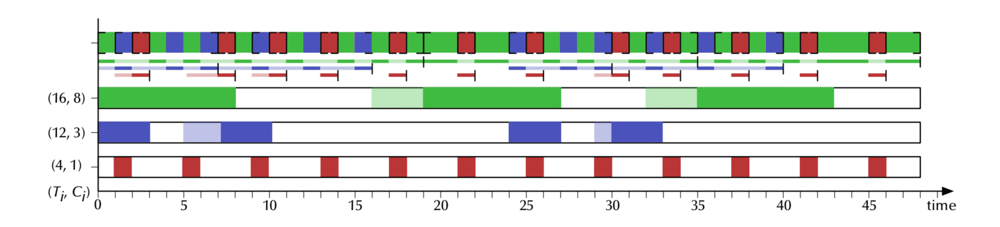

- **Waiting time**: 0..5, average: 1.2
- **Turnaround time**: 1..20, average: 5.8

optimised for swift initial responses, but "stretches out" long tasks

bound maximal waiting time! (depended only on the number of tasks)

---

<!-- _class: talk-box -->

## talk

when might you want to use FCFS scheduling? how about RR?

---


## Again, a whirlwind tour of OSes

remember the concepts

---

<!-- _class: impact -->

go build your own in [lab 11](/labs/11-diy-operating-system/)

---


## Questions

## Fun With Operating Systems

- [Kernel writing 101](https://arjunsreedharan.org/post/82710718100/kernels-101-lets-write-a-kernel)
- [Linux on an 8bit AVR](http://dmitry.gr/index.php?proj=07.+Linux+on+8bit&r=05.Projects)
- [How to make an operating system (WikiHow)](https://www.wikihow.com/Make-a-Computer-Operating-System)
