<!-- _class: banner -->

# COMP2300

---

<!-- _class: info-box -->

## info

- Got your little wires?
- Forked your assignment?
- Surviving the end of semester?


# Week 12: Architecture

---

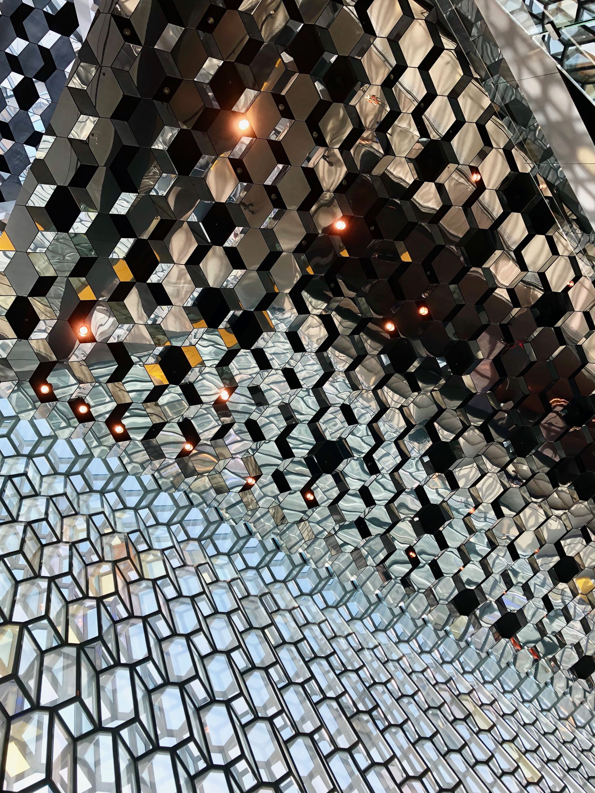

---


---


---


---


---

<!-- _class: talk-box -->

## talk

what is architecture?

## Outline

- [origins](#origins)
- [architectures](#architectures-section)
- [alternatives?](#alternatives)
- [visual ARM1](#visual-arm1-simulation)
- [Bela - a real-time music computer](#bela)


# Origins

---

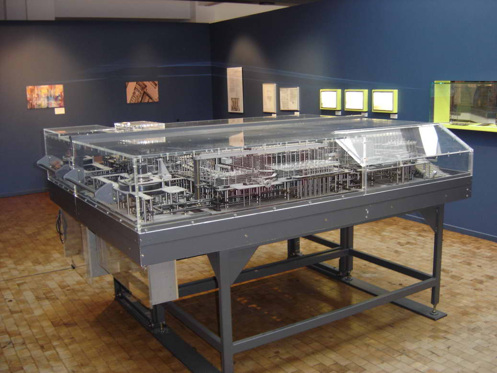

## The Z1 (1937)

created by Konrad Zuse

first digital computer: relays, programmable via punch tape, 1 Hz clock, 64
words of memory @ 22-bit, 2 registers, floating point unit, weight 1 ton


[image](https://en.wikipedia.org/wiki/Z1_(computer)#/media/File:Zuse_Z1-2.jpg) from
[ComputerGeek](https://de.wikipedia.org/wiki/User:ComputerGeek), [CC BY-SA
3.0](http://creativecommons.org/licenses/by-sa/3.0/)

---

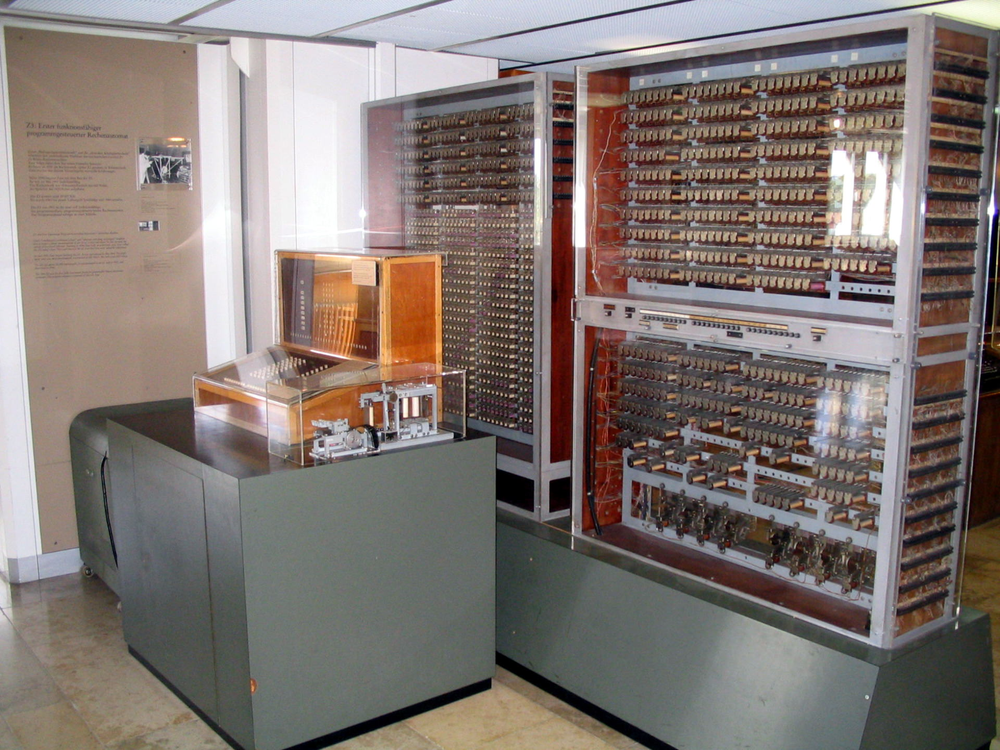

## Z3 (1941)

first freely programmable (Turing complete) computer, relays, 5.3 Hz clock


[image](https://en.wikipedia.org/wiki/Z3_(computer)#/media/File:Z3_Deutsches_Museum.JPG) from
[Venusianer](https://de.wikipedia.org/wiki/User:Venusianer), [CC BY-SA
3.0](http://creativecommons.org/licenses/by-sa/3.0/)

---

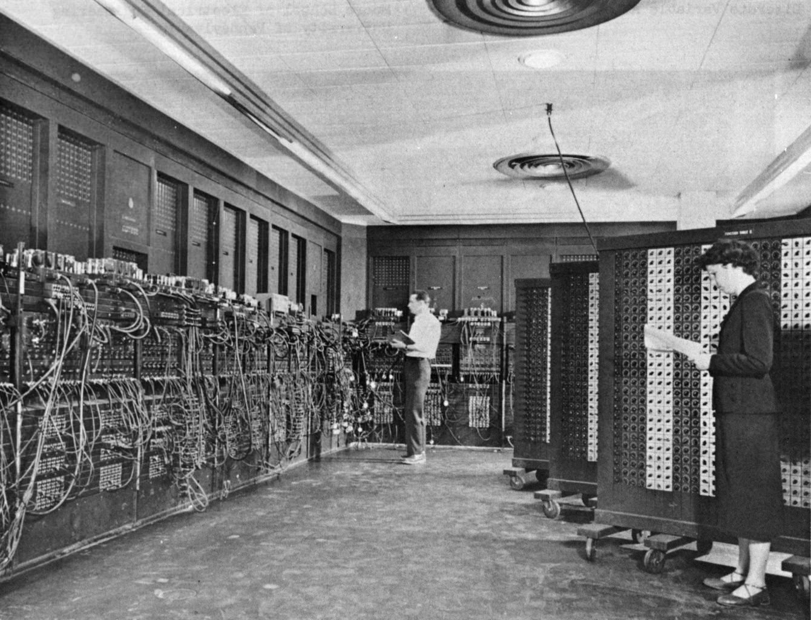

## ENIAC (1945)

<!-- *"First Draft of a Report on the EDVAC"* (Electronic Discrete Variable Automatic -->
<!-- Computer) by John von Neumann was an influential article about core elements of -->
<!-- a computer: arithmetic unit, control unit (sequencer), memory (holding data and -->
<!-- program), and I/O -->

ENIAC: first Turing complete vacuum-tube computer, 100 kHz clock, weight 27
tons, size 167 sq m


[image](https://commons.wikimedia.org/wiki/File:Eniac.jpg) from [U.S. Army
Photo](https://de.wikipedia.org/wiki/User:Venusianer), public domain

---

<!-- _class: impact -->

... then came the **discoboard**


*(not really)*


# Architectures

## Harvard architecture

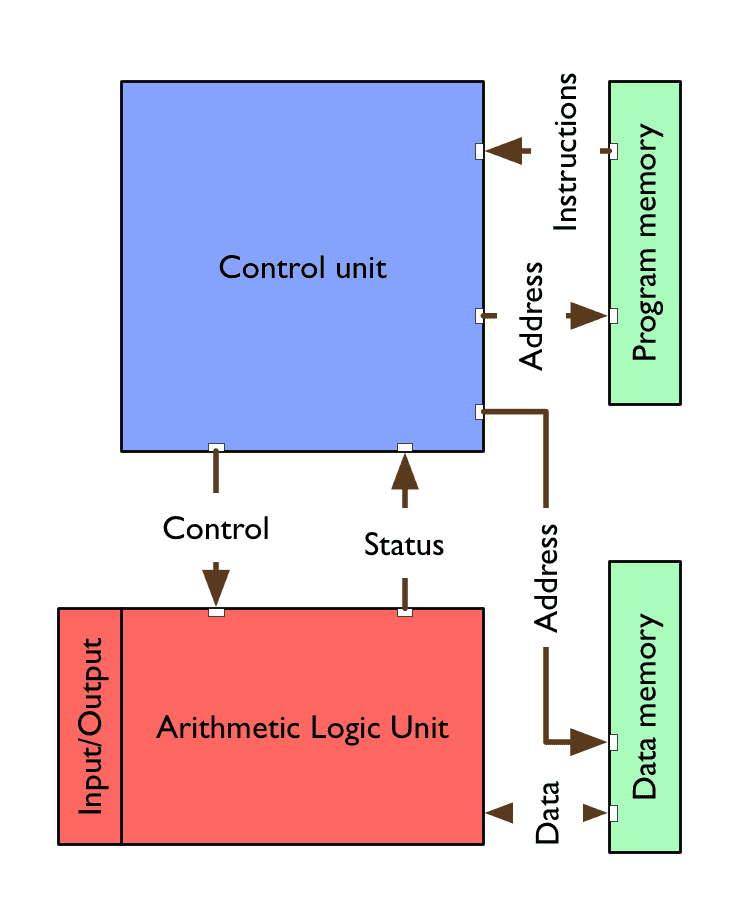

**control unit** concurrently addresses program and data memory and fetches next
instruction---controls next ALU operations and instruction based on ALU status

**Arithmetic Logic Unit** (ALU) fetches data from memory, executes
arithmetic/logic operations, and writes data to memory

separate memory for program & data

## von Neumann architecture

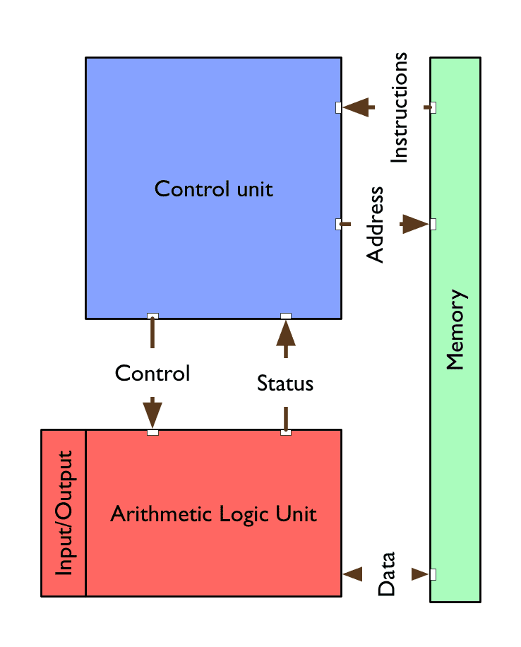


**control unit** sequentially addresses program and data memory and fetches next
instruction---controls next ALU operations and instruction based on ALU status

**Arithmetic Logic Unit** (ALU) fetches data from memory, executes
arithmetic/logic operations, and writes data to memory

program and data memory not distinguished (so programs can change themselves)

## A simple CPU


**decoder/sequencer** converts instructions into CPU control signals

**arithmetic logic unit** (ALU) performs maths & logic operations

**registers** provide small, fast storage to the CPU

**flags** indicate the states of the latest calculations

**code/data management** for loading/storing, caching

**memory**

## Pipeline

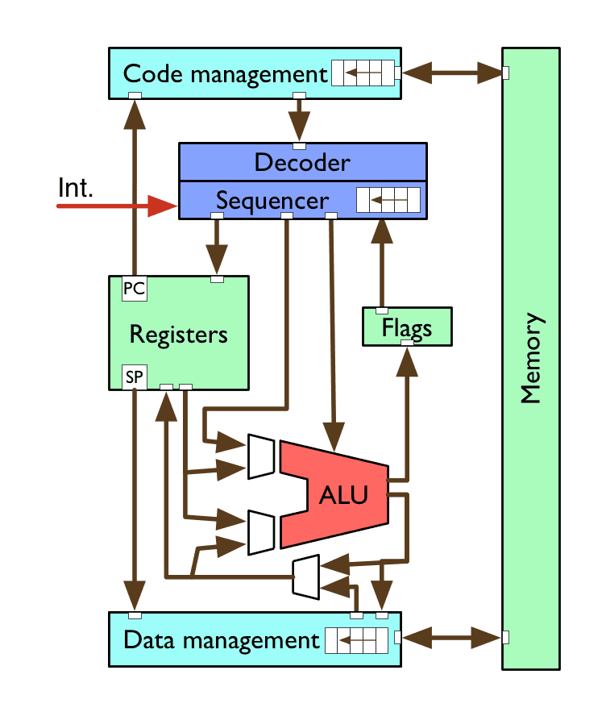

some CPU actions are naturally sequential (e.g.
[fetch-decode-execute](/lectures/02-alu-operations/#fetch-decode-execute)).

an **instruction pipeline** allows these sequences to be overlapped in *time*

same latency, but higher throughput

---


## Simple Pipeline


<!-- https://www.anandtech.com/show/12785/arm-cortex-a76-cpu-unveiled-7nm-powerhouse/2 -->
<!-- https://www.anandtech.com/Show/Index/2493?cPage=2&all=False&sort=0&page=11&slug= -->

## Pipeline example


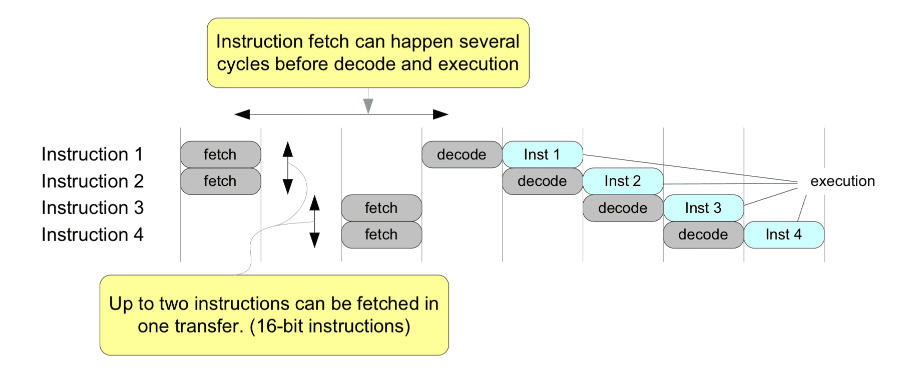

(from p15. [ARM Cortex-M Programming Guide to Memory Barrier
Instructions](/assets/manuals/ARM-cortex-M-programming-guide-to-memory-barrier-instructions.pdf))

(conditional) branches might break the pipelines (requiring a "flush").

## Pipeline Hazards

- Hazards are circumstances that prevent the pipeline from working
  efficiently.
- **Data**: When the outcome of one instruction is required to execute
  the next.
- **Structural**: When part of the CPU hardware required by two
  instructions simultaneously (e.g., memory to fetch and store simultaneously).
- **Control**: When the location of the next branch is unknown until an instruction is executed. 

## How do you deal with these?

- Add "bubbles" in the pipeline?
- branch prediction?
- out-of-order execution?
- all these have [downsides](https://en.wikipedia.org/wiki/Spectre_(security_vulnerability))

---


## Out-of-order execution

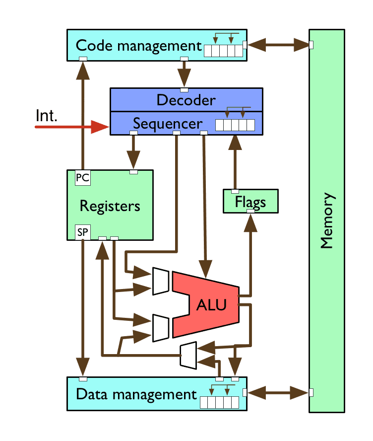

re-ordering the sequence inside each pipeline leads to 'out of order' CPU designs

pipeline becomes a hardware scheduler, and results need to be
"re-sequentialised" (or possibly discarded)

finer-grained sequences can be introduced by breaking CPU instructions into
micro code (better if there are more independent instructions)

## Out-of-order example

$$f(a, b, c) = (a + b) \times c$$


```arm
@ in-order
ldr r0, =0x20000000
ldr r1, [r0] @ load a into r1
ldr r2, [r0, 4] @ load b into r2
ldr r3, [r0, 8] @ load c into r3
add r1, r1, r2  @ add a and b
mul r0, r1, r3  @ (a + b) * c
```


```arm
@ out-of-order
ldr r0, =0x20000000
ldr r1, [r0]
ldr r2, [r0, 4]
add r1, r1, r2  @ these two are
ldr r3, [r0, 8] @ switched around
mul r0, r1, r3
```

[Computerphile](https://www.youtube.com/watch?v=_qvOlL8nhN4) has a more detailed
explanation

---


## it's not <em>quite</em> magic, but...

## SIMD/vector processing


**S**ingle **I**nstruction **M**ultiple **D**ata ALUs provide the facility to
apply the same instruction to multiple "datas" concurrently

often requires special "wide" registers and new instructions (e.g. fitting 4
32-bit values into one 128-bit register, then adding them all using one SIMD
instruction)

requires specialised compilers or programming languages with implicit
concurrency

*examples*: NEON, Altivec, MMX, SSE2/3/4, AVX

## Hyper-threading


emulates multiple "virtual" CPU cores by replicating:


- register sets
- decoder/sequencer
- flags
- interrupt logic

while sharing other resources like the ALU, data management

*examples*: Intel Core i-series, POWER9 (up to 8 threads per core)

---

<!-- _class: talk-box -->

## talk

what sort of workloads would benefit from SIMD? how about hyperthreading?

## Multi-core CPUs


full replication of multiple CPU cores on the same chip package

often combined with the other techniques discussed

cleanest and most explicit implementation of concurrency on the CPU level

requires synchronised atomic operations, and programming languages with implicit
or explicit concurrency


# Alternatives?

---

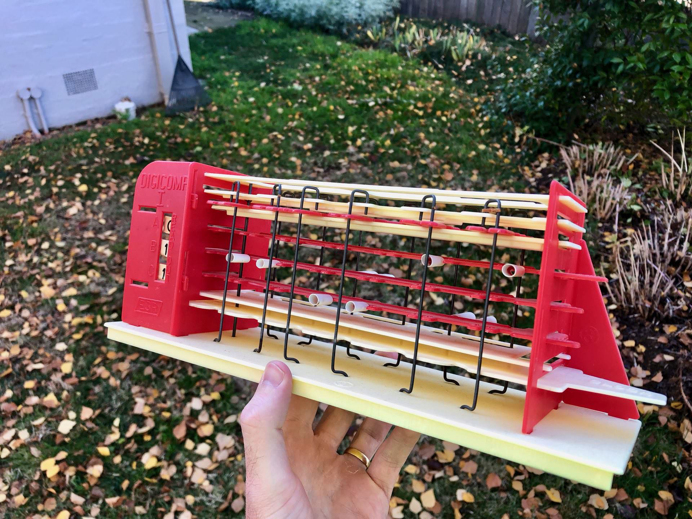

## Digital Computing in Plastic!

## Parallax Propeller


## Embedded Programming without Interrupts

<iframe class="stretch" src="https://www.youtube.com/embed/Iuf44VCMh60?rel=0&amp;showinfo=0" frameborder="0" allow="autoplay; encrypted-media" allowfullscreen></iframe>

## RISC-V


<https://riscv.org/>

*The Free and Open RISC Instruction Set Architecture*

a collaborative design effort

small core ISA with lots of optional "extensions" (e.g. floating point, SIMD/vector ops)

this allows it to scale from embedded to HPC (in *principle*)

---


## Intel x86/amd64?

---


## Visual ARM1 simulation

ARM1 chip (created in 1985) is the ancestor of all smartphone chips, and also
the discoboard

check out this [visual ARM1
simulation](http://visual6502.org/sim/varm/armgl.html) (runs in the web browser)

also see [Ken Shirrif's explanation](http://www.righto.com/2015/12/reverse-engineering-arm1-ancestor-of.html)

---

<!-- _class: impact -->

do you (kindof) **get it**?

---

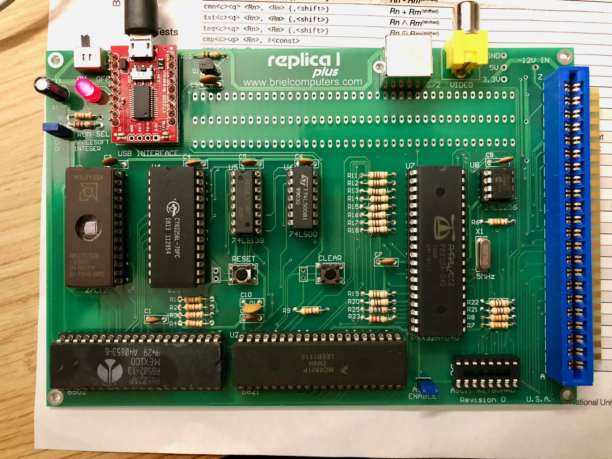

## Replica 1 Demo!

## Replica 1 Demo

Let's have a look at an Apple I... replica! (1975)

- modern replica of Apple I computer 
- [Serial Programming](http://sowerbutts.com/replica1-serial/)
- No OS (has a "monitor" program and BASIC interpreter in ROM).
- MOS6502 processor, [6821 peripheral interface adapter](https://en.wikipedia.org/wiki/Peripheral_Interface_Adapter) (PIA), one bank
  of RAM, one ROM
- Modern things: USB serial adapter, Parallax Propeller (drives video
  and manages keyboard).
  
## Make your own?

- [Ben Heck Apple 1 Replica Build](https://github.com/thebenheckshow/158-tbhs-apple-1-replica)
- Get parts from [AliExpress/Ebay](https://www.aliexpress.com/item/33003055433.html), grab a soldering iron and start hacking!
- Alternative--Z80 computer with a "new" design: [RC2014](https://rc2014.co.uk)
- Build computer just from [logic gates](https://eater.net/8bit/)?

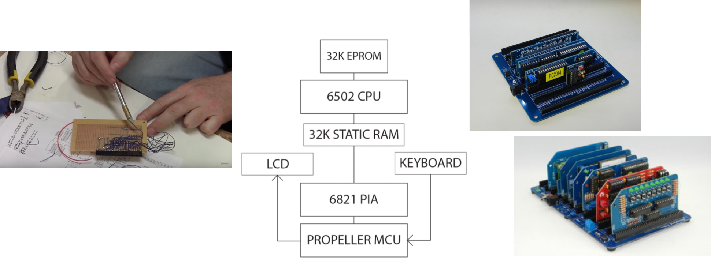

<!-- music topic -->


# Extra Topic: Real-Time Musical Devices

---

<!-- _class: impact -->

New Interfaces for Musical Expression

---


---

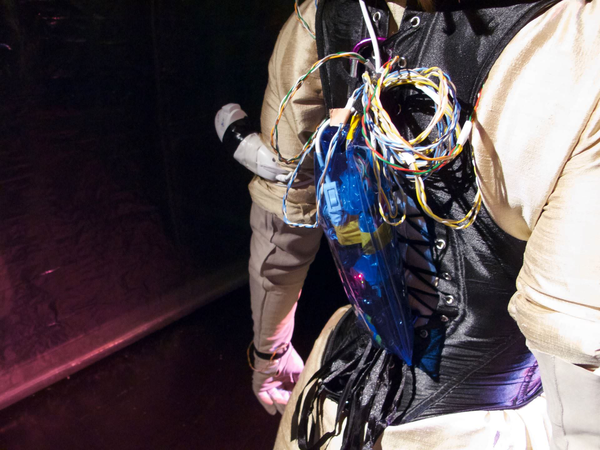

---

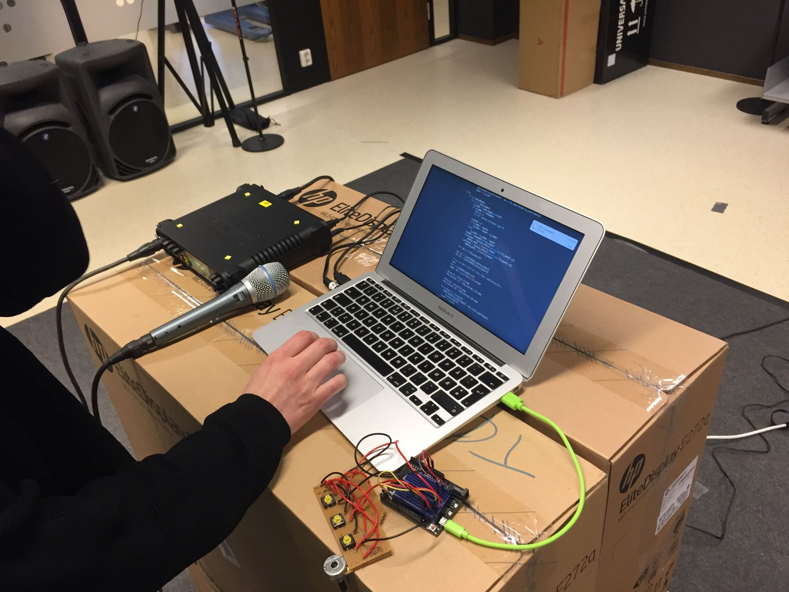

---

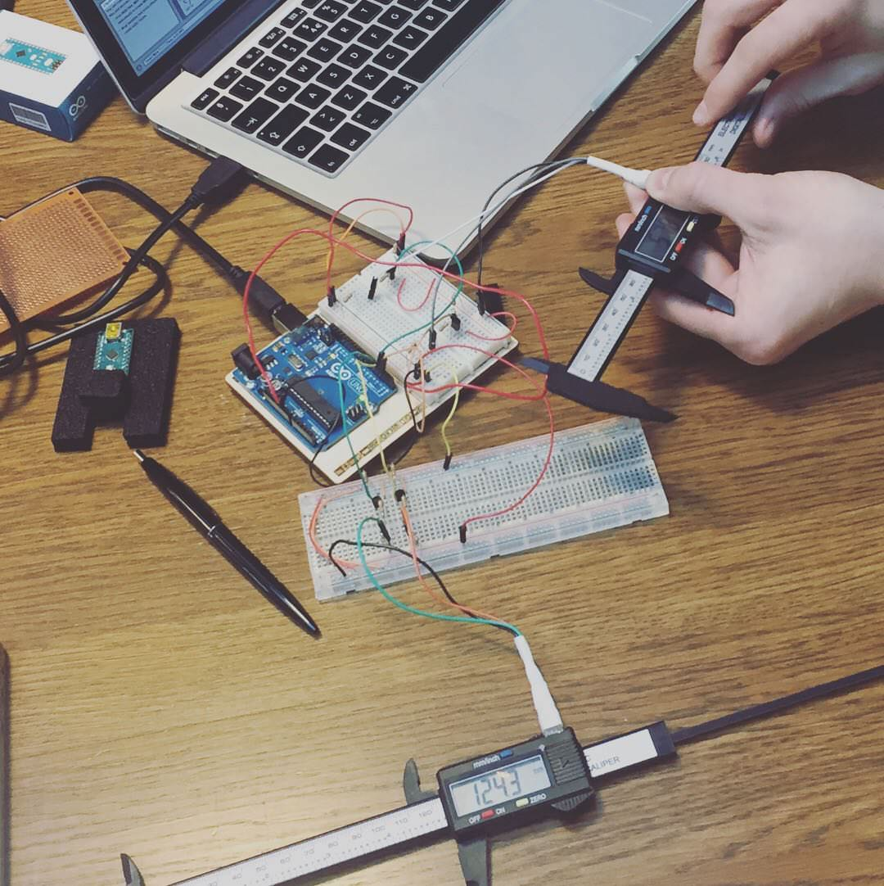

---


---


---


Image Copyright SENNHEISER / PHILIP PEINE

---


## The [NIME community](https://nime.org)

- ...new kinds of musical instruments... 
- ...new kinds of musicianship...
- ...and new kinds of music?

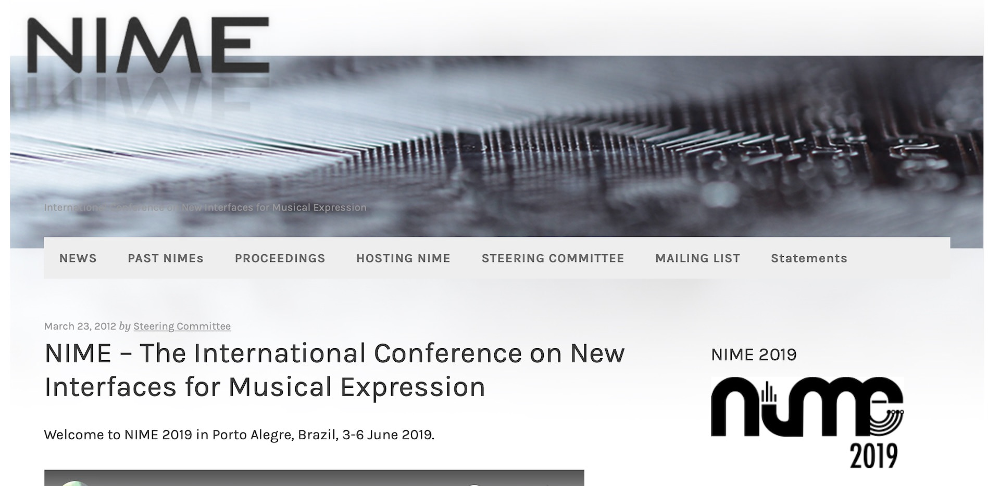

## Typical NIME workflow...

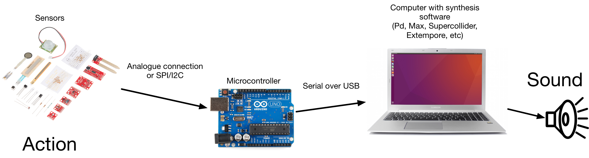

## Sound and Latency

- Digital (and analogue) instruments always have a latency between
  action and sound.
- Strings, fingers, keys, and electrons take time to move.
- Sound takes time to move...
- Computers buffer sound (a little bit) to make sure it has enough to
  send to the DAC.
- More steps, more buffers, more latency...

## How fast is fast enough?

- Common wisdom is to aim for latency <10ms (Wessel & Wright, 2002).
- Musicians adjust (unconciously) and can handle latency up to 55ms
  (Dahl & Bresin, 2001)
- Different gestures, and sounds, could have different perceptual
  effects.

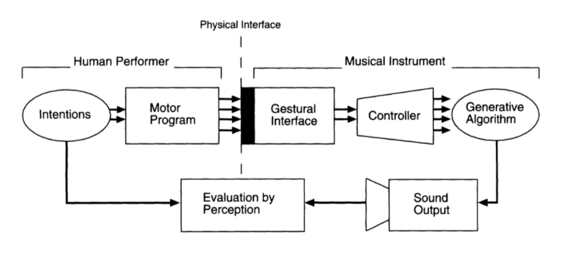

## Are the tools good enough?

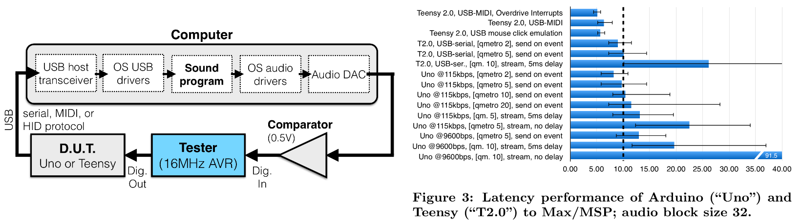

**No** - according to McPherson, Jack, & Moro, "Action-Sound Latency: Are Our Tools Fast Enough?" (2016).

## So what about a Real-Time Operating System?

- Linux kernel and OS (by itself), not good enough for real-time!
- Normal drivers can't preempt the kernel...


## Bela: Low-Latency Sensor and Audio Platform

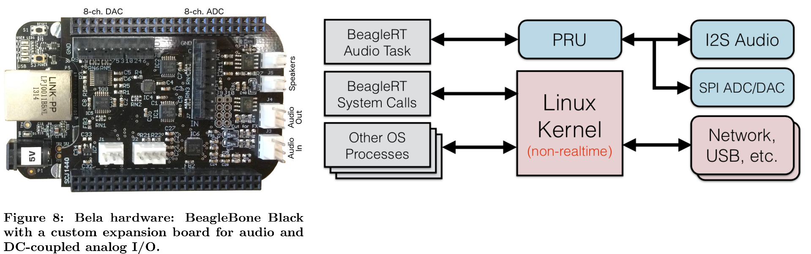

- Specifically designed to solve this problem!
- Realtime Linux (Xenomai)
- Programmable Real-time unit (PRU)

<!-- Bela Overview -->

---

<iframe width="1120" height="630" src="https://www.youtube.com/embed/Os2ljj1cIog" frameborder="0" allowfullscreen></iframe>

<!-- https://youtu.be/Os2ljj1cIog -->

## Xenomai: Linux with Real-time extensions

- [Xenomai](https://xenomai.org): Add two extra [micro-kernels to linux](lectures/bela/satellite-ccrma.jpg), which can preempt the normal kernel.
- "Adeos" is a nano-kernel just to switch between Linux and Xenomai.

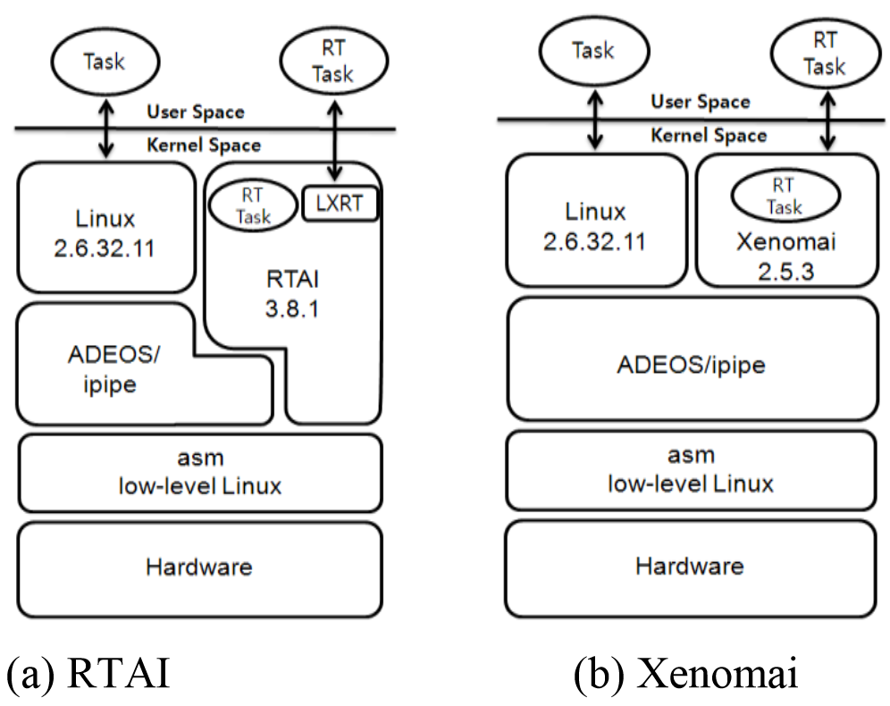

## PRU (Programmable Real-Time Unit)

- [Extra microcontroller](https://beagleboard.org/pru) (200MHz, 32bit)
  as part of a processor.
-  [Beaglebone PRU](https://www.embeddedrelated.com/showarticle/586.php)
- Hackaday [PRU](https://hackaday.com/2014/06/22/an-introduction-to-the-beaglebone-pru/)

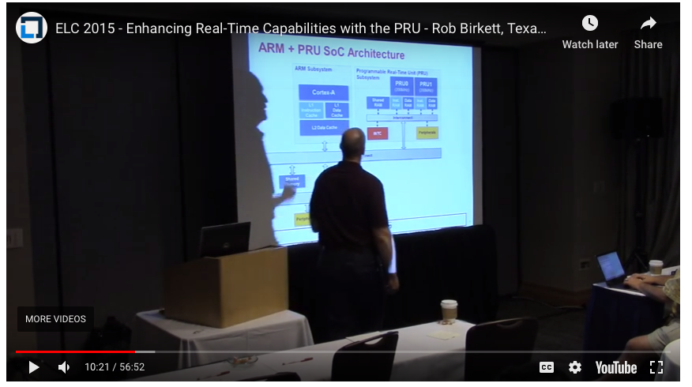

## Does this work?

**Yes!**

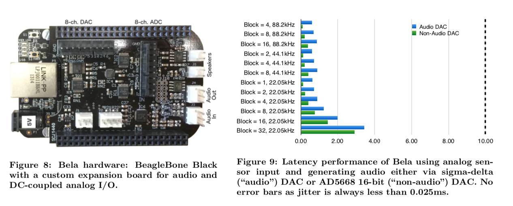
o
<!-- Guitars -->

---

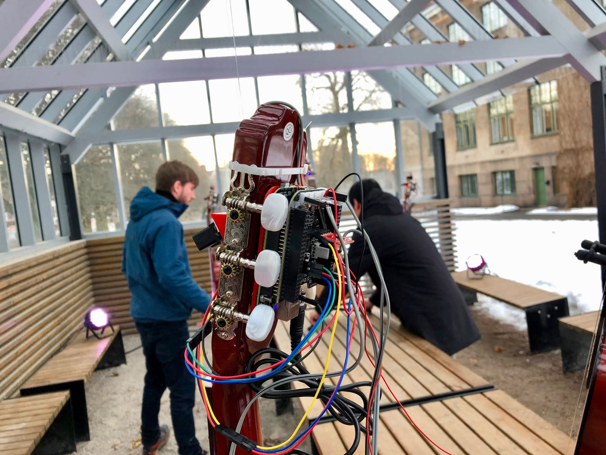

---


---

<iframe width="1120" height="630" src="https://www.youtube.com/embed/fhTuI3AhZL0" frameborder="0" allowfullscreen></iframe>

<!-- Stillness under Tension -->

---

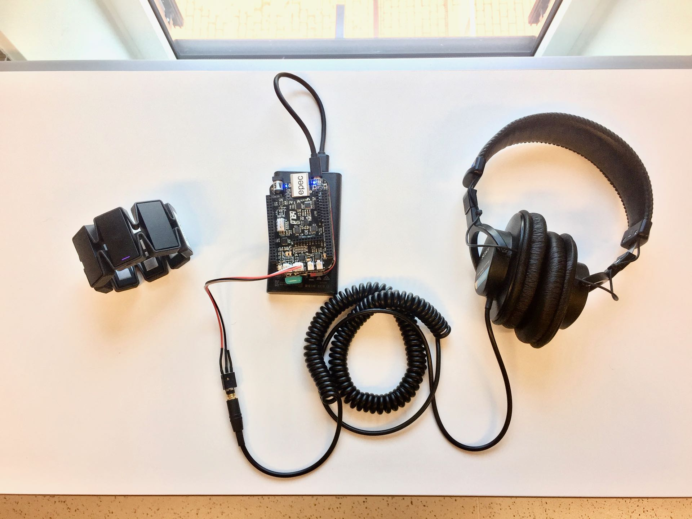

---


---

<iframe width="1120" height="630" src="https://www.youtube.com/embed/tDkJqoFpnF8" frameborder="0" allowfullscreen></iframe>

## Videos

- Sverm Resonans: https://youtu.be/fhTuI3AhZL0
- Percussive Table: https://vimeo.com/264852700
- Kalichord Strum: https://www.youtube.com/watch?v=mZksorXIOxM
- Stillness Under Tension: https://youtu.be/tDkJqoFpnF8

<!-- End -->

---


## congrats 🎉

---


## Questions
