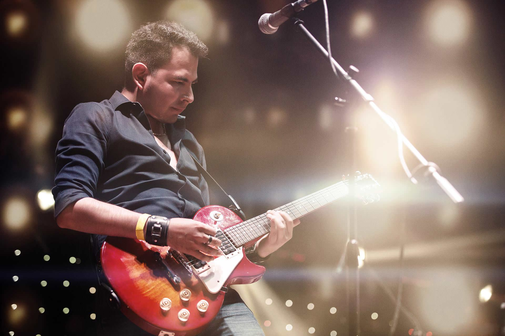

<iframe width="1120" height="630" src="https://www.youtube.com/embed/y6Sxv-sUYtM" frameborder="0" allowfullscreen></iframe>

<h1 id="title" class="center">COMP2300/6300</h1>

<strong>Revision Song</strong>

Dr. Ben Swift

<em>Semester 1, 2018</em>

---

<!-- _class: info-box -->

## info

[ass3](/deliverables/03-networked-instrument/) due
~~tomorrow~~ **Monday** at 9pm (I won't be contactable over the long weekend)

**final exam** details and practice exams up [on the course
website](/deliverables/05-final-exam/)

remember, there's a [40% hurdle](/01-policies.md#final-exam) on the final exam

# COMP2300 Revision Song

---

it might seem crazy what i'm 'bout to say

my register is made of [logic gates](/lectures/01-intro-and-digital-logic/#combinational-logic)

with [feedback loops](/lectures/01-intro-and-digital-logic/#sequential-logic) to maintain the state

pingin' along at a crazy rate

---

[binary data](/lectures/01-intro-and-digital-logic/#boolean-algebra)---it's all `1`s and `0`s

it's just a voltage, baby, high or low

the [ALU](/lectures/02-alu-operations/) just goes
with the flow

if the result's too big, you'll get an [overflow](/lectures/02-alu-operations/#overflow)

*here's why...*

---

---

numbers are stored in [twos compliment](/lectures/01-intro-and-digital-logic/#twos-complement-representation)

negative numbers? [just a bit pattern](/lectures/01-intro-and-digital-logic/#converter-slide)

8 bits per [byte](/lectures/03-memory-operations/#the-byte), so build it up and then... you've got

32-bit words---in [little endian](/lectures/03-memory-operations/#endianness)

---

the running program is just data too

[`pc`](/lectures/02-alu-operations/#the-pc-register) keeps track of where you are up to

[fetch the instruction](/lectures/02-alu-operations/#fetch-decode-execute), have a lookie-loo

decoder read the [opcode](/labs/02-first-machine-code/#introduction), tell you what to do

*here's why...*

---

---

and if the opcode is a [branch-y one](/labs/03-maths-to-machine-code/)

jump to the [label](/lectures/03-memory-operations/#labels-and-branching), then just keep on goin'

but if the branch comes with a [condition](/lectures/03-memory-operations/#conditional-branch)

better check the [flags](/lectures/02-alu-operations/#condition-flags) before you make the jump

---

to [store](/lectures/03-memory-operations/#load-store-instructions) some data in your memory

find the [address](/lectures/03-memory-operations/#memory-address-space) of memory slot that's free

two registers, they [work in harmony](/lectures/03-memory-operations/#whats-with-the-r1)

to store the [value for posterity](/lectures/07-data-structures/)

*here's why...*

---

---

[`bl`](/lectures/05-functions/#why-functions) to
function, [push onto the stack](/lectures/05-functions/#stack)

do useful things, all in a little pack

[`bx lr`](/lectures/05-functions/#bx-branch-and-exchange) means you can jump right back

structured programming: you've got the knack

---

if you see patterns in assembly code

then use a [macro](/lectures/06-assembler-macros/);
lighten up your load

at compile time, it [copy-pastes](/lectures/06-assembler-macros/#what-are-macros-for) the code

but to debug, you're playin' on tricky mode

*here's why...*

---

---

an [interrupt](/labs/08-input-through-interrupts/)
means that it's time to stop

and run a [handler function](/labs/08-input-through-interrupts/#exercise-2), on the hop

the [NVIC handles all the push and pop](/labs/11-diy-operating-system/#exercise-1)

when another one [comes in over the top](/labs/08-input-through-interrupts/#exercise-4)

---

concurrency means we can share the floor

but interrupts---they can make this a chore

what we need's atomic load and store

`ldrex`/`strex` on your discoboard

*here's why...*

---

---

## guitar solo

*...may be examinable*

---

a [network protocol](/lectures/10-networks/) means we can chat

you [send a message](/lectures/10-networks/#basic-concepts), I might send one back

with flow control, if we get out of whack

got [seven layers](/lectures/10-networks/#osi-layer-model) in my network stack

---

hardware ain't cheap, we wanna [multi-task](/lectures/11-operating-systems/#one-cpu-for-all-control-flows)

but to [share resources](/lectures/11-operating-systems/#its-a-resource-manager), you've gotta ask

bottle up the [process](/lectures/11-operating-systems/#process-definition) in a [little
flask](/lectures/11-operating-systems/#process-control-blocks)

hey, [kernel](/lectures/11-operating-systems/#kernel-definition)! [schedule](/lectures/11-operating-systems/#fcfs-scheduling) another task

---

the [architecture](/lectures/12-architecture/) of my CPU

the [parts and what they are connected to](/lectures/12-architecture/#a-simple-cpu)

should I have [one ALU or two](/lectures/12-architecture/#simd-vector-processing)?

well it depends on what it's gonna do

*here's why...*

---

---

<!-- _class: impact -->

*rapturous applause*

---

## Questions
