<!-- _class: banner -->

# COMP2300


# Week 12: Revision!

---

<!-- _class: info-box -->

## info

**Exam:** Search [https://exams.anu.edu.au/timetable/](https://exams.anu.edu.au/timetable/)

**Thursday 06/06/2019, 2:00pm.**

180 minutes writing, 15 minutes reading. _No materials permitted._

- Adams, D - Taylor, J: 7-11 Barry Drive First Floor Left Side
- Taylor, J - Zou, S: Manning Clark Hall

Info for students: [http://quicklink.anu.edu.au/2yl4](http://quicklink.anu.edu.au/2yl4)

---


## It's been a journey...

## Outline

- Tour of the topics
- A few questions from each major topic
- Advice for exams
- Open Questions

---

<!-- _class: impact -->

What was this course **about** again?

---

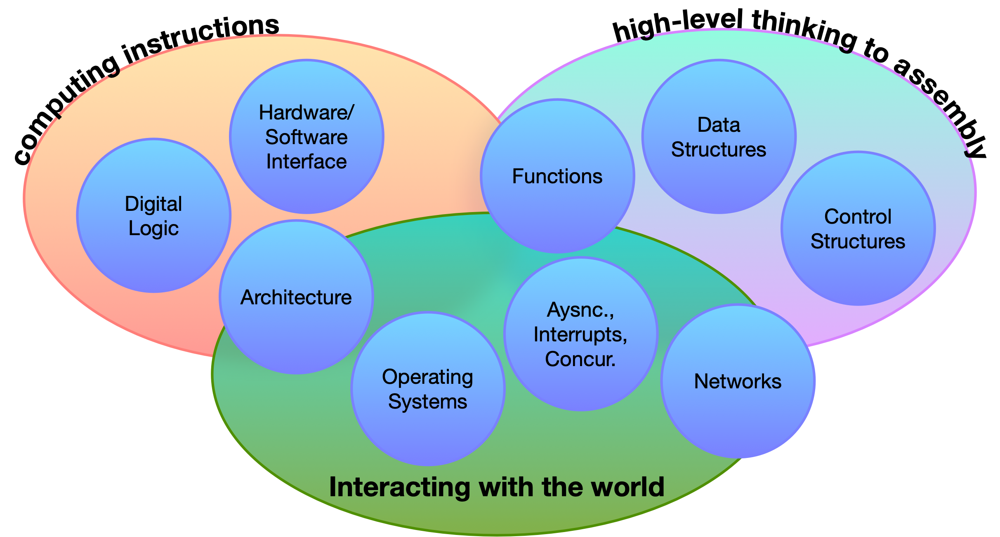


# Digital Logic

## Digital Logic Topics (in short):

- Boolean Algebra
- Combinatorial Logic Functions
- Digital Electronics - Logic Gates
- Binary Encoding, and 2's-Complement
- Adders: Half, Full, Ripple Carry
- Arithmetic Logic Unit
- Simple CPU Architecture

## Logic gates


All gates can be represented by NAND or NOR.

---

<!-- _class: talk-box -->

## talk

1. how many bits can be added together?
2. how long does it take?
3. where does the final carry bit go?


## Twos complement representation

The basic idea: define (binary) negative numbers so the adder works.


How do we make a number negative? Invert bits and add one! Why does that work?

## Flip-flops

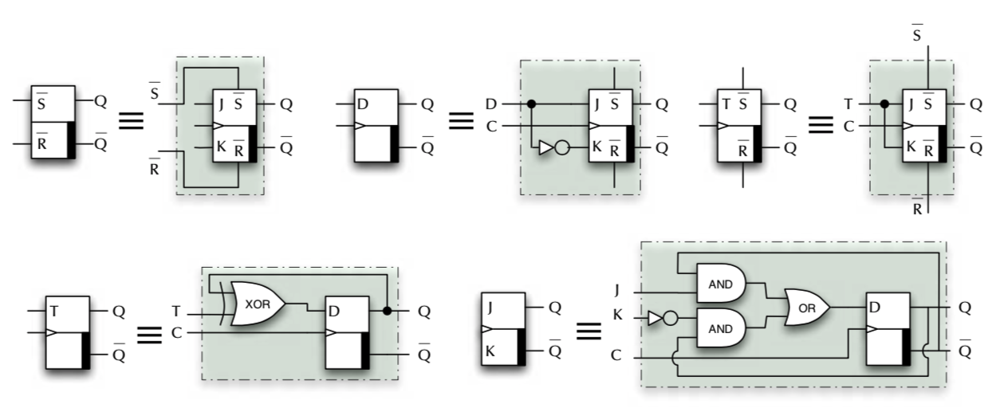


## CPU Architecture

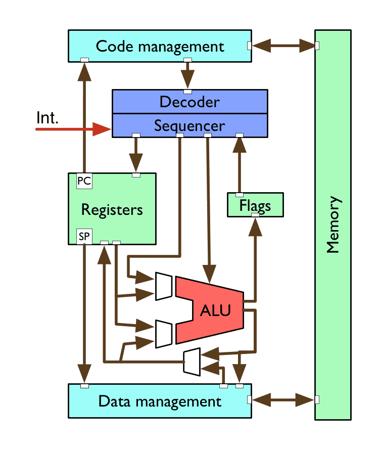

What are the **main components** of a CPU?

Can you **explain** what each of these components do?

We come back to this later...


# Hardware/Software Interface

## Hardware/Software Interface Topics (in short)

- Structure of an instruction
- Assembly to CPU instructions
- CPU Status Flags (NCZV)
- ARM v7 instructions (adding, subtracting, moving, rotate/shift,
  bit-wise ops)
- loading and storing from memory
- branch instructions
- Contents of Quick Ref. Card

---

<!-- _class: talk-box -->

## talk

why do we need both immediate and register versions of some
instructions?

## NCZV Flags

- **N**egative
- **Z**ero
- **C**arry
- O**v**erflow

## Negative

This status flag is set when the result of an ALU operation is negative *if
interpreted as a twos complement signed integer*

``` ARM
movs r0, 5
movs r1, 6
subs r2, r0, r1
```

don't forget the `s` suffix

## Zero

This status flag is set when the result of an ALU operation is zero

``` ARM
movs r5, 5
movs r6, -5
adds r4, r5, r6
```

## Carry

This status flag is set when the result of an ALU operation requires a "carry
out" *if interpreted as an unsigned 32-bit integer* (i.e. it requires 33 or more
bits to represent)

``` ARM
movs r2, 0xFF000000
movs r3, 0xFF000000
adds r5, r2, r3
```

## Overflow

This status flag is set when the result of an ALU operation would overflow the
min/max value *if interpreted as a twos complement signed integer*

``` ARM
movs r0, 0x7FFFFFFF @ largest signed integer
adds r0, 1
```

``` ARM
movs r0, 0x80000000 @ smallest signed integer
subs r0, 1
```

---

<!-- _class: talk-box -->

## talk

``` ARM
movs r0, 5
movs r1, 6
subs r2, r0, r1
```

What flags will be set after the `subs` instruction is executed?

---


---


## Loading and Storing

Load:

``` arm
mov r1, 0x20000000 @ put the address in r1
ldr r0, [r1]       @ load the data into r0
```

Store:

``` arm
mov r0, 42
mov r1, 0x20000000
str r0, [r1]
```

## Extra Operations

Load less than 32 bits
``` arm
ldrb @ load byte from register
ldrh @ load halfword from register
strb @ store byte to register
strh @ store halfword to register
```

Negative Stack
``` arm
stmdb <Rs>!, &#123;Rgstrs&#125; @ store multiple decrement before
ldmia <Rs>!, &#123;Rgstrs&#125; @ load multiple increment after
push &#123;Rgstrs&#125;
pop &#123;Rgstrs&#125;
```

## Conditional branch examples

``` arm
beq <label> @ branch if Z = 1
bne <label> @ branch if Z = 0
bcs <label> @ branch if C = 0
bcc <label> @ branch if C = 1
bmi <label> @ branch if N = 1
bpl <label> @ branch if N = 0
bvs <label> @ branch if V = 1
bvc <label> @ branch if V = 0
```


# Functions

## Functions Main Topics (in short)

- There and back again, `bl`, `bx`, and `lr`
- The stack
- Calling conventions
- Functions calling functions
- Functions calling themselves! (a.k.a. recursive functions)
- Local variables, and the stack frame (incl. `sp` and `fp`)
- Relative addressing
- Passing values: by copy and by reference

---


## there, and back again

## A function call


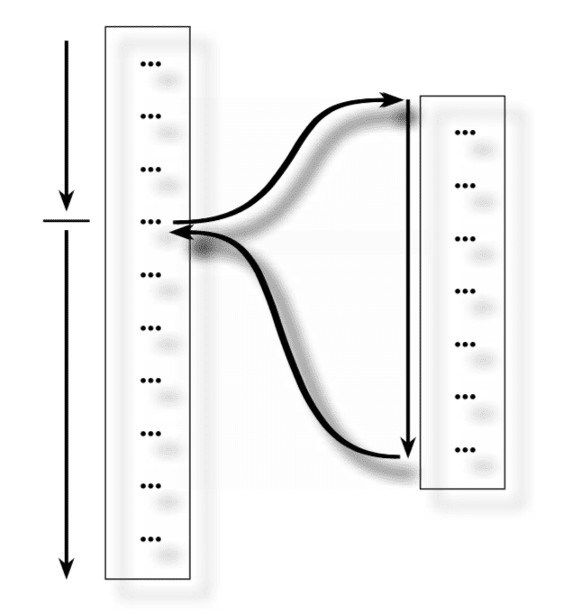

## AAPCS

The [ARMv7 Architecture Procedure Call Standard](/assets/manuals/ARMv7-procedure-call-standard.pdf) is the convention we'll
(try to) adhere to in programming our discoboards

The full standard is quite detailed, but the general summary is:

- `r0`-`r3` are the parameter and scratch registers
- `r0`-`r1` are also the result registers
- `r4`-`r11` are callee-save registers
- `r12`-`r15` are special registers (`ip`, `sp`, `lr`, `pc`)

## Store and Load to the stack


``` arm
@ Push the value in r2 onto the stack
str r2, [sp, -4]
sub sp, sp, 4

@ Different one-liners for Push
str r2, [sp, -4]!
push &#123;r2&#125;
stmdb sp!, &#123;r2&#125;

@ Pop the value from the "top" of the stack into r3
ldr r3, [sp]
add sp, sp, 4

@ One-liners for Pop
ldr r3, [sp], 4
pop &#123;r3&#125;
ldmia sp!, &#123;r2&#125;
```

## Push and Pop; illustrated

<-- Push
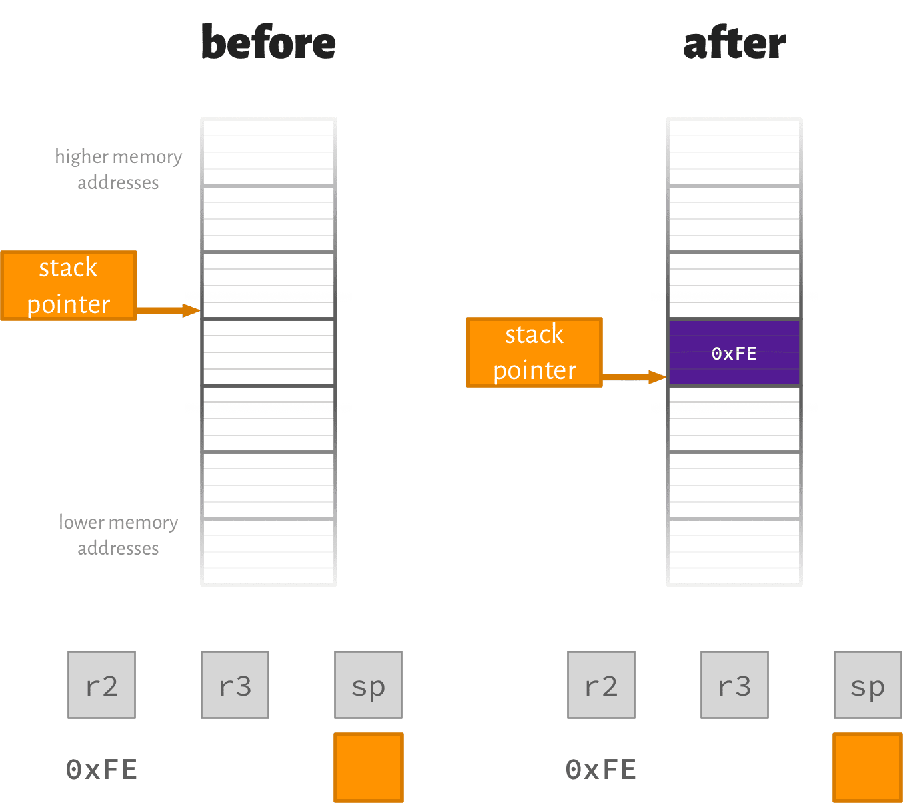

Pop -->
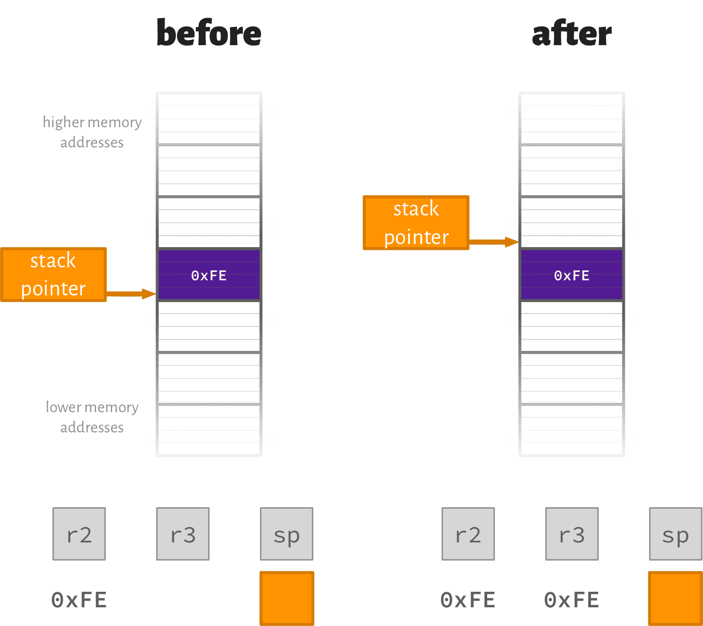

## Passing by Copy or Reference


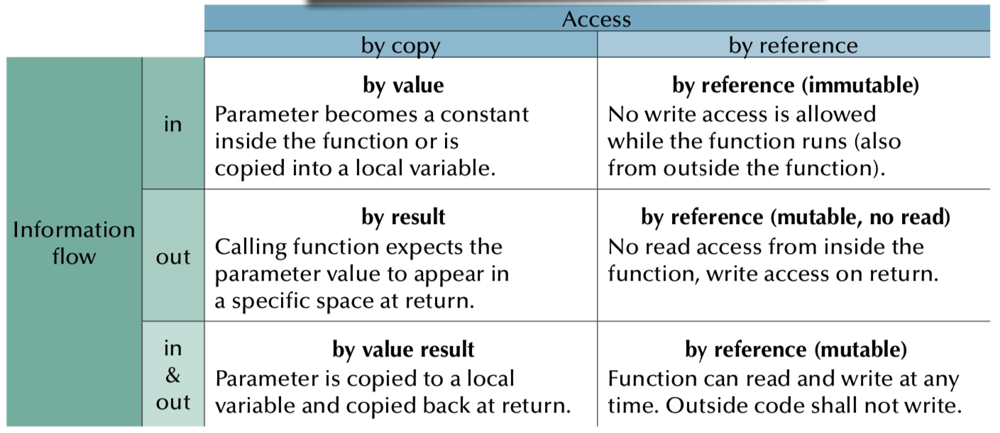

## Function stack frame

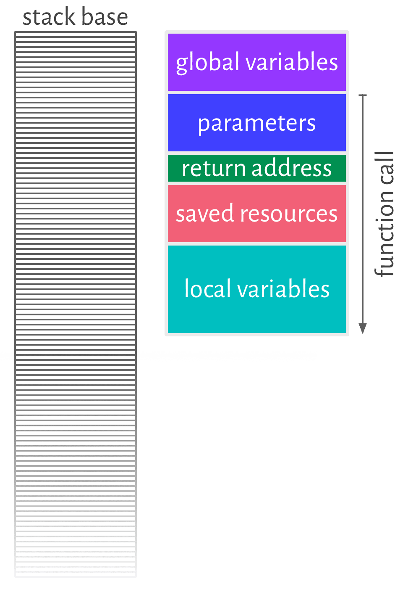

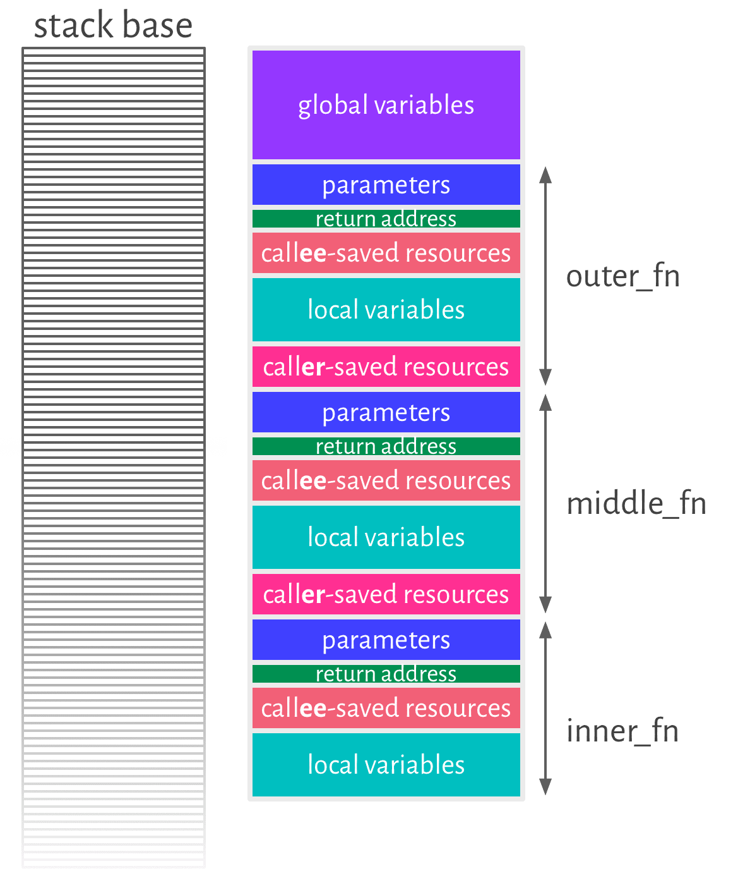

## Recursive Functions: Factorial


``` arm
fact: @ assume input is in r1
  push &#123;lr&#125;
  cmp r1, #1
  beq base_case
  @ recursive case
  push &#123;r1&#125;
  sub r1, #1 
  bl fact @ get fact(n-1)
  pop &#123;r1&#125;
  mul r0, r0, r1 @ calc fact(n-1) * n
  b continue_code

  base_case:
  mov r0, #1
  continue_code:
  pop &#123;lr&#125;
  bx lr
```


# Data Structures

## Data Structures Main Topics (in short)

- **Arrays**
- Structure
- Alignment
- Addressing
- Iterators
- Copying


---

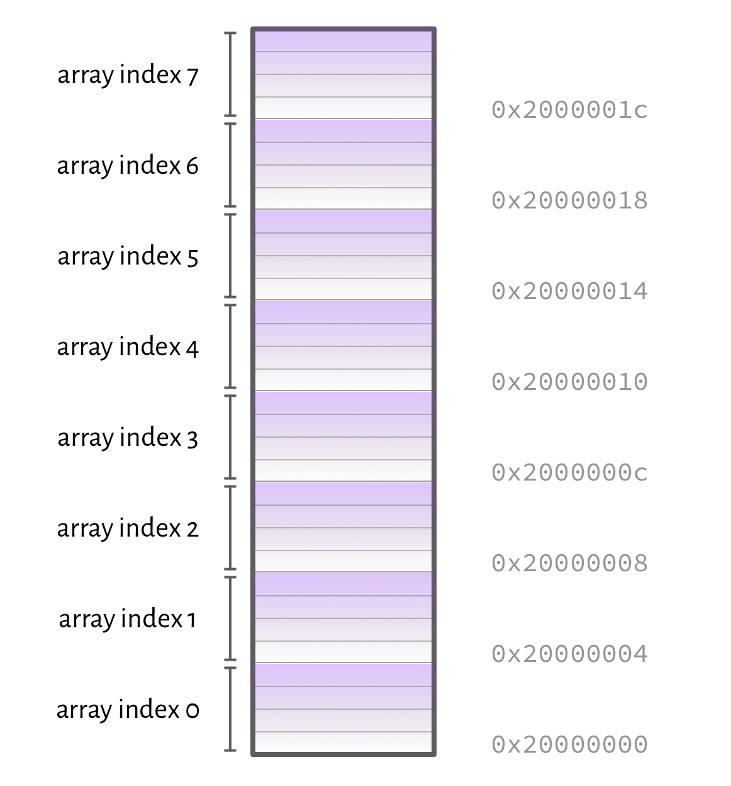

---

<!-- _class: talk-box -->

## talk

How do we know how big an array is in memory?

Is it possible to write outside the bounds of the array?

Can you make an array where the size can be changed? (mutable array?)

How do we address a particular element in an array?

---

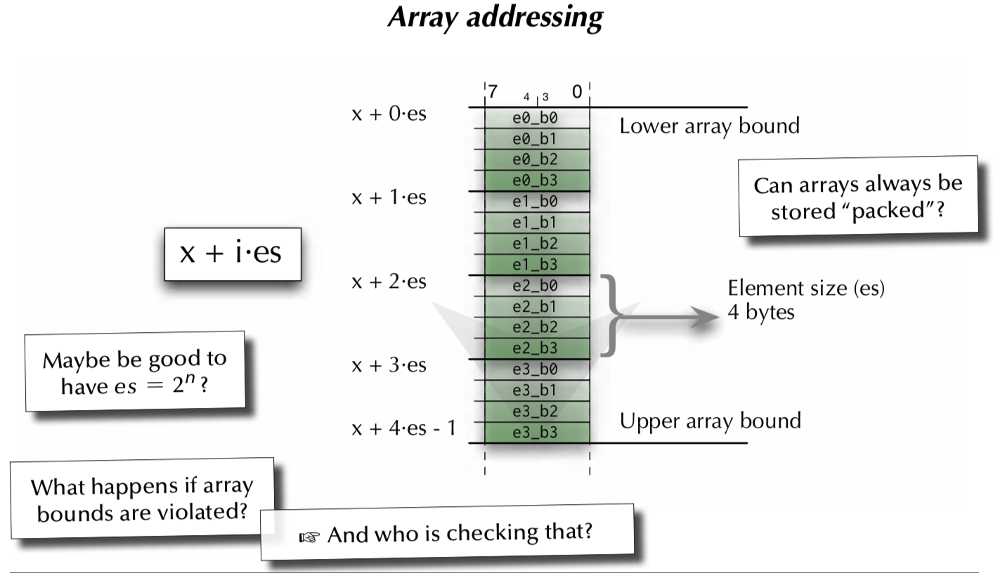

## Add up the numbers in an array


```arm
  ldr r0, =array @ base address
  mov r1, 0      @ from_index
  mov r2, 7      @ to_index
@ setup
  mov r3, 0 @ "accumulator" register
  mov r4, 4 @ element size

array_sum:
  mul r5, r1, r4   @ calculate offset
  ldr r6, [r0, r5] @ load from offset
  add r3, r6       @ update accumulator
  add r1, 1        @ increment index
  cmp r1, r2       @ keep looping?
  ble array_sum
```

## Records

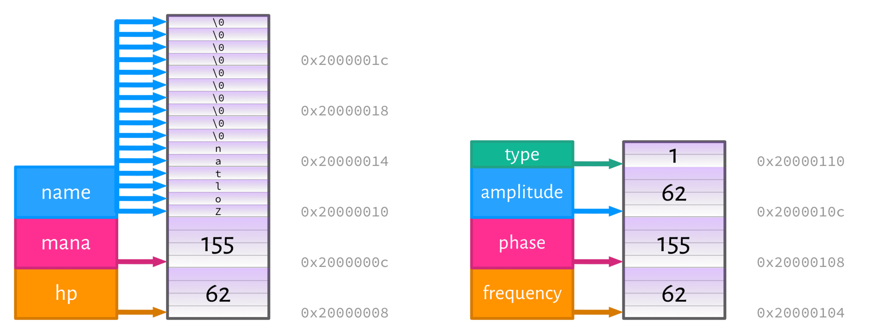

---

<!-- _class: talk-box -->

## talk

What's the difference between an **array** and a **record**?


# Control Structures

## Control Structures Main Topics (in short)

- Conditional branching
- Control Structures in Machine Code:
- if
- while
- for

## CPSR table


| `<c>` | meaning                 | flags     |
|-------|-------------------------|-----------|
| eq    | equal                   | Z=1       |
| ne    | not equal               | Z=0       |
| cs    | carry set               | C=1       |
| cc    | carry clear             | C=0       |
| mi    | minus/negative          | N=1       |
| pl    | plus/positive           | N=0       |
| vs    | overflow set            | V=1       |
| vc    | overflow clear          | V=0       |
| hi    | unsigned higher         | C=1 ∧ Z=0 |
| ls    | unsigned lower or same  | C=0 ∨ Z=1 |
| ge    | signed greater or equal | N=V       |
| lt    | signed less             | N≠V       |
| gt    | signed greater          | Z=0 ∧ N=V |
| le    | signed less or equal    | Z=1 ∨ N≠V |

## while loop components


## control structures gallery - practice these!


---

<!-- _class: talk-box -->

## talk

Which control structures were useful for your assignments?

Is there anything you can do in assembly that goes beyond "typical control structures"?


# Asynchronism, Interrupts, and Concurrency

## Async Main Topics (in short)

- Interrupts & Exceptions: When and Why?
- What happens during an interrupt?
- How is this related to **parallel computing**?
- Concurrency and Synchronisation
- Race Conditions
- Mutual Exclusion
- Synchronisation
- Passing Data

---

<!-- _class: talk-box -->

## talk

What's an interrupt? Why are they necessary?

---

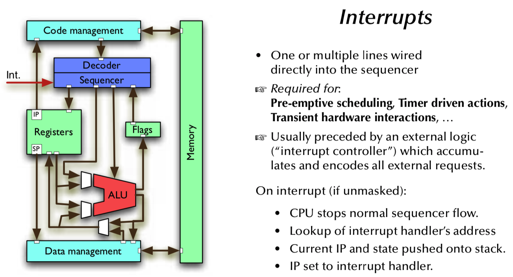

---

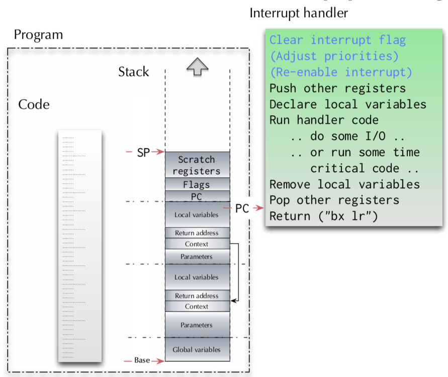

## Race Conditions and Mutual Exclusion

When the sequence or timing of _threads of execution_ has an effect on the outcome.

Can result in bugs! (e.g., in Assignment 3!) What is the value at `Count` in this code?


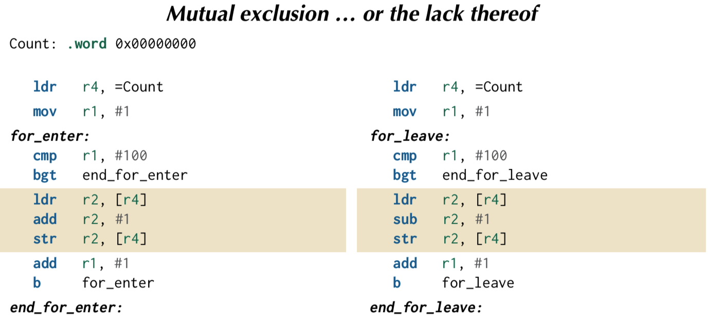

---

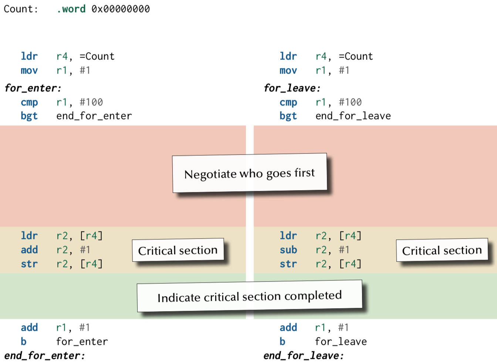

---

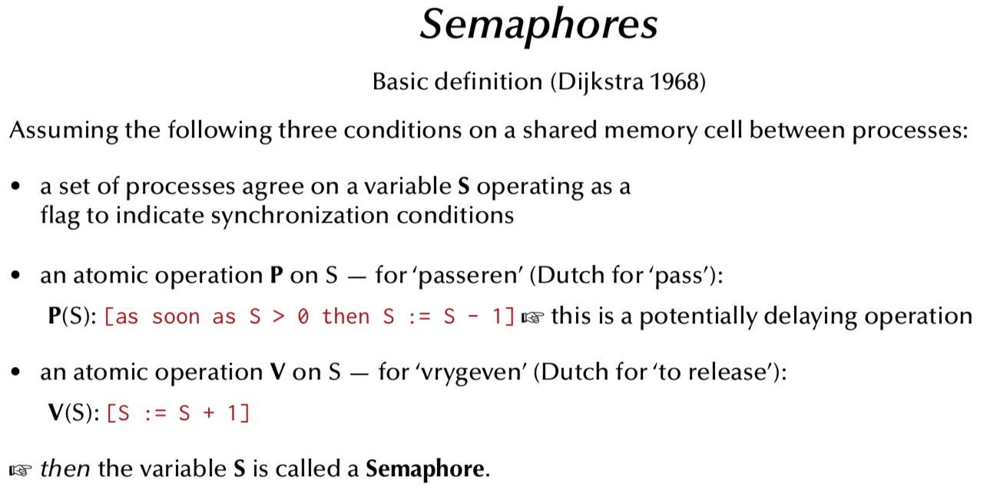

---

<!-- _class: talk-box -->

## talk

What's a race condition? What can we do about it?

---

<!-- _class: talk-box -->

## talk

What's mutual exclusion? 

Can this be achieved on a discoboard? 

How would you do it?


# Networks

## Networks Main Topics (in short)

- Transmission mediums
- Communications protocols
- Packet switched/circuit switched
- Simplex/duplex
- Topology
- Parallel/Serial
- Timing and Synchronisation
- OSI reference model (7-layers!)

---

<!-- _class: talk-box -->

## talk

How many transmission mediums can you name?

If you were stuck on a desert island what transmission media could you
use to send a message for help?

---

<!-- _class: talk-box -->

## talk

What is a communications protocol?

Why would it be needed?

Explain your answer.

## Topology

topology is the way that the nodes are connected to one another (both physically
and logically)

there are several different ways to connect the nodes together, each with pros
and cons


## Serial vs parallel

| serial                                    | parallel                                                  |
| :---------------------------------------- | :-------------------------------------------------------- |
| data is sent one-bit-at-a-time            | multiple bits sent simultaneously (e.g. multiple wires)   |
| fewer bits sent per signal, but simpler   | need to keep all the connections in sync                  |


## Synchronous vs Asynchronous

| synchronous                                                                       | asynchronous                                                                                               |
| :-------------------------------------------------------------------------------- | :--------------------------------------------------------------------------------------------------------- |
| transitions on a *clock line* | (independent) timers at each end  |
| no clock skew issues, but requires an extra connection                            | no extra connections required, but more vulnerable to synchronisation issues                               |


---


---

<!-- _class: talk-box -->

## talk

How does the P2300 protocol fit into the OSI layer diagram?


# Operating Systems

## OS Main Topics (in short)

- Operating Systems: Concept
- OS Categories
- OS Architectures
- Processes - what are processes anyway?
- How do OSs handle processes?
- Scheduling

---

<!-- _class: talk-box -->

## talk

Why do we need operating systems anyway?

<!-- TODO: make the following one slide. -->

## What's an OS? ...two main roles

| virtual machine                      | resource manager             |
| :----------------------------------- | :--------------------------- |
| _provides friendly & safe environment_ | _coordinates access to resources_  |
| memory management                    | processors |
| hardware abstraction                 | memory  |
| process management                   | mass storage |
| inter-process comms (IPC)            | communications channels |
|                                      | devices (timers, GPUs, DSPs, peripherals...) |
                           
## Kernel: definition

the **kernel** is the program (functions, data structures in memory, etc.) which
performs the *core* role(s) of the OS

access to the CPU, memory, peripherals all happens *through* the kernel through
a [system call](#system-calls-with-svc)

## Monolithic OS - Modular - μKernels

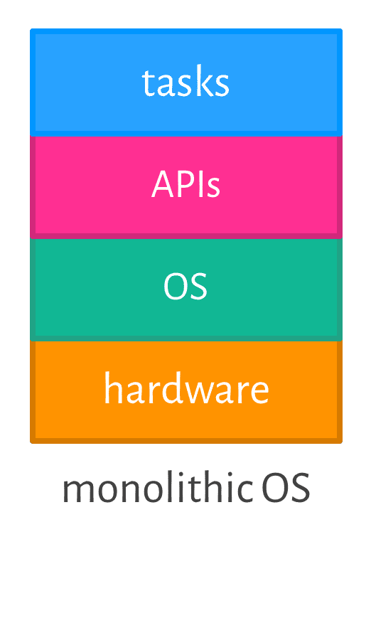

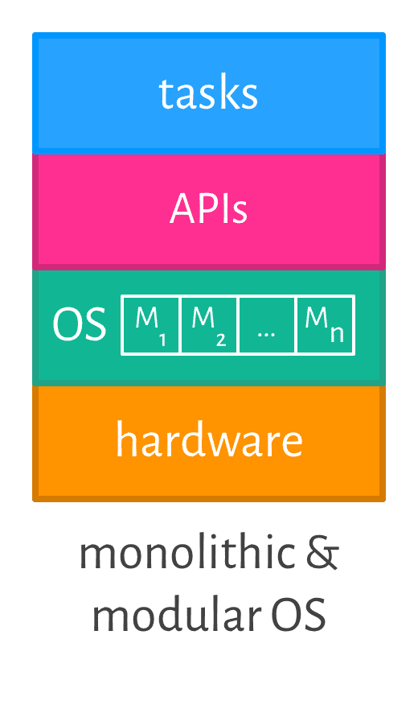

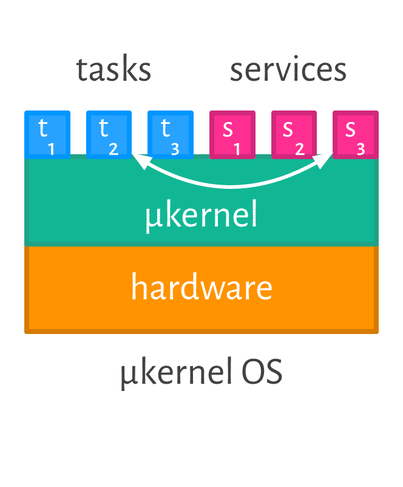

---

<!-- _class: talk-box -->

## talk

Why are kernels and (user) programs separate? 

How are they different? 

Aren't they both programs?

## Process: definition

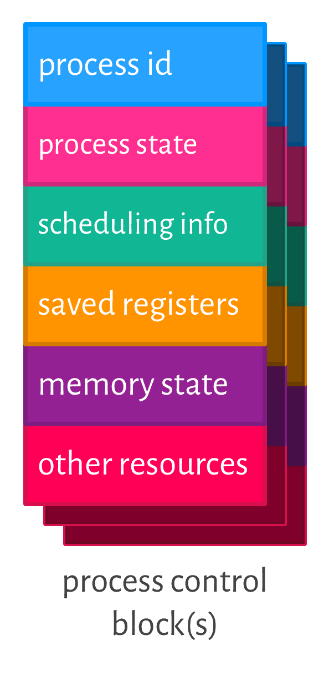


-  a *running* program
- includes the code (instructions) for the program, and the current state/context:
- registers/flags
- memory (stack and heap)
- permissions/privileges
- other resources (e.g. global variables, open files & network connections,
  address space mappings)
  
## Mapping processes to CPUs

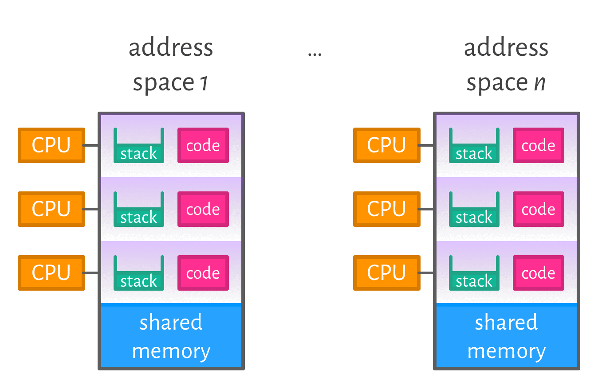

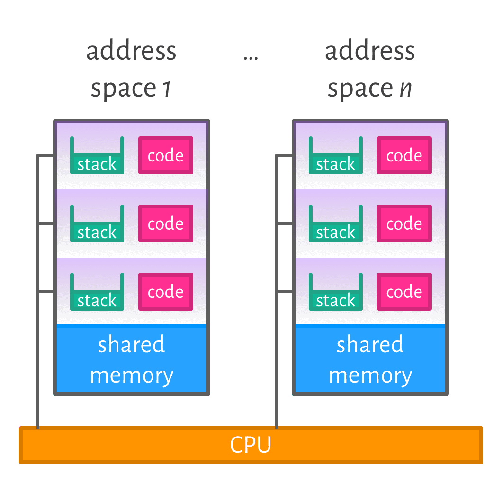

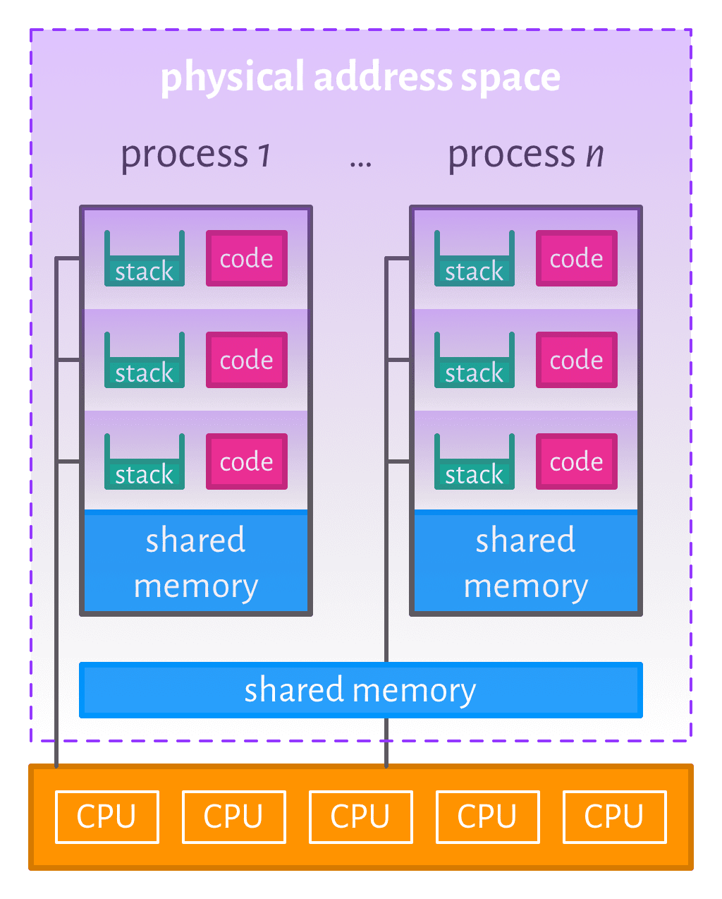


# Architecture

## Architecture Main Topics (in short)

- History of computing architectures
- Harvard vs von Neumann architecture
- Pipelines
- Out-of-order execution
- Vector/SIMD instructions
- Hyper-threading
- Multi-core computing
- Virtual Memory
- Alternative architectures (Parallax Propeller)

## A simple CPU


**decoder/sequencer** converts instructions into CPU control signals

**arithmetic logic unit** (ALU) performs maths & logic operations

**registers** provide small, fast storage to the CPU

**flags** indicate the states of the latest calculations

**code/data management** for loading/storing, caching

**memory**

---

<!-- _class: talk-box -->

## talk

What are the main components of a CPU? What do they do?

Are any components unnecessary?

## Simple Pipeline

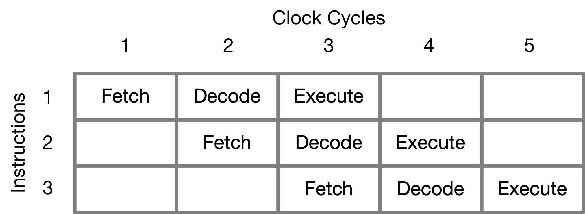

---

<!-- _class: talk-box -->

## talk

What is a CPU instruction pipeline and why would it be used? 

Explain how it is possible to construct one.

## Vector/SIMD vs hyper-threading vs multi-core

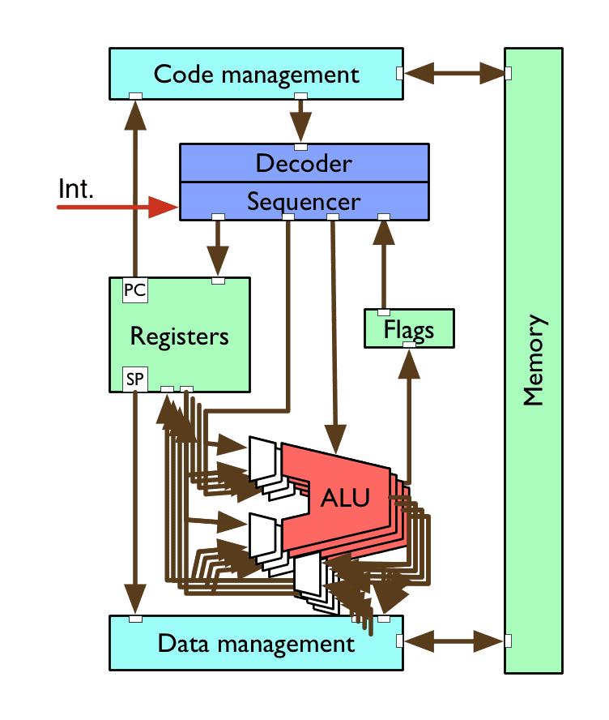

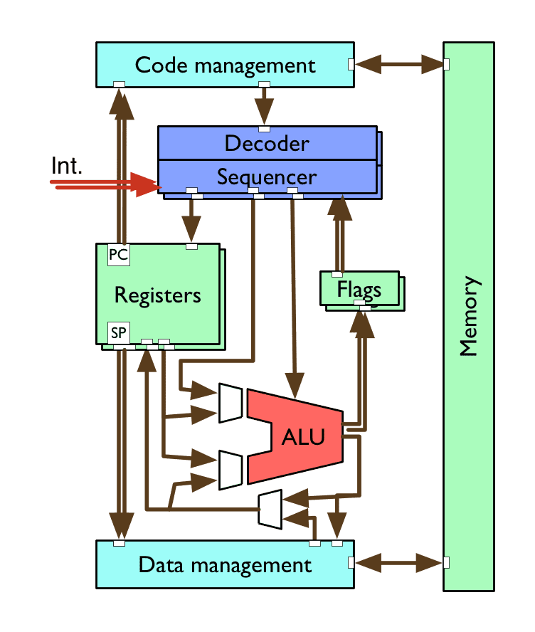

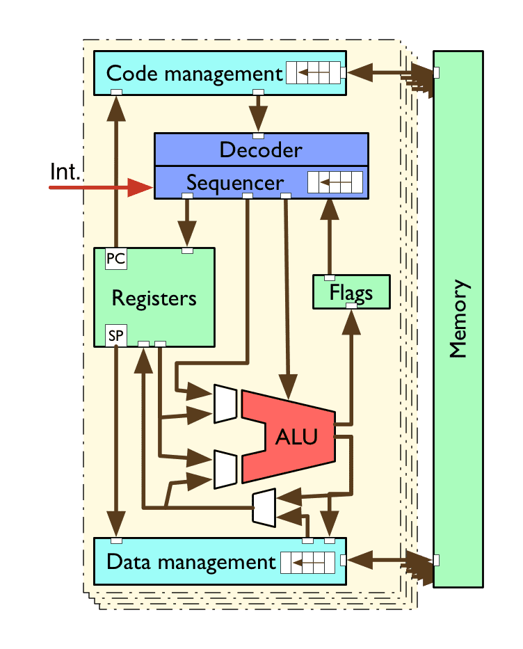

---

<!-- _class: talk-box -->

## talk

what is the difference between Vector/SIMD, hyperthreading, and
multi-core architectures?

What workloads benefit from each one?

## Virtual Memory

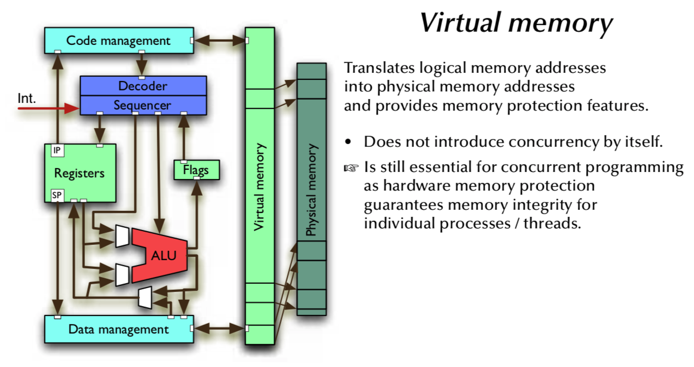

---

<!-- _class: talk-box -->

## talk

Is virtual memory an architecture (hardware) topic or an OS (software)
topic?

Explain reasons for both points of view.

## Parallax Propeller


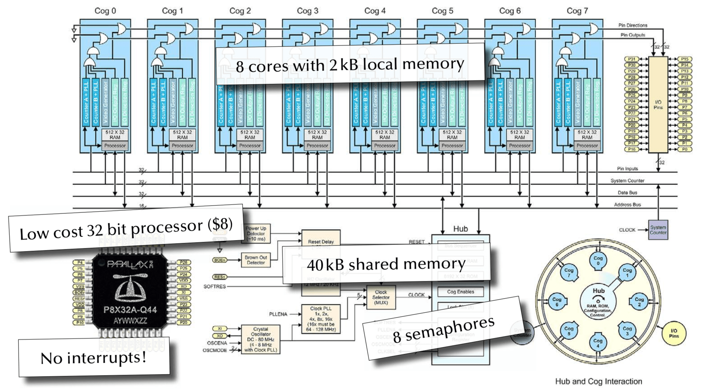

---

<!-- _class: talk-box -->

## talk

What are the benefits of having many physical CPU cores? What problems
could arise in practice?

---

<!-- _class: impact -->

**Finally** done. That was epic, thanks for coming with me everybody!
