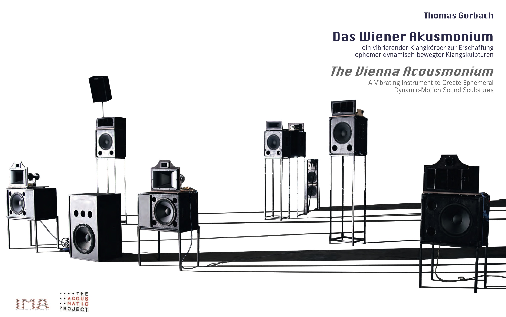
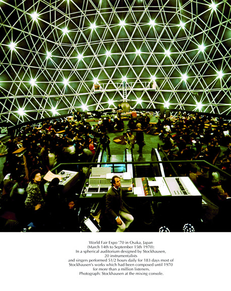
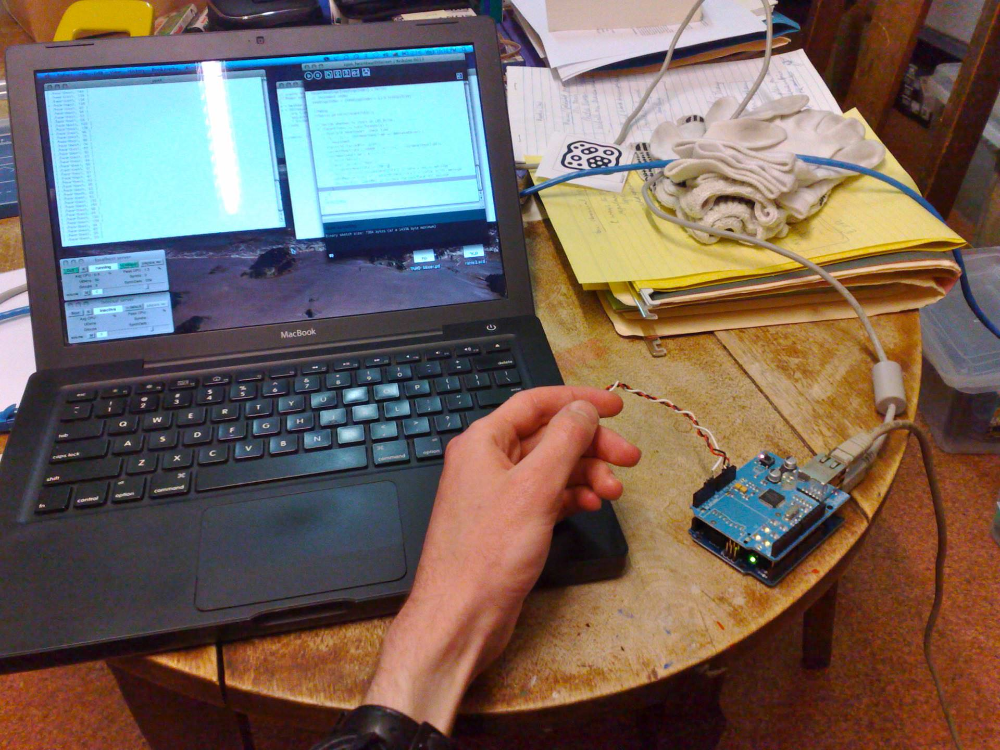
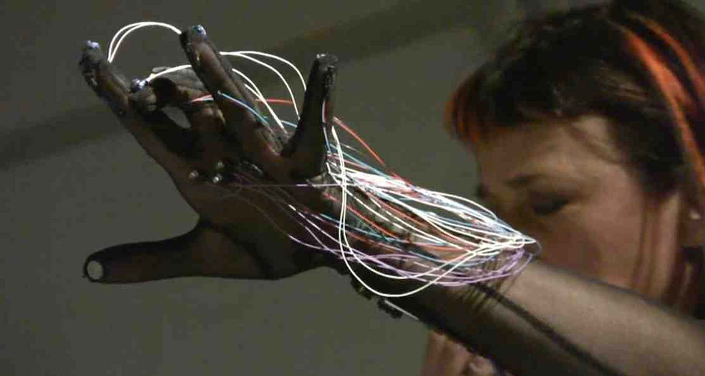
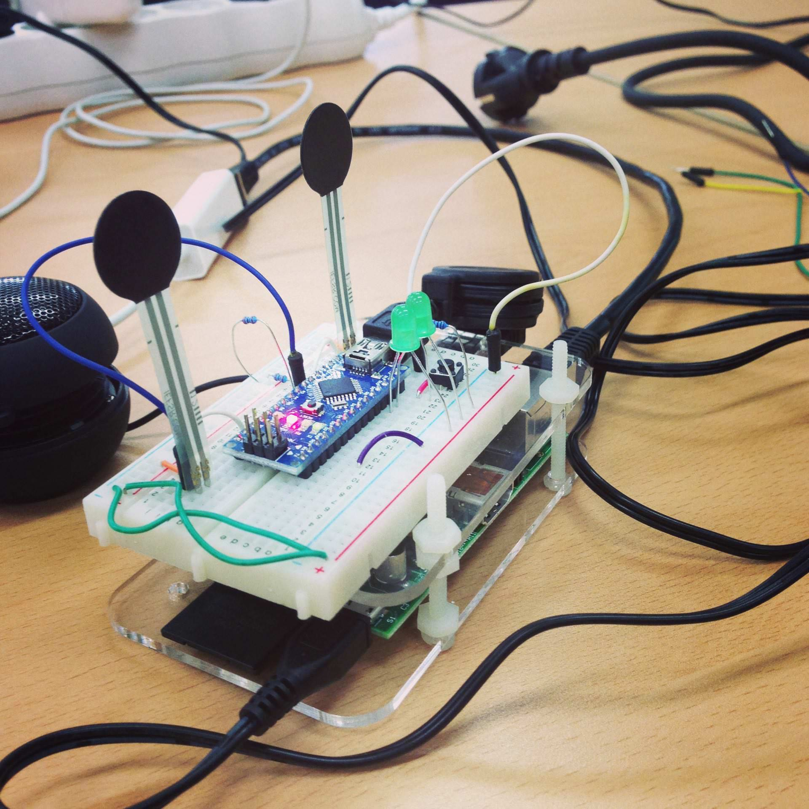
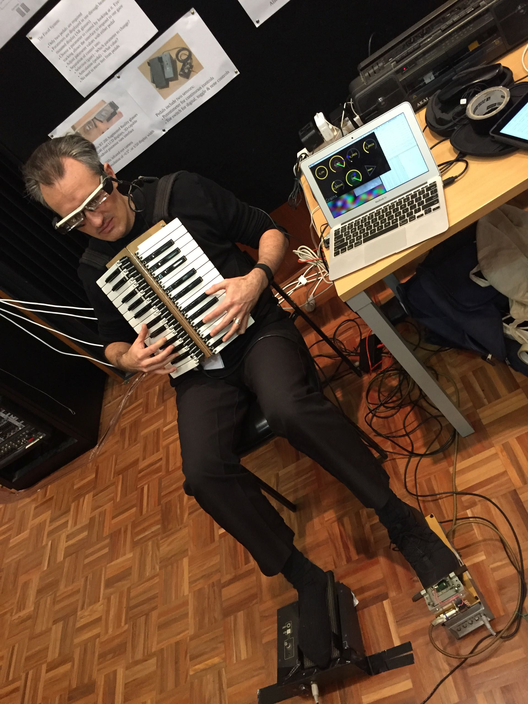
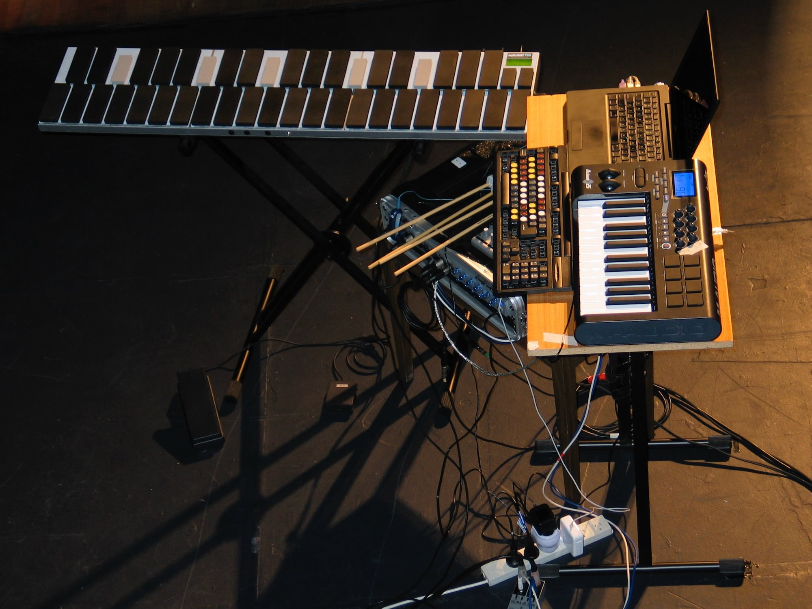
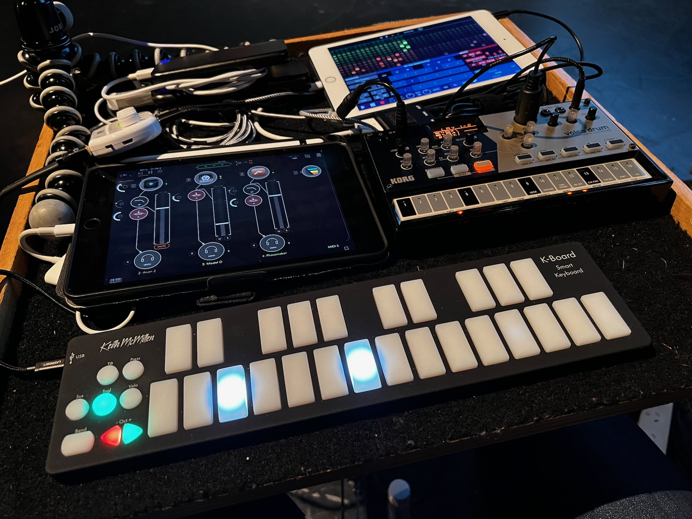

<!-- _class: banner -->

# COMP2710 LENS

## So far...

- sounds
- notes
- compositions
- connections

But how do we control any of it?

**We're missing the performer in the laptop music ensemble!**

---

## No performers: The Acousmonium (not in this class!)

---

## There is always an interface!

Someone always has to press "play".

We define an interface here as "software or hardware for controlling electronic music performance"

What kinds of interfaces are there? 

## Software Interfaces

_interfaces_ can be based in software, e.g., 

- Graphical User Interface (GUI) elements in Pd
- Graphical interface design app (e.g., TouchOSC) running on tablet/phone (connected via network)
- Custom graphical UI created in Processing, p5.js, Unity, etc (talk to Pd via MIDI or network)
- Custom programming language to control Pd (over a local network): _live coding_ systems

## Hardware Interfaces

_interfaces_ can be based in hardware as well:

- traditional human interface devices (HID): mouse, keyboard, joystick, dual-stick game controller
- non-traditional HID: webcam, microphone, laptop "drop sensor"
- commercial music interface devices: small piano keyboards, drum pads, fader/knob interfaces
- custom HID: microcontroller (e.g., MicroBit or Arduino) plus sensors
- separate interface computer: Raspberry Pi or smart phone with custom hardware/software communicating over a network connection

## NIME community

"New Interfaces for Musical Expression": <https://nime.org>

- ...new kinds of musical instruments...
- ...new kinds of music making...
- ...and new kinds of music?

---

---

---

---

---

---

---

---

SENNHEISER / PHILIP PEINE

---

# Software Interfaces

## Pd GUI Objects

- Buttons: `bang`, `toggle`, `message`
- Sliders/Faders: `vslider`, `hslider`
- Selectors: `Vradio`, `Hradio`
- Documentation: `comment`, labels on other objects.

Try right-clicking sliders, bang or toggle to customise size, change colour, add labels.

## Subpatches and Graph-on-Parent

To make sufficiently complicated Pd programs "neat", you need to use subpatches and/or define your own objects.

- **Subpatch**: type `pd` and then the name for an object
- **Own object**: save a patch as a separate `pd` file, e.g., `charlespatch.pd`, then insert in another patch with it's filename: `charlespatch`.

Use `inlet`, `inlet~`, `outlet`, `outlet~` to get information in and out, and `$0` to uniquely identify.

Use "graph-on-parent" (right-click properties) to make parts of a patch show up on the parent.

## Cool Pd Interfaces are Good

It's worth spending time on your Pd interfaces!

Clear and refined interfaces help _others_ use your creativity support tools.

This is crucial for _ensemble performance_.

## Graphical Interface in Processing

[Processing](https://processing.org) is a good way to create a quick custom graphical interface.

Track the mouse, access a webcam, create game-like experiences, etc, with the _power of Java_.

Use the `OscP5` library to send OSC messages.

N.B., this is highly related to, but not the same as `p5.js`.

## Live Code Interfaces

Just as we used Processing to control Pd over OSC, we could just use any programming environment with real-time execution. E.g.,:

- terminal, use [sendosc](https://github.com/yoggy/sendosc) or just [pdsend](https://manpages.debian.org/testing/puredata-utils/pdsend.1.en.html)
- python, use [python-osc](https://pypi.org/project/python-osc/)
- any other [live coding music system](https://github.com/pjagielski/awesome-live-coding-music)

There more detail on live coding later in this course.

## Go do it in software

Make a a Pd software `interface` for a composition composition/synth.

Use graph-on-parent and subpatching to hide the DSP components, lets see the sliders!

# Hardware Interfaces

## Human Interface Devices in Pd

Keyboard is easy: `key`, `keyup`, `keyname`.

Mouse--not so easy:

- weird hacks overlaying `hslider` and an `array` of size 1
- [xy.pd](https://forum.pdpatchrepo.info/topic/10854/xy-abstraction-to-get-mouse-click-and-drag-coordinates-vanilla) for a 2D mousing area abstraction

Used to be an external called `hid` but it's _very_ old.

(suggest looking at [Processing](https://processing.org) for HID interactions)

## Interfacing with audio...

- easy way to get some NOISE into your system, try interfacing with audio.
- pitch detection: `fiddle`
- onset detection: `bonk`
- try with voice, contact microphones, input from other performers, mix-down of
  the performance.

## Camera

Pd can't access a computer camera, but Processing can.

(I was _super_ into webcam controllers ~2009)

_better_ interfaces might use some computer vision techniques (own research or wait for week 12)

---

## MIDI Controllers (2008)

---

## MIDI Controllers (2022)

## Commercial MIDI Controllers

I _love_ MIDI controllers, but they are not always relevant to this class---mainly focussed on music production in a DAW (e.g., Ableton).

Keyboards: requires piano skills to be "good", melodic music doesn't always work well in LENS performances.

Remember that in computer music:

- _buttons_ (binary discrete data) tend to less interesting
- sliders, faders, accelerometers, light sensors etc. which have _rich, continuous data_ are more interesting

## Connecting interfaces

- most commercial interfaces use MIDI over _USB_
- some modern devices use MIDI over _Bluetooth_
- phones/tablets connect using OSC over _WiFi_
- digital mixing desks and other equipment sometimes uses OSC over _ethernet_
- DIY option: _serial over USB_ then translate to MIDI/OSC

## Phones and OSC interfaces

A mobile device is a _great_ controller:

- easy to hold
- amazing touch screen
- sensors (accelerometer and others)

Options:

- [TouchOSC app](https://hexler.net/touchosc)
- DIY with [MobMuPlat](https://danieliglesia.com/mobmuplat/) (works by running Pd on your phone with a special app to design a GUI)
- DIY with [PdParty](http://danomatika.com/code/pdparty) (just runs Pd patches on your phone)

## NIME Microcontroller Workflow...

## Best practices for DIY interfaces

The best way to control Pd with a microcontroller is to make it speak MIDI.

- Arduino [MIDIUSB library](https://github.com/arduino-libraries/MIDIUSB)
- Teensy [USB\_MIDI example](https://www.pjrc.com/teensy/td_midi.html)

Alternatively, you can use a serial connection and [translate to MIDI](https://projectgus.github.io/hairless-midiserial/).

## Interfaces and Ensembles

Interfaces for one are fun, but what about collaborating with interface data on a network (of some kind).

_Collaborative_ interfaces _require_ multiple musicians: just what you need for your LENS performance! 

In [Ensemble Feedback Instruments (Rosli et al. 2015)](https://doi.org/10.5281/zenodo.1179170), _sound_ was passed around a group in a feedback network. Wild stuff.

## Go do it in hardware

Make a _hardware_ interface for your Pd patch. You can use either:

- keyboard or mouse movements in Pd
- sound input using `fiddle~` and `bonk~`
- webcam tracking in processing + OSC

## More on this later...

We will return to these topics in more depth!

- Live coding
- Hardware interfaces with the microbit
- Machine learning and AI in computer music interfaces

