<!-- _class: banner -->

# COMP2710 LENS

---

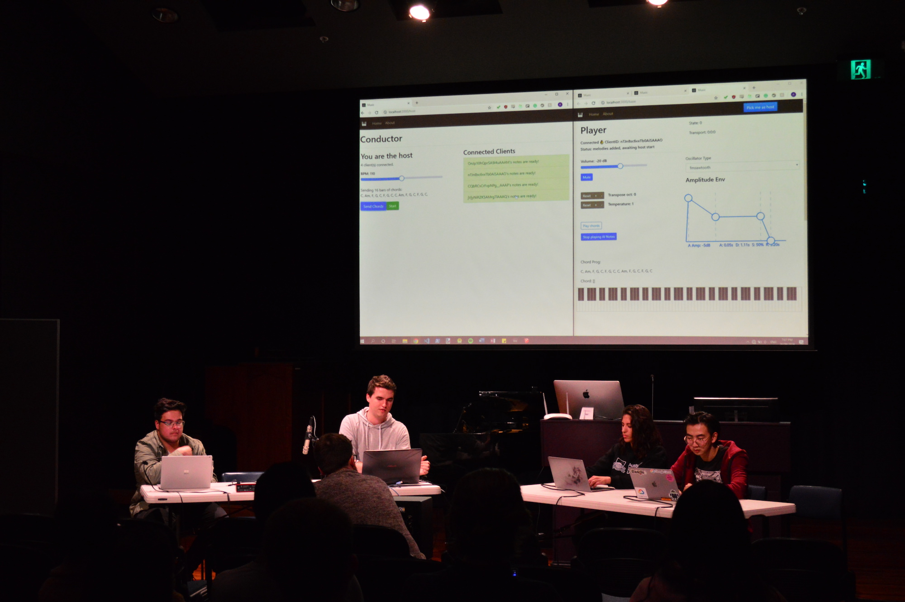

## vision

_Intelligent Musical Instruments_ become a normal part of musical
performance and production.

---

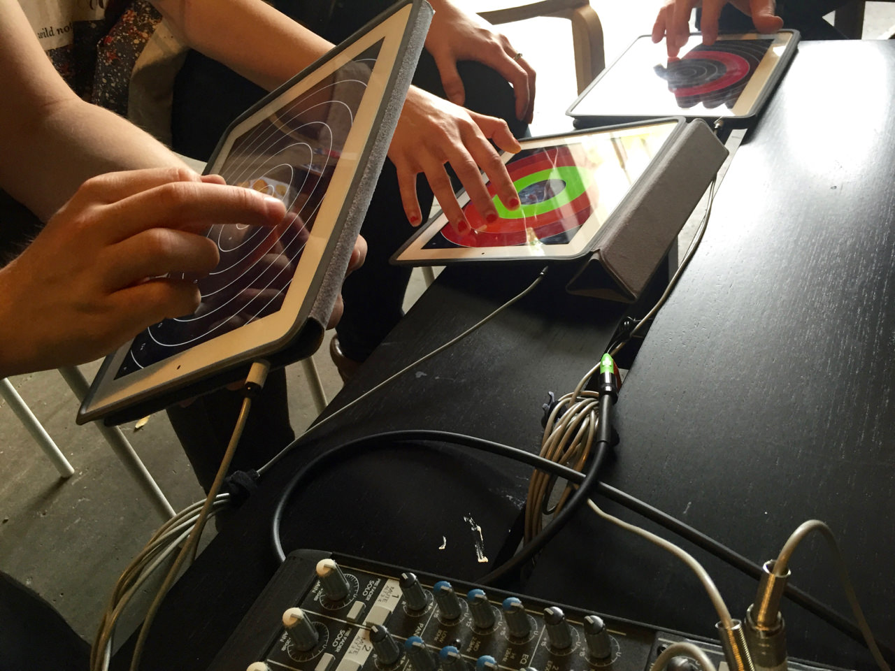

## why?

Assist professional musicians & composers

Engage novice musicians & students

Reveal _creative interaction_ with intelligent systems

Create _new kinds of music!_

---

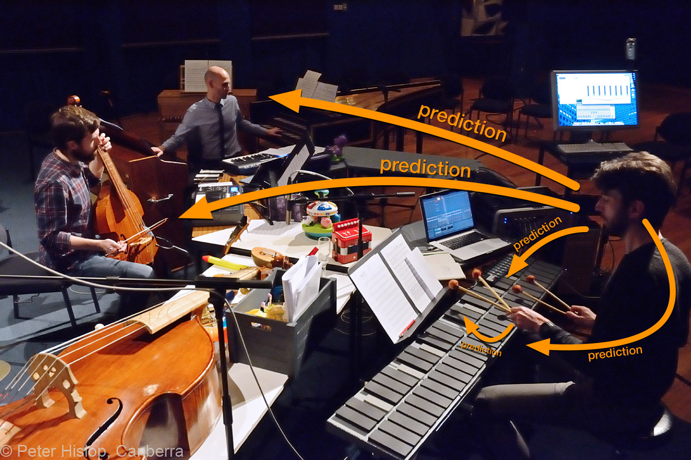

## making intelligent musical predictions

# History

---

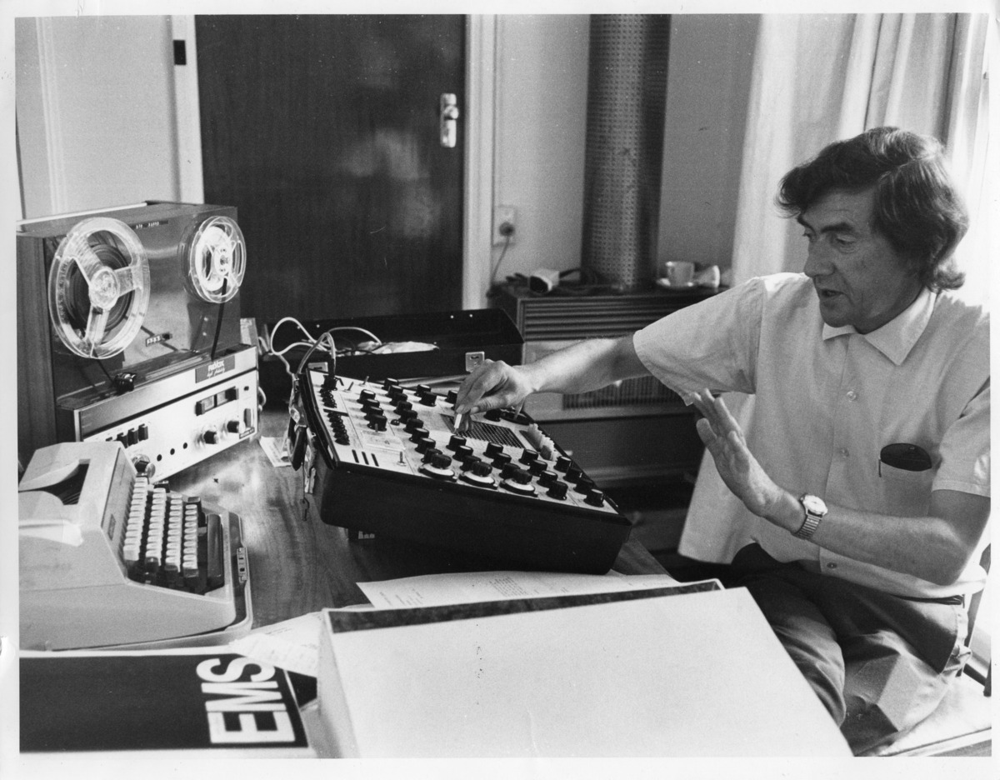

## Digital Musical Instruments (1979ish-)

---

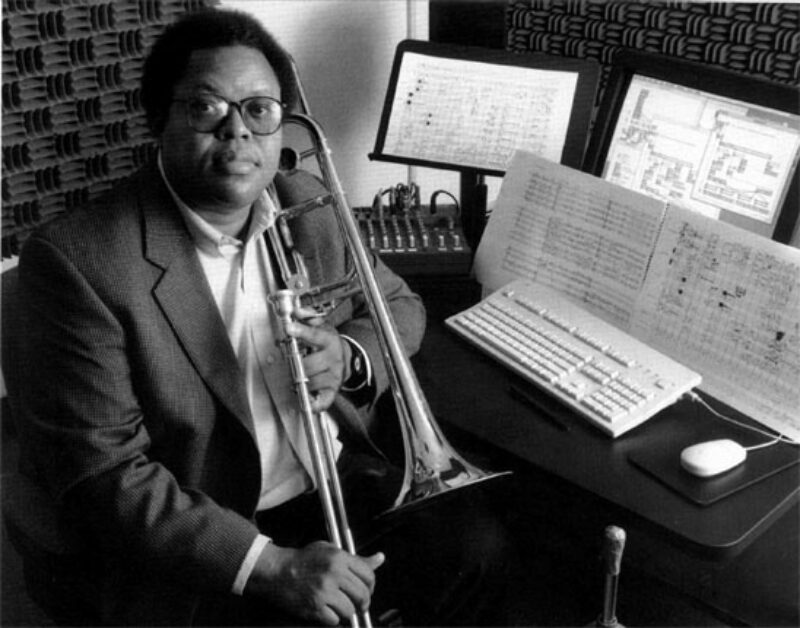

## Voyager - George E Lewis (1986-)

---

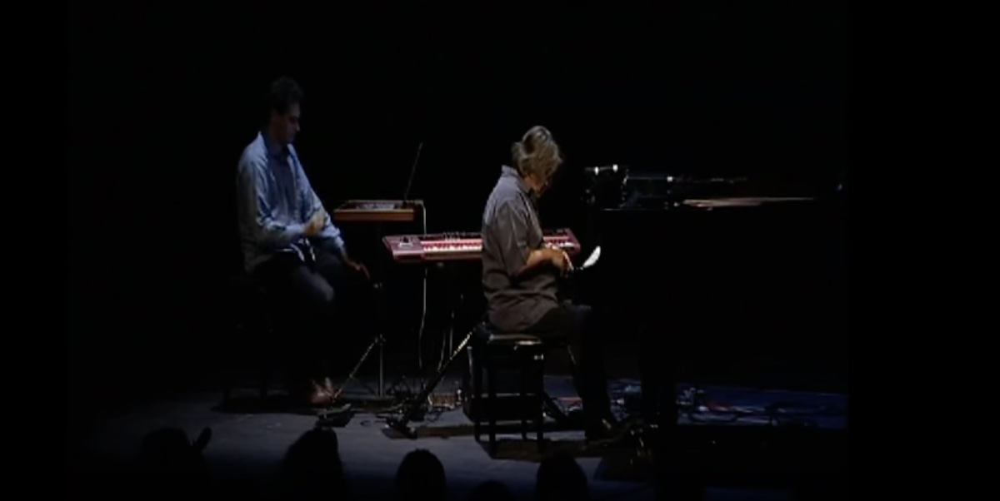

## Continuator - François Pachet (2001)

---

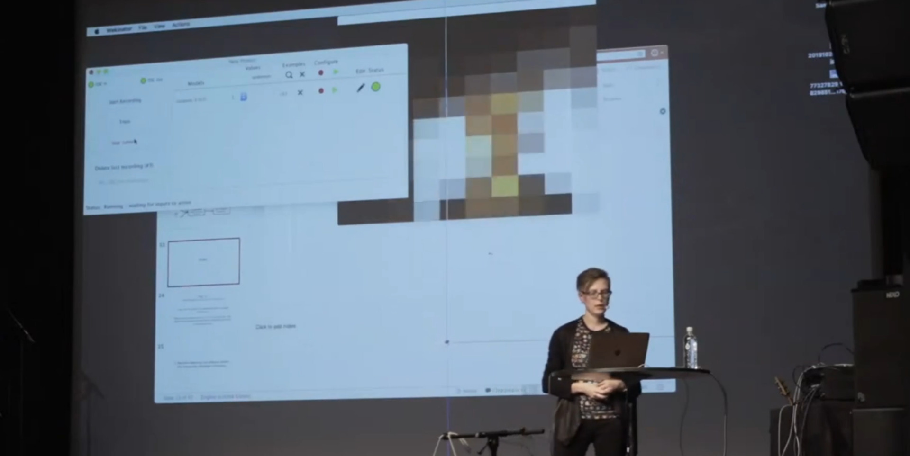

## Wekinator - Rebecca Fiebrink (2009-)

---

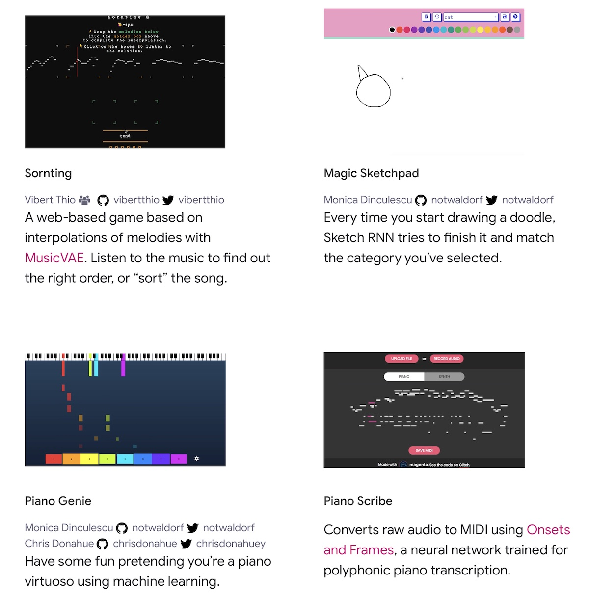

## Magenta Project - Google (2016-)

# where are all the intelligent musical instruments?

<!-- here's where I come in -->

---

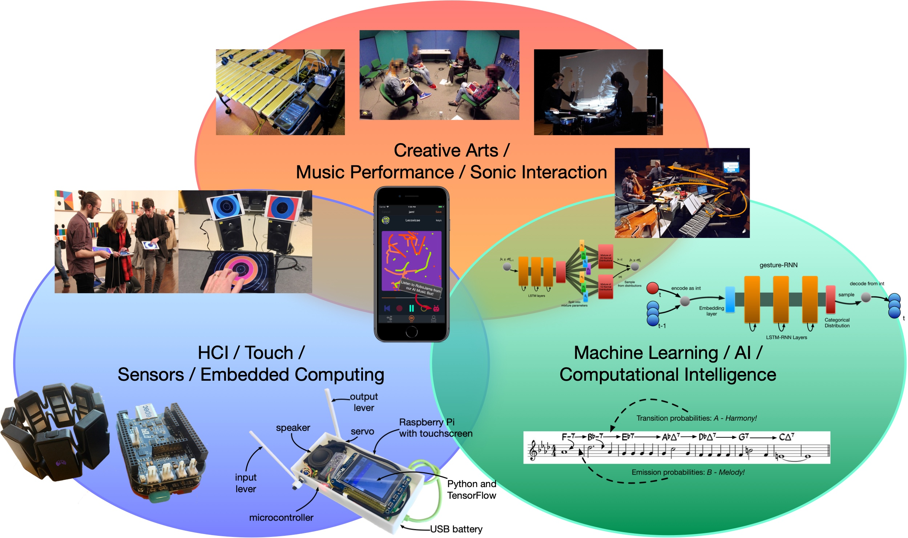

## Performance data is diverse

| **Music Systems**               | **Data**                           |
|---------------------------------|------------------------------------|
| Score / Notation                | Symbolic Music, Image              |
| Digital Instruments             | MIDI                               |
| Recording & Production          | Digital  Audio                     |
| New Musical Interfaces          | Gestural and Sensor Data           |
| Show Control                    | Video, Audio, Lighting, Control Signals |

## Predicting sequences

## Interacting with predictions

# creating an orchestra of intelligent instruments...

<!-- Interactive RNN Instrument -->

## Interactive RNN Instrument

- Generates endless music with a melody RNN.
- Switchable Dataset.
- Controls for sampling "temperature".

<!-- Gesture RNN -->

## GestureRNN

- Predicts 1 of 9 "gestures" for three AI performers.
- Trained on labelled data from 5 hours of quartet performances.
- Actual "sounds" are chunks of each gesture played back.

<!-- Robojam and Microjam -->

## Robojam and Microjam

- Predicts next touch location in screen (x, y, dt).
- Trained on ~1500 5s performances.
- Produces duet "responses" to the user.

## Mixture Density Network

<!-- IMPS -->

## IMPS System

- Opinionated Neural Network for interacting with NIMES.
- Automatically collects data and trains.
- "Wekinator" for deep learning?

## Three easy steps...

- **Collect some data:** IMPS logs interactions automatically to build up a dataset
- **Train an MDRNN:** IMPS includes good presets, no need to train for days/weeks
- **Perform!** IMPS includes three interaction modes, scope to extend in future!

## Experiment: Is this _practical_?

- Is it practical for real-time use?
- How do the MDRNN parameters affect time per prediction?
- What are "good defaults" for training parameters?
- Do you need a powerful/expensive computer?

## Test Systems

## Results: Time per prediction

Time per prediction (ms) with different sizes of LSTM layers.

## Results: Time per prediction

Time per prediction (ms) with different MDN output dimensions. (64
LSTM units)

## Results: Training Error vs Validation Set Error

12K sample dataset (15 minutes of performance)

Takeaway: **Smallest model best for small datasets.** Don't bother training for
too long.

## Results: Training Error vs Validation Set Error

100K sample dataset (120 minutes of performance)

Takeaway: **64- and 128-unit model still best!**

## Results: Exploring Generation

Takeaway: Make Gaussians **less diverse**, make categorical **more diverse**.

<!-- EMPI -->

## Embodied Predictive Musical Instrument (EMPI)

- Predicts next movement and time, represents physically.
- Experiments with interaction mappings; mainly focussed on call-response
- Weird and confusing/fun?

## Training Data

## Generated Data

---

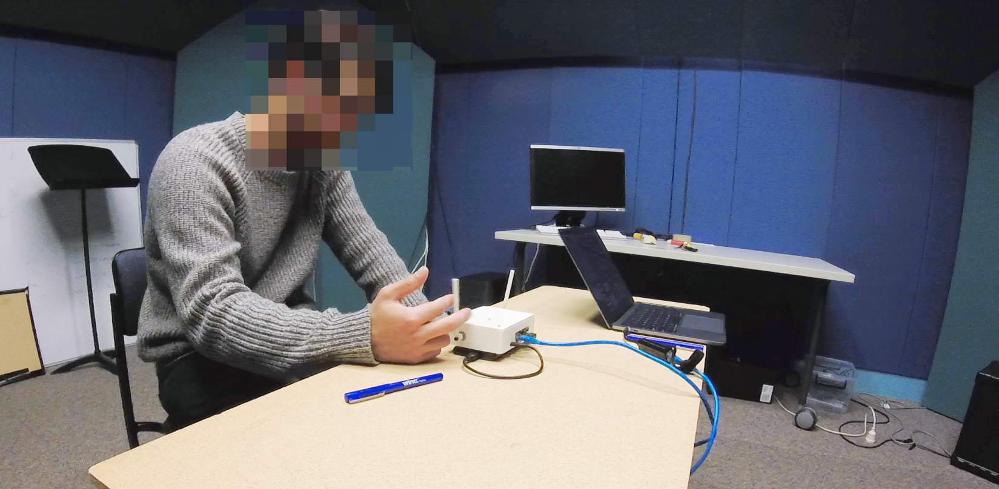

## Improvisations with EMPI

- 12 participants

- two independent factors: _model_ and _feedback_

- model: human, synthetic, noise

- feedback: motor on, motor off

## Results: Survey

Change of ML model had significant effect: Q2, Q4, Q5, Q6, Q7

## Results: Survey

- human model most "related", noise was least

- human model most "musically creative"

- human model easiest to "influence"

- noise model not rated badly!

Participants generally preferred human or synth, but not always!

## Results: Performance Length

Human and synth: **more range** of performance lengths with motor on.

Noise: **more range** with motor off.

## Takeaways

Studied self-contained intelligent instrument in **genuine performance**.

Physical representation could be **polarising**.

Performers work hard to **understand** and **influence** ML model.

Constrained, intelligent instrument can produce a **compelling experience**.

<!-- what's next -->

---

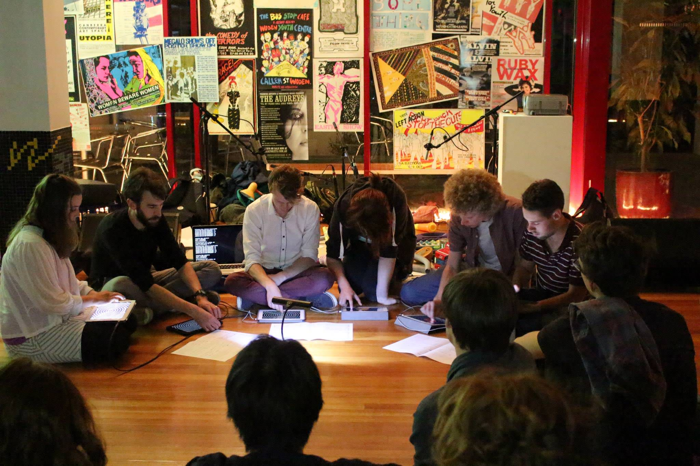

## How can intelligent instruments help us make music?

Emulate or enhance ensemble experience

Engage in call-and-response improvisation

Model a performer's personal style

Modify/improve performance actions in place

---

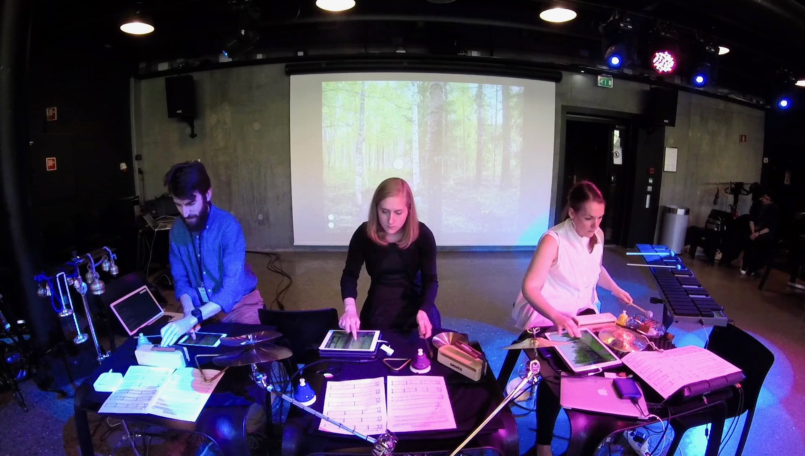

## Research questions...

Are ML models practical for musical prediction?

Are intelligent instruments useful to musicians?

What happens when musicians and instrument _co-adapt_?

Can a musical practice be represented as a dataset?

What does a intelligent instrument **album / concert** sound like?

<!-- Neurofeedback 2020 video  -->

---

<iframe width="1120" height="630" src="https://www.youtube.com/embed/WumtMGHAuV8" frameborder="0" allowfullscreen title="GenAI video"></iframe>

<!-- https://youtu.be/WumtMGHAuV8 -->

## Thanks!

 

- IMPS on [GitHub](https://github.com/cpmpercussion/imps)
- creative ML: [creativeprediction.xyz](https://creativeprediction.xyz/)
- Twitter/Github: [@cpmpercussion](https://www.twitter.com/cpmpercussion)
- Homepage: [charlesmartin.com.au](https://charlesmartin.com.au)

