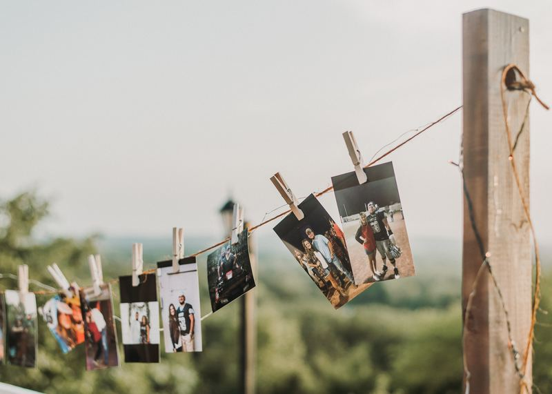

## Outline

- **Due date:** Most Fridays throughout the semester ([see below](#spec))
- **Mark weighting:** 30 marks
- **Submission:** push your blog content to the [blog repo on
  GitLab](#submission-process)

Nobody reads (or writes) books these days, everything worth reading about comes
in the form of a blog post.[^books] In this course you'll document everything
you do through a series of blog posts.

[^books]: this is *slight* hyperbole

## Spec {#spec}

You'll write a blog post every week, according to the following schedule (dates
in bold represent the [marking stages](#marking-schedule)):

| date       | week | post topic                                                                                              |
|------------|------|---------------------------------------------------------------------------------------------------------|
| Nov 23     |    1 | intro blog post                                                                                         |
| Nov 30     |    2 | artefact ideation                                                                                       |
| Dec 7      |    3 | trip update (including evolving plans for your artefact)                                                |
| Dec 16     |    4 | trip update (including evolving plans for your artefact)                                                |
| **Dec 24** |    5 | [artefact plan](#artefact-plan) (hardware/software requirements, construction plan, etc.)               |
| Dec 28     |    - | *no post required*                                                                                      |
| Jan 4      |    6 | [project diary](#project-diary) (updates, photos, documentation, failures...)                           |
| Jan 11     |    7 | [project diary](#project-diary)                                                                         |
| Jan 20     |    8 | [project diary](#project-diary)                                                                         |
| **Jan 25** |    9 | [project diary](#project-diary)                                                                         |
| Feb 1      |   10 | [project diary](#project-diary)                                                                         |
| Feb 8      |   11 | [project diary](#project-diary)                                                                         |
| Feb 15     |    - | *no post required*                                                                                      |
| Feb 18     |   12 | [design rationale](/deliverables/03-design-rationale/)                     |
| **Feb 25** |   13 | public release of source code and documentation on GitHub (the ["launch" blog-post](#launch-blog-post)) |

Most of the topics listed above should be fairly self-explanatory. In the
beginning it's a place to record your ongoing thought process behind the
artefact. During the middle Jan/Feb time period it's a place to record your
progress. At the end, it's where you'll announce the "release" of your [GitHub
repo](/deliverables/02-public-github-repo/) and
reflect on the [final exhibition](/deliverables/04-IoT-artefact/#the-exhibition).

You must write your blog entries as markdown-formatted [Jekyll
posts](https://jekyllrb.com/docs/posts/) with `title`, `author` and `week` keys
in the YAML frontmatter like so:

```YAML
---
title:  "Your full title goes here"
author: Josephine
week: 1
---
```

The `author` key is important because there will be multiple people posting to
the same blog, and we want to be able to credit you (also, make sure you use the
same name consistently across all your posts). The `week` key is a way of
identifying which week (and therefore what the topic is---see the [table
above](#spec)) the blog post is associated with.

For general tips on how to structure your blog posts, there's a [style guide in
the FAQ below](#style-guide).

:::warning
As mentioned in the `_posts/README.md` file, by default the markdown file
created by the `bundle exec jekyll draft` command above will have `layout: post`
in the YAML frontmatter. You need to delete this line---the ANU theme we're
using doesn't have a `post` layout.
:::

### Artefact plan {#artefact-plan}

Your last blog post before Christmas is your artefact plan. This is your chance
to sketch out (in some detail) what you're actually going to build for your IoT
artefact.

This blog post needs to include:
- a description of what you're planning to build (this is a sales pitch---make
  the reader excited to follow your journey as you build it!)
- how your plan relates to the theme?
- a discussion of the hardware (microcontroller, sensors, actuators) and
  software (frameworks, libraries, any server-side programming required) that
  you'll use to complete the project
- a detailed timeline for the rest of the project (including *two* intermediate
  miletstones during the summer so you can see how you're tracking)
- a discussion of how you're going to collaborate and divide up the work (if
  you're working with a partner)

The stuff you write in this post *can* change; in fact as you start to build
things it's inevitable that your ideas & materials will shift a bit. Still, it's
crucial to make a plan at this stage, so that you've got a clear idea of what's
ahead of you over the summer.

You should make the most of the opportunity to write a detailed plan. Don't
think "if I'm super vague with my plan, then I won't be held to account and I
can get away with changing things". That's not how it works (see previous
paragraph). In fact, if things *do* go haywire it's even more important to have
a plan, because it gives you an early indicator that you're falling behind (as
the deadlines in your plan go whooshing by) and gives you the chance to correct
things while there's still time. So treat this blog post as a real plan that
you're going to stick to for the rest of the design/build process.

### Project diary {#project-diary}

These posts over the summer can take a few different forms, depending on what
you've been working on that week:

- a technical blog post discussing a tricky technical (hardware, software or
  both) problem you've been working on that week---hopefully with a solution at
  the end, or at least some work in progress

- some new inspiration that's hit you in the previous week, and how you're
  planning to incorporate it into your design

- a discussion of the theme (*dis)connecting together*, and how your ideas about
  the theme and your project are changing as you get further into the
  design/build process

- open questions you still have, or perhaps discussing a plan for the next week
  (you don't need to re-gurgitate your [timeline](#artefact-plan) every
  week---but it might make sense to discuss a particular upcoming problem and
  how you're planning to tackle it)

Or it might be some combination of all of the above. The best way to keep on top
of these entries is to just write stuff down as you work on the project all
through the week, and then as you get towards the Friday deadline you should
look at what you've worked on and massage it into a coherent story for that
week. Don't wait till Friday evening till you even think about the blog post,
then hack something together at the last minute---you'll just cause yourself
unnecessary stress if you do it that way.

The [marking criteria](#marking-criteria) listed below apply for all of these
posts.

## Submission process

:::info
There are some more detailed instructions on how to create & edit your blog post
files in the `_posts/README.md` file in the website repo.
:::

You can write your blog posts (i.e. the markdown files) however you like. To
publish them, you'll be given access to the [China Study Tour course website git
repo](https://gitlab.cecs.anu.edu.au/courses/china-study-tour/) (which is just a
Jekyll site, like all the other
[cool](https://cs.anu.edu.au/courses/comp2300/resources/faq/)
[kids](https://cs.anu.edu.au/courses/comp1720/resources/faq/) are using).

We'll host the blog this website (on the [news page](/news/)).

## Marking {#marking}

### Schedule {#marking-schedule}

The blog is worth 30% of your total grade. It's not the case that each post is
worth 30÷*n* marks (where there are *n* blog posts); your blog will be assessed
as a portfolio.

However, because feedback is useful, we'll split the total 30% mark into 3
stages. At each stage, you'll get a mark for what you've done in that stage:
- 10% (after the Dec 24 post)
- 10% (after the Jan 25 post)
- 10% (at the end of the course)

You'll also get feedback after stages 1 and 2 so that you can incorporate that
into your later blog posts.

### Criteria {#marking-criteria}

Some of the things we're looking for in the blog posts are:

- obeying the [spec listed above](#spec), e.g. having the correct YAML
  frontmatter for all your blog posts

- narrative structure; is there an appropriate use of "hooks" early on in the
  posts to grab the reader's attention, and do the posts answer the questions
  raised in a satisfying way?

- good engagement with the work of others; appropriate reference to other work
  (e.g. other blogs, creator videos, scholarly articles)

- critical reflection; when commenting on your own ideas or the ideas of others,
  is there evidence of deeper reflection & analysis on what's
  interesting/challenging/surprising/frustrating about the ideas you're
  discussing, and how they fit into the bigger picture of the IoT?

- interesting technical content; when you hit technical road-blocks, can you
  tell a story about how you overcame them? are the technical choices
  well-motivated by the broader goals you're trying to achieve?

- pictures/diagrams/videos---the web browser is pretty good at visual &
  multimedia content, and pictures/diagrams/videos are often way more
  informative and interesting in conveying your message than just walls of text
  alone

- engaging with the theme; how do the ideas and projects discussed in the blog
  relate to the theme of *(dis)connecting together*?

## FAQ

### So do I just take photos of my trip and write a travel blog?

No, it's a chance for you to "think out loud" about the IoT stuff you're doing
in China and show the design process for your [artefact](/deliverables/04-IoT-artefact/).

### Am I allowed to talk about travel stuff in the blog, then?

Yep, of course. It's an overseas study tour, and you don't have to pretend that
you're just sitting at home. Perhaps the easiest way to do that is to write
[extra blog posts](#can-i-write-more-posts).

### Can I work on a draft post before it goes live on the blog?

Yes, you can either:

1. write your post in the `_drafts` folder (you'll just need to move it to the
   `_posts/<your_folder>` folder when you're ready to publish---where
   `<your_folder>` is the folder with the same name as you've been using for the
   `author` metadata in your posts)
2. include `published: false` in the YAML frontmatter (again, set to `true` or
   just delete that line when you want your post to go live)

There's a step-by-step guide in `_posts/README.md` which uses the [jekyll
compose](https://github.com/jekyll/jekyll-compose) gem to help you with creating
the posts (first in `_drafts`, then moving them to `_posts/<your_folder>` when
they're done).

### Can I talk about other people's stuff in my blog posts?

Yes, in fact that's encouraged---especially in the early stages while you're
still formulating your ideas on what you'll build. You might want to write one
post which looks at a few IoT projects made by others (perhaps on *their* blogs)
and discusses what's interesting about them, then pulls some of the themes
together in discussing what it means for the thing you want to build.

### Can I write *more* posts than the ones [listed above](#spec)? {#can-i-write-more-posts}

Yep, that's fine.

### How will deadlines work with the blog posts? What if I make a late post?

Each deadline [listed above](#spec) is a Friday. You need to push your commit
before midnight (China Standard Time during the in-country part of the trip,
AEDST otherwise) on that Friday, otherwise it counts as a late submission.

Late submission for the blog post will still be marked, but there will be a 1
mark penalty for each late blog post in your overall blog portfolio.

### Can I edit my blog posts after the deadline?

Yep, you can always go back and update links, add photos, fix mistakes, etc.

If you're making big changes after the deadline (i.e. pushing an empty post
before the deadline and then *substantially* fixing it later) this will be
considered a late submission (the convenor's decision is final). Shenanigans
will be called out, because otherwise it's not fair to the other students.

### Will the blog be publicly visible?

Yep, it's on the course website.

### Can I post this stuff on my own blog?

You can re-post it as many places as you like, but you must put it on the shared
[COMPCHST blog](/news/).

### If I'm [working with a partner](/deliverables/04-IoT-artefact/#can-we-work-in-pairs), do we have to write a blog post each?

Yes, you each have to write your own blog post. You can use it to explore the
parts of the project you're working on, and the aspects of what you're building
which are most interesting to you.

### Will I get a mark after every post?

No, [see above](#marking). But we will give an "in progress" milestone mark a
couple of times throughout the course so you can get some feedback as to how
you're progressing.

### Why is the [design rationale](/deliverables/03-design-rationale/) listed as a blog post?

Well, because it's the most natural place to put it so that viewers at [the
exhibition](/deliverables/04-IoT-artefact/#the-exhibition) are able to read it. It's not part of the 20% grade for the
blog, though---it's a [separate deliverable](/deliverables/03-design-rationale/).

### What should I put in my final "launch" blog post? {#launch-blog-post}

It doesn't have to be long/detailed---you're not expected to write another
design rationale. The main thing about the launch post is to give the reader a
brief (maybe even one sentence) description of what you're actually releasing,
and then provide relevant links to the places they can go to get more info (e.g.
particular blog posts, your design rationale). You **must** include a link to
your [GitHub repo](/deliverables/02-public-github-repo/).

You can show off any photos/videos you've got of your artefact in action, you
can discuss how the demo went on Friday (perhaps with some photos from the
event), etc.

### How long should my posts be?

How long's a piece of string? We're not going to put a "*n* words" requirement
on the blog posts, because different posts will require different amounts of
content to get the point across.

What we will do is "seed" the blog with a couple of example posts so you can get
a feel for the size & shape of the content you're expected to produce.

### What tone should I use in writing my posts?

Have a read of some of your favourite tech bloggers---that's what you're aiming
for. You can include code snippets (but don't just dump huge chunks of code) and
you can also include images/videos/diagrams/interactive widgets.

It's meant to convey technical content, but it's ok to put a bit of personality
in there too.

### Do I need to include references, etc. the same as other written work I submit at uni?

Of course! However, you don't *have* to include them in a separate "References"
section at the end of your blog post---if you just link to the particular things
you're talking about/engaging with (or even embed them inline if it makes sense,
e.g. YouTube videos) then that's fine.

### Can I use a pseudonym?

Sure, you can for public display. However, we (Ben & Kieran) need to know who
you are so we can mark it :)

### I've borked the build because there's an error in my markdown/some weird git merge conflict---how can I fix it?

Between you all, you should be able to figure this stuff out. Remember---you're
a team 😊.

If you break the website (be careful that you *don't*, obviously, but it
happens) and it e.g. stops others being able to push their blog posts, then Ben
will adjudicate extensions and/or late penalties on a case-by-case basis.

### What writing & formatting style should I use? {#style-guide}

There have been several questions about this stuff, so here's a mini "style
guide" and example gallery for you to look at when writing your posts. If you're
trying to do something (e.g. insert an image, format a code block) and you don't
know how to do it, it might be listed here. If you can't find it in this file,
then post a question on the forum.

:::info
Remember that when the jekyll `build` or `serve` commands run, they turn your
markdown (`*.md`) files into HTML files (`*.html`) for displaying in the a web
browser. Mostly you don't have to worry about this, but here are a few things
which are worth keeping in mind.
:::

#### Headings

In markdown, the number of `#` characters indicates the "level" of the heading.
This affects the output HTML, so if there's one `#` it'll be generated as an
`<h1>` (highest-level heading) down to `######` for an `<h6>` (the lowest level
heading).

```markdown
## This is a level 2 heading

Here's some body text.

### This is a level 3 heading

Here's some more body text.
```

There's more info on
[MDN](https://developer.mozilla.org/en-US/docs/Web/HTML/Element/Heading_Elements).

You shouldn't use `<h1>`s in your blog posts---that size of heading is really
only for big page titles, not just for section headings. I suggest that you use
`<h2>` (`##`) for breaking your blog post into big sections, and `<h3>` (`###`)
for splitting those sections into sub-sections. So the example above is kindof
how your raw blog content should look in your markdown file.

#### The "title" heading

The "title" of your blog post is kindof special---jekyll automatically takes the
text from the `title` key in your YAML frontmatter, and puts it at the top of
your blog post in an `<h2>`. This is a good thing, and it means that you *do
not* have to include the heading yourself:

```
---
title: BIT is great
author: Jellybean
---

# BIT is great

Blah blah blah...
```

In the above example, the `# BIT is great` part is is unnecessary (and bad,
since the title will be duplicated in your post). So you don't need that---just
the `title:` part is ok.

#### Links

You should absolutely link to other things on the web. That's what makes the
"web" the web---the fact that all the documents on it (including your blog post)
can link to one another.

In markdown, links look like this: [here's a link to the c/c/c group
website](https://cs.anu.edu.au/code-creativity-culture/).

#### Images

If the photo you want to include *isn't* already hosted on the internet, then
you need to add it to your subfolder within the `_assets/` folder (make sure the
image isn't too big!) and then use the Jekyll assets plugin to reference it like
so (you should replace the `posts/ben/2017-iot-bit-crew.jpg` with the path to
your image, and replace the `alt` text with whatever description you like, but
keep the `style="width:100%;"` part the same):


if the image you want to link to *is* already on the internet, then you can do
it with [markdown's image
syntax](https://daringfireball.net/projects/markdown/syntax#img).

#### Inline HTML

If you can't do what you want to do in markdown, then remember that markdown was
designed to allow you to write "inline HTML" to achieve whatever you like.

See [the docs](https://daringfireball.net/projects/markdown/syntax#html).

#### Tone, language, etc.

There's no "magic recipe" for writing a good blog post. However, this link
popped up, and is worth a read if you're interested:

<https://robertheaton.com/2018/12/06/a-blogging-style-guide/>
