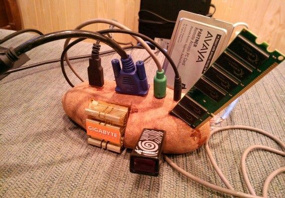

<picture>
  
</picture>

## Outline

- **Due date:** Fri 22 Feb
- **Mark weighting:** 40 marks
- **Submission:** at [the exhibition](/deliverables/04-IoT-artefact/#the-exhibition)

Throughout the course you get to design and **build** a prototype IoT
[artefact](#why-is-it-called-an-artefact) exploring the theme _(dis)connecting
together_.

This artefact can be as creative or conventional and as use(ful/less) as you
like, but you should use it to think through the wider context of IoT systems.

Some creative examples:

- [_Being Radiotropic_ (wifi networks in sync with nature), Tega Brain](http://www.tegabrain.com/Being-Radiotropic)
- [_Six Monkeys_ (physical interactions with email), Brendan Dawes](http://brendandawes.com/projects/sixmonkeys/)
- [_Re-Wired / Re-Mixed: Event for Dismembered Body_, Stelarc](http://stelarc.org/?catID=20353)

Some more traditional examples:

- [_Solar Freakin' Roadways_](https://youtu.be/qlTA3rnpgzU)
- [_Toymail, wirelessly-networked toys_](https://youtu.be/Onb6Gqtf41Y)

If you see more interesting (and inspiring) projects, you should
[blog](/deliverables/01-design-blog/) about them.

## Spec

This is really open-ended: you get to decide what software/hardware you use
(although we'll certainly discuss some of the better options as part of the
course). You should start looking around now---look at what the maker/IoT
community is building and see what interests you.

However, as discussed below in the [FAQ](#faq) your artefact must at least

- be a _thing_
- be connected to the _internet_ (or at least to other devices)
- have sensors and/or actuators to sense, process and act on the world in some way
- be suitable for public exhibition

If you're unsure if your project ideas satisfy any of the above criteria (i.e.
is it a thing? is it connected to the internet?) then you need to discuss with
the course convenor. It's inevitable that some projects will fall more on the
_internet_ side and others more on the _things_ side of the IoT spectrum, and
that's ok---we want to give you heaps of freedom to build the thing you want to
build. But if there's any debate about whether your project satisfies the spec,
the course convenor's decision is final. So if you're in doubt, have a
conversation early on (in fact, you should do that anyway).

## Materials

If you get cheap flights, you can use the leftover scholarship money on
equipment (see the [FAQ](/faq/#can-I-spend-on-equipment-microcontrollers)). However, there's no additional
money for equipment. Most of the stuff you buy should be fairly cheap
(especially if you buy online from China).

If this funding situation is likely to be a problem, then [let Ben
know](mailto:ben.swift@anu.edu.au)---we don't want this to be a dealbreaker, and
there are ways we can help you out.

## Submission process (i.e. the exhibition) {#the-exhibition}

We'll hold an exhibition held on-campus in O-week for Semester 1, 2019 to
showcase the artefacts that you all build. The details are:

- **Date**: Friday Feb 22
- **Time**: 5pm-8pm
- **Location**: 1.33 Ground Floor Seminar/Function Room, Building #145

We'll have drinks & nibblies and you'll get to invite your friends to show off
the things that you've done. By the time of the launch party you'll have
released your [design rationale](/deliverables/03-design-rationale/) on the blog, which will be advertised
to viewers to help them understand your artefact.

At the exhibition, the examiners (Ben & Kieran) will wander around and have
conversations with you about your project. You don't get a mark for these
conversations, but it's a good chance for you to explain what you've designed
and built, how it explores the theme, and why it's cool/why it matters. You'll
no doubt also have lots of similar conversations with your classmates and other
attendees of the exhibition. So you should have a think about some of those
questions in advance and come prepared to "pitch" your project.

After the exhibition, we'll (venue permitting) exhibit the artefacts for a bit
longer so that anyone who missed out on seeing them can come and have a look.
After that's done, you can take the artefact home and do whatever you want with
it.

## Marking {#marking}

The IoT artefact is worth 40% of your total grade.

Some of the criteria we'll we assessing your IoT artefact against are:

- **ambition**; how ambitious is your project, either in a technical, creative,
  or cultural impact sense?
- **technical quality**; does it work as it's supposed to? is it robust, or
  flaky? is it buggy, does it handle "edge cases" well or does it just stop
  working?
- **demoability**; can you do a slick, polished "demo" with your prototype? is
  it easy to show off why it's cool using the artefact itself, or does it need a
  heap of explanation?
- **engagement with the theme**; how does your project
  allow/suggest/cajole/force people and things to be more
  connected/disconnected? how clearly do these affordances come across in the
  design of the artefact?
- **wow factor**; this is a really hard one to measure, but it's at the heart of
  so many great artefacts---does it make you go "wow"? does it make you
  laugh/cry/think? does it make you hopeful or despairing for the future of
  humanity?

You won't receive a mark at the launch party, but the way you present the
artefact (both in the exhibition space and also in your [design
rationale](/deliverables/03-design-rationale/))
will help the assessors understand what you've done and assess it accordingly.

## FAQ {#faq}

### Does it have to be connected to the _internet_?

Well, yeah---it's the **I** in **I**oT. Or at least, it must be networked in
some way. Your artefact can have plenty of parts which don't connect, but there
must be some component which is networked. The internet-y-ness needs to be more
than superficial as well---it's not sufficient to building some non-networked
thing and just slap an antenna on it.

We want to be accommodating here, so there are probably ways to take what you're
interested in and add some networked dimension, so have a chat about your ideas
on the forum.

### Does it have to be a _thing_?

Well, yeah---it's the **T** in Io**T**. If the ideas you're interested in are
conceptual/mathematical rather than physical things then you'll have to figure
out some way of exploring those concepts through a physical artefact.

We want to be accommodating here, so there are probably ways to do it well
(perhaps a physical game/sculpture which represents the concepts you're
interested in) but you'll need to discuss with us first.

### Why is it called an _artefact_? {#why-is-it-called-an-artefact}

The word _artefact_ comes from the Latin phrase _arte factum_, combining ars
(skill) + facere (to make). That seems like a nice, highfalutin' description of
what we're trying to do here.

However, it could easily have been called a _prototype_, or a _system_, or some
other word like that. So don't worry that in using the term _artefact_ we're
looking for something in particular that's not a prototype or a system---it'll
be both those things as well.

### So am I supposed to build a sculpture, or a commercial product, or what?

We've deliberately left it open-ended; it's up to you. Whatever you build, one
of the [learning outcomes](/outline/) of this
course is that you "critically examine the Internet of Things as an emerging
group of technologies", so you're not just building widgets to sell and make a
profit---you need to [reflect](/deliverables/03-design-rationale/) on what your design means in that
broader context.

Still, if you wanna design & build something which _could_ turn into a product,
then that's great.

### Does the artefact have to be _good_?

Yes, of course! However, "goodness" is a multifaceted quantity, and so you may
get the opportunity to choose certain notions of "good" over others. For
example, your work might be exploring the persistent surveillance which comes
with many always-on network-connected IoT devices, and it might choose to "lean
in" to this lack of privacy by violating user privacy in some really heinous
way.

From a privacy standpoint this isn't a good artefact, but it might be _good_
from a commercial one ($$$). Finally, it might be a good artefact if it
highlights the invasion of privacy and starts conversations about the pros and
cons of IoT stuff, or how to mitigate these risks, or something like that.

All this stuff is nuanced, and we expect you to think through what you're
building and why you're building it. That's why we get you to write a [design
rationale](/deliverables/03-design-rationale/) to
accompany your artefact.

### Does it have to be small/portable/able to be set up in the exhibition space?

Not necessarily---if you've got an idea for something that's really big, or
geographically distributed over a large area, or some other thing which wouldn't
fit in a gallery space, then you can present the _concept_ and other
documentation (e.g. videos) at the exhibition. You'll still have to build the
artefact and figure out a way for us to assess it, but I don't want you to be
limited (necessarily) to room-size things.

Anyway, if you've got ideas along those lines let us know and we'll figure out a
way to present it at the exhibition.

### When do I have to be in Canberra? {#when-do-i-have-to-be-in-canberra}

There are no hard and fast rules on this---I understand that people want to head
home for Christmas/New Year and all that. The hard deadline you have to be back
for is **Mon Feb 11**---the week before the [exhibition](/deliverables/04-IoT-artefact/#the-exhibition).

However, Kieran and I will be back at the ANU from when it opens after NY (Jan
2), and we'll be around to help you out with your design from then until the
exhibition.

I understand that accommodation might be tricky/expensive for some of you over
the summer so you should obviously take that into account as well, and we'll be
available for help on the forums the whole time (wherever you are). We won't
deliberately disadvantage anyone who stays elsewhere, but it's just the reality
that working together in the same place as others doing the same thing is
super-helpful, so try and get back to Canberra as early as you feasibly can.

### Can we work in pairs? {#can-we-work-in-pairs}

Yes! In fact, we encourage you to work in pairs. Use [the forum](https://discourse.cecs.anu.edu.au/c/china-study-tour) to discuss ideas & locations and find someone to work with
in this course.

Still, there are a couple of things to consider in terms of getting into pairs:

- if you're in COMP2710 you have to pick a partner in COMP2710 (and same goes
  for COMP3710)
- if you're keen to work in a pair but don't know who to ask, then Ben might be
  able to match you up with someone
- if you're not going to be in Canberra over the summer then it'd be a good idea
  to choose a partner nearby

### Ok, but do we _have_ to work in pairs?

Look, I'm not gonna force you. But just remember that working together is a
great opportunity to collaborate, and so if you go it alone you're missing out
(and you'll have to do all the work yourself).

### I need a workshop to build some parts of my artefact---where can I find one?

Use the lab in the physics makerspace---it's awesome. It's worth staying in
Canberra for (at least part of) the summer :)
