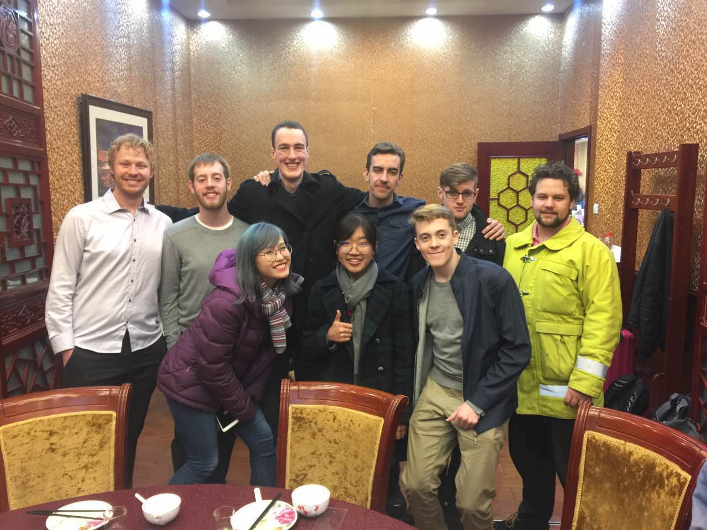

This blog is the place to keep up our the work-in-progress as we build some
[things](/deliverables/04-IoT-artefact/) and put
them on the internet. There will be a blog post from every member of the IoT@BIT
crew every week, so check back regularly to see how we're going.

This blog isn't going to have a comments section, but if you're interested in
getting in touch or discussing any of these projects, get in touch with
[Ben](mailto:ben.swift@anu.edu.au) and we can make it happen.

Not much has happened yet, but to kick things off here's a photo of the 2017
IoT@BIT crew:

