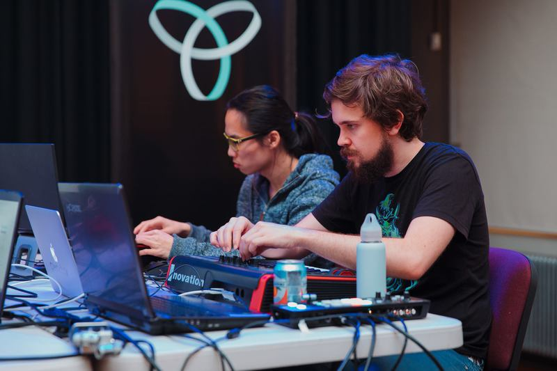

## I'm just gonna write down my first thoughts, and see where this takes me...

### A little about this blog and myself

Hey everyone, my name is Brent Schuetze and this is my first (of many) blog posts in a series surrounding my trip to Beijing for my first dip into the world of IoT and other related topics.
I was born and raised in New Zealand and moved to Australia and began UNI in 2016.
I'm a _now_ 4th year Bachelor of Advanced Computing (Hons) student at the ANU, majoring in Cyber Security. I have tutored for some of the COMP courses run at the ANU and have also been involved in the inception of the [ANU Laptop Ensemble (LENS)](https://www.youtube.com/channel/UCIU6SqIS02GJlnLOPqlwmpA).  
I haven't had much to do with the IoT prior to this, only brushing against it a few times here and there, so I am looking forward to getting my feet wet and exploring more of what is possible with the IoT.

#### Idea sketchpad

The central idea of (dis)connecting together is quite intriguing and I've been thinking about what I can do around this theme. Some ideas I'm interested in pursuing are about abridging some of the activities and moments that are normally about disconnecting and bringing them into the digital so that distance doesn't have to be such a limiting factor. In this theme I have been looking at what IoT devices I can come up with to supplement periods of long-distance in relationships, as I believe a lot of the things that already exist require you to be very active in the current activity you are actually engaged in, whereas nothing captures the sense of just being together, even if you aren't explicitly interacting.

#### One thing, before I go...

Before leaving for China, I've been looking into ways of maintaining some form of connection with things I need from back home. I've set up email forwarding to an outlook account with is unlocked in China (unlike Gmail etc.), I've also put my sim card in a tablet I'll be leaving at home, so I am able to view and send sms and calls while in China.  
As a final precaution I've investigated VPNS and what works and what doesn't, as far as I can tell it looks like they're blocking VPN traffic as well as the IPs associated. The VPN I subscribe to is [NORD VPN](https://nordvpn.com/) which has an [obfuscated server](https://support.nordvpn.com/#/Connectivity/Troubleshooting/1047408742/Connecting-from-a-restricted-country.htm) mode which is supposed to work in China, so fingers crossed!
