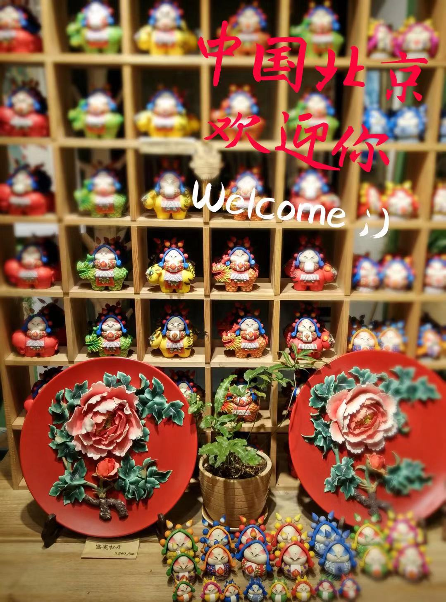

Hello all, this is the beginning of Kathleen's blog for the **Internet of Things China tour**.

## Saying in the very beginning ...

As in the initial stage, I am still confused about my actual
chosen applied direction for the _internet of things_ ...
I may share more detailed design ideas with deeper
understanding of _internet of things_ through my study in Beijing.

Currently, with my limited previous knowledge and
some _Baidu_ research, I only get some brief ideas to share...

## Brief Initial Ideas

For the whole program, we plan to concentrate on the
applied **_things_** of the _Internet of Things_, rather than
the pure theory or concept.

Actually, the application is extended to many real-life areas,
the main requirements for the **_things_** are simply

- Receivers for related information
- Data transfer channel
- Storage function
- CPU
- OS
- Professional (related) application program
- Data sender
- Communication protocol
- Identifier in the Internet

The area that I am pretty interested in with my research is
**Intelligence Detection & Reaction technology** (_some
Real-life Monitor System_): 
We can use _the internet of things_ to monitor the corresponding
change in real life, through the condition classification and
high-speed precise calculation, then report final results to the _centre_
and give some relevant response (behave) on real life again.

It can be any interesting thing in modern city life or daily home... ;)

Actually, as it is a valuable chance to work with you guys just
on one project in holiday, I am quite excited to work in pair.
So the final area can also be chosen with our further communication~

Moreover, (as I am also in double degree of actuarial),
I also have specific interest in the **combination** of _Internet of Things_
and _Financial area_, while we can take another look...

## All Best Wishes

Finally, hope we could have a wonderful time in Beijing & Canberra (later) ~
Already look forward to study and work with you!

_(The below photo taken by my last visit to Beijing.
They are all different kinds of "兔儿爷" -- a Beijing traditional handicraft,
representing happiness.)_

**_Overall, welcome to China!_**

