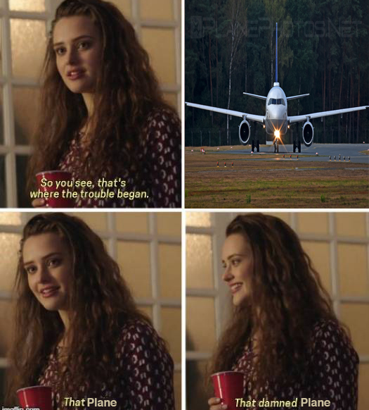
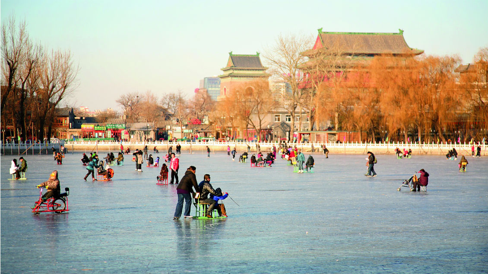

Last week on Ripples in The Red Dragon, I made terrible jokes and puns..
This week follow me in a journey in China as I explore the field **Internet of Things**,
Delve into my mind as I share my ideas, passion, and knowledge that I will steadily build upon my time and experience in Beijing.
I look forward to our time together and to exchanging invaluable concepts. :)
For **LIT** photos documenting this trip follow me on Instagram @despacitoflorescondezo

## Adventures at The Airport ...

You see, thats where the trouble began. That Plane. That damned Plane.

I arrived at the airport at 12pm on the 24th any my plane was to start boarding at 1:05pm. I proceeded to line up to get my boarding passes however I was faced with an enormous line with just 1 worker at the front desk who was stuck helping some person. As time passed it was 12:50pm and I was still nowhere near the front of the line. As I kept looking at the line I started to get anxious and nervous about my flight, however in the next few minutes the line cleared up and i managed to get my boarding passes, only to find out my plane was being delayed by 1 hour. After an hr the plane finally arrived and all was well.

That was until I reached Sydney where I found out I had missed my flight due to the delayed flight from Canberra to Sydney. So I talked to Singapore Airlines and they rescheduled me for a flight at 7:00pm and told me to wait at Gate 51. I had 4.5hrs to kill so I just had some food and waited until 7:00pm to board until I got a phone call telling me that they gave me the wrong Gate and that the plane has already stopped boarding. At this point I was very upset and they told me the only flight they could rescheduele me on was a 9pm flight back to Canberra followed by a direct flight to Singapore and then Beijing, so I took it.

From then on everything went smoothly until I arrived in Beijing. When I arrived and went to collect my luggage I noticed that my luggage was not there. This led me to filing a claim at the luggage enquiry center and having no luggage.

I did get my luggage eventually however only after 4 long days of struggling to wear clean clothes.

## Life in Beijing

Apart from the trainwreck that was the flight to Beijing, I have experienced many wonderful new experiences in Beijing. First of all the hotel is very hospitable and comfortable. The classes are very insightful and teach us a lot about IoT and topics surrounding.

Last week i was talking about combining IoT with household appliances, This week i started thinking about the office setting and how many office appliances could be combined with IoT.

## Current Idea

The office setting is made up of multiple things, for example a regular office desk contains things like computers, fans, monitors, lamps, thermometers, speakers & etc. Now imagine if we combined these things with IoT to connect them together as a smart office setup. This Smart Office could be controlled via mobile, tablet or even a computer application. You could lower the temperature and control your desk lighting with a simple click without having to get up to do this. I think this could definetly benefit the workplace and cut back on loss of time and not only that but maximise productivity.

I've started doing some research and brainstorming on how to go about connecting these devices through the internet and checking the costs of the technologies and supplies I would need to realise this. Aside from that I still have yet to come up with a structure plan on my project but hope to start soon...

## Warm Regards

To sum up my post, I've had an amazing and educating time this week learning the wonderful culture in Beijing while exploring the field of IoT and I hope next week is as much educational and fun as this week was and hopefully better now that i have my luggage.

Ciao.

