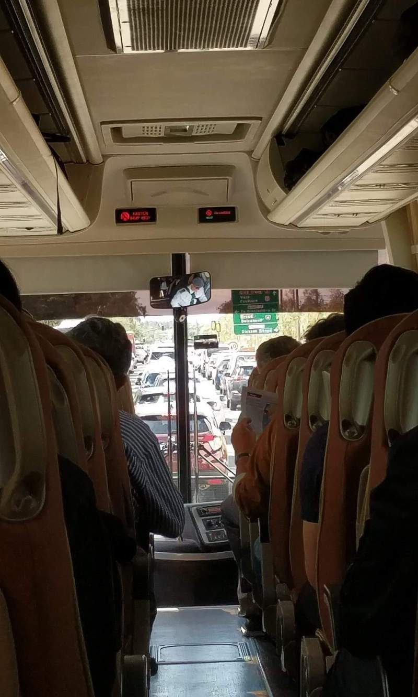
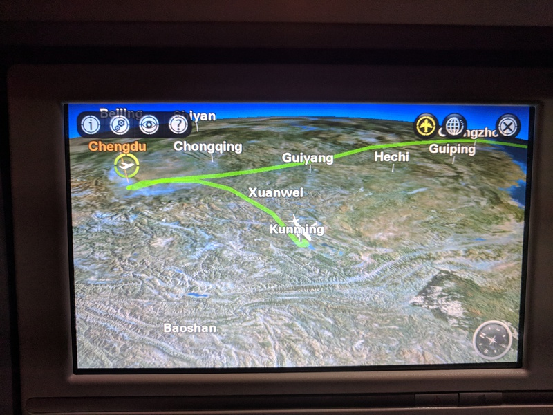
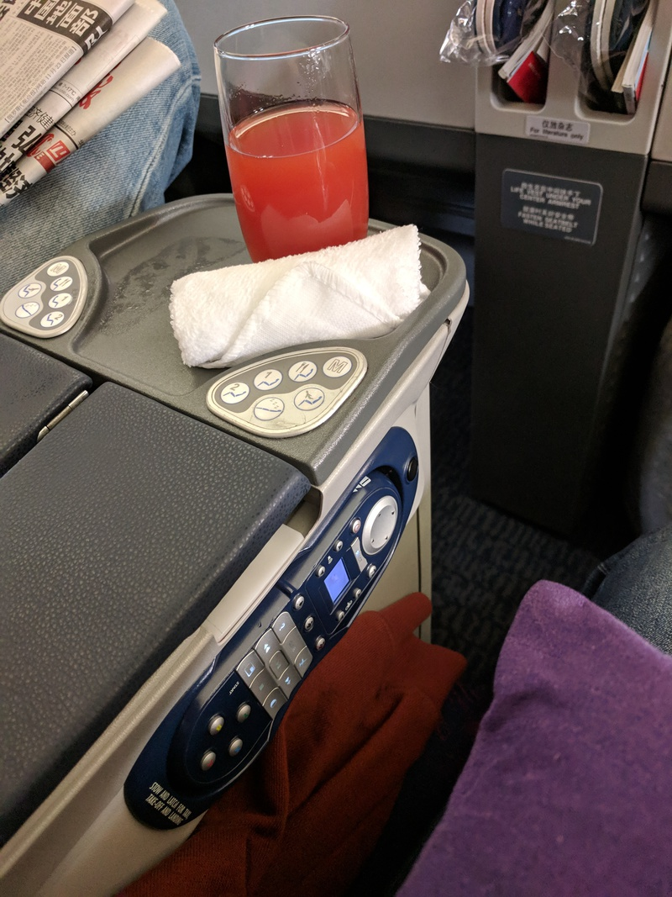
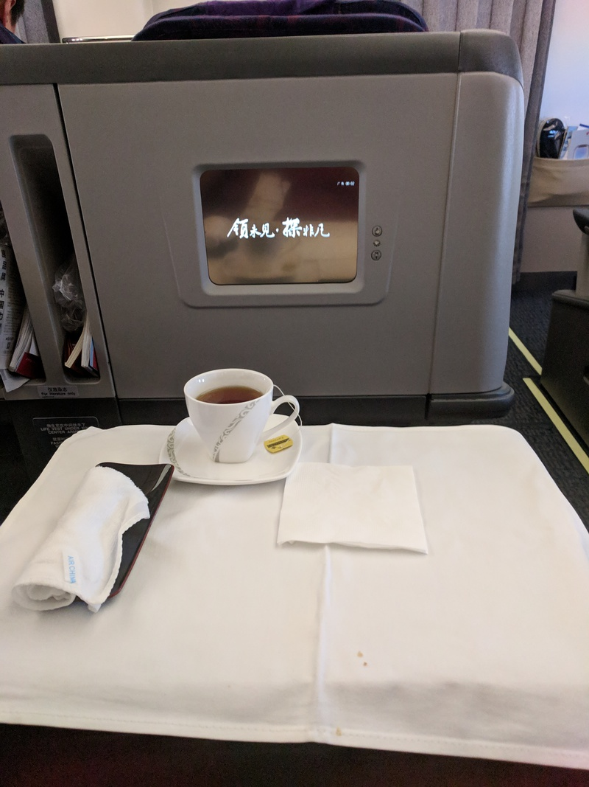

## Travel

### A slow start

I boarded the bus for Sydney (from Canberra) at 3pm, this was mostly uneventful, however leaving Canberra turned out to be quite a painfully slow experience, with traffic being backed up (heading North on Northbourne) all the way back to Dickson area. As best as I could tell the lightrail construction was to blame, so it's not something that would happen too often, but it was enough to start the journey off on the wrong foot.

#### The Maccas incident
Now I'm not usually a fan of McDonalds, and would generally prefer to eat most other takeout, but for something that will be okay for a late-night snack on the plane, I thought it would be fine. I ordered my meal just as the info board switched to "go to gate", plenty of time... right?  
Wrong, the flight boarded and then changed to "Last Call" and I still hadn't received my food, at this point I'm torn between "surely it must be coming right now" and leaving the meal I paid for to make sure I don't miss my flight (also the 3 others I was travelling with had got tired of waiting and had gone to board, not that I blame them but definitely added to the situation). Finally, my meal did arrive and I quickly scooted onto the plane.

### No information (#thelostbois)

The flight from Sydney to Chengdu started off well enough (once I had boarded that is), departing roughly on time at 9:43pm local time. On the flight I probably only got about an hours sleep, not that that's too unusual, but here is about where things start to go south.  
We were told that we would be landing in about 30 minutes, however after a considerably longer length of time, an announcement came over the intercom in mandarin, now obviously I can't understand that, but the sudden groans and general mood shift was enough to tell me something was off. The english announcement came next, however it was too fast and muffled for me to make out, so I checked the flight map, we had been circling Chengdu and were now flying away from it.

After about an hour, we landed in Kunming however the plane did not dock at the airport and we were told we would be staying in the plane. Hours dragged by with no updates, only announcements that "we have still not received any information".  
After 5 or so hours, we finally depart the Kunming airport for Chengdu and after yet another hour we finally arrive in Chengdu.

### Speak to the manager
Arriving this late in Chengdu presented a new problem, we had completely missed our connecting flight and would need to reschedule. After collecting our luggage, we headed to the Air China desk in the domestic terminal, the first staff member we talked to informed us that there were no more available spaces on flights to Beijing today and that we would most likely have to get a connecting flight tomorrow.  
Thankfully we had a native speaker, otherwise we would've been shit outta luck (thanks @Zoey, literally saved our asses). The manager put us on a flight that was originally due to leave at 8 in the morning but was still awaiting a departure time at 2:30pm and he wasn't sure when it would have one (read: it might leave at any time, so we needed to hurry).  
We rushed through security (where I had my beard swabbed for explosives) and made it to the gate to be greeted by an angry crowd of people, next thing we know a big line formed by the counter at the gate. Turns out (paraphrasing) the people on the flight complained and said the flight was being mean to them and asked for money to make it better. So we lined up and sure enough...  

### Business class
In the final twist of fate today, when I went to my seat on the flight someone was already sitting in it (a girl next to her boyfriend), she asked if I'd be okay swapping seats, and not being one to get in the way of love I said sure, a flight attendant lead me to my new seat... which was in business class.  

## IoT Artefact Ideas
Anyway... onto IoT stuff.  
We haven't done too much to do with IoT in the lectures and other things while at BIT this first week, but I have been thinking on how to further the ideas that I was interested in originally.

### Tabletop RPGs
This is something I'm personally interested in and quite enjoy, so I've been thinking about how to bring it online in a more meaningful way and see what I can create to make an online interaction feel more authentic.

**Dice Rolling**  
This is something that I find kind of hard to explain, but the kinetic action and anticipation that emerge from rolling physical dice really contributes to the overall feel of a tabletop RPG. Clicking a button and getting a value is something that takes a lot away from this and makes the experience feel less authentic.
The issue with letting someone roll their own dice in an online session is that you have to rely on them to not lie about what value they rolled, which is mostly fine but as with all things based on trust, you can never be sure. What I propose is a small IoT device with a camera mounted on a telescopicarm that is able to detect what value comes up on a rolled dice and broadcast it to a chat room or other bespoke program.  
The main issue with this is that I would need to be quickly and accurately able to pickup what value is displayed on a rolled dice (multiple if possible) with a camera, I haven't researched much into how to accomplish this, but perhaps custom dice could be use with symbols on the faces that would make it easier for the camera to detect what value has been rolled.  
While it is definitely possible to do this, that challenge will be doing the calculation on a small embedded device, or perhaps passing the image across to a server for it to do the calculation instead.

**Map Drawing**  
Another issue with online campaigns is the speed and quality of map drawing, it takes a long time to draw maps and the details are not as good as hand drawn maps with 5ft grid squares. I'm still thinking of how to best replicate this (the smart whiteboard is a nice, if not somewhat impractical solution [see below](#collaboration-with-the-iot)).  
An idea I had was to mount a small projector to a tripod to project the map down onto a table or other surface and draw the map with a stylus on a tablet. The issue with this is that without a large enough drawing area, the advantage of using a physical drawing apparatus is somewhat lost. If I were to continue with this idea I would need to find a happy middleground between practicality and usefulness, which may not exactly be easy, especially on a realistic budget.

### Long Distance Connections
Another thing I have thought about around the theme is connecting over long distance in relationships. Most existing devices for this require quite active interaction, like video calling or other intimate devices.

**Imitating Silent Closeness**  
Living with someone, I don't think it is really talked about but moments where you aren't exactly interacting but being close is something that is not replicated at all when in separated by distance. Something I imagined was setting up some devices to translate location and action and display it to the opposite person. Like a lamp that glows based on how close the other member is to it, or a changing artwork that paints the movements of the other partner as they move around.

## IoT Research
### Gaming with the IoT
**Isotopium**  

  
*Skip to around the 2 minute mark, (has commentary).*  
  
Isotopium is a rather interesting project which makes use of short range RC devices and turns them into IoT devices, creating a mixed reality game accessible from any device with an internet connection.  
It takes place in a scaled version of the radioactive Chernobyl environment (a 210 square meter scale copy). Users log in to a browser and are able to control an rc tank (robot) located in this environment.  
The tank has sensors and other devices mounted on it to facilitate control and interactions with the environment, for example, a camera mounted on the front of the tank transmits a video signal which acts as the view-port for the user.  
It also has other modules such as a laser to act as the main gun of the tank and telescopic arms to assist if the vehicle were to become stuck or roll over.  
Isotopium is the first game of its kind and is an interesting peak into what the world of IoT gaming may look like in the future.  

### Collaboration with the IoT
**Realtime Board**
[Realtime Board](https://realtimeboard.com/) is an online real time collaboration tool for immitating whiteboarding sessions across the internet, allowing users to easily collaborate over distance and still have the same visual aid that they would have if they were collaborating in person on an actual whiteboard.
While this app itself is not an IoT device, it is very easy to see how this could be combined with a [smart whiteboard](https://www.amazon.com/SMART-SB660-64-Inch-Interactive-Whiteboard/dp/B0036743QQ) or other large touchscreen device to enable an all in one solution to long distance whiteboard based collaboration.
