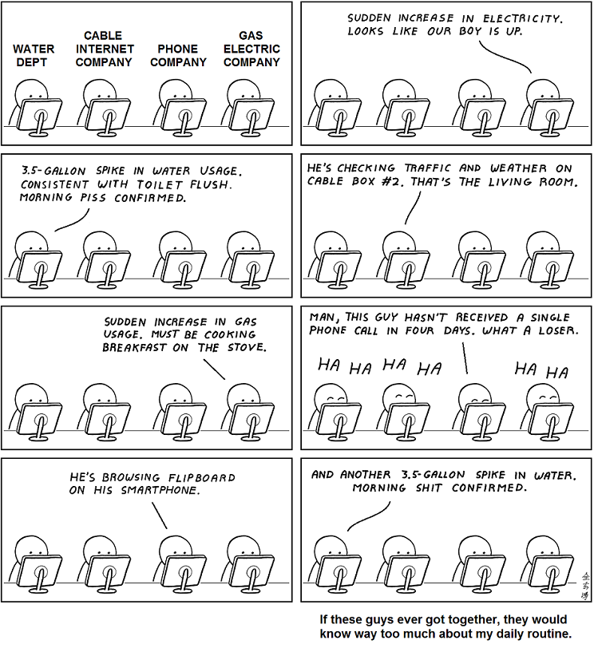

Comic licensed under CC-BY-NC 3.0 USA. By Abstruse Goose https://abstrusegoose.com/553

As indicated in the previous post, my main focus for the artefact is privacy (or lack thereof).

## Surveillance

At the moment I'm leaning towards building a low cost surveillance system, instead of an automatic exploitation system. While the latter is certainly more interesting, the fornmer is easier to express as a physical artefact.

One of the more interesting lectures so far covered side channel leakage of user behaviour through [timing analysis of electricity consumption](https://en.wikipedia.org/wiki/Nonintrusive_load_monitoring). This has me thinking, maybe along with bog standard audio visual surveillance, maybe I could build something that taps said side channels.

The most obvious option would be tapping into the data mobile phones already emit - wifi hotspots and so on. More interestingly, I could try [listening for footsteps](<https://en.wikipedia.org/wiki/Sandworm_(Dune)>) to track people. Perhaps add sensors to garbage cans to track people's buying habits (though I'm yet to figure out how to prevent them from occluded). I'm sure there are more possibilities, that I've not thought of yet.

With these, there are multiple scales on which the artefact could work. What I would like to try is Minority Report-like ~~profiling~~ personalised advertising. We could perform some kind of correlation attack - for example recommending Water to somebody who just disposed of a packet of chips or a sports drink to someone who seems to have been running. If ethics is no boundary, we could also pipe mic input to a voice recognition service, and use that to find relevant advertisements.

The key disadvantage of this kind of attack is that it requires computational power, and lots of it. Which can be an issue if we are trying to use an array of low cost battery operated devices.

Maybe this could be circumvented if I use the services of a megacorporation like Google, however that would take this project from "art" (with immediate destruction of data) to something that actually does feed [the beast](https://www.youtube.com/watch?v=enBllfqkMEw).

## Meshnets

While adoption of technology typically strips away user freedoms, it doesn't _have_ to be that way. The pervasive censorship in China (when not connected to a VPN) is something that bothers the hell out of me.

The main reason the Great Firewall is as effective as it is, is the centralization of information - hosted by a few major companies like Google, Microsoft, or Facebook who either kowtow to the ruling jurisdiction or are blocked outright.

This can be prevented by relying on more, smaller servers, however that is not sufficient because the data you access is still subject to filtering by the ISPs.

This is not limited to political censorship in authoritarian regimes, but also increasingly applies to the "free" internet, where copyright maximalists (ineffectively, so far) try to curb file sharing, which ends up restricting free culture (cf. Youtube, EU Copyright Directive Articles 11 and 13).

So perhaps I could build some kind of distruption and censorship resistant decentralised storage using a mesh net, that uses peer to peer networking to transmit information. It fits in with the "(dis)connecting together" theme quite nicely, and clearly can be expresed as an physical artefact.

The obvious starting points for the application layer would be the bittorrent protocol, i2p and IPFS.

However, I still need to research and figure out how basic routing would work.

I also haven't researched existing meshnets sufficiently yet, so I do not know if I will tread any new ground with this.

If I do go with this, I will likely use a network of Rasberry Pis and SD Cards but it doesn't strictly need specialised hardware. In a dense metropolis, we could tap into smartphones (though on budget models storage might become an issue).
