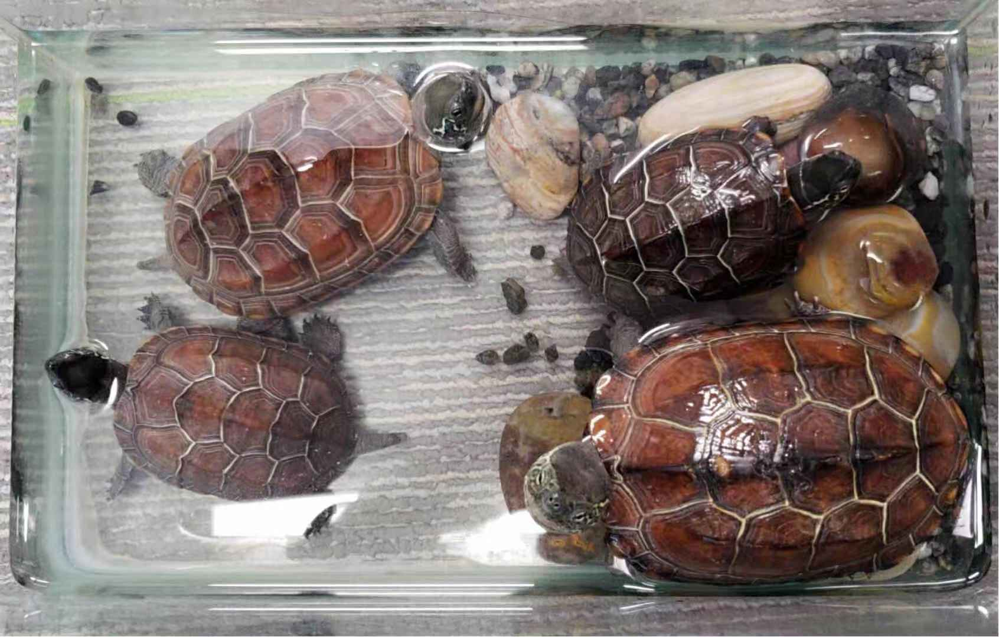

Time flies, we have already come to our 2nd week of Beijing tour~

It is still an enjoyable journey for Chinese cultural things, in particular, I really enjoy the Forbidden City (it is exactly my most favourite one due to my love of Qing Dynasties' history...) Also, excited to go out to explore more interesting places, such as cat cafe~ Already loved the students around me~ (^&^)

In study area, I understand the definition of IoT better, and think deeply of what I am able and truly interested to do for the final project. That is what this post mostly talks about...

## Previous Ideas Not Expanded

In the last post, I have mentioned my initial idea for the whole project: **intelligent home camera monitor** and **financial IoT**, while through one extra week's thinking, I think I may not extend them this time, although I still have large interest on them. ;)

The main reason that I give up the *"financial"* aspect expansion is because with some more discovery and thinking, the project seems contain large amount of professional financial analysis knowledge. Although it also satisfies my expectation to combine my two degree knowledge, I really hope for my first IoT project, I could explore more in "pure computer part". So I may discover it in the later time...

For the *intelligent home security reaction system*, I specially gain the idea from the "Computer Vision" class, and from my expectation, the main technique to use is: to figure out what the specific pattern means, inside a static one-second photo (gained from the real-time dynamic home video recording). If the pattern is human-being (supposed they are thieves...) or fire, etc., we need to notify the home owner through the specific app, and take the corresponding action immediately. In addition, I choose to use camera directly rather than using the combination of various sensors (e.g. smoke sensor for fire detection, temperature sensor, light sensor...) is that, it can be much more efficient~

While the problem is that, actually, to try to classify various patterns clearly and quickly, I hope to design my own software for the "computer vision" part, rather than using existed ones. However, currently, I truly own little knowledge for "image handling"...

That's why I plan to do my final project with some more *"traditional sensors"* -- just as what we use in the "practice project" class (e.g. for temperature and light sensing).

## "Happy Aquarium" Project

### Heuristics

As IoT is already widely used in our real life, I really want to find an aspect that isn't well discovered, but is also practical to our daily life.

With some searches, I found that people developed a lot IoT applications for human-beings (especially for patients), so I try to concentrate on animals / pets. Especially for pets stayed in water, such as fish or tortoises, it seems that people have focused more on the industry level rather than the daily home aspect.

As a girl who have kept tortoises and goldfish as my pets since I was 4 years old, I know it is indeed not an easy work to take good care of them, even if they live in a relatively fixed place. As I am also familiar with their habits. I hope I could make a multi-functional tool to help monitor their living environment in a common home level.

Happily, this time my idea is showed in a more detailed and completed version~

### Main Functions

Considering my experience, I hope to have the following main functions for my device:
	*(as there are also some differences between fish and tortoises' living requirements, I will specially point them out if the function has "a special audience")* :

   - **Oxygen**: It is one of the most important elements to keep your pets alive. I plan to set an oxygen concentration sensor within my tool, and the "oxygen increasing rod" as well. However, I still not decide whether to make the oxygen increasing decision *automatically*, or check with the home owner through the related response *app* (or maybe just some simple commands). *[especially for fish, as they can never come on land for breath]*

   - **Temperature**: As well, the corresponding "temperature sensor" and the "temperature increasing rod" are needed. (We will turn on the rod if the temperature is lower than expected, thus no temperature decreasing function needed.)

   - **PH Value**: If the pet needs to live in a specific relatively high-PH environment, we will prepare some high-PH water through filtration in advance, and do water circulation once the sensor reports the requirements; vice versa. *[may be more useful for fish]*

   - **Feed**: We can have time feed as pre-setting, or it can follow your monitor app's response. In addition, weighing the food to control its actual amount could be a good way.

   - **Light**: *[especially important for tortoises]* Tortoises need to *bask* often as their habit and good for their health. So we need to simulate the sunlight especially if we always keep them inside home. We can turn on the lamp in some fixed time of a day, and adjust the brightness through our real-life requirements.

   - **Land-water Swap**: *[special function for tortoises]* Tortoises are normally *amphibious*. Take my tortoises as an example, they sometimes swim in water, sometimes wander on land. So if we simulate "beaches" using sand and cobblestones, we'd better adjust the aquarium angle (with ground), thus control whether the "ground" could reveal from the water. (This one may need the whole aquarium's movement, it is a little bit harder.)

   - **Seawater Configuration**: We can configure the water to be similar to seawater, to make it better to keep marine fish alive. Nowadays, it's also common to keep marine fish at home especially because some varieties of them are quite beautiful. While it is always hard to keep them alive in a long time. :( (Although this function is also hard to realize, because different indexes need to be checked then~)

   - **...**

Overall, I want to keep different *sensors* and *operating devices* in an "as small as possible" place, maybe gathered in a box... Also, we will need a very good **water circulation system** to maintain the whole idea. That is also a difficult part for the final implementation.

In addition, when your pets first come, you need to input their basic information into the system -- such as their breeds. And the Internet will also help you gain some default required indexes for the specific breed.

### Problems Still Matter

For the "aquarium" device, we need to ensure it is **water-proof**! I am currently not quite sure about the **multiple devices grabbing**, while it seems that the final project quality is also to some extent depends on whether I will gain existed sensors and devices directly reaching my requirements. If not, I also need to design my new type~

Another thing that I am a little bit confused is the **involving extent and way for the Internet** in my whole project. I think I will use the Internet to set defaults, and the sensors may also send feedbacks to the central Internet monitor to control the corresponding devices and even gain some responses from the pet owner.

While since I am actually not familiar with the software parts, I am not quite sure about the expected operating process, such as whether I need to have a real-life response app for the system, or the communication between sensors and the corresponding device can be enough for the IoT topic~ *(I talk to Yuze, Brent a little bit about my idea for this aspect~ Also, Ushini communicates with me a lot about the project thing~ Thank you all guys for your advice!)*

In summary, I am not quite sure whether this "happy aquarium" is feasible for me, while it is at least some benefits for these whole ideas:
	- It is practical and earthy, at least I can do something as the beginning.
	- As the ideal device is with multiple functions, I can design it separately considering my real-time progress, and combine them at last.

Hope everything is better! Keen to do brain storming in my last week in Beijing~
