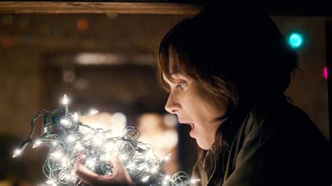
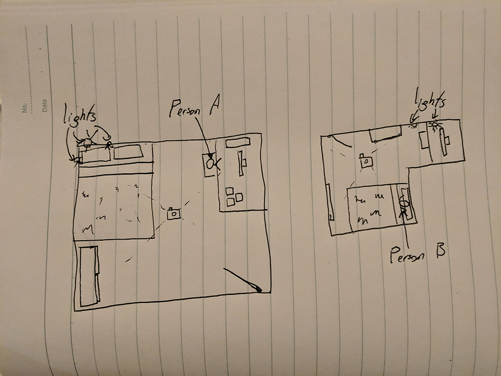

## Presence

#### _How can you simulate or project a person’s presence using the IoT? And would you want to?_

An idea that I have been generating for this project has been centred around long distance connections and what role IoT devices may have in these interactions.  
I have been thinking a lot about what in-person interactions are meaningful, which aren't, what ways can these be abstracted into long distance interactions and how will they feel when compared to the original.

A recurring theme in these thoughts is presence:

- _"the state or fact of existing, occurring, or being present in a place or thing."_

Some of the ideas below will attempt to tackle these points without the person being physically present, or necessarily active an involved in the interaction.

### Location Mapping

This idea is somewhat inspired from a few different places. One of which is _Kieran Browne's_ National Gallery installation, _(in a nutshell)_ this artwork would draw the movements of the art gallery attendees as they moved around the room in real time, hereby etching a person's presence into a work of art.

The other comes from the hit series **Stranger Things**, _(Season one spoiler ahead)_ in this show a young boy is stuck in a shadow realm which is a mirror of earth, in this shadow realm he is able to turn on light bulb(s) on earth accurately to communicate with his mother, thus projecting his presence, or existence into the real world.  
While these instances are interesting in their own right, they are not without issues:

- something that both of these pieces have in common that is not present in my application is that they both occur when there is a very close relation between the area that is being mapped from and the area that is being mapped to.  
  This poses an issue for my idea as I will need to map between two rooms that are very unlikely to have many things in common _(size, shape, layout, etc)_.
- with Kieran's piece, the artwork is displayed on a screen, which makes sense in a gallery setting where attendees will observe the art as an active action, however I am aiming to replicate passive interaction, where the act does not need to be the action members are actively engaging in.

Building on these foundations, I came up with an implementation using camera(s) to track where each person is in a room, and to project that into the other person's room using a series of lights places around the room. These lights will grow and fade as the other person moves around their room _(growing in intensity the closer they are to the light source, and fading to nothing as they move away)_. This portrays the other person's location in such a way that it does not need to be the main thing that the person is focusing on, it can happen in the background and still be felt and observed passively.

Here's a small sketch of the idea:  
  
As you can see, the location of person A and person B is translated to the corresponding locations in each room, even if they aren't the same size or shape.

#### Is this what we want though?

An issue that comes to mind with this idea is that it is venturing into uncanny valley, even the scene it is based on is very eerie. Lights turning on and off without any interaction is something a lot of people commonly associate with ghosts and spirits, not something that everyone is going to be comfortable with, but will the knowledge that these lights represent someone important to you move past that thought?

### The Smart Body Pillow

I won't take credit for all of this, David Horsley gave me the original inspiration so thanks buddy.
Being away from your significant other can be a pretty lonely experience, especially if you're used to sleeping in the same bed. And while there are some things that apply to [other _(more intimate)_ activities](https://en.wikipedia.org/wiki/Teledildonics), they don't cover everything.  
What I propose is a matching IoT band / strap and body pillow.  
The band / strap (depending on which combination of features are implemented) will be warn by the person being imitated and will measure certain parameters about them:

- heartbeat / pulse
- temperature
- respiration rate
- the sound of their breathing

This data will be transmitted to the pillow, which will be fitted out with various components etc. that will then replicate the data. For example:

- a small speaker can be used to play the sound of the person's heartbeat at a matching rate
  - similarly a speaker can be used to play the sound of the other person breathing
- a heating element similar to an electric blanket can be used to heat the pillow to match the person's body temperature
- an inflatable bag connected to an external pump can simulate the rise and fall of the person's chest

An issue with this idea however is that it is not uncommon for people in long distance relationships can be in very different time zones, if this is the case then an option would be to record the data when a person is sleeping and then use that data for the next time the pillow is used so that the data will be closer to what is expected _(i.e the pillow won't be working off data from other activities such as excising etc.)_

#### Again... Is this what we want?

As with the previous idea, this is dipping very close to uncanny valley _(if it's not already well inside it)_, having a pillow simulate things like a heartbeat, breathing and produce sounds is not exactly normal and begs the question whether it would actually help or not. The parameters it aims to replicate are often mentioned as what they miss when people talk about not having their partner in their bed _(when they're used to it)_, however it's not clear whether replicating them would actually help.
