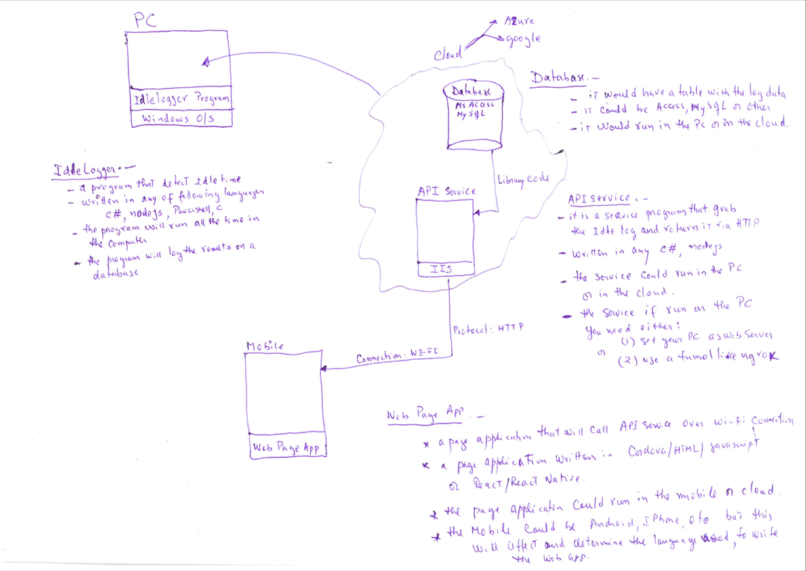
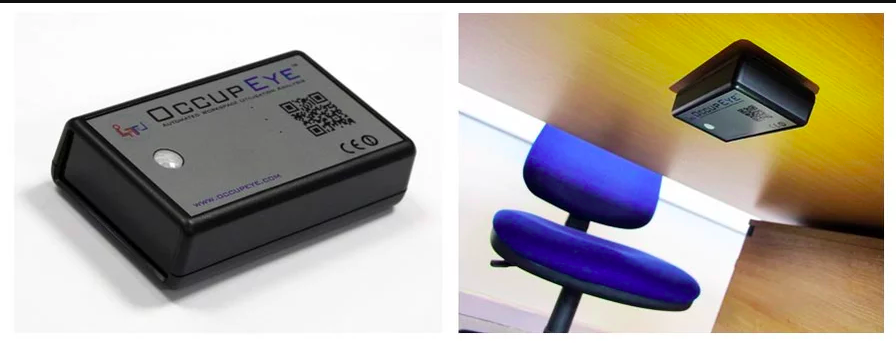

Last week on Ripples in The Red Dragon, there was luggage missing and smart office spaces..
This week follow me in a journey in China as I explore the field **Internet of Things**,
Delve into my mind as I share my ideas, passion, and knowledge that I will steadily build upon my time and experience in Beijing.
I look forward to our time together and to exchanging invaluable concepts. :)
For **LIT** photos documenting this trip follow me on Instagram @despacitoflorescondezo

## Shaoxing
A small group of us (Chinmay, Harry, Adi & Zoey) spent the weekend with Zoey's parents in Shaoxing. Here I got to see REAL SNOW for the first time in my life!!!! It was very exciting and I had an amazing time.

We got tickets to see a Tragic Chinese Opera Show following the story of 2 lovers who get split up by the man's mother an later reuinte when she is already marrried and as a result dies of depression.

<iframe width="560" height="315" src="https://www.youtube.com/embed/x7VeWSjE8V0" frameborder="0" allow="accelerometer; autoplay; encrypted-media; gyroscope; picture-in-picture" allowfullscreen></iframe>

We had an amazing time in Shaoxing and would like to thank Zoey & her parents for their amazing hospitality.

## Artifact

This week I had a meeting with Ben regarding my idea for my IoT thing. This meeting resulted in a slight change of idea to an artifact which is a little more focused on the internet part of IoT. The idea being, having a way of measuring the ammount of time an employee spends working on their desk and adding gamification to this to create some incentive for the employees to want to work more. ie. a scoreboard.

I have been doing some concept work on how the sensor would connect to the micro-controller and that to the network.

### OccupEye

I did some research on whether an artifact like this had already been created & implemented in the workplace and what I found was **OccupEye**.
OccupEye is a fully integrated system that enables users to capture and analyse true 1:1 workspace utilisation figures in real-time, offering the perfect solution to a significant challenge.

The solution comprises an unlimited number of wireless workplace utilisation sensors which transmit utilisation data to a small number of strategically positioned network receivers, which in turn feed the ‘raw’ occupancy logs back to client specific cloud-based analytics systems.
Find out more here: (https://www.occupeye.com/what-is-occupeye/)

Basically a very similar artifact has been created but not for the use of monitoring employees or incentivising employees to work more but instead for providing administrators with a live feed of workplace occupancy, especially among companies that employ “hot desking”, a workspace sharing practice in which employees don’t have a set workstation but log in at any desk that’s available. The OccupEye system can supply employers and their workers with a map of all seats and color code the ones that are free. Universities also use the technology to inform students of open study spaces.

## Presentation

On the last day we had our presentation due, it was incredibly interesting hearing about everyone else's learning outcomes from the study tour and how they applied their learning into projects. When it came to my group's presentation, as we were the only group who managed to get the car fully working 100% we had a large variety of things to talk about. Unfortunately our team was about to go to overtime so I had to rush through my segment on Machine Learning.
In my segment I talked about what Machine Learning is and its application.

Machine/Transfer Learning
Machine Learning refers to a system capable of the autonomous acquisition and integration of knowledge.

Some Applications of Machine Learning
- Self Driven Cars
- Privacy Issues: 3rd Party will have constant access to your location..
- Translating speech
- Home systems
- Google Home
- Intelligence increasing based on the amount used.
- Amazon Echo
- Intelligence increasing based on the amount used.

Major types of Learning
- Unsupervised Learning:
- In machine learning, unsupervised learning is a class of problems in which one seeks to determine how the data are organized. It is distinguished from supervised learning (and reinforcement learning) in that the learner is given only unlabeled examples.
- Supervised Learning:
- A machine learning technique whereby a system uses a set of training examples to learn how to correctly perform a task

Clustering
- Clustering is the assignment of a set of observations into subsets (called clusters) so that observations in the same cluster are similar in some sense. Clustering is a method of unsupervised learning, and a common technique for statistical data analysis used in many fields.

Regression
- Regression allows you to make predictions from data by learning the relationship between features of your data and some observed, continuous-valued response. Regression is used in a massive number of applications ranging from predicting stock prices to understanding gene regulatory networks

## Final Dinner

On the night before the last a group of us headed to the CCTV tower to have dinner on the rotating fine restaurant. The restaurant was a fine dining place so we dressed up and headed via taxi to the tower. Upon arrival we took a couple of photos and went up an elevator that went up so many meters.... Once we exited the elevator we arrived at the restaurant. The food was simply amazing and in the style of an enormous buffet including food from China, Japan, America & France. I basically tried to fill up on as much food as I could. They also had Milk Tea & Yogurt on Tap which was simply magnificient.

<iframe width="560" height="315" src="https://www.youtube.com/embed/YUVt5ANexY0" frameborder="0" allow="accelerometer; autoplay; encrypted-media; gyroscope; picture-in-picture" allowfullscreen></iframe>

## Warm Regards

To conclude this post, this 3rd & last week in Beijing was a great way to end the china study tour. I am going to miss Beijing a lot, From the food to the cutlture I am really going to miss it.

Ciao.

