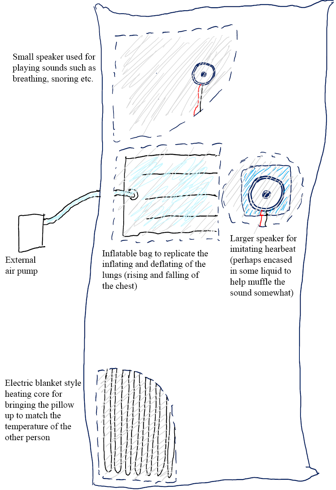

#### _In this chapter, a mood bracelet for the 21st century and the technical details behind a smart body pillow_

## Idea Generation

### EMB: Emoji Mood Bracelet

##### _A Mood Bracelet for the 21st Century_

I came up with this idea after hearing Ushini's group pitch an IoT bracelet for navigating the subway (which I may have suggested should just be an app). The basic concept behind this idea is that you can see at a glance what your partner is doing, and vice versa. The reasoning behind it is that being able to know what kind of activities others are doing at a glance will ease the feeling of separation by still keeping each other in the loop.  
This is achieved by displaying 1 or so _emoji based_ images that represent the activity each person is doing, for example:

- Activity Based
  - 🍗, 🍜, ... : Eating
  - 🏃, 💪, 🚴, ... : Exercising
  - ⚽ : Playing a Sport
  - 🚶 : Walking / Going Somewhere
  - 💇 : Getting Haircut
  - 💅, : Getting Ready
  - 🧳, 🚈, ... : Travelling
  - 🎞️ : Watching a Movie
  - 💻 : On the Computer
  - 🕹️ : Video Games
  - 🛀 : Showering

- Mood Based
  - 😃 : Happy
  - 🥰 : Thinking of You
  - 😪 : Tired / Sleepy
  - 😐 : Neutral
  - 🤨 : Questioning
  - 😒 : Unamused
  - 😟 : Sad / Worried
  - 😞 : Disappointed / Let Down
  - 😳 : Embarrassed / Shy
  - 😡 : Angry

_I think you get the picture_

This bracelet would be small and lightweight, featuring a touch screen for selecting and displaying the emojis, and either a notification LED or a vibration motor to inform the wearer when a message is received, as for connectivity, bluetooth tethering to a mobile phone would ease the burden of networking requirements.  
As for using the bracelet, the interface would need to be intuitive and work well on a small screen, so as to make selecting emojis as quick as possible, if this process would be too tedious then the purpose of the device being a quick and painless way to send and receive info on what the other person is doing. If it isn't faster than pulling out your phone and sending a message then the point is lost.  
This idea is quite malleable, and would easily be adopted as an app for a smart watch or even just an app on your phone, by taking away the ability to type a message, it encourages fast and more regular interaction between people, keeping others in the loop as to what you're up to, even if you're too busy to pull out your phone and type a message.

## Idea Elaboration

### Smart Body Pillow

##### _More Design Specifics_

[In the last blog](https://cs.anu.edu.au/courses/china-study-tour/news/2018/12/07/brents-china-update-01/#the-smart-body-pillow), I mentioned the idea of creating a smart body pillow to imitate certain characteristics of a person so that partners wouldn't feel as lonely sleeping by themselves when their partner is away. It would replicate parameters such as pulse, breathing, temperature and so on. The diagram below shows some more specifics about how this could be achieved and what it may look like in the end.

Collecting the data on the other hand will be a different story, parameters such as heartbeat and temperature are easy enough to read from devices such as a smart band etc. however coming back to reading things like respiration and noise provides some extra challenges.  
If we want to accurately measure a person's respiration, we are going to need some kind of strap to be placed around their chest, this is not exactly going to be comfortable to wear, especially when trying to sleep. However, if we are okay stepping back from the accuracy of the rate of inflation etc. it may be possible to infer this data from the pulse or potentially even from the sounds of breathing in the microphone.  
Which brings me along to the next issue, recording breathing sounds, an all in one data gathering device would require a microphone for this, however if placed too far from the face, we risk losing the clarity of the sound, to fix this, a small external module with the microphone attached could be used, this opens up many options for the implementation, as the microphone could be placed in other locations, away from the body, such as the head of the bed.  
This data could then be transmitted to the main device and aggregated with the rest of the parameters for transmission, however power and connectivity will still be an issue that would need further investigation.
