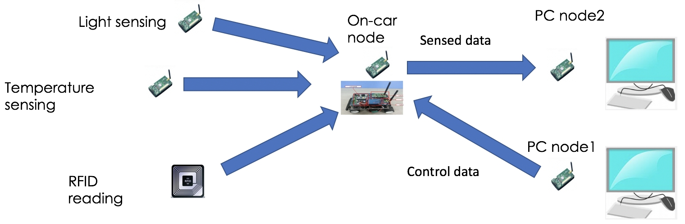
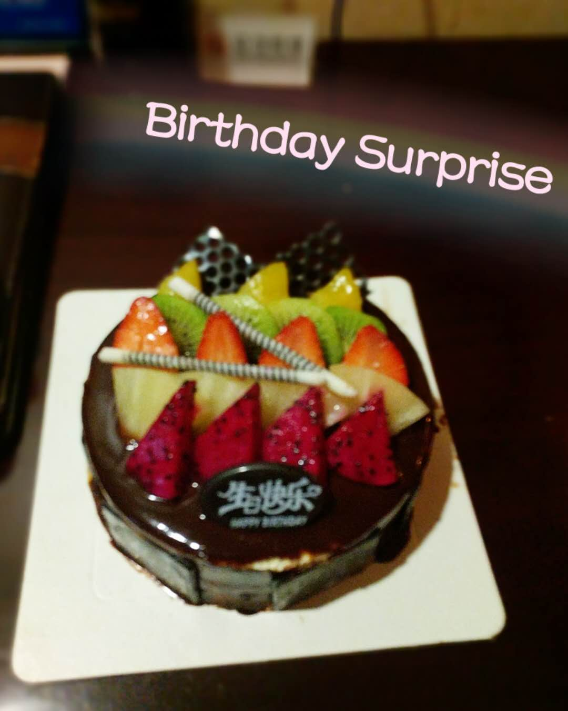

Here comes the final week of our IoT China Tour~ Overall, through the whole time, all things are actually better than I expected, I do value the special experience!

As it is the end of our entire group activity, this week I plan to highlight our together sweet memories, and only talk a little bit about my IoT final project on blogs~

**_When it comes to the last moment, all amazing things happen._** I think it is the key theme for the week~

## Final Car Project Demo and Presentation

In academic part, the most valuable section is Friday's final group presentation. The presentation is divided into "Wireless Sensor Smart Vehicle" project demo & IoT knowledge recall parts.

For **car demo**, it's very lucky that, in the last hour of our project course, our group has all nodes communicating correctly. We combine the initial lighting and temperature sensors' codes with the nodes communication codes, enable the car controlled by PC, and use car node as a medium to finally read sensing data from another PC.

We become the only group that finish all required tasks in the end! (^~^) The only pity is that, through LEDs twinkling in RFID and car nodes, we can know the RFID message is partially transferring successfully in the end. But after we compiled all provided Car Node codes, we cannot read RFID message from central monitor PC.

For **IoT technology revision**, we put it into different sections: Brief Overview, IoT Networks, Data in IoT, Big Data, IoT Device Security. Machine/Transfer Learning, and each of us is responsible for one section.

Overall, I thought our teamwork is excellent~ Even in a tight period, we've done everything well and exactly as our plan. Grateful for my teammates: Jason, Razi, Oliver and David Flores! :)

For the whole BIT IoT courses part, it gives me a brief framework of how IoT looks like and what will be the most common technique tools. Then I could self-explore the practical application things...

## Forever Friendship Wishes

Considering the relatively tight course schedule, I thought we would not have that much time to explore Beijing in our free time. While actually, we do chat with each other on various topics, enjoy the view, go shopping together and explore the night "mysterious" Beijing a lot~

Especially when reviewing my three-week photos, I find the whole process is full of happiness! I indeed have close friends after the trip!

3 weeks isn't a long time, while compared to common-semester 12 weeks that we actually have few chances to communicate in labs or just after lectures, the together Beijing period is really valuable! (^&^)

Now, I am keen to share more details~~ Let's come to my **_birthday surprise_**...

## Happy Birthday

Go back on this Tuesday...

### Six-share Party

At lunchtime, we have the together birthday party in Hai Di Lao Hotpot. Actually, it has an awkward beginning, I knew the surprising cake existence in advance because the waiter mistakenly thought me as one of the student helpers. I thought I am one of the celebrating targets because my birthday is on this Saturday, but I finally found BIT teacher did not take my birthday into consideration...

Thanks for Yadong, as soon as he knew my situation, he helped use _tomato sauce_ to add my name... I am the owner of the most outstanding name at last, lol~

Happy to join the birthday game with other dudes: Namitha, Keagan, Oliver and another 2 unknowns! Love my _cake princess_ toy~ Enjoy long-life noodle with candles and wishes as Chinese tradition. Finally, it becomes a sweet party!

### Night Big Surprise

I thought the group party would be the largest surprise for my 21st birthday, but it was not, the night birthday surprise is the most unforgettable experience...

Well, I really want to keep the whole process mysterious~ ;) ...

Grateful for all your efforts to make everything proceed smoothly and naturally~ Thank Adi C to keep talking with me and transferring my attention, or it won't be such a surprise~ Thank David F to try hard to hide the cake, he did really a wonderful job! Thank Chinmay to lead me to his room as the most wonderful place for surprise [grateful for Brent as well :)] and grateful for the cake idea! Thank Zoey for her most brilliant passionfruit idea, it is the bridge to happiness! Thank Razi for all his words and wishes when he took the cake out, it is one of the happiest moments through my life~ Thank Ushini as being my 5-star roommate, she brings the highlight through my BIT tour~

Overall, **my 21st birthday** celebrating with all you guys in advance in Beijing is indeed meaningful! **Big Hug** here~~~

## Addition for Final Project Idea

It finally comes to the IoT project part... After talking with Ben and Kieran, I decide to **maintain my last-week idea to do some remotely IoT monitor things for my pet tortoises and (maybe) goldfish as well**~ Big thank to them, especially for Ben's support for me as well~

Currently, I have a much clearer idea about how to deal with different sections for the whole process: sensing, checking corresponding commands, transferring data and finally making real reactions.

I am also more familiar with the hardware parts: - which micro-controller or sensors should be chosen - brief idea to deal with water-proof problems - which parts could be physically monitored - ...

I will try to explore more details about my project implementation part through further research... Good luck for myself~

---

In summary, I really enjoy the whole Beijing section of the project~ Grateful for everyone who give me help through the process! Cannot thinking of a better way to spend the 3 weeks without you! (^\_^\*)
