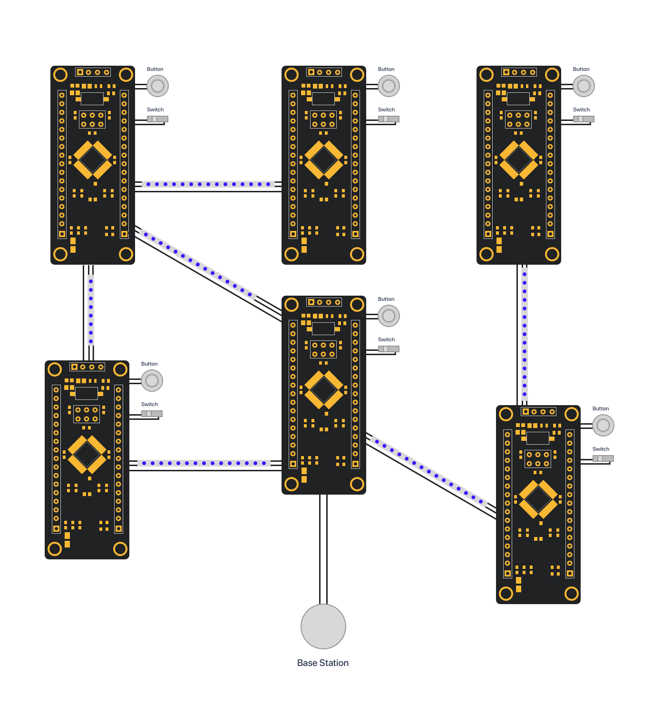

When originally thinking about the artifact, I wanted to build a real product with real applications. Unfortunately, that's difficult and would be uninteresting in the final gallery.

## Initial Concept

Most local networks cover a small area, or have their signals distributed by strong telecom towers. The first idea to provide an alternative — something with wide-area coverage, despite weak signals.

We'd compensate for weak signals by increasing the number of nodes — the density in a particular area. There are multiple issues we'd need to deal with, on both hardware and protocol levels:

- Conserving power (Maybe solar power? What if in shadow?)
- Conserve power by minimising message passing (But the protocol must be decentralised)
- Minimise network "hot spots" near the base station. Rather than pulling in all data from a single node, potentially pull it from multiple nearby ones. Maybe the base station should have a wider range?
- Sensors must be distributed evenly, but must also be able to (indirectly) access all other sensors. What is the best geometry for this? The best pattern? (Explore "optimisation of circles within squares")

## Why I decided against it

Now, that project would be really cool. I'd get to explore the depths of decentralised protocol design, and also get my hands dirty with actual hardware construction/development (Which I haven't done before!)

Unfortunately, decentralised sensor arrays are an open problem. Minimising message passing, evenly distributing network load (on a decentralised network) and optimising sensor layouts are all active areas of research.

I'm not doing a CS or math PhD, nor am I producing a real product. Even if it worked perfectly, it wouldn't be interesting at the gallery.

## New Artifact

Instead of embracing pure practicality in my artifact, I've decided to demonstrate the concepts of decentralised networks in an interactive display.

I envision a set of nodes, connected by LED strips. When a message is passed between two nodes, the LED strip lights up. The user can:

- Turn on/off individual nodes, and see how the routing topology changes in realtime.
- Click a button to send a message, and see how it is routed to the base station.
- Click the base station, and see how all data is collected.
- Twiddle a knob to change the "data" collected by a single node.

Hardware-wise, each node will need:

- A switch (to turn on/off)
- A button
- A potentiometer (or similar knob-like device)
- A few LED strips connect to other nodes
- Wires to connect to other nodes.

I've heard good things about the Black Pill board, which has an STM32 ARM M3 microcontroller. According to my last blog post, we could potentially use Rust!

The Black Pill has many mounting holes, which is perfect for connecting nodes with multiple wires and LED strips.

The concept isn't fully fleshed-out yet, but I like where it's going. Mounting everything on a nice backboard, with some some wires exposed (behind some plastic) would be really cool. I've always loved interactive exhibits, so I hope to embrace that with this artifact.
