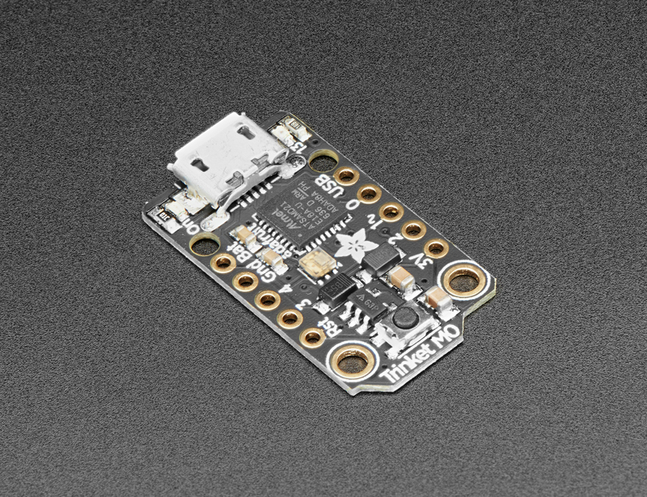

Last week on Ripples in The Red Dragon, I said my goodbyes to China..
This week follow me in a journey as I plan my artifact & explore the field **Internet of Things**,
Delve into my mind as I share my ideas, passion, and knowledge that I will steadily build upon my time and experience in Beijing.
I look forward to our time together and to exchanging invaluable concepts. :)
For **LIT** photos documenting this trip follow me on Instagram @despacitoflorescondezo

## Artifact

### Pitch

As an employer do you often struggle keeping your employees motivated? Do you wish you could know what your employees are really upto? Do you wish you could know how many hrs a day they really spend working?
OfficeEye is your solution. OfficeEye will keep track of the time your employees spend on their desks and whether they are working on their computers or not. OfficeEye will compile all this information and display it for you in a super easy to use UI for you to manage all your employees, alongside a scoreboard visible to employees to keep them motivated and create a competetive environment encouraging employees to work more.

### Hardware/Software Used

For this kind of "monitoring/survalance" system I would prefer for my artifact to be as small as possible to keep it as concealed to the employee as possible. This is to create a safe enevirnoment for the employee. As a result I have researched microcontrollers & sensors that are miniscule in size.
After a substantial ammount of researching, combining accessiblity & budget, I decided to use the microcontroller Adafruit Trinket M0 alongside a small Infrared Sensor.

Using Python i'll send the data gathered by the sensor to a database.
In terms of software & databases & Api's i'm deciding whether to use C# & MySQL or just use Google Firebase's Realtime Database which would make it easier to deploy it. Then for the front-end UI I plan on using Material under the React Framework.

### Milestones

| **Key Milestones**                              | **Start Date** | **Projected End Date** |
| ----------------------------------------------- | -------------- | ---------------------- |
| Experiment with MicroController                 | 27 Dec         | 02 Jan                 |
| Programming MicroController/Sensor              | 02 Jan         | 08 Jan                 |
| **Pre-Minimum Viable Product**                  | 08 Jan         | 08 Jan                 |
| Hooking it up to the database                   | 08 Jan         | 15 Jan                 |
| Connecting the database with basic front-end UI | 22 Jan         | 29 Jan                 |
| **Minimum Viable Product**                      | 29 Jan         | 29 Jan                 |
| Developing/Designing the front-end UI           | 29 Jan         | 05 Feb                 |
| Polishing/Garbage Collection                    | 29 Jan         | 05 Feb                 |
| **Live Version**                                | 06 Feb         | 06 Feb                 |

## Warm Regards

To conclude this post, I look forward to whats to come in the future of my project & hope to show a complete product by the end of the course.

Ciao.

